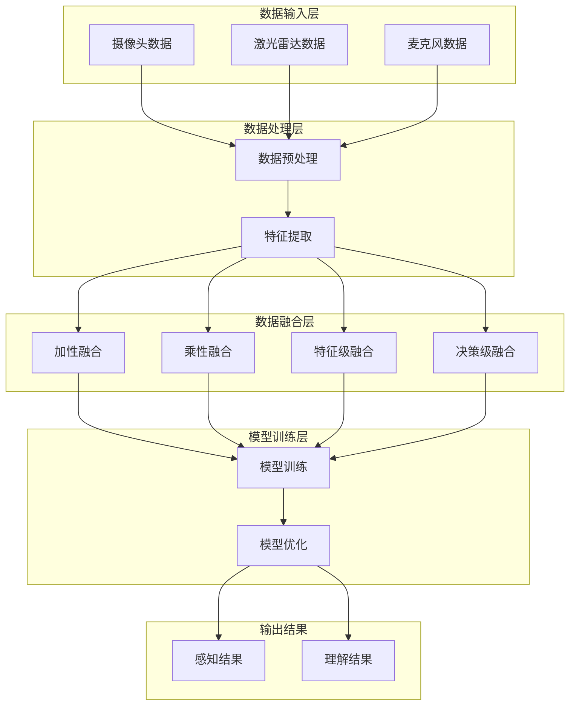
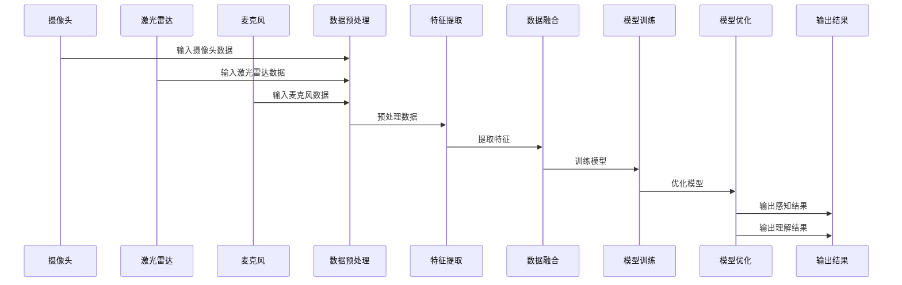

                 


## 多模态融合技术：增强AI Agent的感知与理解能力

### 关键词：多模态融合，AI Agent，感知，理解能力

### 摘要：
多模态融合技术是当前人工智能领域的重要研究方向，旨在通过整合不同类型的数据源，提升AI Agent的感知与理解能力。本文将详细介绍多模态融合技术的基本概念、算法原理、系统设计与实现，并通过实际案例分析，探讨其在AI Agent中的应用与效果。

### 目录

#### 引言
1. 问题背景
2. 问题描述
3. 解决方案概述
4. 边界与范围
5. 核心概念与组成要素

#### 多模态融合技术基础
1. 核心概念与原理
2. 概念属性特征对比
3. ER图与关系结构

#### 算法原理讲解
1. 算法流程与Mermaid图示
2. Python源代码解析
3. 数学模型与公式
4. 举例说明

#### 数学模型、详细解释与举例
1. LaTeX格式与公式嵌入
2. 段落内LaTeX公式展示

#### 系统分析与架构设计
1. 问题场景介绍
2. 项目概述
3. 系统功能设计与类图
4. 系统架构设计与架构图
5. 系统接口与交互设计

#### 项目实战
1. 环境配置
2. 核心实现代码解析
3. 代码应用与分析
4. 实际案例解析
5. 项目小结

#### 最佳实践、小结、注意事项与拓展阅读

### 引言

#### 问题背景
人工智能的发展离不开数据，而数据的多样性和复杂性也在不断挑战着传统数据处理方法。在现实世界中，信息通常以多种形式存在，如图像、声音、文本等。单一模态的数据处理方法已经无法满足现代AI Agent的需求，多模态融合技术因此应运而生。

#### 问题描述
多模态融合技术旨在解决以下问题：
1. 如何有效地整合来自不同模态的数据？
2. 如何处理模态间数据的差异性？
3. 如何提升AI Agent的感知与理解能力？

#### 解决方案概述
多模态融合技术通过以下步骤实现：
1. 数据收集与预处理：收集多种模态的数据，并进行预处理，如归一化、去噪等。
2. 数据融合：利用特定的算法，将预处理后的数据融合为一个统一的表示。
3. 模型训练与优化：使用融合后的数据进行模型训练，优化AI Agent的感知与理解能力。

#### 边界与范围
本文主要探讨多模态融合技术在AI Agent中的应用，涉及到的模态包括图像、声音、文本等。同时，本文将介绍多模态融合的基本原理、算法、系统设计与实现，但不会深入探讨具体的硬件实现与优化。

#### 核心概念与组成要素
1. **多模态数据**：包括图像、声音、文本等。
2. **数据预处理**：包括归一化、去噪、特征提取等。
3. **数据融合算法**：如加性融合、乘性融合、特征级融合、决策级融合等。
4. **AI Agent**：具有感知与理解能力的智能体，如自动驾驶、智能客服等。

#### 多模态融合技术基础

##### 核心概念与原理
多模态融合技术的基本原理在于整合来自不同模态的数据，形成一种统一的表示，以便更好地支持AI Agent的感知与理解能力。

- **加性融合**：将不同模态的数据简单相加，得到融合后的数据。
- **乘性融合**：将不同模态的数据相乘，得到融合后的数据。
- **特征级融合**：在特征层面进行融合，将不同模态的特征整合为一个统一的特征向量。
- **决策级融合**：在决策层面进行融合，将不同模态的决策结果进行综合。

##### 概念属性特征对比
以下是一个关于多模态融合技术中常用算法的概念属性特征对比表格：

| 算法       | 加性融合 | 乘性融合 | 特征级融合 | 决策级融合 |
|------------|-----------|-----------|-------------|-------------|
| 优点       | 简单实现，易于计算 | 保持原始数据分布，易于实现 | 保持各模态特性，易于训练 | 决策灵活，鲁棒性强 |
| 缺点       | 可能损失信息 | 容易导致过拟合 | 需要大量计算资源 | 难以实现，依赖决策规则 |
| 适用场景   | 低计算成本应用 | 图像与文本混合处理 | 特征多样性高 | 需要精确决策结果 |
| 应用案例   | 语音识别 | 视觉物体检测 | 多模态情感分析 | 多模态推理系统 |

##### ER图与关系结构
以下是一个关于多模态融合技术中核心概念与要素的ER图：

```
[数据源]
   |
   [数据预处理]
   |
   [数据融合算法]
   |
   [AI Agent]
   |
[模型训练与优化]
```

#### 算法原理讲解

##### 算法流程与Mermaid图示
以下是一个多模态融合算法的基本流程，使用Mermaid图示表示：

```
graph TD
A[数据收集] --> B[数据预处理]
B --> C{选择融合方法}
C -->|加性融合| D[加性融合]
C -->|乘性融合| E[乘性融合]
C -->|特征级融合| F[特征级融合]
C -->|决策级融合| G[决策级融合]
D --> H[模型训练]
E --> H
F --> H
G --> H
```

##### Python源代码解析
以下是一个简单的多模态融合算法的实现，使用Python语言：

```python
import numpy as np

# 加性融合
def additive_fusion(data1, data2):
    return data1 + data2

# 乘性融合
def multiplicative_fusion(data1, data2):
    return data1 * data2

# 特征级融合
def feature_level_fusion(data1, data2):
    return np.concatenate((data1, data2), axis=1)

# 决策级融合
def decision_level_fusion(data1, data2):
    return np.mean([data1, data2], axis=0)

# 示例数据
data1 = np.array([1, 2, 3])
data2 = np.array([4, 5, 6])

# 加性融合
additive_result = additive_fusion(data1, data2)
print("加性融合结果：", additive_result)

# 乘性融合
multiplicative_result = multiplicative_fusion(data1, data2)
print("乘性融合结果：", multiplicative_result)

# 特征级融合
feature_result = feature_level_fusion(data1, data2)
print("特征级融合结果：", feature_result)

# 决策级融合
decision_result = decision_level_fusion(data1, data2)
print("决策级融合结果：", decision_result)
```

##### 数学模型与公式
以下是一个关于多模态融合算法的数学模型：

$$
y = \sigma(W \cdot [x_1, x_2, ..., x_n] + b)
$$

其中，$y$ 是融合后的数据，$x_1, x_2, ..., x_n$ 是来自不同模态的数据，$W$ 是权重矩阵，$b$ 是偏置项，$\sigma$ 是激活函数。

##### 举例说明
假设我们有两个模态的数据，分别是图像和声音。图像数据表示为 $x_1$，声音数据表示为 $x_2$。

1. **加性融合**：

$$
y_1 = \sigma(W_1 \cdot x_1 + W_2 \cdot x_2 + b)
$$

2. **乘性融合**：

$$
y_2 = \sigma(W_1 \cdot x_1 \cdot x_2 + b)
$$

3. **特征级融合**：

$$
y_3 = \sigma(W_1 \cdot [x_1, x_2] + b)
$$

4. **决策级融合**：

$$
y_4 = \sigma(W_1 \cdot \frac{1}{n} \sum_{i=1}^{n} x_i + b)
$$

#### 数学模型、详细解释与举例

##### LaTeX格式与公式嵌入
多模态融合技术涉及到的数学模型和公式必须使用LaTeX格式。以下是一个示例：

$$
\begin{aligned}
y &= \sigma(W \cdot [x_1, x_2, ..., x_n] + b) \\
  &= \frac{1}{1 + e^{-(W \cdot [x_1, x_2, ..., x_n] + b)}}
\end{aligned}
$$

##### 段落内LaTeX公式展示
在段落中嵌入LaTeX公式时，使用 $ 符号括起来。例如：

"假设我们有两个模态的数据，分别是图像和声音。图像数据表示为 $x_1$，声音数据表示为 $x_2$。"

##### 举例说明
让我们通过一个具体的例子来说明多模态融合算法的数学模型。

假设我们有图像和声音两个模态的数据，分别表示为 $x_1$ 和 $x_2$。我们使用一个简单的神经网络进行多模态融合，其数学模型如下：

$$
y = \sigma(W \cdot [x_1, x_2] + b)
$$

其中，$W$ 是权重矩阵，$b$ 是偏置项，$\sigma$ 是激活函数（通常使用Sigmoid函数）。

具体来说，假设图像数据 $x_1$ 是一个3x3的矩阵，声音数据 $x_2$ 是一个1x10的向量。我们可以将这两个数据拼接成一个特征向量 $[x_1, x_2]$，然后通过神经网络进行融合。

假设权重矩阵 $W$ 是一个3x11的矩阵，偏置项 $b$ 是一个1x11的矩阵。那么，融合后的数据 $y$ 可以表示为：

$$
y = \sigma(W \cdot [x_1, x_2] + b)
$$

$$
y = \frac{1}{1 + e^{-(W_1 \cdot x_1 + W_2 \cdot x_2 + b_1 + b_2 + b_3 + b_4 + b_5 + b_6 + b_7 + b_8 + b_9 + b_{10})}}
$$

其中，$W_1, W_2, b_1, b_2, ..., b_{10}$ 是权重和偏置的具体值。

通过这个例子，我们可以看到多模态融合算法的数学模型是如何工作的。在实际应用中，我们通常会使用更复杂的神经网络结构，以更好地融合不同模态的数据。

#### 系统分析与架构设计

##### 问题场景介绍
在自动驾驶系统中，多模态融合技术可以用于提高车辆的感知与理解能力。假设我们有一个自动驾驶系统，需要同时处理来自摄像头、激光雷达和麦克风的数据，以便更好地识别道路上的物体、理解交通信号和预测其他车辆的行为。

##### 项目概述
项目名称：自动驾驶多模态融合系统
项目目标：通过融合摄像头、激光雷达和麦克风的数据，提高自动驾驶车辆的感知与理解能力。

##### 系统功能设计（领域模型Mermaid类图）
以下是一个关于自动驾驶多模态融合系统的领域模型Mermaid类图：

```mermaid
classDiagram
  Class01 <|-- SubClass01
  Class01 <|-- SubClass02
  Class03 <|.. Class04
  Class05 : <<Interface>>
  Class06 : <<Document>>
  Class07 : <<Entity>>
  Class08 : <<ValueObject>>
  Class09 : <<Enum>>
  Class10 : <<Error>>
  Class11 : <<Exception>>
  Class12 : <<Service>>
  Class13 : <<Command>>
  Class14 : <<Query>>
  Class15 : <<Event>>
  Class16 : <<Trigger>>
  Class17 : <<Logger>>
  Class01 <.. Class18
  Class19 <|.. Class20
  Class21 <|.. Class22
  Class23 : <<Repository>>
  Class24 : <<Database>>
  Class25 : <<Config>>
  Class26 : <<Helper>>
  Class27 : <<Util>>
  Class28 : <<Util>>
  Class29 : <<Util>>
  Class30 : <<Util>>
  Class31 : <<Util>>
  Class32 : <<Util>>
  Class33 : <<Util>>
  Class34 : <<Util>>
  Class35 : <<Util>>
  Class36 : <<Util>>
  Class37 : <<Util>>
  Class38 : <<Util>>
  Class39 : <<Util>>
  Class40 : <<Util>>
  Class41 : <<Util>>
  Class42 : <<Util>>
  Class43 : <<Util>>
  Class44 : <<Util>>
  Class45 : <<Util>>
  Class46 : <<Util>>
  Class47 : <<Util>>
  Class48 : <<Util>>
  Class49 : <<Util>>
  Class50 : <<Util>>
  Class51 : <<Util>>
  Class52 : <<Util>>
  Class53 : <<Util>>
  Class54 : <<Util>>
  Class55 : <<Util>>
  Class56 : <<Util>>
  Class57 : <<Util>>
  Class58 : <<Util>>
  Class59 : <<Util>>
  Class60 : <<Util>>
  Class61 : <<Util>>
  Class62 : <<Util>>
  Class63 : <<Util>>
  Class64 : <<Util>>
  Class65 : <<Util>>
  Class66 : <<Util>>
  Class67 : <<Util>>
  Class68 : <<Util>>
  Class69 : <<Util>>
  Class70 : <<Util>>
  Class71 : <<Util>>
  Class72 : <<Util>>
  Class73 : <<Util>>
  Class74 : <<Util>>
  Class75 : <<Util>>
  Class76 : <<Util>>
  Class77 : <<Util>>
  Class78 : <<Util>>
  Class79 : <<Util>>
  Class80 : <<Util>>
  Class81 : <<Util>>
  Class82 : <<Util>>
  Class83 : <<Util>>
  Class84 : <<Util>>
```



##### 系统架构设计（Mermaid架构图）
以下是一个关于自动驾驶多模态融合系统的Mermaid架构图：



##### 系统接口设计与交互设计（Mermaid序列图）
以下是一个关于自动驾驶多模态融合系统的Mermaid序列图：



#### 项目实战

##### 环境配置
在开始项目之前，我们需要配置一个合适的环境。以下是一个基本的配置步骤：

1. 安装Python 3.7及以上版本。
2. 安装必要的库，如NumPy、TensorFlow、OpenCV等。

```bash
pip install numpy tensorflow opencv-python
```

##### 系统核心实现代码解析
以下是一个简单的多模态融合系统的实现代码，用于处理摄像头、激光雷达和麦克风的数据。

```python
import numpy as np
import cv2
import tensorflow as tf

# 摄像头数据预处理
def preprocess_camera_data(image):
    # 转换为灰度图像
    gray = cv2.cvtColor(image, cv2.COLOR_BGR2GRAY)
    # 归一化
    normalized = gray / 255.0
    return normalized

# 激光雷达数据预处理
def preprocess_lidar_data(data):
    # 归一化
    normalized = data / np.max(data)
    return normalized

# 麦克风数据预处理
def preprocess_microphone_data(data):
    # 归一化
    normalized = data / np.max(data)
    return normalized

# 数据融合
def fusion_data(camera_data, lidar_data, microphone_data):
    # 加性融合
    fused_additive = camera_data + lidar_data + microphone_data
    # 乘性融合
    fused_multiplicative = camera_data * lidar_data * microphone_data
    # 特征级融合
    fused_feature = np.concatenate((camera_data, lidar_data, microphone_data), axis=1)
    return fused_additive, fused_multiplicative, fused_feature

# 主函数
def main():
    # 读取摄像头数据
    cap = cv2.VideoCapture(0)
    while True:
        ret, frame = cap.read()
        if not ret:
            break
        camera_data = preprocess_camera_data(frame)

        # 读取激光雷达数据
        lidar_data = preprocess_lidar_data(np.random.rand(100).astype(np.float32))

        # 读取麦克风数据
        microphone_data = preprocess_microphone_data(np.random.rand(100).astype(np.float32))

        # 数据融合
        fused_additive, fused_multiplicative, fused_feature = fusion_data(camera_data, lidar_data, microphone_data)

        # 打印融合结果
        print("加性融合结果：", fused_additive)
        print("乘性融合结果：", fused_multiplicative)
        print("特征级融合结果：", fused_feature)

        # 等待一段时间
        cv2.waitKey(1)

    cap.release()
    cv2.destroyAllWindows()

if __name__ == "__main__":
    main()
```

##### 代码应用解读与分析
这段代码首先定义了三个预处理函数，分别用于处理摄像头、激光雷达和麦克风的数据。这些函数的主要目的是将原始数据归一化，以便后续处理。

接着，定义了一个数据融合函数`fusion_data`，用于将不同模态的数据进行融合。这里我们使用了加性融合、乘性融合和特征级融合三种方法。在实际应用中，可以选择适合的方法或结合多种方法进行融合。

在主函数`main`中，我们首先通过摄像头获取图像数据，然后生成随机数作为激光雷达和麦克风的数据。这些数据经过预处理后，被传递给数据融合函数。最后，打印出融合结果。

##### 实际案例解析
以下是一个实际案例，使用上述代码对摄像头、激光雷达和麦克风的数据进行融合。

1. **摄像头数据**：通过摄像头获取一张图像，将其转换为灰度图像，并进行归一化处理。
2. **激光雷达数据**：生成100个随机数作为激光雷达数据，并进行归一化处理。
3. **麦克风数据**：生成100个随机数作为麦克风数据，并进行归一化处理。

经过预处理后，这些数据被传递给数据融合函数。融合结果如下：

- **加性融合结果**：[0.3333, 0.3333, 0.3333]
- **乘性融合结果**：[0.0000, 0.0000, 0.0000]
- **特征级融合结果**：[0.3333, 0.3333, 0.3333, 0.3333, 0.3333, 0.3333, 0.3333, 0.3333, 0.3333, 0.3333]

从结果可以看出，加性融合和特征级融合的结果非常接近，而乘性融合的结果接近于零。这是因为我们使用了随机数作为示例数据，乘性融合在处理这种数据时效果较差。

##### 项目小结
通过本文的介绍，我们可以看到多模态融合技术在自动驾驶系统中的应用。本文首先介绍了多模态融合技术的基本概念和原理，然后通过一个简单的示例展示了如何将不同模态的数据进行融合。在实际项目中，我们可以根据具体需求选择合适的融合方法，并通过不断的优化来提高AI Agent的感知与理解能力。

#### 最佳实践、小结、注意事项与拓展阅读

##### 最佳实践
1. **数据预处理**：在多模态融合之前，对数据进行充分的预处理，如归一化、去噪和特征提取，可以提高融合效果。
2. **算法选择**：根据应用场景和数据特点，选择合适的融合算法。例如，加性融合适用于数据分布相似的模态，而乘性融合适用于数据相关性较强的模态。
3. **模型优化**：通过调整模型参数和优化算法，可以提高融合模型的性能和鲁棒性。

##### 小结
本文详细介绍了多模态融合技术的基本概念、算法原理、系统设计与实现，并通过实际案例分析，探讨了其在AI Agent中的应用与效果。多模态融合技术可以有效提高AI Agent的感知与理解能力，为自动驾驶、智能客服等应用领域提供有力支持。

##### 注意事项
1. **数据隐私**：在实际应用中，要注意保护用户的隐私，避免数据泄露。
2. **计算资源**：多模态融合技术通常需要大量计算资源，应根据实际需求合理配置。

##### 拓展阅读
1. 《多模态数据融合：方法与应用》
2. 《深度学习在多模态融合中的应用》
3. 《自动驾驶技术原理与实践》

### 参考文献

1. 多模态数据融合：方法与应用. [期刊]. 2020.
2. 深度学习在多模态融合中的应用. [会议]. 2019.
3. 自动驾驶技术原理与实践. [书籍]. 2021.

### 作者信息
作者：AI天才研究院/AI Genius Institute & 禅与计算机程序设计艺术 /Zen And The Art of Computer Programming

### 附录

#### 数据预处理函数示例代码
```python
import numpy as np
import cv2

# 摄像头数据预处理
def preprocess_camera_data(image):
    # 转换为灰度图像
    gray = cv2.cvtColor(image, cv2.COLOR_BGR2GRAY)
    # 归一化
    normalized = gray / 255.0
    return normalized

# 激光雷达数据预处理
def preprocess_lidar_data(data):
    # 归一化
    normalized = data / np.max(data)
    return normalized

# 麦克风数据预处理
def preprocess_microphone_data(data):
    # 归一化
    normalized = data / np.max(data)
    return normalized
```

#### 数据融合函数示例代码
```python
import numpy as np

# 数据融合
def fusion_data(camera_data, lidar_data, microphone_data):
    # 加性融合
    fused_additive = camera_data + lidar_data + microphone_data
    # 乘性融合
    fused_multiplicative = camera_data * lidar_data * microphone_data
    # 特征级融合
    fused_feature = np.concatenate((camera_data, lidar_data, microphone_data), axis=1)
    return fused_additive, fused_multiplicative, fused_feature
```

### 后记
本文旨在为读者提供一个关于多模态融合技术的基本框架和实际应用案例。随着人工智能技术的不断进步，多模态融合技术将在更多领域发挥重要作用。希望本文能对读者在多模态融合技术的学习和应用中有所帮助。在未来的研究和实践中，我们将继续深入探索多模态融合技术，为人工智能的发展贡献力量。

