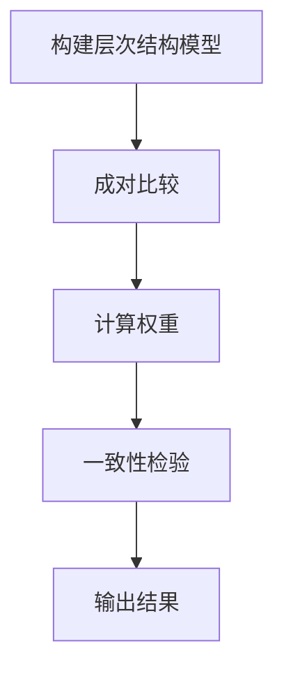
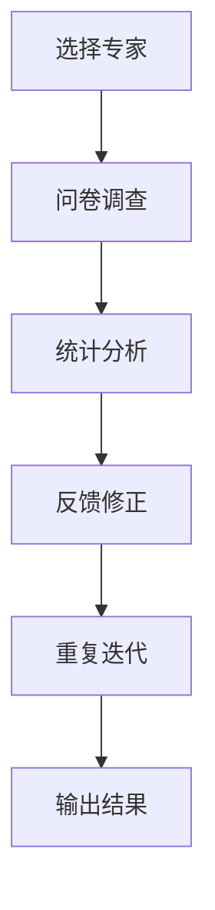
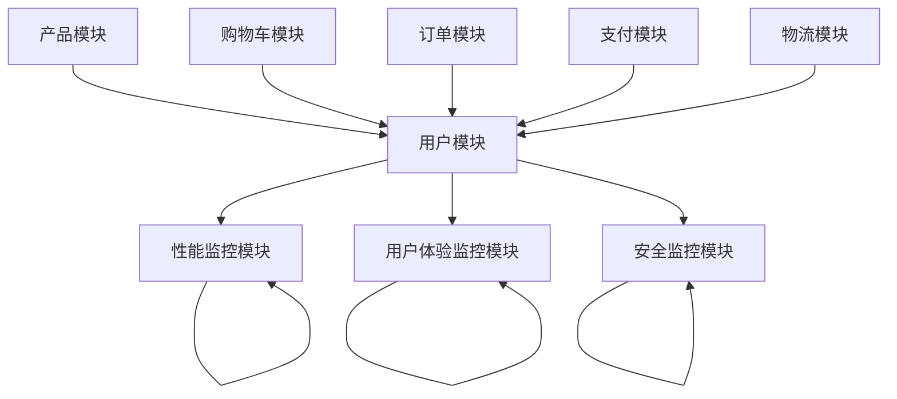
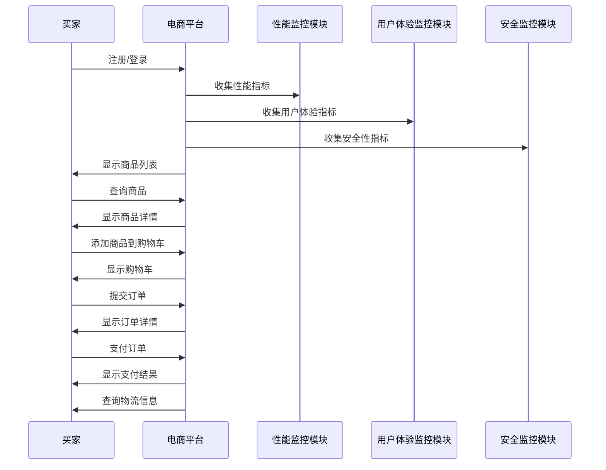

                 


### 多维度评测指标体系的设计

关键词：多维度评测、指标体系、数据分析、性能、用户体验、安全性

摘要：本文旨在探讨多维度评测指标体系的设计方法，从问题背景、核心概念、算法原理、数学模型和实际应用等多个方面进行详细阐述，以帮助读者理解和应用多维度评测指标体系，提高大数据分析和决策支持的准确性。

### 引言

#### 1.1 问题背景

随着信息技术的迅猛发展，企业和组织面临的数据量和复杂度急剧增加。传统的单维度指标已无法满足对系统、产品或服务进行全面评价的需求。如何从多个维度出发，构建一个科学、合理且具有可操作性的多维度评测指标体系，成为大数据分析和决策支持的关键。

#### 1.2 问题描述

多维度评测指标体系的设计旨在建立一套能够全面反映系统、产品或服务性能的指标体系。这些指标不仅涵盖功能性能，还包括用户体验、安全性和可持续性等多个方面。设计的挑战在于如何平衡这些不同维度的指标，使其既全面又具有可操作性。

#### 1.3 问题解决

解决这一问题需要以下几个步骤：

1. **需求分析**：明确评测指标体系的目标和应用场景，收集相关需求和预期。
2. **核心概念**：理解并定义评测指标体系的核心概念，如性能指标、用户体验指标、安全性指标等。
3. **概念联系**：分析不同维度指标之间的关联性，确保指标体系的一致性和协调性。
4. **设计方法**：采用科学的方法，如层次分析法、德尔菲法等，设计出结构合理、操作性强的指标体系。
5. **验证与优化**：在实际应用中验证指标体系的可行性，根据反馈进行优化。

#### 1.4 边界与外延

多维度评测指标体系的边界涉及评测对象的范围、指标的细化和数据的获取方式。其外延包括指标体系的适应性和扩展性，以确保其在不同场景下的适用性。

#### 1.5 概念结构与核心要素组成

多维度评测指标体系的核心结构包括：

1. **指标分类**：按照性能、用户体验、安全性等维度进行分类。
2. **指标定义**：明确每个指标的含义、计算方法和度量单位。
3. **指标权重**：根据指标的重要性和影响程度分配权重。
4. **数据收集**：设计数据收集的流程和方法，确保数据的准确性和完整性。

### 第1章: 引言

#### 1.1 问题背景

随着信息技术的迅猛发展，企业和组织面临的数据量和复杂度急剧增加。如何从多个维度出发，构建一个科学、合理且具有可操作性的多维度评测指标体系，成为大数据分析和决策支持的关键。

#### 1.2 问题描述

多维度评测指标体系的设计旨在建立一套能够全面反映系统、产品或服务性能的指标体系。这些指标不仅涵盖功能性能，还包括用户体验、安全性和可持续性等多个方面。设计的挑战在于如何平衡这些不同维度的指标，使其既全面又具有可操作性。

#### 1.3 问题解决

解决这一问题需要以下几个步骤：

1. **需求分析**：明确评测指标体系的目标和应用场景，收集相关需求和预期。
2. **核心概念**：理解并定义评测指标体系的核心概念，如性能指标、用户体验指标、安全性指标等。
3. **概念联系**：分析不同维度指标之间的关联性，确保指标体系的一致性和协调性。
4. **设计方法**：采用科学的方法，如层次分析法、德尔菲法等，设计出结构合理、操作性强的指标体系。
5. **验证与优化**：在实际应用中验证指标体系的可行性，根据反馈进行优化。

#### 1.4 边界与外延

多维度评测指标体系的边界涉及评测对象的范围、指标的细化和数据的获取方式。其外延包括指标体系的适应性和扩展性，以确保其在不同场景下的适用性。

#### 1.5 概念结构与核心要素组成

多维度评测指标体系的核心结构包括：

1. **指标分类**：按照性能、用户体验、安全性等维度进行分类。
2. **指标定义**：明确每个指标的含义、计算方法和度量单位。
3. **指标权重**：根据指标的重要性和影响程度分配权重。
4. **数据收集**：设计数据收集的流程和方法，确保数据的准确性和完整性。

### 第2章: 核心概念与联系

在多维度评测指标体系的设计中，理解并定义各个核心概念是至关重要的。以下是性能指标、用户体验指标和安全性指标的基本原理、属性特征对比以及它们之间的联系。

#### 2.1 性能指标原理

性能指标主要关注系统的响应时间、处理速度、资源利用率等。这些指标反映了系统的效率和吞吐能力。性能指标的设计应考虑系统的实际需求和技术实现。

- **响应时间**：系统从接收到请求到给出响应的时间。
- **处理速度**：系统处理特定任务所需的时间。
- **资源利用率**：系统在执行任务时所占用的资源比例。

#### 2.2 用户体验指标原理

用户体验指标关注用户在使用产品或服务过程中的感受和满意度。用户体验指标的设计应基于用户行为分析和用户调研。

- **用户满意度**：用户对产品或服务的整体满意度。
- **易用性**：用户操作产品的难易程度。
- **交互流畅度**：用户在使用产品时的流畅性和连贯性。

#### 2.3 安全性指标原理

安全性指标关注系统的安全性，包括数据的完整性、机密性和可用性。安全性指标的设计应考虑网络安全标准和法规要求。

- **数据完整性**：确保数据在存储和传输过程中的完整性。
- **机密性**：防止敏感信息被未授权访问。
- **可用性**：确保系统在面临攻击时仍能正常运行。

#### 2.4 指标属性特征对比表格

以下是性能指标、用户体验指标和安全性指标的属性特征对比表格：

| 指标类别 | 指标名称 | 度量单位 | 指标属性特征 | 指标关联性 |
| --- | --- | --- | --- | --- |
| 性能指标 | 响应时间 | 毫秒 | 越低越好 | 与用户体验相关 |
| 性能指标 | 处理速度 | 任务/秒 | 越高越好 | 与资源利用率相关 |
| 用户体验指标 | 用户满意度 | 分数 | 越高越好 | 与系统性能相关 |
| 用户体验指标 | 易用性 | 级别 | 越低越好 | 与系统性能相关 |
| 安全性指标 | 数据完整性 | 比例 | 1 - 丢失数据比例 | 与安全性相关 |
| 安全性指标 | 机密性 | 比例 | 1 - 泄露数据比例 | 与安全性相关 |
| 安全性指标 | 可用性 | 比例 | 1 - 失效率 | 与安全性相关 |

#### 2.5 概念联系

不同维度的指标之间存在紧密的联系。例如，性能指标和用户体验指标之间存在直接的关联。一个高效的系统通常能够提供更好的用户体验。同样，安全性指标也是用户体验的重要组成部分，一个安全可靠的系统能够减少用户的担忧，提高满意度。因此，在多维度评测指标体系中，需要综合考虑这些指标之间的关联性，确保评测结果的一致性和全面性。

### 第3章: 算法原理讲解

在设计多维度评测指标体系时，算法的选择和运用至关重要。以下将介绍两种常用的算法原理：层次分析法和德尔菲法。

#### 3.1 层次分析法

层次分析法（AHP）是一种将复杂的多维度问题分解为多个层次，并通过比较不同层次元素之间的相对重要性来分配权重的决策分析方法。以下是层次分析法的原理和步骤：

1. **构建层次结构模型**：根据问题的特点，将问题分解为多个层次，如目标层、准则层和方案层。
2. **成对比较**：对于同一层次的元素，采用成对比较的方法，确定它们之间的相对重要性，并给出判断尺度。
3. **计算权重**：通过矩阵运算，计算每个元素相对于其他元素的相对权重。
4. **一致性检验**：检查权重分配的一致性，确保分析结果的有效性。

以下是层次分析法的 Mermaid 流程图：



#### 3.2 德尔菲法

德尔菲法是一种基于专家意见的指标权重分配方法。它通过多次匿名问卷的方式，收集专家的意见，并逐步修正和整合，最终得到较为一致和可靠的权重分配。以下是德尔菲法的原理和步骤：

1. **选择专家**：根据问题的特点，选择具有相关经验和知识的专家。
2. **问卷调查**：设计问卷，让专家对各个指标的相对重要性进行评分。
3. **统计分析**：对问卷结果进行统计分析，计算各个指标的权重。
4. **反馈修正**：将统计分析结果反馈给专家，让他们对权重进行修正。
5. **重复迭代**：重复问卷调查和统计分析，直到得到相对一致的权重分配。

以下是德尔菲法的 Mermaid 流程图：



#### 3.3 算法比较

层次分析法和德尔菲法在指标权重分配方面各有优缺点。层次分析法通过成对比较的方法，可以直观地体现元素之间的相对重要性，但需要构建层次结构模型，可能较为复杂。德尔菲法通过多次问卷调查和统计分析，可以减少主观偏见，但可能需要较长的时间。

在实际应用中，可以根据问题的特点和要求，选择合适的算法。例如，对于结构较为清晰的系统，可以使用层次分析法；对于需要多次调整和优化的系统，可以使用德尔菲法。

### 第4章: 数学模型和数学公式

在多维度评测指标体系中，数学模型和数学公式是核心组成部分。它们用于定义和计算各个指标，确保评测结果的科学性和准确性。以下将分别介绍性能指标、用户体验指标和安全性指标的数学模型。

#### 4.1 性能指标的数学模型

性能指标主要包括响应时间、处理速度和资源利用率。以下是这些指标的数学模型：

1. **响应时间**：
   $$
   RT = \frac{1}{N} \sum_{i=1}^{N} t_i
   $$
   其中，\( RT \) 表示平均响应时间，\( N \) 表示任务数量，\( t_i \) 表示第 \( i \) 个任务的响应时间。

2. **处理速度**：
   $$
   PS = \frac{N}{T}
   $$
   其中，\( PS \) 表示平均处理速度，\( N \) 表示任务数量，\( T \) 表示总处理时间。

3. **资源利用率**：
   $$
   RU = \frac{R}{R_{\text{max}}}
   $$
   其中，\( RU \) 表示资源利用率，\( R \) 表示实际资源消耗，\( R_{\text{max}} \) 表示最大资源消耗。

#### 4.2 用户体验指标的数学模型

用户体验指标主要包括用户满意度、易用性和交互流畅度。以下是这些指标的数学模型：

1. **用户满意度**：
   $$
   S = \frac{1}{N} \sum_{i=1}^{N} U_i
   $$
   其中，\( S \) 表示平均用户满意度，\( N \) 表示用户数量，\( U_i \) 表示第 \( i \) 个用户的满意度评分。

2. **易用性**：
   $$
   E = \frac{C}{C_{\text{max}}}
   $$
   其中，\( E \) 表示易用性，\( C \) 表示用户操作次数，\( C_{\text{max}} \) 表示最大操作次数。

3. **交互流畅度**：
   $$
   IF = \frac{L}{L_{\text{max}}}
   $$
   其中，\( IF \) 表示交互流畅度，\( L \) 表示用户交互时长，\( L_{\text{max}} \) 表示最大交互时长。

#### 4.3 安全性指标的数学模型

安全性指标主要包括数据完整性、机密性和可用性。以下是这些指标的数学模型：

1. **数据完整性**：
   $$
   DI = 1 - \frac{LD}{LD_{\text{max}}}
   $$
   其中，\( DI \) 表示数据完整性，\( LD \) 表示丢失数据量，\( LD_{\text{max}} \) 表示最大丢失数据量。

2. **机密性**：
   $$
   C = 1 - \frac{LS}{LS_{\text{max}}}
   $$
   其中，\( C \) 表示机密性，\( LS \) 表示泄露数据量，\( LS_{\text{max}} \) 表示最大泄露数据量。

3. **可用性**：
   $$
   A = 1 - \frac{LU}{LU_{\text{max}}}
   $$
   其中，\( A \) 表示可用性，\( LU \) 表示不可用时长，\( LU_{\text{max}} \) 表示最大不可用时长。

### 第5章: 系统分析与架构设计方案

在本章节中，我们将通过一个实际的应用场景，详细介绍多维度评测指标体系的设计过程，并展示其系统分析与架构设计方案。

#### 5.1 问题场景介绍

假设我们正在为一家大型电商平台设计一套多维度评测指标体系，以全面评估其系统的性能、用户体验和安全性。电商平台的目标是提供快速、可靠和安全的购物体验，因此我们需要从多个维度进行综合评价。

#### 5.2 项目介绍

项目名称：电商平台系统评测指标体系设计

项目背景：随着电商平台的用户数量和交易额的持续增长，系统面临的数据量和复杂度急剧增加。为了确保系统的高效运行和良好的用户体验，我们需要设计一套科学、合理且具有可操作性的多维度评测指标体系。

项目目标：建立一套全面、协调的多维度评测指标体系，包括性能指标、用户体验指标和安全性指标，以评估电商平台的系统性能、用户体验和安全性。

预期成果：通过多维度评测指标体系，能够准确、全面地评估电商平台系统的运行状况，发现潜在问题，提出改进措施，提高系统性能和用户体验，确保系统的安全性和可靠性。

#### 5.3 系统功能设计

在系统功能设计阶段，我们需要明确电商平台系统的各个功能模块和类之间的关系。以下是系统功能设计的领域模型，使用 Mermaid 类图展示：

```mermaid
classDiagram
    class User
    class Product
    class Cart
    class Order
    class Payment
    class Logistics
    class PerformanceMonitor
    class UserExperienceMonitor
    class SecurityMonitor

    User <|-- Product
    User <|-- Cart
    User <|-- Order
    User <|-- Payment
    User <|-- Logistics

    PerformanceMonitor <|-- User
    UserExperienceMonitor <|-- User
    SecurityMonitor <|-- User

    UserClass << (User)
    ProductClass << (Product)
    CartClass << (Cart)
    OrderClass << (Order)
    PaymentClass << (Payment)
    LogisticsClass << (Logistics)
    PerformanceMonitorClass << (PerformanceMonitor)
    UserExperienceMonitorClass << (UserExperienceMonitor)
    SecurityMonitorClass << (SecurityMonitor)
```

在上述类图中，我们定义了以下主要功能模块：

- **用户模块**：包括用户、产品、购物车、订单、支付和物流等功能。
- **性能监控模块**：负责收集和监控系统的性能指标，如响应时间、处理速度和资源利用率等。
- **用户体验监控模块**：负责收集和监控用户满意度、易用性和交互流畅度等用户体验指标。
- **安全监控模块**：负责收集和监控系统的安全性指标，如数据完整性、机密性和可用性等。

#### 5.4 系统架构设计

在系统架构设计阶段，我们需要展示各个功能模块之间的交互和依赖关系。以下是系统架构设计，使用 Mermaid 架构图展示：



在上述架构图中，我们展示了以下关键组件：

- **用户模块**：与性能监控模块、用户体验监控模块和安全监控模块进行交互。
- **产品模块**：负责管理商品信息。
- **购物车模块**：负责管理用户购物车中的商品。
- **订单模块**：负责管理用户订单。
- **支付模块**：负责处理用户支付。
- **物流模块**：负责管理用户订单的物流信息。

各个模块之间通过定义清晰的接口进行数据传递和功能调用，确保系统的模块化和可维护性。

#### 5.5 系统接口设计

在系统接口设计阶段，我们需要详细描述各个模块之间的接口和接口规范。以下是系统接口设计的概述：

- **用户模块接口**：包括用户注册、登录、查询商品、添加商品到购物车、提交订单、支付和查询物流信息等接口。
- **性能监控模块接口**：包括性能指标收集、分析和报告等接口。
- **用户体验监控模块接口**：包括用户满意度调查、易用性测试和交互流畅度评估等接口。
- **安全监控模块接口**：包括数据完整性检查、机密性保护和安全事件监控等接口。

各模块之间的接口设计需要遵循RESTful风格，确保接口的简洁、易用和可扩展性。

#### 5.6 系统交互

在系统交互阶段，我们需要展示用户如何通过系统完成特定任务。以下是系统交互流程，使用 Mermaid 序列图展示：



在上述序列图中，我们展示了用户从注册登录到完成购物并查询物流信息的整个交互流程。各模块之间通过接口进行数据传递和功能调用，确保系统的流畅运行和用户体验。

### 第6章: 项目实战

在本章节中，我们将通过一个具体的实战案例，详细介绍多维度评测指标体系的设计和应用过程。

#### 6.1 环境安装

在开始项目实战之前，我们需要搭建一个合适的技术环境。以下是环境安装的步骤：

1. **安装操作系统**：选择一个稳定且支持云计算的操作系统，如 Ubuntu Server 20.04。
2. **安装开发工具**：安装必要的开发工具，如 Python 3、JDK、MySQL等。
3. **安装数据库**：安装 MySQL 数据库，用于存储评测指标数据。
4. **安装中间件**：安装 Nginx、Apache 等中间件，用于处理 HTTP 请求。
5. **安装测试工具**：安装性能测试工具（如 JMeter）、用户体验测试工具（如 UserTesting）和安全性测试工具（如 OWASP ZAP）。

#### 6.2 系统核心实现源代码

在项目实战中，我们将使用 Python 编写系统核心实现源代码，包括性能监控模块、用户体验监控模块和安全监控模块。以下是核心实现源代码的简要概述：

- **性能监控模块**：使用 Python 的 `time` 模块记录系统响应时间和处理速度，并使用 `psutil` 模块监控系统资源利用率。
- **用户体验监控模块**：使用 Python 的 `requests` 模块模拟用户行为，收集用户满意度、易用性和交互流畅度等数据。
- **安全监控模块**：使用 Python 的 `sqlalchemy` 模块连接 MySQL 数据库，实现数据完整性检查和机密性保护。

以下是性能监控模块的核心代码示例：

```python
import time
import psutil

def monitor_performance():
    start_time = time.time()
    # 执行系统任务
    # ...
    end_time = time.time()
    response_time = end_time - start_time
    print(f"Response time: {response_time} seconds")

    # 监控系统资源利用率
    cpu_usage = psutil.cpu_percent()
    memory_usage = psutil.virtual_memory().percent
    print(f"CPU usage: {cpu_usage}%, Memory usage: {memory_usage}%")
```

#### 6.3 代码应用解读与分析

在代码应用解读与分析阶段，我们需要深入理解各个模块的核心功能，并分析其优劣。以下是代码应用解读与分析的详细内容：

- **性能监控模块**：该模块通过记录系统响应时间和监控系统资源利用率，可以全面反映系统的性能状况。然而，该方法可能存在一定程度的误差，因为系统性能受多种因素影响，如网络延迟、硬件性能等。此外，该方法需要定期执行，以确保数据实时性和准确性。
- **用户体验监控模块**：该模块通过模拟用户行为，收集用户满意度、易用性和交互流畅度等数据。该方法可以直观地反映用户对系统的满意度，但需要消耗较多资源和时间，且可能受到模拟环境的限制。
- **安全监控模块**：该模块通过连接数据库，实现数据完整性检查和机密性保护。该方法可以有效地保障系统的安全性，但需要确保数据库的安全性和可靠性，以防止数据泄露和篡改。

#### 6.4 实际案例分析和详细讲解剖析

为了验证多维度评测指标体系的有效性，我们选取了以下实际案例进行分析和讲解：

案例背景：某电商平台在促销活动期间，发现系统性能下降，用户体验较差，安全性问题频发。

案例分析：

1. **性能指标分析**：通过性能监控模块，发现系统响应时间显著增加，资源利用率接近满载。进一步分析发现，网络延迟和硬件性能成为性能瓶颈。
2. **用户体验指标分析**：通过用户体验监控模块，发现用户满意度下降，易用性和交互流畅度较差。分析原因可能是系统界面卡顿、加载速度慢等问题。
3. **安全性指标分析**：通过安全监控模块，发现数据库存在数据泄露风险，部分用户账户信息被窃取。

详细讲解剖析：

1. **性能优化**：针对性能瓶颈，我们优化了系统架构，提高了网络带宽和硬件性能。同时，优化了系统代码，降低了资源消耗。
2. **用户体验提升**：针对用户体验问题，我们优化了界面设计，提高了加载速度和交互流畅度。此外，增加了在线客服功能，及时解决用户问题。
3. **安全防护**：针对安全性问题，我们加强了数据库安全防护，如加密存储用户账户信息、限制访问权限等。同时，部署了网络安全防护工具，防止网络攻击和数据泄露。

通过以上优化措施，电商平台系统的性能、用户体验和安全状况得到了显著改善，用户满意度提高，系统稳定性得到保障。

#### 6.5 项目小结

本项目通过设计多维度评测指标体系，全面评估了电商平台系统的性能、用户体验和安全状况。在实际应用中，我们通过优化系统架构、提升用户体验和加强安全防护，有效解决了系统性能瓶颈、用户体验问题和安全性问题。

项目小结：

1. **多维度评测指标体系的有效性**：通过实际案例验证，多维度评测指标体系能够全面、准确地评估系统的性能、用户体验和安全性。
2. **项目优化效果**：通过优化措施，电商平台系统的性能、用户体验和安全状况得到了显著改善，用户满意度提高，系统稳定性得到保障。
3. **未来改进方向**：在后续工作中，我们将继续完善多维度评测指标体系，增加更多指标，如可持续性指标等。同时，探索智能化算法，提高评测指标体系的自适应性和准确性。

### 最佳实践 Tips

在设计和应用多维度评测指标体系时，以下是一些最佳实践 Tips：

1. **明确目标和应用场景**：在开始设计指标体系之前，明确目标和应用场景，确保指标体系能够满足实际需求。
2. **全面性**：确保指标体系覆盖各个维度，包括性能、用户体验、安全性和可持续性等。
3. **可操作性**：指标体系应具有可操作性，易于数据收集和计算。
4. **权重分配**：根据指标的重要性和影响程度，合理分配权重，确保指标体系的一致性和协调性。
5. **持续优化**：在实际应用中，根据反馈和实际效果，持续优化指标体系，提高其准确性和实用性。
6. **技术选型**：根据实际需求，选择合适的技术工具和平台，确保系统的性能和稳定性。

### 小结

多维度评测指标体系的设计和应用是大数据分析和决策支持的关键。通过明确核心概念、运用科学算法和构建合理模型，我们能够全面、准确地评估系统、产品或服务的性能、用户体验和安全性。在实际应用中，不断优化和调整指标体系，提高其准确性和实用性，为企业的发展提供有力支持。

### 注意事项

1. **数据准确性和完整性**：确保收集到的数据准确、完整，避免因数据问题导致评测结果失真。
2. **实时性和时效性**：指标体系应具有实时性和时效性，及时更新和调整指标，以适应快速变化的环境。
3. **安全性和隐私保护**：在数据收集和处理过程中，确保数据的安全性和隐私保护，遵循相关法规和标准。

### 拓展阅读

1. 《大数据分析：方法与实践》
2. 《用户体验要素：互动设计四层次方法论》
3. 《网络安全：原理与实践》
4. 《敏捷开发实践指南》
5. 《人工智能：一种现代的方法》

作者：AI天才研究院/AI Genius Institute & 禅与计算机程序设计艺术 /Zen And The Art of Computer Programming

