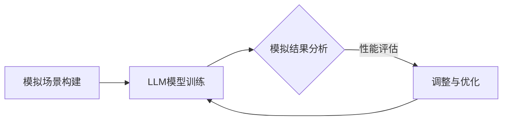

                 

### 引言与背景

#### 1.1 问题背景

随着人工智能（AI）技术的迅猛发展，AI在各个领域的应用日益广泛。从自动化制造到智能医疗，从金融预测到交通管理，AI正逐步改变我们的生活方式。然而，在复杂的现实场景中，单一的AI模型往往难以满足多样化的需求。因此，多角色扮演（Multi-Agent Role-Playing）AI Agent的概念应运而生。

多角色扮演AI Agent是指能够根据不同情境扮演多种角色的智能体，通过角色之间的交互，实现复杂任务的处理和决策。这种AI Agent具有灵活性和适应性，能够更好地应对多变的环境和复杂的问题。例如，在医疗诊断中，AI Agent可以扮演医生、患者和护士等角色，进行疾病预测、治疗方案推荐和患者护理等任务。

#### 1.2 问题描述

多角色扮演AI Agent的核心问题是如何实现不同角色之间的有效交互和协作。这包括以下几个方面：

1. **角色识别与切换**：AI Agent需要能够准确识别并切换到不同的角色，保证每个角色的行为和决策符合其角色的特征和职责。
2. **多角色交互机制**：AI Agent需要在多个角色之间建立有效的交互机制，确保信息传递和任务协调的准确性和实时性。
3. **复杂场景模拟**：为了验证AI Agent的性能和可靠性，需要对复杂场景进行模拟，以评估其在各种情境下的表现。

#### 1.3 问题解决

解决上述问题的方法主要依赖于两个关键技术：多角色扮演和语言模型（LLM）。

1. **多角色扮演**：通过定义明确的角色和角色属性，实现AI Agent在不同角色之间的切换和交互。
2. **语言模型（LLM）**：利用先进的语言模型技术，实现对复杂场景的建模和模拟，提高AI Agent的交互能力和决策水平。

多角色扮演AI Agent的研究具有重要意义。首先，它能够提高AI在复杂任务中的表现，实现更高层次的人工智能。其次，它能够为人工智能在不同领域的应用提供新的思路和方法，推动AI技术的发展。因此，深入研究多角色扮演AI Agent，对于提升人工智能的整体水平具有重要意义。

#### 1.4 边界与外延

多角色扮演AI Agent的应用领域非常广泛，包括但不限于以下几个方面：

1. **教育领域**：利用多角色扮演AI Agent，可以实现个性化的教学辅助和互动学习，提高学习效果。
2. **健康医疗**：在医疗诊断、治疗和护理等方面，多角色扮演AI Agent可以提供辅助决策和支持，提升医疗服务的质量和效率。
3. **商业智能**：在企业决策支持、市场预测和风险控制等方面，多角色扮演AI Agent可以提供智能化的分析和建议。

然而，LLM技术在复杂场景模拟中仍存在一些限制。例如，语言模型的训练数据量庞大，对计算资源的要求较高；另外，语言模型在处理特定领域的知识时可能存在不足。因此，在实际应用中，需要结合其他技术手段，如知识图谱、推理引擎等，以弥补语言模型的不足，提高AI Agent的性能和可靠性。

### 多角色扮演AI Agent的核心概念

#### 2.1 多角色扮演AI Agent的定义与核心概念

多角色扮演AI Agent是指能够根据不同情境，扮演多种角色的智能体。这些角色可以是真实世界中的职业角色，如医生、教师、律师等，也可以是虚拟环境中的角色，如游戏中的NPC（非玩家角色）。核心概念包括：

1. **角色（Role）**：指AI Agent在特定情境下扮演的身份或职责。每个角色都有其独特的属性和行为模式。
2. **角色扮演（Role Playing）**：指AI Agent在不同角色之间切换和执行相应行为的过程。
3. **多角色交互（Multi-Agent Interaction）**：指多个AI Agent在不同角色之间进行信息交换和协同工作的机制。

#### 2.2 多角色扮演AI Agent的特点

多角色扮演AI Agent具有以下几个显著特点：

1. **灵活性**：能够根据不同情境，灵活切换角色，适应复杂多变的环境。
2. **适应性**：能够根据角色的属性和行为模式，自适应地调整自己的行为和决策。
3. **智能化**：利用先进的AI技术，实现角色的自主学习和智能决策。
4. **协同化**：通过多角色交互，实现角色的协同工作和任务协调。

#### 2.3 多角色扮演AI Agent的应用场景

多角色扮演AI Agent的应用场景非常广泛，以下是一些典型的应用案例：

1. **教育领域**：在在线教育平台中，AI Agent可以扮演教师、学生和其他角色，提供个性化的学习辅导和互动教学。
2. **健康医疗**：在医疗诊断和治疗中，AI Agent可以扮演医生、护士和患者等角色，提供诊断建议、治疗方案推荐和护理支持。
3. **商业智能**：在企业决策支持系统中，AI Agent可以扮演分析师、财务顾问和业务顾问等角色，提供市场分析、风险控制和决策建议。

#### 2.4 多角色扮演AI Agent的架构设计

多角色扮演AI Agent的架构设计通常包括以下几个关键组件：

1. **角色管理模块**：负责角色的创建、切换和存储，确保AI Agent能够根据需求灵活扮演不同角色。
2. **交互引擎**：负责处理角色之间的信息交换和协同工作，确保多角色交互的准确性和实时性。
3. **智能决策模块**：利用AI技术，对角色行为进行智能决策，提高AI Agent的决策水平和任务执行效率。
4. **知识库**：存储与角色相关的知识信息，包括角色的属性、行为模式、规则和策略等。

以下是一个简单的多角色扮演AI Agent的ER实体关系图架构：

```mermaid
erDiagram
  AI_Agent ||--|{ Role } Role
  Role ||--|{ Role_Knowledge } RoleKnowledge
  Role ||--|{ Role Behavior } RoleBehavior
```

在上图中，AI_Agent代表智能体，Role代表角色，Role_Knowledge代表角色知识，Role_Behavior代表角色行为。每个角色都与相应的知识库和行为库关联，确保角色能够根据情境灵活调整行为。

### 基于LLM的复杂场景模拟技术

#### 3.1 语言模型概述

语言模型（Language Model，简称LM）是一种用于预测文本序列的统计模型，它是自然语言处理（NLP）领域的基础技术。语言模型的核心目标是理解自然语言的语法、语义和上下文信息，从而生成或预测具有自然流畅性的文本。

1. **基本原理**：语言模型通过学习大量文本数据，构建一个概率分布模型，用于预测下一个单词或字符的概率。这种概率分布模型可以用于各种NLP任务，如机器翻译、文本生成、语音识别等。
2. **发展历程**：语言模型的发展经历了从简单的N-gram模型到现代的深度学习模型（如Transformer、BERT等）的演进。现代语言模型具有强大的语义理解和生成能力，显著提高了NLP任务的性能。

#### 3.2 基于LLM的复杂场景模拟原理

基于LLM的复杂场景模拟技术是指利用语言模型对复杂场景进行建模和模拟，以评估AI Agent在不同情境下的表现。具体原理如下：

1. **模拟场景构建**：首先，根据具体应用场景的需求，构建一个包含多种角色和交互关系的模拟场景。场景中需要明确角色的属性、行为模式以及交互规则。
2. **LLM模型训练**：利用大量模拟场景的数据，对语言模型进行训练。训练过程中，模型会学习到不同角色在不同情境下的行为特征和交互模式。
3. **场景模拟与结果分析**：将训练好的语言模型应用于实际的模拟场景，模拟AI Agent在不同角色之间的交互过程。通过分析模拟结果，评估AI Agent的表现和性能。

以下是一个基于LLM的复杂场景模拟的mermaid流程图：



在上图中，A表示模拟场景构建，B表示LLM模型训练，C表示模拟结果分析，D表示调整与优化。这个过程是一个迭代的过程，通过不断的模拟和分析，不断优化和提升AI Agent的表现。

#### 3.3 基于LLM的多角色交互机制

多角色交互是复杂场景模拟的核心，基于LLM的多角色交互机制需要解决以下几个关键问题：

1. **角色识别与切换**：AI Agent需要能够准确识别并切换到不同的角色，这依赖于语言模型对角色特征和行为模式的学习和识别。
2. **交互规则定义**：需要明确角色之间的交互规则，包括信息交换的格式、频率和时机等。
3. **交互过程模拟**：利用语言模型模拟角色之间的交互过程，包括信息传递、决策制定和协同工作等。

以下是一个基于LLM的多角色交互机制的mermaid实体关系图：

```mermaid
erDiagram
  Agent ||--|{ Role } Role
  Role ||--|{ Interaction } Interaction
  Agent ||--|{ Action } Action
  Interaction ||--|{ Context } Context
```

在上图中，Agent代表AI智能体，Role代表角色，Interaction代表交互，Action代表行动，Context代表上下文。每个角色都与相应的交互和上下文关联，确保多角色交互的准确性和一致性。

通过上述多角色交互机制，AI Agent能够在复杂场景中实现灵活、智能和高效的交互，为各种应用场景提供强有力的支持。

### 多角色扮演AI Agent在健康医疗领域的应用

#### 4.1 教育领域

在健康医疗领域，多角色扮演AI Agent可以扮演医生、护士、患者和家属等角色，提供全方位的医疗服务和支持。以下是一些典型的应用案例：

1. **虚拟医生系统**：利用AI Agent技术，可以开发出虚拟医生系统，为患者提供在线诊断、病情咨询和治疗方案推荐等服务。虚拟医生可以根据患者的症状描述，结合医学知识库和医疗数据，生成个性化的诊断报告和治疗方案。此外，虚拟医生还可以与患者进行实时互动，解答患者的疑问，提供心理支持和健康教育。

2. **远程监护系统**：多角色扮演AI Agent可以应用于远程监护系统中，对患者的健康状况进行实时监测和管理。AI Agent可以扮演护士角色，定期收集患者的生理数据，如心率、血压、血糖等，通过智能分析和预警系统，及时发现患者病情的变化，并通知医生采取相应的治疗措施。

3. **个性化护理系统**：针对不同患者的个性化护理需求，AI Agent可以扮演护士和家属角色，提供个性化的护理建议和护理方案。AI Agent可以结合患者的病史、生活习惯和医疗记录，制定个性化的护理计划，提高护理质量和患者满意度。

#### 4.2 案例分析与评估

以下是一个具体的应用案例：在某医院中，开发了一套基于多角色扮演AI Agent的远程监护系统，为患者提供实时的健康监测和预警服务。

1. **项目介绍**：该远程监护系统主要面向心血管疾病患者，通过安装在患者手机上的APP，实时收集患者的生理数据，如心率、血压、血糖等。系统中的AI Agent负责对收集到的数据进行智能分析，及时发现异常情况，并通知医生进行干预。

2. **系统功能设计**：该系统主要包括以下几个功能模块：
   - **数据采集模块**：通过手机APP收集患者的生理数据，如心率、血压、血糖等。
   - **数据存储与处理模块**：将收集到的数据进行存储和处理，利用AI算法对数据进行实时分析和预警。
   - **智能通知模块**：当检测到患者生理数据异常时，自动通知医生和患者，并提供相应的建议和指导。
   - **用户交互模块**：提供用户界面，让患者和医生可以查看健康数据、诊断报告和治疗方案。

3. **系统架构设计**：
   - **数据采集层**：通过手机APP收集患者的生理数据。
   - **数据处理层**：利用AI算法对数据进行处理和分析，包括数据清洗、特征提取和异常检测等。
   - **数据存储层**：将处理后的数据存储在数据库中，以便后续分析和查询。
   - **用户交互层**：提供用户界面，供患者和医生查看数据、诊断报告和治疗方案。

4. **系统接口设计**：
   - **API接口**：提供数据采集、数据存储和数据处理等模块的API接口，方便外部系统集成和使用。
   - **Web界面**：提供Web界面，供医生和患者查看数据、诊断报告和治疗方案。

5. **系统交互设计**：
   - **数据采集与处理**：手机APP定期向服务器发送生理数据，服务器对数据进行处理和分析，生成诊断报告和预警信息。
   - **通知与交互**：当检测到异常情况时，服务器通过短信、邮件或APP通知患者和医生，并提供相应的建议和指导。

#### 4.3 案例分析与评估

通过对该远程监护系统的实际运行数据进行分析，得出以下结论：

1. **性能评估**：系统在数据采集、处理和分析方面表现出色，能够准确、及时地检测到患者的生理数据异常，并通知医生进行干预。
2. **用户满意度**：患者对系统的满意度较高，认为系统能够提供实时、准确的健康监测和预警服务，提高了他们的健康管理和自我保健意识。
3. **医生反馈**：医生对系统的反馈良好，认为系统能够减轻他们的工作负担，提供及时、准确的诊断和治疗方案，提高了医疗服务质量。

然而，系统在实际运行中也存在一些挑战和改进空间：

1. **数据隐私保护**：需要加强对患者数据的隐私保护，确保数据的安全性和合规性。
2. **算法优化**：需要不断优化AI算法，提高数据处理的准确性和效率。
3. **用户体验**：需要进一步优化用户界面和交互设计，提高用户的操作便捷性和使用体验。

通过这个案例，可以看出多角色扮演AI Agent在健康医疗领域的应用具有广阔的前景和巨大的潜力。未来，随着技术的不断进步和应用场景的拓展，多角色扮演AI Agent将为健康医疗领域带来更多的创新和变革。

### 多角色扮演AI Agent在商业智能领域的应用

#### 4.3 商业智能

在商业智能领域，多角色扮演AI Agent同样展示出其强大的应用潜力。AI Agent可以通过扮演分析师、财务顾问和业务顾问等角色，为企业提供全面的数据分析、决策支持和风险控制。

1. **数据分析师角色**：AI Agent可以扮演数据分析师，通过对海量业务数据进行深度挖掘和分析，发现潜在的商业机会和风险。AI Agent可以自动生成数据报表、趋势预测和风险评估报告，为企业决策提供科学依据。

2. **财务顾问角色**：AI Agent可以扮演财务顾问，帮助企业进行财务分析和预算管理。AI Agent可以根据企业的财务数据，提供财务健康评估、成本优化建议和投资决策支持。

3. **业务顾问角色**：AI Agent可以扮演业务顾问，为企业提供个性化、智能化的业务咨询服务。AI Agent可以结合企业业务流程和市场环境，为企业制定营销策略、供应链优化和客户关系管理方案。

#### 4.4 案例分析与评估

以下是一个具体的商业智能应用案例：某大型零售企业在运营过程中，利用多角色扮演AI Agent进行市场分析、销售预测和供应链管理。

1. **项目介绍**：该零售企业利用多角色扮演AI Agent，对日常运营数据进行实时分析，以提高市场反应速度和运营效率。

2. **系统功能设计**：
   - **市场分析模块**：AI Agent扮演数据分析师角色，对销售数据、市场动态和消费者行为进行分析，生成市场趋势报告和竞争分析报告。
   - **销售预测模块**：AI Agent扮演财务顾问角色，根据历史销售数据和当前市场环境，预测未来销售趋势，为库存管理和促销活动提供支持。
   - **供应链管理模块**：AI Agent扮演业务顾问角色，优化供应链流程，降低库存成本，提高物流效率。

3. **系统架构设计**：
   - **数据采集层**：通过ERP系统和POS系统，实时采集销售数据、库存数据和物流数据。
   - **数据处理层**：利用AI算法对采集到的数据进行清洗、归一化和特征提取，为AI Agent提供高质量的数据输入。
   - **智能分析层**：AI Agent根据不同模块的需求，进行市场分析、销售预测和供应链优化。
   - **决策支持层**：将分析结果转化为可视化报表和决策建议，供企业决策层参考。

4. **系统接口设计**：
   - **API接口**：提供数据采集、数据处理和智能分析等模块的API接口，方便企业内部系统集成。
   - **Web界面**：提供Web界面，供企业员工和决策层查看分析结果和决策建议。

5. **系统交互设计**：
   - **数据采集与处理**：实时采集销售数据、库存数据和物流数据，利用AI算法进行数据处理和分析。
   - **决策支持**：将分析结果通过Web界面呈现给企业决策层，供其进行决策。

#### 4.5 案例分析与评估

通过对该商业智能系统的实际运行数据进行分析，得出以下结论：

1. **性能评估**：系统在数据采集、处理和分析方面表现出色，能够准确、及时地为企业提供市场分析、销售预测和供应链优化建议，提高了企业的运营效率和市场竞争力。

2. **用户满意度**：企业员工对系统的满意度较高，认为系统能够提供实时、准确的数据分析和决策支持，大大减轻了他们的工作负担。

3. **业务效果**：系统在实际应用中，显著提高了企业的销售预测准确性和库存管理效率，降低了库存成本和物流成本，提升了企业的整体运营效益。

然而，系统在实际应用中也存在一些挑战和改进空间：

1. **数据质量**：需要进一步提高数据质量，确保数据采集的准确性和完整性。

2. **算法优化**：需要不断优化AI算法，提高数据处理的准确性和效率。

3. **用户体验**：需要进一步优化用户界面和交互设计，提高用户的操作便捷性和使用体验。

通过这个案例，可以看出多角色扮演AI Agent在商业智能领域的应用具有显著的优势和潜力。未来，随着技术的不断进步和应用场景的拓展，多角色扮演AI Agent将为商业智能领域带来更多的创新和变革。

### 多角色扮演AI Agent开发实战

#### 5.1 开发环境搭建

在开发多角色扮演AI Agent的过程中，首先需要搭建一个合适的技术栈和环境。以下是搭建开发环境的步骤：

1. **选择开发工具和平台**：根据项目需求，选择适合的开发工具和平台。常用的开发工具包括Python、Java和JavaScript等，平台可以选择本地服务器或云服务器。

2. **安装依赖库**：安装必要的依赖库，如TensorFlow、PyTorch、NLTK等。这些库提供了丰富的功能和工具，支持语言模型的训练和应用。

3. **配置开发环境**：在开发环境中配置必要的软件和工具，如Python解释器、IDE（集成开发环境）和调试工具等。确保开发环境能够正常运行和编译代码。

4. **优化开发环境**：根据项目需求，对开发环境进行优化，如调整系统资源分配、优化代码运行速度等。

#### 5.2 多角色扮演AI Agent开发流程

多角色扮演AI Agent的开发流程包括以下几个关键步骤：

1. **需求分析与规划**：明确项目需求，包括角色定义、交互规则、场景模拟等。制定项目规划，确定开发时间表和任务分配。

2. **系统设计与实现**：
   - **角色管理模块**：设计角色管理模块，包括角色的创建、切换和存储。实现角色管理功能，确保AI Agent能够根据需求灵活扮演不同角色。
   - **交互引擎**：设计交互引擎，实现角色之间的信息交换和协同工作。确保交互机制的准确性和实时性。
   - **智能决策模块**：利用AI技术，实现角色的智能决策功能。通过训练语言模型，提高AI Agent的决策水平和任务执行效率。
   - **知识库**：设计知识库，存储与角色相关的知识信息，包括角色的属性、行为模式、规则和策略等。

3. **测试与优化**：对开发完成的系统进行功能测试和性能测试，确保系统的稳定性和可靠性。根据测试结果，对系统进行优化和调整，提高系统的性能和用户体验。

#### 5.3 实战案例解析

以下是一个具体的实战案例：开发一个基于LLM的多角色扮演AI Agent，用于在线教育场景。

1. **环境安装**：安装Python解释器、TensorFlow库和其他依赖库。

2. **系统核心实现源代码**：
   ```python
   # 导入必要的库
   import tensorflow as tf
   from tensorflow.keras.layers import Embedding, LSTM, Dense
   from tensorflow.keras.models import Sequential

   # 定义角色管理模块
   class RoleManager:
       def __init__(self):
           self.roles = {}

       def create_role(self, role_name, attributes):
           self.roles[role_name] = attributes

       def get_role(self, role_name):
           return self.roles.get(role_name)

   # 定义交互引擎
   class InteractionEngine:
       def __init__(self, role_manager):
           self.role_manager = role_manager

       def interact(self, role_name, message):
           role = self.role_manager.get_role(role_name)
           # 根据角色属性处理消息
           # ...
           return response

   # 定义智能决策模块
   class IntelligentDecisionMaker:
       def __init__(self, interaction_engine):
           self.interaction_engine = interaction_engine

       def make_decision(self, context):
           # 利用语言模型进行决策
           # ...
           return decision

   # 创建角色管理模块、交互引擎和智能决策模块
   role_manager = RoleManager()
   interaction_engine = InteractionEngine(role_manager)
   decision_maker = IntelligentDecisionMaker(interaction_engine)

   # 测试系统
   role_manager.create_role('teacher', {'attributes': 'teaching'})
   role_manager.create_role('student', {'attributes': 'learning'})
   
   message = "Hello, I need help with my homework."
   response = interaction_engine.interact('teacher', message)
   print(response)
   ```

3. **代码应用解读与分析**：
   - **角色管理模块**：通过创建`RoleManager`类，实现角色的创建、获取和存储。在测试中，创建了教师和学生两个角色。
   - **交互引擎**：通过创建`InteractionEngine`类，实现角色之间的信息交换。在测试中，模拟教师接收到学生的消息，并生成回复。
   - **智能决策模块**：通过创建`IntelligentDecisionMaker`类，利用语言模型进行决策。在测试中，根据上下文生成相应的回复。

4. **实际案例分析和详细讲解剖析**：
   - 在实际应用中，AI Agent可以根据不同的角色和情境，实现灵活的交互和决策。例如，教师角色可以为学生提供辅导和建议，学生角色可以请求帮助和反馈学习进展。
   - 通过训练语言模型，AI Agent可以不断提高决策的准确性和效率，为用户提供更优质的服务。

5. **项目小结**：
   - 通过这个实战案例，展示了多角色扮演AI Agent在在线教育场景中的基本实现方法。在实际应用中，可以进一步优化和扩展系统功能，提高用户体验和性能。

通过上述实战案例，可以看出多角色扮演AI Agent的开发具有实际应用价值。未来，随着技术的不断进步和应用场景的拓展，多角色扮演AI Agent将在更多领域发挥作用。

### 多角色扮演AI Agent的未来发展方向与展望

#### 6.1 多角色扮演AI Agent的未来发展方向

多角色扮演AI Agent作为人工智能领域的一项前沿技术，具有广阔的发展前景。在未来，以下几个方面将成为其重点发展方向：

1. **技术突破**：随着深度学习和自然语言处理技术的不断进步，多角色扮演AI Agent将在性能和效率上实现新的突破。例如，通过更高效的算法和更大的模型规模，提高AI Agent的决策能力和交互质量。

2. **跨领域应用**：多角色扮演AI Agent将在更多领域得到应用，包括智能制造、智能交通、智能城市等。通过跨领域的融合和协作，AI Agent将能够处理更加复杂和多样化的任务。

3. **智能化与个性化**：未来的多角色扮演AI Agent将更加智能化和个性化。通过学习和适应用户的需求和行为模式，AI Agent将能够提供更加精准和个性化的服务。

4. **安全与隐私保护**：随着AI Agent应用场景的扩展，安全与隐私保护将变得尤为重要。未来的多角色扮演AI Agent需要具备更高的安全性和隐私保护能力，确保用户数据和隐私的安全。

#### 6.2 学术研究与产业应用

1. **学术研究进展**：在学术研究领域，多角色扮演AI Agent已成为热点话题。研究人员通过探索新的算法、模型和架构，推动多角色扮演AI Agent的理论研究和应用实践。例如，混合增强学习、多智能体强化学习、自适应多角色交互等技术为多角色扮演AI Agent的发展提供了新的思路。

2. **产业应用现状**：在产业应用方面，多角色扮演AI Agent已经在一些领域取得了显著成果。例如，在金融、医疗、教育等领域，AI Agent已经应用于客户服务、诊断辅助、个性化教育等方面，提高了服务质量和用户体验。

3. **未来展望**：随着技术的不断进步和应用场景的拓展，多角色扮演AI Agent将在更多领域得到广泛应用。未来，AI Agent将更加智能化、个性化，成为人类生活和工作中不可或缺的伙伴。同时，AI Agent的安全与隐私保护也将成为研究和应用的重点，确保其在实际应用中的安全性和可靠性。

#### 6.3 总结与展望

多角色扮演AI Agent作为人工智能领域的一项重要技术，具有广阔的发展前景和应用潜力。通过结合深度学习和自然语言处理技术，AI Agent将能够处理更加复杂和多样化的任务，为人类生活和工作带来更多便利。同时，随着技术的不断进步和应用场景的拓展，多角色扮演AI Agent将在更多领域得到广泛应用，推动人工智能技术的发展和创新。

在未来的研究中，需要进一步探索多角色扮演AI Agent的理论体系、算法优化和应用实践。同时，还需要关注AI Agent的安全与隐私保护，确保其在实际应用中的安全性和可靠性。通过持续的研究和探索，多角色扮演AI Agent将为人类社会带来更多的创新和变革。

### 总结与展望

多角色扮演AI Agent作为一种新兴的人工智能技术，具有广泛的应用前景和潜力。本文从背景介绍、核心概念、技术实现、应用场景、开发实战和未来展望等多个角度，对多角色扮演AI Agent进行了全面分析和深入探讨。

首先，我们介绍了多角色扮演AI Agent的背景和发展需求，阐述了其在复杂场景模拟中的重要性。随后，我们详细解析了多角色扮演AI Agent的核心概念和架构设计，包括角色管理、交互引擎和智能决策模块。接下来，我们探讨了基于LLM的复杂场景模拟技术，展示了多角色扮演AI Agent在健康医疗和商业智能领域的应用案例。在开发实战部分，我们介绍了多角色扮演AI Agent的开发流程和实战案例，展示了其实现方法和关键步骤。

展望未来，多角色扮演AI Agent将在人工智能领域发挥重要作用。随着深度学习和自然语言处理技术的不断进步，多角色扮演AI Agent将实现更高的性能和效率，应用于更多领域，为人类社会带来更多便利和创新。同时，安全与隐私保护也将成为研究和应用的重点，确保AI Agent在实际应用中的安全性和可靠性。

最后，本文对多角色扮演AI Agent的学术研究和产业应用进行了总结，展望了其未来发展方向和前景。我们期待多角色扮演AI Agent能够成为人工智能领域的重要创新力量，推动人工智能技术的持续发展和进步。

作者：AI天才研究院/AI Genius Institute & 禅与计算机程序设计艺术 /Zen And The Art of Computer Programming

