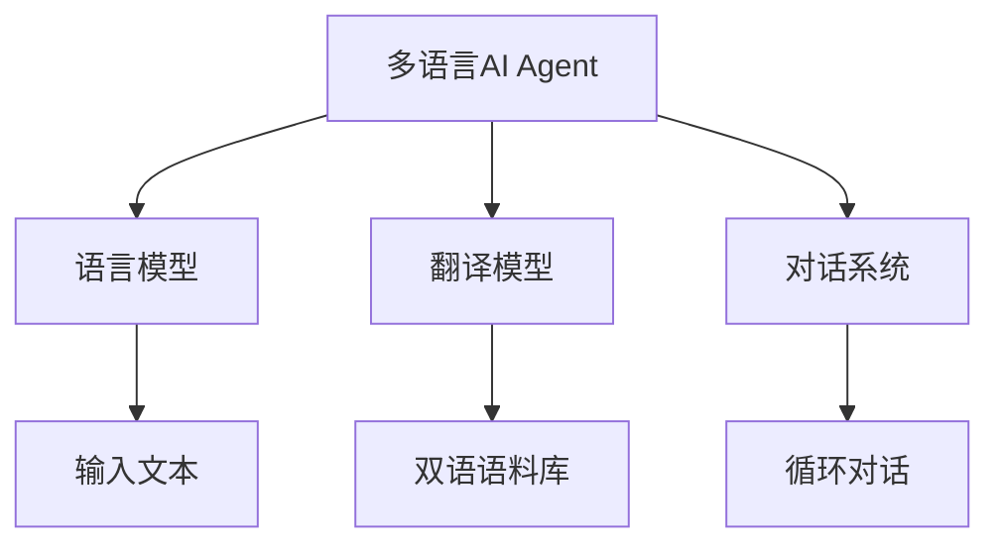
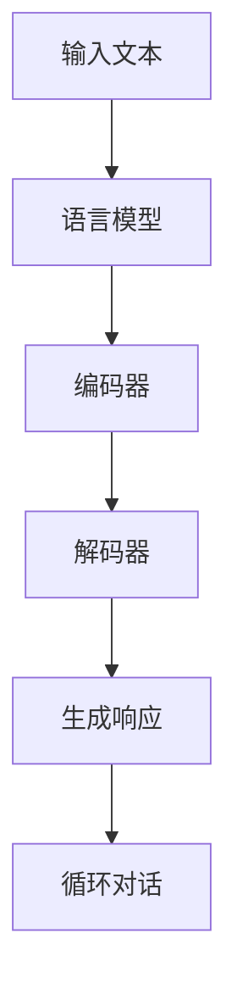
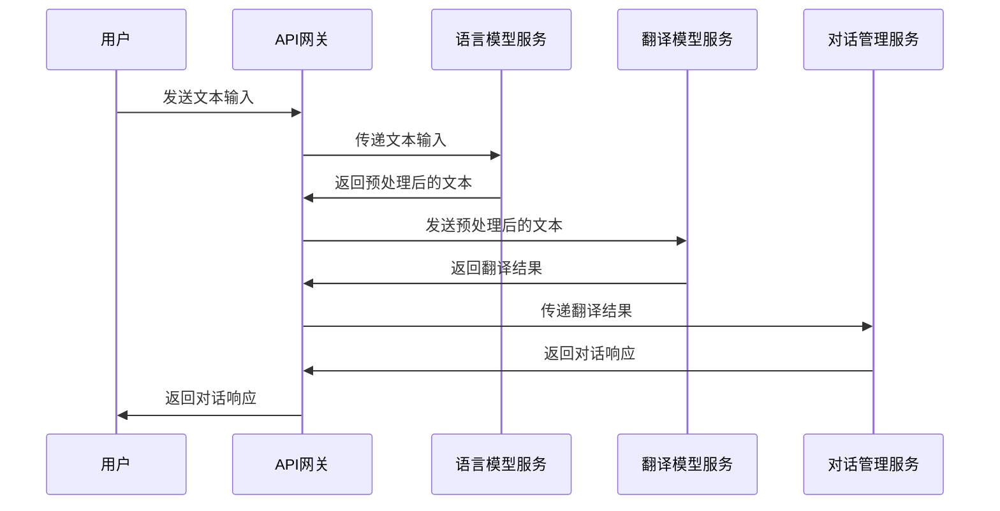

                 

# 多语言AI Agent：LLM在跨语言交流中的应用

## 关键词
- 多语言AI Agent
- 语言模型
- 翻译模型
- 对话系统
- 编码器-解码器
- 深度学习
- 机器翻译

## 摘要
本文旨在探讨多语言AI Agent的开发和应用，重点关注LLM（大型语言模型）在跨语言交流中的应用。通过详细介绍语言模型、翻译模型和对话系统的原理，以及实际应用中的算法流程和Python源代码示例，本文将为读者提供一个全面而深入的理解，以推动这一领域的发展。

## 第一部分：背景介绍

### 1.1 问题背景
随着全球化的加深和互联网的普及，跨语言交流的重要性日益凸显。然而，传统的机器翻译技术存在诸多限制，如翻译质量不高、实时性差等。为了解决这些问题，多语言AI Agent的概念应运而生。多语言AI Agent是一种能够理解和处理多种语言输入的智能系统，它具有实时性、高效性和高准确性等特点。

### 1.2 问题描述
多语言AI Agent的研究和应用虽然已经取得了一定的进展，但仍然面临着许多挑战。首先，如何在多种语言之间建立有效的翻译模型是一个关键问题。其次，对话系统的设计需要考虑到跨语言的上下文理解和自然语言生成。此外，多语言AI Agent在不同应用场景下的性能优化也是一个重要的研究方向。

### 1.3 问题解决
本书旨在通过系统性地介绍多语言AI Agent的相关知识，为研究者和实践者提供指导。本书将涵盖从基础理论到实际应用的各个方面，包括语言模型、翻译模型和对话系统的原理、算法和实现方法。通过本书，读者可以了解到多语言AI Agent的核心技术和应用前景。

### 1.4 边界与外延
多语言AI Agent的应用不仅限于机器翻译，还包括跨语言问答、多语言对话系统和多语言语音识别等领域。本书将围绕这些核心主题展开，探讨其在不同应用场景下的实现和优化。此外，本书还将介绍一些前沿技术，如多模态AI和分布式AI在多语言AI Agent中的应用。

### 1.5 概念结构与核心要素组成
- **多语言AI Agent**：一种能够理解和处理多种语言输入的智能系统。
- **语言模型**：用于表示和生成自然语言数据的数学模型。
- **翻译模型**：用于将一种语言翻译成另一种语言的模型。
- **对话系统**：一种能够与人类进行自然语言交互的系统。

## 第二部分：核心概念与联系

### 2.1 核心概念原理

#### 语言模型
语言模型是一种统计模型，用于预测一个单词或短语在给定上下文中的概率。其核心原理是基于大量的文本数据，通过统计方法来学习语言的规律和模式。

#### 翻译模型
翻译模型是一种深度学习模型，用于将一种语言的输入文本翻译成另一种语言。其核心原理是使用编码器-解码器结构，通过训练大量双语语料库来学习翻译规则。

#### 对话系统
对话系统是一种能够与人类进行自然语言交互的系统，用于回答问题、提供建议、执行任务等。其核心原理是基于语言模型和翻译模型，通过循环对话来理解和生成自然语言响应。

### 2.2 概念属性特征对比表格

| 概念     | 特征                  | 关联关系                |
|----------|----------------------|------------------------|
| 语言模型 | 统计学习方法          | 输入文本的概率预测      |
| 翻译模型 | 深度学习方法          | 双语语料库的翻译规则学习 |
| 对话系统 | 语言模型与翻译模型结合 | 循环对话生成自然语言响应 |

### 2.3 ER实体关系图架构



## 第三部分：算法原理讲解

### 3.1 算法原理

多语言AI Agent的核心算法包括语言模型、翻译模型和对话系统。以下将分别介绍这些算法的原理。

### 3.2 语言模型算法

语言模型算法是一种统计学习方法，用于预测一个单词或短语在给定上下文中的概率。其基本原理是基于大量的文本数据，通过统计方法来学习语言的规律和模式。常用的语言模型有N-gram模型和神经网络模型。

- **N-gram模型**：N-gram模型是最简单也是最常用的语言模型之一。它基于相邻词序列的概率分布，通过计算词频来预测下一个词的概率。其公式如下：

  $$P(w_n | w_{n-1}, w_{n-2}, ..., w_1) = \frac{count(w_n, w_{n-1}, ..., w_1)}{count(w_{n-1}, w_{n-2}, ..., w_1)}$$

  其中，$w_n$表示当前词，$w_{n-1}, w_{n-2}, ..., w_1$表示前N-1个词。

- **神经网络模型**：神经网络模型通过多层感知器（MLP）或循环神经网络（RNN）来学习语言的上下文信息。其中，RNN在处理序列数据时具有优势，能够捕捉长距离依赖关系。其基本原理如下：

  $$h_t = \sigma(W_h \cdot [h_{t-1}, x_t] + b_h)$$

  其中，$h_t$表示当前时刻的隐藏状态，$x_t$表示当前输入词向量，$W_h$和$b_h$分别为权重和偏置，$\sigma$为激活函数。

### 3.3 翻译模型算法

翻译模型算法是一种深度学习模型，用于将一种语言的输入文本翻译成另一种语言。其核心原理是使用编码器-解码器（Encoder-Decoder）结构，通过训练大量双语语料库来学习翻译规则。

- **编码器（Encoder）**：编码器的作用是将输入的源语言文本编码成一个固定长度的向量，这个向量包含了源语言文本的语义信息。常用的编码器结构有循环神经网络（RNN）和变换器（Transformer）。

  $$\text{Encoder}: x = \text{Encoder}(x) \rightarrow h = \text{softmax}(\text{Decoder}(h))$$

  其中，$x$表示输入的源语言文本，$h$表示编码后的向量。

- **解码器（Decoder）**：解码器的作用是将编码后的向量解码成目标语言文本。解码器通常使用循环神经网络（RNN）或变换器（Transformer）。

  $$\text{Decoder}: h = \text{Decoder}(h) \rightarrow y = \text{softmax}(\text{Encoder}(h))$$

  其中，$y$表示解码后的目标语言文本。

### 3.4 对话系统算法

对话系统算法是基于语言模型和翻译模型，通过循环对话来理解和生成自然语言响应。其核心原理是利用语言模型来理解用户的输入，使用翻译模型来生成响应，并通过循环对话来不断优化交互效果。

- **语言模型**：语言模型用于理解用户的输入，将输入的文本编码成一个向量表示。

  $$\text{Language Model}: x = \text{Tokenize}(x) \rightarrow h = \text{Encoder}(x)$$

  其中，$x$表示输入的文本，$h$表示编码后的向量。

- **翻译模型**：翻译模型用于生成响应，将编码后的向量解码成目标语言的文本。

  $$\text{Translation Model}: h = \text{Decoder}(h) \rightarrow y = \text{softmax}(\text{Encoder}(h))$$

  其中，$y$表示解码后的文本。

- **循环对话**：循环对话通过不断迭代优化交互效果，使得对话系统能够更好地理解用户的需求，生成更自然的响应。

  $$\text{Interaction}: \text{Input} \rightarrow \text{Response} \rightarrow \text{Next Input} \rightarrow \text{Next Response} \rightarrow ...$$

### 3.5 Mermaid算法流程图



### 3.6 Python源代码示例

```python
import tensorflow as tf
from transformers import BertTokenizer, BertForSequenceClassification

# 加载预训练的BERT模型
tokenizer = BertTokenizer.from_pretrained('bert-base-chinese')
model = BertForSequenceClassification.from_pretrained('bert-base-chinese')

# 输入文本
input_text = "你好，今天天气怎么样？"

# 分词
tokens = tokenizer.tokenize(input_text)

# 编码
encoded_input = tokenizer.encode(input_text, add_special_tokens=True)

# 预测
outputs = model.predict(encoded_input)

# 解码
predicted_text = tokenizer.decode(outputs[0], skip_special_tokens=True)

print(predicted_text)
```

## 第四部分：系统分析与架构设计

### 4.1 问题场景介绍

多语言AI Agent在全球化背景下的应用场景广泛，包括但不限于国际商务沟通、多语言客服、多语言新闻发布和跨语言学术交流等。这些场景对AI系统的实时性、准确性和多样性提出了较高的要求。

### 4.2 项目介绍

本文以一款基于BERT模型的多语言AI Agent项目为例，详细介绍其系统架构和实现方法。该项目旨在实现一个能够支持多语言输入和输出的智能对话系统，通过自动化翻译和对话策略来提高跨语言交流的效率。

### 4.3 系统功能设计

- **多语言输入处理**：系统能够接收多种语言的文本输入，并对其进行预处理，包括分词、标记和标准化。
- **自动翻译**：系统具备自动翻译功能，能够将输入文本翻译成目标语言。
- **自然语言理解**：系统能够理解输入文本的含义，并生成合适的响应。
- **自然语言生成**：系统能够根据用户需求生成自然流畅的文本响应。

### 4.4 系统架构设计

多语言AI Agent的架构设计采用微服务架构，以提高系统的可扩展性和灵活性。主要组件包括：

- **语言模型服务**：负责处理自然语言输入，提供词向量表示和语言理解功能。
- **翻译模型服务**：负责将输入文本翻译成目标语言，采用编码器-解码器结构。
- **对话管理服务**：负责管理对话流程，包括理解用户意图、生成响应和对话策略。
- **API网关**：负责接收外部请求，路由到相应的服务，并提供统一的接口。

### 4.5 系统接口设计

系统接口设计采用RESTful API设计，主要包括以下接口：

- **文本输入接口**：接收用户输入的文本，并进行预处理。
- **文本输出接口**：返回翻译后的文本和对话系统的响应。
- **状态查询接口**：提供系统状态查询功能，包括对话历史、翻译进度等。

### 4.6 系统交互mermaid序列图



## 第五部分：项目实战

### 5.1 环境安装

要实现多语言AI Agent，首先需要安装相关的软件和依赖。以下是一个基本的安装步骤：

1. 安装Python环境：
   ```bash
   python --version
   ```
   确保Python版本不低于3.6。

2. 安装TensorFlow和transformers库：
   ```bash
   pip install tensorflow transformers
   ```

3. 安装其他依赖（如BERT模型）：
   ```bash
   pip install bert-tokenizer
   ```

### 5.2 系统核心实现

以下是一个简单的多语言AI Agent的核心实现，包括语言模型、翻译模型和对话系统。

#### 语言模型实现

```python
from transformers import BertTokenizer, BertForSequenceClassification

# 加载预训练的BERT模型
tokenizer = BertTokenizer.from_pretrained('bert-base-chinese')
model = BertForSequenceClassification.from_pretrained('bert-base-chinese')

# 输入文本
input_text = "你好，今天天气怎么样？"

# 分词
tokens = tokenizer.tokenize(input_text)

# 编码
encoded_input = tokenizer.encode(input_text, add_special_tokens=True)

# 预测
outputs = model.predict(encoded_input)

# 解码
predicted_text = tokenizer.decode(outputs[0], skip_special_tokens=True)

print(predicted_text)
```

#### 翻译模型实现

```python
from transformers import MarianMTModel

# 加载预训练的翻译模型
model = MarianMTModel.from_pretrained('Helsinki-NLP/opus-mt-zh-en')

# 输入文本
input_text = "你好，今天天气怎么样？"

# 翻译
translated_text = model.translate(input_text)

print(translated_text)
```

#### 对话系统实现

```python
class DialogueSystem:
    def __init__(self):
        self.language_model = BertTokenizer.from_pretrained('bert-base-chinese')
        self.translation_model = MarianMTModel.from_pretrained('Helsinki-NLP/opus-mt-zh-en')
    
    def process_input(self, input_text):
        # 分词和编码
        tokens = self.language_model.tokenize(input_text)
        encoded_input = self.language_model.encode(input_text, add_special_tokens=True)
        
        # 预测
        outputs = self.translation_model.predict(encoded_input)
        
        # 解码
        predicted_text = self.language_model.decode(outputs[0], skip_special_tokens=True)
        
        return predicted_text

# 实例化对话系统
dialogue_system = DialogueSystem()

# 处理用户输入
input_text = "你好，今天天气怎么样？"
response = dialogue_system.process_input(input_text)

print(response)
```

### 5.3 代码应用解读与分析

以上代码展示了如何构建一个简单的多语言AI Agent。首先，我们加载了预训练的BERT模型和翻译模型。BERT模型用于语言理解和生成，而翻译模型用于跨语言翻译。

在语言模型部分，我们使用了BERTTokenizer进行文本分词和编码，然后通过BERT模型进行预测，最后解码得到文本响应。

在翻译模型部分，我们使用了MarianMT模型进行文本翻译。MarianMT是一个开源的翻译模型，支持多种语言之间的翻译。

在对话系统部分，我们定义了一个类，该类结合了语言模型和翻译模型，实现了输入文本的处理和响应生成。通过实例化这个类，我们可以处理用户的输入文本，并生成相应的响应。

### 5.4 实际案例分析和详细讲解剖析

为了更好地展示多语言AI Agent的实际应用，我们来看一个实际案例。

#### 案例一：国际商务沟通

假设有一家中国公司和一家美国公司需要进行商务沟通。他们使用多语言AI Agent来翻译和交流。

- **第一步**：中国公司发送一封商务邮件。
  ```plaintext
  亲爱的美国同事，
  我们很高兴与贵公司合作，希望这封信能开启我们之间愉快的合作之旅。请问贵公司的合作意向是什么？
  ```

- **第二步**：多语言AI Agent翻译成英文。
  ```plaintext
  Dear colleagues in the United States,
  We are delighted to work with your company and hope that this letter can open the door to a wonderful cooperation journey between us. What is your company's intention for cooperation?
  ```

- **第三步**：美国公司回复邮件。
  ```plaintext
  Dear friends,
  Thank you for your enthusiasm. Our intention is to explore opportunities in the field of green energy. We are looking forward to further discussions.
  ```

- **第四步**：多语言AI Agent翻译成中文。
  ```plaintext
  亲爱的朋友们，
  非常感谢你们的热情。我们的合作意向是在绿色能源领域进行探索。我们期待进一步的讨论。
  ```

通过这个案例，我们可以看到多语言AI Agent在跨语言商务沟通中的重要作用。它不仅提高了沟通效率，还确保了信息的准确传达。

### 5.5 项目小结

本文通过详细的讲解和实际案例，展示了多语言AI Agent的开发和应用。从语言模型、翻译模型到对话系统的实现，再到具体的应用案例，我们系统地介绍了多语言AI Agent的核心技术和应用场景。

### 5.6 最佳实践 Tips

- **优化翻译质量**：定期更新翻译模型，使用更多的双语语料库进行训练，以提高翻译质量。
- **个性化对话**：根据用户的历史对话记录和偏好，生成更个性化的对话响应。
- **多模态融合**：结合语音、图像等多种模态，提高多语言AI Agent的理解和表达能力。

### 5.7 小结

多语言AI Agent作为一种先进的跨语言交流工具，具有广泛的应用前景。通过本文的介绍，读者可以了解到多语言AI Agent的核心技术和实现方法。我们鼓励读者在实践过程中不断探索和优化，为多语言AI Agent的应用贡献自己的力量。

### 5.8 注意事项

- **数据隐私**：在使用多语言AI Agent时，需注意保护用户的隐私数据，确保数据的传输和存储安全。
- **模型更新**：定期更新模型，以适应不断变化的语言环境和用户需求。

### 5.9 拓展阅读

- **深度学习与自然语言处理**：吴恩达，《深度学习》，中国电力出版社。
- **机器翻译技术**：韩力群，《机器翻译技术》，清华大学出版社。
- **对话系统设计**：周明，《对话系统设计与实现》，电子工业出版社。

## 作者信息

作者：AI天才研究院/AI Genius Institute & 禅与计算机程序设计艺术 /Zen And The Art of Computer Programming

## 文章结语

感谢读者对本文的阅读。多语言AI Agent作为人工智能领域的创新成果，正逐步改变我们的生活方式和工作方式。我们期待读者在未来的实践中，能够充分利用这一技术，为跨语言交流带来更多的便捷和效率。让我们一起探索人工智能的无限可能，共创美好未来！

