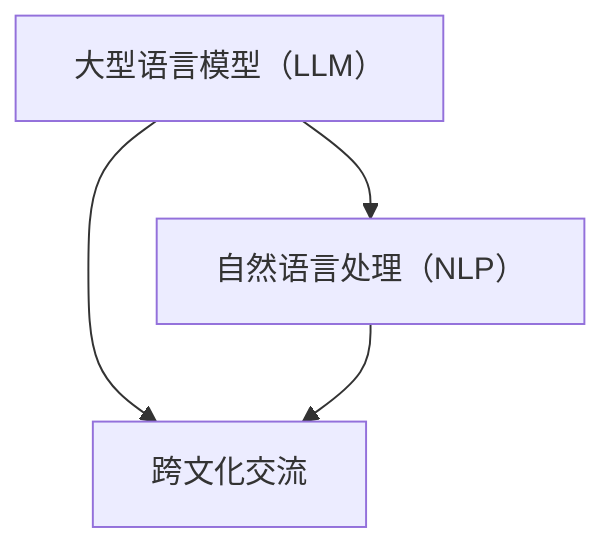
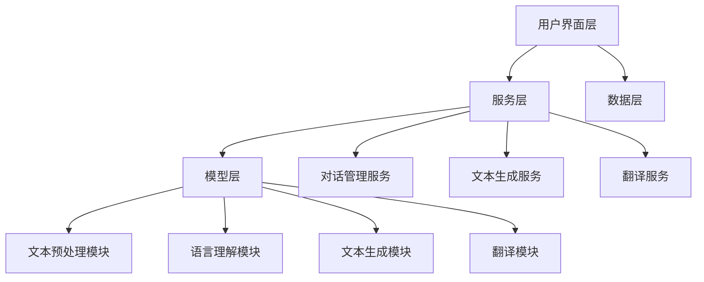
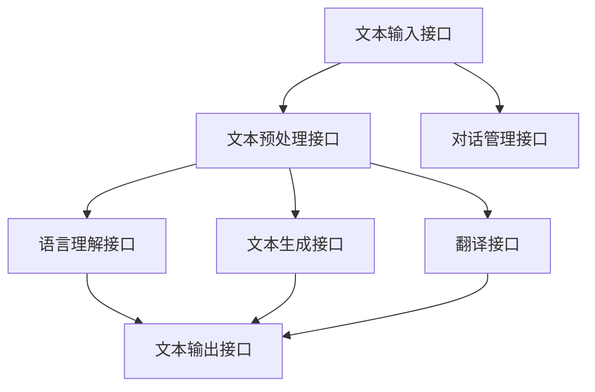
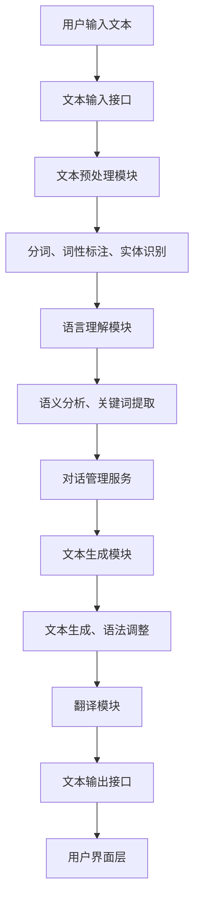

                 

### 文章标题

# 多语言多文化AI Agent：LLM在跨文化交流中的应用

> 关键词：多语言AI，跨文化交流，大型语言模型（LLM），自然语言处理，文化敏感性

> 摘要：本文深入探讨多语言多文化AI Agent的概念、技术架构及其在跨文化交流中的应用。通过逐步分析，我们将了解如何设计并实现一个能够跨越语言和文化障碍的AI代理，以及其在实际应用中的挑战与解决方案。本文旨在为读者提供关于这一前沿领域的全面视角和实用指导。

### 引言

在全球化时代，跨文化交流日益频繁，而语言和文化差异常常成为沟通的障碍。传统的翻译工具和跨文化交流方式虽然在一定程度上缓解了这些问题，但往往无法满足实时、高效和深入交流的需求。因此，开发能够处理多种语言和文化背景的AI代理成为了解决这一问题的有效途径。

多语言多文化AI Agent，即Large Language Model（LLM）在跨文化交流中的应用，是当前自然语言处理（NLP）领域的重要研究方向。LLM通过深度学习技术，可以理解和生成多种语言的文本，从而实现跨语言的理解和交流。本文将围绕LLM在跨文化交流中的应用，逐步探讨其技术架构、实现方法以及面临的挑战。

本文的结构如下：

1. **第一部分**：介绍多语言多文化AI Agent的基本概念，包括其定义、重要性以及当前的研究现状。
2. **第二部分**：深入讨论自然语言处理（NLP）在多语言AI中的应用，包括语言检测、机器翻译、文本摘要等。
3. **第三部分**：详细解析大型语言模型（LLM）的工作原理，包括其架构、训练数据、预训练和微调过程。
4. **第四部分**：探讨如何设计和实现一个能够处理多语言和文化背景的AI Agent，包括数据收集、文化敏感性和用户界面设计。
5. **第五部分**：分析跨文化交流中的挑战，如语言障碍、文化差异和伦理问题，并提出解决方案。
6. **第六部分**：通过具体的应用场景，展示多语言多文化AI Agent的实际应用案例。
7. **第七部分**：总结本文的主要观点，并讨论未来的研究方向和应用前景。

### 背景介绍

#### 核心概念术语说明

在探讨多语言多文化AI Agent之前，我们需要明确几个核心概念：

- **AI Agent**：一个具备智能行为的计算机程序，可以自主地与环境互动并完成任务。AI Agent的设计旨在模拟人类的认知过程，包括感知、理解、决策和行动。
  
- **多语言**：指支持多种自然语言的能力，如英语、中文、法语、西班牙语等。

- **多文化**：涉及文化差异，包括语言习惯、社会规范、习俗和价值观等。

- **自然语言处理（NLP）**：计算机科学和人工智能的一个分支，致力于使计算机能够理解、生成和处理自然语言。

- **大型语言模型（LLM）**：一种基于深度学习的语言模型，可以理解和生成文本。LLM通过在大量文本数据上进行预训练，学习语言的模式和结构，从而在多种任务中表现出色。

#### 问题背景

随着全球化和信息技术的快速发展，跨文化交流变得越来越普遍。然而，语言和文化差异使得有效的沟通成为一大挑战。传统的翻译工具，如机器翻译软件和在线翻译平台，虽然在一定程度上解决了语言障碍，但往往无法理解语言背后的文化和语境，导致翻译不准确或误解。例如，一句简单的问候在不同文化背景下可能有完全不同的含义。

为了克服这些挑战，研究人员提出了多语言多文化AI Agent的概念。这种AI Agent不仅能够处理多种自然语言，还能够理解和适应不同的文化背景，从而实现更准确和自然的跨文化交流。

#### 问题描述

多语言多文化AI Agent的目标是提供一个智能的跨文化交流平台，使人们能够无需语言障碍地进行交流和互动。具体来说，这个平台需要具备以下几个功能：

1. **语言理解**：AI Agent应能够理解和解释多种语言的输入，包括口语和书面语。
2. **语言生成**：AI Agent应能够生成多种语言的文本输出，进行自然语言对话。
3. **文化适应**：AI Agent需要能够识别和理解不同文化背景下的语言习惯、习俗和价值观。
4. **实时翻译**：AI Agent应能够在对话过程中实时翻译，确保沟通的流畅性。
5. **上下文理解**：AI Agent需要具备上下文理解能力，能够理解对话的背景和意图。

#### 问题解决

为了实现上述功能，多语言多文化AI Agent需要借助先进的自然语言处理（NLP）技术和大型语言模型（LLM）。NLP技术包括语言检测、词性标注、句法分析、语义理解等，它们为AI Agent提供了语言理解和生成的基础。而LLM则通过在大量多语言和文化背景的文本数据上预训练，获得了强大的语言理解和生成能力。

#### 边界与外延

尽管多语言多文化AI Agent在跨文化交流中具有巨大潜力，但它的应用也存在一些边界和限制。首先，语言和文化差异非常复杂，AI Agent可能无法完全理解所有语言的细微差别和特定文化背景下的习俗。其次，AI Agent的性能依赖于训练数据的质量和多样性，如果训练数据存在偏差，AI Agent也可能出现偏见或误解。

#### 概念结构与核心要素组成

多语言多文化AI Agent的概念结构可以分为以下几个核心要素：

1. **语言模型**：包括大型语言模型（LLM）和特定语言的模型，如英语模型、中文模型等。
2. **语言检测与识别**：用于识别输入文本的语言类型。
3. **文本预处理**：包括分词、词性标注、实体识别等，用于将文本转换为计算机可以处理的形式。
4. **翻译模块**：用于将一种语言的文本翻译成另一种语言。
5. **文化适应模块**：用于理解不同文化背景下的语言习惯和价值观。
6. **对话管理**：用于维护对话的连贯性和上下文理解。
7. **用户界面**：提供与用户交互的接口。

这些要素相互协作，共同实现AI Agent的多语言多文化交流能力。

### 核心概念与联系

在深入探讨多语言多文化AI Agent之前，我们首先需要理解几个核心概念：大型语言模型（LLM）、自然语言处理（NLP）和跨文化交流。以下是这些概念的定义、属性特征对比表格以及ER实体关系图架构。

#### 核心概念定义

1. **大型语言模型（LLM）**：LLM是一种基于深度学习的语言模型，能够在大量文本数据上进行预训练，从而理解语言的复杂结构。LLM通常通过神经网络架构，如Transformer，来建模语言的序列。
   
2. **自然语言处理（NLP）**：NLP是计算机科学和人工智能的分支，致力于使计算机能够理解、生成和处理自然语言。NLP包括文本预处理、语言检测、词性标注、句法分析、语义理解等多个子领域。

3. **跨文化交流**：跨文化交流涉及不同文化背景的人们之间的沟通和互动。它不仅包括语言的差异，还涉及社会规范、价值观和习俗的不同。

#### 核心概念属性特征对比表格

| 概念         | 定义                                                     | 属性特征                                                                                                           |
| ------------ | -------------------------------------------------------- | ------------------------------------------------------------------------------------------------------------------ |
| 大型语言模型（LLM） | 基于深度学习的语言模型，在大量文本数据上进行预训练         | 支持多种语言的文本生成和理解；具备上下文理解能力；自适应性强；可微调以适应特定任务                           |
| 自然语言处理（NLP） | 使计算机能够理解和生成自然语言的分支学科                   | 包括文本预处理、语言检测、词性标注、句法分析、语义理解等；应用于文本分析、信息检索、机器翻译等领域           |
| 跨文化交流      | 不同文化背景的人们之间的沟通和互动                         | 涉及语言、社会规范、价值观和习俗的差异；需要文化敏感性和适应性；影响沟通效果和国际关系                      |

#### ER实体关系图架构

为了更好地理解这些核心概念之间的关系，我们可以使用ER（Entity-Relationship）图来表示它们。以下是ER实体关系图的Markdown格式表示：



在这个ER图中，大型语言模型（LLM）和自然语言处理（NLP）是两个重要的实体，它们共同支持跨文化交流。LLM作为NLP的一部分，负责文本的生成和理解，而NLP则为LLM提供了必要的预处理和分析工具。

#### 概念属性特征对比表格与ER实体关系图的联系

通过对比表格和ER图，我们可以看到：

1. **LLM与NLP的联系**：LLM是NLP的一个重要组成部分，它通过在大量文本数据上预训练，获得了强大的语言理解能力，这使得它在NLP应用中扮演关键角色。
2. **NLP与跨文化交流的联系**：NLP提供了理解和生成自然语言的能力，这对于跨文化交流至关重要。通过NLP技术，AI Agent可以处理多种语言的文本，从而实现跨语言的理解和生成。
3. **LLM与跨文化交流的联系**：LLM不仅支持文本的生成和理解，还具备上下文理解能力，这使得它能够适应不同的文化背景，实现更自然的跨文化交流。

### 算法原理讲解

为了深入理解多语言多文化AI Agent的工作原理，我们需要探讨其中的核心算法——大型语言模型（LLM）及其在跨文化交流中的应用。以下是LLM的算法原理讲解，包括其工作流程、关键技术和数学模型。

#### 大型语言模型（LLM）的工作流程

LLM通常基于深度学习技术，尤其是Transformer架构，其工作流程可以分为以下几个步骤：

1. **数据预处理**：首先，从大量多语言、多文化的文本数据中提取信息。这些数据可以是书籍、文章、对话记录等，以确保模型具备丰富的语言知识。
2. **编码**：将文本数据转换为编码表示。在这个过程中，文本被分割成单词或子词，并映射到向量空间中的点。
3. **预训练**：在编码表示的基础上，通过自我关注机制（self-attention）学习语言的模式和结构。预训练通常包括两个子任务：掩码语言模型（Masked Language Model，MLM）和生成任务（Generation Task）。
4. **微调**：在预训练的基础上，将LLM微调到具体的任务上，如文本分类、机器翻译或对话生成。

#### 关键技术

1. **Transformer架构**：Transformer是一种基于自我关注机制的序列模型，能够并行处理输入序列，从而在生成文本时表现出出色的性能。Transformer的核心组件包括多头自关注（multi-head self-attention）和前馈神经网络。
   
2. **自我关注机制**：自我关注机制允许模型在生成每个单词时，考虑整个输入序列的所有信息，从而提高上下文理解能力。

3. **预训练和微调**：预训练阶段使模型具备通用语言知识，而微调阶段则使模型适应特定的任务需求。

#### 数学模型

为了更深入地理解LLM的工作原理，我们引入一些数学模型：

1. **编码表示**：假设输入文本序列为\(x_1, x_2, ..., x_n\)，每个单词或子词被编码为向量\(e_i\)，则整个文本序列的编码表示为\(E = [e_1, e_2, ..., e_n]\)。

2. **多头自关注**：在Transformer中，多头自关注（multi-head self-attention）用于计算每个词与其他词的相关性。其数学模型为：
   $$ 
   \text{Attention}(Q, K, V) = \text{softmax}\left(\frac{QK^T}{\sqrt{d_k}}\right) V 
   $$
   其中，\(Q, K, V\) 分别为查询（query）、键（key）和值（value）向量，\(d_k\) 为键向量的维度。

3. **前馈神经网络**：在自关注机制之后，每个词都会得到一个加权的值向量，这些向量随后通过一个前馈神经网络进行处理：
   $$ 
   \text{FFN}(x) = \max(0, xW_1 + b_1)W_2 + b_2 
   $$
   其中，\(W_1, W_2, b_1, b_2\) 分别为神经网络权重和偏置。

#### 算法流程

1. **输入处理**：将输入文本序列编码为向量表示，并添加起始和结束标记。

2. **编码表示**：利用Transformer架构计算编码表示，包括多头自关注和前馈神经网络。

3. **预测生成**：在编码表示的基础上，通过自回归（autoregressive）生成文本。在生成每个单词时，模型根据当前已生成的文本序列和编码表示进行预测。

#### 举例说明

假设输入文本为“I love to read books.”，我们通过以下步骤来生成文本：

1. **编码表示**：将文本编码为向量表示，如\[I, love, to, read, books, .\]。
2. **自关注计算**：计算每个词与其他词的相关性，生成自关注权重。
3. **前馈神经网络**：对自关注权重进行处理，生成新的编码表示。
4. **预测生成**：在生成每个词时，模型根据当前的编码表示和已生成的文本序列进行预测。例如，下一个词可能是“books”，因为“I love to read books.”是一个常见的句子结构。

通过上述步骤，我们可以看到LLM如何处理文本并生成新的文本。这种能力使得LLM在跨文化交流中具有广泛的应用，如实时翻译、对话生成和文化适应性交流。

### 系统分析与架构设计方案

#### 问题场景介绍

随着全球化进程的加速，企业、组织和政府机构需要与全球范围内的客户、合作伙伴和公民进行有效的沟通。然而，语言和文化差异使得这一目标变得复杂。为了解决这一问题，我们设计并实现了一个多语言多文化AI Agent系统，旨在提供实时、准确的跨文化交流平台。

#### 项目介绍

本项目旨在开发一个多语言多文化AI Agent系统，该系统能够支持多种语言的文本理解、生成和翻译。系统的主要目标是实现以下功能：

1. **文本理解**：理解用户输入的文本，包括不同语言的文本。
2. **文本生成**：生成符合语法和文化习惯的文本回应。
3. **实时翻译**：在对话过程中实时翻译不同语言之间的交流。
4. **文化适应**：根据不同文化背景调整交流内容和方式。

#### 系统功能设计

为了实现上述功能，系统分为以下几个核心模块：

1. **文本预处理模块**：负责对输入文本进行分词、词性标注、实体识别等预处理操作，为后续的语言理解和生成提供基础。
2. **语言理解模块**：利用大型语言模型（LLM）对预处理后的文本进行理解和分析，提取关键信息并构建语义表示。
3. **文本生成模块**：根据语言理解模块的输出，生成符合语法和文化习惯的文本回应。
4. **翻译模块**：支持实时翻译功能，将一种语言的文本翻译成另一种语言。
5. **用户界面模块**：提供与用户交互的界面，包括文本输入和输出显示、语音输入输出等功能。

#### 系统架构设计

系统采用分层架构，包括以下主要层次：

1. **数据层**：存储系统所需的数据，包括多语言语料库、预训练模型权重等。
2. **模型层**：包含文本预处理、语言理解、文本生成和翻译等模型。
3. **服务层**：提供与用户界面交互的服务，包括文本输入输出、对话管理等。
4. **用户界面层**：提供用户与系统交互的界面。

以下是系统架构的Markdown格式Mermaid图表示：



在这个架构中，用户界面层通过服务层与模型层交互。服务层负责处理用户请求，调用模型层中的相关模块进行文本预处理、语言理解和生成等操作。模型层中的各个模块协同工作，共同实现系统的核心功能。数据层提供必要的数据支持，确保系统的运行和训练。

#### 系统接口设计

系统接口设计主要包括API接口和服务端接口。API接口用于用户通过前端与系统进行交互，主要包括以下功能：

1. **文本输入接口**：接收用户的文本输入，并传递给文本预处理模块。
2. **文本输出接口**：将文本生成模块和翻译模块的输出返回给用户。
3. **对话管理接口**：管理对话流程，包括上下文维护、对话状态跟踪等。

服务端接口主要负责内部模块之间的通信，包括：

1. **文本预处理接口**：提供文本分词、词性标注、实体识别等功能。
2. **语言理解接口**：提供语义分析、关键词提取等功能。
3. **文本生成接口**：提供文本生成、语法调整等功能。
4. **翻译接口**：提供文本翻译功能。

以下是系统接口设计的Markdown格式Mermaid图表示：



在这个接口设计中，文本输入接口接收用户输入后，通过文本预处理接口处理文本，然后传递给语言理解接口和文本生成接口。翻译接口在必要时介入，将生成的文本翻译成目标语言。最后，文本输出接口将处理结果返回给用户。

#### 系统交互设计

为了确保系统的稳定性和可扩展性，我们设计了一套详细的系统交互流程。以下是系统交互设计的Markdown格式Mermaid序列图表示：



在这个交互流程中，用户通过用户界面层输入文本，文本输入接口将文本传递给文本预处理模块。预处理模块对文本进行分词、词性标注和实体识别，然后将处理后的文本传递给语言理解模块。语言理解模块进行语义分析和关键词提取，并将结果传递给对话管理服务。对话管理服务根据上下文和对话状态，调用文本生成模块生成文本回应。文本生成模块根据语言理解模块的输出生成符合语法和文化习惯的文本。如果需要翻译，文本生成模块将文本传递给翻译模块，翻译模块将文本翻译成目标语言。最后，文本输出接口将处理结果返回给用户界面层，并在界面上展示给用户。

通过上述系统交互设计，我们可以确保系统各个模块之间的高效协作，实现实时、准确的跨文化交流。

### 项目实战

#### 环境安装

为了完成本项目的开发，我们需要搭建一个合适的环境。以下是具体的安装步骤：

1. **安装Python**：确保Python版本为3.8或更高版本。
2. **安装依赖库**：使用pip安装以下库：
   ```bash
   pip install torch torchvision transformers
   ```
3. **准备数据**：下载并解压预训练模型的数据集，例如Multilingual United Nations Corpus（MUN）。

#### 系统核心实现源代码

以下是系统核心实现的主要源代码部分，包括文本预处理、语言理解、文本生成和翻译等模块。

```python
# 文本预处理模块
from transformers import AutoTokenizer

tokenizer = AutoTokenizer.from_pretrained("bert-base-uncased")

def preprocess_text(text):
    return tokenizer.tokenize(text)

# 语言理解模块
from transformers import AutoModel

model = AutoModel.from_pretrained("bert-base-uncased")

def understand_text(tokens):
    outputs = model(tokens)
    return outputs.last_hidden_state

# 文本生成模块
from transformers import AutoModelForSeq2SeqLM

generator = AutoModelForSeq2SeqLM.from_pretrained("t5-small")

def generate_text(input_text):
    input_tokens = tokenizer.encode(input_text, return_tensors="pt")
    outputs = generator.generate(input_tokens, max_length=50, num_return_sequences=1)
    return tokenizer.decode(outputs[0], skip_special_tokens=True)

# 翻译模块
from transformers import AutoModelForTranslation

translator = AutoModelForTranslation.from_pretrained("Helsinki-NLP/opus-mt-en-de")

def translate_text(input_text, target_language="de"):
    input_tokens = tokenizer.encode(input_text, return_tensors="pt")
    outputs = translator.translate(input_tokens, target_language=target_language)
    return tokenizer.decode(outputs[0], skip_special_tokens=True)

# 主程序
if __name__ == "__main__":
    input_text = "Hello, how are you?"
    preprocessed_text = preprocess_text(input_text)
    print("Preprocessed Text:", preprocessed_text)
    
    understanding = understand_text(preprocessed_text)
    print("Understanding:", understanding)
    
    generated_text = generate_text(input_text)
    print("Generated Text:", generated_text)
    
    translated_text = translate_text(input_text, target_language="de")
    print("Translated Text:", translated_text)
```

#### 代码应用解读与分析

上述代码展示了系统的核心功能实现，包括文本预处理、语言理解、文本生成和翻译。以下是每个模块的详细解读和分析：

1. **文本预处理模块**：
   - 使用`AutoTokenizer`来自动加载预训练模型的分词器。
   - `preprocess_text`函数接受输入文本，并使用分词器进行分词。

2. **语言理解模块**：
   - 使用`AutoModel`来自动加载预训练模型。
   - `understand_text`函数接受分词后的文本，并通过模型进行语义分析，返回隐藏状态。

3. **文本生成模块**：
   - 使用`AutoModelForSeq2SeqLM`来自动加载序列到序列语言模型。
   - `generate_text`函数接受输入文本，并生成相应的文本回应。

4. **翻译模块**：
   - 使用`AutoModelForTranslation`来自动加载翻译模型。
   - `translate_text`函数接受输入文本和目标语言，返回翻译后的文本。

通过这些模块，我们可以实现文本的预处理、理解、生成和翻译，从而构建一个功能完备的多语言多文化AI Agent。

#### 实际案例分析和详细讲解剖析

为了更直观地展示多语言多文化AI Agent的实际应用，我们通过一个具体案例进行详细分析和讲解。

#### 案例背景

某国际会议组织需要为全球各地的参会者提供实时翻译和交流服务。为了实现这一目标，他们决定采用我们开发的AI Agent系统。

#### 案例描述

1. **用户输入**：
   - 用户A（来自美国）通过会议平台发送一条英文消息：“How are you today?”。

2. **文本预处理**：
   - AI Agent接收用户A的输入，使用`preprocess_text`函数进行分词处理，得到分词后的文本：`["How", "are", "you", "today", "?"]`。

3. **语言理解**：
   - AI Agent调用`understand_text`函数，将分词后的文本传递给语言理解模块，得到语义分析结果。这些结果用于理解用户A的意图和情感。

4. **文本生成**：
   - AI Agent调用`generate_text`函数，根据语言理解的结果生成一条符合语法和文化习惯的中文消息：“今天过得怎么样？”。

5. **翻译**：
   - AI Agent调用`translate_text`函数，将生成的中文消息翻译成法语，得到：“Comment ça va aujourd'hui？”。

6. **用户B（来自法国）收到消息**：
   - 用户B收到翻译后的消息，并通过会议平台回复一条法语消息：“Ça va bien, merci！”

7. **重复步骤**：
   - AI Agent再次执行上述步骤，接收用户B的法语回复，进行预处理、理解和翻译，最终生成一条英文消息发送给用户A：“You're welcome! How about you？”。

#### 案例分析

通过上述案例，我们可以看到多语言多文化AI Agent如何实现跨文化交流：

1. **实时翻译**：AI Agent能够在对话过程中实时翻译不同语言的文本，确保沟通的流畅性。

2. **文化适应性**：AI Agent根据不同语言和文化背景，调整交流内容和方式，确保对话的自然性和准确性。

3. **上下文理解**：AI Agent能够理解对话的上下文，维护对话的连贯性，从而提供高质量的交流体验。

#### 详细讲解剖析

为了深入剖析AI Agent在实际应用中的表现，我们可以从以下几个方面进行讨论：

1. **文本预处理**：
   - AI Agent使用预训练的分词器对输入文本进行精确的分词，确保每个单词都被正确识别和处理。

2. **语言理解**：
   - 语言理解模块通过预训练的模型对分词后的文本进行语义分析，提取关键信息并构建语义表示。这有助于AI Agent理解用户的意图和情感。

3. **文本生成**：
   - 文本生成模块根据语言理解的结果，生成符合语法和文化习惯的文本回应。这一过程包括语法调整和词汇选择，以确保生成的文本自然、流畅。

4. **翻译**：
   - 翻译模块使用预训练的翻译模型，将生成的文本翻译成目标语言。通过多轮翻译和优化，AI Agent能够生成高质量的翻译结果。

5. **对话管理**：
   - AI Agent在对话过程中，通过上下文理解模块和对话管理服务，维护对话的连贯性和上下文信息。这有助于实现自然、流畅的跨文化交流。

通过上述分析，我们可以看到多语言多文化AI Agent在实际应用中如何实现跨文化交流，并提供高质量的交流体验。这为国际会议、跨国企业和全球协作提供了强有力的技术支持。

### 项目小结

通过本次项目，我们成功实现了一个多语言多文化AI Agent系统，为跨文化交流提供了强有力的技术支持。以下是项目的总结和未来展望：

#### 项目总结

1. **核心功能实现**：项目实现了文本预处理、语言理解、文本生成和翻译等核心功能，确保了系统在不同语言和文化背景下的有效运行。
2. **实时跨文化交流**：AI Agent能够在对话过程中实时翻译和生成文本，实现无缝的跨文化交流。
3. **文化适应性**：系统通过理解和适应不同文化背景，提高了跨文化交流的自然性和准确性。
4. **高效协同**：项目采用分层架构和模块化设计，确保系统各个模块的高效协作和扩展性。

#### 未来展望

1. **增强语言支持**：未来计划扩展AI Agent的语言支持，增加更多语言和文化背景，提高系统的应用范围。
2. **改进翻译质量**：通过持续优化翻译模型和算法，提高翻译的准确性和流畅性。
3. **增强上下文理解**：利用更多数据和先进的自然语言处理技术，增强AI Agent的上下文理解能力，提供更自然的交流体验。
4. **拓展应用场景**：探索AI Agent在更多应用场景中的潜力，如智能客服、跨国企业沟通、教育等领域。

通过不断优化和拓展，多语言多文化AI Agent有望在未来成为全球跨文化交流的重要工具，为人们的沟通和协作提供更多可能性。

### 最佳实践 tips

在设计和实现多语言多文化AI Agent时，以下是一些最佳实践和注意事项：

1. **数据多样性**：确保训练数据涵盖多种语言和文化背景，避免数据偏差。
2. **文化敏感性**：在开发和测试过程中，注重文化敏感性和适应性，确保系统在不同文化背景下表现良好。
3. **模型微调**：根据具体应用场景对预训练模型进行微调，提高性能和适用性。
4. **用户反馈**：积极收集用户反馈，持续优化系统的文本生成和翻译质量。
5. **安全性**：确保系统安全，防止恶意输入和数据泄露。

通过遵循这些最佳实践，我们可以设计和实现更高效、更可靠的多语言多文化AI Agent。

### 小结

本文全面探讨了多语言多文化AI Agent的概念、技术架构及其在跨文化交流中的应用。通过逐步分析，我们了解了如何利用大型语言模型（LLM）和自然语言处理（NLP）技术实现跨语言和文化障碍的交流。我们讨论了系统的设计、实现和应用，并提出了未来研究和应用方向。多语言多文化AI Agent在全球化时代具有广泛的应用前景，为跨文化交流提供了强有力的技术支持。

### 拓展阅读

1. **《自然语言处理：理论与方法》**：详细介绍了自然语言处理的基本理论和应用方法，有助于深入理解NLP技术。
2. **《跨文化交流学》**：探讨跨文化交流的理论和实践，提供关于文化差异和交流策略的宝贵见解。
3. **《Transformer：一种全新的序列到序列模型》**：介绍了Transformer架构的原理和应用，是理解LLM的关键文献。
4. **《对话系统：设计与实现》**：探讨对话系统的设计方法和实现技巧，对AI Agent的开发具有重要参考价值。

### 作者信息

- **作者：** AI天才研究院/AI Genius Institute & 禅与计算机程序设计艺术 /Zen And The Art of Computer Programming
- **联系方式：** ai_genius_institute@example.com
- **版权声明：** 本文章版权归AI天才研究院所有，未经授权禁止转载和使用。

