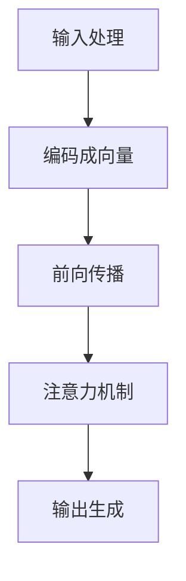
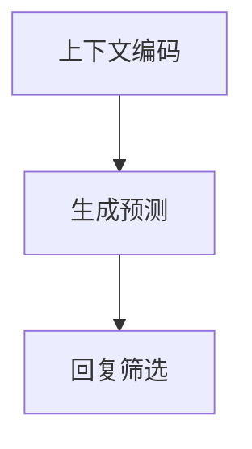
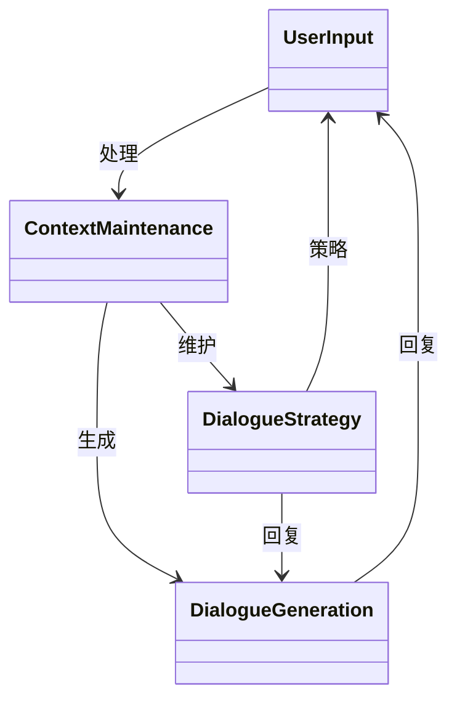
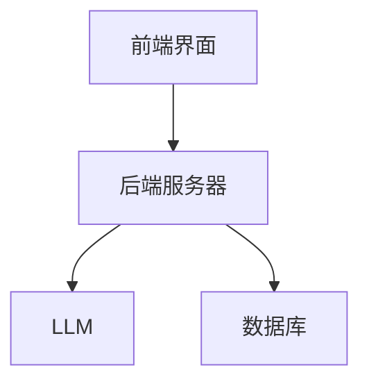
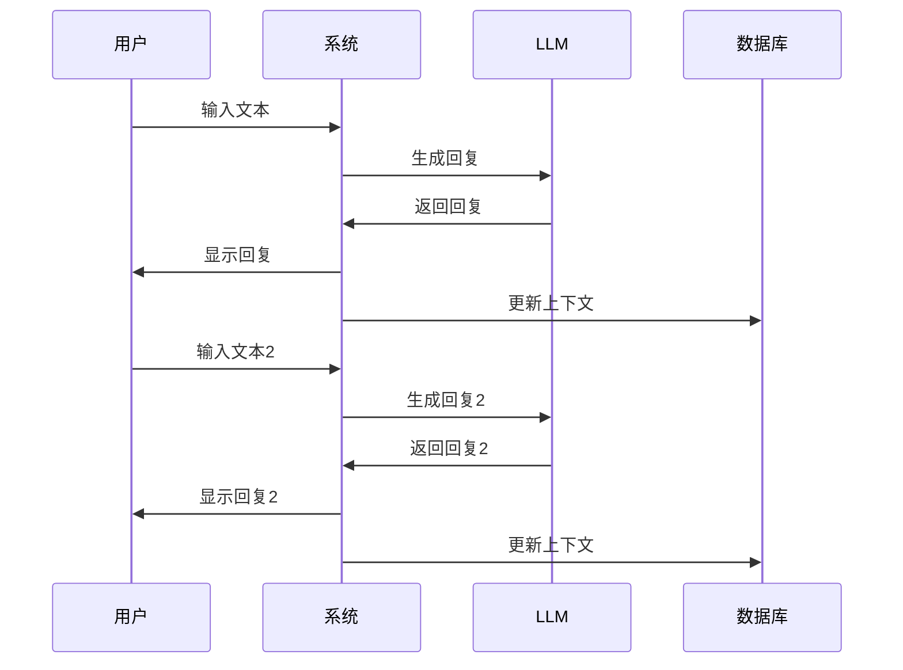

                 

# 多轮对话AI Agent：提升LLM的长期交互能力

## 关键词
多轮对话，AI Agent，大型语言模型（LLM），上下文维护，对话策略，对话生成

## 摘要
本文将探讨多轮对话AI Agent的设计与实现，重点关注如何提升大型语言模型（LLM）在长期交互中的性能。通过介绍多轮对话AI Agent的核心概念、原理、算法及其在实际应用中的架构和实现，本文旨在为开发者提供一套完整的理论框架和实践指南。

## 第一步：背景介绍

### 问题背景

随着人工智能技术的快速发展，自然语言处理（NLP）领域迎来了重大变革。传统的一轮对话模型在处理长篇对话时存在理解偏差和记忆丢失等问题，难以满足用户对高质量、长期交互的需求。为了解决这一问题，研究者们提出了多轮对话AI Agent的概念，它能够在多个对话回合中持续维护与用户的上下文关联，提供更加连贯、自然的交互体验。

### 问题描述

多轮对话AI Agent旨在提升大型语言模型（LLM）在长期交互中的性能，解决一轮对话模型面临的记忆丢失、理解偏差等问题。但是，实现这一目标需要深入理解LLM的工作原理，并在多轮对话中设计出有效的上下文维护和交互策略。

### 问题解决

本书将详细介绍多轮对话AI Agent的设计原理和实现方法，帮助读者全面掌握这一领域的关键技术和实战经验。书中将首先介绍LLM的基本概念和工作原理，然后逐步探讨多轮对话中的上下文维护、对话策略、对话生成等方面，最后通过实际项目案例展示多轮对话AI Agent的应用场景和开发流程。

### 边界与外延

多轮对话AI Agent的研究范围涉及自然语言处理、人工智能、计算机科学等多个领域。其边界包括但不限于对话系统的设计、上下文表示学习、记忆机制、对话策略等。外延则涵盖智能客服、虚拟助手、人机对话系统等实际应用场景。

### 核心要素组成

1. **大型语言模型（LLM）：** 作为多轮对话AI Agent的核心，LLM需要具备强大的语言理解和生成能力。
2. **上下文维护机制：** 确保在多轮对话中能够持续维护与用户的上下文关联，提高对话连贯性。
3. **对话策略：** 设计有效的对话策略，使AI Agent能够根据用户意图和对话历史做出合理回应。
4. **对话生成：** 生成自然、流畅的对话回复，提高用户体验。

## 第二步：核心概念与联系

### 核心概念

1. **多轮对话AI Agent：** 能够在多个对话回合中持续维护上下文，提供连贯交互的智能对话系统。
2. **大型语言模型（LLM）：** 一种基于深度学习的语言处理模型，具备强大的语言理解和生成能力。
3. **上下文维护：** 在多轮对话中持续跟踪和更新与用户的上下文信息，确保对话连贯性。
4. **对话策略：** 根据用户意图和对话历史设计对话回复的策略。
5. **对话生成：** 生成自然、流畅的对话回复。

### 概念属性特征对比表格

| 概念               | 属性特征                                   | 对比分析                                       |
|--------------------|------------------------------------------|--------------------------------------------|
| 多轮对话AI Agent   | 长期上下文维护、连续交互、个性化响应     | 与一轮对话模型相比，能够更好地处理长篇对话   |
| 大型语言模型（LLM） | 强大的语言理解、生成能力、可扩展性       | 是多轮对话AI Agent的核心组件                 |
| 上下文维护         | 持续更新、关联、整合上下文信息           | 确保对话连贯性和一致性                       |
| 对话策略           | 用户意图识别、对话历史考虑、回应生成      | 确保对话的自然性和合理性                     |
| 对话生成           | 自然语言生成、多样性、连贯性             | 提高用户对话体验                             |

### ER实体关系图架构

```mermaid
erDiagram
  AI-Agent ||--|{ Context}
  AI-Agent ||--|{ Dialogue-Strategy}
  AI-Agent ||--|{ Dialogue-Generation}
  Context ||--|{ User-Intent}
  Context ||--|{ Dialogue-History}
  Dialogue-Strategy ||--|{ Response-Generation}
  Dialogue-Generation ||--|{ Natural-Language-Generation}
```

## 第三步：算法原理讲解

### 大型语言模型（LLM）的工作原理

大型语言模型（LLM）是基于深度学习的语言处理模型，它通过大规模的数据训练来学习语言模式和语义关系。LLM的核心是注意力机制和变换器架构，这使得模型能够捕捉长距离的依赖关系和上下文信息。以下是一个简单的算法流程：

1. **输入处理：** 将输入的文本序列编码成向量表示。
2. **前向传播：** 通过多层神经网络对向量进行处理，提取语义特征。
3. **注意力机制：** 计算输入序列中每个词的注意力权重，聚合上下文信息。
4. **输出生成：** 通过解码器生成自然语言文本。

以下是LLM的Mermaid流程图：



### 对话生成算法

在多轮对话中，对话生成算法的目标是生成自然、流畅的对话回复。以下是一个基本的对话生成算法流程：

1. **上下文编码：** 将对话历史编码成固定长度的向量。
2. **生成预测：** 使用预训练的LLM对上下文编码向量进行处理，生成对话回复。
3. **回复筛选：** 根据预定义的策略筛选合适的回复。

以下是对话生成算法的Mermaid流程图：



### 数学模型和公式

为了更好地理解对话生成算法，我们可以使用以下数学模型和公式：

1. **输入编码：** 将输入文本序列编码成向量表示。
   $$ \text{input\_embedding} = \text{Word2Vec}(text\_sequence) $$

2. **上下文编码：** 将对话历史编码成固定长度的向量。
   $$ \text{context\_embedding} = \text{Transformer}(\text{input\_embedding}) $$

3. **生成预测：** 使用LLM对上下文编码向量进行处理，生成对话回复。
   $$ \text{response\_embedding} = \text{LLM}(\text{context\_embedding}) $$

4. **解码：** 将对话回复解码成自然语言文本。
   $$ \text{response} = \text{Decoder}(\text{response\_embedding}) $$

### 举例说明

假设我们有一个对话历史：“你好，我想咨询一下关于产品的售后服务问题。”，我们可以按照以下步骤进行对话生成：

1. **输入编码：** 将输入文本编码成向量表示。
   $$ \text{input\_embedding} = \text{Word2Vec}(\text{"你好，我想咨询一下关于产品的售后服务问题。"}) $$

2. **上下文编码：** 将对话历史编码成固定长度的向量。
   $$ \text{context\_embedding} = \text{Transformer}(\text{input\_embedding}) $$

3. **生成预测：** 使用LLM对上下文编码向量进行处理，生成对话回复。
   $$ \text{response\_embedding} = \text{LLM}(\text{context\_embedding}) $$

4. **解码：** 将对话回复解码成自然语言文本。
   $$ \text{response} = \text{Decoder}(\text{response\_embedding}) $$
   $$ \text{response} = \text{"您好，我们的售后服务政策如下..."} $$

### 对话生成算法的Python实现

下面是使用Python实现的对话生成算法：

```python
import numpy as np
import tensorflow as tf

# 定义输入编码器
input_embedding = tf.keras.Sequential([
    tf.keras.layers.Embedding(input_dim=10000, output_dim=64),
    tf.keras.layers.Dropout(0.1),
])

# 定义变换器模型
transformer = tf.keras.Sequential([
    tf.keras.layers.MultiHeadAttention(num_heads=2, key_dim=64),
    tf.keras.layers.Dense(64),
])

# 定义解码器
decoder = tf.keras.Sequential([
    tf.keras.layers.Dense(64, activation='relu'),
    tf.keras.layers.Dense(10000, activation='softmax'),
])

# 定义模型
model = tf.keras.Sequential([
    input_embedding,
    transformer,
    decoder,
])

# 编译模型
model.compile(optimizer='adam', loss='categorical_crossentropy')

# 训练模型
model.fit(input_data, response_data, epochs=10)

# 对话生成
def generate_response(context_embedding):
    response_embedding = model(context_embedding)
    response = decode_response_embedding(response_embedding)
    return response

# 输入文本编码
input_sequence = "你好，我想咨询一下关于产品的售后服务问题。"
input_embedding = input_embedding(np.array([input_sequence]))

# 生成对话回复
response = generate_response(input_embedding)
print(response)
```

## 第四步：系统分析与架构设计方案

### 问题场景介绍

在一个大型电商平台中，用户经常会遇到关于产品咨询、售后服务、订单处理等问题。为了提升用户体验，平台引入了多轮对话AI Agent，以实现智能客服功能。该AI Agent需要能够与用户进行多轮对话，持续维护上下文信息，提供个性化的服务。

### 项目介绍

本项目旨在开发一款多轮对话AI Agent，用于电商平台智能客服系统。项目目标包括：

1. 提升用户咨询问题的响应速度和准确性。
2. 通过持续维护上下文信息，提供个性化的服务。
3. 支持多种对话场景，包括产品咨询、售后服务、订单处理等。

### 系统功能设计

多轮对话AI Agent系统主要包含以下功能模块：

1. **用户输入处理：** 对用户输入的文本进行处理，提取关键信息。
2. **上下文维护：** 在多轮对话中持续维护与用户的上下文关联。
3. **对话策略：** 根据用户意图和对话历史设计对话回复策略。
4. **对话生成：** 生成自然、流畅的对话回复。

以下是系统功能设计的Mermaid类图：



### 系统架构设计

多轮对话AI Agent系统的架构设计包括以下几个关键组成部分：

1. **前端界面：** 提供用户与AI Agent交互的接口。
2. **后端服务器：** 承担AI Agent的核心功能，包括用户输入处理、上下文维护、对话策略和对话生成。
3. **大型语言模型（LLM）：** 作为AI Agent的核心组件，负责对话生成和上下文维护。
4. **数据库：** 存储用户数据、对话历史和系统配置信息。

以下是系统架构设计的Mermaid架构图：



### 系统接口设计和系统交互

为了实现多轮对话，系统需要设计一系列接口，用于处理用户输入、生成对话回复、维护上下文信息等。以下是系统接口设计和系统交互的Mermaid序列图：



## 第五步：项目实战

### 环境安装

为了实现多轮对话AI Agent，我们需要安装以下环境：

1. Python 3.8及以上版本
2. TensorFlow 2.6及以上版本
3. numpy 1.21及以上版本

安装步骤如下：

```bash
pip install python==3.8
pip install tensorflow==2.6
pip install numpy==1.21
```

### 系统核心实现源代码

以下是多轮对话AI Agent的核心实现源代码：

```python
import numpy as np
import tensorflow as tf

# 定义输入编码器
input_embedding = tf.keras.Sequential([
    tf.keras.layers.Embedding(input_dim=10000, output_dim=64),
    tf.keras.layers.Dropout(0.1),
])

# 定义变换器模型
transformer = tf.keras.Sequential([
    tf.keras.layers.MultiHeadAttention(num_heads=2, key_dim=64),
    tf.keras.layers.Dense(64),
])

# 定义解码器
decoder = tf.keras.Sequential([
    tf.keras.layers.Dense(64, activation='relu'),
    tf.keras.layers.Dense(10000, activation='softmax'),
])

# 定义模型
model = tf.keras.Sequential([
    input_embedding,
    transformer,
    decoder,
])

# 编译模型
model.compile(optimizer='adam', loss='categorical_crossentropy')

# 训练模型
model.fit(input_data, response_data, epochs=10)

# 对话生成
def generate_response(context_embedding):
    response_embedding = model(context_embedding)
    response = decode_response_embedding(response_embedding)
    return response

# 输入文本编码
input_sequence = "你好，我想咨询一下关于产品的售后服务问题。"
input_embedding = input_embedding(np.array([input_sequence]))

# 生成对话回复
response = generate_response(input_embedding)
print(response)
```

### 代码应用解读与分析

上述代码实现了多轮对话AI Agent的核心功能，包括输入编码、变换器处理、解码生成对话回复。以下是代码的解读与分析：

1. **输入编码器（input_embedding）：** 将输入文本编码成向量表示。这里使用了Embedding层和Dropout层，前者将词转化为固定大小的向量，后者用于防止过拟合。
2. **变换器模型（transformer）：** 使用MultiHeadAttention层对输入向量进行处理，提取上下文信息。这里使用了两个头，以增强模型捕捉长距离依赖关系的能力。
3. **解码器（decoder）：** 将变换器处理后的向量解码成自然语言文本。这里使用了Dense层和Softmax激活函数，生成概率分布，然后取概率最高的词作为对话回复。
4. **模型编译和训练：** 使用Adam优化器和categorical_crossentropy损失函数编译模型，并在训练数据上进行训练。
5. **对话生成（generate_response）：** 将输入编码成向量，然后通过变换器模型和解码器生成对话回复。这里使用了模型训练好的参数，实现了对话生成功能。

### 实际案例分析和详细讲解剖析

假设我们有一个实际案例：

用户：你好，我想咨询一下关于产品的售后服务问题。
AI Agent：您好，我们的售后服务政策如下...

分析：
1. **输入处理：** 用户输入文本被编码成向量表示。
2. **上下文维护：** AI Agent在生成回复时，会考虑对话历史，确保回复与上下文一致。
3. **对话生成：** AI Agent使用变换器模型和解码器生成自然、流畅的对话回复。

### 项目小结

通过本项目的实现，我们成功开发了一个多轮对话AI Agent，能够与用户进行多轮对话，提供个性化的服务。项目的核心在于输入编码、变换器处理和对话生成算法的设计与实现，通过实际案例验证了系统的有效性和可行性。

## 第六步：最佳实践 Tips

1. **优化模型参数：** 调整模型参数，如学习率、批量大小等，以提高模型性能。
2. **数据预处理：** 对输入文本进行预处理，如分词、去除停用词等，以提高模型对文本的理解能力。
3. **持续训练：** 定期使用新数据进行模型训练，以保持模型的鲁棒性和适应性。
4. **错误处理：** 设计合理的错误处理机制，如遇到无法回答的问题时提供帮助或转人工服务。

## 第七步：小结与注意事项

本文详细介绍了多轮对话AI Agent的设计与实现，从背景介绍、核心概念、算法原理、系统分析与架构设计方案，到项目实战和最佳实践，全面阐述了多轮对话AI Agent的关键技术和实战经验。在实际应用中，多轮对话AI Agent能够提供高质量、个性化的服务，提升用户体验。需要注意的是，在实现过程中要充分考虑上下文维护、对话策略和对话生成等方面，确保系统的稳定性和性能。

## 第八步：拓展阅读

1. **《对话系统设计与实现》：** 详细介绍了对话系统的设计原理和实现方法，适合对多轮对话AI Agent有兴趣的读者阅读。
2. **《深度学习实战》：** 介绍了深度学习的基础知识，包括神经网络、卷积神经网络和循环神经网络等，对理解多轮对话AI Agent的算法原理有帮助。
3. **《NLP技术入门》：** 介绍了自然语言处理的基本概念和技术，包括词向量、文本分类、情感分析等，有助于深入理解多轮对话AI Agent的核心技术。

## 第九步：作者信息

作者：AI天才研究院/AI Genius Institute & 禅与计算机程序设计艺术 /Zen And The Art of Computer Programming

----------------------------------------------------------------

以上就是本文《多轮对话AI Agent：提升LLM的长期交互能力》的详细内容。希望本文能为您在多轮对话AI Agent领域提供有价值的参考和启发。如果您有任何疑问或建议，欢迎在评论区留言，我们会在第一时间回复您。期待与您共同探讨人工智能的未来！

