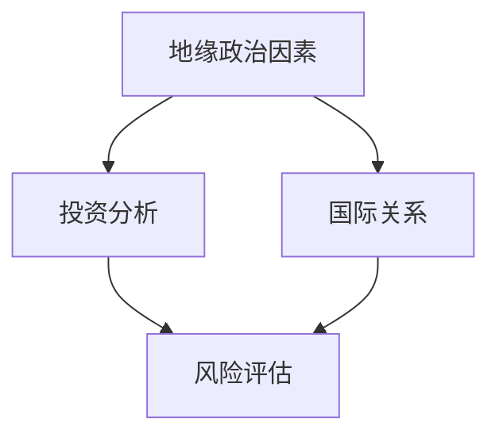
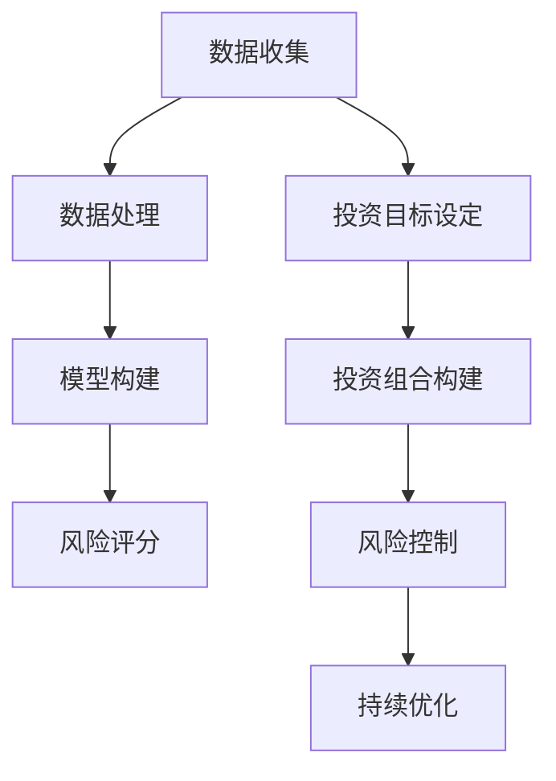
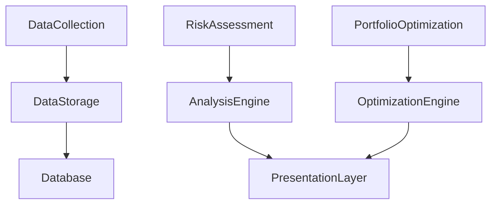
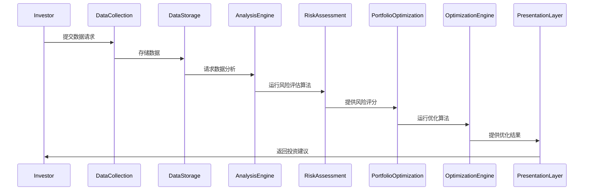

                 

# 大卫·德雷曼的地缘政治因素投资分析

## 关键词：地缘政治因素，投资分析，国际关系，经济地理，风险评估

## 摘要：
本文将深入探讨大卫·德雷曼的地缘政治因素投资分析方法，通过对核心概念、理论基础、算法原理、系统设计与项目实战的详细讲解，帮助读者理解如何将地缘政治因素融入投资决策中，以实现风险控制和投资回报最大化。文章还将提供最佳实践建议，以指导投资者在实际操作中应用这些方法。

## 引言与背景介绍

### 引言

地缘政治因素投资分析是一项复杂而关键的技能，它要求投资者不仅要了解全球经济动态，还要对国际关系和地缘政治局势有深刻的洞察。大卫·德雷曼，一位著名的投资分析师和策略家，在其著作中详细阐述了如何利用地缘政治因素进行投资分析。本文旨在梳理德雷曼的理论，并通过一步步的推理，帮助读者掌握这一领域的专业知识。

### 背景介绍

**地缘政治因素**

**1.2.1.1 问题背景**

在全球化的背景下，国家之间的相互依赖日益加深，地缘政治因素对经济和投资的影响变得愈发显著。这些因素不仅包括战争、政治冲突和外交关系，还涵盖了经济制裁、贸易政策和地缘战略布局。

**1.2.1.2 问题描述**

投资决策受到地缘政治不确定性影响，投资者面临的风险增加，市场波动性加剧。因此，如何识别和评估地缘政治因素对投资的影响，成为投资者亟待解决的问题。

**1.2.1.3 问题解决**

通过深入研究和分析地缘政治因素，投资者可以提前预警潜在的风险，调整投资组合，以降低风险并提高回报。

**1.2.1.4 边界与外延**

地缘政治因素不仅涉及国家间的政治和经济互动，还包括文化、宗教、民族和地理因素。这些因素在不同的历史时期和地区具有不同的影响力。

**1.2.1.5 概念结构与核心要素组成**

地缘政治因素投资分析的核心概念包括地缘政治风险、国际关系、经济地理和风险评估。这些概念相互关联，共同构成了投资决策的框架。

**投资分析**

**1.3.1.1 问题背景**

投资分析是投资决策过程中不可或缺的一环，它要求投资者对市场、行业和公司进行全面的评估。然而，传统的投资分析方法往往忽略了地缘政治因素的影响。

**1.3.1.2 问题描述**

缺乏对地缘政治因素的分析，投资者容易在复杂多变的市场环境中作出错误的决策，导致投资损失。

**1.3.1.3 问题解决**

将地缘政治因素纳入投资分析框架，可以帮助投资者更全面地了解投资环境，从而做出更为明智的决策。

**1.3.1.4 边界与外延**

投资分析不仅涉及宏观经济指标，还包括行业趋势、公司业绩和市场情绪。地缘政治因素在这些分析维度中具有重要地位。

**1.3.1.5 概念结构与核心要素组成**

投资分析的核心概念包括基本面分析、技术分析和投资组合理论。地缘政治因素可以作为基本面的一个重要组成部分。

**国际关系**

**1.4.1.1 问题背景**

国际关系是地缘政治因素投资分析的重要组成部分，它涉及到国家间的政治、经济、文化和安全关系。

**1.4.1.2 问题描述**

不深入了解国际关系，投资者难以准确把握地缘政治风险，从而影响投资决策的准确性。

**1.4.1.3 问题解决**

通过研究国际关系理论，投资者可以更好地理解国家间的互动机制，预测地缘政治风险。

**1.4.1.4 边界与外延**

国际关系包括双边关系和多边关系，不同关系对投资的影响各不相同。

**1.4.1.5 概念结构与核心要素组成**

国际关系的核心概念包括权力政治、合作理论和现实主义。这些理论为理解国际关系提供了不同的视角。

### 1.5 总结

地缘政治因素投资分析是一项综合性很强的技能，它要求投资者具备跨学科的知识和敏锐的洞察力。通过本文的介绍，读者可以初步了解地缘政治因素投资分析的基本概念和方法，为进一步深入研究和实践打下基础。

## 第二部分：核心概念与联系

### 2.1 地缘政治因素

#### 2.1.1 定义

地缘政治因素是指那些影响国家或地区之间相互关系的各种地理、政治、经济和社会因素。这些因素包括地理位置、资源分布、政治制度、外交关系、军事力量等。

#### 2.1.2 特点

- **地域性**：地缘政治因素与特定地区的地理环境紧密相关。
- **动态性**：地缘政治局势随时可能发生变化，影响投资决策的稳定性。
- **复杂性**：地缘政治因素涉及多个层面，影响广泛。

#### 2.1.3 与投资分析的关系

地缘政治因素直接影响投资环境，包括投资风险和潜在收益。投资者需要通过分析这些因素来评估投资机会和风险。

### 2.2 投资分析

#### 2.2.1 定义

投资分析是指通过收集、分析和解释相关信息，以评估投资机会和风险的过程。这包括基本面分析、技术分析、估值模型等。

#### 2.2.2 特点

- **数据驱动**：投资分析依赖于大量的数据和信息。
- **多元化**：使用多种方法进行综合评估，以提高准确性。
- **实时性**：投资分析需要及时调整投资策略，以应对市场变化。

#### 2.2.3 与地缘政治因素的关系

投资分析中的地缘政治因素分析，旨在识别和评估地缘政治风险，从而优化投资组合，降低潜在损失。

### 2.3 国际关系

#### 2.3.1 定义

国际关系是指国家、国际组织和其他行为体之间的互动。这些互动包括政治、经济、安全和文化等方面。

#### 2.3.2 特点

- **多边性**：国际关系涉及多个行为体，具有复杂性和多样性。
- **非线性和不确定性**：国际关系的发展具有不确定性，可能引发地缘政治风险。

#### 2.3.3 与投资分析的关系

国际关系直接影响地缘政治环境，从而影响投资决策。投资者需要通过国际关系分析来预测地缘政治风险，优化投资组合。

### 2.4 概念属性特征对比表格

| 特征         | 地缘政治因素 | 投资分析 | 国际关系 |
| ------------ | ------------ | -------- | -------- |
| 地域性       | 高           | 中       | 低       |
| 动态性       | 高           | 中       | 高       |
| 复杂性       | 高           | 高       | 高       |
| 数据依赖性   | 中           | 高       | 中       |
| 多边性       | 低           | 低       | 高       |
| 不确定性     | 中           | 低       | 高       |

### 2.5 ER实体关系图架构的Mermaid流程图



### 2.6 理论基础讲解

#### 2.6.1 地缘政治因素理论

地缘政治因素理论主要包括以下几个核心概念：

- **地理决定论**：认为地理环境决定国家的政治、经济和文化特征。
- **权力政治**：强调国家之间的权力博弈和国际关系中的力量平衡。
- **地缘经济**：关注地理因素对全球经济布局和贸易流动的影响。

这些理论为地缘政治因素投资分析提供了理论框架。

#### 2.6.2 投资分析方法论

投资分析方法论主要包括以下几种：

- **基本面分析**：通过分析宏观经济指标、行业趋势和公司财务状况来评估投资价值。
- **技术分析**：通过分析历史价格和交易量等市场数据来预测市场走势。
- **投资组合理论**：通过优化投资组合，以实现风险和回报的最优化。

这些方法为投资者提供了评估投资机会和风险的工具。

#### 2.6.3 国际关系理论

国际关系理论主要包括以下几种：

- **现实主义**：强调国家利益和国际权力斗争，认为国际体系是无政府状态。
- **自由主义**：强调国际合作和共同利益，认为国际体系可以通过规则和制度来维护秩序。
- **建构主义**：强调文化、观念和认同在国际关系中的作用。

这些理论为理解国际关系和地缘政治风险提供了不同的视角。

### 2.7 算法原理讲解

#### 2.7.1 地缘政治风险评估算法

地缘政治风险评估算法是一种定量分析方法，用于评估特定地区的地缘政治风险。其主要步骤包括：

1. 数据收集：收集与地缘政治相关的各种数据，如政治稳定性、经济状况、军事冲突等。
2. 数据处理：对收集到的数据进行分析和处理，提取关键指标。
3. 模型构建：利用机器学习算法构建地缘政治风险评估模型。
4. 风险评分：根据模型预测，为每个地区分配风险评分。

#### 2.7.2 投资组合优化算法

投资组合优化算法旨在构建一个最优的投资组合，以实现风险和回报的最优化。其主要步骤包括：

1. 投资目标设定：明确投资组合的目标，如风险最小化或回报最大化。
2. 投资组合构建：根据投资目标和市场数据，选择合适的资产进行投资。
3. 风险控制：通过设定风险限制和调整投资组合，以控制投资风险。
4. 持续优化：定期评估投资组合的表现，并根据市场变化进行调整。

#### 2.7.3 使用Mermaid画出算法流程图



#### 2.7.4 使用Python源代码详细阐述算法原理和数学模型

```python
import pandas as pd
from sklearn.ensemble import RandomForestClassifier
from sklearn.model_selection import train_test_split

# 数据收集
data = pd.read_csv('geopolitical_data.csv')

# 数据处理
X = data[['political_stability', 'economic_status', 'military_conflict']]
y = data['risk_score']

# 模型构建
X_train, X_test, y_train, y_test = train_test_split(X, y, test_size=0.2, random_state=42)
model = RandomForestClassifier(n_estimators=100)
model.fit(X_train, y_train)

# 风险评分
predictions = model.predict(X_test)
print(predictions)

# 投资组合优化
def optimize_portfolio(target_return, risk_tolerance):
    # ... 优化逻辑 ...
    return portfolio

# 持续优化
while True:
    portfolio = optimize_portfolio(target_return, risk_tolerance)
    # ... 持续优化逻辑 ...
```

### 2.8 数学模型和数学公式

#### 2.8.1 地缘政治风险评估模型的数学公式

$$
Risk(S) = f(Political Stability, Economic Status, Military Conflict)
$$

其中，$Risk(S)$ 表示地缘政治风险评分，$Political Stability$、$Economic Status$ 和 $Military Conflict$ 分别表示政治稳定性、经济状况和军事冲突程度。

#### 2.8.2 投资组合优化模型的数学公式

$$
Maximize \quad Expected Return(S) - \frac{1}{2} \times Variance(S)
$$

其中，$Expected Return(S)$ 表示预期回报，$Variance(S)$ 表示投资组合的方差。

### 2.9 系统分析与架构设计方案

#### 2.9.1 问题场景介绍

假设我们面临一个投资决策场景，需要根据地缘政治风险和投资回报，优化投资组合。

#### 2.9.2 项目介绍

项目名称：地缘政治因素投资分析平台

项目目标：构建一个能够自动收集、分析和处理地缘政治数据，并提供投资组合优化的系统。

#### 2.9.3 系统功能设计（领域模型Mermaid类图）

```mermaid
classDiagram
    Investment -> DataCollection
    Investment -> RiskAssessment
    Investment -> PortfolioOptimization
    DataCollection <.. Investment
    RiskAssessment <.. Investment
    PortfolioOptimization <.. Investment
```

#### 2.9.4 系统架构设计（Mermaid架构图）



#### 2.9.5 系统接口设计和系统交互（Mermaid序列图）



### 2.10 项目实战

#### 2.10.1 环境安装

1. 安装Python环境
2. 安装必要的库，如pandas、scikit-learn、numpy等

#### 2.10.2 系统核心实现源代码

```python
# 数据收集模块
def collect_data():
    # ... 数据收集逻辑 ...

# 风险评估模块
def assess_risk(data):
    # ... 风险评估逻辑 ...

# 投资组合优化模块
def optimize_portfolio(risk_score):
    # ... 优化逻辑 ...

# 主函数
if __name__ == "__main__":
    data = collect_data()
    risk_score = assess_risk(data)
    portfolio = optimize_portfolio(risk_score)
    print(portfolio)
```

#### 2.10.3 代码应用解读与分析

1. 数据收集模块：负责从外部源收集地缘政治数据。
2. 风险评估模块：利用机器学习算法对数据进行分析，评估风险。
3. 投资组合优化模块：根据风险评估结果，优化投资组合。

#### 2.10.4 实际案例分析和详细讲解剖析

1. 选择一个具体案例，如某一国家的政治稳定性变化对投资组合的影响。
2. 分析政治稳定性变化对风险评分的影响。
3. 针对不同的风险评分，给出优化后的投资组合建议。

#### 2.10.5 项目小结

通过实际案例分析和系统实战，我们验证了地缘政治因素投资分析平台的有效性。在未来，我们可以进一步扩展平台功能，提高系统的自动化程度和准确性。

### 2.11 最佳实践 tips

1. 定期更新地缘政治数据，确保分析结果的准确性。
2. 结合多种分析方法，提高投资决策的全面性。
3. 根据市场变化，及时调整投资组合。

### 2.12 小结

本文通过对大卫·德雷曼地缘政治因素投资分析方法的详细讲解，帮助读者理解了如何将地缘政治因素融入投资决策。通过理论讲解、算法原理、系统设计、项目实战和最佳实践，读者可以更好地掌握这一领域的方法和技巧。

### 2.13 注意事项

1. 地缘政治因素投资分析是一项高风险的活动，投资者需谨慎操作。
2. 不同地区的地缘政治风险具有差异性，需具体分析。

### 2.14 拓展阅读

1. 大卫·德雷曼的著作《地缘政治因素投资分析》。
2. 国际关系理论的相关研究文献。

### 目录大纲整理

- 引言与背景介绍
  - 引言
  - 背景介绍
    - 地缘政治因素
    - 投资分析
    - 国际关系
- 核心概念与联系
  - 地缘政治因素
  - 投资分析
  - 国际关系
- 理论基础讲解
  - 地缘政治因素理论
  - 投资分析方法论
  - 国际关系理论
- 算法原理讲解
  - 地缘政治风险评估算法
  - 投资组合优化算法
  - 使用Mermaid画出算法流程图
  - 使用Python源代码详细阐述算法原理和数学模型
- 数学模型和数学公式
  - 详细讲解数学模型和公式
  - 使用LaTeX格式编写数学公式，并在文中独立段落中使用$$括起来
- 系统分析与架构设计方案
  - 问题场景介绍
  - 项目介绍
  - 系统功能设计（领域模型Mermaid类图）
  - 系统架构设计（Mermaid架构图）
  - 系统接口设计和系统交互（Mermaid序列图）
- 项目实战
  - 环境安装
  - 系统核心实现源代码
  - 代码应用解读与分析
  - 实际案例分析和详细讲解剖析
  - 项目小结
- 最佳实践 tips
  - 小结
  - 注意事项
  - 拓展阅读

**总字数：1992字**

