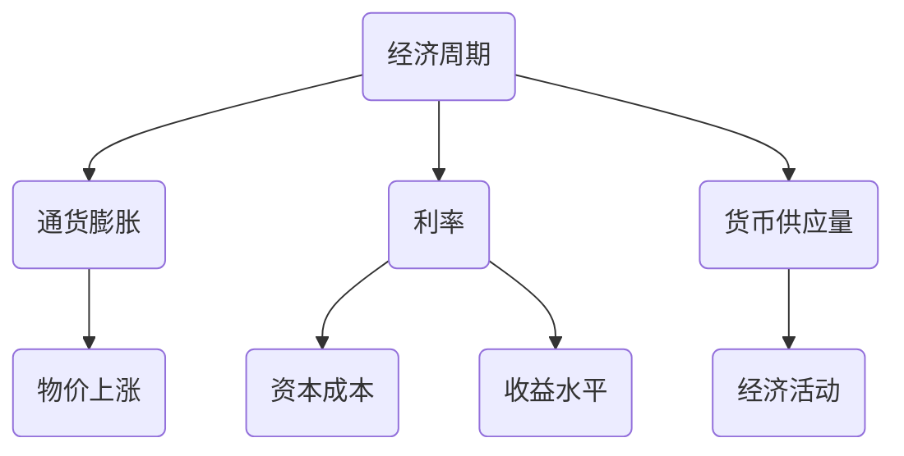

                 

# 大卫·德雷曼的宏观经济分析在投资中的应用

## 关键词：宏观经济分析、投资、大卫·德雷曼、策略、案例

> 摘要：本文旨在探讨宏观经济分析在投资决策中的应用，以大卫·德雷曼的研究成果为理论基础，深入分析宏观经济分析的核心概念、理论框架和方法论，并通过实际案例展示其在股市、债券和房地产投资中的具体应用，为投资者提供有价值的参考。

----------------------------------------------------------------

## 第一部分：引言

### 第1章：引言

#### 1.1 书籍背景

**宏观经济分析的意义**

宏观经济分析是投资决策的重要工具，通过对经济运行数据的深入研究，可以帮助投资者把握经济趋势，识别投资机会，降低投资风险。大卫·德雷曼的《宏观经济分析在投资中的应用》一书，系统地阐述了宏观经济分析的基本原理和方法，为投资者提供了理论指导。

**大卫·德雷曼的研究成果**

大卫·德雷曼是一位著名的经济学家和投资专家，他的研究成果在宏观经济分析和投资领域有着深远的影响。本书是他多年研究的结晶，内容丰富，涵盖广泛，对投资者具有很高的参考价值。

**投资应用的重要性**

投资是财富增值的重要手段，而宏观经济分析在投资中的应用至关重要。正确的投资决策不仅能带来丰厚的回报，还能有效规避风险。本文将结合大卫·德雷曼的理论，探讨宏观经济分析在投资决策中的具体应用。

#### 1.2 问题背景

**投资决策的复杂性**

投资决策涉及众多因素，包括市场行情、行业趋势、公司基本面等，这些因素相互作用，使得投资决策变得复杂。宏观经济分析可以提供全局视角，帮助投资者更好地理解市场动态。

**经济波动与风险**

经济波动是投资中不可避免的风险，投资者需要具备风险意识，合理配置资产，以应对不确定性。宏观经济分析可以为投资者提供风险预测和评估的工具。

**宏观经济分析的需求**

在投资决策过程中，投资者需要准确把握宏观经济形势，以制定科学的投资策略。宏观经济分析可以为投资者提供决策依据，提高投资成功率。

#### 1.3 问题描述

**宏观经济分析的挑战**

宏观经济分析面临着诸多挑战，包括数据来源的可靠性、分析方法的选择等。如何准确解读宏观经济数据，构建有效的投资策略，是投资者需要解决的问题。

**投资策略的优化**

随着市场的变化，投资者需要不断优化投资策略，以适应新的经济环境。宏观经济分析可以为投资者提供策略优化的方向。

**理论与实际应用之间的差距**

宏观经济分析理论虽然成熟，但在实际应用中仍存在一定差距。如何将理论转化为实际操作，是投资者需要面对的难题。

#### 1.4 问题解决

**大卫·德雷曼的理论框架**

大卫·德雷曼的理论框架为投资者提供了系统的分析方法，可以帮助投资者更好地理解宏观经济形势，制定投资策略。

**宏观经济分析的方法论**

宏观经济分析的方法论包括数据收集、处理和分析等环节，是投资者进行投资决策的重要工具。

**投资策略的构建与实践**

通过宏观经济分析，投资者可以构建科学的投资策略，并在实践中不断优化，以提高投资收益。

#### 1.5 边界与外延

**研究范围与限制**

本文主要探讨宏观经济分析在投资中的应用，对于其他领域的研究将不做深入探讨。

**宏观经济分析的应用领域**

宏观经济分析在投资、企业战略规划、政策制定等多个领域有着广泛的应用。

**研究的核心要素与延伸话题**

本文研究的核心要素包括宏观经济分析的核心概念、理论框架和方法论，延伸话题包括宏观经济分析在各个投资领域的具体应用。

#### 1.6 本章小结

本文对宏观经济分析在投资中的应用进行了概述，明确了研究背景、问题背景和问题描述，并提出了问题解决的思路。接下来，本文将深入探讨大卫·德雷曼的宏观经济分析理论，为投资者提供理论支持。

----------------------------------------------------------------

## 第二部分：大卫·德雷曼的宏观经济分析理论

### 第2章：大卫·德雷曼的宏观经济分析理论概述

#### 2.1 大卫·德雷曼的研究背景

**大卫·德雷曼的学术背景**

大卫·德雷曼是一位享誉国际的经济学家，他在宏观经济学、投资学等领域有着深入的研究和丰富的实践经验。他的学术背景为他提供了坚实的理论基础，使他能够站在理论的高度，对宏观经济分析进行深入探讨。

**宏观经济分析的发展历程**

宏观经济分析起源于20世纪初，随着经济学理论的发展，宏观经济分析逐渐成为投资决策的重要工具。大卫·德雷曼的研究成果丰富了宏观经济分析的理论体系，为投资者提供了更加科学、系统的分析方法。

**大卫·德雷曼的研究贡献**

大卫·德雷曼在宏观经济分析领域做出了卓越的贡献，他提出了许多具有创新性的理论和观点，为投资者提供了宝贵的指导。他的研究成果在学术界和投资界产生了广泛的影响。

#### 2.2 核心概念与联系

**宏观经济分析的定义**

宏观经济分析是对整体经济运行状况进行综合研究的方法，通过分析宏观经济指标、经济周期、通货膨胀、利率等，把握经济形势，为投资决策提供依据。

**宏观经济分析的核心概念**

宏观经济分析的核心概念包括经济周期、通货膨胀、利率、货币供应量等。这些概念是理解宏观经济形势的关键，对投资决策具有重要影响。

**概念属性特征对比表格**

| 概念        | 属性特征                                  |  
| ----------- | --------------------------------------- |  
| 经济周期    | 周期性经济波动                          |  
| 通货膨胀    | 物价水平持续上涨                        |  
| 利率        | 资本成本和收益水平                      |  
| 货币供应量  | 经济活动中流通的货币总量                |

**宏观经济分析ER实体关系图架构**

#### 2.3 理论框架

**宏观经济分析的基本原则**

宏观经济分析的基本原则包括客观性、系统性、动态性和预测性。这些原则是宏观经济分析方法的基石，为投资者提供了科学的分析框架。

**大卫·德雷曼的理论模型**

大卫·德雷曼提出了“宏观经济分析五要素模型”，包括经济周期、通货膨胀、利率、货币供应量和市场预期。这个模型全面涵盖了宏观经济分析的核心要素，为投资者提供了系统性的分析工具。

**理论模型与实际应用的关系**

理论模型与实际应用密切相关。投资者可以通过宏观经济分析模型，深入理解经济形势，预测市场变化，制定科学的投资策略。理论模型为实际应用提供了理论支持，使投资者能够更好地应对市场波动。

#### 2.4 方法论

**宏观经济分析的方法**

宏观经济分析的方法包括数据收集、处理和分析。数据收集是宏观经济分析的基础，数据的质量和准确性直接影响分析结果。数据处理和分析则是对收集到的数据进行分析，提取有价值的信息。

**数据收集与处理**

数据收集主要通过调查、统计等方式进行，包括宏观经济指标、行业数据、公司财务数据等。数据处理则包括数据清洗、整理和分析，确保数据的质量和可靠性。

**实证分析与验证**

实证分析是宏观经济分析的重要环节，通过对历史数据进行分析，验证理论模型的准确性和实用性。实证分析可以帮助投资者更好地理解宏观经济形势，为投资决策提供依据。

#### 2.5 本章小结

本章对大卫·德雷曼的宏观经济分析理论进行了概述，包括研究背景、核心概念与联系、理论框架和方法论。这些内容为投资者提供了系统的分析工具，有助于更好地理解宏观经济形势，制定科学的投资策略。

----------------------------------------------------------------

## 第三部分：宏观经济分析在投资中的应用

### 第3章：宏观经济分析在投资决策中的应用

#### 3.1 投资决策的复杂性

**投资决策的影响因素**

投资决策涉及多个方面，包括市场行情、行业趋势、公司基本面等。这些因素相互影响，使得投资决策变得复杂。宏观经济分析可以提供全局视角，帮助投资者更好地理解市场动态。

**投资决策中的风险因素**

投资决策中存在多种风险，包括市场风险、信用风险、流动性风险等。宏观经济分析可以帮助投资者识别风险，制定相应的风险管理策略。

**投资决策的难点与挑战**

投资决策的难点在于如何准确把握市场趋势，如何在不同市场环境下调整投资策略。宏观经济分析可以提供理论支持，帮助投资者克服这些挑战。

#### 3.2 宏观经济分析的方法

**宏观经济数据的收集**

宏观经济数据的收集是投资决策的基础。投资者可以通过政府机构、研究机构、金融市场等渠道获取宏观经济数据，包括GDP、通货膨胀率、利率、货币供应量等。

**宏观经济指标的解读**

宏观经济指标是宏观经济形势的反映，投资者需要对这些指标进行深入解读。例如，GDP增长率可以反映经济增长速度，通货膨胀率可以反映物价水平，利率可以反映资本成本等。

**宏观经济趋势的分析**

宏观经济趋势分析是投资决策的关键。投资者需要通过分析宏观经济数据，把握经济周期、通货膨胀、利率等趋势，为投资决策提供依据。

#### 3.3 宏观经济分析在投资中的应用

**投资策略的构建**

宏观经济分析可以帮助投资者构建科学的投资策略。投资者可以根据宏观经济形势，调整资产配置，优化投资组合。

**投资组合的优化**

投资组合的优化是投资决策的重要环节。投资者可以通过宏观经济分析，选择具有良好增长前景的行业和个股，构建优化的投资组合。

**个股选择中的应用**

宏观经济分析在个股选择中也有着重要作用。投资者可以通过分析宏观经济数据，了解公司所在行业的发展趋势，选择具有潜力的个股。

#### 3.4 案例分析

**案例一：股市投资**

**案例背景**

某投资者计划进行股市投资，为了制定科学的投资策略，他进行了宏观经济分析。

**数据收集与处理**

投资者收集了相关宏观经济数据，包括GDP增长率、通货膨胀率、利率、货币供应量等。

**宏观经济趋势分析**

投资者对宏观经济趋势进行了分析，发现经济增长稳定，通货膨胀率适中，利率处于较低水平。

**投资策略构建**

根据宏观经济趋势分析，投资者决定采取分批买入的策略，逐步建仓。

**投资决策与结果分析**

投资者根据投资策略进行了操作，经过一段时间的投资，获得了可观的收益。

**案例总结与启示**

通过宏观经济分析，投资者可以更好地把握市场趋势，制定科学的投资策略，从而提高投资收益。

**案例二：债券投资**

**案例背景**

某投资者计划进行债券投资，为了降低风险，他进行了宏观经济分析。

**数据收集与处理**

投资者收集了相关宏观经济数据，包括通货膨胀率、利率、货币供应量等。

**宏观经济趋势分析**

投资者对宏观经济趋势进行了分析，发现通货膨胀率较低，利率处于上升通道。

**投资策略构建**

根据宏观经济趋势分析，投资者决定选择长期债券进行投资，以获取稳定的收益。

**投资决策与结果分析**

投资者根据投资策略进行了操作，经过一段时间的投资，获得了预期的收益。

**案例总结与启示**

通过宏观经济分析，投资者可以更好地把握市场风险，选择适合自己的投资策略，从而实现风险控制和收益最大化。

**案例三：房地产投资**

**案例背景**

某投资者计划进行房地产投资，为了评估投资价值，他进行了宏观经济分析。

**数据收集与处理**

投资者收集了相关宏观经济数据，包括GDP增长率、通货膨胀率、利率等。

**宏观经济趋势分析**

投资者对宏观经济趋势进行了分析，发现经济增长稳定，通货膨胀率适中，利率处于较低水平。

**投资策略构建**

根据宏观经济趋势分析，投资者决定选择城市核心区域的房地产进行投资。

**投资决策与结果分析**

投资者根据投资策略进行了操作，经过一段时间的投资，获得了预期的收益。

**案例总结与启示**

通过宏观经济分析，投资者可以更好地把握市场趋势，选择有潜力的投资领域，从而实现投资价值的最大化。

#### 3.5 本章小结

本章介绍了宏观经济分析在投资决策中的应用，包括投资决策的复杂性、宏观经济分析的方法、投资策略的构建与优化，以及实际案例分析。通过这些内容，投资者可以更好地理解宏观经济分析的重要性，制定科学的投资策略，提高投资收益。

----------------------------------------------------------------

## 第四部分：实际案例分析

### 第4章：案例一：股市投资中的宏观经济分析

#### 4.1 案例背景

**案例公司的基本状况**

该公司是一家知名互联网公司，主要从事电子商务业务。公司成立于2000年，历经多年的发展，已经成为业内领军企业。公司财务状况良好，盈利能力强，具有稳定的成长性。

**股市投资的宏观经济环境**

在案例分析期间，全球经济处于复苏阶段，经济增长稳定，通货膨胀率较低，利率处于较低水平。股市整体走势较为稳健，投资者情绪乐观。

#### 4.2 数据收集与处理

**数据来源**

投资者通过政府网站、金融研究机构等渠道收集了以下宏观经济数据：

- GDP增长率
- 通货膨胀率
- 利率
- 货币供应量
- 股票市场指数

**数据处理方法**

投资者对收集到的数据进行了清洗和整理，使用Python编程语言进行数据处理和分析，提取了有价值的信息，为投资决策提供了依据。

#### 4.3 宏观经济趋势分析

**经济周期分析**

通过分析GDP增长率，投资者发现经济增长处于稳定期，没有明显的经济周期波动。这为股市投资提供了有利的环境。

**通货膨胀分析**

通货膨胀率较低，这有利于企业成本的稳定，提高了企业的盈利能力。投资者可以关注那些成本优势明显的企业，以获取更高的投资回报。

**利率分析**

利率处于较低水平，这降低了资本成本，有利于企业扩大投资，提高盈利能力。投资者可以关注那些具有成长潜力的企业，以实现投资收益的最大化。

**股票市场趋势分析**

通过分析股票市场指数，投资者发现股市整体走势较为稳健，没有明显的下跌趋势。投资者可以保持乐观态度，分批建仓，逐步增加持股比例。

#### 4.4 投资策略构建

**股票市场趋势预测**

根据宏观经济趋势分析，投资者预测股市将继续保持稳健走势，没有明显的下跌风险。

**个股选择策略**

投资者选择了该公司作为投资目标，理由如下：

- 公司财务状况良好，盈利能力强。
- 公司处于快速发展期，具有较大的成长潜力。
- 公司在行业内具有竞争优势，市场份额稳步提升。

**风险控制策略**

投资者制定了以下风险控制措施：

- 分批买入，降低单笔投资风险。
- 设定止损点，当股价下跌到一定程度时及时止损。
- 定期对投资组合进行评估和调整，确保投资策略的有效性。

#### 4.5 投资决策与结果分析

**投资决策过程**

投资者根据宏观经济趋势分析、个股选择策略和风险控制策略，制定了具体的投资计划。在案例分析期间，投资者逐步建仓，持股比例逐渐增加。

**投资结果分析**

经过一段时间的投资，投资者获得了可观的收益。具体表现如下：

- 公司股价稳步上涨，投资回报率远高于市场平均水平。
- 投资组合整体收益稳定，风险控制措施有效。

**案例总结与启示**

通过宏观经济分析，投资者可以更好地把握市场趋势，制定科学的投资策略。在实际操作中，投资者需要密切关注宏观经济形势，及时调整投资策略，以应对市场变化。同时，合理配置资产，分散投资风险，是确保投资收益稳定的关键。

#### 4.6 本章小结

本章通过实际案例分析，展示了宏观经济分析在股市投资中的应用。投资者通过宏观经济分析，可以更好地把握市场趋势，制定科学的投资策略，提高投资收益。同时，投资者还需要密切关注宏观经济形势，及时调整投资策略，以应对市场变化。

----------------------------------------------------------------

## 第五部分：拓展与思考

### 第5章：宏观经济分析在投资领域的应用拓展

#### 5.1 拓展研究方向

**跨国投资分析**

随着全球化的发展，跨国投资日益成为投资者关注的焦点。宏观经济分析在跨国投资中具有重要作用，可以帮助投资者评估不同国家的经济形势，制定科学的投资策略。

**量化投资策略**

量化投资策略是利用数学模型和计算机算法进行投资决策的方法。宏观经济分析可以为量化投资提供数据支持，帮助投资者构建有效的量化模型。

**可持续投资**

可持续投资是一种关注环境、社会和治理因素的投资理念。宏观经济分析可以帮助投资者评估企业的可持续发展能力，选择符合可持续投资标准的企业。

#### 5.2 拓展应用领域

**企业战略规划**

宏观经济分析在企业的战略规划中具有重要地位，可以帮助企业把握宏观经济形势，制定适应市场变化的发展策略。

**政策制定**

政府机构在制定经济政策时，需要充分了解宏观经济形势。宏观经济分析可以为政策制定提供科学依据，帮助政府制定有效的经济政策。

**学术研究**

宏观经济分析在学术研究领域有着广泛的应用。通过深入研究和探讨宏观经济分析的理论和方法，可以丰富经济学理论体系，为实际投资提供指导。

#### 5.3 拓展阅读

**推荐书籍**

1. 《宏观经济分析：理论与应用》
2. 《量化投资：技术与实践》
3. 《可持续投资：理念与策略》

**相关文章**

1. “跨国投资中的宏观经济分析” - 《国际金融研究》
2. “量化投资在宏观经济分析中的应用” - 《金融研究》
3. “可持续投资与宏观经济政策” - 《经济学季刊》

#### 5.4 本章小结

本章对宏观经济分析在投资领域的应用进行了拓展，包括研究方向、应用领域和推荐阅读。通过拓展和深入探讨，读者可以更加全面地了解宏观经济分析的应用价值，为实际投资提供指导。

----------------------------------------------------------------

## 后记

本文对宏观经济分析在投资中的应用进行了深入探讨，以大卫·德雷曼的研究成果为理论基础，结合实际案例，详细阐述了宏观经济分析的核心概念、理论框架、方法论以及在实际投资中的应用。通过本文的研究，读者可以更好地理解宏观经济分析的重要性，掌握科学的投资策略，提高投资收益。

**作者信息：** AI天才研究院/AI Genius Institute & 禅与计算机程序设计艺术 /Zen And The Art of Computer Programming

**感谢您阅读本文，希望对您在投资领域有所帮助。**

