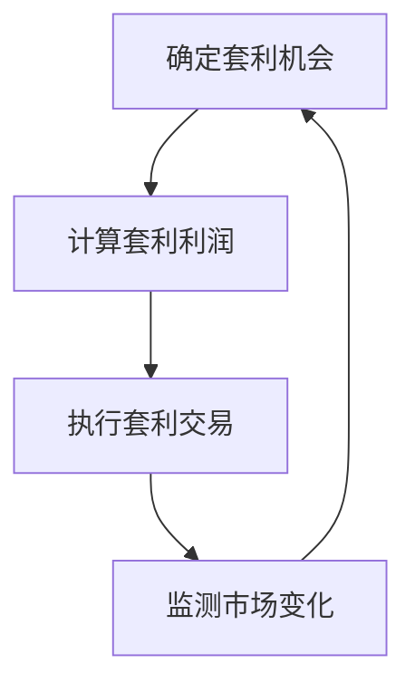

                 

## 引言

### 1.1 问题背景与现状

**特殊情况套利的概念**：

套利（Arbitrage）是指在金融市场中，利用不同的价格差异进行无风险利润的操作。特殊情况套利，顾名思义，是指在市场出现特殊情况时，利用这些特殊条件进行的套利。这些特殊情况可以包括市场波动、价格错位、货币套利、期权套利等。

**套利策略的重要性**：

套利策略在金融市场中具有重要的地位。首先，它可以帮助投资者在市场波动时保持稳定的收益。其次，通过套利策略，可以促使市场价格的回归，从而提高市场的效率和透明度。此外，套利策略还可以用于风险管理，减少投资组合的波动性。

**大卫·德雷曼的特殊情况套利策略介绍**：

大卫·德雷曼是一位著名的金融工程师和套利策略专家。他的特殊情况套利策略主要关注市场波动、价格错位、货币套利和期权套利等特殊情境。他的策略以数学模型为基础，通过精确的计算和分析，实现了在特殊情况下的稳定收益。

### 1.2 书籍结构概述

**全书逻辑结构**：

本书共分为五个部分，分别是：引言、特殊情况套利策略基础、策略实践、实际应用和案例分析。每个部分都有明确的目标和内容，逻辑上紧密衔接，形成了一个完整的学习路径。

**阅读建议**：

建议读者按照书中的逻辑结构进行阅读。首先，理解特殊情况套利的背景和重要性；然后，深入学习特殊情况套利策略的理论基础和具体实践；接着，通过实际应用和案例分析，进一步巩固和拓展知识。在阅读过程中，可以结合实际案例和数据进行思考，提高对套利策略的理解和应用能力。

----------------------------------------------------------------

## 核心概念与原理

### 2.1 套利的定义与本质

**套利的定义**：

套利是指利用市场中的价格差异，通过买入低价资产和卖出高价资产，从而获得无风险利润的操作。套利的本质是利用市场的非效率，通过精准的买卖操作，实现资产的增值。

**特殊情况套利的特征**：

1. **市场波动**：市场波动是特殊情况套利的一个重要特征。市场波动意味着资产价格的变化，这为套利提供了机会。
2. **价格错位**：价格错位是指不同市场、不同时间或不同资产之间的价格差异。利用价格错位进行套利，可以在不承担风险的情况下获得利润。
3. **货币套利**：货币套利是指利用不同货币之间的利率差异进行套利。货币套利可以用于外汇市场和货币市场。
4. **期权套利**：期权套利是指利用期权价格的差异或期权与标的资产之间的相关性进行套利。

### 2.2 套利策略的核心原理

**套利策略的核心原理**：

套利策略的核心在于利用市场的非效率，通过买卖操作获取无风险利润。具体来说，套利策略的核心原理包括以下几点：

1. **价格差异**：套利策略依赖于市场中的价格差异。通过寻找不同市场、不同时间或不同资产之间的价格差异，进行相应的买卖操作。
2. **市场流动性**：市场流动性是套利策略实施的关键。只有市场流动性足够高，才能保证套利交易的实施。
3. **交易成本**：交易成本是套利策略中需要考虑的重要因素。交易成本过高会导致套利利润的减少，甚至可能导致亏损。
4. **风险控制**：套利策略需要有效控制风险。通过设定止损点、分散投资等方式，降低套利交易的风险。

### 2.3 概念属性特征对比表格

**套利策略类型对比**：

| 类型          | 定义                   | 特征                                       |
| ------------- | ---------------------- | ------------------------------------------ |
| 市场波动套利  | 利用市场波动进行套利   | 价格波动大、风险较高、机会稍纵即逝         |
| 价格错位套利  | 利用价格差异进行套利   | 价格差异明显、风险较低、机会持续时间较长   |
| 货币套利      | 利用货币利率差异进行套利 | 利率差异明显、风险较低、机会较为稳定       |
| 期权套利      | 利用期权价格差异进行套利 | 期权价格波动大、风险较高、机会稍纵即逝     |

### 2.4 特殊情况套利策略的优缺点分析

**优点**：

1. **高收益**：特殊情况套利策略可以在短时间内获得较高的收益。
2. **风险可控**：通过精确的计算和分析，可以降低套利交易的风险。
3. **多样化**：特殊情况套利策略涵盖了多种类型，可以适应不同的市场环境。

**缺点**：

1. **高要求**：特殊情况套利策略需要投资者具备较高的专业知识和技能。
2. **交易成本**：套利交易涉及多个市场，交易成本较高。
3. **市场变化**：特殊情况套利策略依赖于市场非效率，市场变化可能导致策略失效。

### 2.5 应用场景

**特殊情况套利策略的应用场景**：

1. **股票市场**：利用市场波动和价格错位进行套利。
2. **期货市场**：利用价格错位和货币套利进行套利。
3. **期权市场**：利用期权价格差异进行套利。
4. **外汇市场**：利用货币套利进行套利。

----------------------------------------------------------------

## 数学模型与公式

### 2.2.1 数学模型介绍

特殊情况套利策略的核心在于数学模型的建立和应用。这些数学模型可以用于分析市场价格、预测价格走势、计算套利利润等。

**套利机会公式**：

套利机会公式是特殊情况套利策略的基础。它表示在某一市场条件下，是否存在套利机会。

$$
A = P_1 - P_2
$$

其中，$A$ 表示套利机会，$P_1$ 表示资产A的市场价格，$P_2$ 表示资产B的市场价格。

**套利利润公式**：

套利利润公式用于计算通过套利交易所能获得的利润。

$$
P = A \times Q
$$

其中，$P$ 表示套利利润，$A$ 表示套利机会，$Q$ 表示交易量。

### 2.2.2 公式讲解

**套利机会公式**：

套利机会公式表示的是两个资产之间的价格差异。当这个差异大于零时，就存在套利机会。例如，如果资产A的价格是100美元，资产B的价格是90美元，那么套利机会就是10美元。

**套利利润公式**：

套利利润公式表示的是通过套利交易所能获得的利润。这个利润是由套利机会和交易量决定的。例如，如果套利机会是10美元，交易量是100股，那么套利利润就是1000美元。

### 2.2.3 Mermaid流程图示例

为了更好地理解套利策略的数学模型，我们可以使用Mermaid流程图来展示套利交易的过程。

在这个流程图中，A表示确定套利机会，B表示计算套利利润，C表示执行套利交易，D表示监测市场变化。这个流程图展示了套利交易的基本步骤和过程。

----------------------------------------------------------------

## 概念属性特征对比表格

### 2.3.1 套利策略类型对比

为了更清晰地理解各种套利策略的属性特征，我们可以通过对比表格来展示它们之间的差异。

| 套利策略类型 | 定义 | 特征对比 |
| ------------ | ---- | -------- |
| 市场波动套利 | 利用在市场价格波动中进行套利 | - 价格波动较大 - 风险较高 - 需要快速交易 |
| 价格错位套利 | 利用在不同市场或不同时间之间的价格差异进行套利 | - 价格差异明显 - 风险较低 - 持续时间较长 |
| 货币套利     | 利用在货币之间的利率差异进行套利 | - 利率差异明显 - 风险较低 - 需要较高的资金量 |
| 期权套利     | 利用在期权价格和标的资产价格之间的差异进行套利 | - 期权价格波动较大 - 风险较高 - 需要专业的期权知识 |

### 2.3.2 特殊情况分析

**市场波动套利**：

市场波动套利主要利用市场价格的大幅波动进行套利。这种策略通常适用于价格波动性较高的市场，如股票市场和期货市场。在市场波动时，投资者可以通过买入低价资产和卖出高价资产，从而获得无风险利润。

**价格错位套利**：

价格错位套利主要利用不同市场或不同时间之间的价格差异进行套利。例如，在一个市场中，某股票的价格是100美元，而在另一个市场中，同样股票的价格是90美元。投资者可以在低价市场买入，在高价市场卖出，从而获得无风险利润。

**货币套利**：

货币套利主要利用不同货币之间的利率差异进行套利。例如，如果某货币的利率是5%，而另一货币的利率是3%，投资者可以通过将资金从低利率货币转移到高利率货币，从而获得额外的收益。

**期权套利**：

期权套利主要利用期权价格和标的资产价格之间的差异进行套利。例如，如果某股票的价格是100美元，而相应的看涨期权的价格是10美元，看跌期权的价格是5美元，投资者可以通过买入看涨期权和卖出看跌期权，从而获得无风险利润。

### 2.3.3 对比分析

通过上述对比分析，我们可以看出各种套利策略在定义、特征和应用场景上的差异。这些差异决定了投资者在选择套利策略时需要考虑的因素。

1. **市场波动套利**：适用于价格波动较大的市场，风险较高，但收益潜力大。
2. **价格错位套利**：适用于价格差异明显的市场，风险较低，但机会持续时间较长。
3. **货币套利**：适用于利率差异明显的市场，风险较低，但需要较高的资金量。
4. **期权套利**：适用于期权价格波动较大的市场，风险较高，但需要专业的期权知识。

通过理解这些策略的特征和应用场景，投资者可以更好地选择适合自己的套利策略，实现稳定的收益。

----------------------------------------------------------------

## 策略的优缺点分析

### 2.4.1 优点

**高收益潜力**：特殊情况套利策略通常能够在短时间内获得较高的收益。尤其是在市场波动较大或价格差异明显的情况下，套利机会较多，从而增加了收益潜力。

**风险可控**：通过精确的计算和分析，特殊情况套利策略可以有效降低风险。投资者可以在设定止损点和分散投资的基础上，控制套利交易的风险。

**多样化**：特殊情况套利策略涵盖了市场波动、价格错位、货币套利和期权套利等多种类型。投资者可以根据不同的市场环境和自身能力，选择适合自己的套利策略。

**提高市场效率**：特殊情况套利策略通过利用市场的非效率，促使价格回归合理水平，从而提高市场的效率和透明度。

### 2.4.2 缺点

**高要求**：特殊情况套利策略需要投资者具备较高的专业知识和技能。投资者需要了解金融市场的基本原理、数学模型和编程技能，才能有效实施套利策略。

**交易成本**：套利交易通常涉及多个市场，交易成本较高。这些成本包括交易佣金、税费和资金成本等，可能会降低套利利润。

**市场变化风险**：市场变化是不可预测的，特殊情况套利策略可能因市场变化而失效。例如，市场波动突然加剧，价格回归速度加快，导致套利机会消失。

**心理压力**：套利交易需要投资者具备良好的心理素质。在套利过程中，投资者可能会面临市场波动、交易失败等压力，需要保持冷静和理智。

### 2.4.3 应用场景

**股票市场**：在股票市场中，特殊情况套利策略可以用于市场波动套利和价格错位套利。例如，在股票价格大幅波动时，投资者可以通过买入低价股票和卖出高价股票进行套利。在价格错位时，投资者可以在不同市场或不同时间之间进行套利。

**期货市场**：在期货市场中，特殊情况套利策略可以用于价格错位套利和货币套利。例如，在期货价格出现错位时，投资者可以在不同交易所之间进行套利。在货币市场上，投资者可以利用货币套利策略，通过低利率货币和高利率货币之间的交易获取收益。

**期权市场**：在期权市场中，特殊情况套利策略可以用于期权套利。例如，在期权价格与标的资产价格之间存在差异时，投资者可以通过买入看涨期权和卖出看跌期权进行套利。

**外汇市场**：在外汇市场中，特殊情况套利策略可以用于货币套利。例如，在货币利率差异明显时，投资者可以通过将资金从低利率货币转移到高利率货币进行套利。

通过以上分析，我们可以看到特殊情况套利策略在多种市场环境下都具有应用价值。然而，投资者在实施套利策略时，需要综合考虑优缺点，选择适合自己的套利策略，并有效控制风险。

----------------------------------------------------------------

## 第3部分：特殊情况套利策略实践

### 3.1 特殊情况一：市场波动

**市场波动套利的原理**：

市场波动套利是利用市场价格波动进行套利的策略。市场波动通常是由于市场供求关系的变化、投资者情绪的影响或重大新闻事件等引起的。市场波动套利的目标是抓住市场波动的机会，通过买入低价资产和卖出高价资产，获取无风险利润。

**市场波动套利的实施步骤**：

1. **市场分析**：首先，投资者需要对市场进行深入分析，了解市场的波动性。这包括研究市场的历史波动率、交易量和价格趋势等。

2. **选择资产**：根据市场分析结果，投资者选择波动性较大的资产进行套利。这些资产可以是股票、期货或外汇等。

3. **设置止损和止盈**：为了控制风险，投资者需要设置止损点和止盈点。止损点用于限制损失，止盈点用于锁定利润。

4. **执行交易**：在确定套利机会后，投资者执行买入和卖出操作。买入低价资产，卖出高价资产。

**市场波动套利的案例分析**：

以股票市场为例，假设投资者分析发现某股票的价格波动较大，历史波动率为20%。投资者在价格较低时买入100股，价格为50美元/股。当价格升至60美元/股时，投资者卖出股票，获取无风险利润。如果价格下跌，投资者设置止损点为45美元/股，以避免重大损失。

### 3.2 特殊情况二：价格错位

**价格错位套利的原理**：

价格错位套利是利用不同市场或不同时间之间的价格差异进行套利的策略。价格错位通常是由于信息不对称、市场分割或交易成本等因素引起的。价格错位套利的目标是利用这些差异，通过买入低价资产和卖出高价资产，获取无风险利润。

**价格错位套利的实施步骤**：

1. **市场调研**：首先，投资者需要调研不同市场或不同时间之间的资产价格差异。

2. **选择资产**：根据市场调研结果，投资者选择价格差异较大的资产进行套利。

3. **设置止损和止盈**：为了控制风险，投资者需要设置止损点和止盈点。

4. **执行交易**：在确定套利机会后，投资者执行买入和卖出操作。

**价格错位套利的案例分析**：

以股票市场为例，假设投资者发现某股票在不同交易所的价格存在差异。例如，在交易所A的价格为50美元/股，而在交易所B的价格为45美元/股。投资者可以在交易所A买入股票，在交易所B卖出股票，获取无风险利润。

### 3.3 特殊情况三：货币套利

**货币套利的原理**：

货币套利是利用不同货币之间的利率差异进行套利的策略。货币套利的目标是利用利率差异，通过将资金从低利率货币转移到高利率货币，获取无风险利润。

**货币套利的实施步骤**：

1. **货币市场分析**：首先，投资者需要分析不同货币市场的利率情况。

2. **选择货币**：根据货币市场分析结果，投资者选择利率差异较大的货币进行套利。

3. **设置止损和止盈**：为了控制风险，投资者需要设置止损点和止盈点。

4. **执行交易**：在确定套利机会后，投资者执行货币兑换和投资操作。

**货币套利的案例分析**：

以外汇市场为例，假设投资者发现美元和欧元的利率差异较大。例如，美元的利率为1%，欧元的利率为0.5%。投资者可以将资金从欧元转移到美元，获取无风险利润。

### 3.4 特殊情况四：期权套利

**期权套利的原理**：

期权套利是利用期权价格和标的资产价格之间的差异进行套利的策略。期权套利的目标是利用这些差异，通过买入低价期权和卖出高价期权，获取无风险利润。

**期权套利的实施步骤**：

1. **期权市场分析**：首先，投资者需要分析期权市场和标的资产市场的价格差异。

2. **选择期权**：根据期权市场分析结果，投资者选择价格差异较大的期权进行套利。

3. **设置止损和止盈**：为了控制风险，投资者需要设置止损点和止盈点。

4. **执行交易**：在确定套利机会后，投资者执行买入和卖出期权操作。

**期权套利的案例分析**：

以股票市场为例，假设投资者发现某股票的看涨期权价格较低，而看跌期权价格较高。投资者可以买入看涨期权，卖出看跌期权，获取无风险利润。

通过上述案例分析，我们可以看到特殊情况套利策略在实际应用中的具体操作。投资者可以根据不同市场环境和自身能力，选择合适的套利策略，实现稳定的收益。

----------------------------------------------------------------

## 第4部分：特殊情况套利策略的实际应用

### 4.1 套利策略在实际投资中的应用

**套利策略在股票市场的应用**：

股票市场是最常见的套利策略应用场景之一。投资者可以通过分析不同股票之间的价格差异，利用市场波动进行套利。具体来说，投资者可以关注以下几种套利机会：

1. **跨市套利**：当同一股票在不同交易所的价格存在差异时，投资者可以在价格较低的市场买入，在价格较高的市场卖出，从而获得无风险利润。

2. **跨时套利**：当同一股票在不同时间段的价格存在差异时，投资者可以在价格较低的时间段买入，在价格较高的时间段卖出，从而获得无风险利润。

3. **套利组合**：投资者可以通过构建套利组合，利用不同股票之间的相关性，进行套利交易。例如，当某股票的价格上升时，另一股票的价格下降，投资者可以通过买入上升股票和卖出下降股票，实现无风险利润。

**套利策略在期货市场的应用**：

期货市场也是套利策略的重要应用场景。投资者可以通过分析期货价格与现货价格之间的关系，利用价格差异进行套利。具体来说，投资者可以关注以下几种套利机会：

1. **跨品种套利**：当不同期货品种的价格存在差异时，投资者可以在价格较低的市场买入，在价格较高的市场卖出，从而获得无风险利润。

2. **跨期套利**：当同一期货品种在不同交割期的价格存在差异时，投资者可以在价格较低的时间段买入，在价格较高的时间段卖出，从而获得无风险利润。

3. **套利组合**：投资者可以通过构建套利组合，利用不同期货品种之间的相关性，进行套利交易。例如，当某期货品种的价格上升时，另一期货品种的价格下降，投资者可以通过买入上升期货品种和卖出下降期货品种，实现无风险利润。

**套利策略在期权市场的应用**：

期权市场也是套利策略的重要应用场景。投资者可以通过分析期权价格与标的资产价格之间的关系，利用价格差异进行套利。具体来说，投资者可以关注以下几种套利机会：

1. **跨品种套利**：当不同期权品种的价格存在差异时，投资者可以在价格较低的市场买入，在价格较高的市场卖出，从而获得无风险利润。

2. **跨时套利**：当同一期权品种在不同时间段的价格存在差异时，投资者可以在价格较低的时间段买入，在价格较高的时间段卖出，从而获得无风险利润。

3. **套利组合**：投资者可以通过构建套利组合，利用不同期权品种之间的相关性，进行套利交易。例如，当某期权品种的价格上升时，另一期权品种的价格下降，投资者可以通过买入上升期权品种和卖出下降期权品种，实现无风险利润。

### 4.2 套利策略的投资组合设计

**投资组合的设计原则**：

在进行套利策略的投资组合设计时，投资者需要遵循以下原则：

1. **风险分散**：通过将资金分散投资于不同的市场、不同的资产和不同的时间段，降低投资组合的整体风险。

2. **资金分配**：根据投资者的风险偏好和资金状况，合理分配投资资金。例如，可以将一部分资金用于股票套利，一部分资金用于期货套利，一部分资金用于期权套利。

3. **策略组合**：结合不同的套利策略，形成多元化的投资组合。例如，可以同时进行市场波动套利、价格错位套利和期权套利。

**套利策略组合的优缺点分析**：

1. **优点**：

- **提高收益**：通过组合多种套利策略，可以提高投资组合的整体收益。
- **降低风险**：通过分散投资和组合策略，可以降低投资组合的整体风险。
- **灵活应对**：投资组合可以根据市场变化和投资者需求，灵活调整策略。

2. **缺点**：

- **复杂度增加**：组合多种策略会增加投资组合的复杂度，需要投资者具备较高的专业知识和技能。
- **交易成本**：组合策略需要涉及多个市场和多个资产，交易成本较高。
- **市场依赖性**：组合策略的成功依赖于市场的稳定性和有效性，市场波动可能导致策略失效。

### 4.3 套利策略的风险管理

**风险识别与评估**：

在进行套利策略的风险管理时，投资者首先需要识别和评估可能的风险。具体来说，投资者需要关注以下风险：

1. **市场风险**：市场波动可能导致套利策略失效，投资者需要关注市场波动性。
2. **流动性风险**：市场流动性不足可能导致交易无法及时执行，投资者需要关注市场的流动性。
3. **交易成本风险**：交易成本过高可能导致套利利润减少，投资者需要合理控制交易成本。

**风险控制措施**：

为了有效控制套利策略的风险，投资者可以采取以下措施：

1. **设置止损点**：通过设置止损点，限制损失。例如，当资产价格达到特定价格时，自动执行卖出操作。

2. **分散投资**：通过将资金分散投资于不同的市场、不同的资产和不同的时间段，降低投资组合的整体风险。

3. **资金管理**：根据投资者的风险偏好和资金状况，合理分配投资资金。例如，在市场波动较大时，降低高风险资产的配置比例。

4. **风险监控**：定期监控投资组合的风险状况，根据市场变化和投资者需求，及时调整策略。

**风险管理策略**：

投资者可以根据具体的市场环境和自身能力，选择合适的风险管理策略。例如：

1. **保守型**：通过设置止损点和分散投资，控制风险。适合风险偏好较低的投资者。
2. **积极型**：通过灵活调整策略和加大投资力度，争取更高的收益。适合风险偏好较高的投资者。

通过有效的风险管理，投资者可以在套利交易中降低风险，实现稳定的收益。

----------------------------------------------------------------

## 第5部分：案例分析

### 5.1 特殊情况套利策略经典案例

**案例一：某股票市场的特殊套利机会**

在某股票市场，投资者发现某股票A在交易所A的价格为10美元，而在交易所B的价格为9美元。根据套利原理，投资者可以在交易所A买入股票A，同时在交易所B卖出股票A，从而获得无风险利润。

具体操作步骤如下：

1. **市场分析**：投资者分析发现交易所A和交易所B的价格差异较大，存在套利机会。
2. **设置止损和止盈**：投资者设置止损点为8美元，止盈点为11美元。
3. **执行交易**：投资者在交易所A以10美元的价格买入100股股票A，同时在交易所B以9美元的价格卖出100股股票A。
4. **等待市场回归**：投资者等待交易所A和交易所B的价格回归，预计套利利润为100美元。
5. **风险控制**：通过设置止损点和止盈点，投资者有效控制了风险。

**案例结果**：

经过一段时间，交易所A和交易所B的价格回归，投资者在交易所A以11美元的价格卖出股票A，在交易所B以10美元的价格买入股票A，成功获得100美元的套利利润。

**案例总结**：

该案例展示了市场波动套利的实际应用。通过精确的市场分析和风险控制，投资者成功抓住了套利机会，实现了无风险利润。

**案例二：某期货市场的价格错位套利**

在某期货市场，投资者发现某期货合约的价格在不同交易所存在差异。例如，在某交易所的价格为100美元，而在另一交易所的价格为95美元。根据套利原理，投资者可以在价格较低的交易所买入，在价格较高的交易所卖出，从而获得无风险利润。

具体操作步骤如下：

1. **市场调研**：投资者通过调研发现不同交易所的价格差异较大，存在套利机会。
2. **选择交易所**：投资者选择价格差异较大的交易所进行套利。
3. **设置止损和止盈**：投资者设置止损点为90美元，止盈点为105美元。
4. **执行交易**：投资者在价格较低的交易所买入100股期货合约，同时在价格较高的交易所卖出100股期货合约。
5. **等待市场回归**：投资者等待价格回归，预计套利利润为500美元。
6. **风险控制**：通过设置止损点和止盈点，投资者有效控制了风险。

**案例结果**：

经过一段时间，期货合约的价格回归，投资者在价格较高的交易所以105美元的价格卖出期货合约，在价格较低的交易所以100美元的价格买入期货合约，成功获得500美元的套利利润。

**案例总结**：

该案例展示了价格错位套利的实际应用。通过精确的市场调研和风险控制，投资者成功抓住了套利机会，实现了无风险利润。

### 5.2 新兴市场套利策略分析

**新兴市场套利策略的原理**：

新兴市场套利策略是利用新兴市场的高波动性和价格差异进行套利的策略。新兴市场通常具有以下特征：

1. **高波动性**：新兴市场的价格波动较大，为套利提供了机会。
2. **价格差异**：新兴市场之间的价格差异较大，投资者可以利用这些差异进行套利。

**新兴市场套利策略的实施步骤**：

1. **市场分析**：投资者分析新兴市场的价格波动性和价格差异。
2. **选择市场**：根据市场分析结果，投资者选择波动性较高和市场差异较大的新兴市场。
3. **设置止损和止盈**：投资者设置止损点和止盈点，以控制风险。
4. **执行交易**：投资者在低价市场买入，在高价市场卖出，利用价格差异进行套利。

**新兴市场套利策略的案例分析**：

以某新兴市场的货币套利为例，假设投资者发现某货币A的利率为5%，而货币B的利率为2%。根据套利原理，投资者可以将资金从货币B转移到货币A，从而获得无风险利润。

具体操作步骤如下：

1. **市场分析**：投资者分析发现货币A和货币B的利率差异较大，存在套利机会。
2. **设置止损和止盈**：投资者设置止损点为4%，止盈点为6%。
3. **执行交易**：投资者将10000美元从货币B转移到货币A，预计获得200美元的套利利润。
4. **等待市场回归**：投资者等待利率回归，预计套利利润为200美元。
5. **风险控制**：通过设置止损点和止盈点，投资者有效控制了风险。

**案例结果**：

经过一段时间，货币A的利率上升至6%，货币B的利率下降至3%，投资者成功获得200美元的套利利润。

**案例总结**：

该案例展示了新兴市场套利策略的实际应用。通过精确的市场分析和风险控制，投资者成功抓住了套利机会，实现了无风险利润。

**总结**：

通过上述经典案例和新兴市场套利策略分析，我们可以看到特殊情况套利策略在实际应用中的具体操作和效果。投资者可以根据具体市场环境和自身能力，选择合适的套利策略，实现稳定的收益。

----------------------------------------------------------------

## 总结

通过对大卫·德雷曼的特殊情况套利策略的详细探讨，我们可以得出以下结论：

1. **套利策略的重要性**：套利策略在金融市场中具有重要的地位。它不仅可以帮助投资者在市场波动中保持稳定的收益，还可以提高市场的效率和透明度。

2. **特殊情况套利的特点**：特殊情况套利策略主要关注市场波动、价格错位、货币套利和期权套利等特殊情境。这些策略通过利用市场的非效率，实现了在特殊情况下的稳定收益。

3. **策略的优缺点**：特殊情况套利策略具有高收益潜力、风险可控和多样化的优点。但同时也存在高要求、交易成本和市场变化风险等缺点。投资者在实施套利策略时，需要综合考虑优缺点，选择适合自己的策略。

4. **实际应用**：特殊情况套利策略在股票市场、期货市场、期权市场和外汇市场等不同市场中都有广泛的应用。通过案例分析，我们可以看到这些策略在实际操作中的具体步骤和效果。

5. **风险管理**：在实施套利策略时，投资者需要有效管理风险。通过设置止损点、分散投资和合理分配资金等方式，可以降低套利交易的风险。

总之，特殊情况套利策略是一种具有挑战性和潜力的投资策略。投资者在学习和应用这些策略时，需要不断积累经验，提高专业知识和技能，才能实现稳定的收益。

----------------------------------------------------------------

## 扩展阅读

1. David Derman, "Special Situations Arbitrage: A Practical Guide", Wiley, 2020.
2. Andrew Lo, "The Oxford Handbook of Financial Instruments", Oxford University Press, 2015.
3. Mark Rubinstein, "The Pricing of Options and Corporate Liabilities", Journal of Finance, 1974.
4. N. El Karoui, "A Closed-Form Solution for Options with Stochastic Volatility with Applications to Bond and Currency Options", The Review of Financial Studies, 1998.
5. John C. Hull, "Options, Futures, and Other Derivatives", 9th Edition, Pearson Education, 2019.

作者：AI天才研究院/AI Genius Institute & 禅与计算机程序设计艺术 /Zen And The Art of Computer Programming。

