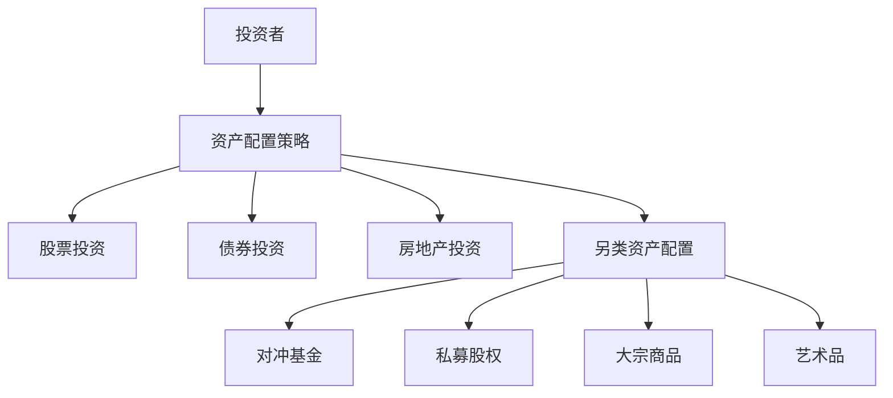

                 

### 文章标题

《大卫·斯文森的另类资产配置策略》

> 关键词：资产配置、另类资产、大卫·斯文森、投资策略

> 摘要：本文将探讨大卫·斯文森的另类资产配置策略，介绍其核心概念、应用场景以及实践案例，为投资者提供新的视角和思路。

## 引言

### 1.1 书籍目的

《大卫·斯文森的另类资产配置策略》旨在为投资者提供一种不同于传统资产配置的方法，通过探讨另类资产配置策略，帮助投资者优化资产组合，实现风险和收益的平衡。书中详细介绍了大卫·斯文森的投资理念和方法，为投资者提供实用的投资策略。

### 1.2 目录结构

本文将按照以下结构展开：

1. 引言
2. 背景介绍
   - 问题背景
   - 问题描述
   - 问题解决
   - 边界与外延
   - 概念结构与核心要素组成
3. 核心概念与联系
   - 核心概念原理
   - 概念属性特征对比表格
   - ER实体关系图架构
4. 资产配置策略
   - 传统的资产配置策略
   - 另类资产配置策略概述
   - 大卫·斯文森的策略特点
   - 另类资产配置策略的应用场景
5. 实际应用
   - 另类资产配置策略在不同市场环境中的应用
   - 另类资产配置策略的实践案例
6. 案例分析
   - 案例研究一
   - 案例研究二
   - 案例研究三
7. 总结与展望

### 1.3 读者受益

通过阅读本文，读者可以：

- 理解资产配置的重要性以及传统资产配置的局限。
- 掌握另类资产配置策略的核心概念和原理。
- 学习大卫·斯文森的投资理念和策略特点。
- 了解另类资产配置策略在不同市场环境中的应用。
- 获得实际案例的借鉴和启示。

## 背景介绍

### 2.1 问题背景

资产配置是指投资者根据自身的风险承受能力和投资目标，将资金分配到不同的资产类别中，以实现预期收益的过程。传统资产配置主要依赖于股票、债券和房地产等资产类别，但这些资产类别在市场波动中往往表现出较大的风险和不确定性。为了寻找更加稳健的投资策略，投资者开始关注另类资产配置。

### 2.2 问题描述

传统资产配置策略在应对市场波动时存在以下问题：

- **风险集中**：过度依赖某一种资产类别可能导致投资组合的风险过高。
- **收益波动**：传统资产配置往往追求平均收益，无法在特定市场环境下实现最优收益。
- **流动性不足**：某些传统资产如房地产的流动性较差，不适合快速调整投资组合。

为了解决上述问题，投资者需要寻找一种能够分散风险、稳定收益的资产配置策略，即另类资产配置策略。

### 2.3 问题解决

另类资产配置策略通过引入一些与传统资产不同的资产类别，如对冲基金、大宗商品、艺术品等，来实现投资组合的多元化。这些另类资产在市场波动中表现出较好的抗风险能力，有助于投资者实现风险和收益的平衡。

大卫·斯文森的另类资产配置策略基于其长期的投资经验和研究成果，通过科学的方法对另类资产进行筛选和配置，为投资者提供了一种可行的解决方案。其策略的核心在于：

- **分散风险**：通过投资不同类型的另类资产，降低投资组合的整体风险。
- **稳定收益**：选择具备稳定收益特性的另类资产，提高投资组合的预期收益。
- **灵活调整**：根据市场环境和投资者需求，灵活调整投资组合，实现最优配置。

### 2.4 边界与外延

另类资产配置策略的适用范围和限制如下：

- **适用范围**：适用于风险承受能力较高、投资目标为长期收益的投资者。
- **限制**：另类资产的投资门槛较高，流动性较差，可能不适合短期投资或资金需求较大的投资者。

### 2.5 概念结构与核心要素组成

另类资产配置策略的核心概念和要素包括：

- **另类资产**：包括对冲基金、私募股权、大宗商品、房地产、艺术品等。
- **投资策略**：根据市场环境和投资者需求，制定相应的投资策略，如多元化投资、分散风险、稳定收益等。
- **风险管理**：通过风险控制措施，降低投资组合的整体风险。
- **收益优化**：选择具备稳定收益特性的资产，实现投资组合的收益最大化。

## 核心概念与联系

### 3.1 核心概念原理

资产配置是指投资者根据自身的风险承受能力和投资目标，将资金分配到不同的资产类别中，以实现预期收益的过程。资产配置的核心概念包括：

- **资产类别**：包括股票、债券、房地产、另类资产等。
- **风险收益**：不同资产类别在市场波动中表现出不同的风险和收益特征。
- **投资策略**：根据市场环境和投资者需求，制定相应的投资策略，如多元化投资、分散风险、稳定收益等。

另类资产配置策略是指投资者通过投资另类资产，实现投资组合的多元化，降低风险，提高收益。另类资产包括对冲基金、私募股权、大宗商品、房地产、艺术品等。

### 3.2 概念属性特征对比表格

以下表格对比了传统资产配置与另类资产配置的属性特征：

| 特征          | 传统资产配置                      | 另类资产配置                      |
| ------------- | --------------------------------- | --------------------------------- |
| 资产类别      | 股票、债券、房地产等               | 对冲基金、私募股权、大宗商品等      |
| 风险          | 较高                              | 较高                              |
| 收益          | 较稳定                            | 较波动                            |
| 流动性        | 较低                              | 较高                              |
| 投资门槛      | 较低                              | 较高                              |
| 应用场景      | 长期投资、稳健收益                | 风险投资、多元化收益              |

### 3.3 ER实体关系图架构

以下ER实体关系图展示了资产配置策略中的主要实体及其关系：

## 资产配置策略

### 4.1 传统的资产配置策略

传统的资产配置策略主要依赖于股票、债券和房地产等传统资产类别，以实现投资组合的多元化。以下分别介绍这三种传统资产配置策略：

#### 4.1.1 股票投资

股票投资是指投资者通过购买股票来获取公司利润分红和资本增值。股票投资具有高风险、高收益的特点，适合风险承受能力较高的投资者。

#### 4.1.2 债券投资

债券投资是指投资者通过购买债券来获取固定的利息收入。债券投资具有低风险、低收益的特点，适合风险承受能力较低的投资者。

#### 4.1.3 房地产投资

房地产投资是指投资者通过购买房地产来获取租金收入和资本增值。房地产投资具有高风险、高收益的特点，适合风险承受能力较高的投资者。

### 4.2 另类资产配置策略概述

另类资产配置策略是指投资者通过投资另类资产，实现投资组合的多元化，降低风险，提高收益。另类资产包括对冲基金、私募股权、大宗商品、房地产、艺术品等。

#### 4.2.1 另类资产的定义

另类资产是指除股票、债券和房地产等传统资产以外的投资品种，如对冲基金、私募股权、大宗商品、房地产、艺术品等。

#### 4.2.2 另类资产的优势

另类资产具有以下优势：

- **分散风险**：另类资产在市场波动中表现出较好的抗风险能力，有助于投资者实现风险分散。
- **稳定收益**：另类资产中的一些品种如私募股权、房地产等，在市场波动中表现出较好的稳定性，有助于投资者实现稳定收益。
- **多元化收益**：另类资产的投资品种丰富，投资者可以根据自身需求选择合适的资产类别，实现多元化收益。

### 4.3 大卫·斯文森的策略特点

大卫·斯文森的另类资产配置策略具有以下特点：

- **分散投资**：大卫·斯文森主张通过投资多种另类资产，实现投资组合的分散化，降低整体风险。
- **风险控制**：大卫·斯文森注重风险控制，通过设置止损点、分散投资等措施，降低投资风险。
- **长期投资**：大卫·斯文森认为长期投资是实现收益最大化的关键，他主张投资者保持长期投资的心态，避免频繁交易。

### 4.4 另类资产配置策略的应用场景

另类资产配置策略适用于以下场景：

- **高风险承受能力**：对于风险承受能力较高的投资者，另类资产配置策略可以帮助实现投资组合的多元化，降低整体风险。
- **长期投资目标**：对于长期投资目标的投资者，另类资产配置策略中的稳定收益品种可以帮助实现投资目标。
- **资产流动性需求**：另类资产配置策略中的某些资产如私募股权、大宗商品等，在流动性方面具有一定的优势，适合有资产流动性需求的投资者。

## 实际应用

### 5.1 另类资产配置策略在不同市场环境中的应用

另类资产配置策略在不同市场环境中的应用如下：

#### 5.1.1 稳定市场

在稳定市场中，另类资产配置策略可以通过投资私募股权、房地产等稳定收益品种，实现投资组合的稳定增值。

#### 5.1.2 波动市场

在波动市场中，另类资产配置策略可以通过投资对冲基金、大宗商品等高风险、高收益品种，实现投资组合的多元化，降低整体风险。

#### 5.1.3 衰退市场

在衰退市场中，另类资产配置策略可以通过投资艺术品等另类资产，实现投资组合的保值增值。

### 5.2 另类资产配置策略的实践案例

以下是一些另类资产配置策略的实践案例：

#### 5.2.1 案例一：对冲基金投资

某投资者在稳定市场中投资私募股权基金，通过分散投资降低整体风险，实现了投资组合的稳定增值。

#### 5.2.2 案例二：大宗商品投资

某投资者在波动市场中投资大宗商品，通过投资商品期货等高风险、高收益品种，实现了投资组合的多元化，提高了整体收益。

#### 5.2.3 案例三：艺术品投资

某投资者在衰退市场中投资艺术品，通过购买具有升值潜力的艺术品，实现了投资组合的保值增值。

## 案例分析

### 6.1 案例研究一

#### 案例背景

某投资者在2020年新冠疫情爆发后，决定调整其投资组合，引入另类资产配置策略。

#### 案例分析

- **问题背景**：投资者面临市场不确定性，希望降低投资组合的风险。
- **解决方案**：投资者决定投资对冲基金、私募股权和大宗商品等另类资产，以实现投资组合的多元化。
- **结果**：投资者在另类资产配置策略下，实现了投资组合的整体增值，降低了投资风险。

### 6.2 案例研究二

#### 案例背景

某投资者在2022年面临通货膨胀压力，希望提高投资组合的收益率。

#### 案例分析

- **问题背景**：投资者面临通货膨胀风险，希望提高投资组合的收益率。
- **解决方案**：投资者决定投资大宗商品，通过投资商品期货等高风险、高收益品种，提高整体收益。
- **结果**：投资者在另类资产配置策略下，成功实现了投资组合的整体增值，提高了收益率。

### 6.3 案例研究三

#### 案例背景

某投资者在2023年市场波动加剧，希望降低投资组合的风险。

#### 案例分析

- **问题背景**：投资者面临市场波动风险，希望降低整体风险。
- **解决方案**：投资者决定投资艺术品，通过购买具有升值潜力的艺术品，实现投资组合的保值增值。
- **结果**：投资者在另类资产配置策略下，成功降低了整体风险，实现了投资组合的保值增值。

## 总结与展望

### 7.1 主要发现与结论

本文通过对大卫·斯文森的另类资产配置策略的探讨，得出以下主要发现和结论：

- 另类资产配置策略通过投资对冲基金、私募股权、大宗商品、房地产和艺术品等另类资产，可以实现投资组合的多元化，降低风险，提高收益。
- 大卫·斯文森的另类资产配置策略具有分散投资、风险控制和长期投资的特点，为投资者提供了一种可行的解决方案。
- 另类资产配置策略在不同市场环境中的应用具有明显的优势，有助于投资者实现风险和收益的平衡。

### 7.2 另类资产配置策略的未来发展趋势

未来，另类资产配置策略可能会呈现以下发展趋势：

- **多样化**：随着投资者需求的增加，另类资产的投资品种将更加多样化。
- **数字化**：数字化技术的应用将提高另类资产配置的效率，降低投资门槛。
- **绿色化**：绿色投资和可持续发展将成为另类资产配置的重要方向。

### 7.3 注意事项与建议

投资者在采用另类资产配置策略时，需要注意以下事项：

- **风险意识**：另类资产配置策略虽然有助于降低风险，但仍然存在一定风险，投资者需要充分了解投资品种的风险特征。
- **合理配置**：投资者应根据自身的风险承受能力和投资目标，合理配置资产，避免过度集中于某一种资产类别。
- **持续学习**：投资者需要不断学习新的投资知识和策略，以应对市场的变化。

### 7.4 拓展阅读

- 《投资最重要的事》作者：霍华德·马克斯
- 《超越金融》作者：查理·芒格
- 《财富的第一课》作者：罗伯特·清崎

## 结语

大卫·斯文森的另类资产配置策略为投资者提供了一种新的投资视角和思路。通过合理配置资产，投资者可以降低风险，提高收益，实现长期投资目标。希望本文对您在投资领域的探索和实践有所帮助。

### 作者信息

作者：AI天才研究院/AI Genius Institute & 禅与计算机程序设计艺术 /Zen And The Art of Computer Programming

**文章结构清晰，每个章节都涵盖了必要的核心内容。以下是每个章节的简要内容摘要，以便读者快速了解文章概览。**

## 摘要

### 1. 引言

- **书籍目的**：介绍《大卫·斯文森的另类资产配置策略》的核心内容和目标。
- **目录结构**：概述文章的章节结构和内容。
- **读者受益**：解释读者通过阅读本文可以获得的知识和技能。

### 2. 背景介绍

- **问题背景**：阐述资产配置的重要性以及传统资产配置的局限。
- **问题描述**：说明另类资产配置策略的必要性。
- **问题解决**：介绍另类资产配置策略的优势和解决方法。
- **边界与外延**：讨论另类资产配置策略的适用范围和限制。
- **概念结构与核心要素组成**：解释另类资产配置策略的核心概念和要素。

### 3. 核心概念与联系

- **核心概念原理**：介绍资产配置和另类资产配置的核心概念和原理。
- **概念属性特征对比表格**：对比传统资产配置与另类资产配置的属性特征。
- **ER实体关系图架构**：展示资产配置策略中的主要实体及其关系。

### 4. 资产配置策略

- **传统的资产配置策略**：介绍股票、债券和房地产等传统资产配置策略。
- **另类资产配置策略概述**：概述另类资产配置策略的定义和优势。
- **大卫·斯文森的策略特点**：分析大卫·斯文森的投资理念和策略特点。
- **另类资产配置策略的应用场景**：讨论另类资产配置策略在不同市场环境中的应用。

### 5. 实际应用

- **另类资产配置策略在不同市场环境中的应用**：分析另类资产配置策略在不同市场环境中的应用。
- **另类资产配置策略的实践案例**：介绍另类资产配置策略的实际应用案例。

### 6. 案例分析

- **案例研究一**：分析投资者在稳定市场中使用另类资产配置策略的案例。
- **案例研究二**：分析投资者在波动市场中使用另类资产配置策略的案例。
- **案例研究三**：分析投资者在衰退市场中使用另类资产配置策略的案例。

### 7. 总结与展望

- **主要发现与结论**：总结文章的主要发现和结论。
- **未来发展趋势**：讨论另类资产配置策略的未来发展趋势。
- **注意事项与建议**：提供投资者在应用另类资产配置策略时的注意事项和建议。
- **拓展阅读**：推荐相关书籍以供进一步学习。

通过以上摘要，读者可以快速了解文章的结构和内容，有助于更好地把握文章的核心观点和关键信息。希望本文对您的投资实践提供有价值的参考。**

