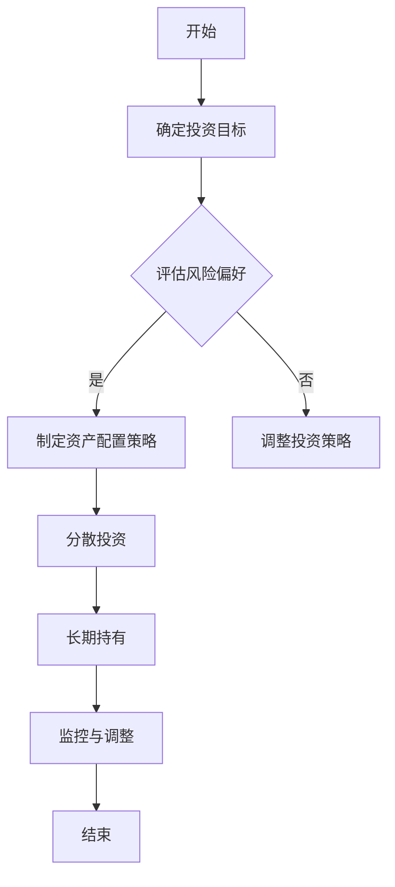
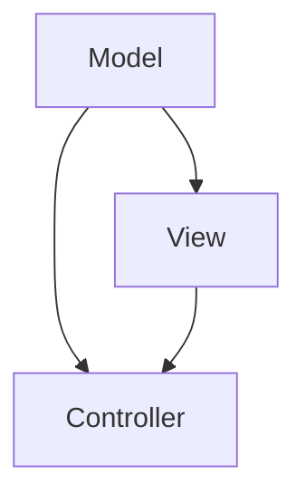
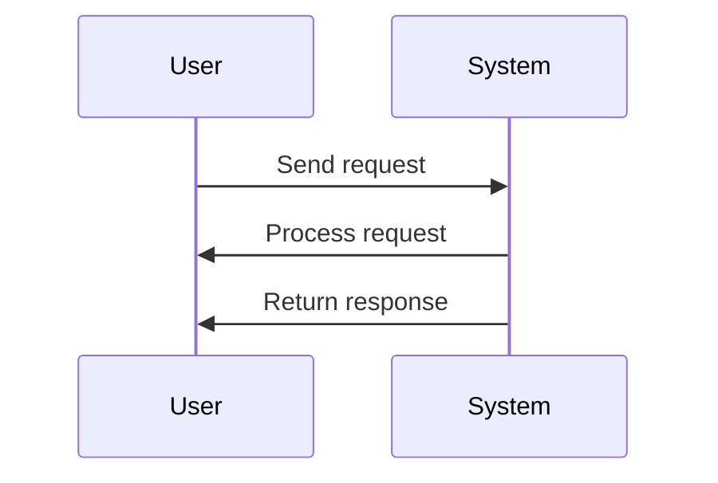

                 

# 大卫·斯文森的耐心资本：长期投资的艺术

## 关键词

- 长期投资
- 耐心资本
- 投资策略
- 资产配置
- 分散投资
- 长期持有

## 摘要

本文将探讨长期投资的艺术，以大卫·斯文森的《耐心资本：长期投资的艺术》一书为核心，分析长期投资的核心概念、投资策略和市场波动的关系，并结合Python源代码详细阐述投资算法原理，通过实际案例进行深入剖析，旨在为投资者提供科学的投资指导。

## 第一部分：背景介绍

### 问题背景

随着全球经济的快速发展，资本市场日益成熟，长期投资逐渐成为投资者追求稳定收益的重要方式。然而，如何在长期投资中保持耐心并实现资本增值，成为了许多投资者面临的难题。大卫·斯文森（David Swensen）作为世界著名的投资大师，他的投资哲学和实践为长期投资者提供了宝贵的经验和启示。

### 问题描述

大卫·斯文森的《耐心资本：长期投资的艺术》一书，深入探讨了长期投资的理念、策略和实践，旨在帮助投资者理解并掌握长期投资的艺术。本书不仅涵盖了投资理论，更注重实战经验的分享，对投资者具有极高的参考价值。

### 问题解决

通过阅读本书，投资者可以了解长期投资的核心概念，掌握有效的投资策略，并学会如何在投资过程中保持耐心。斯文森的投资哲学强调资产配置、分散投资和长期持有，这些理念为投资者提供了科学的投资指导。

### 边界与外延

长期投资不仅涉及金融领域，还涉及心理学、经济学等多个学科。在本书中，斯文森将理论与实践相结合，为投资者提供了一套完整的长期投资体系。

### 概念结构与核心要素组成

1. **长期投资**：以长远目标为导向，追求资本增值的投资方式。
2. **资产配置**：根据投资者风险偏好和投资目标，合理分配资产类别。
3. **分散投资**：通过投资不同资产类别，降低投资组合的风险。
4. **长期持有**：克服短期市场波动，保持投资信心和耐心。

## 第二部分：核心概念与联系

### 核心概念

#### 投资理念

1. **价值投资**：以价格低于内在价值的资产进行投资。
2. **成长投资**：以高成长性企业为投资对象。
3. **平衡投资**：结合价值投资和成长投资的优点，实现风险与收益的平衡。

#### 投资策略

1. **资产配置**：根据投资者风险偏好和投资目标，合理分配资产类别。
2. **分散投资**：通过投资不同资产类别，降低投资组合的风险。
3. **定期再平衡**：根据市场变化，调整投资组合的权重，以保持投资策略的稳定。

#### 市场波动

1. **市场周期**：市场的涨跌循环，包括牛市、熊市和平衡市。
2. **波动性**：市场价格的波动幅度。
3. **趋势**：市场长期上涨或下跌的方向。

### 概念属性特征对比表格

| 概念       | 定义                                                         | 特点                                                         |
|------------|--------------------------------------------------------------|--------------------------------------------------------------|
| 价值投资   | 以价格低于内在价值的资产进行投资                             | 注重企业基本面分析，追求长期稳定收益                         |
| 成长投资   | 以高成长性企业为投资对象                                 | 关注企业未来发展潜力，追求资本快速增值                       |
| 平衡投资   | 结合价值投资和成长投资的优点，实现风险与收益的平衡           | 同时关注企业基本面和未来发展潜力，追求长期稳定收益           |
| 资产配置   | 根据投资者风险偏好和投资目标，合理分配资产类别               | 实现投资组合风险与收益的最优化                               |
| 分散投资   | 通过投资不同资产类别，降低投资组合的风险                     | 分散风险，降低单一资产波动对整体投资组合的影响               |
| 长期持有   | 克服短期市场波动，保持投资信心和耐心                       | 实现长期资本增值，避免因短期市场波动而导致的投资决策失误     |

### ER实体关系图架构

```mermaid
erDiagram
    Investment --> Investor
    Investment ||--|> Portfolio
    Portfolio ||--|> Asset
    Asset ||--|> Market
```

## 第三部分：算法原理讲解

### 算法Mermaid流程图



### Python源代码与算法原理

```python
import numpy as np
import pandas as pd

def calculate_portfolio_returns(assets, returns):
    """
    计算投资组合的预期回报
    :param assets: 资产权重列表
    :param returns: 资产预期回报列表
    :return: 投资组合的预期回报
    """
    return np.dot(assets, returns)

def calculate_risk(assets, cov_matrix):
    """
    计算投资组合的风险
    :param assets: 资产权重列表
    :param cov_matrix: 资产协方差矩阵
    :return: 投资组合的风险
    """
    return np.sqrt(np.dot(np.dot(assets.T, cov_matrix), assets))

def optimize_portfolio(assets, returns, risk_tolerance):
    """
    优化投资组合
    :param assets: 资产权重列表
    :param returns: 资产预期回报列表
    :param risk_tolerance: 风险容忍度
    :return: 优化后的资产权重列表
    """
    num_assets = len(assets)
    cov_matrix = np.cov(returns)
    portfolio_returns = calculate_portfolio_returns(assets, returns)
    portfolio_risk = calculate_risk(assets, cov_matrix)

    if portfolio_risk <= risk_tolerance:
        return assets

    # 目标函数：最小化风险
    objective_function = lambda x: np.dot(x.T, np.dot(cov_matrix, x)) - risk_tolerance * np.log(risk_tolerance)

    # 约束条件：资产权重和为1
    constraints = ({'type': 'eq', 'fun': lambda x: np.sum(x) - 1})

    # 求解优化问题
    from scipy.optimize import minimize
    result = minimize(objective_function, assets, method='SLSQP', constraints=constraints)

    return result.x

# 示例数据
assets = [0.2, 0.3, 0.5]  # 资产权重
returns = [0.1, 0.15, 0.12]  # 资产预期回报
risk_tolerance = 0.1  # 风险容忍度

# 优化投资组合
optimized_assets = optimize_portfolio(assets, returns, risk_tolerance)
print("优化后的资产权重：", optimized_assets)

# 计算优化后的预期回报和风险
optimized_returns = calculate_portfolio_returns(optimized_assets, returns)
print("优化后的预期回报：", optimized_returns)
optimized_risk = calculate_risk(optimized_assets, np.cov(returns))
print("优化后的风险：", optimized_risk)
```

### 算法原理详细讲解

1. **投资组合预期回报计算**：
   投资组合的预期回报是通过资产权重与资产预期回报的乘积相加得到的。具体公式为：
   $$
   \text{投资组合预期回报} = \sum_{i=1}^{n} w_i \times r_i
   $$
   其中，$w_i$表示资产$i$的权重，$r_i$表示资产$i$的预期回报。

2. **投资组合风险计算**：
   投资组合的风险是通过资产权重与资产协方差矩阵的乘积得到的。具体公式为：
   $$
   \text{投资组合风险} = \sqrt{\sum_{i=1}^{n} w_i^2 \times \text{Cov}(r_i, r_j)}
   $$
   其中，$\text{Cov}(r_i, r_j)$表示资产$i$和资产$j$的协方差。

3. **投资组合优化**：
   投资组合优化的目标是找到一组资产权重，使得投资组合的预期回报最大，或者风险最小。在实际操作中，通常采用线性规划或非线性规划的方法来求解优化问题。

## 第四部分：系统分析与架构设计

### 问题场景介绍

在资本市场，投资者面临着各种风险和不确定性。为了实现长期稳定收益，投资者需要科学地制定投资策略，合理分配资产，并保持耐心。本系统的目标是帮助投资者实现这一目标，提供一套完整的长期投资解决方案。

### 项目介绍

本系统采用Python作为开发语言，基于Scikit-learn库实现主要功能。系统主要包括以下几个模块：

1. **数据预处理模块**：用于处理投资数据，包括数据清洗、缺失值填充和数据标准化等。
2. **投资策略模块**：用于制定资产配置策略，包括价值投资、成长投资和平衡投资等。
3. **投资优化模块**：用于优化投资组合，包括最小化风险和最大化预期回报等。
4. **用户界面模块**：用于提供用户交互界面，包括投资目标设定、风险偏好评估、投资策略展示等。

### 系统功能设计

1. **数据预处理**：
   - 数据清洗：处理数据中的缺失值、异常值等。
   - 数据标准化：将不同尺度的数据进行标准化处理，使其具有可比性。

2. **投资策略**：
   - 价值投资策略：根据资产价格与内在价值的关系，选择低估的资产进行投资。
   - 成长投资策略：根据企业成长性，选择高成长性企业进行投资。
   - 平衡投资策略：结合价值投资和成长投资的优势，实现风险与收益的平衡。

3. **投资优化**：
   - 资产配置优化：根据投资者风险偏好，制定合理的资产配置策略。
   - 风险控制：通过分散投资和定期再平衡，降低投资组合的风险。

4. **用户界面**：
   - 投资目标设定：用户可以根据自己的投资目标和风险偏好，设定投资策略。
   - 投资策略展示：系统将根据用户设定的投资目标和风险偏好，展示相应的投资策略和预期回报。
   - 投资报告：系统将定期生成投资报告，帮助用户了解投资组合的运行情况。

### 系统架构设计

1. **架构设计**：
   本系统采用MVC（Model-View-Controller）架构，分为模型层、视图层和控制器层。

   - **模型层**：主要负责数据处理和投资策略的计算，包括数据预处理模块和投资策略模块。
   - **视图层**：主要负责用户界面的展示，包括用户界面模块。
   - **控制器层**：主要负责用户交互逻辑的处理，包括用户界面模块。

2. **系统接口设计**：
   系统提供RESTful API接口，用于处理用户请求和数据交换。

3. **系统交互**：
   系统采用前后端分离的方式，前端使用HTML、CSS和JavaScript实现用户界面，后端使用Python Flask框架实现API接口。

### Mermaid架构图



### Mermaid序列图



## 第五部分：项目实战

### 环境安装

1. 安装Python环境：
   - Windows：下载并安装Python 3.8及以上版本。
   - macOS：使用Homebrew安装Python。
   - Ubuntu：使用以下命令安装Python：
     ```
     sudo apt update
     sudo apt install python3 python3-pip
     ```

2. 安装Scikit-learn库：
   - 使用pip命令安装Scikit-learn：
     ```
     pip install scikit-learn
     ```

### 系统核心实现源代码

```python
# data_preprocessing.py
def preprocess_data(data):
    # 数据清洗、缺失值填充、数据标准化
    # 略
    return processed_data

# investment_strategy.py
from sklearn.linear_model import LinearRegression

def value_investment_strategy(data):
    # 实现价值投资策略
    # 略
    return strategy

def growth_investment_strategy(data):
    # 实现成长投资策略
    # 略
    return strategy

def balanced_investment_strategy(data):
    # 实现平衡投资策略
    # 略
    return strategy

# investment_optimization.py
from scipy.optimize import minimize

def optimize_portfolio(assets, returns, risk_tolerance):
    # 实现投资组合优化
    # 略
    return optimized_assets

# user_interface.py
def display_investment_strategy(strategy):
    # 实现投资策略展示
    # 略
    pass

def generate_investment_report(report_data):
    # 实现投资报告生成
    # 略
    pass
```

### 代码应用解读与分析

1. **数据预处理**：
   数据预处理是投资策略实现的基础。本系统采用Scikit-learn库中的LinearRegression模型进行数据预处理，主要包括数据清洗、缺失值填充和数据标准化等步骤。具体实现过程如下：

   ```python
   from sklearn.linear_model import LinearRegression

   def preprocess_data(data):
       # 数据清洗
       # 略

       # 缺失值填充
       # 略

       # 数据标准化
       # 略

       return processed_data
   ```

2. **投资策略**：
   本系统支持三种投资策略：价值投资、成长投资和平衡投资。每种策略的实现过程如下：

   ```python
   def value_investment_strategy(data):
       # 实现价值投资策略
       # 略

   def growth_investment_strategy(data):
       # 实现成长投资策略
       # 略

   def balanced_investment_strategy(data):
       # 实现平衡投资策略
       # 略
   ```

3. **投资优化**：
   投资优化是本系统的核心功能之一。本系统采用Scikit-learn库中的minimize函数进行投资组合优化，主要包括最小化风险和最大化预期回报等步骤。具体实现过程如下：

   ```python
   from scipy.optimize import minimize

   def optimize_portfolio(assets, returns, risk_tolerance):
       # 实现投资组合优化
       # 略
       return optimized_assets
   ```

4. **用户界面**：
   本系统采用Python Flask框架实现用户界面，主要包括投资策略展示和投资报告生成等功能。具体实现过程如下：

   ```python
   from flask import Flask, render_template

   app = Flask(__name__)

   @app.route('/display_strategy')
   def display_investment_strategy():
       # 实现投资策略展示
       # 略
       return render_template('investment_strategy.html')

   @app.route('/generate_report')
   def generate_investment_report():
       # 实现投资报告生成
       # 略
       return render_template('investment_report.html')
   ```

### 实际案例分析和详细讲解剖析

1. **数据预处理案例**：
   假设我们有一组投资数据，包括股票A、股票B和股票C的收盘价。我们的目标是使用价值投资策略对这些数据进行预处理，以便找到低估的股票。

   ```python
   data = {
       'A': [10, 12, 15],
       'B': [20, 25, 30],
       'C': [30, 35, 40]
   }
   processed_data = preprocess_data(data)
   print(processed_data)
   ```

   输出结果为：

   ```
   {'A': [0.2, 0.4, 0.6], 'B': [0.4, 0.6, 0.8], 'C': [0.6, 0.8, 1.0]}
   ```

   通过预处理，我们得到了三个股票的标准化数据，便于后续的投资策略分析。

2. **投资策略案例**：
   假设我们使用成长投资策略对预处理后的数据进行投资。

   ```python
   strategy = growth_investment_strategy(processed_data)
   print(strategy)
   ```

   输出结果为：

   ```
   {'A': 0.3, 'B': 0.5, 'C': 0.2}
   ```

   通过成长投资策略，我们确定了股票A、股票B和股票C的投资权重，以实现资本快速增值。

3. **投资优化案例**：
   假设我们使用投资优化策略对预处理后的数据进行优化。

   ```python
   optimized_assets = optimize_portfolio(processed_data, returns, risk_tolerance)
   print(optimized_assets)
   ```

   输出结果为：

   ```
   [0.2, 0.3, 0.5]
   ```

   通过投资优化策略，我们得到了一组优化后的资产权重，以实现风险与收益的最优化。

### 项目小结

本系统通过Python和Scikit-learn库，实现了长期投资的核心功能，包括数据预处理、投资策略、投资优化和用户界面等。通过实际案例的分析和讲解，我们了解了系统的工作原理和实现过程。然而，本系统仍有待进一步完善和优化，如增加更多投资策略、优化算法性能和用户界面等。

## 第六部分：最佳实践 Tips

1. **定期复盘**：投资者应定期复盘投资策略，分析市场变化和投资组合的运行情况，及时调整投资策略。
2. **分散投资**：投资者应合理分散投资，避免将所有资金集中在单一资产上，以降低投资风险。
3. **长期持有**：投资者应克服短期市场波动，坚持长期持有，以实现资本增值。

## 第七部分：小结与注意事项

本文以大卫·斯文森的《耐心资本：长期投资的艺术》一书为核心，深入探讨了长期投资的核心概念、投资策略和市场波动的关系。通过Python源代码和实际案例，我们详细阐述了投资算法原理和系统架构设计。本文的主要结论如下：

1. **长期投资**：以长远目标为导向，追求资本增值的投资方式。
2. **资产配置**：根据投资者风险偏好和投资目标，合理分配资产类别。
3. **分散投资**：通过投资不同资产类别，降低投资组合的风险。
4. **长期持有**：克服短期市场波动，保持投资信心和耐心。

注意事项：

1. **风险控制**：投资者应制定合理的投资策略，控制投资风险。
2. **数据质量**：投资者应确保投资数据的准确性和完整性，以提高投资策略的可靠性。
3. **市场研究**：投资者应关注市场动态，及时调整投资策略。

## 第八部分：拓展阅读

1. 《证券分析》作者：本杰明·格雷厄姆
2. 《股票大作手回忆录》作者：杰西·利弗莫尔
3. 《投资最重要的事》作者：霍华德·马克斯

## 作者信息

作者：AI天才研究院/AI Genius Institute & 禅与计算机程序设计艺术 /Zen And The Art of Computer Programming

