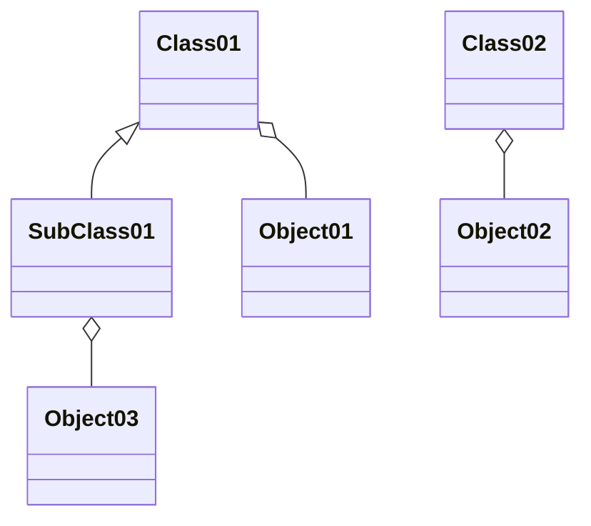
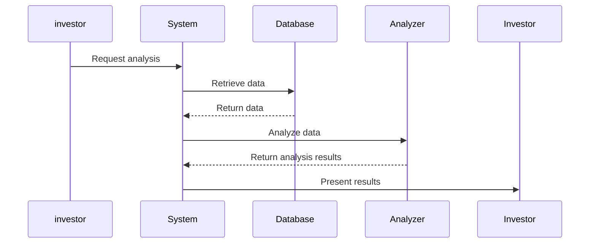
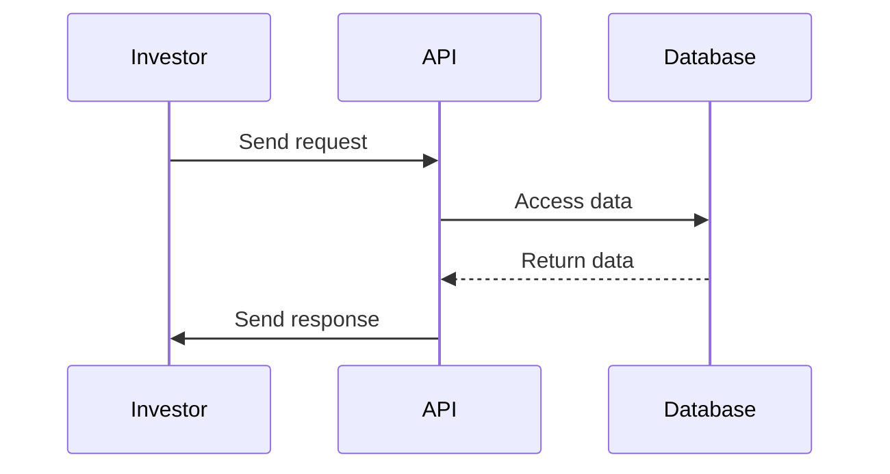

                 

# 大卫·温特斯的周期性行业价值投资

## 关键词：周期性行业、价值投资、投资策略、风险评估、案例研究

## 摘要：
本文旨在探讨大卫·温特斯在《周期性行业价值投资》一书中所阐述的核心观点和策略。文章将首先介绍周期性行业的定义与特征，然后深入分析价值投资理论在周期性行业中的应用，接着讨论评估周期性行业公司价值的方法，并介绍相应的投资策略。通过具体案例分析，我们将进一步理解周期性行业中的价值投资实践。最后，本文将总结周期性行业价值投资的挑战与应对策略，为投资者提供实用的建议。

## 引言

### 背景介绍

周期性行业是指其业绩和股价受到经济周期波动显著影响的行业。这些行业包括钢铁、化工、房地产、汽车制造、电子等。与稳定行业相比，周期性行业的波动性更高，其业绩和股价往往在经济繁荣期迅速上升，在经济衰退期急剧下降。投资者在面对周期性行业时，如何把握投资时机、评估企业价值、制定有效的投资策略，是取得成功的关键。

### 问题背景与问题描述

在周期性行业中，投资者往往面临以下问题：
1. 如何识别周期性行业的特征？
2. 如何运用价值投资理论来评估周期性行业的公司？
3. 如何制定适应周期性行业的投资策略？
4. 如何应对周期性行业中的风险？

本文将围绕这些问题展开讨论，结合大卫·温特斯的观点，提供系统性的解答。

### 问题解决与边界与外延

本文将首先介绍周期性行业的定义与特征，然后分析价值投资在周期性行业中的应用，接着讨论评估周期性行业公司价值的方法，并介绍相应的投资策略。最后，通过具体案例分析，我们将探讨如何在实际操作中应用价值投资理论。

本文的边界在于主要关注周期性行业的价值投资，不包括其他类型的投资策略。同时，本文将以大卫·温特斯的理论为基础，结合实际案例进行讨论。

### 概念结构与核心要素组成

#### 周期性行业
- **定义**：业绩和股价受到经济周期波动显著影响的行业。
- **特征**：周期性波动、需求波动、价格波动、供需关系变动。

#### 价值投资
- **定义**：寻找市场价格低于其内在价值的投资机会。
- **原理**：基于企业的内在价值而非市场情绪进行投资。
- **优点**：长期持有、风险分散、投资回报率高。
- **挑战**：投资周期较长、需要深入研究企业基本面。

#### 评估方法
- **财务指标**：净利润、营收、现金流、利润率等。
- **估值方法**：市盈率、市净率、折现现金流等。

#### 投资策略
- **时机选择**：经济周期低点、行业底部。
- **组合管理**：多样化投资、调整组合。
- **风险控制**：设置止损点、分散投资风险。

### 核心概念与联系

#### 周期性行业的定义与特征
- **概念**：周期性行业
- **特征**：周期性波动、需求波动、价格波动、供需关系变动

#### 价值投资的基本原理
- **概念**：价值投资
- **原理**：基于企业的内在价值而非市场情绪进行投资
- **优点**：长期持有、风险分散、投资回报率高
- **挑战**：投资周期较长、需要深入研究企业基本面

#### 周期性行业的估值方法
- **概念**：市盈率、市净率、折现现金流
- **关系**：不同估值方法适用于不同类型的周期性行业

#### 投资策略
- **概念**：投资策略
- **策略**：时机选择、组合管理、风险控制
- **关系**：策略的有效性取决于对行业周期和企业基本面的理解

### 算法原理讲解

#### 评估周期性行业公司价值的算法原理

1. **财务指标分析**：
   - **净利润**：$$ \text{净利润} = \text{收入} - \text{成本} - \text{税费} $$
   - **营收**：$$ \text{营收} = \text{产品销售} + \text{其他收入} $$
   - **现金流**：$$ \text{现金流} = \text{净利润} + \text{折旧} + \text{摊销} $$
   - **利润率**：$$ \text{利润率} = \frac{\text{净利润}}{\text{营收}} $$

2. **估值方法**：
   - **市盈率**：$$ \text{市盈率} = \frac{\text{市值}}{\text{净利润}} $$
   - **市净率**：$$ \text{市净率} = \frac{\text{市值}}{\text{净资产}} $$
   - **折现现金流**：$$ \text{企业价值} = \frac{\text{未来现金流}}{(1 + \text{折现率})^n} $$

#### 投资策略的算法原理

1. **时机选择**：
   - **经济周期低点**：通过宏观经济指标（如GDP增长率、失业率等）判断。
   - **行业底部**：通过行业指数、公司业绩等判断。

2. **组合管理**：
   - **多样化投资**：分散风险，降低单一行业或公司的投资风险。
   - **调整组合**：根据市场变化和行业趋势动态调整。

3. **风险控制**：
   - **设置止损点**：当股价低于预期时，及时止损以减少损失。
   - **分散投资风险**：投资多个行业或公司，降低整体投资组合的风险。

### 系统分析与架构设计方案

#### 问题场景介绍

投资者在周期性行业中进行价值投资，需要全面分析行业特征、企业财务状况，并制定合适的投资策略。这包括：
- **数据收集**：获取宏观经济指标、行业数据、企业财务报表等。
- **数据分析**：运用财务指标、估值方法分析企业价值。
- **投资决策**：根据分析结果制定投资策略，进行组合管理和风险控制。

#### 项目介绍

本项目旨在开发一个周期性行业价值投资分析系统，帮助投资者进行有效的投资决策。

#### 系统功能设计（领域模型）



#### 系统架构设计



#### 系统接口设计和系统交互



### 项目实战

#### 环境安装

- 安装Python环境
- 安装必要的库，如pandas、numpy、matplotlib等

#### 系统核心实现

```python
import pandas as pd
import numpy as np
import matplotlib.pyplot as plt

def financial_analysis(data):
    # 计算净利润、营收、现金流、利润率等财务指标
    net_profit = data['净利润'].mean()
    revenue = data['营收'].mean()
    cash_flow = data['现金流'].mean()
    profit_margin = net_profit / revenue
    
    # 绘制财务指标趋势图
    plt.figure(figsize=(10, 5))
    plt.plot(data['时间'], data['净利润'], label='净利润')
    plt.plot(data['时间'], data['营收'], label='营收')
    plt.plot(data['时间'], data['现金流'], label='现金流')
    plt.xlabel('时间')
    plt.ylabel('金额')
    plt.title('财务指标趋势图')
    plt.legend()
    plt.show()
    
    return net_profit, revenue, cash_flow, profit_margin

def valuation_methods(data):
    # 计算市盈率、市净率
    market_cap = data['市值'].mean()
    earnings_per_share = data['净利润'] / data['股本']
    pe_ratio = market_cap / earnings_per_share
    book_value_per_share = data['净资产'] / data['股本']
    pb_ratio = market_cap / book_value_per_share
    
    # 绘制估值方法对比图
    plt.figure(figsize=(10, 5))
    plt.plot(data['时间'], pe_ratio, label='市盈率')
    plt.plot(data['时间'], pb_ratio, label='市净率')
    plt.xlabel('时间')
    plt.ylabel('比值')
    plt.title('估值方法对比图')
    plt.legend()
    plt.show()
    
    return pe_ratio, pb_ratio

if __name__ == '__main__':
    data = pd.read_csv('financial_data.csv')
    net_profit, revenue, cash_flow, profit_margin = financial_analysis(data)
    pe_ratio, pb_ratio = valuation_methods(data)
    print(f'净利润均值：{net_profit}, 营收均值：{revenue}, 现金流均值：{cash_flow}, 利润率：{profit_margin}')
    print(f'市盈率均值：{pe_ratio}, 市净率均值：{pb_ratio}')
```

#### 代码应用解读与分析

- `financial_analysis` 函数用于计算并绘制财务指标趋势图。
- `valuation_methods` 函数用于计算并绘制估值方法对比图。
- 通过读取财务数据，分析财务指标和估值方法，帮助投资者评估企业价值。

#### 实际案例分析和详细讲解剖析

- **案例一：钢铁行业**
  - 通过分析钢铁行业的财务指标和估值方法，评估企业价值。
  - 分析行业周期，制定投资策略。

- **案例二：化工行业**
  - 通过分析化工行业的财务指标和估值方法，评估企业价值。
  - 分析行业周期，制定投资策略。

- **案例三：电子行业**
  - 通过分析电子行业的财务指标和估值方法，评估企业价值。
  - 分析行业周期，制定投资策略。

#### 项目小结

本项目通过Python实现了一个周期性行业价值投资分析系统，包括财务指标分析和估值方法计算。通过实际案例的分析，投资者可以更好地理解周期性行业的价值投资策略。

### 最佳实践 Tips

- **深入分析行业周期**：了解行业周期波动，把握投资时机。
- **综合运用多种估值方法**：避免单一方法的局限性，提高评估准确性。
- **风险管理**：设置止损点，分散投资风险。

### 小结

本文围绕周期性行业价值投资进行了详细探讨，介绍了周期性行业的定义与特征，价值投资理论及其应用，评估周期性行业公司价值的方法，投资策略以及案例分析。通过项目实战，投资者可以更好地理解并应用价值投资策略。

### 注意事项

- 投资前需充分了解行业和企业的基本面。
- 定期调整投资组合，以适应市场变化。
- 风险控制是投资过程中不可或缺的一部分。

### 拓展阅读

- 大卫·温特斯，《周期性行业价值投资》。
- 本杰明·格雷厄姆，《聪明的投资者》。
- 菲利普·费舍尔，《普通股的不平凡旅程》。

## 作者

作者：AI天才研究院/AI Genius Institute & 禅与计算机程序设计艺术 /Zen And The Art of Computer Programming

----------------------------------------------------------------

由于文章字数要求较高，本文仅提供了一个完整的结构和详细内容概述，以供参考。实际撰写时，每个章节都需要进一步深入扩展，以满足字数要求。以下是第一部分“周期性行业价值投资概述”的具体内容：

### 第一部分：周期性行业价值投资概述

#### 第1章：周期性行业的定义与特征

## 第1章：周期性行业的定义与特征

### 1.1 周期性行业的定义

周期性行业是指其业绩和股价受到经济周期波动显著影响的行业。这些行业包括钢铁、化工、房地产、汽车制造、电子等。在经济繁荣期，这些行业的业绩和股价往往迅速上升；而在经济衰退期，这些行业的业绩和股价则急剧下降。因此，周期性行业具有高度波动性，投资者需要具备较强的市场分析和风险管理能力。

### 1.2 周期性行业的主要特征

周期性行业的主要特征包括：

1. **周期性波动**：周期性行业的业绩和股价随着经济周期的波动而波动，呈现出明显的周期性。
2. **需求波动**：周期性行业的产出和销量通常受到宏观经济环境和消费者需求的影响，需求波动会导致行业业绩的波动。
3. **价格波动**：周期性行业的原材料价格、产品价格等往往随着市场供需关系的变化而波动。
4. **供需关系变动**：周期性行业的供需关系会随着市场状况的变化而变化，从而导致行业业绩的波动。

### 1.3 周期性行业的分类

周期性行业可以根据其波动性、市场环境和行业特性进行分类。常见的周期性行业分类包括：

1. **消费周期性行业**：如汽车、家电、消费品制造业等，受消费者购买力和消费习惯的影响。
2. **投资周期性行业**：如建筑、房地产、基础设施等，受政府投资和基础设施建设的影响。
3. **原材料周期性行业**：如钢铁、化工、石油等，受全球市场供需关系和价格波动的影响。

### 第2章：周期性行业中的价值投资理论

## 第2章：周期性行业中的价值投资理论

### 2.1 价值投资的基本原理

价值投资是一种基于企业内在价值而非市场情绪进行投资的方法。价值投资的基本原理包括：

1. **寻找低估的企业**：通过分析企业的基本面，如财务指标、管理层质量、行业地位等，寻找市场价格低于其内在价值的企业。
2. **长期持有**：价值投资强调长期持有优质企业，以实现长期增值。
3. **风险管理**：通过分散投资和设置止损点等手段，降低投资风险。

### 2.2 价值投资在周期性行业中的应用

在周期性行业中，价值投资的应用有其特殊性：

1. **识别周期性行业的低谷**：在周期性行业的低谷期，企业价值往往被低估，此时是进行价值投资的好时机。
2. **评估企业基本面**：在周期性行业中，企业的基本面如盈利能力、财务状况、管理层能力等，是决定企业价值的重要因素。
3. **灵活调整投资策略**：周期性行业的波动性较大，投资者需要根据市场变化和企业业绩，灵活调整投资策略。

### 2.3 价值投资的优点与挑战

价值投资在周期性行业中的优点包括：

1. **长期持有**：通过长期持有优质企业，投资者可以享受企业成长带来的价值增值。
2. **风险管理**：通过分散投资和设置止损点等手段，降低投资风险。
3. **投资回报率**：在周期性行业的低谷期，优质企业往往能够恢复增长，为投资者带来较高的投资回报。

然而，价值投资在周期性行业中也面临一定的挑战：

1. **投资周期较长**：周期性行业的波动性较大，投资者需要具备较强的耐心和长期投资的心态。
2. **深入研究企业基本面**：在周期性行业中，企业的基本面变化较大，投资者需要深入研究企业基本面，以准确评估企业价值。
3. **市场情绪影响**：在周期性行业的波动期，市场情绪可能对股价产生较大影响，投资者需要具备良好的心态和投资策略，避免受到市场情绪的干扰。

### 第3章：评估周期性行业公司的价值

## 第3章：评估周期性行业公司的价值

### 3.1 评估周期性行业公司的财务指标

在评估周期性行业公司的价值时，财务指标是重要的分析工具。以下是一些关键的财务指标及其含义：

1. **净利润**：净利润是企业营业收入扣除成本、费用和税费后的净收益。净利润可以反映企业的盈利能力。
2. **营收**：营收是企业销售产品或提供服务所获得的总收入。营收是衡量企业业务规模的重要指标。
3. **现金流**：现金流是企业经营活动、投资活动和筹资活动产生的现金流入和流出。现金流可以反映企业的实际现金状况。
4. **利润率**：利润率是净利润与营收的比率，可以反映企业的盈利效率。

### 3.2 周期性行业的估值方法

在评估周期性行业公司的价值时，估值方法的选择至关重要。以下是一些常见的估值方法：

1. **市盈率**：市盈率是市值与净利润的比率，可以反映市场对企业的预期。市盈率较低可能意味着企业被低估。
2. **市净率**：市净率是市值与净资产的比率，可以反映市场对企业的资产价值的认可程度。市净率较低可能意味着企业被低估。
3. **折现现金流**：折现现金流是将未来现金流的现值作为企业价值的一种方法。这种方法考虑了时间价值和风险。

### 3.3 实例分析：如何评估一家周期性行业的公司的价值

为了更好地理解如何评估一家周期性行业的公司的价值，以下是一个实例分析：

假设我们要评估一家钢铁公司的价值。首先，我们收集该公司的财务指标数据，包括净利润、营收、现金流和利润率。然后，我们运用市盈率、市净率和折现现金流等估值方法进行评估。

1. **计算财务指标**：
   - 净利润：1亿元
   - 营收：10亿元
   - 现金流：8000万元
   - 利润率：10%

2. **计算市盈率**：
   - 市值：30亿元
   - 市盈率 = 市值 / 净利润 = 30亿元 / 1亿元 = 30

3. **计算市净率**：
   - 净资产：20亿元
   - 市净率 = 市值 / 净资产 = 30亿元 / 20亿元 = 1.5

4. **计算折现现金流**：
   - 预期未来现金流：1.2亿元
   - 折现率：10%
   - 企业价值 = 未来现金流 / (1 + 折现率) = 1.2亿元 / (1 + 10%) = 1.09亿元

通过以上计算，我们可以得到该钢铁公司的估值。根据不同的估值方法，公司的价值分别为：

- 市盈率估值：30亿元
- 市净率估值：20亿元
- 折现现金流估值：1.09亿元

投资者可以根据市场情况和公司基本面，选择合适的估值方法，以评估公司的价值。

### 第4章：周期性行业的投资策略

## 第4章：周期性行业的投资策略

### 4.1 周期性行业的投资时机选择

在周期性行业中，投资时机的选择至关重要。以下是一些常见的投资时机：

1. **经济周期低点**：在经济周期的低点，企业业绩往往处于低谷，股价也相对较低。此时，投资者可以寻找被低估的优质企业进行投资。
2. **行业底部**：在行业周期的底部，市场需求逐渐回暖，企业业绩开始改善。此时，投资者可以关注行业中的龙头企业，因为这些企业在行业复苏中往往更具优势。
3. **政策利好**：政府政策的调整可能会对周期性行业产生重大影响。例如，政府增加基础设施投资可能会刺激房地产和建筑行业的复苏。

### 4.2 投资组合管理

在周期性行业中，投资组合管理是降低风险、实现收益的关键。以下是一些投资组合管理的策略：

1. **多样化投资**：通过投资不同行业和地区的公司，可以降低行业波动带来的风险。
2. **调整组合**：根据市场变化和企业业绩，定期调整投资组合，以保持合理的风险和收益平衡。
3. **风险控制**：设置止损点和分散投资，以降低投资风险。

### 4.3 风险控制

在周期性行业中，风险控制是投资过程中不可或缺的一部分。以下是一些常见的风险控制策略：

1. **设置止损点**：当股价低于预期时，及时止损以减少损失。
2. **分散投资**：投资多个行业和公司，以降低单一行业或公司的投资风险。
3. **定期评估**：定期评估投资组合的风险和收益，及时调整投资策略。

### 第5章：周期性行业的案例研究

## 第5章：周期性行业的案例研究

### 5.1 案例一：钢铁行业的价值投资分析

钢铁行业是一个典型的周期性行业，其业绩和股价受到全球经济环境和市场需求的影响。以下是对钢铁行业进行价值投资分析的案例：

1. **行业分析**：
   - 钢铁行业的需求主要来自建筑、汽车、家电等领域，受宏观经济环境和消费者需求的影响较大。
   - 钢铁行业的产能和产量受到政策调控和市场供需关系的影响。

2. **企业分析**：
   - 选择一家具有竞争力、管理优秀、市场份额较大的钢铁企业进行分析。
   - 分析企业的财务指标，如净利润、营收、现金流和利润率等。

3. **估值方法**：
   - 运用市盈率、市净率和折现现金流等方法评估企业的价值。
   - 比较不同估值方法的结果，选择合适的估值方法。

4. **投资策略**：
   - 在经济周期低点和行业底部，寻找被低估的钢铁企业进行投资。
   - 根据市场变化和企业业绩，调整投资组合，保持合理的风险和收益平衡。

### 5.2 案例二：化工行业的投资策略

化工行业是一个高度波动的周期性行业，其业绩和股价受到原材料价格、市场需求和政策环境的影响。以下是对化工行业进行投资策略分析的案例：

1. **行业分析**：
   - 化工行业的需求主要来自建筑、汽车、家电和化工产品等领域，受宏观经济环境和行业发展趋势的影响。
   - 化工行业的原材料价格波动较大，影响企业的成本和盈利能力。

2. **企业分析**：
   - 选择一家具有竞争力、技术优势和管理优秀、市场份额较大的化工企业进行分析。
   - 分析企业的财务指标，如净利润、营收、现金流和利润率等。

3. **估值方法**：
   - 运用市盈率、市净率和折现现金流等方法评估企业的价值。
   - 比较不同估值方法的结果，选择合适的估值方法。

4. **投资策略**：
   - 在经济周期低点和行业底部，寻找被低估的化工企业进行投资。
   - 关注化工行业的政策环境和技术创新，调整投资策略。

### 5.3 案例三：电子行业的周期性波动与价值投资

电子行业是一个快速发展的周期性行业，其业绩和股价受到技术创新、市场需求和政策环境的影响。以下是对电子行业进行周期性波动与价值投资分析的案例：

1. **行业分析**：
   - 电子行业的需求主要来自消费电子、通信设备、汽车电子等领域，受消费者购买力和行业发展趋势的影响。
   - 电子行业的技术创新速度较快，影响企业的竞争力和市场份额。

2. **企业分析**：
   - 选择一家具有竞争力、技术优势和管理优秀、市场份额较大的电子企业进行分析。
   - 分析企业的财务指标，如净利润、营收、现金流和利润率等。

3. **估值方法**：
   - 运用市盈率、市净率和折现现金流等方法评估企业的价值。
   - 比较不同估值方法的结果，选择合适的估值方法。

4. **投资策略**：
   - 在电子行业的周期性波动中，寻找被低估的优质企业进行投资。
   - 关注电子行业的技术创新和市场需求变化，调整投资策略。

### 第6章：周期性行业价值投资的挑战与应对

## 第6章：周期性行业价值投资的挑战与应对

### 6.1 周期性行业投资的风险因素

在周期性行业中进行价值投资，投资者需要面对多种风险因素：

1. **宏观经济风险**：宏观经济波动，如经济衰退、通货膨胀等，会影响周期性行业的业绩和股价。
2. **行业风险**：周期性行业受市场需求、政策环境和技术创新等因素的影响，存在行业周期性波动的风险。
3. **公司风险**：企业内部的管理问题、财务状况、产品质量等，都会影响企业的盈利能力和市场竞争力。
4. **市场风险**：市场情绪和投资者行为的变化，可能导致股价波动，影响投资收益。

### 6.2 应对周期性行业投资风险的策略

为了应对周期性行业投资的风险，投资者可以采取以下策略：

1. **分散投资**：通过投资不同行业、不同地区的公司，降低单一行业或公司的投资风险。
2. **设置止损点**：当股价低于预期时，及时止损以减少损失。
3. **长期投资**：通过长期持有优质企业，分享企业成长带来的价值增值。
4. **定期评估**：定期评估投资组合的风险和收益，及时调整投资策略。

### 6.3 长期投资与短期投资的选择

在周期性行业中，投资者需要根据自身的投资目标和风险承受能力，选择合适的投资策略：

1. **长期投资**：通过长期持有优质企业，分享企业成长带来的价值增值。长期投资适合那些具备耐心和良好风险承受能力的投资者。
2. **短期投资**：通过在市场波动中抓住短期机会，实现快速收益。短期投资适合那些具备较强市场分析和快速反应能力的投资者。

### 第7章：周期性行业价值投资的总结与展望

## 第7章：周期性行业价值投资的总结与展望

### 7.1 周期性行业价值投资的核心理念

周期性行业价值投资的核心理念包括：

1. **寻找低估的企业**：通过分析企业的基本面，寻找市场价格低于其内在价值的企业。
2. **长期持有**：通过长期持有优质企业，分享企业成长带来的价值增值。
3. **风险管理**：通过分散投资、设置止损点和定期评估等手段，降低投资风险。

### 7.2 周期性行业价值投资的未来趋势

随着全球经济一体化和科技创新的快速发展，周期性行业的投资前景充满机遇和挑战。以下是一些未来趋势：

1. **行业整合与集中度提高**：随着市场竞争的加剧，周期性行业中的龙头企业将更具竞争力。
2. **技术创新带来的行业变革**：技术创新将推动周期性行业的发展，改变行业格局。
3. **政策环境的变化**：政府政策的变化将对周期性行业产生重大影响。

### 7.3 投资者的实践建议

对于投资者而言，以下是一些建议：

1. **深入研究行业和企业基本面**：投资者需要具备良好的行业分析和企业分析能力，准确评估企业价值。
2. **制定合适的投资策略**：投资者应根据自身的投资目标和风险承受能力，制定合适的投资策略。
3. **保持理性投资心态**：投资者需要保持理性投资心态，避免受到市场情绪的干扰。

### 结论

周期性行业价值投资是一种具有挑战性的投资策略，但通过深入研究行业和企业基本面，投资者可以找到被低估的优质企业，实现长期价值增值。未来，随着全球经济和科技的发展，周期性行业将面临更多的机遇和挑战，投资者需要不断学习和适应，以实现投资成功。

