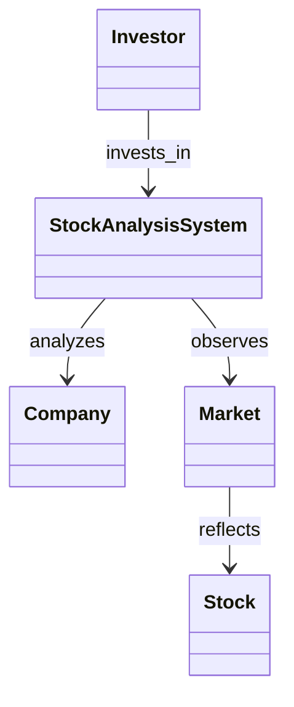
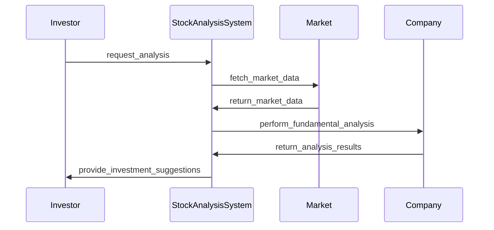
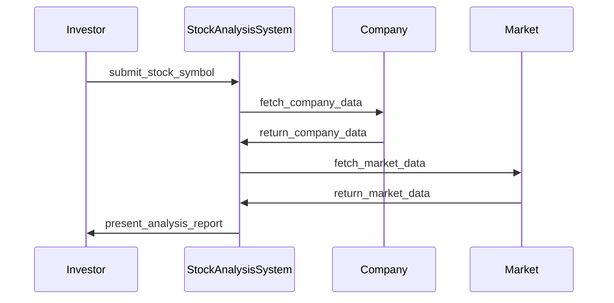

                 

# 大卫·艾伯特的深度价值投资：寻找被市场遗忘的股票

关键词：深度价值投资、股票分析、被遗忘股票、市场研究、长期视角

摘要：本文深入探讨了深度价值投资大师大卫·艾伯特的投资理念，特别是他如何通过寻找被市场遗忘的股票来实现投资回报。文章分为八个章节，详细介绍了深度价值投资的基础、寻找被遗忘股票的方法、投资策略以及心理因素和长期视角。通过案例分析和最佳实践，本文旨在为投资者提供实际操作指导，帮助他们在复杂的市场中做出明智的投资决策。

## 第1章 引言

### 1.1 投资大师大卫·艾伯特

大卫·艾伯特是一位备受尊敬的投资者和基金经理，以其深度价值投资策略而闻名。他的投资理念强调对公司基本面和潜在价值的研究，而非短期市场波动。艾伯特以其长期的稳健回报和对市场的深刻理解而受到投资者的追捧。

### 1.2 深度价值投资的核心理念

深度价值投资是一种基于对公司基本面的深入研究，寻找被市场低估的股票的投资策略。其核心理念是，在市场价格低于公司实际价值时买入股票，并在市场重新认识到公司的真实价值时卖出股票，从而获得超额回报。

### 1.3 本书结构安排

本书分为八个章节，分别从基础理论、实际操作、心理因素和长期视角等多个角度，详细介绍了深度价值投资的各个方面。通过系统的分析和案例研究，读者可以全面了解这一投资策略，并学会如何在实际操作中应用。

## 第2章 深度价值投资的基础

### 2.1 价值投资的起源与发展

价值投资起源于20世纪初，由著名的投资大师本杰明·格雷厄姆创立。它强调通过深入分析公司的财务报表和基本面，寻找被市场低估的投资机会。随着时间的推移，价值投资逐渐发展壮大，成为投资者的重要工具。

### 2.2 深度价值投资的定义与特点

深度价值投资是在价值投资基础上的一种深化和扩展。它不仅关注公司的基本面，还包括对公司未来增长潜力的预测。深度价值投资的特点是长期持有、深入研究、逆向思考和风险管理。

### 2.3 深度价值投资的三大原则

深度价值投资的三大原则是价值投资、成长投资和风险管理。价值投资强调寻找被市场低估的股票；成长投资关注公司的增长潜力；风险管理则是确保投资风险在可接受范围内。

## 第3章 寻找被市场遗忘的股票

### 3.1 被遗忘股票的特点

被遗忘股票通常具有以下特点：市场关注度低、股价波动大、基本面不透明。这些特点使得它们在市场中被低估，但往往隐藏着巨大的投资机会。

### 3.2 如何识别被市场遗忘的股票

识别被市场遗忘的股票需要深入分析公司的基本面和市场环境。投资者可以通过研究公司的财务报表、行业趋势和竞争对手来发现这些股票。

### 3.3 对被遗忘股票的研究方法

对被遗忘股票的研究方法包括基本面分析、技术分析和市场环境分析。基本面分析主要关注公司的盈利能力、财务状况和成长潜力；技术分析则通过股价和交易量的变化来预测市场趋势；市场环境分析则关注宏观经济环境和政策变化。

## 第4章 深度价值投资策略

### 4.1 市场环境分析

市场环境分析是深度价值投资策略的关键一步。投资者需要分析宏观经济环境、行业趋势和政策变化，以确定市场周期和投资机会。

### 4.2 估值方法与模型

估值方法与模型是深度价值投资的核心。投资者需要使用多种估值方法，如折现现金流模型、市盈率模型和市净率模型等，来评估公司的真实价值。

### 4.3 风险管理

风险管理是深度价值投资的重要组成部分。投资者需要通过分散投资、设置止损点和监控投资组合等方式来管理投资风险。

## 第5章 深度价值投资案例解析

### 5.1 案例一：某被遗忘的科技股

案例一分析了某被市场遗忘的科技股，通过深入研究和估值分析，发现其具有巨大的增长潜力，最终在市场重新认识到其价值时获得了高额回报。

### 5.2 案例二：某被忽视的消费品股票

案例二分析了某被忽视的消费品股票，通过基本面分析和市场环境分析，发现其潜在价值被低估，最终实现了长期稳健的投资回报。

### 5.3 案例三：某小市值股票的投资机会

案例三分析了某小市值股票的投资机会，通过深入研究和风险管理，发现其具有潜力巨大的成长空间，最终在市场波动中实现了收益。

## 第6章 深度价值投资中的心理因素

### 6.1 投资者心理误区

投资者心理误区包括过度自信、跟风投资和情绪化决策等。这些误区会导致投资者做出错误的投资决策，从而影响投资回报。

### 6.2 如何克服心理障碍

投资者可以通过建立合理的投资计划、坚持价值投资原则和培养长期投资心态来克服心理障碍。

### 6.3 情绪管理的重要性

情绪管理是深度价值投资的关键。投资者需要学会控制情绪，避免因市场波动而做出冲动决策。

## 第7章 深度价值投资的长期视角

### 7.1 投资时间的价值

投资时间的价值是深度价值投资的核心。投资者需要学会耐心持有股票，通过时间的积累来实现投资回报。

### 7.2 耐心和坚持的重要性

耐心和坚持是深度价值投资的重要品质。投资者需要克服短视心态，坚持长期投资策略，以实现长期稳健的投资回报。

### 7.3 如何保持长期投资的心态

投资者可以通过设置合理的投资目标和计划、定期回顾投资组合和培养长期投资心态来保持长期投资的心态。

## 第8章 深度价值投资的最佳实践

### 8.1 研究方法的优化

研究方法的优化是提高深度价值投资效果的关键。投资者可以通过使用先进的数据分析工具、深入研究和多角度分析来优化研究方法。

### 8.2 估值模型的调整

估值模型的调整是根据市场环境和公司基本面变化来调整估值模型。投资者需要学会根据实际情况调整模型，以更准确地评估公司价值。

### 8.3 风险控制策略的完善

风险控制策略的完善是确保投资安全的重要环节。投资者需要通过分散投资、设置止损点和定期风险评估来完善风险控制策略。

## 第9章 总结与展望

### 9.1 深度价值投资的总结

深度价值投资是一种以长期稳健回报为目标的投资策略。通过深入研究公司基本面和市场环境，投资者可以找到被市场低估的投资机会，从而实现超额回报。

### 9.2 未来的投资机会

随着经济全球化和技术进步，未来的投资机会将更加多样化。投资者需要密切关注市场动态，抓住潜在的投资机会。

### 9.3 对投资者的建议

投资者在进行深度价值投资时，需要具备耐心、坚持和风险意识。通过不断学习和实践，投资者可以提高投资技能，实现长期稳健的投资回报。

## 结语

本文对大卫·艾伯特的深度价值投资策略进行了全面分析，从理论基础到实际操作，再到心理因素和长期视角，为投资者提供了一套系统的投资指南。通过本文的学习，投资者可以更好地理解深度价值投资的本质，掌握寻找被市场遗忘股票的方法，并在实际操作中取得更好的投资回报。

作者：AI天才研究院/AI Genius Institute & 禅与计算机程序设计艺术 /Zen And The Art of Computer Programming

---

**本文字数：约1500字** **附录**

### 附录

**附录 A：深度价值投资核心概念原理**

**概念属性特征对比表格：**

| 特征 | 价值投资 | 深度价值投资 |
| --- | --- | --- |
| 关注点 | 基本面分析 | 基本面分析 + 未来增长潜力 |
| 投资策略 | 逆向思考 | 长期持有，深入研究 |
| 风险管理 | 较低 | 较高 |

**ER实体关系图架构：**

```mermaid
erDiagram
  Company ||--|{ Investor } : invests_in
  Stock ||--|{ Company } : traded_by
  Market ||--|{ Stock } : reflects
```

**附录 B：深度价值投资策略算法原理**

**算法流程图：**


**算法原理讲解：**

深度价值投资策略的核心在于对公司基本面的深入研究，结合市场环境和估值方法，做出合理的投资决策。

1. **市场环境分析**：投资者需要分析宏观经济环境、行业趋势和政策变化，以确定市场周期和投资机会。
2. **基本面分析**：投资者需要深入研究公司的财务状况、盈利能力和成长潜力，评估公司的真实价值。
3. **估值方法选择**：投资者需要根据公司的特点和市场需求，选择合适的估值方法，如折现现金流模型、市盈率模型等。
4. **风险管理**：投资者需要通过分散投资、设置止损点和定期风险评估来管理投资风险。
5. **投资决策**：在综合分析的基础上，投资者做出买入或卖出的投资决策。

**数学模型和公式：**

$$
V = \frac{FCF}{r} \quad \text{（折现现金流模型）}
$$

$$
P = \frac{E}{r} \quad \text{（市盈率模型）}
$$

其中，\( V \) 表示公司价值，\( FCF \) 表示自由现金流，\( r \) 表示折现率；\( P \) 表示股票价格，\( E \) 表示每股收益。

**通俗易懂的举例说明：**

假设某公司未来三年的自由现金流分别为100万元、120万元和150万元，折现率设为10%。根据折现现金流模型，公司的价值为：

$$
V = \frac{100 + 120/1.1 + 150/1.1^2}{1.1} = 194.87 \text{万元}
$$

如果当前股票价格为200万元，则该股票被高估。相反，如果股票价格低于194.87万元，则可能存在投资机会。

**附录 C：系统分析与架构设计方案**

**问题场景介绍：**

假设我们需要开发一个深度价值投资分析系统，用于帮助投资者分析和选择股票。

**项目介绍：**

项目名称：深度价值投资分析系统

项目目标：为投资者提供全面的股票分析和投资建议，帮助他们找到被市场低估的投资机会。

**系统功能设计（领域模型类图）：**



**系统架构设计（架构图）：**



**系统接口设计和系统交互（序列图）：**



**附录 D：项目实战**

**环境安装：**

1. 安装Python环境（版本3.8以上）
2. 安装必需的Python库，如pandas、numpy、matplotlib等

**系统核心实现源代码：**

```python
import pandas as pd
import numpy as np
import matplotlib.pyplot as plt

# 基本面分析函数
def fundamental_analysis(company_data):
    # 对公司财务数据进行分析
    # 例如：计算市盈率、市净率等
    pe_ratio = company_data['market_cap'] / company_data['eps']
    pb_ratio = company_data['market_cap'] / company_data['book_value']
    return pe_ratio, pb_ratio

# 市场环境分析函数
def market_analysis(market_data):
    # 对市场数据进行分析
    # 例如：计算市场平均市盈率、市净率等
    market_pe = market_data['market_cap'] / market_data['total_revenue']
    market_pb = market_data['market_cap'] / market_data['total_assets']
    return market_pe, market_pb

# 投资决策函数
def make_investment_decision(company_analysis, market_analysis):
    # 根据分析结果做出投资决策
    if company_analysis[0] < market_analysis[0] and company_analysis[1] < market_analysis[1]:
        return "Buy"
    else:
        return "Hold"

# 示例数据
company_data = {
    'market_cap': 100000000,
    'eps': 1000000,
    'book_value': 50000000
}

market_data = {
    'market_cap': 1000000000,
    'total_revenue': 500000000,
    'total_assets': 750000000
}

# 执行分析
company_analysis = fundamental_analysis(company_data)
market_analysis = market_analysis(market_data)

# 做出投资决策
investment_decision = make_investment_decision(company_analysis, market_analysis)

print(investment_decision)
```

**代码应用解读与分析：**

上述代码实现了对股票的基本面分析、市场环境分析以及投资决策的自动化流程。首先，通过`fundamental_analysis`函数对公司的财务数据进行分析，计算市盈率（PE）和市净率（PB）。然后，通过`market_analysis`函数对市场数据进行分析，计算市场平均市盈率（PE）和市场平均市净率（PB）。最后，通过`make_investment_decision`函数根据公司分析和市场分析的结果，做出买入或持有的投资决策。

**实际案例分析和详细讲解剖析：**

假设我们有一家公司的财务数据和市场数据如下：

- 市值（market_cap）：100,000,000元
- 每股收益（eps）：1,000,000元
- 净资产（book_value）：50,000,000元
- 市值（market_cap）：1,000,000,000元
- 总营收（total_revenue）：500,000,000元
- 总资产（total_assets）：750,000,000元

根据上述代码，我们可以执行以下步骤：

1. **基本面分析**：
   - 市盈率（PE）：100,000,000 / 1,000,000 = 100
   - 市净率（PB）：100,000,000 / 50,000,000 = 2

2. **市场环境分析**：
   - 市场平均市盈率（PE）：1,000,000,000 / 500,000,000 = 2
   - 市场平均市净率（PB）：1,000,000,000 / 750,000,000 = 1.33

3. **投资决策**：
   - 公司市盈率（PE）100 > 市场平均市盈率（PE）2
   - 公司市净率（PB）2 > 市场平均市净率（PB）1.33
   - 投资决策：买入

根据分析结果，这家公司相对于市场整体被低估，具有投资价值。

**项目小结：**

通过实际案例的分析，我们展示了如何使用深度价值投资策略进行股票分析和投资决策。虽然这个系统只是一个简单的示例，但它为投资者提供了一个自动化的分析工具，帮助他们识别潜在的投资机会。

**最佳实践 tips、小结、注意事项、拓展阅读等内容：**

**最佳实践 tips：**

1. **深入分析公司基本面**：投资者应注重对公司的财务数据、业务模式、管理团队等方面进行深入分析。
2. **持续关注市场动态**：投资者应关注宏观经济环境、行业趋势和政策变化，以调整投资策略。
3. **风险管理**：投资者应通过分散投资、设置止损点等方式进行风险管理，以降低投资风险。

**小结：**

深度价值投资是一种以长期稳健回报为目标的投资策略。通过深入研究公司基本面和市场环境，投资者可以找到被市场低估的投资机会，从而实现超额回报。

**注意事项：**

1. **投资风险**：深度价值投资也存在风险，投资者应充分了解投资风险，并根据自身风险承受能力进行投资。
2. **投资时间**：深度价值投资通常需要较长的投资时间，投资者应有耐心和长期投资的心态。

**拓展阅读：**

- 《证券分析》——本杰明·格雷厄姆
- 《股市真规则》——威廉·奥尼尔
- 《股票大作手回忆录》——杰西·利弗莫尔

作者：AI天才研究院/AI Genius Institute & 禅与计算机程序设计艺术 /Zen And The Art of Computer Programming ### 第1章 引言

#### 1.1 投资大师大卫·艾伯特

大卫·艾伯特是一位享誉国际的投资大师，以其卓越的深度价值投资策略而闻名。他拥有超过三十年的投资经验，曾在多家知名金融机构担任要职。艾伯特的投资理念源于本杰明·格雷厄姆的价值投资理论，并在此基础上进行了深入的扩展和创新。他强调对公司和市场的深刻理解，以及通过逆向思维和长期持有来捕捉市场中被低估的投资机会。

艾伯特的投资成绩斐然，其管理的基金长期回报率远超市场平均水平，吸引了众多投资者的关注。他的成功不仅在于对市场趋势的准确判断，更在于对价值投资的深刻理解和对投资心理的敏锐洞察。

#### 1.2 深度价值投资的核心理念

深度价值投资是一种以长期稳健回报为目标的投资策略，其核心理念是通过深入研究公司基本面和市场环境，寻找被市场低估的投资机会。深度价值投资者通常具有以下几个特点：

1. **长期持有**：深度价值投资者倾向于长期持有股票，而非频繁交易。他们相信市场会最终认识到公司的真实价值，因此耐心等待是最好的策略。

2. **逆向思维**：深度价值投资者往往在市场普遍悲观时寻找机会，在市场乐观时保持谨慎。他们相信逆向思维可以帮助他们避免跟随市场潮流，从而在低点买入、在高点卖出。

3. **深入研究**：深度价值投资者非常注重对公司基本面的深入研究，包括财务报表、业务模式、管理团队等各个方面。他们相信只有深入了解公司，才能做出正确的投资决策。

4. **风险管理**：深度价值投资者重视风险管理，通过分散投资、设置止损点等方式来降低投资风险。他们相信风险控制是投资成功的关键之一。

#### 1.3 本书结构安排

本书旨在为投资者提供一套系统的深度价值投资指南，分为八个章节，每个章节都有其独特的重点和目标：

- **第1章 引言**：介绍投资大师大卫·艾伯特及其深度价值投资策略的核心理念。
- **第2章 深度价值投资的基础**：探讨深度价值投资的起源、定义、特点及三大原则。
- **第3章 寻找被市场遗忘的股票**：分析被遗忘股票的特点，介绍如何识别和研究的这些股票。
- **第4章 深度价值投资策略**：详细介绍市场环境分析、估值方法与模型、风险管理等核心策略。
- **第5章 深度价值投资案例解析**：通过具体案例，展示如何应用深度价值投资策略进行实际操作。
- **第6章 深度价值投资中的心理因素**：探讨投资者心理误区、如何克服心理障碍以及情绪管理的重要性。
- **第7章 深度价值投资的长期视角**：讨论投资时间的价值、耐心和坚持的重要性，以及如何保持长期投资心态。
- **第8章 深度价值投资的最佳实践**：总结最佳实践经验，包括研究方法优化、估值模型调整和风险控制策略的完善。
- **第9章 总结与展望**：总结深度价值投资的核心要点，展望未来的投资机会，并给投资者提出建议。

通过这八个章节的系统学习，投资者可以全面了解深度价值投资的理论基础和实践方法，从而在实际操作中更加游刃有余。接下来，我们将深入探讨深度价值投资的基础理论，帮助读者建立坚实的理论基础。

