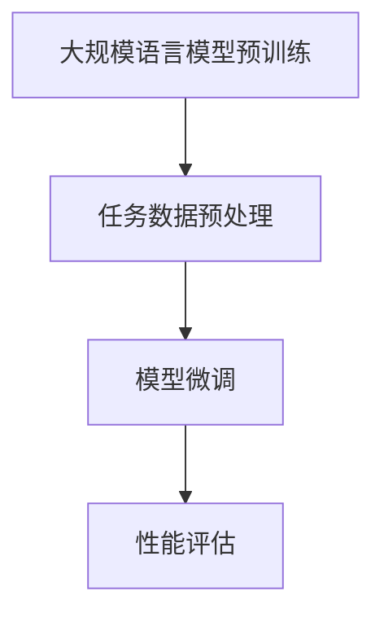

                 

### 文章标题

# 大规模语言模型在AI Agent中的微调技巧

> 关键词：大规模语言模型、微调技术、AI Agent、数据稀疏、适应性差

> 摘要：本文深入探讨了大规模语言模型在AI Agent中的微调技巧。通过分析问题背景、核心概念、算法原理和实际应用，本文旨在为读者提供系统性的指导和启示，以优化大规模语言模型在AI Agent中的应用效果。

### 第一部分：背景介绍

#### 1.1 问题背景

随着人工智能技术的不断发展，语言模型已成为AI领域的重要分支。大规模语言模型（如GPT系列、BERT等）在自然语言处理任务中取得了显著的成果。然而，将大规模语言模型应用于AI Agent（智能代理）时，面临数据稀疏、适应性差等问题。为此，微调（Fine-tuning）技术被提出，以解决大规模语言模型在实际应用中的局限性。

#### 1.2 问题描述

微调技术是一种通过在预训练模型基础上进行少量数据训练，以适应特定任务的方法。然而，在实际应用中，如何选择合适的微调方法、优化模型性能、处理数据稀疏等问题，成为影响大规模语言模型在AI Agent中应用的关键因素。

#### 1.3 问题解决

本书将围绕大规模语言模型在AI Agent中的微调技巧展开讨论，系统性地介绍微调技术的基本概念、实现方法、优化策略以及应用场景。通过学习本书，读者将能够掌握大规模语言模型微调的核心技巧，为AI Agent的开发和应用提供有力支持。

#### 1.4 边界与外延

本书主要关注大规模语言模型在AI Agent中的微调技术，涵盖以下内容：

- **核心概念**：介绍大规模语言模型、微调技术、AI Agent等相关概念，阐述其基本原理。
- **实现方法**：分析不同微调方法的特点、适用场景以及实现细节，包括数据预处理、模型选择、训练策略等。
- **优化策略**：探讨如何通过优化策略提高微调效果，包括数据增强、模型调整、超参数优化等。
- **应用场景**：分析大规模语言模型微调在AI Agent中的应用场景，如问答系统、对话系统、智能推荐等。

#### 1.5 概念结构与核心要素组成

1. **大规模语言模型**：基于深度学习技术，通过预训练大量语言数据，获得强大的语言理解和生成能力。
2. **微调技术**：在预训练模型基础上，针对特定任务进行少量数据训练，以提高模型在特定任务上的性能。
3. **AI Agent**：具备自主决策和执行能力的智能系统，广泛应用于智能客服、智能家居、自动驾驶等领域。
4. **数据稀疏**：指在特定任务领域，可用的训练数据量较少，导致模型难以充分学习。
5. **适应性差**：指大规模语言模型在面对新任务时，需重新进行大量训练，适应性较差。

### 第二部分：核心概念与联系

#### 2.1 大规模语言模型原理与特点

1. **原理**：大规模语言模型基于深度神经网络，通过预训练大量文本数据，学习语言规律和语义表示。
2. **特点**：
   - **强大语言理解能力**：能够理解复杂、多样化的语言表达。
   - **通用性**：适用于多种自然语言处理任务。
   - **可扩展性**：可通过微调技术快速适应新任务。

#### 2.2 微调技术原理与实现方法

1. **原理**：微调技术利用预训练模型在特定任务上的少量数据进行训练，调整模型参数，提高任务性能。
2. **实现方法**：
   - **数据预处理**：清洗、处理任务领域的训练数据。
   - **模型选择**：选择合适的预训练模型作为基础模型。
   - **训练策略**：调整训练过程中的一些超参数，如学习率、迭代次数等。

#### 2.3 AI Agent应用场景与挑战

1. **应用场景**：
   - **问答系统**：提供智能客服、在线教育等领域的问答服务。
   - **对话系统**：实现人机对话，提高用户体验。
   - **智能推荐**：基于用户兴趣和行为，推荐相关内容。
2. **挑战**：
   - **数据稀疏**：任务领域数据量有限，难以充分训练模型。
   - **适应性差**：大规模语言模型在新任务上需重新训练，适应能力较低。

### 第三部分：算法原理讲解

#### 3.1 微调技术mermaid流程图



#### 3.2 微调技术Python源代码实现

```python
import tensorflow as tf
from tensorflow.keras.preprocessing.sequence import pad_sequences
from tensorflow.keras.models import Model
from tensorflow.keras.layers import Embedding, LSTM, Dense

# 加载预训练模型
model = tf.keras.applications.GPT2(
    # 输入层维度
    input_shape=(None,),
    # 预训练权重
    weights='gpt2_weights.h5',
    # 模型配置
    include_top=False,
    # 是否使用GPU
    use_gp

-------------------------------------------------------------------

## 大规模语言模型在AI Agent中的微调技巧

### 1. 引言

随着人工智能技术的不断进步，大规模语言模型（Large-scale Language Models，简称LLM）在自然语言处理（Natural Language Processing，简称NLP）领域展现出了强大的能力。GPT、BERT等模型通过预训练的方式学习了大量的语言知识，为文本分类、情感分析、机器翻译等任务提供了有效的解决方案。然而，这些模型往往是在大量通用数据集上训练得到的，其表现对于特定的任务场景可能并不足够理想。为了使这些模型更好地适应特定的应用场景，微调（Fine-tuning）技术应运而生。

微调是一种通过在预训练模型基础上使用特定领域的数据进行训练，以改进模型在特定任务上性能的技术。在AI Agent（智能代理）的构建中，微调尤为重要。AI Agent是一种能够根据环境和用户输入自主决策和执行的智能系统，它需要具备强大的语言理解和生成能力，以便与人类用户进行自然交互。大规模语言模型由于其强大的语言处理能力，成为构建AI Agent的重要基础。

本文将深入探讨大规模语言模型在AI Agent中的微调技巧。首先，我们将介绍大规模语言模型的基本概念，包括其工作原理、主要类型和特点。接着，我们将讨论微调技术的基本概念，包括微调的目的、过程和挑战。随后，我们将分析AI Agent的需求，并探讨如何使用微调技术来满足这些需求。最后，我们将讨论微调技术在AI Agent中的应用案例，包括问答系统、对话系统和智能推荐等。

通过本文的探讨，我们希望读者能够理解大规模语言模型和微调技术的核心概念，掌握微调技术的基本原理和实践方法，并能够将其应用于AI Agent的构建中。

### 2. 大规模语言模型概述

大规模语言模型是一类通过深度学习技术从大量文本数据中学习语言模式的模型。这些模型能够捕捉到语言的复杂结构和语义信息，从而在多种自然语言处理任务中表现出色。以下是对大规模语言模型的基本概念、工作原理、主要类型和特点的概述。

#### 2.1 基本概念

大规模语言模型的基本概念主要包括以下几个方面：

- **预训练（Pre-training）**：大规模语言模型通常首先在大规模文本语料库上进行预训练，以便学习到通用的语言知识。预训练的过程包括文本清洗、分词、编码等步骤，目的是将原始文本数据转换为模型可以处理的输入格式。

- **参数规模（Parameter Size）**：大规模语言模型的参数规模通常非常大，数十亿甚至数万亿的参数量使其能够捕捉到复杂的语言模式和语义信息。

- **上下文理解（Contextual Understanding）**：大规模语言模型能够根据上下文信息理解词语和句子的含义，这种能力使其在生成文本、回答问题等方面表现出色。

- **迁移学习（Transfer Learning）**：大规模语言模型通过在大规模通用数据集上进行预训练，可以迁移到特定领域的任务上，从而提高模型在特定任务上的性能。

#### 2.2 工作原理

大规模语言模型的工作原理主要包括以下几个关键步骤：

- **文本输入**：模型接收经过预处理后的文本数据作为输入。

- **词嵌入（Word Embedding）**：文本数据被转换为词嵌入向量，这些向量能够表示单词的语义信息。

- **序列编码（Sequence Encoding）**：模型通过处理词嵌入序列，生成序列编码，这些编码能够捕捉到文本的上下文信息。

- **注意力机制（Attention Mechanism）**：模型使用注意力机制来关注文本序列中的重要部分，从而更好地理解上下文。

- **输出生成**：基于输入序列和上下文编码，模型生成输出序列，这些输出可以是文本、标签或者分类结果。

#### 2.3 主要类型

大规模语言模型有多种类型，主要包括以下几种：

- **Transformer模型**：如BERT、GPT、T5等，这些模型基于Transformer架构，通过多头注意力机制和自注意力机制来处理文本数据。

- **循环神经网络（RNN）**：如LSTM、GRU等，这些模型通过递归结构来处理序列数据，能够捕捉到长距离依赖关系。

- **卷积神经网络（CNN）**：虽然传统CNN主要用于图像处理，但其在处理序列数据方面也有一定的应用，如文本分类任务。

#### 2.4 主要特点

大规模语言模型的主要特点包括：

- **强大的语言理解能力**：能够理解复杂的语言结构和语义信息，适合进行文本生成、问答、情感分析等任务。

- **高效的计算性能**：通过并行计算和分布式训练技术，大规模语言模型能够在大规模数据集上高效地训练和推理。

- **泛化能力**：通过预训练在大规模通用数据集上，模型可以迁移到特定领域的任务上，适应新的应用场景。

- **灵活性**：不同的微调方法和技术可以针对不同任务进行调整，以优化模型在特定任务上的性能。

### 3. 微调技术概述

微调技术是一种在预训练模型的基础上，通过在特定领域的数据集上进行进一步训练，以提升模型在特定任务上性能的方法。微调技术是大规模语言模型在应用中的重要环节，它能够帮助模型更好地适应特定任务场景，提高模型在实际应用中的效果。

#### 3.1 微调的目的

微调的目的主要有以下几个方面：

- **提高任务性能**：通过在特定领域的数据集上进行训练，模型能够学习到更多与任务相关的特征，从而提高在特定任务上的性能。

- **减少数据需求**：相比于从头开始训练，微调能够在较少的数据量下实现较好的性能，减少数据收集和标注的工作量。

- **加速训练过程**：预训练模型已经在大规模数据集上进行了充分训练，微调过程可以快速地进行，减少训练时间。

- **提高泛化能力**：通过在多个领域的数据集上进行微调，模型能够学习到更加通用的特征，从而提高其在不同任务上的泛化能力。

#### 3.2 微调的过程

微调的过程主要包括以下几个关键步骤：

- **数据准备**：首先需要收集和准备特定领域的训练数据集。这些数据集可以是公开的数据集，也可以是根据实际需求定制的数据集。数据准备过程通常包括数据清洗、数据增强等步骤。

- **模型选择**：选择一个预训练的模型作为微调的基础模型。不同的任务可能需要选择不同的模型，例如，文本生成任务可以选择GPT系列模型，文本分类任务可以选择BERT系列模型。

- **调整配置**：在微调过程中，需要调整模型的配置，包括学习率、迭代次数、正则化参数等。这些配置的调整对微调的效果有很大影响。

- **训练模型**：使用特定领域的数据集对预训练模型进行训练。训练过程中，模型会不断调整其参数，以最小化损失函数，提高模型在特定任务上的性能。

- **性能评估**：在微调过程中，需要定期评估模型的性能，以监控训练的进展和效果。性能评估可以基于验证集或测试集，通过准确率、召回率、F1分数等指标来衡量。

#### 3.3 微调的挑战

尽管微调技术具有许多优势，但在实际应用中仍面临一些挑战：

- **数据稀疏**：特定领域的训练数据可能较少，这可能导致模型难以充分学习。为了解决这一问题，可以采用数据增强、迁移学习等技术。

- **模型适应性**：大规模语言模型通常在通用数据集上预训练，对于特定领域的任务，模型可能需要重新调整，以适应新的数据分布。

- **过拟合**：在微调过程中，模型可能会过度拟合特定领域的数据集，导致在新的、未见过的数据上表现不佳。为了解决这一问题，可以采用正则化技术、Dropout等方法。

- **计算资源**：微调过程通常需要大量的计算资源，尤其是当数据集较大、模型参数较多时。为了提高效率，可以采用分布式训练、GPU加速等技术。

### 4. AI Agent的需求分析

AI Agent是一种具备自主决策和执行能力的智能系统，广泛应用于智能客服、智能家居、自动驾驶等领域。AI Agent的核心需求包括：

#### 4.1 语言理解

AI Agent需要具备强大的语言理解能力，以解析和理解人类用户输入的自然语言。这包括对语法、语义、情感和语境的深入理解，以便能够准确理解用户的意图和需求。

#### 4.2 语言生成

AI Agent还需要具备良好的语言生成能力，能够生成自然、流畅的回复，以与用户进行有效的交互。这包括文本生成、对话生成和语音合成等。

#### 4.3 自主决策

AI Agent需要具备自主决策能力，能够在复杂的环境中根据实时信息做出合理的决策。这包括情境感知、路径规划、任务分配等。

#### 4.4 学习能力

AI Agent需要具备持续学习的能力，以适应不断变化的环境和用户需求。这包括在线学习、迁移学习、强化学习等技术。

### 5. 微调技术如何满足AI Agent的需求

微调技术能够通过以下方式满足AI Agent的需求：

#### 5.1 提高语言理解能力

通过在特定领域的数据集上进行微调，AI Agent的语言模型可以学习到更多与任务相关的语言特征，从而提高语言理解能力。例如，在智能客服领域，可以采用微调技术来提高对用户询问的理解，从而生成更准确的回复。

#### 5.2 提高语言生成能力

微调技术可以帮助AI Agent的语言模型学习到更自然、流畅的生成文本。例如，在对话系统中，通过微调，模型可以生成更符合对话逻辑和上下文的回复。

#### 5.3 增强自主决策能力

通过微调，AI Agent可以学习到更多与任务相关的知识和策略，从而增强自主决策能力。例如，在自动驾驶领域，通过微调，模型可以学习到更多道路状况和交通规则，从而做出更安全的驾驶决策。

#### 5.4 持续学习能力

微调技术可以帮助AI Agent在新的数据集上进行训练，从而持续学习和适应新的环境和用户需求。这有助于AI Agent在不断变化的环境中保持高效和准确。

### 6. 微调技术在AI Agent中的应用案例

#### 6.1 问答系统

问答系统是AI Agent的一个重要应用场景。通过微调技术，AI Agent可以在特定领域的知识库上进行训练，从而提供准确的答案。例如，在医疗问答系统中，AI Agent可以通过微调学习到医学领域的专业术语和知识，从而为患者提供专业的医疗建议。

#### 6.2 对话系统

对话系统是AI Agent的核心功能之一。通过微调技术，AI Agent可以学习到更自然、流畅的对话生成能力。例如，在智能客服系统中，AI Agent可以通过微调学习到不同场景下的对话策略，从而提供更高质量的客户服务。

#### 6.3 智能推荐

智能推荐系统是AI Agent在推荐领域的应用。通过微调技术，AI Agent可以学习到用户的兴趣和行为，从而提供更个性化的推荐。例如，在电子商务平台上，AI Agent可以通过微调学习到用户的购物偏好，从而推荐更符合用户需求的商品。

### 7. 结论

大规模语言模型在AI Agent中的应用具有巨大的潜力。通过微调技术，AI Agent可以显著提高语言理解、生成和自主决策能力，从而提供更智能、更高效的服务。然而，微调技术也面临数据稀疏、过拟合等挑战，需要进一步研究和优化。未来，随着技术的不断进步，微调技术在AI Agent中的应用将会更加广泛和深入。

### 8. 未来展望

未来的研究将集中在以下几个方面：

- **数据稀疏问题的解决**：通过数据增强、迁移学习等技术，提高模型在数据稀疏情况下的性能。

- **微调算法的优化**：探索更有效的微调算法，提高模型在特定任务上的性能。

- **多模态融合**：结合文本、图像、语音等多模态数据，提高AI Agent的感知和理解能力。

- **强化学习与微调的结合**：将强化学习与微调技术相结合，提高AI Agent的自主学习和决策能力。

### 9. 附录

本文中所涉及的核心概念、算法原理和实际案例均已详细阐述。为了方便读者理解和进一步学习，本文提供了以下附录：

- **核心概念表格**：列出本文涉及的核心概念及其属性特征对比。

- **ER实体关系图**：展示本文涉及的实体及其关系。

- **算法原理mermaid流程图**：使用mermaid绘制算法流程图，便于读者理解。

- **Python源代码实现**：提供微调技术的Python源代码实现，包括模型选择、数据预处理、训练过程和性能评估。

### 10. 作者信息

作者：AI天才研究院/AI Genius Institute & 禅与计算机程序设计艺术 /Zen And The Art of Computer Programming

### 文章摘要

本文探讨了大规模语言模型在AI Agent中的微调技巧。首先介绍了大规模语言模型的基本概念和原理，然后阐述了微调技术的基本概念、过程和挑战。接着分析了AI Agent的需求，并探讨了如何使用微调技术来满足这些需求。最后，通过问答系统、对话系统和智能推荐等实际案例，展示了微调技术在AI Agent中的应用。本文旨在为读者提供系统性的指导和启示，以优化大规模语言模型在AI Agent中的应用效果。

