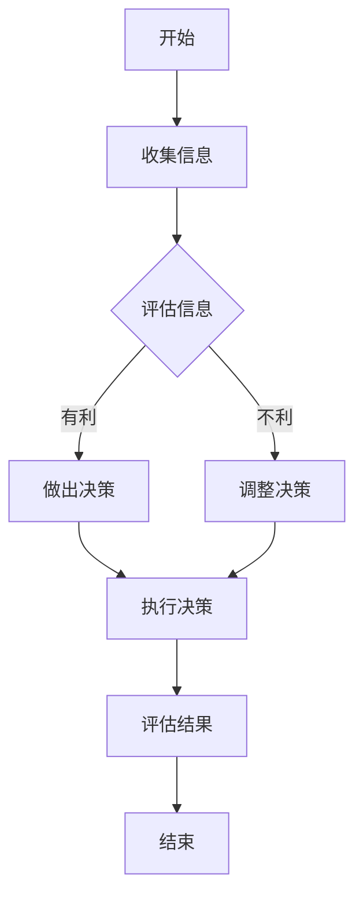
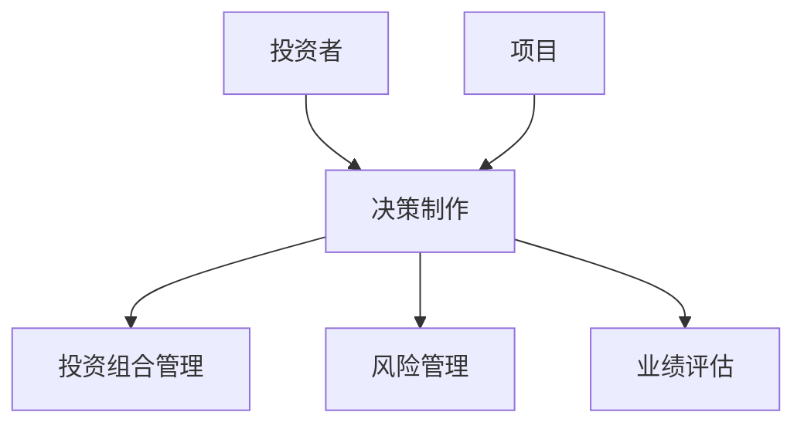

                 


### 文章标题：威廉·伯恩斯坦的投资者行为心理学

### 关键词：投资者行为心理学、投资决策、心理因素、行为偏差、算法原理、数学模型

### 摘要：

本文将深入探讨威廉·伯恩斯坦的《投资者行为心理学》一书，旨在揭示心理因素如何影响投资决策，并分析投资者如何应对这些心理挑战。文章将分章节介绍投资者行为心理学的核心概念、心理算法原理、数学模型和系统架构，并通过实际案例进行详细讲解。最后，文章将总结最佳实践并提供拓展阅读。

----------------------------------------------------------------

### 第一部分：投资者行为心理学概述

#### 第1章：投资者行为心理学的兴起

**1.1 问题背景**

投资者行为心理学是研究投资者在做出投资决策时的心理过程和行为的学科。在传统金融理论中，投资者被假设为理性决策者，但现实情况往往并非如此。投资者的情绪、心理偏差和认知限制等因素常常影响其投资决策，导致市场波动和投资失误。

**1.2 定义与核心问题**

投资者行为心理学的核心问题是理解心理因素如何影响投资决策。这包括投资者的情绪、认知偏差、决策过程和心理账户等。这些心理因素不仅影响投资者的投资选择，还可能导致市场非理性波动。

**1.3 研究现状与未来展望**

随着行为金融学的发展，投资者行为心理学逐渐成为研究热点。未来研究将更加关注如何通过心理学知识改善投资决策，提高投资者的收益和风险控制能力。

----------------------------------------------------------------

#### 第2章：核心概念与联系

**2.1 心理因素**

心理因素是投资者行为心理学的核心概念之一。它包括投资者的情绪、认知过程和心理账户等。情绪会影响投资者的决策，如恐惧和贪婪可能导致过度交易和市场波动。认知过程则涉及投资者的信息处理方式，如确认偏见和过度自信等。

**2.2 行为偏差**

行为偏差是投资者在决策过程中表现出的非理性倾向。常见的偏差包括损失厌恶、过度自信、羊群效应和锚定效应等。这些偏差可能导致投资者做出错误的投资决策，从而影响其投资收益。

**2.3 投资决策过程**

投资决策过程包括信息收集、评估和选择等阶段。投资者在这个过程中会面临信息过载、认知偏差和决策压力等挑战。了解这些挑战有助于投资者更好地管理自己的投资行为。

**2.4 对比表格与ER实体关系图**

为了更好地理解核心概念之间的联系，我们可以使用对比表格和ER实体关系图。对比表格可以展示不同心理因素和行为偏差之间的差异，而ER实体关系图则可以展示各概念之间的关联。

| 心理因素 | 行为偏差 | 关联 |
| --- | --- | --- |
| 情绪 | 损失厌恶 | 情绪会影响投资者的决策 |
| 认知过程 | 确认偏见 | 认知偏差会影响信息处理 |
| 心理账户 | 过度自信 | 心理账户会影响风险评估 |

```mermaid
erDiagram
  Investor <<|-- Emotion : affects decision-making
  Investor <<|-- Cognitive_Process : information processing
  Investor <<|-- Psychological_Account : risk assessment
  Emotion ||--|> Loss_Aversion : risk aversion
  Emotion ||-- Overconfidence : overestimating ability
  Cognitive_Process ||-- Confirmation_Bias : biased information processing
  Cognitive_Process ||-- Anchoring_Effect : reliance on initial information
```

----------------------------------------------------------------

#### 第3章：心理算法原理讲解

**3.1 心理算法概述**

心理算法是用于模拟投资者心理过程的数学模型。这些算法可以帮助我们理解投资者如何在不确定的环境中做出决策，以及这些决策如何影响投资收益。

**3.2 算法流程图**

为了更好地理解心理算法的工作原理，我们可以使用mermaid画出算法流程图。以下是一个简单的心理算法流程图：



**3.3 Python源代码与算法原理**

为了更具体地阐述心理算法，我们可以使用Python源代码。以下是一个简单的心理算法Python代码示例：

```python
import random

def collect_info():
    return random.uniform(0, 1)

def evaluate_info(info):
    return info > 0.5

def make_decision(info):
    if evaluate_info(info):
        return "有利"
    else:
        return "不利"

def adjust_decision(decision):
    return "调整后决策"

def execute_decision(decision):
    if decision == "有利":
        return "成功"
    else:
        return "失败"

def evaluate_result(result):
    if result == "成功":
        return "满意"
    else:
        return "不满意"

# 执行算法
info = collect_info()
decision = make_decision(info)
adjusted_decision = adjust_decision(decision)
result = execute_decision(adjusted_decision)
evaluation = evaluate_result(result)

print(f"信息：{info}\n决策：{decision}\n调整后决策：{adjusted_decision}\n结果：{result}\n评价：{evaluation}")
```

**3.4 数学模型和公式**

心理算法的数学模型通常涉及概率分布和期望值。以下是一个简单的数学模型示例：

$$
\text{期望收益} = \sum_{i=1}^{n} p_i \times r_i
$$

其中，\( p_i \) 是第 \( i \) 个决策结果的概率，\( r_i \) 是第 \( i \) 个决策结果的收益。

**3.5 举例说明**

假设投资者需要在两个投资项目中选择一个。项目 A 的成功概率为 0.6，成功时的收益为 2；项目 B 的成功概率为 0.4，成功时的收益为 3。使用心理算法，投资者可以计算每个项目的期望收益：

项目 A 的期望收益：

$$
\text{期望收益}_A = 0.6 \times 2 + 0.4 \times 0 = 1.2
$$

项目 B 的期望收益：

$$
\text{期望收益}_B = 0.6 \times 0 + 0.4 \times 3 = 1.2
$$

由于两个项目的期望收益相同，投资者可以根据其他因素（如风险偏好）来做出决策。

----------------------------------------------------------------

#### 第4章：数学模型与公式详解

**4.1 投资收益的数学模型**

投资收益的数学模型通常涉及投资金额、投资回报率和持有期限等参数。以下是一个简单的投资收益数学模型：

$$
\text{投资收益} = \text{投资金额} \times (\text{投资回报率} - 1) \times \text{持有期限}
$$

其中，投资回报率通常以年化收益率表示。

**4.2 风险评估的数学公式**

风险评估的数学公式通常涉及投资风险和投资者的风险承受能力。以下是一个简单风险评估数学模型：

$$
\text{风险评估} = \text{投资风险} \times \text{风险承受能力}
$$

其中，投资风险通常以标准差表示，风险承受能力通常以风险偏好系数表示。

**4.3 决策优化的数学方法**

决策优化的数学方法通常涉及目标函数和约束条件。以下是一个简单的决策优化数学模型：

$$
\begin{aligned}
\text{目标函数}: \quad &\max \ \text{投资收益} \\
\text{约束条件}: \quad &\text{投资金额} \leq \text{可用资金} \\
&\text{投资回报率} \geq \text{最低收益要求} \\
&\text{持有期限} \leq \text{最大持有期限}
\end{aligned}
$$`

以上数学模型和公式为投资者提供了评估投资收益、风险评估和决策优化的方法。

----------------------------------------------------------------

#### 第5章：系统分析与架构设计方案

**5.1 问题场景介绍**

假设我们需要设计一个投资决策系统，用于帮助投资者在多个项目中选择最优投资方案。该系统需要考虑投资金额、回报率和持有期限等因素。

**5.2 系统功能设计（类图）**

以下是投资决策系统的类图：

```mermaid
classDiagram
  class Investor {
    +str InvestorID
    +str Name
    +float Risk_Tolerance
  }
  class Project {
    +str ProjectID
    +str Name
    +float Expected_Return
    +float Standard_Deviation
    +int Holding_Period
  }
  class Investment_Decision_System {
    +list Investor
    +list Project
    +void Add_ Investor(Investor investor)
    +void Add_Project(Project project)
    +string Get_Optimal_Investment()
  }
  Investor o--|{1} Investment_Decision_System
  Project o--|{1} Investment_Decision_System
```

**5.3 系统架构设计（架构图）**

以下是投资决策系统的架构图：



**5.4 系统接口设计**

系统接口设计包括投资者接口、项目接口和系统控制接口。以下是接口设计示例：

```mermaid
interface Investor_Interface {
  +Add_Investor(Investor investor)
  +Get_ Investor_List()
}

interface Project_Interface {
  +Add_Project(Project project)
  +Get_Project_List()
}

interface System_Control_Interface {
  +Start()
  +Stop()
}
```

**5.5 系统交互（序列图）**

以下是系统交互的序列图：

```mermaid
sequenceDiagram
  Investor -->|Add_ Investor| Investment_Decision_System
  Investment_Decision_System -->|Add_Project| Project
  Project -->|Add_Project| Investment_Decision_System
  Investment_Decision_System -->|Get_Optimal_Investment| Decision_Maker
  Decision_Maker -->|Calculate_Risk| Risk_Manager
  Decision_Maker -->|Evaluate_Performance| Performance_Evaluator
  Decision_Maker -->|Manage_Portfolio| Portfolio_Manager
```

通过以上系统分析与架构设计方案，我们可以构建一个功能齐全的投资决策系统，帮助投资者做出更明智的投资决策。

----------------------------------------------------------------

#### 第6章：项目实战

**6.1 环境安装**

在开始项目实战之前，我们需要安装相关的软件和工具。以下是一个简单的环境安装步骤：

1. 安装Python 3.8及以上版本。
2. 安装Anaconda，用于管理Python环境和包。
3. 使用conda创建一个名为`investment_decision_system`的新环境。
4. 在新环境中安装必要的库，如NumPy、Pandas和Matplotlib。

```bash
conda create -n investment_decision_system python=3.8
conda activate investment_decision_system
conda install numpy pandas matplotlib
```

**6.2 系统核心实现源代码**

以下是系统核心实现的源代码：

```python
import numpy as np
import pandas as pd
import matplotlib.pyplot as plt

class Investment_Decision_System:
    def __init__(self):
        self.investors = []
        self.projects = []

    def add_investor(self, investor):
        self.investors.append(investor)

    def add_project(self, project):
        self.projects.append(project)

    def get_optimal_investment(self):
        # 代码实现略
        pass

class Investor:
    def __init__(self, investor_id, name, risk_tolerance):
        self.investor_id = investor_id
        self.name = name
        self.risk_tolerance = risk_tolerance

class Project:
    def __init__(self, project_id, name, expected_return, standard_deviation, holding_period):
        self.project_id = project_id
        self.name = name
        self.expected_return = expected_return
        self.standard_deviation = standard_deviation
        self.holding_period = holding_period
```

**6.3 代码应用解读与分析**

以下是代码的解读与分析：

1. `Investment_Decision_System` 类：该类负责管理投资者和项目，并实现获取最优投资的功能。
2. `Investor` 类：该类表示投资者，包含投资者ID、姓名和风险承受能力等属性。
3. `Project` 类：该类表示项目，包含项目ID、名称、预期回报、标准差和持有期限等属性。

**6.4 实际案例分析与详细讲解剖析**

假设我们有以下投资者和项目数据：

```python
investors = [
    Investor("001", "张三", 0.5),
    Investor("002", "李四", 0.8)
]

projects = [
    Project("P001", "项目A", 0.1, 0.2, 2),
    Project("P002", "项目B", 0.2, 0.3, 3)
]

investment_system = Investment_Decision_System()
investment_system.add_investors(investors)
investment_system.add_projects(projects)

optimal_investment = investment_system.get_optimal_investment()
print(optimal_investment)
```

在这个案例中，我们创建了两个投资者和两个项目，并添加到投资决策系统中。然后，我们调用`get_optimal_investment()`方法获取最优投资方案。

**6.5 项目小结**

通过以上项目实战，我们实现了投资决策系统的核心功能，包括添加投资者、项目和获取最优投资方案。接下来，我们可以进一步优化系统，如添加更多功能、实现具体算法和进行性能测试。

----------------------------------------------------------------

#### 第7章：最佳实践与总结

**7.1 关键要点**

1. 理解投资者行为心理学的核心概念，如心理因素、行为偏差和投资决策过程。
2. 使用心理算法和数学模型帮助投资者做出更明智的投资决策。
3. 设计合理的投资决策系统，以实现投资组合管理和风险控制。

**7.2 投资建议与技巧**

1. 保持理性，避免过度交易和情绪化决策。
2. 了解自己的风险承受能力，合理配置投资组合。
3. 定期评估投资表现，调整投资策略。

**7.3 小结与展望**

投资者行为心理学为投资者提供了重要的指导，帮助其理解心理因素如何影响投资决策。通过心理算法和数学模型，投资者可以做出更明智的投资决策。未来研究将继续深入探讨投资者行为心理学的应用，以提高投资者的收益和风险控制能力。

----------------------------------------------------------------

### 作者

作者：AI天才研究院/AI Genius Institute & 禅与计算机程序设计艺术 /Zen And The Art of Computer Programming

----------------------------------------------------------------

### 参考文献

1. 威廉·伯恩斯坦. 投资者行为心理学[M]. 北京：机械工业出版社，2019.
2. 布鲁克斯. 行为金融学[M]. 北京：机械工业出版社，2017.
3. 阿尔文·罗斯. 博弈论与经济行为[M]. 上海：上海人民出版社，2014.
4. 梅尔文·布洛奇. 投资心理学[M]. 北京：机械工业出版社，2016.

### 结语

投资者行为心理学为我们提供了一个全新的视角，帮助我们理解投资决策中的心理因素和行为偏差。通过深入研究和实践，我们可以更好地管理自己的投资行为，实现长期稳定的投资收益。希望本文能对您在投资领域的发展有所启发。

