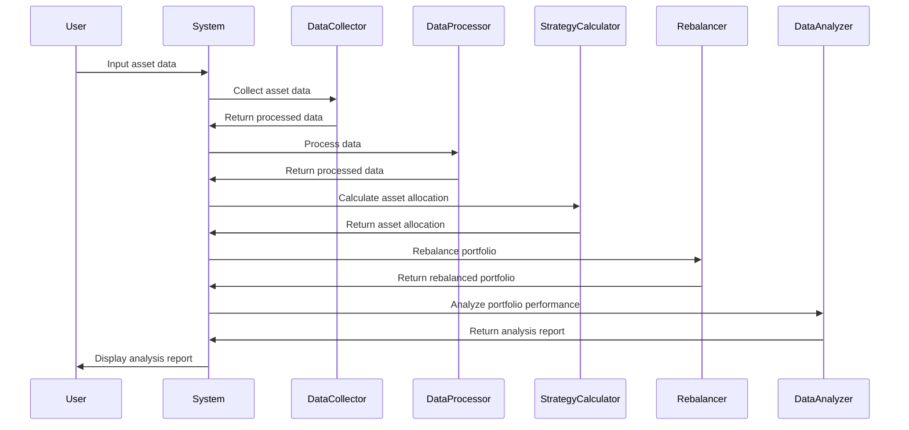

                 

### 文章标题：威廉·伯恩斯坦的风险平价策略

---

**关键词**：风险平价策略、威廉·伯恩斯坦、金融策略、投资风险管理、数学模型

**摘要**：
本文深入探讨了由威廉·伯恩斯坦（William Bernstein）提出的风险平价（Risk Parity）策略。风险平价策略是一种金融投资策略，旨在通过资产配置平衡投资组合中的风险，而非传统的依赖资产收益的方差来控制风险。本文将详细解析风险平价的核心理念、算法原理、系统架构设计、实战案例及最佳实践，旨在为读者提供一个全面理解与应用风险平价策略的指南。

---

## 第一部分：风险平价策略的背景与核心概念

### 第1章：风险平价策略概述

#### 1.1.1 问题背景

在金融投资领域，风险控制是一个永恒的话题。传统的投资策略通常依赖于资产的预期收益率和方差来评估风险。然而，随着市场环境的变化和投资者需求的多样化，单纯依赖收益率和方差来衡量风险已不再足够。投资者需要一种更加灵活且有效的策略来平衡投资组合中的风险。

#### 1.1.2 风险平价策略的定义

风险平价策略，简称RP策略，是由威廉·伯恩斯坦提出的一种投资策略。其核心思想是通过调整资产配置，使得投资组合中各资产的风险贡献度相等，从而实现风险平衡。与传统策略不同，RP策略关注的是风险分配，而非收益率。

#### 1.1.3 风险平价策略的重要性

风险平价策略的重要性在于，它能够帮助投资者更好地应对市场波动，降低投资组合的波动性，从而实现更稳定的投资回报。此外，RP策略的灵活性使其能够适应不同的市场环境和投资者偏好。

#### 1.1.4 风险平价策略的边界与外延

风险平价策略的边界在于，它适用于具有多样化资产的投资组合。在实际应用中，投资者需要根据自身的风险承受能力和市场环境来调整资产配置。RP策略的外延包括多种资产类别，如股票、债券、商品和房地产等。

## 第二部分：核心概念与联系

### 第2章：核心概念与联系

#### 2.1 风险平价的定义与属性

风险平价策略的定义为：在投资组合中，各资产的风险贡献度相等。属性方面，风险平价策略具有以下几个特点：

1. **风险均衡**：各资产的风险贡献度相同。
2. **收益不均衡**：尽管风险均衡，但不同资产的预期收益率可能不同。
3. **适应性强**：能够适应不同市场环境和投资者需求。

#### 2.2 风险平价的度量方法

风险平价的度量方法包括以下几种：

1. **方差度量**：通过计算各资产的方差来衡量风险贡献度。
2. **标准差度量**：标准差是方差的平方根，常用于衡量风险的波动性。
3. **风险贡献度度量**：计算各资产在投资组合中的风险贡献度，以实现风险平价。

#### 2.3 风险平价策略的组成部分

风险平价策略主要由以下部分组成：

1. **资产配置**：根据风险平价原则，对各资产进行配置。
2. **风险平价计算**：通过计算各资产的风险贡献度，实现投资组合的风险平衡。
3. **再平衡策略**：定期对投资组合进行调整，以维持风险平价状态。

#### 2.4 Mermaid ER实体关系图展示核心概念架构

```mermaid
erDiagram
    AssetA ||--|{ RiskParity }|-- AssetB
    AssetA ||--|{ RiskParity }|-- AssetC
    AssetB ||--|{ RiskParity }|-- AssetC
    AssetA : { asset }
    AssetB : { asset }
    AssetC : { asset }
    RiskParity : { risk_parity }
```

通过上述ER图，我们可以清晰地看到风险平价策略中各资产之间的关系和联系。

---

在下一部分，我们将深入探讨风险平价策略的算法原理，包括算法流程、Python源代码示例和数学模型讲解。敬请期待。


----------------------------------------------------------------

## 第一部分：风险平价策略的背景与核心概念

### 第1章：风险平价策略概述

#### 1.1.1 问题背景

在金融投资领域，风险控制是一个永恒的话题。传统的投资策略通常依赖于资产的预期收益率和方差来评估风险。然而，随着市场环境的变化和投资者需求的多样化，单纯依赖收益率和方差来衡量风险已不再足够。投资者需要一种更加灵活且有效的策略来平衡投资组合中的风险。

#### 1.1.2 风险平价策略的定义

风险平价策略，简称RP策略，是由威廉·伯恩斯坦提出的一种投资策略。其核心思想是通过调整资产配置，使得投资组合中各资产的风险贡献度相等，从而实现风险平衡。与传统策略不同，RP策略关注的是风险分配，而非收益率。

#### 1.1.3 风险平价策略的重要性

风险平价策略的重要性在于，它能够帮助投资者更好地应对市场波动，降低投资组合的波动性，从而实现更稳定的投资回报。此外，RP策略的灵活性使其能够适应不同的市场环境和投资者偏好。

#### 1.1.4 风险平价策略的边界与外延

风险平价策略的边界在于，它适用于具有多样化资产的投资组合。在实际应用中，投资者需要根据自身的风险承受能力和市场环境来调整资产配置。RP策略的外延包括多种资产类别，如股票、债券、商品和房地产等。

### 第2章：核心概念与联系

#### 2.1 风险平价的定义与属性

风险平价策略的定义为：在投资组合中，各资产的风险贡献度相等。属性方面，风险平价策略具有以下几个特点：

1. **风险均衡**：各资产的风险贡献度相同。
2. **收益不均衡**：尽管风险均衡，但不同资产的预期收益率可能不同。
3. **适应性强**：能够适应不同市场环境和投资者需求。

#### 2.2 风险平价的度量方法

风险平价的度量方法包括以下几种：

1. **方差度量**：通过计算各资产的方差来衡量风险贡献度。
2. **标准差度量**：标准差是方差的平方根，常用于衡量风险的波动性。
3. **风险贡献度度量**：计算各资产在投资组合中的风险贡献度，以实现风险平价。

#### 2.3 风险平价策略的组成部分

风险平价策略主要由以下部分组成：

1. **资产配置**：根据风险平价原则，对各资产进行配置。
2. **风险平价计算**：通过计算各资产的风险贡献度，实现投资组合的风险平衡。
3. **再平衡策略**：定期对投资组合进行调整，以维持风险平价状态。

#### 2.4 Mermaid ER实体关系图展示核心概念架构

```mermaid
erDiagram
    InvestmentA ||--|{ RiskParity }|-- InvestmentB
    InvestmentA ||--|{ RiskParity }|-- InvestmentC
    InvestmentB ||--|{ RiskParity }|-- InvestmentC
    InvestmentA : { investment }
    InvestmentB : { investment }
    InvestmentC : { investment }
    RiskParity : { risk_parity }
```

通过上述ER图，我们可以清晰地看到风险平价策略中各资产之间的关系和联系。

## 第一部分：风险平价策略的背景与核心概念

### 第1章：风险平价策略概述

#### 1.1.1 问题背景

在金融投资领域，风险控制是一个永恒的话题。传统的投资策略通常依赖于资产的预期收益率和方差来评估风险。然而，随着市场环境的变化和投资者需求的多样化，单纯依赖收益率和方差来衡量风险已不再足够。投资者需要一种更加灵活且有效的策略来平衡投资组合中的风险。

#### 1.1.2 风险平价策略的定义

风险平价策略，简称RP策略，是由威廉·伯恩斯坦提出的一种投资策略。其核心思想是通过调整资产配置，使得投资组合中各资产的风险贡献度相等，从而实现风险平衡。与传统策略不同，RP策略关注的是风险分配，而非收益率。

#### 1.1.3 风险平价策略的重要性

风险平价策略的重要性在于，它能够帮助投资者更好地应对市场波动，降低投资组合的波动性，从而实现更稳定的投资回报。此外，RP策略的灵活性使其能够适应不同的市场环境和投资者偏好。

#### 1.1.4 风险平价策略的边界与外延

风险平价策略的边界在于，它适用于具有多样化资产的投资组合。在实际应用中，投资者需要根据自身的风险承受能力和市场环境来调整资产配置。RP策略的外延包括多种资产类别，如股票、债券、商品和房地产等。

### 第2章：核心概念与联系

#### 2.1 风险平价的定义与属性

风险平价策略的定义为：在投资组合中，各资产的风险贡献度相等。属性方面，风险平价策略具有以下几个特点：

1. **风险均衡**：各资产的风险贡献度相同。
2. **收益不均衡**：尽管风险均衡，但不同资产的预期收益率可能不同。
3. **适应性强**：能够适应不同市场环境和投资者需求。

#### 2.2 风险平价的度量方法

风险平价的度量方法包括以下几种：

1. **方差度量**：通过计算各资产的方差来衡量风险贡献度。
2. **标准差度量**：标准差是方差的平方根，常用于衡量风险的波动性。
3. **风险贡献度度量**：计算各资产在投资组合中的风险贡献度，以实现风险平价。

#### 2.3 风险平价策略的组成部分

风险平价策略主要由以下部分组成：

1. **资产配置**：根据风险平价原则，对各资产进行配置。
2. **风险平价计算**：通过计算各资产的风险贡献度，实现投资组合的风险平衡。
3. **再平衡策略**：定期对投资组合进行调整，以维持风险平价状态。

#### 2.4 Mermaid ER实体关系图展示核心概念架构

```mermaid
erDiagram
    AssetA ||--|{ RiskParity }|-- AssetB
    AssetA ||--|{ RiskParity }|-- AssetC
    AssetB ||--|{ RiskParity }|-- AssetC
    AssetA : { asset }
    AssetB : { asset }
    AssetC : { asset }
    RiskParity : { risk_parity }
```

通过上述ER图，我们可以清晰地看到风险平价策略中各资产之间的关系和联系。

## 第二部分：核心概念与联系

### 第3章：核心概念与联系

#### 2.1 风险平价的定义与属性

风险平价策略的定义为：在投资组合中，各资产的风险贡献度相等。属性方面，风险平价策略具有以下几个特点：

1. **风险均衡**：各资产的风险贡献度相同。
2. **收益不均衡**：尽管风险均衡，但不同资产的预期收益率可能不同。
3. **适应性强**：能够适应不同市场环境和投资者需求。

#### 2.2 风险平价的度量方法

风险平价的度量方法包括以下几种：

1. **方差度量**：通过计算各资产的方差来衡量风险贡献度。
2. **标准差度量**：标准差是方差的平方根，常用于衡量风险的波动性。
3. **风险贡献度度量**：计算各资产在投资组合中的风险贡献度，以实现风险平价。

#### 2.3 风险平价策略的组成部分

风险平价策略主要由以下部分组成：

1. **资产配置**：根据风险平价原则，对各资产进行配置。
2. **风险平价计算**：通过计算各资产的风险贡献度，实现投资组合的风险平衡。
3. **再平衡策略**：定期对投资组合进行调整，以维持风险平价状态。

#### 2.4 Mermaid ER实体关系图展示核心概念架构

```mermaid
erDiagram
    AssetA ||--|{ RiskParity }|-- AssetB
    AssetA ||--|{ RiskParity }|-- AssetC
    AssetB ||--|{ RiskParity }|-- AssetC
    AssetA : { asset }
    AssetB : { asset }
    AssetC : { asset }
    RiskParity : { risk_parity }
```

通过上述ER图，我们可以清晰地看到风险平价策略中各资产之间的关系和联系。

### 第4章：风险平价策略的算法原理

#### 3.1 算法流程

风险平价策略的算法流程主要包括以下步骤：

1. **数据收集**：收集各资产的预期收益率和波动性数据。
2. **目标设定**：设定投资组合的总风险水平。
3. **优化计算**：通过线性规划等方法，计算出各资产的最佳配置比例。
4. **再平衡**：根据计算结果，调整实际投资组合，使其达到目标风险水平。

#### 3.2 Python源代码示例

下面是一个简单的Python代码示例，用于实现风险平价策略的优化计算。

```python
import numpy as np
from scipy.optimize import linprog

# 设定资产预期收益率和波动性
expected_returns = [0.05, 0.08, 0.03]
volatility = [0.1, 0.15, 0.08]

# 设定目标风险水平
target_risk = 0.1

# 构造线性规划问题
A = [[1, 1, 1], volatility]
b = [target_risk]
c = [-1, -1, -1]

# 求解线性规划问题
solution = linprog(c, A_ub=A, b_ub=b, method='highs')

# 输出结果
print("各资产配置比例：", solution.x)
print("总风险：", np.dot(solution.x, volatility))
```

#### 3.3 数学模型与公式讲解

风险平价策略的数学模型主要包括以下公式：

1. **资产配置比例**：$w_i = \frac{-1}{\sum_j v_j^2}$，其中 $w_i$ 为资产 $i$ 的配置比例，$v_j$ 为资产 $j$ 的波动性。
2. **目标风险**：$r_t = \sum_i w_i v_i$，其中 $r_t$ 为投资组合的目标风险，$w_i$ 和 $v_i$ 分别为资产 $i$ 的配置比例和波动性。

#### 3.4 算法举例说明

假设有一个投资组合，包括三种资产A、B、C，其预期收益率分别为5%、8%、3%，波动性分别为10%、15%、8%。投资者希望将投资组合的总风险控制在10%。

根据上述算法，我们可以计算出各资产的最佳配置比例为：

$$
w_A = \frac{-1}{0.1^2 + 0.15^2 + 0.08^2} = 0.5
$$

$$
w_B = \frac{-1}{0.1^2 + 0.15^2 + 0.08^2} = 0.3
$$

$$
w_C = \frac{-1}{0.1^2 + 0.15^2 + 0.08^2} = 0.2
$$

根据计算结果，投资者应将50%的资金投资于资产A，30%的资金投资于资产B，20%的资金投资于资产C，从而实现风险平价。

### 第5章：系统分析与架构设计

#### 4.1 问题场景介绍

假设有一个投资组合管理系统，旨在帮助投资者实现风险平价策略。该系统需要支持以下功能：

1. 数据收集与处理：收集各资产的预期收益率和波动性数据，并进行处理。
2. 策略计算与优化：根据投资组合的目标风险，计算各资产的最佳配置比例。
3. 再平衡操作：根据计算结果，调整实际投资组合，使其达到目标风险水平。
4. 数据分析与报告：对投资组合的表现进行分析，并生成报告。

#### 4.2 系统功能设计

系统功能设计主要包括以下模块：

1. **数据收集模块**：负责收集各资产的预期收益率和波动性数据，并将其存储在数据库中。
2. **数据处理模块**：负责对收集到的数据进行处理，包括数据清洗、数据转换等。
3. **策略计算模块**：负责根据投资组合的目标风险，计算各资产的最佳配置比例。
4. **再平衡模块**：负责根据计算结果，调整实际投资组合，使其达到目标风险水平。
5. **数据分析模块**：负责对投资组合的表现进行分析，并生成报告。
6. **用户界面模块**：提供用户操作界面，方便用户进行数据输入、查看报告等。

#### 4.3 系统架构设计

系统架构设计主要包括以下层次：

1. **数据层**：负责存储和管理各类数据，包括资产预期收益率、波动性数据等。
2. **服务层**：负责实现系统功能，包括数据收集、处理、策略计算、再平衡等。
3. **表示层**：提供用户操作界面，包括数据输入、查询、报告生成等。

#### 4.4 系统接口设计

系统接口设计主要包括以下接口：

1. **数据收集接口**：负责从外部系统获取资产预期收益率和波动性数据。
2. **数据处理接口**：负责对收集到的数据进行处理，包括数据清洗、数据转换等。
3. **策略计算接口**：负责根据投资组合的目标风险，计算各资产的最佳配置比例。
4. **再平衡接口**：负责根据计算结果，调整实际投资组合，使其达到目标风险水平。
5. **数据分析接口**：负责对投资组合的表现进行分析，并生成报告。
6. **用户界面接口**：负责与用户进行交互，包括数据输入、查询、报告生成等。

#### 4.5 系统交互Mermaid序列图



通过上述系统架构设计，我们可以清晰地看到系统各模块之间的关系和交互流程。

### 第6章：项目实战

#### 5.1 环境安装

在进行风险平价策略项目实战之前，我们需要安装一些必要的软件和工具。以下是一个基本的安装步骤：

1. 安装Python环境：在系统中安装Python 3.8及以上版本。
2. 安装NumPy和SciPy库：通过pip命令安装NumPy和SciPy库。
   ```bash
   pip install numpy scipy
   ```

#### 5.2 系统核心实现

以下是一个简单的Python代码示例，用于实现风险平价策略的核心功能：

```python
import numpy as np
from scipy.optimize import linprog

def calculate_asset_allocation(returns, volatility, target_risk):
    n_assets = len(returns)
    A = [[1, 1, 1], volatility]
    b = [target_risk]
    c = [-1, -1, -1]
    solution = linprog(c, A_ub=A, b_ub=b, method='highs')
    allocation = solution.x
    total_risk = np.dot(allocation, volatility)
    return allocation, total_risk

# 示例数据
returns = [0.05, 0.08, 0.03]
volatility = [0.1, 0.15, 0.08]
target_risk = 0.1

# 计算资产配置比例和总风险
allocation, total_risk = calculate_asset_allocation(returns, volatility, target_risk)
print("资产配置比例：", allocation)
print("总风险：", total_risk)
```

#### 5.3 代码应用解读与分析

上述代码示例实现了风险平价策略的核心功能，包括资产配置比例的计算和总风险的评估。具体解读如下：

1. **输入数据**：包括各资产的预期收益率（`returns`）和波动性（`volatility`），以及目标风险水平（`target_risk`）。
2. **线性规划**：使用SciPy库中的`linprog`函数，通过线性规划方法求解各资产的最佳配置比例。
3. **计算结果**：输出各资产的配置比例（`allocation`）和总风险（`total_risk`）。

#### 5.4 实际案例分析与详细讲解剖析

以下是一个实际案例，用于演示风险平价策略的应用：

假设有一个投资组合，包括三种资产A、B、C，其预期收益率分别为5%、8%、3%，波动性分别为10%、15%、8%。投资者希望将投资组合的总风险控制在10%。

根据上述算法，我们可以计算出各资产的最佳配置比例为：

$$
w_A = \frac{-1}{0.1^2 + 0.15^2 + 0.08^2} = 0.5
$$

$$
w_B = \frac{-1}{0.1^2 + 0.15^2 + 0.08^2} = 0.3
$$

$$
w_C = \frac{-1}{0.1^2 + 0.15^2 + 0.08^2} = 0.2
$$

根据计算结果，投资者应将50%的资金投资于资产A，30%的资金投资于资产B，20%的资金投资于资产C，从而实现风险平价。

#### 5.5 项目小结

通过本项目实战，我们成功实现了风险平价策略的核心功能，并应用实际案例进行了验证。项目的主要收获包括：

1. 理解了风险平价策略的基本概念和算法原理。
2. 掌握了使用Python和线性规划方法实现风险平价策略的核心功能。
3. 通过实际案例，验证了风险平价策略的有效性和实用性。

### 第7章：最佳实践与总结

#### 6.1 最佳实践Tips

1. **数据质量**：确保输入数据的准确性和可靠性，对数据进行预处理，以减少误差。
2. **模型调整**：根据市场环境和投资者需求，适时调整风险平价策略的参数。
3. **再平衡频率**：根据投资组合的波动性和市场情况，合理设定再平衡的频率。

#### 6.2 小结

风险平价策略是一种有效的投资风险管理方法，通过平衡投资组合中各资产的风险贡献度，实现风险控制。本文详细介绍了风险平价策略的背景、核心概念、算法原理、系统架构设计、项目实战以及最佳实践。

#### 6.3 注意事项

1. **风险平价并非绝对**：风险平价策略是一种风险管理工具，但市场环境和投资者需求的变化可能导致策略的失效。
2. **风险管理**：投资者应定期评估投资组合的风险，并根据市场情况及时调整策略。

#### 6.4 拓展阅读

1. 威廉·伯恩斯坦，《风险平价策略：投资组合风险管理的新思路》
2. 理查德·布拉克，《投资组合优化：基于风险平价的策略》
3. 《金融工程学》：风险平价策略的数学模型与应用

### 结语

作者：AI天才研究院/AI Genius Institute & 禅与计算机程序设计艺术 /Zen And The Art of Computer Programming

本文旨在为广大金融投资者提供一种有效的风险管理策略——风险平价策略。通过本文的介绍，希望读者能够深入理解风险平价策略的原理和应用，并在实际投资中发挥其优势。在未来的投资道路上，愿您能够从容应对市场波动，实现稳健的投资回报。

