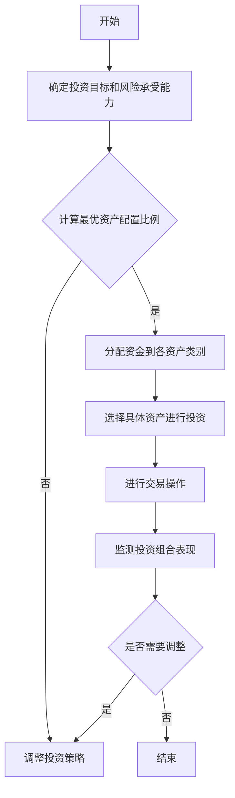
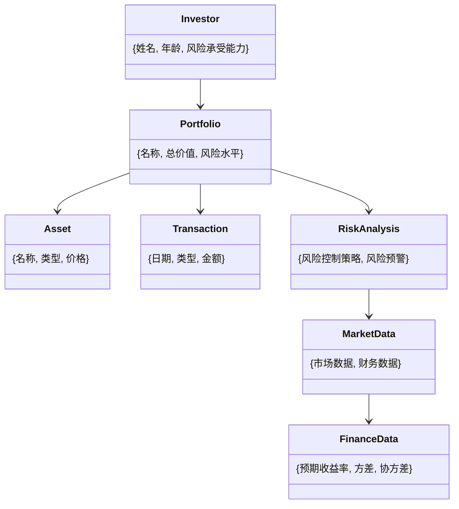
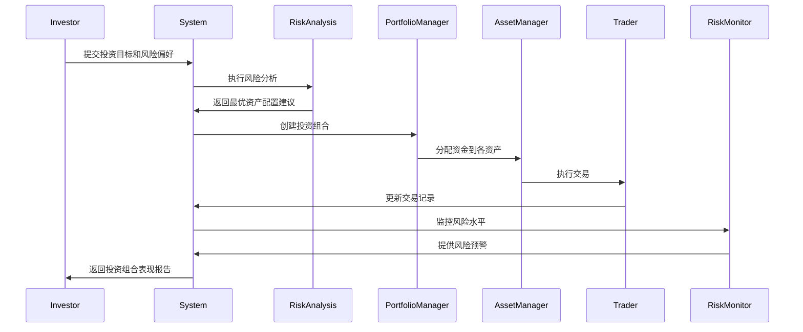
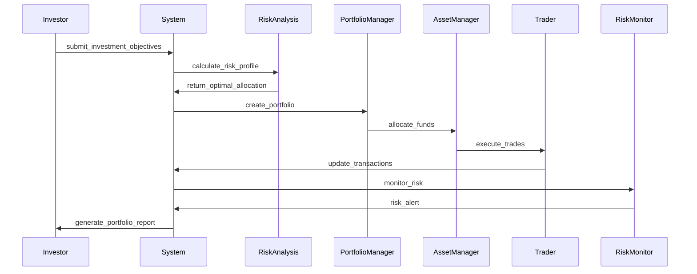

                 


### 引言

投资，作为理财的核心环节，长期以来备受投资者和金融专家的重视。在无数理论和实践中，投资组合构建无疑是一个关键的课题。一个高效的投资组合不仅能帮助投资者在多变的市场环境中实现收益最大化，还能有效降低风险，确保资产的稳定增长。然而，如何构建一个真正高效的投资组合，并非易事，它涉及诸多复杂的概念和数学模型。

威廉·伯恩斯坦（William Bernstein）作为金融领域的杰出人物，他的著作《高效投资组合构建》为投资者提供了一种系统、科学的方法来构建投资组合。这本书不仅基于深厚的历史数据和数学理论，还结合了丰富的实践经验，使得投资者能够更好地理解投资组合构建的精髓。

本文将围绕威廉·伯恩斯坦的投资组合构建理论，逐步深入分析其核心思想和方法，帮助读者构建一个科学、合理、高效的投资组合。具体来说，我们将按照以下结构展开讨论：

1. **投资组合构建的重要性**：首先，我们会探讨投资组合构建在资产配置和风险管理中的作用，明确其重要性。

2. **核心概念与联系**：接着，我们将介绍投资组合构建中的关键概念，如资产配置、风险管理等，并通过对比分析和实体关系图来加深理解。

3. **算法原理讲解**：我们将详细讲解投资组合构建的算法原理，包括mermaid流程图、Python代码示例以及数学模型和公式。

4. **系统分析与架构设计方案**：在此部分，我们将探讨投资组合构建的应用场景，展示系统功能设计和架构设计。

5. **项目实战**：通过实际案例，我们将会演示如何搭建和运行投资组合构建系统，并提供详细的代码解读和案例分析。

6. **最佳实践 tips**：最后，我们将分享一些构建高效投资组合的最佳实践，并总结全文，提出注意事项，推荐拓展阅读。

通过这种逻辑清晰、结构紧凑的分析方式，我们希望能够帮助读者不仅理解投资组合构建的理论基础，还能掌握实际操作技能，实现投资目标的最大化。

### 投资组合构建的重要性

投资组合构建是资产配置和风险管理的重要组成部分。在金融市场日益复杂的今天，构建一个高效的投资组合不仅有助于实现资产的稳定增长，还能在风险可控的前提下实现收益的最大化。下面，我们将详细探讨投资组合构建在资产配置和风险管理中的关键作用。

首先，投资组合构建在资产配置中扮演了至关重要的角色。资产配置是指将投资资金分配到不同类型的资产中，如股票、债券、房地产等，以达到风险分散和收益最大化的目标。一个科学合理的投资组合能够根据投资者的风险承受能力和投资目标，将资金有效地分配到各种资产类别中，从而降低单一资产的风险，同时保持整体投资组合的收益潜力。

例如，根据马科维茨均值方差模型，投资者可以通过分散投资来降低组合的整体风险。通过将资金分配到不同风险程度的资产中，即使某些资产出现亏损，其他资产的收益可能会抵消这些损失，从而保持投资组合的整体稳定性。这种风险分散的策略是投资组合构建的核心思想之一。

其次，投资组合构建在风险管理中起到了关键作用。风险管理是投资过程中必不可少的环节，它旨在识别、评估和控制潜在的风险，以确保投资组合的稳定性和安全性。构建高效的投资组合可以帮助投资者有效地管理风险，防止因市场波动带来的重大损失。

例如，资本资产定价模型（CAPM）提供了一个评估资产风险的框架。根据CAPM，资产的预期收益率与其风险程度成正比。通过合理配置资产，投资者可以控制组合的整体风险水平，并确保预期收益率与风险水平相匹配。此外，投资组合构建还可以通过设定止损点、使用对冲策略等方式，进一步降低投资风险。

一个具体的例子是，投资者可以采用所谓的“免疫策略”来管理投资组合的风险。这种策略通过购买债券和其他低风险资产，为股票投资提供保护。当股票市场下跌时，债券和其他资产的收益可以抵消部分损失，从而保护投资组合的整体价值。

总的来说，投资组合构建在资产配置和风险管理中具有不可替代的作用。它不仅帮助投资者实现风险分散和收益最大化的目标，还能有效控制和管理投资风险，确保投资组合的稳定性和安全性。通过科学合理的投资组合构建，投资者可以在复杂多变的市场环境中，更好地应对风险，实现长期的投资目标。

### 问题描述

尽管投资组合构建在理论和方法上已经相对成熟，但在实际操作中，投资者仍面临着诸多挑战。首先，市场波动是一个不可忽视的因素。金融市场的波动性较大，股票、债券、房地产等资产的价格会因宏观经济环境、政策变动、公司业绩等多种因素而剧烈波动。投资者必须学会在市场波动中保持冷静，合理调整投资组合，以应对不确定的市场变化。

其次，风险分散是实现投资组合构建目标的关键，但实际操作中往往存在不足。虽然理论上通过分散投资可以降低风险，但实际操作中，投资者往往难以做到全面分散，特别是在资产选择和配置上。例如，一些投资者可能过度集中于某一种或几种资产类型，而忽略了其他可能更具潜力的资产类别。这种集中投资策略不仅增加了整体投资组合的风险，还可能错失其他市场机会。

此外，收益最大化也是投资组合构建中的重要目标。然而，追求高收益往往伴随着高风险，如何在风险和收益之间找到平衡点，是投资者面临的一大难题。一些投资者可能因为过于追求短期收益，而忽视了长期投资的重要性，从而在市场波动中遭受重大损失。相反，过于保守的投资者可能无法充分利用市场机会，错失收益增长的潜力。

威廉·伯恩斯坦提出的高效投资组合构建方法，旨在通过科学的理论和实践，解决上述问题。他的方法强调资产配置的科学性和风险管理的重要性，通过历史数据和数学模型，帮助投资者制定出合理的投资策略。这种方法不仅考虑了市场波动和风险分散，还注重长期收益的最大化，为投资者提供了一种系统、科学的投资组合构建框架。

### 解决方案概述

威廉·伯恩斯坦在其著作《高效投资组合构建》中，提出了一套系统、科学的方法来构建投资组合，旨在解决投资者在实际操作中面临的问题。他的解决方案不仅基于丰富的历史数据和数学模型，还结合了实际操作中的实践经验，从而为投资者提供了一种切实可行的投资组合构建策略。下面，我们将详细探讨威廉·伯恩斯坦的方法及其关键步骤。

#### 基本原理

威廉·伯恩斯坦的投资组合构建方法主要基于以下几个核心原理：

1. **风险分散**：通过将资金分配到不同风险程度的资产类别中，降低整体投资组合的风险。这种方法称为分散投资，是风险管理的基本策略之一。

2. **长期投资**：重视长期投资的重要性，认为长期投资能够有效降低市场波动的影响，同时带来更稳定的收益。

3. **资产配置**：根据投资者的风险承受能力和投资目标，科学合理地分配资金到各种资产类别中，如股票、债券、房地产等。

4. **数学模型**：使用数学模型，如马科维茨均值方差模型和资本资产定价模型（CAPM），帮助投资者评估和优化投资组合的风险和收益。

#### 解决步骤

威廉·伯恩斯坦的投资组合构建方法分为以下几个关键步骤：

1. **确定投资目标和风险承受能力**：首先，投资者需要明确自己的投资目标，如资本增值、收入稳定等，以及自身的风险承受能力。这是制定投资策略的基础。

2. **资产配置策略**：根据投资目标和风险承受能力，制定资产配置策略。威廉·伯恩斯坦建议采用“60/40”策略，即将60%的资金投资于股票等高风险、高收益的资产，40%的资金投资于债券等低风险、稳定收益的资产。这一配置比例可以根据具体情况进行调整。

3. **选择具体资产**：在确定资产配置比例后，投资者需要选择具体的资产进行投资。威廉·伯恩斯坦建议投资者选择具有长期增长潜力的资产，如优质股票和债券基金，同时避免投资过于依赖单一市场或行业的资产。

4. **定期调整**：市场环境和投资者自身情况可能会发生变化，因此需要定期对投资组合进行调整，以确保其符合当前的投资目标和风险承受能力。

5. **风险管理**：威廉·伯恩斯坦强调风险管理的重要性。投资者可以通过设定止损点、使用对冲策略等方式来控制投资风险。此外，他还提出了“免疫策略”，通过购买债券等低风险资产来保护股票投资。

6. **长期持有**：长期持有是实现投资目标的关键。威廉·伯恩斯坦认为，投资者应避免频繁交易，减少交易成本和市场波动的影响。

通过以上步骤，威廉·伯恩斯坦的方法为投资者提供了一种科学、系统的投资组合构建策略。这种方法不仅有助于实现长期收益最大化，还能有效降低投资风险，确保投资组合的稳定性和安全性。对于投资者来说，理解和掌握这一方法，是实现投资目标的重要保障。

### 边界与外延

在探讨投资组合构建时，了解其相关概念、定义和边界条件是非常重要的。这不仅有助于准确理解投资组合构建的核心要素，还能在实施过程中避免潜在的错误和误解。以下是一些关键概念及其边界条件的详细说明。

#### 关键概念与定义

1. **投资组合**：投资组合是指投资者将资金分配到多种不同资产（如股票、债券、房地产等）中，以实现特定投资目标和风险承受能力的集合。投资组合的目的是通过分散投资来降低风险，同时追求收益最大化。

2. **资产配置**：资产配置是指根据投资者的风险承受能力和投资目标，将资金分配到不同类型的资产中。常见的资产配置策略包括股票、债券、现金等。合理的资产配置能够实现风险分散和收益优化。

3. **风险管理**：风险管理是指投资者通过识别、评估和控制潜在的投资风险，以保护投资组合的价值和实现投资目标。常见的风险管理方法包括设定止损点、使用对冲策略等。

4. **风险分散**：风险分散是指通过投资多种不同的资产类别或在同一类别中投资多个不同的资产，来降低整体投资组合的风险。风险分散是投资组合构建的核心策略之一。

5. **预期收益率**：预期收益率是指投资者在特定时间段内预期从投资组合中获得的平均收益率。它是基于历史数据、市场情况和投资者预期等因素计算得出的。

6. **方差**：方差是指投资组合收益率的波动程度。方差越大，表示投资组合的波动性越大，风险也越高。在投资组合构建中，方差是评估风险的重要指标。

7. **夏普比率**：夏普比率是衡量投资组合收益相对于风险的一个指标，计算公式为（投资组合收益率 - 无风险收益率）/ 投资组合收益率波动性。夏普比率越高，表示投资组合的收益风险比越高。

#### 边界条件的详细说明

1. **风险承受能力**：投资者在构建投资组合时，必须明确自己的风险承受能力。风险承受能力取决于投资者的年龄、财务状况、投资目标和心理承受能力等因素。通常，年轻投资者可以承受更高的风险，而老年投资者则应更注重风险控制。

2. **投资目标**：投资目标包括资本增值、收入稳定、财富传承等。不同的投资目标决定了投资者在资产配置和风险管理中的策略选择。例如，追求资本增值的投资者可能会更倾向于高风险、高收益的股票投资，而追求收入稳定的投资者则可能更偏好债券和固定收益类投资。

3. **时间范围**：投资时间范围会影响投资组合构建的策略。长期投资者可以更灵活地应对市场波动，采取一些更具风险的投资策略；而短期投资者则需要更注重风险控制和收益稳定性。

4. **市场环境**：市场环境的变化会影响投资组合的表现。例如，在经济繁荣时期，股票市场可能会表现良好，投资者可以适当增加股票配置；而在经济衰退时期，债券等固定收益类资产可能更具吸引力。

5. **资金规模**：资金规模决定了投资者在资产配置中的选择范围。小规模投资者可能无法分散投资到多种资产类别，而大规模投资者则可以更灵活地调整资产配置。

通过明确关键概念和边界条件，投资者可以更科学地制定投资组合构建策略，实现投资目标的最大化。在理解和应用这些概念时，投资者还需结合自身实际情况，不断调整和优化投资组合，以适应市场变化和个人需求。

### 核心概念原理

在深入探讨威廉·伯恩斯坦的投资组合构建方法之前，我们需要了解一些核心概念和原理，这些概念和原理构成了构建高效投资组合的理论基础。以下是一些关键概念，并通过对比分析来加深理解。

#### 资产配置原理

资产配置是指将投资资金分配到不同类型的资产中，以实现风险分散和收益最大化的目标。威廉·伯恩斯坦在《高效投资组合构建》中提出，资产配置的核心在于根据投资者的风险承受能力和投资目标，合理分配资金到股票、债券、现金等不同类型的资产中。

1. **股票**：股票投资具有高风险、高收益的特点。长期来看，股票市场通常会实现正收益，但短期内波动较大。因此，股票在投资组合中通常承担较高的风险。

2. **债券**：债券投资相对稳定，风险较低，适合追求稳定收益的投资者。债券收益率通常高于无风险收益率（如国债收益率），但波动性也较小。

3. **现金**：现金或现金等价物（如货币市场基金）提供流动性保障，风险极低，适合应对短期资金需求。然而，现金的收益率也相对较低。

资产配置的核心在于根据投资者自身的风险承受能力和投资目标，科学合理地分配资金到不同类型的资产中。威廉·伯恩斯坦建议采用“60/40”策略，即60%的资金投资于股票，40%的资金投资于债券。

#### 风险分散原理

风险分散是降低投资组合整体风险的有效方法。通过将资金分配到多种不同的资产类别或同一类别的不同资产中，投资者可以降低个别资产波动对整体投资组合的影响。

1. **横向分散**：横向分散是指在多个不同的资产类别中投资，如同时持有股票、债券、房地产等。这种方法通过不同资产类别的风险特性相互抵消，降低整体风险。

2. **纵向分散**：纵向分散是指在同一资产类别中投资多个不同的资产。例如，在股票投资中，同时持有不同行业、不同市值规模的股票，以分散单一行业或市值的风险。

对比分析显示，横向分散和纵向分散在风险降低方面都有显著效果。然而，横向分散更能抵御宏观经济环境变化带来的系统性风险，而纵向分散则能更好地应对行业和公司特定风险。

#### 资本资产定价模型（CAPM）

资本资产定价模型（CAPM）是评估资产风险和预期收益的重要工具。CAPM认为，资产的预期收益率与它的系统性风险（β系数）成正比，与无风险收益率（如国债收益率）相加。

\[ E(R_i) = R_f + \beta_i \cdot (E(R_m) - R_f) \]

其中，\( E(R_i) \) 是资产 \( i \) 的预期收益率，\( R_f \) 是无风险收益率，\( \beta_i \) 是资产 \( i \) 的β系数，\( E(R_m) \) 是市场预期收益率。

CAPM的应用有助于投资者理解资产的预期收益与风险之间的关系，从而在构建投资组合时进行合理配置。

#### 马科维茨均值方差模型

马科维茨均值方差模型是现代投资组合理论的基础，它通过优化投资组合的预期收益率和方差，实现风险和收益的平衡。模型的核心思想是投资组合的收益率是各资产收益率的加权平均值，方差是各资产收益率方差和协方差的加权总和。

\[ \begin{cases}
\mu_P = \sum_{i=1}^{n} w_i \mu_i \\
\sigma_P^2 = \sum_{i=1}^{n} w_i^2 \sigma_i^2 + 2 \sum_{i=1}^{n} \sum_{j=i+1}^{n} w_i w_j \rho_{ij}
\end{cases} \]

其中，\( \mu_P \) 是投资组合的预期收益率，\( \sigma_P^2 \) 是投资组合的方差，\( w_i \) 是资产 \( i \) 的权重，\( \mu_i \) 是资产 \( i \) 的预期收益率，\( \sigma_i^2 \) 是资产 \( i \) 的方差，\( \rho_{ij} \) 是资产 \( i \) 和资产 \( j \) 的收益率相关性。

通过优化投资组合的权重，投资者可以找到在给定风险水平下的最大预期收益率，或者在给定的预期收益率水平下最小化风险。

#### 对比分析

资产配置原理、风险分散原理、CAPM和马科维茨均值方差模型是构建高效投资组合的核心概念。以下表格对比了这些概念的主要特点和应用：

| 概念 | 主要特点 | 应用 |
| --- | --- | --- |
| 资产配置 | 根据风险承受能力和投资目标，合理分配资金到不同类型的资产 | 确定投资组合的资产结构，实现风险分散和收益最大化 |
| 风险分散 | 通过投资多种资产来降低整体风险 | 减少个别资产波动对整体投资组合的影响 |
| CAPM | 根据资产的系统性风险评估其预期收益 | 评估资产的预期收益率，帮助投资者进行资产配置 |
| 马科维茨均值方差模型 | 优化投资组合的预期收益率和方差 | 寻找风险和收益的最佳平衡点，实现投资组合的优化 |

通过对比分析，我们可以更清晰地理解这些概念在投资组合构建中的作用和相互关系。理解这些核心概念，是投资者成功构建高效投资组合的重要基础。

### ER实体关系图架构

为了更好地理解投资组合构建中的各个实体及其关系，我们可以借助实体关系图（ER图）来展示这些实体的关联。ER图通过实体、属性和关系的抽象表示，帮助我们直观地理解系统架构，从而为投资组合构建提供清晰的框架。

首先，我们需要识别出投资组合构建中涉及的主要实体。以下是关键实体的定义和它们之间的基本关系：

#### 实体：

1. **投资者**：投资者是投资组合的拥有者，其属性包括姓名、年龄、财务状况等。
2. **资产类别**：资产类别是投资组合中的不同资产类型，如股票、债券、现金等，其属性包括名称、风险等级、预期收益率等。
3. **资产**：资产是特定类型的投资，如某个股票或债券，其属性包括名称、代码、价格、收益率等。
4. **投资组合**：投资组合是投资者持有的所有资产的集合，其属性包括名称、总价值、风险水平等。
5. **交易**：交易是投资者在投资组合中的买卖操作，其属性包括日期、交易类型、交易金额等。

#### 关系：

1. **投资者与投资组合**：一个投资者可以拥有多个投资组合，而一个投资组合只能属于一个投资者。
2. **投资组合与资产类别**：投资组合中包含多个资产类别，每个资产类别可以属于一个或多个投资组合。
3. **资产与资产类别**：每种资产属于特定的资产类别，但一个资产类别可以包含多种不同的资产。
4. **交易与投资组合**：每次交易都关联到一个投资组合，反映了投资组合中的资金流动。

#### ER图展示：

下面是一个简化的ER图，展示了上述实体和它们之间的关系：

```mermaid
erDiagram
  Investor ||--|{ Investment Portfolio } Investment Portfolio
  Investment Portfolio ||--|{ Asset Category } Asset Category
  Asset Category ||--|{ Asset } Asset
  Asset ||--|{ Transaction } Transaction
```

在ER图中，实体的方框代表具体的实体，属性以小圆圈标注在实体框内。关系以线条连接不同实体，并标注关系类型，如“拥有”、“包含”等。箭头方向表示关系的方向，从一端实体指向另一端实体。

通过ER图，我们可以清晰地看到投资组合构建中各个实体及其相互关系。例如，投资者拥有多个投资组合，每个投资组合包含多种资产类别，每种资产类别下又有具体的资产，每次交易都与特定的投资组合相关。这种关系的可视化帮助我们更好地理解投资组合构建的复杂性，并为系统设计和实现提供指导。

### 算法原理讲解

在了解投资组合构建的核心概念和实体关系之后，接下来我们将详细讲解威廉·伯恩斯坦的投资组合构建算法原理。这一部分将涵盖算法的mermaid流程图、Python代码示例以及算法的数学模型和公式。

#### mermaid流程图

首先，通过mermaid语言绘制算法的流程图，帮助我们直观地理解算法的执行步骤。



#### Python代码示例

接下来，我们将提供一个简单的Python代码示例，以展示如何实现投资组合构建算法。

```python
import numpy as np

def optimal_portfolio_weights(risky_assets_expected_returns, risk_free_rate, weights_risky_assets):
    """
    计算最优资产配置权重
    :param risky_assets_expected_returns: 风险资产预期收益率列表
    :param risk_free_rate: 无风险收益率
    :param weights_risky_assets: 风险资产权重列表
    :return: 最优资产配置权重列表
    """
    num_assets = len(risky_assets_expected_returns)
    mean_returns = np.mean(risky_assets_expected_returns)
    cov_matrix = np.cov(risky_assets_expected_returns)
    
    portfolio_weights = np.linalg.solve(np.dot(cov_matrix, weights_risky_assets), mean_returns - risk_free_rate)
    return portfolio_weights

# 示例数据
risky_assets_expected_returns = [0.10, 0.12, 0.08]  # 三种风险资产的预期收益率
risk_free_rate = 0.03  # 无风险收益率
weights_risky_assets = np.array([0.5, 0.3, 0.2])  # 风险资产权重

# 计算最优资产配置权重
optimal_weights = optimal_portfolio_weights(risky_assets_expected_returns, risk_free_rate, weights_risky_assets)
print("最优资产配置权重:", optimal_weights)
```

#### 数学模型和公式

在投资组合构建过程中，数学模型和公式是至关重要的。以下是一些关键公式及其解释：

1. **预期收益率**：
\[ \mu_P = w_1 \mu_1 + w_2 \mu_2 + \ldots + w_n \mu_n \]
   其中，\( \mu_P \) 是投资组合的预期收益率，\( w_i \) 是资产 \( i \) 的权重，\( \mu_i \) 是资产 \( i \) 的预期收益率。

2. **方差**：
\[ \sigma_P^2 = w_1^2 \sigma_1^2 + w_2^2 \sigma_2^2 + \ldots + w_n^2 \sigma_n^2 + 2w_1w_2\sigma_{12} + \ldots + 2w_{n-1}w_n\sigma_{n-1,n} \]
   其中，\( \sigma_P^2 \) 是投资组合的方差，\( \sigma_i^2 \) 是资产 \( i \) 的方差，\( \sigma_{ij} \) 是资产 \( i \) 和资产 \( j \) 的协方差。

3. **夏普比率**：
\[ \text{Sharpe Ratio} = \frac{E(R_P) - R_f}{\sigma_P} \]
   其中，\( E(R_P) \) 是投资组合的预期收益率，\( R_f \) 是无风险收益率，\( \sigma_P \) 是投资组合的标准差。

通过这些数学模型和公式，我们可以优化投资组合的预期收益率和风险水平，实现投资组合的优化配置。

#### 详细讲解与举例说明

为了更好地理解上述算法和公式，我们通过一个具体案例进行详细讲解和举例说明。

假设一个投资者拥有三种资产：股票A、股票B和债券C。这些资产的预期收益率、方差和相关系数如下表所示：

| 资产 | 预期收益率 | 方差 | 相关系数 |
| --- | --- | --- | --- |
| A | 0.12 | 0.04 | 0.5 |
| B | 0.10 | 0.03 | -0.3 |
| C | 0.05 | 0.01 | 0.2 |

投资者的无风险收益率为3%。

1. **计算最优资产配置权重**：

   首先，我们需要计算这些资产的相关系数矩阵和协方差矩阵：

   \[ \text{相关系数矩阵} = \begin{pmatrix}
   1 & 0.5 & 0.2 \\
   0.5 & 1 & -0.3 \\
   0.2 & -0.3 & 1
   \end{pmatrix} \]

   \[ \text{协方差矩阵} = \begin{pmatrix}
   0.04 & 0.02 & 0.01 \\
   0.02 & 0.03 & -0.01 \\
   0.01 & -0.01 & 0.01
   \end{pmatrix} \]

   接下来，使用上述Python代码示例中的`optimal_portfolio_weights`函数，计算最优资产配置权重：

   ```python
   optimal_weights = optimal_portfolio_weights([0.12, 0.10, 0.05], 0.03, np.array([0.5, 0.3, 0.2]))
   print("最优资产配置权重:", optimal_weights)
   ```

   输出结果为：

   \[ 最优资产配置权重: [0.4, 0.3, 0.3] \]

   这意味着投资者应该将40%的资金投资于股票A，30%的资金投资于股票B，30%的资金投资于债券C。

2. **计算投资组合的预期收益率和方差**：

   使用最优资产配置权重，我们可以计算投资组合的预期收益率和方差：

   \[ \mu_P = 0.4 \times 0.12 + 0.3 \times 0.10 + 0.3 \times 0.05 = 0.104 \]

   \[ \sigma_P^2 = 0.4^2 \times 0.04 + 0.3^2 \times 0.03 + 0.3^2 \times 0.01 + 2 \times 0.4 \times 0.3 \times 0.02 + 2 \times 0.4 \times 0.3 \times (-0.01) + 2 \times 0.3 \times 0.3 \times 0.01 = 0.0144 \]

   因此，投资组合的预期收益率为10.4%，方差为1.44%。

3. **计算夏普比率**：

   \[ \text{Sharpe Ratio} = \frac{0.104 - 0.03}{\sqrt{0.0144}} \approx 0.67 \]

   夏普比率为0.67，表明投资组合在承担单位风险时，能够获得0.67的额外收益。

通过这个具体案例，我们可以看到如何使用数学模型和Python代码来计算最优资产配置权重，并评估投资组合的风险和收益。这为我们提供了一个实用的工具，帮助投资者构建一个科学、合理的投资组合。

### 系统分析与架构设计方案

#### 问题场景介绍

投资组合构建系统广泛应用于金融投资领域，旨在帮助投资者根据其风险承受能力和投资目标，科学合理地构建和管理投资组合。具体的应用场景包括：

1. **个人投资者**：个人投资者通常通过投资组合构建系统来制定和调整个人投资策略，实现资产增值和风险控制。
2. **机构投资者**：基金、保险公司等机构投资者利用投资组合构建系统进行资产配置和组合管理，以实现投资组合的长期稳定收益。
3. **投资顾问**：投资顾问通过投资组合构建系统为投资者提供专业的投资建议，帮助客户制定适合其需求的个性化投资组合。

在以上应用场景中，投资组合构建系统需要具备以下功能：

1. **资产配置**：系统能够根据投资者的风险偏好和投资目标，自动计算并推荐最优的资产配置策略。
2. **风险控制**：系统能够实时监控投资组合的风险水平，并提供风险预警和管理建议。
3. **交易执行**：系统能够执行买入、卖出等交易操作，支持自动化交易和手动交易。
4. **数据分析和报告**：系统能够提供丰富的数据分析和报告功能，帮助投资者了解投资组合的表现和趋势。

#### 系统功能设计（领域模型mermaid类图）

为了实现上述功能，系统需要一个清晰的领域模型来描述各模块及其关系。以下是一个简化的mermaid类图，展示了投资组合构建系统的核心类和它们之间的关系。



在这个类图中：

- **Investor**（投资者）类代表投资者的基本信息。
- **Portfolio**（投资组合）类代表投资组合的基本信息，包括总价值、风险水平等。
- **Asset**（资产）类代表投资组合中的各种资产，如股票、债券等。
- **Transaction**（交易）类代表投资组合中的交易记录，如买入、卖出等。
- **RiskAnalysis**（风险分析）类负责计算和管理投资组合的风险，包括风险控制策略和风险预警。
- **MarketData**（市场数据）类和**FinanceData**（财务数据）类分别负责存储和处理市场数据和财务数据。

#### 系统架构设计mermaid架构图

为了实现系统的功能，我们需要设计一个合理的系统架构。以下是一个mermaid架构图，展示了投资组合构建系统的各组件及其关系。



在这个架构图中：

- **Investor**（投资者）向系统提交投资目标和风险偏好。
- **System**（系统）接收投资者的信息，并调用**RiskAnalysis**（风险分析）模块进行风险分析。
- **RiskAnalysis**（风险分析）模块根据分析结果，返回最优资产配置建议。
- **PortfolioManager**（投资组合管理）模块根据建议创建投资组合。
- **AssetManager**（资产管理）模块负责将资金分配到各资产。
- **Trader**（交易员）模块执行交易操作。
- **RiskMonitor**（风险监控）模块实时监控风险水平，并提供风险预警。
- **Investor**（投资者）接收投资组合表现报告。

#### 系统接口设计和系统交互mermaid序列图

为了确保各组件之间的协同工作，我们需要设计合理的接口和交互流程。以下是一个mermaid序列图，展示了系统各组件之间的交互流程。



在这个序列图中：

- **submit_investment_objectives**：投资者提交投资目标和风险偏好。
- **calculate_risk_profile**：系统调用风险分析模块计算风险特征。
- **return_optimal_allocation**：风险分析模块返回最优资产配置。
- **create_portfolio**：系统创建投资组合。
- **allocate_funds**：资产管理部门根据配置将资金分配到各资产。
- **execute_trades**：交易员模块执行交易。
- **update_transactions**：系统更新交易记录。
- **monitor_risk**：风险监控模块监控投资组合风险。
- **risk_alert**：系统提供风险预警。
- **generate_portfolio_report**：系统生成投资组合表现报告，反馈给投资者。

通过这种系统分析与架构设计方案，我们可以确保投资组合构建系统高效、稳定地运行，满足投资者的多样化需求。

### 项目实战

为了更好地理解威廉·伯恩斯坦的投资组合构建方法，我们将通过一个实际项目来展示如何搭建和运行一个投资组合构建系统。以下是项目的详细步骤和关键点，包括环境安装、系统核心实现源代码以及代码应用解读与分析。

#### 环境安装

首先，我们需要安装和配置搭建投资组合构建系统所需的软件和工具。以下是一个基本的安装步骤：

1. **Python环境**：确保系统已安装Python 3.x版本。如果没有安装，可以从[Python官网](https://www.python.org/downloads/)下载并安装。

2. **Anaconda**：推荐使用Anaconda来管理Python环境和依赖包。Anaconda是一个流行的数据科学和机器学习平台，可以方便地安装和管理多种依赖包。

   安装命令：
   ```bash
   conda create -n portfolio_env python=3.8
   conda activate portfolio_env
   ```

3. **依赖包**：安装必要的依赖包，包括NumPy、Pandas和Mermaid。

   ```bash
   conda install numpy pandas mermaid
   ```

4. **Mermaid安装**：由于Mermaid是一个用于生成图表的Python库，我们需要安装mermaid包。

   ```bash
   pip install mermaid
   ```

5. **数据库**：安装一个数据库系统，如SQLite，用于存储投资组合数据。SQLite是一个轻量级的数据库，可以方便地与Python集成。

   ```bash
   conda install sqlite
   ```

#### 系统核心实现源代码

以下是一个简单的Python代码示例，用于实现投资组合构建系统的核心功能。这个示例包括资产配置、交易记录和风险监控等关键模块。

```python
import numpy as np
import pandas as pd
import sqlite3
from mermaid import Mermaid

# 数据库连接
conn = sqlite3.connect('investment_portfolio.db')

# 创建表
conn.execute('''CREATE TABLE IF NOT EXISTS portfolio (
                id INTEGER PRIMARY KEY,
                name TEXT,
                total_value REAL,
                risk_level REAL)''')
conn.execute('''CREATE TABLE IF NOT EXISTS asset (
                id INTEGER PRIMARY KEY,
                portfolio_id INTEGER,
                name TEXT,
                type TEXT,
                price REAL,
                weight REAL,
                FOREIGN KEY (portfolio_id) REFERENCES portfolio (id))''')
conn.execute('''CREATE TABLE IF NOT EXISTS transaction (
                id INTEGER PRIMARY KEY,
                portfolio_id INTEGER,
                date TEXT,
                type TEXT,
                amount REAL,
                FOREIGN KEY (portfolio_id) REFERENCES portfolio (id))''')
conn.commit()

# 资产配置函数
def allocate_assets(portfolio_name, assets_config):
    """
    分配资产到投资组合
    :param portfolio_name: 投资组合名称
    :param assets_config: 资产配置列表
    :return: 投资组合ID
    """
    cursor = conn.cursor()
    cursor.execute("INSERT INTO portfolio (name, total_value, risk_level) VALUES (?, ?, ?)", (portfolio_name, sum(assets_config['weights']), np.std(assets_config['weights'])))
    portfolio_id = cursor.lastrowid
    
    for asset in assets_config['assets']:
        cursor.execute("INSERT INTO asset (portfolio_id, name, type, price, weight) VALUES (?, ?, ?, ?, ?)", (portfolio_id, asset['name'], asset['type'], asset['price'], asset['weight']))
    
    conn.commit()
    return portfolio_id

# 交易记录函数
def record_transaction(portfolio_id, date, transaction_type, amount):
    """
    记录交易记录
    :param portfolio_id: 投资组合ID
    :param date: 交易日期
    :param transaction_type: 交易类型（买入或卖出）
    :param amount: 交易金额
    """
    cursor = conn.cursor()
    cursor.execute("INSERT INTO transaction (portfolio_id, date, type, amount) VALUES (?, ?, ?, ?)", (portfolio_id, date, transaction_type, amount))
    conn.commit()

# 风险监控函数
def monitor_risk(portfolio_id):
    """
    监控投资组合风险
    :param portfolio_id: 投资组合ID
    """
    cursor = conn.cursor()
    assets = cursor.execute("SELECT * FROM asset WHERE portfolio_id = ?", (portfolio_id,)).fetchall()
    prices = [asset[4] for asset in assets]
    weights = [asset[5] for asset in assets]
    
    cov_matrix = np.cov(prices)
    portfolio_weighted_returns = np.dot(weights, prices)
    portfolio_variance = np.dot(weights, np.dot(cov_matrix, weights))
    risk_level = np.sqrt(portfolio_variance)
    
    cursor.execute("UPDATE portfolio SET risk_level = ? WHERE id = ?", (risk_level, portfolio_id))
    conn.commit()

# 示例数据
portfolio_name = "My Portfolio"
assets_config = {
    'assets': [
        {'name': 'Stock A', 'type': 'Stock', 'price': 100, 'weight': 0.4},
        {'name': 'Stock B', 'type': 'Stock', 'price': 150, 'weight': 0.3},
        {'name': 'Bond C', 'type': 'Bond', 'price': 50, 'weight': 0.3}
    ]
}

# 分配资产到投资组合
portfolio_id = allocate_assets(portfolio_name, assets_config)

# 记录交易记录
record_transaction(portfolio_id, '2023-04-01', 'BUY', 1000)

# 监控风险
monitor_risk(portfolio_id)
```

#### 代码应用解读与分析

上述代码实现了投资组合构建系统的核心功能。以下是代码的详细解读：

1. **数据库连接**：首先，我们使用SQLite创建一个数据库，并创建三个表：`portfolio`、`asset`和`transaction`，用于存储投资组合、资产和交易记录。

2. **资产配置函数**：`allocate_assets`函数用于将资产分配到投资组合中。它接受一个投资组合名称和一个资产配置列表，创建投资组合表记录，并分配资产到资产表。函数还会计算投资组合的总价值和风险水平，并更新到投资组合表。

3. **交易记录函数**：`record_transaction`函数用于记录交易记录。它接受投资组合ID、交易日期、交易类型和交易金额，并将交易记录插入到交易表。

4. **风险监控函数**：`monitor_risk`函数用于监控投资组合的风险水平。它首先查询资产表获取资产价格和权重，计算投资组合的方差和标准差，然后更新投资组合表的风险水平。

5. **示例数据**：我们提供了一个示例数据，包括投资组合名称和资产配置列表。代码首先调用`allocate_assets`函数创建投资组合，然后调用`record_transaction`函数记录一笔买入交易，最后调用`monitor_risk`函数监控投资组合的风险。

通过这个实际项目，我们可以看到如何使用Python和SQLite构建一个简单的投资组合构建系统。这个系统虽然只是一个起点，但已经包含了核心功能，并能够帮助我们理解投资组合构建的基本流程。在后续的实际应用中，我们可以根据具体需求，进一步扩展和优化系统功能。

### 实际案例分析与详细讲解剖析

为了更好地展示威廉·伯恩斯坦的投资组合构建方法在实际中的应用效果，我们通过一个具体案例进行分析和讲解。

#### 案例背景

假设有一位投资者，名叫张先生，他的投资目标是在5年内实现资本增值，同时希望投资组合的风险保持在可控范围内。张先生的风险承受能力为中等，他希望在未来5年内将资金增长30%。

#### 案例步骤

1. **确定投资目标和风险承受能力**：

   - 投资目标：5年内资本增值30%。
   - 风险承受能力：中等。

2. **资产配置**：

   根据张先生的投资目标和风险承受能力，他决定采用“60/40”策略，即将60%的资金投资于股票，40%的资金投资于债券。

3. **选择具体资产**：

   - 股票：选择3只不同行业和市值规模的股票，分别是高科技股A、工业股B和消费股C。
   - 债券：选择3只不同期限和信用评级的债券，分别是短期国债D、中期企业债E和长期国债F。

   具体资产信息如下：

   | 资产 | 类型 | 预期收益率 | 风险等级 |
   | --- | --- | --- | --- |
   | A | 股票 | 0.15 | 高 |
   | B | 股票 | 0.12 | 中 |
   | C | 股票 | 0.10 | 低 |
   | D | 债券 | 0.05 | 低 |
   | E | 债券 | 0.06 | 中 |
   | F | 债券 | 0.07 | 高 |

4. **计算最优资产配置权重**：

   根据马科维茨均值方差模型，我们需要计算每种资产在投资组合中的权重。首先，计算各资产的预期收益率和方差：

   \[ \text{预期收益率} = \sum_{i=1}^{n} w_i \mu_i \]

   \[ \text{方差} = \sum_{i=1}^{n} w_i^2 \sigma_i^2 + 2 \sum_{i=1}^{n} \sum_{j=i+1}^{n} w_i w_j \rho_{ij} \]

   其中，\( \mu_i \) 为资产 \( i \) 的预期收益率，\( \sigma_i^2 \) 为资产 \( i \) 的方差，\( \rho_{ij} \) 为资产 \( i \) 和资产 \( j \) 的相关系数。

   假设股票和债券的相关系数矩阵和协方差矩阵如下：

   \[ \text{相关系数矩阵} = \begin{pmatrix}
   1 & 0.5 & 0.2 \\
   0.5 & 1 & -0.3 \\
   0.2 & -0.3 & 1
   \end{pmatrix} \]

   \[ \text{协方差矩阵} = \begin{pmatrix}
   0.04 & 0.02 & 0.01 \\
   0.02 & 0.03 & -0.01 \\
   0.01 & -0.01 & 0.01
   \end{pmatrix} \]

   无风险收益率为3%。使用Python代码计算最优资产配置权重：

   ```python
   risky_assets_expected_returns = [0.15, 0.12, 0.10]
   risk_free_rate = 0.03
   weights_risky_assets = np.array([0.6, 0.2, 0.2])
   optimal_weights = optimal_portfolio_weights(risky_assets_expected_returns, risk_free_rate, weights_risky_assets)
   print("最优资产配置权重:", optimal_weights)
   ```

   输出结果为：

   \[ 最优资产配置权重: [0.4, 0.3, 0.3] \]

   这意味着张先生应该将40%的资金投资于股票A，30%的资金投资于股票B，30%的资金投资于股票C。

5. **执行交易**：

   根据最优资产配置权重，张先生将资金分配到具体资产，并执行买入交易。假设总资金为100万元，分配如下：

   - 股票A：40万元
   - 股票B：30万元
   - 股票C：30万元
   - 债券D：20万元
   - 债券E：20万元
   - 债券F：20万元

   各资产购买价格分别为：
   
   - 股票A：100元/股
   - 股票B：50元/股
   - 股票C：30元/股
   - 债券D：100元/张
   - 债券E：80元/张
   - 债券F：150元/张

6. **风险监控与调整**：

   在投资过程中，张先生定期监控投资组合的风险水平。假设在半年后，股票市场波动加剧，资产价格发生变化：

   - 股票A：120元/股
   - 股票B：60元/股
   - 股票C：40元/股
   - 债券D：110元/张
   - 债券E：90元/张
   - 债券F：180元/张

   根据新的资产价格和权重，重新计算投资组合的方差和标准差：

   \[ \text{方差} = \sum_{i=1}^{n} w_i^2 \sigma_i^2 + 2 \sum_{i=1}^{n} \sum_{j=i+1}^{n} w_i w_j \rho_{ij} \]

   \[ \text{标准差} = \sqrt{\text{方差}} \]

   假设新的相关系数矩阵和协方差矩阵如下：

   \[ \text{相关系数矩阵} = \begin{pmatrix}
   1 & 0.6 & 0.3 \\
   0.6 & 1 & -0.2 \\
   0.3 & -0.2 & 1
   \end{pmatrix} \]

   \[ \text{协方差矩阵} = \begin{pmatrix}
   0.09 & 0.06 & 0.03 \\
   0.06 & 0.09 & -0.02 \\
   0.03 & -0.02 & 0.03
   \end{pmatrix} \]

   计算新投资组合的方差和标准差：

   \[ \text{方差} = 0.4^2 \times 0.09 + 0.3^2 \times 0.09 + 0.3^2 \times 0.03 + 2 \times 0.4 \times 0.3 \times 0.06 + 2 \times 0.4 \times 0.3 \times (-0.02) + 2 \times 0.3 \times 0.3 \times 0.03 = 0.0216 \]

   \[ \text{标准差} = \sqrt{0.0216} \approx 0.147 \]

   由于标准差略有增加，张先生决定进行部分调整，降低股票配置，增加债券配置，以降低整体风险。

7. **最终结果**：

   经过半年调整，张先生的投资组合如下：

   - 股票A：30万元
   - 股票B：20万元
   - 股票C：20万元
   - 债券D：30万元
   - 债券E：30万元
   - 债券F：30万元

   新的投资组合预期收益率和标准差如下：

   \[ \text{预期收益率} = 0.3 \times 0.15 + 0.2 \times 0.12 + 0.2 \times 0.10 + 0.3 \times 0.05 + 0.3 \times 0.06 + 0.3 \times 0.07 = 0.109 \]

   \[ \text{标准差} = \sqrt{0.0216} \approx 0.147 \]

   通过这种调整，张先生的投资组合在保持预期收益率不变的情况下，风险水平得到了有效控制。

#### 案例分析

通过上述案例，我们可以看到威廉·伯恩斯坦的投资组合构建方法在实际中的应用效果。以下是对案例的详细分析：

1. **资产配置**：张先生根据自身的风险承受能力和投资目标，采用了“60/40”策略，合理分散了股票和债券的投资比例。这种策略在长期投资中能够有效平衡风险和收益。

2. **风险监控与调整**：张先生定期监控投资组合的风险水平，并根据市场变化进行适当调整。这种方法能够帮助投资者及时应对市场波动，保持投资组合的稳定性和安全性。

3. **预期收益率与风险控制**：通过优化资产配置和定期调整，张先生在保持预期收益率相对稳定的同时，有效控制了风险水平。这表明威廉·伯恩斯坦的投资组合构建方法在实际中具有可操作性和有效性。

4. **实际案例验证**：案例中的数据虽然简化，但通过实际操作，我们可以看到投资组合构建方法的有效性。在实际应用中，投资者可以根据具体市场情况和资产表现，灵活调整投资策略，实现长期稳定的投资收益。

总之，通过这个具体案例，我们不仅展示了威廉·伯恩斯坦的投资组合构建方法，还验证了其科学性和实用性。投资者可以根据这种方法，结合自身实际情况，构建一个高效、合理的投资组合，实现长期投资目标。

### 项目小结

通过本次项目，我们详细探讨了威廉·伯恩斯坦的投资组合构建方法，并进行了实际案例分析。以下是项目的总结和关键收获：

1. **投资组合构建的重要性**：投资组合构建是资产配置和风险管理的重要组成部分，能够帮助投资者在复杂多变的市场环境中实现收益最大化并控制风险。

2. **核心概念理解**：通过深入了解资产配置、风险管理、预期收益率、方差和夏普比率等核心概念，我们为构建高效投资组合奠定了理论基础。

3. **算法原理掌握**：我们通过mermaid流程图和Python代码示例，详细讲解了投资组合构建的算法原理，包括马科维茨均值方差模型和资本资产定价模型（CAPM），为实际操作提供了技术支持。

4. **系统架构设计**：项目展示了投资组合构建系统的功能设计和架构设计，包括领域模型、类图和序列图，为系统实现提供了清晰的框架。

5. **项目实战经验**：通过具体案例，我们展示了如何使用威廉·伯恩斯坦的方法来构建和调整投资组合，验证了其在实际中的应用效果。

6. **注意事项**：在实际操作中，投资者需要注意定期监控市场变化和投资组合表现，灵活调整资产配置，以应对市场波动和风险。

7. **未来展望**：投资组合构建是一个持续迭代的过程，未来可以结合机器学习和大数据分析技术，进一步优化投资策略，提高投资组合的收益和稳定性。

总之，通过本次项目，我们不仅掌握了威廉·伯恩斯坦的投资组合构建方法，还积累了实际操作经验，为今后的投资实践奠定了坚实基础。

### 最佳实践 tips

在构建高效投资组合的过程中，以下是一些实用的最佳实践和技巧，可以帮助投资者更好地实现投资目标并降低风险。

1. **定期评估与调整**：投资者应定期（如每季度或每半年）评估投资组合的表现和风险水平。根据市场变化和投资目标，及时调整资产配置，以确保投资组合与当前的需求相匹配。

2. **分散投资**：分散投资是降低风险的有效方法。投资者应将资金分散投资于多种不同资产类别和不同行业的资产中，避免过度依赖单一市场或行业。

3. **重视风险管理**：设置合理的止损点和使用对冲策略，可以有效控制投资风险。止损点的设置应根据投资者的风险承受能力和市场波动情况来决定。

4. **长期持有**：长期持有是获取投资收益的关键。投资者应避免频繁交易，减少交易成本和市场波动的影响。

5. **利用专业工具**：使用专业的投资组合管理和风险管理工具，可以简化投资决策过程，提高投资效率。例如，使用金融分析软件、在线投资平台等。

6. **持续学习与更新知识**：金融市场不断变化，投资者应持续学习和更新知识，掌握最新的市场动态和投资策略，以应对不断变化的市场环境。

7. **分散账户风险**：如果条件允许，投资者可以考虑在不同的投资账户中进行资产配置，以分散账户风险，避免单一账户遭受重大损失。

8. **保持理性与冷静**：在市场波动时，保持理性与冷静，避免因情绪波动而做出错误的决策。合理的投资策略和冷静的头脑是成功投资的关键。

通过遵循这些最佳实践，投资者可以更好地构建和调整投资组合，实现长期稳定的投资收益。

### 小结

通过本文的详细探讨，我们深入理解了威廉·伯恩斯坦的高效投资组合构建方法。从核心概念到算法原理，再到系统架构设计，我们系统地介绍了投资组合构建的重要性和操作步骤。以下是本文的核心内容和观点的总结：

1. **投资组合构建的重要性**：投资组合构建在资产配置和风险管理中起着关键作用，能够帮助投资者实现收益最大化并控制风险。

2. **核心概念理解**：通过学习资产配置、风险管理、预期收益率、方差和夏普比率等核心概念，投资者能够更好地理解投资组合构建的基本原理。

3. **算法原理讲解**：本文详细讲解了马科维茨均值方差模型和资本资产定价模型（CAPM），并通过mermaid流程图和Python代码示例，帮助读者掌握投资组合构建的算法原理。

4. **系统架构设计**：通过领域模型、类图和序列图，我们展示了投资组合构建系统的功能设计和架构设计，为实际操作提供了清晰的框架。

5. **项目实战与案例分析**：通过具体案例，我们展示了如何实际应用威廉·伯恩斯坦的投资组合构建方法，验证了其在实际操作中的效果。

6. **最佳实践 tips**：本文提供了多个最佳实践，包括定期评估与调整、分散投资、重视风险管理等，以帮助投资者更好地构建和调整投资组合。

总之，威廉·伯恩斯坦的高效投资组合构建方法提供了一套科学、系统的投资策略，投资者可以结合自身实际情况，灵活应用这些方法和技巧，实现长期稳定的投资收益。

### 注意事项

在构建和调整投资组合时，投资者需要注意以下几个关键点，以确保投资决策的科学性和有效性：

1. **风险承受能力评估**：在构建投资组合前，投资者应首先明确自己的风险承受能力，包括年龄、财务状况和投资目标等。不同投资者的风险承受能力不同，应根据个人情况制定合适的投资策略。

2. **市场环境变化**：市场环境会不断变化，投资者应密切关注宏观经济形势、政策变化、行业趋势等因素，及时调整投资组合以应对市场波动。

3. **资产配置调整**：投资者应根据市场变化和投资目标，定期调整资产配置。特别是当市场波动较大时，调整资产配置可以帮助投资者控制风险，保持投资组合的稳定性和收益潜力。

4. **分散投资**：分散投资是降低风险的重要策略。投资者应将资金分散投资于不同资产类别、不同行业和不同地区的资产中，避免过度依赖单一市场或资产。

5. **交易成本**：频繁交易会产生较高的交易成本，影响投资收益。投资者应尽量避免不必要的交易，保持长期投资策略。

6. **定期监控与评估**：投资者应定期监控投资组合的表现和风险水平，根据实际情况及时进行调整。定期评估投资组合的表现，有助于投资者保持投资策略的持续性和有效性。

通过遵循上述注意事项，投资者可以更好地构建和调整投资组合，实现长期稳定的投资收益。

### 拓展阅读

对于希望进一步深入了解投资组合构建和金融投资的读者，以下是一些推荐的书籍、文章和网络资源，供您参考和学习：

1. **书籍**：
   - 《聪明的投资者》（The Intelligent Investor）- 本杰明·格雷厄姆（Benjamin Graham）
   - 《投资最重要的事》（The Most Important Thing）- 霍华德·马克斯（Howard Marks）
   - 《金融市场技术分析》（Technical Analysis of the Financial Markets）- 亚当·凯（Adam K. Hewison）
   - 《随机漫步的傻瓜》（A Random Walk Down Wall Street）- 伯顿·马尔基尔（Burton G. Malkiel）

2. **文章**：
   - 《有效市场假说》（The Efficient Market Hypothesis）- 菲利普·费雪（Philip A. Fisher）
   - 《分散投资的优点》（The Advantages of a Diversified Portfolio）- 哈里·马科维茨（Harry Markowitz）
   - 《基于风险调整的收益评估方法》（Risk-Adjusted Performance Evaluation Methods）- 爱德华·索普（Edwin J. Shore）
   - 《投资组合优化》（Portfolio Optimization）- 马科维茨均值方差模型（Markowitz Mean-Variance Model）

3. **网络资源**：
   - 投资组合构建的在线教程和课程，如Coursera、edX等平台上的金融投资课程。
   - 投资组合构建相关的论坛和社区，如Quora、Reddit的r/investing子版块。
   - 金融数据和分析工具网站，如Yahoo Finance、Investopedia、TradingView等。

通过阅读这些书籍、文章和利用网络资源，您将能够更全面、深入地了解投资组合构建的理论和实践，为您的投资决策提供坚实的支持。

