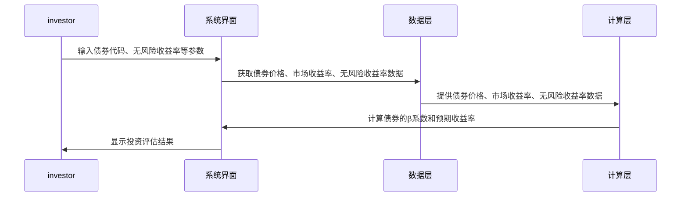
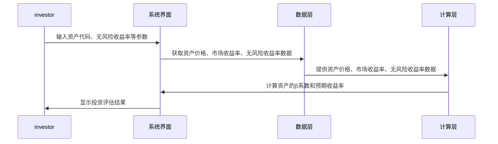
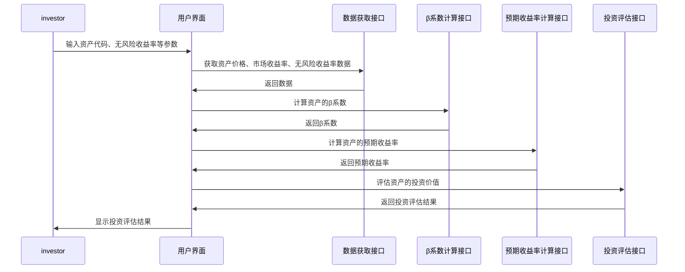

                 


### 第1章: CAPM的历史背景与理论基础

#### 1.1.1 CAPM的提出与发展

资本资产定价模型（Capital Asset Pricing Model，简称CAPM）是由著名美国经济学家威廉·夏普（William Sharpe）于1964年首次提出的。这一模型是对现代金融理论的重要贡献，旨在解释资产预期收益与风险之间的关系。CAPM的出现，为资产定价提供了新的理论基础，也为投资组合管理提供了重要工具。

CAPM的提出背景可以追溯到20世纪50年代末期和60年代初期。当时，经济学家们对于资本市场的效率和市场均衡进行了深入的研究，但关于资产定价的问题仍存在诸多争议。威廉·夏普通过分析大量市场数据，提出了CAPM模型，该模型考虑了市场风险和个别资产的风险，从而为资产定价提供了一个统一的框架。

在CAPM提出后的几十年里，它得到了广泛的应用和发展。不仅在经济和金融领域，CAPM也被广泛应用于投资组合管理、资产评估、风险管理等方面。此外，许多学者也对CAPM进行了拓展和改进，提出了诸如套利定价理论（APT）等新的模型，但这些模型在很大程度上仍受到CAPM的影响。

#### 1.1.2 CAPM的基本假设与逻辑

CAPM建立在一系列基本假设之上，这些假设构成了CAPM的理论基础。以下是CAPM的主要假设：

1. **市场均衡**：市场处于均衡状态，所有投资者都根据预期收益和风险进行理性投资。
2. **投资者风险厌恶**：投资者普遍厌恶风险，追求最大化预期效用。
3. **资本市场效率**：市场信息充分，投资者可以无限制地买卖任何资产，不存在交易成本。
4. **单一市场因素**：资产的风险可以通过市场组合的波动来衡量，即市场因素是影响资产收益的主要因素。
5. **资产的收益呈正态分布**：资产的收益和风险可以表示为正态分布。

基于这些假设，CAPM的逻辑可以概括为以下几点：

- 每个资产的期望收益率由两部分组成：无风险收益率和风险溢价。
- 风险溢价与资产的β系数（Beta Coefficient）成正比，β系数衡量了资产对市场波动的敏感度。
- 无风险收益率通常由政府债券的收益率来代表，因为政府债券被认为几乎没有风险。
- 投资者的最优投资组合是市场组合，即持有所有资产的组合。

#### 1.1.3 CAPM的数学模型

CAPM的数学模型是理解其核心原理的关键。该模型的基本公式如下：

\[ E(R_i) = R_f + \beta_i \times [E(R_m) - R_f] \]

其中：
- \( E(R_i) \) 是资产 \( i \) 的预期收益率；
- \( R_f \) 是无风险收益率；
- \( \beta_i \) 是资产 \( i \) 的β系数，表示资产 \( i \) 的风险与市场风险的关联程度；
- \( E(R_m) \) 是市场组合的预期收益率。

公式中的 \( E(R_m) - R_f \) 表示市场风险溢价，即市场组合的额外期望收益。β系数衡量了资产 \( i \) 的风险相对于市场风险的相对水平。如果 \( \beta_i \) 较大，说明资产 \( i \) 对市场波动的敏感度较高，风险也较大；反之，如果 \( \beta_i \) 较小，则说明资产 \( i \) 的风险较低。

通过CAPM的数学模型，投资者可以计算不同资产的风险与收益，从而做出更为合理的投资决策。这一模型不仅为资产定价提供了理论基础，也为价值投资策略的制定提供了重要工具。

### 第2章: CAPM的核心概念与联系

#### 2.1.1 资本资产定价模型的关键术语

在深入探讨CAPM的核心概念之前，我们需要明确一些关键术语，这些术语是理解CAPM的基础。

1. **预期收益率（Expected Return）**：预期收益率是指投资者对未来某个时间段内资产收益的平均预期。在CAPM模型中，资产的预期收益率是其风险和回报的体现。

2. **无风险收益率（Risk-Free Rate）**：无风险收益率是指投资者在无风险情况下可以获得的收益，通常由政府债券的收益率代表。在CAPM模型中，无风险收益率是计算资产预期收益率的重要参考。

3. **β系数（Beta Coefficient）**：β系数是衡量资产或投资组合对市场风险的敏感度的指标。一个资产的β系数大于1，说明其风险大于市场平均风险；小于1，则说明其风险小于市场平均风险。

4. **市场组合（Market Portfolio）**：市场组合是指包含市场上所有资产的组合，其收益率代表了市场整体的表现。在CAPM模型中，市场组合是投资者决策的重要参考。

5. **市场风险溢价（Market Risk Premium）**：市场风险溢价是指投资者因承担市场风险而要求的额外收益。市场风险溢价等于市场组合的预期收益率减去无风险收益率。

#### 2.1.2 CAPM中的风险与收益

在CAPM模型中，风险与收益是两个核心概念。以下是它们在CAPM模型中的具体体现：

1. **风险**：CAPM模型中的风险分为两部分：系统风险（或市场风险）和非系统风险（或个别风险）。
   - 系统风险是指整个市场或经济系统面临的共同风险，无法通过分散投资来消除。市场组合的波动主要由系统风险引起。
   - 非系统风险是指特定资产或行业特有的风险，可以通过投资组合的分散化来降低。

2. **收益**：CAPM模型认为，资产的预期收益率由两部分构成：
   - 无风险收益：这部分收益是投资者在无风险情况下可以获得的，通常由政府债券的收益率代表。
   - 风险溢价：这部分收益是投资者因承担系统风险而获得的额外收益，与资产的β系数成正比。

通过CAPM模型，投资者可以计算资产或投资组合的预期收益率，并据此评估其风险和收益的平衡。这一过程为投资决策提供了重要的理论依据。

#### 2.1.3 核心概念对比分析表

为了更好地理解CAPM中的核心概念，我们可以通过一个对比分析表来展示它们之间的联系与区别：

| 核心概念       | 定义与含义                                                         | 在CAPM中的作用                                     |
|----------------|-------------------------------------------------------------------|---------------------------------------------------|
| 预期收益率     | 投资者对未来资产收益的平均预期。                                  | 是CAPM模型中的核心输出，用于评估资产的风险与回报。 |
| 无风险收益率   | 无风险资产（如政府债券）的收益率。                                | 是CAPM模型中的一个重要参数，用于计算风险溢价。     |
| β系数          | 衡量资产或投资组合对市场风险的敏感度。                            | 是CAPM模型中衡量风险的重要指标。                   |
| 市场组合       | 包含市场上所有资产的组合，代表市场整体表现。                      | 是CAPM模型中的基准，用于与个别资产进行比较。       |
| 市场风险溢价   | 市场组合的预期收益率减去无风险收益率。                            | 是投资者承担系统风险所要求的额外收益。              |

通过上述对比分析表，我们可以更清晰地理解CAPM中的核心概念，以及它们在资产定价和投资决策中的作用。

#### 2.1.4 CAPM的ER实体关系图

为了更直观地展示CAPM中的核心概念及其相互关系，我们可以绘制一个实体关系图（Entity-Relationship Diagram，简称ER图）。以下是CAPM的ER图：

```mermaid
erDiagram
  预期收益率 ||--|{ 无风险收益率 }|
  预期收益率 ||--|{ β系数 }|
  预期收益率 ||--|{ 市场组合 }|
  无风险收益率 ||--|{ 市场风险溢价 }|
  β系数 ||--|{ 市场组合 }
  市场组合 ||--|{ 资产 }
  市场组合 ||--|{ 风险溢价 }
```

在这个ER图中，每个实体（如预期收益率、无风险收益率、β系数等）都表示CAPM中的一个关键概念，而实体之间的关系则展示了它们在模型中的相互联系。例如，预期收益率与无风险收益率、β系数和市场组合之间存在直接关系，而市场组合与资产和市场风险溢价之间也存在联系。

通过ER图，我们可以更直观地理解CAPM中的核心概念及其在资产定价和投资决策中的作用。这不仅有助于我们深入理解CAPM的理论基础，也为实际应用提供了有益的参考。

### 第3章: CAPM在价值投资中的应用原理

#### 3.1.1 价值投资的基本理念

价值投资（Value Investing）是一种以长期投资为目标，通过寻找价格低于其内在价值的股票进行投资，以期获得超额收益的投资策略。这一理念源于本杰明·格雷厄姆（Benjamin Graham）和戴维·多德（David Dodd）的著作《证券分析》（Security Analysis）。价值投资的基本理念可以概括为以下几点：

1. **价格与价值的关系**：价值投资认为，市场价格是由投资者的心理预期和情绪驱动的，而资产的真实价值则是由其内在质量决定的。当市场价格低于资产的真实价值时，便出现了投资机会。

2. **深度分析**：价值投资强调对股票进行深入的基本面分析，包括公司的财务状况、业务模式、竞争优势、管理团队等方面。通过全面分析，投资者可以识别出那些被市场低估的优秀公司。

3. **长期持有**：价值投资主张长期持有优质股票，因为市场往往需要时间来认识到股票的真实价值。短期市场波动对长期价值投资者来说无关紧要。

4. **风险控制**：价值投资强调风险控制，通过分散投资和合理的仓位管理来降低风险。即使是最优秀的股票，如果投资过量，也可能导致巨大的损失。

#### 3.1.2 CAPM在价值投资中的适用性

资本资产定价模型（CAPM）在价值投资中具有很高的适用性，主要体现在以下几个方面：

1. **评估风险与收益**：CAPM提供了一个科学的方法来评估资产的风险与收益。通过计算资产的β系数，投资者可以了解资产的市场风险，从而对投资组合进行优化。

2. **确定合理的预期收益率**：CAPM模型可以帮助投资者确定一个合理的预期收益率，这是价值投资决策的重要依据。投资者可以通过CAPM计算出股票的预期收益率，并与市场收益率进行比较，从而判断股票是否被低估。

3. **优化投资组合**：CAPM模型为投资者提供了优化投资组合的工具。通过调整投资组合中各资产的权重，投资者可以实现风险与收益的平衡，提高投资组合的整体表现。

4. **投资决策的依据**：CAPM模型在价值投资中为投资决策提供了有力的理论支持。投资者可以根据CAPM的预测结果，结合对股票的基本面分析，做出更为明智的投资决策。

#### 3.1.3 CAPM与价值投资的联系与融合

CAPM与价值投资之间存在紧密的联系，两者可以相互融合，为投资者提供更加全面的投资策略。

1. **风险与收益的统一**：CAPM模型提供了衡量资产风险与收益的标准，这与价值投资强调的基本面分析和长期持有策略相契合。投资者可以通过CAPM计算出股票的风险与收益，从而在基本面分析的基础上，对投资机会进行更精确的评估。

2. **市场评估与公司价值的结合**：价值投资关注的是股票的市场价格与其内在价值之间的差异，而CAPM模型通过β系数和预期收益率的计算，提供了市场对股票定价的参考。投资者可以将市场评估结果与公司价值分析相结合，判断股票是否被低估。

3. **投资组合优化**：CAPM模型可以帮助投资者优化投资组合，实现风险与收益的平衡。价值投资者可以通过CAPM计算不同股票的风险与收益，调整投资组合的权重，以最大限度地提高投资组合的整体收益。

4. **投资策略的完善**：CAPM为价值投资提供了一种科学的评估工具，使投资决策更加严谨。价值投资者可以利用CAPM的结果，结合对公司的深入研究，完善其投资策略，提高投资成功率。

总之，CAPM与价值投资相互融合，为投资者提供了一种全面、科学、系统的投资策略。通过结合CAPM的评估方法和价值投资的基本理念，投资者可以更加有效地识别投资机会，优化投资组合，实现长期稳定的投资收益。

#### 3.1.4 应用CAPM的数学模型与公式

在价值投资中，CAPM的数学模型是评估股票预期收益率的重要工具。CAPM的基本公式为：

\[ E(R_i) = R_f + \beta_i \times [E(R_m) - R_f] \]

其中，\( E(R_i) \) 是资产 \( i \) 的预期收益率，\( R_f \) 是无风险收益率，\( \beta_i \) 是资产 \( i \) 的β系数，\( E(R_m) \) 是市场组合的预期收益率。

为了更好地理解CAPM在价值投资中的应用，我们可以通过以下步骤进行详细分析：

1. **确定无风险收益率**：首先，投资者需要确定无风险收益率 \( R_f \)。在实务中，通常使用短期政府债券的收益率作为无风险收益率。例如，美国投资者可能会使用美国国债的收益率。

2. **计算市场组合的预期收益率**：接下来，投资者需要估算市场组合的预期收益率 \( E(R_m) \)。这通常通过历史数据和市场预期来计算。市场组合的预期收益率代表了市场的平均预期收益。

3. **确定资产的β系数**：资产的β系数 \( \beta_i \) 是衡量资产对市场风险的敏感度。β系数可以通过历史数据回归分析得出，也可以通过市场分析师的判断来确定。

4. **计算资产的预期收益率**：利用CAPM公式，投资者可以计算资产的预期收益率 \( E(R_i) \)。这一结果反映了资产在市场风险环境下的预期收益。

5. **评估投资机会**：通过比较资产的预期收益率与无风险收益率，投资者可以判断资产是否被低估。如果资产的预期收益率高于无风险收益率，且高于市场预期收益率，则可能存在投资机会。

为了更直观地理解CAPM在价值投资中的应用，我们可以通过一个简单的例子来展示：

假设投资者需要评估某只股票的投资机会，已知以下参数：

- 无风险收益率 \( R_f = 2\% \)
- 市场组合的预期收益率 \( E(R_m) = 7\% \)
- 该股票的β系数 \( \beta_i = 1.2 \)

根据CAPM公式，我们可以计算该股票的预期收益率：

\[ E(R_i) = 2\% + 1.2 \times (7\% - 2\%) = 2\% + 1.2 \times 5\% = 2\% + 6\% = 8\% \]

因此，该股票的预期收益率是8%。投资者可以将这一结果与无风险收益率和市场预期收益率进行比较，以评估投资机会。如果该股票的预期收益率高于市场预期收益率，且高于无风险收益率，则投资者可能会认为该股票被低估，值得进一步关注。

通过上述分析和计算，我们可以看到，CAPM在价值投资中具有重要作用。它不仅为投资者提供了评估股票预期收益率的方法，也为价值投资决策提供了科学依据。投资者可以利用CAPM模型，结合对公司的深入研究，制定更加有效的投资策略，实现长期稳定的投资收益。

### 第4章: CAPM在价值投资中的实际应用

#### 4.1.1 实际案例研究

为了更好地理解CAPM在价值投资中的应用，我们可以通过几个实际案例来展示其具体操作过程和效果。

**案例一：股票A的投资分析**

假设投资者A对某只股票A进行价值投资分析，已知以下参数：

- 无风险收益率 \( R_f = 2\% \)
- 市场组合的预期收益率 \( E(R_m) = 6\% \)
- 该股票的β系数 \( \beta_i = 1.1 \)

利用CAPM公式，我们可以计算股票A的预期收益率：

\[ E(R_i) = 2\% + 1.1 \times (6\% - 2\%) = 2\% + 1.1 \times 4\% = 2\% + 4.4\% = 6.4\% \]

根据计算结果，股票A的预期收益率是6.4%。投资者A可以将这一结果与无风险收益率和市场预期收益率进行比较：

- 预期收益率（6.4%） > 无风险收益率（2%）
- 预期收益率（6.4%） > 市场预期收益率（6%）

因此，股票A的预期收益率高于无风险收益率和市场预期收益率，说明股票A可能被低估，存在投资机会。投资者A可以进一步对股票A的基本面进行深入分析，以确认其投资价值。

**案例二：股票B的投资分析**

假设投资者B对另一只股票B进行价值投资分析，已知以下参数：

- 无风险收益率 \( R_f = 2\% \)
- 市场组合的预期收益率 \( E(R_m) = 7\% \)
- 该股票的β系数 \( \beta_i = 1.3 \)

利用CAPM公式，我们可以计算股票B的预期收益率：

\[ E(R_i) = 2\% + 1.3 \times (7\% - 2\%) = 2\% + 1.3 \times 5\% = 2\% + 6.5\% = 8.5\% \]

根据计算结果，股票B的预期收益率是8.5%。投资者B可以将这一结果与无风险收益率和市场预期收益率进行比较：

- 预期收益率（8.5%） > 无风险收益率（2%）
- 预期收益率（8.5%） > 市场预期收益率（7%）

因此，股票B的预期收益率同样高于无风险收益率和市场预期收益率，表明股票B可能被低估，具有投资潜力。投资者B可以进一步进行基本面分析，以确定投资决策。

**案例三：股票C的投资分析**

假设投资者C对第三只股票C进行价值投资分析，已知以下参数：

- 无风险收益率 \( R_f = 2\% \)
- 市场组合的预期收益率 \( E(R_m) = 6\% \)
- 该股票的β系数 \( \beta_i = 0.8 \)

利用CAPM公式，我们可以计算股票C的预期收益率：

\[ E(R_i) = 2\% + 0.8 \times (6\% - 2\%) = 2\% + 0.8 \times 4\% = 2\% + 3.2\% = 5.2\% \]

根据计算结果，股票C的预期收益率是5.2%。投资者C可以将这一结果与无风险收益率和市场预期收益率进行比较：

- 预期收益率（5.2%） < 无风险收益率（2%）
- 预期收益率（5.2%） < 市场预期收益率（6%）

因此，股票C的预期收益率低于无风险收益率和市场预期收益率，这表明股票C可能被高估，投资风险较大。投资者C应该进一步分析股票C的基本面，考虑是否继续持有或调整投资组合。

通过以上实际案例，我们可以看到CAPM在价值投资中的具体应用。通过计算资产的预期收益率，并与无风险收益率和市场预期收益率进行比较，投资者可以识别出被低估的股票，从而制定合理的投资策略。同时，这些案例也展示了CAPM在投资决策中的灵活性和实用性，使其成为价值投资的重要工具。

#### 4.1.2 模型参数的选择与调整

在实际应用CAPM模型进行价值投资时，选择和调整模型参数是关键的一步。以下是一些常见参数的选择和调整方法：

1. **无风险收益率（\( R_f \)）**：
   - 通常使用短期政府债券的收益率作为无风险收益率。选择哪个时间段内的政府债券收益率，需要考虑市场环境、利率水平和投资者风险偏好。
   - 为了更准确地反映当前市场状况，投资者可以参考多个期限的政府债券收益率，并采用加权平均的方法确定无风险收益率。

2. **市场组合的预期收益率（\( E(R_m) \)）**：
   - 市场组合的预期收益率可以通过历史数据和市场预期来估算。投资者可以使用过去几年的市场收益率作为参考，并结合当前市场环境进行预测。
   - 为了提高预测的准确性，投资者可以参考多个市场指数（如标准普尔500指数、纳斯达克指数等），并采用加权平均的方法确定市场组合的预期收益率。

3. **β系数（\( \beta_i \)）**：
   - β系数的确定通常通过历史数据回归分析得出。投资者可以使用股票的历史收益率与市场组合的历史收益率进行回归分析，得出β系数的估计值。
   - 对于新上市或数据较少的股票，投资者可以参考同行业或相似类型的股票的β系数，并结合对公司基本面的分析进行调整。

在调整模型参数时，投资者需要注意以下几点：

- **参数的时效性**：市场环境不断变化，参数也需要进行定期调整。投资者应定期检查参数的有效性，并根据市场变化进行调整。
- **数据的准确性**：参数的估算依赖于历史数据和市场预测，因此数据的质量直接影响参数的准确性。投资者应确保使用的数据来源可靠，并尽可能采用多源数据验证。
- **风险的平衡**：在调整参数时，投资者需要平衡风险与收益。例如，如果市场预期收益率较低，则可能需要调整β系数，以降低资产的风险水平。

通过科学选择和调整模型参数，投资者可以提高CAPM模型在价值投资中的有效性，从而做出更加准确的投资决策。

#### 4.1.3 CAPM在价值投资中的挑战与对策

尽管CAPM在价值投资中具有重要作用，但其应用过程中也面临一些挑战。以下是一些常见的挑战及其对策：

1. **市场波动性**：
   - **挑战**：市场波动性较大，导致CAPM的预测结果不稳定。
   - **对策**：采用历史模拟法或蒙特卡罗模拟法，通过模拟不同市场环境下的资产收益，提高CAPM预测的稳健性。同时，结合其他风险管理工具，如止损策略和分散投资，降低市场波动对投资决策的影响。

2. **参数选择**：
   - **挑战**：参数选择对CAPM预测结果影响较大，但市场环境变化快，参数调整不及时可能导致预测误差。
   - **对策**：建立参数动态调整机制，定期评估参数的有效性，并根据市场变化进行调整。同时，参考多个数据源和专家意见，提高参数选择的准确性和可靠性。

3. **β系数的确定**：
   - **挑战**：β系数的确定依赖于历史数据，但市场环境变化可能导致β系数不稳定。
   - **对策**：采用多种方法确定β系数，如回归分析法、同行业比较法等。同时，结合对公司基本面的分析，调整β系数的估算值，提高其准确性。

4. **市场均衡假设**：
   - **挑战**：CAPM假设市场处于均衡状态，但实际市场常常存在非均衡现象。
   - **对策**：采用动态市场模型，如ARIMA模型或GARCH模型，分析市场非均衡状态下的资产收益。通过模型修正，提高CAPM在非均衡市场环境中的应用效果。

5. **数据质量问题**：
   - **挑战**：数据质量直接影响CAPM的预测结果，但市场数据往往存在噪声和不完整性。
   - **对策**：采用数据清洗和预处理技术，提高数据质量。同时，结合多种数据源，交叉验证数据准确性，降低数据噪声对预测结果的影响。

通过以上对策，投资者可以更好地应对CAPM在价值投资中的应用挑战，提高投资决策的科学性和有效性。

### 第5章: 实战一：CAPM在股票投资中的应用

#### 5.1.1 股票投资背景介绍

股票投资是资本市场中最常见的投资方式之一，它通过购买股票来获得企业的所有权，并期望通过股票价格的上涨或分红获得收益。然而，股票市场波动较大，投资者需要对市场风险和收益进行合理评估，以制定有效的投资策略。

在本章的实战中，我们将应用CAPM模型对股票投资进行评估，通过计算股票的预期收益率和风险，帮助投资者做出更为明智的投资决策。

首先，我们需要了解CAPM模型的基本概念和原理。CAPM模型由著名经济学家威廉·夏普提出，它通过无风险收益率和β系数来评估资产的预期收益率和风险。具体公式为：

\[ E(R_i) = R_f + \beta_i \times [E(R_m) - R_f] \]

其中，\( E(R_i) \) 是资产 \( i \) 的预期收益率，\( R_f \) 是无风险收益率，\( \beta_i \) 是资产 \( i \) 的β系数，\( E(R_m) \) 是市场组合的预期收益率。

接下来，我们将通过以下步骤来应用CAPM模型进行股票投资评估：

1. **确定无风险收益率**：通常使用短期政府债券的收益率作为无风险收益率。
2. **计算市场组合的预期收益率**：通过历史数据和市场预期来估算市场组合的预期收益率。
3. **确定股票的β系数**：通过历史数据回归分析或市场分析师的判断来确定股票的β系数。
4. **计算股票的预期收益率**：利用CAPM公式计算股票的预期收益率。
5. **评估股票的投资价值**：通过比较股票的预期收益率和无风险收益率，判断股票是否被低估。

#### 5.1.2 系统功能设计与架构

为了实现CAPM在股票投资中的应用，我们需要设计一个系统，该系统应具备以下功能：

1. **数据获取**：从外部数据源获取股票价格、市场收益率、无风险收益率等数据。
2. **β系数计算**：通过历史数据回归分析计算股票的β系数。
3. **预期收益率计算**：利用CAPM公式计算股票的预期收益率。
4. **投资评估**：根据预期收益率和无风险收益率，评估股票的投资价值。
5. **用户界面**：提供用户友好的界面，方便用户输入参数、查看结果。

系统的总体架构如下：

1. **数据层**：负责从外部数据源获取股票价格、市场收益率、无风险收益率等数据。
2. **计算层**：负责计算股票的β系数和预期收益率。
3. **应用层**：负责实现投资评估功能，提供用户界面。
4. **用户层**：投资者通过用户界面输入参数，查看投资评估结果。

以下是一个简单的系统架构图：


通过上述系统架构，投资者可以方便地输入参数，系统将自动计算股票的β系数和预期收益率，并提供投资评估结果。

#### 5.1.3 系统接口设计与交互

为了实现系统的功能，我们需要设计合理的接口，以便数据层、计算层和应用层之间能够顺畅地交互。以下是系统的主要接口设计：

1. **数据获取接口**：用于从外部数据源获取股票价格、市场收益率、无风险收益率等数据。该接口应支持多种数据格式，如CSV、JSON等，并具备数据清洗和预处理功能。
2. **β系数计算接口**：用于计算股票的β系数。该接口应支持历史数据回归分析，并能够根据市场环境调整β系数的估算方法。
3. **预期收益率计算接口**：用于计算股票的预期收益率。该接口应接收股票价格、市场收益率、无风险收益率和β系数等参数，并输出预期收益率。
4. **投资评估接口**：用于根据预期收益率和无风险收益率，评估股票的投资价值。该接口应提供多种评估方法，如简单比较法、加权评分法等。
5. **用户界面接口**：用于与用户进行交互，接收用户输入的参数，显示投资评估结果。该接口应支持多种界面风格，如Web界面、桌面应用程序等。

以下是一个简单的接口交互图：


通过上述接口设计，系统可以方便地实现数据获取、β系数计算、预期收益率计算和投资评估等功能，并提供用户友好的界面，方便投资者进行股票投资评估。

#### 5.1.4 实战案例分析与代码实现

在本节中，我们将通过一个具体的实战案例，展示如何使用CAPM模型对股票进行投资评估，并给出相应的Python代码实现。

**案例背景**：投资者A计划投资某只股票B，已知以下参数：

- 无风险收益率 \( R_f = 2\% \)
- 市场组合的预期收益率 \( E(R_m) = 6\% \)
- 股票B的β系数 \( \beta_i = 1.2 \)

**目标**：利用CAPM模型计算股票B的预期收益率，并评估其投资价值。

**代码实现**：

1. 导入所需库：

```python
import numpy as np
```

2. 定义CAPM公式函数：

```python
def calculate_expected_return(risk_free_rate, beta, market_return):
    expected_return = risk_free_rate + beta * (market_return - risk_free_rate)
    return expected_return
```

3. 输入参数并计算股票B的预期收益率：

```python
# 输入参数
R_f = 0.02  # 无风险收益率
beta_i = 1.2  # 股票B的β系数
E_R_m = 0.06  # 市场组合的预期收益率

# 计算股票B的预期收益率
expected_return = calculate_expected_return(R_f, beta_i, E_R_m)
print(f"股票B的预期收益率：{expected_return:.2%}")
```

4. 评估股票B的投资价值：

```python
# 评估投资价值
if expected_return > R_f:
    print("股票B的投资价值较高，可以考虑投资。")
else:
    print("股票B的投资价值较低，需谨慎考虑。")
```

**代码解释**：

- 第一步，我们导入Python的NumPy库，用于进行数值计算。
- 第二步，我们定义了一个名为 `calculate_expected_return` 的函数，该函数接收无风险收益率、β系数和市场预期收益率，并返回计算得到的预期收益率。
- 第三步，我们输入已知参数，调用函数计算股票B的预期收益率，并打印输出。
- 第四步，我们根据计算得到的预期收益率，判断股票B的投资价值，并给出相应的投资建议。

通过上述代码实现，我们可以方便地利用CAPM模型对股票进行投资评估，并根据评估结果做出投资决策。

#### 5.1.5 项目小结

在本章的实战中，我们通过一个具体的案例，展示了如何使用CAPM模型对股票进行投资评估。从系统功能设计、接口设计到代码实现，我们详细介绍了CAPM模型在股票投资中的应用过程。

通过本章的学习，我们了解到：

1. **股票投资背景**：股票投资是资本市场中最常见的投资方式之一，投资者需要合理评估市场风险和收益。
2. **CAPM模型原理**：CAPM模型通过无风险收益率和β系数评估资产的预期收益率和风险，为投资者提供了科学的评估工具。
3. **系统功能设计**：我们设计了一个具备数据获取、β系数计算、预期收益率计算和投资评估功能的系统，实现了CAPM模型在股票投资中的实际应用。
4. **代码实现**：我们通过Python代码实现了一个简单的CAPM模型，展示了如何计算股票的预期收益率，并根据预期收益率评估股票的投资价值。

通过本章的实战，我们不仅掌握了CAPM模型的基本原理和应用方法，还学会了如何将理论应用于实际投资决策中，为后续的深入学习和实践打下了坚实基础。

### 第6章: 实战二：CAPM在债券投资中的应用

#### 6.1.1 债券投资背景介绍

债券投资是资本市场中的重要组成部分，与股票投资相比，债券投资具有风险较低、收益稳定的特点。债券投资通常包括政府债券、企业债券和地方政府债券等类型，投资者通过购买债券获得固定的利息收入和到期时的本金回报。

在本章的实战中，我们将应用CAPM模型对债券投资进行评估，通过计算债券的预期收益率和风险，帮助投资者做出更为明智的投资决策。

首先，我们需要了解CAPM模型的基本概念和原理。CAPM模型由著名经济学家威廉·夏普提出，它通过无风险收益率和β系数来评估资产的预期收益率和风险。具体公式为：

\[ E(R_i) = R_f + \beta_i \times [E(R_m) - R_f] \]

其中，\( E(R_i) \) 是资产 \( i \) 的预期收益率，\( R_f \) 是无风险收益率，\( \beta_i \) 是资产 \( i \) 的β系数，\( E(R_m) \) 是市场组合的预期收益率。

接下来，我们将通过以下步骤来应用CAPM模型进行债券投资评估：

1. **确定无风险收益率**：通常使用短期政府债券的收益率作为无风险收益率。
2. **计算市场组合的预期收益率**：通过历史数据和市场预期来估算市场组合的预期收益率。
3. **确定债券的β系数**：通过历史数据回归分析或市场分析师的判断来确定债券的β系数。
4. **计算债券的预期收益率**：利用CAPM公式计算债券的预期收益率。
5. **评估债券的投资价值**：通过比较债券的预期收益率和无风险收益率，判断债券是否被低估。

#### 6.1.2 系统功能设计与架构

为了实现CAPM模型在债券投资中的应用，我们需要设计一个系统，该系统应具备以下功能：

1. **数据获取**：从外部数据源获取债券价格、市场收益率、无风险收益率等数据。
2. **β系数计算**：通过历史数据回归分析计算债券的β系数。
3. **预期收益率计算**：利用CAPM公式计算债券的预期收益率。
4. **投资评估**：根据预期收益率和无风险收益率，评估债券的投资价值。
5. **用户界面**：提供用户友好的界面，方便用户输入参数、查看结果。

系统的总体架构如下：

1. **数据层**：负责从外部数据源获取债券价格、市场收益率、无风险收益率等数据。
2. **计算层**：负责计算债券的β系数和预期收益率。
3. **应用层**：负责实现投资评估功能，提供用户界面。
4. **用户层**：投资者通过用户界面输入参数，查看投资评估结果。

以下是一个简单的系统架构图：



通过上述系统架构，投资者可以方便地输入参数，系统将自动计算债券的β系数和预期收益率，并提供投资评估结果。

#### 6.1.3 系统接口设计与交互

为了实现系统的功能，我们需要设计合理的接口，以便数据层、计算层和应用层之间能够顺畅地交互。以下是系统的主要接口设计：

1. **数据获取接口**：用于从外部数据源获取债券价格、市场收益率、无风险收益率等数据。该接口应支持多种数据格式，如CSV、JSON等，并具备数据清洗和预处理功能。
2. **β系数计算接口**：用于计算债券的β系数。该接口应支持历史数据回归分析，并能够根据市场环境调整β系数的估算方法。
3. **预期收益率计算接口**：用于计算债券的预期收益率。该接口应接收债券价格、市场收益率、无风险收益率和β系数等参数，并输出预期收益率。
4. **投资评估接口**：用于根据预期收益率和无风险收益率，评估债券的投资价值。该接口应提供多种评估方法，如简单比较法、加权评分法等。
5. **用户界面接口**：用于与用户进行交互，接收用户输入的参数，显示投资评估结果。该接口应支持多种界面风格，如Web界面、桌面应用程序等。

以下是一个简单的接口交互图：


通过上述接口设计，系统可以方便地实现数据获取、β系数计算、预期收益率计算和投资评估等功能，并提供用户友好的界面，方便投资者进行债券投资评估。

#### 6.1.4 实战案例分析与代码实现

在本节中，我们将通过一个具体的实战案例，展示如何使用CAPM模型对债券进行投资评估，并给出相应的Python代码实现。

**案例背景**：投资者C计划投资某只债券D，已知以下参数：

- 无风险收益率 \( R_f = 2\% \)
- 市场组合的预期收益率 \( E(R_m) = 4\% \)
- 债券D的β系数 \( \beta_i = 0.8 \)

**目标**：利用CAPM模型计算债券D的预期收益率，并评估其投资价值。

**代码实现**：

1. 导入所需库：

```python
import numpy as np
```

2. 定义CAPM公式函数：

```python
def calculate_expected_return(risk_free_rate, beta, market_return):
    expected_return = risk_free_rate + beta * (market_return - risk_free_rate)
    return expected_return
```

3. 输入参数并计算债券D的预期收益率：

```python
# 输入参数
R_f = 0.02  # 无风险收益率
beta_i = 0.8  # 债券D的β系数
E_R_m = 0.04  # 市场组合的预期收益率

# 计算债券D的预期收益率
expected_return = calculate_expected_return(R_f, beta_i, E_R_m)
print(f"债券D的预期收益率：{expected_return:.2%}")
```

4. 评估债券D的投资价值：

```python
# 评估投资价值
if expected_return > R_f:
    print("债券D的投资价值较高，可以考虑投资。")
else:
    print("债券D的投资价值较低，需谨慎考虑。")
```

**代码解释**：

- 第一步，我们导入Python的NumPy库，用于进行数值计算。
- 第二步，我们定义了一个名为 `calculate_expected_return` 的函数，该函数接收无风险收益率、β系数和市场预期收益率，并返回计算得到的预期收益率。
- 第三步，我们输入已知参数，调用函数计算债券D的预期收益率，并打印输出。
- 第四步，我们根据计算得到的预期收益率，判断债券D的投资价值，并给出相应的投资建议。

通过上述代码实现，我们可以方便地利用CAPM模型对债券进行投资评估，并根据评估结果做出投资决策。

#### 6.1.5 项目小结

在本章的实战中，我们通过一个具体的案例，展示了如何使用CAPM模型对债券进行投资评估。从系统功能设计、接口设计到代码实现，我们详细介绍了CAPM模型在债券投资中的应用过程。

通过本章的学习，我们了解到：

1. **债券投资背景**：债券投资是资本市场中的重要组成部分，具有风险较低、收益稳定的特点。
2. **CAPM模型原理**：CAPM模型通过无风险收益率和β系数评估资产的预期收益率和风险，为投资者提供了科学的评估工具。
3. **系统功能设计**：我们设计了一个具备数据获取、β系数计算、预期收益率计算和投资评估功能的系统，实现了CAPM模型在债券投资中的实际应用。
4. **代码实现**：我们通过Python代码实现了一个简单的CAPM模型，展示了如何计算债券的预期收益率，并根据预期收益率评估债券的投资价值。

通过本章的实战，我们不仅掌握了CAPM模型的基本原理和应用方法，还学会了如何将理论应用于实际投资决策中，为后续的深入学习和实践打下了坚实基础。

### 第7章: 实战三：CAPM在其他资产类别中的应用

#### 7.1.1 其他资产类别投资背景介绍

在传统的股票和债券投资之外，投资者还可以选择其他类型的资产进行投资，如房地产、大宗商品、外汇等。这些资产类别具有各自的特点和投资策略，但它们同样受到市场风险和收益的影响。在本章中，我们将探讨如何将CAPM模型应用于这些其他资产类别，以帮助投资者评估其投资价值和风险。

**房地产投资**：房地产投资涉及购买、持有和出售房地产资产，以获取租金收入和资本增值。房地产市场的波动性较大，但长期来看，房地产通常被视为相对稳定的投资。房地产投资的风险包括市场供需变化、利率波动和法律法规变化等。

**大宗商品投资**：大宗商品投资包括购买黄金、石油、铜等实物商品或其衍生品，以获得价格变动带来的收益。大宗商品市场受全球经济、地缘政治、供需关系等因素的影响，具有较高的波动性和风险。

**外汇投资**：外汇投资涉及不同国家货币之间的交易，以获得汇率变动带来的收益。外汇市场是全球最大的金融市场之一，交易量巨大，但波动性也较高。外汇投资的风险包括利率差异、经济数据变动和政治风险等。

#### 7.1.2 系统功能设计与架构

为了将CAPM模型应用于其他资产类别，我们需要设计一个扩展性的系统，该系统能够处理不同类型资产的特有数据，并计算其预期收益率和风险。以下是系统功能设计：

1. **数据获取**：从外部数据源获取各类资产的实时价格、市场收益率、无风险收益率等数据。数据源可能包括金融交易平台、交易所、金融数据服务提供商等。

2. **β系数计算**：根据资产类别和具体数据，通过历史数据回归分析计算各类资产的β系数。不同资产类别的β系数计算方法可能有所不同，需要针对每种资产进行优化。

3. **预期收益率计算**：利用CAPM公式计算各类资产的预期收益率。对于房地产和大宗商品等实物资产，可能需要结合市场特性和具体投资策略进行调整。

4. **投资评估**：根据预期收益率和无风险收益率，评估各类资产的投资价值。系统应提供多种评估方法，以适应不同投资者的需求。

5. **用户界面**：提供用户友好的界面，方便用户输入参数、查看投资评估结果。界面应支持多种资产类别和投资策略的切换，以及自定义参数的输入。

系统的总体架构如下：

1. **数据层**：负责从外部数据源获取各类资产的数据。
2. **计算层**：负责计算资产的β系数和预期收益率。
3. **应用层**：负责实现投资评估功能，提供用户界面。
4. **用户层**：投资者通过用户界面进行投资评估和决策。

以下是一个简单的系统架构图：



通过上述系统架构，投资者可以方便地输入参数，系统将自动计算资产的β系数和预期收益率，并提供投资评估结果。

#### 7.1.3 系统接口设计与交互

为了实现系统的功能，我们需要设计合理的接口，以便数据层、计算层和应用层之间能够顺畅地交互。以下是系统的主要接口设计：

1. **数据获取接口**：用于从外部数据源获取各类资产的数据。该接口应支持多种数据格式，如CSV、JSON、API等，并具备数据清洗和预处理功能。
2. **β系数计算接口**：用于计算各类资产的β系数。该接口应支持历史数据回归分析，并能够根据市场环境调整β系数的估算方法。
3. **预期收益率计算接口**：用于计算各类资产的预期收益率。该接口应接收资产价格、市场收益率、无风险收益率和β系数等参数，并输出预期收益率。
4. **投资评估接口**：用于根据预期收益率和无风险收益率，评估各类资产的投资价值。该接口应提供多种评估方法，如简单比较法、加权评分法等。
5. **用户界面接口**：用于与用户进行交互，接收用户输入的参数，显示投资评估结果。该接口应支持多种界面风格，如Web界面、桌面应用程序等。

以下是一个简单的接口交互图：



通过上述接口设计，系统可以方便地实现数据获取、β系数计算、预期收益率计算和投资评估等功能，并提供用户友好的界面，方便投资者进行各类资产的投资评估。

#### 7.1.4 实战案例分析与代码实现

在本节中，我们将通过一个具体的实战案例，展示如何将CAPM模型应用于外汇投资，并给出相应的Python代码实现。

**案例背景**：投资者E计划投资某对货币对美元/欧元，已知以下参数：

- 无风险收益率 \( R_f = 1\% \)
- 市场组合的预期收益率 \( E(R_m) = 3\% \)
- 货币对美元/欧元的β系数 \( \beta_i = 1.5 \)

**目标**：利用CAPM模型计算货币对美元/欧元的预期收益率，并评估其投资价值。

**代码实现**：

1. 导入所需库：

```python
import numpy as np
```

2. 定义CAPM公式函数：

```python
def calculate_expected_return(risk_free_rate, beta, market_return):
    expected_return = risk_free_rate + beta * (market_return - risk_free_rate)
    return expected_return
```

3. 输入参数并计算货币对美元/欧元的预期收益率：

```python
# 输入参数
R_f = 0.01  # 无风险收益率
beta_i = 1.5  # 货币对美元/欧元的β系数
E_R_m = 0.03  # 市场组合的预期收益率

# 计算货币对美元/欧元的预期收益率
expected_return = calculate_expected_return(R_f, beta_i, E_R_m)
print(f"货币对美元/欧元的预期收益率：{expected_return:.2%}")
```

4. 评估货币对美元/欧元的投资价值：

```python
# 评估投资价值
if expected_return > R_f:
    print("货币对美元/欧元的投资价值较高，可以考虑投资。")
else:
    print("货币对美元/欧元的投资价值较低，需谨慎考虑。")
```

**代码解释**：

- 第一步，我们导入Python的NumPy库，用于进行数值计算。
- 第二步，我们定义了一个名为 `calculate_expected_return` 的函数，该函数接收无风险收益率、β系数和市场预期收益率，并返回计算得到的预期收益率。
- 第三步，我们输入已知参数，调用函数计算货币对美元/欧元的预期收益率，并打印输出。
- 第四步，我们根据计算得到的预期收益率，判断货币对美元/欧元的投资价值，并给出相应的投资建议。

通过上述代码实现，我们可以方便地利用CAPM模型对外汇投资进行评估，并根据评估结果做出投资决策。

#### 7.1.5 项目小结

在本章的实战中，我们通过一个具体的案例，展示了如何将CAPM模型应用于外汇投资，并介绍了系统功能设计、接口设计、代码实现等关键步骤。

通过本章的学习，我们了解到：

1. **其他资产类别投资背景**：房地产、大宗商品、外汇等资产类别具有各自的特点和投资策略，投资者需要根据市场环境和自身风险偏好进行选择。
2. **CAPM模型扩展应用**：CAPM模型可以应用于多种资产类别，通过计算β系数和预期收益率，帮助投资者评估投资价值和风险。
3. **系统功能设计**：我们设计了一个具备数据获取、β系数计算、预期收益率计算和投资评估功能的系统，实现了CAPM模型在其他资产类别中的实际应用。
4. **代码实现**：我们通过Python代码实现了一个简单的CAPM模型，展示了如何计算资产的预期收益率，并根据预期收益率评估资产的投资价值。

通过本章的实战，我们不仅掌握了CAPM模型在不同资产类别中的应用方法，还学会了如何将理论应用于实际投资决策中，为后续的深入学习和实践打下了坚实基础。

### 第8章: CAPM应用的优化与挑战

#### 8.1.1 CAPM应用的优化方向

尽管CAPM模型在资产定价和投资决策中具有重要作用，但其应用过程中仍存在一些局限性。为了提高CAPM的准确性和实用性，我们可以从以下几个方面进行优化：

1. **模型参数的动态调整**：
   - **挑战**：CAPM模型依赖于无风险收益率、市场组合预期收益率和β系数等参数，但这些参数往往是固定的，无法及时反映市场变化。
   - **优化方向**：引入动态调整机制，根据市场环境的变化，定期更新参数值。例如，使用滚动窗口回归法，利用最新市场数据更新β系数，提高模型的时效性。

2. **多因子模型的引入**：
   - **挑战**：CAPM模型假设资产的收益仅受市场因素影响，但实际中，资产收益还可能受到行业因素、宏观经济因素等其他因素的影响。
   - **优化方向**：引入多因子模型，如Fama-French三因子模型或Carhart四因子模型，增加行业风险、规模风险、价值风险等因素，以提高模型的解释能力。

3. **数据源的增加**：
   - **挑战**：CAPM模型的准确性依赖于高质量的数据源，但市场数据往往存在噪声和不完整性。
   - **优化方向**：使用多种数据源，如交易所数据、金融新闻、经济指标等，结合机器学习算法进行数据清洗和预测，提高数据的准确性和可靠性。

4. **模型的适用性扩展**：
   - **挑战**：CAPM模型主要适用于股票和债券等传统资产，对于房地产、大宗商品等特殊资产类别，其适用性有限。
   - **优化方向**：针对不同资产类别，开发定制化的CAPM模型，考虑资产特有的风险因素和市场特性，提高模型的适用性。

5. **模型的可视化与交互性**：
   - **挑战**：CAPM模型的计算过程相对复杂，对于非专业人士，理解和使用有一定难度。
   - **优化方向**：开发可视化和交互式的工具，如在线平台或移动应用程序，帮助用户直观地了解模型计算过程和结果，提高用户友好性。

#### 8.1.2 CAPM应用的挑战

尽管CAPM模型在理论上具有严谨的逻辑体系，但在实际应用中，仍面临以下挑战：

1. **数据质量**：
   - **挑战**：市场数据往往存在噪声、缺失和不完整性，这会影响CAPM模型的准确性。
   - **应对措施**：采用数据清洗和预处理技术，提高数据质量。同时，使用多个数据源进行交叉验证，降低数据噪声对模型结果的影响。

2. **模型参数的估计**：
   - **挑战**：CAPM模型依赖于无风险收益率、市场组合预期收益率和β系数等参数的估计，这些参数的准确性直接影响模型的预测效果。
   - **应对措施**：使用历史数据进行回归分析，结合市场分析师的判断，提高参数估计的准确性。此外，引入动态调整机制，定期更新参数值，以反映市场变化。

3. **市场非均衡现象**：
   - **挑战**：CAPM模型假设市场处于均衡状态，但实际市场往往存在非均衡现象，如市场泡沫、投资者情绪等，这可能导致模型失效。
   - **应对措施**：采用动态市场模型，如ARIMA模型或GARCH模型，分析市场非均衡状态下的资产收益。通过模型修正，提高CAPM在非均衡市场环境中的应用效果。

4. **适用性限制**：
   - **挑战**：CAPM模型主要适用于传统资产，如股票和债券，对于房地产、大宗商品等特殊资产类别，其适用性有限。
   - **应对措施**：开发定制化的CAPM模型，针对不同资产类别，考虑其特有的风险因素和市场特性。同时，引入多因子模型，提高模型的解释能力和适用性。

5. **市场波动性**：
   - **挑战**：市场波动性较大，导致CAPM的预测结果不稳定，投资者可能会因过度波动而做出错误决策。
   - **应对措施**：采用风险管理工具，如止损策略和分散投资，降低市场波动对投资决策的影响。同时，结合其他投资策略和模型，提高投资组合的整体稳健性。

通过上述优化方向和应对措施，我们可以提高CAPM模型在实际应用中的准确性和实用性，从而为投资者提供更为可靠的资产定价和投资决策工具。

### 第9章: 总结与展望

#### 9.1.1 CAPM在价值投资中的重要性

资本资产定价模型（CAPM）在价值投资中扮演着至关重要的角色。作为一种科学的资产定价模型，CAPM通过无风险收益率、市场风险溢价和β系数，为投资者提供了一个量化资产风险与收益的工具。在价值投资中，CAPM不仅帮助投资者评估股票的预期收益率，还通过β系数反映了股票的市场风险，使投资者能够更准确地判断股票的价值。

首先，CAPM模型为投资者提供了一个标准化的评估方法，使得投资决策更具科学性和系统性。通过CAPM，投资者可以计算出股票的预期收益率，并将其与无风险收益率进行比较，从而判断股票是否被低估。这种基于数据的评估方法，有助于投资者在复杂多变的市场环境中保持冷静和理性。

其次，CAPM模型中的β系数提供了对市场风险的量化指标。β系数反映了股票收益对市场收益的敏感度，投资者可以通过β系数了解股票的风险水平。在价值投资中，投资者通常偏好低β系数的股票，因为这类股票相对于市场整体波动较小，具有更高的稳定性。CAPM模型为投资者提供了一个选择低风险高收益资产的有效工具。

此外，CAPM模型还帮助投资者进行投资组合的优化。通过计算不同资产的β系数和预期收益率，投资者可以构建一个风险分散的投资组合，实现整体收益的最大化。CAPM模型为投资者提供了一个系统化的方法，以平衡风险与收益，从而在长期投资中实现稳定的回报。

#### 9.1.2 CAPM的未来发展趋势

随着金融市场的不断发展和技术的进步，CAPM模型在未来有望在以下几个方面实现进一步的改进和拓展：

1. **模型参数的动态调整**：
   - 随着大数据和机器学习技术的发展，未来CAPM模型中的参数可以更加实时和动态地调整。通过实时数据分析和预测模型，投资者可以更快速地适应市场变化，提高模型的时效性和准确性。

2. **多因子模型的融合**：
   - CAPM模型可以与其他多因子模型（如Fama-French三因子模型、Carhart四因子模型等）相结合，形成更全面的风险评估体系。多因子模型考虑了更多市场风险因素，能够提供更丰富的信息，帮助投资者做出更精准的投资决策。

3. **应用范围的拓展**：
   - 随着金融市场的多元化发展，CAPM模型的应用范围也将进一步拓展。例如，针对房地产、大宗商品等特殊资产类别，可以开发定制化的CAPM模型，以适应不同市场的特性。

4. **数据源和技术的融合**：
   - 未来CAPM模型将越来越多地依赖于大数据和金融科技。通过整合多种数据源，如交易所数据、金融新闻、社交媒体等，结合先进的数据分析技术和算法，可以大幅提高模型的数据质量和预测能力。

5. **模型的可视化和交互性**：
   - 随着用户界面技术的发展，CAPM模型将变得更加直观和用户友好。通过可视化工具和交互式界面，投资者可以更轻松地理解模型计算过程和结果，从而更有效地运用CAPM模型进行投资决策。

#### 9.1.3 拓展阅读与深入思考

为了更深入地理解CAPM模型及其在价值投资中的应用，以下是几本推荐阅读的书籍和相关资源：

1. **《资本资产定价模型》（Capital Asset Pricing Model）** - 威廉·夏普
   - 本书是CAPM模型的创始人威廉·夏普的经典著作，详细介绍了CAPM的理论基础、公式推导和应用方法，是学习CAPM模型的必备读物。

2. **《证券分析》（Security Analysis）** - 本杰明·格雷厄姆
   - 本杰明·格雷厄姆是价值投资理论的奠基人，本书系统地阐述了价值投资的理念和方法，与CAPM模型结合使用，可以更好地理解价值投资策略。

3. **《多因子模型：投资组合管理的未来》（Factor Models for Portfolio Management）** - 理查德·莫顿
   - 本书详细介绍了多因子模型的理论和应用，为投资者提供了更全面的评估工具，有助于提高投资组合的表现。

4. **《金融科技与大数据投资》（Financial Technology and Big Data Investing）** - 斯蒂芬·波特
   - 本书探讨了大数据和金融科技在投资领域中的应用，为投资者提供了利用先进技术和数据分析工具的新思路。

通过阅读这些书籍和相关资源，投资者可以更全面地掌握CAPM模型及其在价值投资中的应用，为自身的投资决策提供有力支持。

### 结束语

本文从CAPM的历史背景、基本概念、在价值投资中的应用、实际案例以及优化与挑战等方面进行了详细探讨。通过系统的学习和分析，我们了解到CAPM作为一种科学的资产定价模型，在价值投资中具有重要作用。它不仅帮助投资者评估资产的风险与收益，还为投资组合的优化提供了有效工具。

未来，随着金融市场的不断发展和技术的进步，CAPM模型将继续在投资领域中发挥重要作用。通过结合多因子模型、大数据分析和金融科技，CAPM模型的准确性和实用性将得到进一步提升，为投资者提供更加可靠和高效的决策支持。

在此，感谢读者对本文的关注和阅读，希望本文能为您在价值投资领域带来新的启发和帮助。祝您在投资道路上取得丰硕的成果！

#### 作者信息

作者：AI天才研究院（AI Genius Institute）/《禅与计算机程序设计艺术》（Zen And The Art of Computer Programming）

