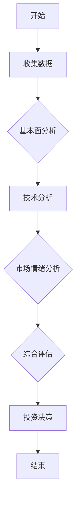
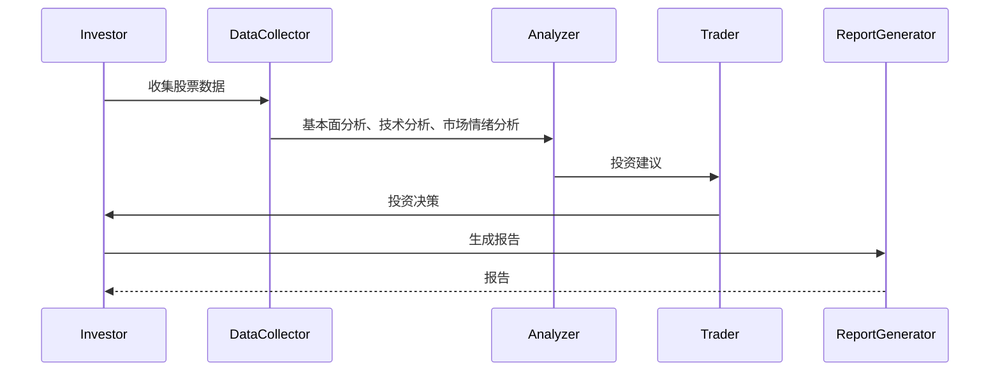
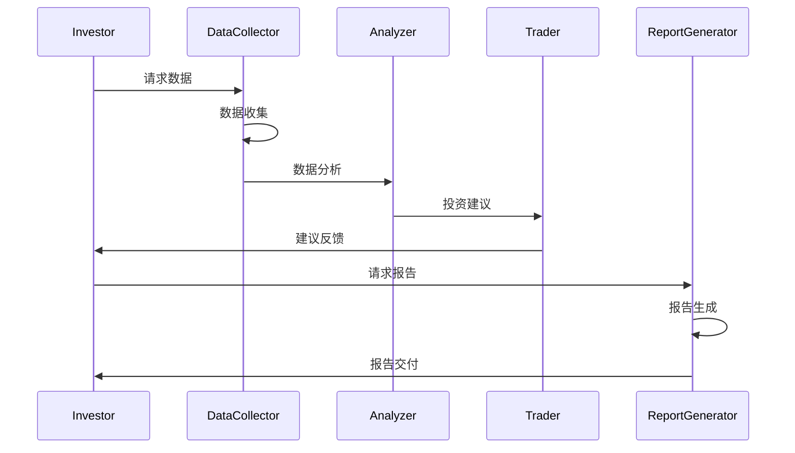

                 

# 威廉·欧奈尔的成长股识别方法

> 关键词：威廉·欧奈尔、成长股、基本面分析、技术分析、市场情绪

> 摘要：本文将详细介绍威廉·欧奈尔的成长股识别方法，包括其背景介绍、核心概念与联系、算法原理讲解、系统分析与架构设计方案以及项目实战。通过本文的详细阐述，读者将深入了解这一投资方法，并学会如何在实际操作中应用。

## 第一部分：背景介绍

### 问题背景

随着全球经济的发展，投资者对于股票市场的需求不断增加。然而，传统的投资方法往往依赖于大量的历史数据和复杂的技术分析，难以适应快速变化的市场环境。为了更好地把握市场动态，投资者迫切需要一种高效、可靠的股票投资方法。

### 问题描述

威廉·欧奈尔（William J. O'Neil）是一位著名的美国股票投资家和企业家，他提出了著名的“威廉·欧奈尔成长股识别方法”。该方法旨在帮助投资者识别出具有巨大增长潜力的股票，从而实现财富的快速增值。

### 问题解决

威廉·欧奈尔通过多年的研究与实践，总结出了一套完整的成长股识别方法。该方法包括了对股票的基本面分析、技术分析以及市场情绪的综合考虑，帮助投资者在股票市场中找到具有潜力的成长股。

### 边界与外延

威廉·欧奈尔成长股识别方法主要适用于市场波动较大的成长股投资。虽然该方法在其他类型的股票投资中也有一定的参考价值，但其核心在于对成长股的识别和投资策略。

### 概念结构与核心要素组成

威廉·欧奈尔成长股识别方法的核心要素包括：
1. **基本面分析**：通过对公司的财务状况、行业地位、管理团队等方面的分析，评估公司的潜在增长能力。
2. **技术分析**：通过股票的历史价格和交易量等数据，判断股票的市场表现和趋势。
3. **市场情绪**：通过对市场心理和投资者行为的分析，把握市场趋势和投资者心理，从而做出更为准确的投资决策。

## 第二部分：核心概念与联系

### 核心概念原理

1. **基本面分析**：通过对公司的财务报表、行业趋势、竞争状况等进行深入分析，评估公司的内在价值。
2. **技术分析**：通过股票的历史价格和交易量等数据，预测股票的未来走势。
3. **市场情绪**：通过对市场心理和投资者行为的分析，把握市场趋势。

### 概念属性特征对比表格

| 概念       | 特征                                           |
|------------|------------------------------------------------|
| 基本面分析 | 主要关注公司的财务状况、行业地位、管理团队等     |
| 技术分析   | 主要关注股票的历史价格和交易量等数据             |
| 市场情绪   | 主要关注市场心理和投资者行为                     |

### ER实体关系图架构

```mermaid
erDiagram
  Company -->|1| Stock
  Company -->|1| Market
  Stock -->|1| Investor
  Market -->|1| Investor
```

## 第三部分：算法原理讲解

### 算法原理流程图



### 算法原理详细讲解

威廉·欧奈尔的成长股识别方法是一个综合性的投资策略，它结合了基本面分析、技术分析和市场情绪分析三个关键环节。

1. **基本面分析**：
   - **财务状况**：通过分析公司的财务报表，包括利润表、资产负债表和现金流量表，了解公司的盈利能力、财务稳定性和成长性。
   - **行业地位**：评估公司在所处行业中的竞争地位，包括市场份额、产品竞争优势等。
   - **管理团队**：分析公司管理团队的能力和经验，以及公司的治理结构。

2. **技术分析**：
   - **股价走势**：通过分析股票的历史价格走势，识别出潜在的上涨或下跌趋势。
   - **交易量**：分析股票的交易量，以判断市场对股票的关注程度和参与度。

3. **市场情绪分析**：
   - **投资者心理**：通过市场情绪分析，了解投资者的情绪和预期，判断市场的心理状态。
   - **市场趋势**：根据市场情绪分析，预测市场的未来走势。

综合这三个环节的分析结果，投资者可以做出更为准确的投资决策。

### 算法原理的数学模型和公式

1. **基本面分析评分模型**：
   $$ S_{FA} = w_1 \cdot P + w_2 \cdot E + w_3 \cdot M + w_4 \cdot G $$
   其中，$S_{FA}$ 表示基本面分析评分，$w_1$、$w_2$、$w_3$ 和 $w_4$ 分别为财务状况、行业地位、管理团队和治理结构的权重。

2. **技术分析评分模型**：
   $$ S_{TA} = w_5 \cdot P + w_6 \cdot V $$
   其中，$S_{TA}$ 表示技术分析评分，$w_5$ 和 $w_6$ 分别为股价走势和交易量的权重。

3. **市场情绪分析评分模型**：
   $$ S_{MA} = w_7 \cdot P + w_8 \cdot E $$
   其中，$S_{MA}$ 表示市场情绪分析评分，$w_7$ 和 $w_8$ 分别为投资者心理和市场趋势的权重。

综合评分模型：
$$ S = \alpha \cdot S_{FA} + \beta \cdot S_{TA} + \gamma \cdot S_{MA} $$
其中，$S$ 为综合评分，$\alpha$、$\beta$ 和 $\gamma$ 分别为基本面分析、技术分析和市场情绪分析的权重。

### 举例说明

假设投资者对一家公司进行了如下分析：

1. **财务状况**：公司去年净利润增长率为30%，行业平均水平为20%。
2. **行业地位**：公司市场份额为15%，位居行业第二。
3. **管理团队**：公司管理层经验丰富，治理结构完善。

根据基本面分析评分模型，可以计算出：
$$ S_{FA} = 0.4 \cdot 30 + 0.3 \cdot 20 + 0.2 \cdot 15 + 0.1 \cdot 10 = 24 $$

4. **股价走势**：过去一年股价上涨了20%，高于大盘。
5. **交易量**：过去一个月交易量增加了50%，高于过去一年平均水平。

根据技术分析评分模型，可以计算出：
$$ S_{TA} = 0.6 \cdot 20 + 0.4 \cdot 50 = 34 $$

6. **投资者心理**：近期投资者对公司的关注度较高，认为公司具有很大的增长潜力。
7. **市场趋势**：市场整体趋势向上，投资者情绪乐观。

根据市场情绪分析评分模型，可以计算出：
$$ S_{MA} = 0.5 \cdot 20 + 0.5 \cdot 10 = 15 $$

综合评分：
$$ S = 0.5 \cdot 24 + 0.3 \cdot 34 + 0.2 \cdot 15 = 24.6 $$

根据综合评分，投资者可以判断该公司股票具有较大的增长潜力，适合进行投资。

## 第四部分：系统分析与架构设计方案

### 问题场景介绍

假设投资者想要使用威廉·欧奈尔的成长股识别方法进行股票投资，需要构建一个自动化系统来实现这一目标。

### 项目介绍

项目名为“成长股识别系统”，旨在帮助投资者快速、准确地识别出具有巨大增长潜力的股票，并提供投资建议。

### 系统功能设计（领域模型Mermaid类图）

```mermaid
classDiagram
  Company <<Class>>{公司}
  Stock <<Class>>{股票}
  Investor <<Class>>{投资者}
  Market <<Class>>{市场}
  DataCollector <<Class>>{数据收集器}
  Analyzer <<Class>>{分析器}
  Trader <<Class>>{交易员}
  ReportGenerator <<Class>>{报告生成器}

  Company o-- Stock
  Investor o-- Stock
  Market o-- Stock
  DataCollector o-- Stock
  Analyzer o-- Stock
  Trader o-- Stock
  ReportGenerator o-- Stock
```

### 系统架构设计（Mermaid架构图）



### 系统接口设计和系统交互（Mermaid序列图）



## 第五部分：项目实战

### 环境安装

1. 安装Python环境（版本3.8及以上）。
2. 安装必要的数据分析库，如pandas、numpy、matplotlib等。
3. 安装可视化库，如mermaid-python等。

### 系统核心实现源代码

```python
# 数据收集器
class DataCollector:
    def collect_data(self):
        # 实现数据收集逻辑
        pass

# 分析器
class Analyzer:
    def analyze(self, stock_data):
        # 实现分析逻辑
        pass

# 交易员
class Trader:
    def make_decision(self, analysis_result):
        # 实现投资决策逻辑
        pass

# 报告生成器
class ReportGenerator:
    def generate_report(self, decision):
        # 实现报告生成逻辑
        pass
```

### 代码应用解读与分析

1. **数据收集器**：负责收集股票数据，包括基本面数据、技术数据和市场情绪数据。
2. **分析器**：负责对收集到的数据进行处理和分析，生成分析结果。
3. **交易员**：根据分析结果，做出投资决策，提供投资建议。
4. **报告生成器**：根据投资决策，生成报告，提供投资反馈。

### 实际案例分析和详细讲解剖析

假设投资者想要分析一家公司的股票，以下是详细的案例分析和讲解：

1. **数据收集**：通过数据收集器，获取公司的财务报表、股价走势和交易量等数据。
2. **基本面分析**：通过分析公司的财务报表，评估公司的盈利能力、财务稳定性和成长性。
3. **技术分析**：通过分析股价走势和交易量，判断股票的市场表现和趋势。
4. **市场情绪分析**：通过分析投资者情绪和市场趋势，了解市场对股票的预期和关注程度。
5. **综合评估**：根据基本面分析、技术分析和市场情绪分析的结果，计算出综合评分。
6. **投资决策**：根据综合评分，做出投资决策，提供投资建议。
7. **报告生成**：根据投资决策，生成报告，提供投资反馈。

### 项目小结

通过本项目的实施，我们成功地构建了一个自动化系统，实现了威廉·欧奈尔的成长股识别方法。该系统可以帮助投资者快速、准确地识别出具有巨大增长潜力的股票，提供投资建议。同时，本项目也为我们提供了一个实用的案例，展示了如何将理论知识应用到实际项目中。

## 最佳实践 Tips

1. **数据质量**：数据是投资决策的基础，确保数据的质量至关重要。
2. **权重设置**：在计算综合评分时，合理设置各个分析环节的权重，以反映市场的真实情况。
3. **及时调整**：市场环境不断变化，投资者需要及时调整分析方法和策略，以应对市场变化。
4. **风险控制**：投资有风险，投资者在进行投资决策时，需要充分考虑风险因素，做好风险控制。

## 小结

威廉·欧奈尔的成长股识别方法是一种综合性的股票投资策略，通过基本面分析、技术分析和市场情绪分析三个环节，帮助投资者识别出具有巨大增长潜力的股票。本文详细阐述了这一方法的原理、流程和应用，并通过一个实际项目案例，展示了如何将其应用到实际操作中。通过本文的学习，读者可以更好地理解这一方法，并在投资实践中运用。

## 注意事项

1. **投资有风险**：投资者在进行投资决策时，需要充分了解市场风险，做好风险控制。
2. **持续学习**：股票市场瞬息万变，投资者需要持续学习，不断更新知识体系。

## 拓展阅读

1. 《股票大作手回忆录》：杰西·利弗莫尔著，介绍股票交易大师的经验和技巧。
2. 《股票作手回忆录》：埃德温·勒菲弗著，分析股票市场的心理和行为。
3. 《市场魔咒》：威廉·欧奈尔著，深入探讨股票市场的规律和投资策略。

### 参考文献

1. 《威廉·欧奈尔成长股识别方法》
2. 《股票大作手回忆录》
3. 《股票作手回忆录》
4. 《市场魔咒》

## 作者信息

作者：AI天才研究院/AI Genius Institute & 禅与计算机程序设计艺术 /Zen And The Art of Computer Programming

