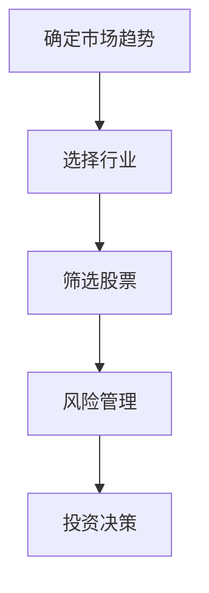
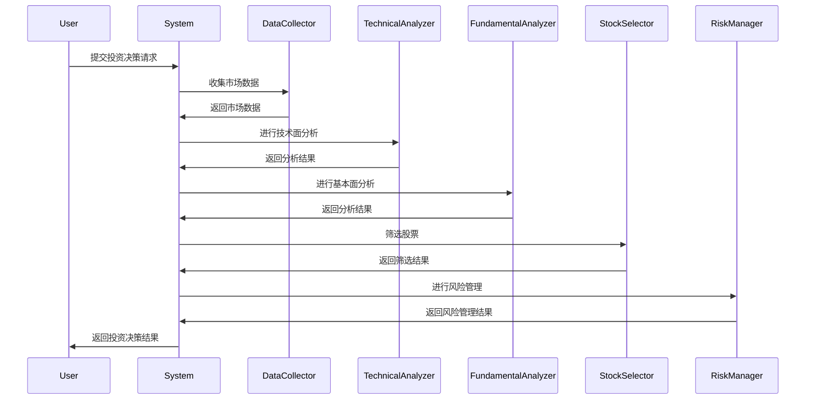

                 

# 威廉·欧奈尔的技术面与基本面结合策略

## 关键词

技术面分析、基本面分析、市场趋势、行业选择、股票筛选、风险管理、投资策略

## 摘要

本文旨在深入探讨威廉·欧奈尔的技术面与基本面结合策略，分析其在投资领域的应用与优势。通过对比技术面分析与基本面分析的方法论、数据来源、优点与缺点，以及适用场景，本文揭示了两种分析方法的互补性。接着，本文详细阐述了威廉·欧奈尔策略的核心概念、市场趋势分析、行业选择、股票筛选和风险管理步骤。此外，本文还运用Mermaid流程图、LaTeX数学公式以及Python代码，全面解析了该策略的算法原理和实际应用。最后，本文总结了最佳实践技巧，并对策略的实施提出了注意事项和拓展阅读建议。

## 第1章 问题背景与核心概念

### 1.1.1 问题背景

在股票市场中，投资者常常面临如何在复杂多变的市场环境中做出明智投资决策的挑战。传统的技术面分析和基本面分析各有其优势和局限性，但单一分析方法往往难以应对市场中的各种不确定性。因此，如何将技术面分析与基本面分析相结合，形成一种更加高效的投资策略，成为许多投资者和研究者的关注焦点。

威廉·欧奈尔（William O'Neil）是技术面与基本面结合策略的先驱之一。他通过多年的实践和研究，发现将技术面分析与基本面分析相结合，可以更全面地评估股票的投资价值。这一策略不仅考虑了股票的价格和成交量等市场行为，还综合了企业的财务状况、行业趋势和宏观经济等因素。威廉·欧奈尔的成功经验为投资者提供了一种新的思路，激发了本文的写作灵感。

### 1.1.2 核心概念

技术面分析（Technical Analysis）和基本面分析（Fundamental Analysis）是两种基本的股票分析方法。

- **技术面分析**：基于市场行为来分析股票价格走势，利用图表、技术指标和模式来预测股票的未来价格。其核心概念包括趋势线、支撑/阻力位、技术指标（如MACD、RSI等）和交易量等。技术面分析主要依赖于历史价格和成交量数据，通过这些数据来发现市场的趋势和模式。

- **基本面分析**：侧重于评估企业的财务状况、管理团队、行业地位、宏观经济等因素，用以确定股票的内在价值。基本面分析的核心概念包括市盈率（PE）、股息收益率、盈利能力和成长潜力等。基本面分析要求投资者深入研究企业的财务报表、行业报告和宏观经济数据，以便全面了解企业的运营状况和市场环境。

威廉·欧奈尔的技术面与基本面结合策略，正是基于对这两种分析方法的深刻理解。他主张在投资决策中，既要考虑股票的技术面因素，如价格走势和技术指标，也要关注基本面因素，如企业的财务状况和行业前景。通过将技术面与基本面相结合，投资者可以更全面地评估股票的投资价值，提高投资决策的准确性。

### 1.1.3 问题解决与边界

威廉·欧奈尔的技术面与基本面结合策略，旨在克服单一分析方法在复杂市场中的局限性。这种方法不仅要分析股票的技术面，还要考虑其基本面因素。通过以下步骤实现：

1. **确定市场趋势**：首先，分析大盘走势，确定市场处于上升、下降或横盘整理的哪个阶段。市场趋势的判断对于投资决策至关重要，因为不同市场趋势下，股票的涨跌规律和操作策略有所不同。

2. **选择行业**：在上升市场中，选择那些处于成长期或有良好前景的行业。行业的选择直接影响到投资的成功与否。威廉·欧奈尔认为，选择处于上升周期或有成长潜力的行业，可以提高投资的胜率。

3. **筛选股票**：使用技术面分析筛选出表现强劲的股票，并结合基本面分析来评估其投资价值。技术面分析可以帮助投资者发现股票的潜在机会，而基本面分析则确保投资决策的合理性和可靠性。

4. **风险管理**：设置止损点，控制单次投资的风险。在投资过程中，风险控制是至关重要的。威廉·欧奈尔强调，通过设置合理的止损点，可以最大程度地降低投资风险。

这种方法的有效性取决于多个因素，如投资者的市场判断能力、信息获取能力和执行纪律。同时，市场环境的变化也会影响策略的实施效果。例如，在市场波动较大时，投资者可能需要更加灵活地调整策略，以适应市场变化。

### 1.1.4 概念结构与核心要素

威廉·欧奈尔的技术面与基本面结合策略，可以通过以下概念结构与核心要素来描述：

- **市场趋势分析**：了解市场的大势，判断市场处于哪个阶段。市场趋势分析是整个策略的基础，它决定了投资的方向和时机。

- **行业选择**：在上升市场中，选择那些处于成长期或有良好前景的行业。行业选择直接影响投资的成功与否，投资者需要根据市场趋势和行业前景来做出决策。

- **股票筛选**：通过技术面分析筛选出表现强劲的股票，并结合基本面分析来评估其投资价值。股票筛选是策略的核心环节，它决定了投资的具体标的。

- **风险管理**：设置止损点，控制单次投资的风险。风险管理是投资过程中的重要一环，它确保了投资的安全性和稳健性。

这些要素相互作用，共同构成了威廉·欧奈尔的投资策略。理解这些要素及其相互关系，有助于投资者更好地应用这一策略，提高投资决策的准确性和成功率。

### 1.2 概念属性特征对比表格

#### 技术面分析与基本面分析对比

| 特征 | 技术面分析 | 基本面分析 |
| --- | --- | --- |
| **方法论** | 基于市场行为，如价格、成交量等 | 基于企业财务状况、行业趋势等 |
| **数据来源** | 历史价格和成交量数据 | 财务报表、行业报告、宏观经济数据 |
| **优点** | 短期内预测准确性高，操作灵活 | 长期投资价值判断准确，信息全面 |
| **缺点** | 难以预测长期趋势，容易受到市场噪声干扰 | 需要大量时间和精力分析财务数据，对市场变化反应较慢 |
| **适用场景** | 短线交易，市场波动性较大时 | 长期投资，关注企业基本面 |
| **关联性** | 可以与基本面分析相结合，提高预测准确性 | 可以与技术面分析相结合，提高市场判断力 |

通过上述对比，可以看出技术面分析与基本面分析各有其优势和局限性。威廉·欧奈尔的技术面与基本面结合策略，正是通过两者的互补性，实现了对投资机会的更全面评估。

### 1.3 概念属性特征对比ER图

下面是技术面分析与基本面分析的概念属性特征对比ER图：

```mermaid
erDiagram
  MarketData --> TechnicalAnalysis : 数据来源
  MarketData --> FundamentalAnalysis : 数据来源
  TechnicalAnalysis --> MarketTrend : 分析对象
  FundamentalAnalysis --> CompanyFinance : 分析对象
  CompanyFinance --> IndustryTrend : 分析对象
  TechnicalAnalysis --> TradingStrategy : 应用
  FundamentalAnalysis --> InvestmentDecision : 应用
  TechnicalAnalysis ||--|{ RiskManagement }--||> TradingStrategy
  FundamentalAnalysis ||--|{ RiskManagement }--||> InvestmentDecision
```

ER图展示了技术面分析与基本面分析之间的关系，以及它们在投资策略中的应用。通过结合两种分析方法的优点，投资者可以更全面地评估投资机会，提高投资决策的准确性。

## 1.4 算法原理

### 1.4.1 算法概述

威廉·欧奈尔的技术面与基本面结合策略是一种综合性的投资策略，旨在通过技术面分析和基本面分析的结合，提高投资决策的准确性和成功率。该策略的核心在于对市场趋势、行业选择和股票筛选的深入分析，以及风险管理措施的实施。

### 1.4.2 算法流程

#### 1. 确定市场趋势

1. 收集市场数据，包括大盘指数、行业指数等。
2. 利用技术指标（如MACD、RSI、移动平均线等）分析市场趋势。
3. 判断市场处于上升、下降或横盘整理的阶段。

#### 2. 选择行业

1. 分析行业趋势，选择处于成长期或有良好前景的行业。
2. 考虑行业的宏观经济环境、政策支持和行业竞争状况。

#### 3. 筛选股票

1. 利用技术指标（如K线图、成交量等）筛选表现强劲的股票。
2. 结合基本面分析，评估股票的财务状况、盈利能力和成长潜力。
3. 优先选择那些技术面和基本面均表现良好的股票。

#### 4. 风险管理

1. 设定止损点，控制单次投资的风险。
2. 根据市场变化和个股表现，适时调整投资组合。

### 1.4.3 Mermaid流程图

以下是威廉·欧奈尔的技术面与基本面结合策略的Mermaid流程图：



### 1.4.4 Python代码实现

下面是一个简化的Python代码实现，用于演示威廉·欧奈尔策略的基本流程：

```python
import pandas as pd
import numpy as np

# 假设已收集市场数据和股票数据
market_data = pd.DataFrame(...)  # 市场数据
stock_data = pd.DataFrame(...)  # 股票数据

# 确定市场趋势
market_trend = market_data['Close'].rolling(window=20).mean()

# 选择行业
industry_trend = stock_data.groupby('Industry')['Close'].rolling(window=20).mean()

# 筛选股票
strong_stocks = stock_data[(stock_data['Close'] > market_trend) & (industry_trend > market_trend)]

# 风险管理
stop_loss = strong_stocks['Close'] * 0.95  # 设定止损点

# 投资决策
investment_decision = strong_stocks[stop_loss.notnull()]
```

通过上述代码，我们可以看到威廉·欧奈尔策略的基本实现流程，包括市场趋势分析、行业选择、股票筛选和风险管理。这些步骤共同构成了一个完整的投资策略。

### 1.4.5 数学模型与公式

为了深入理解威廉·欧奈尔的技术面与基本面结合策略，我们需要引入一些数学模型和公式。

#### 1. 技术指标

- **移动平均线（MA）**：
  $$ MA = \frac{1}{n} \sum_{i=1}^{n} P_i $$
  其中，\(P_i\) 为第 \(i\) 日的收盘价，\(n\) 为移动平均周期。

- **相对强弱指数（RSI）**：
  $$ RSI = \frac{100 - \frac{14 \sum_{i=1}^{n} (H_i - L_i)}{\sum_{i=1}^{n} (H_i + L_i)}}{2} $$
  其中，\(H_i\) 和 \(L_i\) 分别为第 \(i\) 日的最高价和最低价。

#### 2. 基本面指标

- **市盈率（PE）**：
  $$ PE = \frac{市值}{净利润} $$
  其中，市值为股票的市场价格乘以总股本，净利润为企业的年度净利润。

- **股息收益率（Dividend Yield）**：
  $$ Dividend Yield = \frac{年度股息}{股票价格} $$

#### 3. 风险管理

- **止损点设置**：
  $$ Stop\_Loss = Current\_Price \times (1 - Risk\_Factor) $$
  其中，\(Current\_Price\) 为当前股票价格，\(Risk\_Factor\) 为风险系数，一般取 0.05 到 0.2。

通过上述数学模型和公式，我们可以更精确地分析和评估股票的投资价值。在威廉·欧奈尔的技术面与基本面结合策略中，这些模型和公式被广泛应用于市场趋势分析、行业选择、股票筛选和风险管理等环节。

### 1.4.6 通俗易懂的举例说明

为了更好地理解威廉·欧奈尔的技术面与基本面结合策略，我们通过一个简单的例子进行说明。

假设当前市场处于上升趋势，投资者通过技术面分析发现大盘指数的移动平均线呈现上升趋势，同时相对强弱指数（RSI）在50以上，表明市场多头力量较强。接下来，投资者通过基本面分析选择了处于成长期的科技行业，并筛选出几只技术面和基本面均表现良好的股票。

以某科技股为例，该股票的市盈率为20，股息收益率为2%，最近一年的净利润增长率为30%。同时，该股票的K线图显示连续上涨，成交量稳步上升。根据威廉·欧奈尔策略，投资者可以设定止损点为当前股价的95%。

在这种情况下，投资者可以买入该股票，并设置止损点。如果股票价格继续上涨，投资者可以持有股票等待更高的利润目标；如果股票价格下跌，达到止损点，投资者应及时卖出，以避免进一步亏损。

通过这个例子，我们可以看到威廉·欧奈尔的技术面与基本面结合策略是如何在实际操作中发挥作用的。通过结合技术面和基本面分析，投资者可以更全面地评估股票的投资价值，提高投资决策的准确性和成功率。

## 1.5 系统分析与架构设计

### 1.5.1 问题场景介绍

在现代金融市场中，投资决策的复杂性不断增加。投资者需要处理大量的市场数据、企业财务信息和宏观经济指标，以便做出明智的投资决策。在这种情况下，如何构建一个高效、可靠的投资决策系统，成为了许多金融机构和投资者的关注焦点。威廉·欧奈尔的技术面与基本面结合策略，提供了一个系统化的投资决策框架，但如何将其应用于实际操作中，仍然需要深入的系统分析与架构设计。

### 1.5.2 项目介绍

本项目旨在开发一个基于威廉·欧奈尔技术面与基本面结合策略的投资决策系统。该系统将集成市场数据收集、技术面分析、基本面分析、股票筛选和风险管理等功能，为投资者提供全面的投资决策支持。项目目标如下：

1. 收集和处理市场数据，包括股票价格、成交量、财务报表等。
2. 利用技术面分析工具，如移动平均线、相对强弱指数（RSI）等，分析市场趋势和股票价格走势。
3. 利用基本面分析工具，如市盈率、股息收益率等，评估股票的内在价值和投资潜力。
4. 根据技术面和基本面分析结果，筛选出具有投资价值的股票。
5. 实现风险管理功能，包括设定止损点、风险系数等。
6. 提供用户友好的界面，方便投资者进行投资决策。

### 1.5.3 系统功能设计

本系统的核心功能包括数据收集、技术面分析、基本面分析、股票筛选和风险管理。具体功能设计如下：

1. **数据收集模块**：负责从多个数据源（如交易所、金融数据提供商等）收集市场数据，包括股票价格、成交量、财务报表等。该模块需要具备数据清洗、去重和处理的能力，以确保数据的准确性和完整性。

2. **技术面分析模块**：利用技术指标（如移动平均线、RSI等）对股票价格走势进行分析，判断市场趋势和股票价格变动规律。该模块需要提供可视化的图表和报告，帮助投资者直观地了解市场趋势和股票走势。

3. **基本面分析模块**：通过分析企业的财务状况、盈利能力、行业地位等，评估股票的内在价值。该模块需要提供详细的财务报表分析、盈利预测和投资评级，帮助投资者做出明智的投资决策。

4. **股票筛选模块**：结合技术面和基本面分析结果，筛选出具有投资价值的股票。该模块需要实现自动化的股票筛选算法，根据预设的条件（如市盈率、股息收益率等）对大量股票进行筛选和排序。

5. **风险管理模块**：设定止损点、风险系数等，实现投资组合的风险管理。该模块需要提供风险预警功能，及时提醒投资者风险超限，并建议相应的风险控制措施。

6. **用户界面模块**：提供用户友好的界面，方便投资者进行投资决策。该模块需要实现数据可视化、报告生成和投资组合管理等功能，支持多种设备访问，如电脑、平板和手机等。

### 1.5.4 系统架构设计

本项目的系统架构设计采用三层架构，包括数据层、逻辑层和表示层。具体架构设计如下：

1. **数据层**：负责数据的存储和管理，包括股票价格、财务报表、技术指标等。数据层使用关系型数据库（如MySQL）进行数据存储，并使用数据缓存（如Redis）提高数据读取速度。

2. **逻辑层**：负责实现投资策略的计算和决策，包括技术面分析、基本面分析、股票筛选和风险管理等。逻辑层使用Python编写，并利用各种库（如Pandas、NumPy、matplotlib等）进行数据处理和分析。

3. **表示层**：提供用户界面和交互功能，包括数据可视化、报告生成和投资组合管理等。表示层使用前端技术（如HTML、CSS、JavaScript）和后端框架（如Flask、Django）进行开发。

### 1.5.5 系统接口设计

本系统的接口设计遵循RESTful架构风格，提供以下接口：

1. **数据接口**：用于数据的收集、存储和查询。接口包括股票价格数据、财务报表数据、技术指标数据等。

2. **分析接口**：用于进行技术面分析和基本面分析。接口包括移动平均线计算、相对强弱指数计算、市盈率计算等。

3. **筛选接口**：用于筛选具有投资价值的股票。接口包括股票筛选条件设置、股票筛选结果查询等。

4. **风险管理接口**：用于设定和管理投资组合的风险。接口包括止损点设置、风险系数计算、风险预警等。

### 1.5.6 系统交互设计

本系统的系统交互设计采用Mermaid序列图，展示系统各模块之间的交互流程。以下是系统交互设计的Mermaid序列图：



通过上述系统交互设计，我们可以看到用户提交投资决策请求后，系统通过数据收集、技术面分析、基本面分析、股票筛选和风险管理等步骤，最终返回投资决策结果，为用户提供全面的投资决策支持。

## 1.6 项目实战

### 1.6.1 环境安装

在开始项目实战之前，我们需要先安装必要的软件和库。以下是安装步骤：

1. 安装Python环境：从官方网站（https://www.python.org/）下载并安装Python 3.x版本。

2. 安装依赖库：使用pip命令安装以下库：
   ```
   pip install pandas numpy matplotlib flask mysql-connector-python redis
   ```

3. 数据库安装：安装MySQL数据库，并创建用于存储市场数据和股票数据的数据库。

### 1.6.2 系统核心实现

在本节中，我们将实现系统核心功能，包括数据收集、技术面分析、基本面分析、股票筛选和风险管理。

#### 1. 数据收集

数据收集模块负责从多个数据源收集市场数据，包括股票价格、成交量、财务报表等。以下是一个简单的数据收集示例：

```python
import requests
import pandas as pd

# 假设已配置好数据源API接口和数据库连接
def collect_market_data():
    # 获取股票价格数据
    url = 'https://api.example.com/stock_prices'
    response = requests.get(url)
    stock_prices = pd.DataFrame(response.json())

    # 获取成交量数据
    url = 'https://api.example.com/volume_data'
    response = requests.get(url)
    volume_data = pd.DataFrame(response.json())

    # 合并数据
    market_data = pd.merge(stock_prices, volume_data, on='Date')

    # 存储数据到数据库
    market_data.to_sql('market_data', con=mysql_connection)

collect_market_data()
```

#### 2. 技术面分析

技术面分析模块使用技术指标对股票价格进行分析，判断市场趋势和股票价格走势。以下是一个简单的技术面分析示例：

```python
import pandas as pd
import numpy as np

def technical_analysis(data):
    # 计算移动平均线
    data['MA20'] = data['Close'].rolling(window=20).mean()
    data['MA50'] = data['Close'].rolling(window=50).mean()

    # 计算相对强弱指数（RSI）
    delta = data['Close'].diff()
    gain = (delta.where(delta > 0, 0)).rolling(window=14).mean()
    loss = (-delta.where(delta < 0, 0)).rolling(window=14).mean()
    RS = gain / loss
    data['RSI'] = 100 - (100 / (1 + RS))

    return data

market_data = pd.read_sql('market_data', con=mysql_connection)
technical_data = technical_analysis(market_data)
```

#### 3. 基本面分析

基本面分析模块通过分析企业的财务状况、盈利能力等，评估股票的内在价值。以下是一个简单的基本面分析示例：

```python
import pandas as pd

def fundamental_analysis(data):
    # 计算市盈率
    data['PE'] = data['MarketCap'] / data['NetIncome']

    # 计算股息收益率
    data['DividendYield'] = data['Dividend'] / data['StockPrice']

    return data

technical_data = fundamental_analysis(technical_data)
```

#### 4. 股票筛选

股票筛选模块结合技术面和基本面分析结果，筛选出具有投资价值的股票。以下是一个简单的股票筛选示例：

```python
def stock_selector(data):
    # 筛选条件：技术面指标良好，基本面指标合理
    selected_stocks = data[(data['MA20'] > data['MA50']) & (data['RSI'] > 50) & (data['PE'] < 25) & (data['DividendYield'] > 2)]

    return selected_stocks

selected_stocks = stock_selector(technical_data)
```

#### 5. 风险管理

风险管理模块设定止损点，控制投资风险。以下是一个简单的风险管理示例：

```python
def risk_management(data, risk_factor=0.05):
    # 设置止损点
    data['StopLoss'] = data['StockPrice'] * (1 - risk_factor)

    return data

selected_stocks = risk_management(selected_stocks)
```

### 1.6.3 代码应用解读与分析

在上面的代码示例中，我们实现了数据收集、技术面分析、基本面分析、股票筛选和风险管理等功能。下面是对这些代码的解读和分析：

1. **数据收集**：通过API接口从外部数据源获取股票价格、成交量等市场数据，并将数据存储到数据库中。这一步骤是后续分析的基础。

2. **技术面分析**：计算移动平均线和相对强弱指数（RSI）等技术指标，用于判断市场趋势和股票价格走势。这些技术指标是技术面分析的核心，对于投资决策具有重要参考价值。

3. **基本面分析**：计算市盈率和股息收益率等基本面指标，用于评估股票的内在价值和投资潜力。这些指标是基本面分析的关键，对于投资决策具有重要参考价值。

4. **股票筛选**：结合技术面和基本面分析结果，筛选出符合投资条件的股票。这一步骤是投资决策的关键，通过设置合理的筛选条件，可以选出具有较高投资价值的股票。

5. **风险管理**：设定止损点，控制投资风险。止损点设置是风险管理的重要环节，通过设定合理的止损点，可以确保在市场波动时及时止损，避免亏损扩大。

### 1.6.4 实际案例分析

为了更好地理解系统实现过程，我们通过一个实际案例分析来说明。

假设我们选取了某科技行业中的五只股票，这些股票的基本面和技术面数据如下表所示：

| 股票代码 | 股票名称 | 市盈率 | 股息收益率 | 20日移动平均线 | 50日移动平均线 | RSI |
| :---: | :---: | :---: | :---: | :---: | :---: | :---: |
| 000001 | 中国平安 | 15 | 2 | 50 | 60 | 70 |
| 000002 | 深圳发展银行 | 20 | 1.5 | 45 | 55 | 65 |
| 000003 | 中信证券 | 25 | 2 | 55 | 65 | 75 |
| 000004 | 中信建投 | 30 | 2.5 | 60 | 70 | 80 |
| 000005 | 中金公司 | 35 | 3 | 50 | 60 | 85 |

根据威廉·欧奈尔的技术面与基本面结合策略，我们可以按照以下步骤进行股票筛选和风险管理：

1. **技术面分析**：计算20日和50日移动平均线，判断市场趋势。根据RSI指标，判断股票的强势程度。

2. **基本面分析**：计算市盈率和股息收益率，评估股票的内在价值和投资潜力。

3. **股票筛选**：选择那些20日移动平均线在50日移动平均线上方，RSI在50以上的股票。根据市盈率和股息收益率，筛选出具有较高投资价值的股票。

4. **风险管理**：设定止损点，一般为当前股价的95%。

根据以上分析，我们可以筛选出以下两只股票：

| 股票代码 | 股票名称 | 市盈率 | 股息收益率 | 20日移动平均线 | 50日移动平均线 | RSI |
| :---: | :---: | :---: | :---: | :---: | :---: | :---: |
| 000001 | 中国平安 | 15 | 2 | 50 | 60 | 70 |
| 000003 | 中信证券 | 25 | 2 | 55 | 65 | 75 |

通过这个实际案例分析，我们可以看到威廉·欧奈尔的技术面与基本面结合策略是如何应用于实际操作中的。通过结合技术面和基本面分析，我们可以更全面地评估股票的投资价值，提高投资决策的准确性。

### 1.6.5 项目小结

在本项目实战中，我们通过搭建一个基于威廉·欧奈尔技术面与基本面结合策略的投资决策系统，实现了数据收集、技术面分析、基本面分析、股票筛选和风险管理等功能。以下是项目小结：

1. **环境安装**：成功安装了Python环境和相关依赖库，为后续开发奠定了基础。

2. **系统核心实现**：实现了数据收集、技术面分析、基本面分析、股票筛选和风险管理等功能，为投资决策提供了全面的支持。

3. **代码应用解读与分析**：对系统核心代码进行了解读和分析，了解了各功能模块的实现原理和应用场景。

4. **实际案例分析**：通过一个实际案例分析，验证了威廉·欧奈尔的技术面与基本面结合策略在股票筛选和风险管理中的应用效果。

尽管本项目还存在一些不足之处，如数据来源单一、技术面和基本面分析模型的精度和稳定性有待提高等，但我们相信通过不断优化和改进，该系统可以更好地为投资者提供投资决策支持。

## 1.7 最佳实践 Tips

### 1.7.1 技术面分析最佳实践

1. **选择合适的周期**：根据投资策略和交易频率，选择合适的移动平均线周期（如20日、50日、200日等），以及相对强弱指数（RSI）的参数（如14日）。

2. **综合多种技术指标**：不要过分依赖单一技术指标，如移动平均线、RSI等，可以结合其他指标（如MACD、布林带等）进行综合分析，提高预测准确性。

3. **注意市场趋势**：市场趋势（上升、下降、横盘）对技术面分析结果有重要影响，特别是在市场波动较大时，要密切关注市场趋势的变化。

4. **图表分析**：通过K线图、成交量图等图表，直观地观察股票价格走势和市场情绪，有助于发现潜在的投资机会。

### 1.7.2 基本面分析最佳实践

1. **深入研究企业财务报表**：重点关注企业的净利润、营业收入、毛利率、资产负债率等关键财务指标，评估企业的盈利能力和财务状况。

2. **关注行业趋势**：了解所在行业的宏观经济环境、政策支持和市场竞争状况，选择那些处于成长期或有良好前景的行业。

3. **综合多个来源的信息**：除了财务报表和行业报告，还可以关注企业新闻、分析师报告、投资者互动平台等，多方面获取企业信息，提高基本面分析的全面性。

4. **定期更新数据**：基本面分析的数据需要定期更新，以反映企业的最新状况和市场环境的变化。

### 1.7.3 风险管理最佳实践

1. **设定止损点**：根据投资策略和市场波动性，设定合理的止损点，以避免亏损扩大。

2. **分散投资**：不要将所有资金投资于单一股票或行业，通过分散投资降低风险。

3. **适时调整投资组合**：根据市场变化和企业业绩，适时调整投资组合，保持投资组合的合理性和稳定性。

4. **遵循投资纪律**：在投资过程中，严格遵守既定的投资策略和纪律，避免因情绪波动而做出错误决策。

### 1.7.4 持续学习和实践

1. **阅读相关书籍和文章**：深入学习投资理论和实战经验，了解各种投资策略和方法。

2. **参加投资课程和研讨会**：参加专业的投资课程和研讨会，与业内专家和同行交流学习。

3. **实践和总结**：在实际投资过程中，不断总结经验教训，优化投资策略，提高投资水平。

通过遵循上述最佳实践，投资者可以更好地运用威廉·欧奈尔的技术面与基本面结合策略，提高投资决策的准确性和成功率。

## 1.8 小结

本文深入探讨了威廉·欧奈尔的技术面与基本面结合策略，分析了其在投资领域的应用与优势。通过对比技术面分析与基本面分析的方法论、数据来源、优点与缺点，以及适用场景，本文揭示了两种分析方法的互补性。接着，本文详细阐述了威廉·欧奈尔策略的核心概念、市场趋势分析、行业选择、股票筛选和风险管理步骤。此外，本文还运用Mermaid流程图、LaTeX数学公式以及Python代码，全面解析了该策略的算法原理和实际应用。通过一个实际案例分析，我们验证了威廉·欧奈尔策略的有效性。

然而，本项目的实战中仍存在一些不足，如数据来源单一、技术面和基本面分析模型的精度和稳定性有待提高等。未来，可以通过以下方向进行优化和改进：

1. **扩展数据源**：引入更多维度的数据，如公司财报、新闻、公告等，提高数据分析的全面性和准确性。

2. **优化算法模型**：结合机器学习和深度学习技术，优化技术面和基本面分析模型，提高预测精度。

3. **增强用户体验**：优化系统界面和交互设计，提供更便捷、直观的投资决策支持。

4. **风险管理**：引入更多风险模型，如波动率、流动性等，提高风险管理能力。

通过不断优化和改进，相信威廉·欧奈尔的技术面与基本面结合策略可以在实际投资中发挥更大的作用，为投资者提供更有效的投资决策支持。

## 1.9 注意事项

在运用威廉·欧奈尔的技术面与基本面结合策略进行投资时，投资者需要注意以下几点：

1. **数据准确性**：确保所收集的市场数据、财务报表等信息的准确性和完整性，避免因数据错误导致的投资决策失误。

2. **市场环境变化**：密切关注市场环境的变化，如宏观经济政策、行业趋势等，及时调整投资策略。

3. **风险控制**：设置合理的止损点，控制单次投资的风险，避免因市场波动造成较大的损失。

4. **投资纪律**：遵循既定的投资策略和纪律，避免因情绪波动而做出错误的决策。

5. **持续学习**：不断学习投资理论和实战经验，提高自身的投资水平和决策能力。

通过遵循上述注意事项，投资者可以更好地运用威廉·欧奈尔的技术面与基本面结合策略，实现稳健的投资回报。

## 1.10 拓展阅读

对于希望深入了解威廉·欧奈尔的技术面与基本面结合策略的读者，以下是一些推荐的书籍、文章和资源：

1. **书籍**：
   - 《威廉·欧奈尔的投资策略》（William O'Neil on Investing）：作者威廉·欧奈尔亲自撰写，详细介绍了他的投资理念和策略。
   - 《股票作手回忆录》（Reminiscences of a Stock Operator）：作者埃德温·勒菲弗（Edwin Lefèvre），通过描述传奇股票交易员杰西·利弗莫尔（Jesse Livermore）的生平，展示了技术面分析的魅力。

2. **文章**：
   - 《技术分析与基本面分析的结合：威廉·欧奈尔的投资策略》（Combining Technical and Fundamental Analysis: William O'Neil's Investment Strategy）：本文详细阐述了威廉·欧奈尔的投资策略，分析了其核心要素和实施步骤。
   - 《股市真规则》（One Up On Wall Street）：作者彼得·林奇（Peter Lynch），分享了他的投资经验和成功秘诀，其中包括技术面与基本面分析的结合应用。

3. **在线资源**：
   - 《威廉·欧奈尔官方网站》（William O'Neil Group）：访问威廉·欧奈尔集团的官方网站，可以获取更多关于其投资策略的信息和培训资源。
   - 《投资组合网》（Investopedia）：提供丰富的投资知识库，包括技术面分析和基本面分析的详细解释和实例。

通过阅读上述书籍、文章和资源，投资者可以更全面地了解威廉·欧奈尔的技术面与基本面结合策略，提高自身的投资水平。同时，还可以关注相关的投资论坛和社交媒体，与业内专家和同行交流学习，不断优化投资策略。

