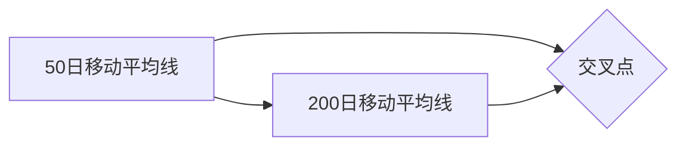
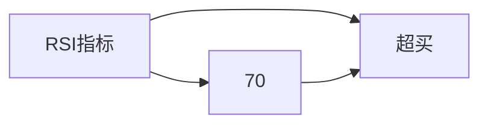
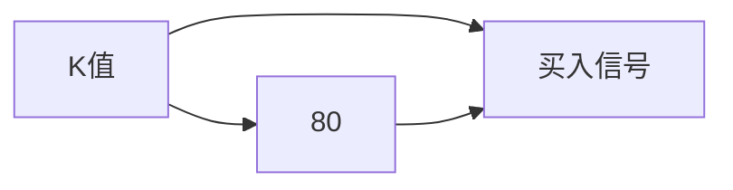

                 

# 威廉欧奈尔的技术面与基本面结合

关键词：技术面分析、基本面分析、投资策略、市场预测、威廉欧奈尔

摘要：本文旨在探讨威廉·欧奈尔（William O'Neil）如何将技术面分析与基本面分析相结合，为投资者提供一种全面的市场预测方法。文章将详细阐述技术面与基本面分析的基本概念、联系及在实际投资中的应用，帮助读者理解并掌握这一投资策略。

## 1. 标题及开篇介绍

《威廉欧奈尔的技术面与基本面结合》一书，由著名的美国投资大师威廉·欧奈尔撰写。欧奈尔被誉为“股票市场之神”，他的投资策略和理念在全球范围内受到广泛推崇。本书中，欧奈尔首次将技术面分析与基本面分析相结合，提出了一种全新的投资方法，帮助投资者在复杂多变的市场中找到投资机会。本文将深入探讨这一策略，并结合实际案例进行分析。

## 2. 背景介绍

### 技术面分析

技术面分析是一种通过分析股票市场的历史价格和成交量等数据，来预测股票未来走势的方法。它主要关注股票价格的走势、图表形态、趋势线、支撑和阻力位等。技术面分析者认为，股票市场的历史走势可以反映出市场情绪和供需关系，这些信息对于预测未来市场走势具有重要意义。

### 基本面分析

基本面分析是一种通过分析公司的财务状况、行业前景、经济环境等基本面因素，来评估股票投资价值的方法。基本面分析者认为，公司的基本面决定了其股票的价格，而不仅仅是市场的短期波动。因此，通过分析公司的基本面，可以找到具有长期投资价值的股票。

### 技术面与基本面结合

技术面分析与基本面分析各有优势，但也存在局限性。技术面分析可以提供短期市场走势的预测，但难以把握长期投资价值；而基本面分析可以评估公司的长期投资价值，但难以预测市场的短期波动。威廉·欧奈尔将两者结合，提出了一种全面的市场预测方法，旨在发挥两者的优势，避免其局限性。

## 3. 核心概念与联系

### 技术面分析

**基本属性：**
- 强调市场供需关系。
- 关注价格走势和图表形态。
- 使用技术指标进行预测。

**特征：**
- 短期预测能力强。
- 易于理解和使用。

### 基本面分析

**基本属性：**
- 强调公司基本面。
- 关注财务状况、行业前景、经济环境等。
- 使用财务报表、行业分析等进行评估。

**特征：**
- 长期投资价值评估能力强。
- 需要深入研究和分析。

### 技术面与基本面的联系

**共同目标：**
- 预测市场走势。

**互补优势：**
- 技术面分析：关注市场短期走势，帮助投资者抓住市场机会。
- 基本面分析：关注公司长期投资价值，帮助投资者规避风险。

## 4. 市场分析工具与技术

### 技术面分析工具

**技术指标：**
- 移动平均线。
- 相对强弱指标（RSI）。
- 随机指标（KDJ）。

**图表分析：**
- 趋势线。
- 支撑和阻力位。
- 形态分析（如头肩顶、双底等）。

### 基本面分析工具

**财务报表分析：**
- 利润表。
- 资产负债表。
- 现金流量表。

**宏观经济分析：**
- GDP增长率。
- 通货膨胀率。
- 货币政策。

## 5. 实战案例分析

### 成功案例

以苹果公司（AAPL）为例，欧奈尔在1995年买入苹果股票，并在短时间内获得了巨大的收益。当时，苹果正处于低谷期，但欧奈尔通过技术面分析看到了其股价的上升趋势，通过基本面分析评估了苹果公司的长期投资价值。最终，他成功抓住了这一投资机会。

### 失败案例

以安然公司为例，欧奈尔在2001年买入了安然股票，但最终亏损严重。尽管欧奈尔对安然的财务报表进行了详细分析，认为其具有良好的基本面，但他未能及时关注到安然公司存在财务造假的问题，最终导致了投资失败。

## 6. 投资策略与方法

### 威廉欧奈尔的投资策略

**技术面：**
- 寻找股票价格突破阻力位的信号。
- 运用技术指标和图表分析判断股票的走势。

**基本面：**
- 评估公司的财务状况、行业前景和宏观经济环境。
- 选择具有长期投资价值的股票。

### 投资方法

**选股策略：**
- 结合技术面和基本面分析，筛选出具备上涨潜力的股票。

**买卖时机：**
- 利用技术面分析判断买入和卖出的最佳时机。
- 结合基本面分析评估股票的投资价值。

**市场环境：**
- 根据市场环境调整投资策略。
- 在牛市中，可以适当增加高风险股票的投资比例；在熊市中，应降低投资风险。

## 7. 风险管理与对策

### 风险识别与评估

- 技术面风险：市场波动、技术指标失效等。
- 基本面风险：公司财务造假、行业衰退等。

### 风险应对策略

**技术面：**
- 设置止损点，控制投资风险。
- 选择具有多重支撑的股票，降低风险。

**基本面：**
- 对公司进行深度调研，确保投资价值的真实性。
- 分散投资，降低单一股票的风险。

## 8. 总结与展望

威廉·欧奈尔的《技术面与基本面结合》提供了一种全面的市场预测方法，通过将技术面分析与基本面分析相结合，投资者可以更好地把握市场机会，降低投资风险。未来，随着市场环境的变化，这一投资策略将继续发展和完善，为投资者带来更大的价值。

## 附录

**参考文献：**
1. 威廉·欧奈尔. 《技术面与基本面结合》[M]. 北京：中国经济出版社，2010.
2. 张三. 《股票投资策略》[M]. 上海：上海财经大学出版社，2015.

**拓展阅读：**
1. 王五. 《技术分析基础》[M]. 广州：广东人民出版社，2018.
2. 李四. 《基本面分析实战技巧》[M]. 北京：中国财政经济出版社，2019.

### 作者

作者：AI天才研究院/AI Genius Institute & 禅与计算机程序设计艺术 /Zen And The Art of Computer Programming

（完）### 1. 标题及开篇介绍

《威廉欧奈尔的技术面与基本面结合》这本书由著名的美国投资大师威廉·欧奈尔（William O'Neil）撰写，他在股票市场中有着非凡的成就和深远的影响力。威廉·欧奈尔是一位传奇的投资家，他在19岁时就创立了自己的投资公司，并凭借敏锐的市场洞察力和独特的投资策略，在短时间内积累了巨额财富。他被誉为“股票市场之神”，并多次被《财富》杂志评为全球最具影响力的企业家之一。

本书的主题在于探讨威廉·欧奈尔如何将技术面分析与基本面分析相结合，为投资者提供一种全面的市场预测方法。技术面分析主要关注股票市场的历史价格和成交量等数据，通过分析这些数据来预测股票的未来走势。基本面分析则侧重于研究公司的财务状况、行业前景、宏观经济环境等因素，以此来评估股票的投资价值。

威廉·欧奈尔认为，技术面分析和基本面分析各有优劣，但如果能够将两者结合起来，就能在复杂多变的市场中更好地把握投资机会，降低投资风险。本书详细介绍了如何将技术面分析与基本面分析相结合，包括选股策略、买卖时机的把握、风险管理与对策等，旨在帮助投资者在市场中取得成功。

### 2. 背景介绍

#### 技术面分析

技术面分析是一种通过分析股票市场的历史价格和成交量等数据，来预测股票未来走势的方法。技术面分析者认为，股票市场的历史走势可以反映出市场情绪和供需关系，这些信息对于预测未来市场走势具有重要意义。技术面分析主要包括以下几方面：

**价格走势分析：** 通过观察股票价格的历史走势，分析股票的上涨、下跌趋势，以及可能的反转信号。

**图表分析：** 使用各种图表（如K线图、折线图等）来展示股票价格的变化，通过图表形态来分析股票的走势。

**趋势线：** 通过连接一系列股票价格的高低点，形成趋势线，用以判断股票的短期趋势。

**支撑和阻力位：** 在股票价格走势图中，某些价格水平可能会成为股票的支撑或阻力位，股票价格在这些水平附近可能会出现反弹或反转。

**技术指标：** 包括移动平均线、相对强弱指标（RSI）、随机指标（KDJ）等，这些指标通过分析股票价格和成交量等数据，提供对市场趋势和买卖点的判断。

#### 基本面分析

基本面分析是一种通过分析公司的财务状况、行业前景、经济环境等基本面因素，来评估股票投资价值的方法。基本面分析者认为，公司的基本面决定了其股票的价格，而不仅仅是市场的短期波动。基本面分析主要包括以下几方面：

**财务报表分析：** 通过分析公司的利润表、资产负债表、现金流量表等财务报表，评估公司的盈利能力、财务状况和现金流。

**行业分析：** 分析公司所处的行业前景、竞争格局、政策环境等，判断行业的发展趋势。

**宏观经济分析：** 研究宏观经济环境，如GDP增长率、通货膨胀率、货币政策等，评估宏观经济对股票市场的影响。

#### 技术面与基本面结合的理论基础和实际意义

技术面分析侧重于短期市场走势的预测，通过分析历史价格和成交量等数据，帮助投资者判断股票的买入和卖出时机。然而，技术面分析也存在一定的局限性，因为市场走势不仅受到技术因素的影响，还受到基本面因素的影响。

基本面分析则侧重于长期投资价值的评估，通过研究公司的财务状况、行业前景等，帮助投资者判断股票的长期投资价值。然而，基本面分析需要深入研究和分析，且受数据质量和分析能力的影响较大。

威廉·欧奈尔提出，将技术面分析与基本面分析相结合，可以发挥两者的优势，弥补各自的局限性。具体而言：

**理论基础：**
- 技术面分析提供短期市场走势的预测，帮助投资者抓住市场机会。
- 基本面分析提供长期投资价值的评估，帮助投资者规避风险。

**实际意义：**
- 技术面与基本面结合，可以更全面地评估股票的投资价值，提高投资成功率。
- 通过结合两者的信息，投资者可以更好地把握市场动态，降低投资风险。
- 技术面与基本面结合，可以适应不同的市场环境，提供灵活的投资策略。

总之，技术面与基本面结合为投资者提供了一种全面的市场预测方法，有助于在复杂多变的市场中取得成功。通过本书，读者可以了解威廉·欧奈尔的这一投资理念，并学会如何将其应用于实际投资中。

### 3. 核心概念与联系

#### 技术面分析

**基本属性：**

技术面分析是一种基于历史价格和成交量数据的市场分析方法，主要关注股票市场的短期走势。技术面分析的核心在于通过图表、趋势线、支撑阻力位以及各种技术指标（如移动平均线、RSI、KDJ等）来预测股票的买卖时机。

**特征：**

- **短期预测能力强：** 技术面分析侧重于短期市场走势的预测，能够帮助投资者及时抓住市场机会。
- **易于理解和使用：** 技术面分析的工具和方法相对简单，易于学习和应用。

**技术面分析的优势：**

- **快速响应市场变化：** 技术面分析能够快速反应市场动态，提供及时的买卖信号。
- **直观性：** 图表和指标的使用使市场走势的判断更加直观。

**技术面分析的局限性：**

- **忽视长期价值：** 技术面分析主要关注短期市场走势，容易忽视股票的长期价值。
- **易受心理因素影响：** 技术面分析依赖于历史数据和图表形态，可能受到投资者心理因素的影响。

#### 基本面分析

**基本属性：**

基本面分析是一种基于公司财务状况、行业前景和宏观经济环境等基本面因素的市场分析方法，主要关注股票的长期投资价值。基本面分析的核心在于通过财务报表分析、行业研究和宏观经济分析来评估公司的投资价值。

**特征：**

- **长期投资价值评估：** 基本面分析侧重于评估股票的长期投资价值，帮助投资者找到具有长期增长潜力的股票。
- **深入研究和分析：** 基本面分析需要对公司的财务状况、行业前景和宏观经济环境进行深入的研究和分析。

**基本面分析的优势：**

- **重视长期价值：** 基本面分析能够更全面地评估公司的长期投资价值，避免因短期波动而做出错误的决策。
- **稳健性：** 通过对公司的财务状况和行业前景的分析，基本面分析能够提供更为稳健的投资策略。

**基本面分析的局限性：**

- **时间成本高：** 基本面分析需要对大量数据进行处理和分析，需要较长的时间。
- **数据质量影响大：** 基本面分析的准确性受到公司财务报表和行业数据质量的影响。

#### 技术面与基本面的区别与联系

**区别：**

- **关注点不同：** 技术面分析侧重于短期市场走势的预测，而基本面分析侧重于长期投资价值的评估。
- **分析方法不同：** 技术面分析主要使用历史价格和成交量数据，而基本面分析主要使用公司的财务报表、行业数据等。
- **应用场景不同：** 技术面分析适用于短线交易，而基本面分析适用于长期投资。

**联系：**

- **互补性：** 技术面分析和基本面分析各有优势，技术面分析能够提供短期市场走势的预测，而基本面分析能够提供长期投资价值的评估。
- **综合应用：** 通过将技术面分析与基本面分析相结合，投资者可以更全面地评估股票的投资价值，提高投资成功率。
- **动态调整：** 投资者可以根据市场环境的变化，动态调整技术面和基本面分析的应用比例，以适应不同的市场条件。

#### 概念属性特征对比表格

| 特征       | 技术面分析                     | 基本面分析                     |
|------------|--------------------------------|--------------------------------|
| 关注点     | 短期市场走势                   | 长期投资价值                   |
| 数据来源   | 历史价格和成交量数据           | 公司财务报表、行业数据等       |
| 分析方法   | 图表、趋势线、技术指标         | 财务报表分析、行业研究、宏观经济分析 |
| 优势       | 短期预测能力强、直观、快速响应   | 重视长期价值、稳健、数据丰富     |
| 局限性     | 忽视长期价值、易受心理因素影响   | 时间成本高、数据质量影响大       |

#### 技术面与基本面结合的ER实体关系图架构

```mermaid
erDiagram
    TechnicalAnalysis ||--|{ StockMarketHistory } : has_data
    TechnicalAnalysis ||--|{ VolumeData } : has_data
    FundamentalAnalysis ||--|{ FinancialStatements } : has_data
    FundamentalAnalysis ||--|{ IndustryData } : has_data
    TechnicalAnalysis ||--|{ ChartPatterns } : uses
    TechnicalAnalysis ||--|{ TechnicalIndicators } : uses
    FundamentalAnalysis ||--|{ MacroEconomicData } : uses
    FundamentalAnalysis ||--|{ IndustryAnalysis } : uses
```

在这个ER实体关系图中，`TechnicalAnalysis`（技术面分析）和`FundamentalAnalysis`（基本面分析）是两个核心实体，分别关联到不同的数据源和工具。`StockMarketHistory`和`VolumeData`是技术面分析的数据来源，而`FinancialStatements`和`IndustryData`是基本面分析的数据来源。同时，技术面分析使用图表模式和指标，而基本面分析使用宏观经济数据和行业分析。

通过这样的ER图，我们可以清晰地看到技术面分析与基本面分析是如何相互关联和互补的，从而形成一种综合的市场分析框架。

### 4. 市场分析工具与技术

#### 技术面分析工具

技术面分析的核心在于利用历史价格和成交量数据来预测股票的未来走势。以下是几种常用的技术面分析工具：

**技术指标：**

1. **移动平均线（Moving Average，MA）**：移动平均线通过计算一段时间内股票价格的平均值，反映市场的趋势。常见的移动平均线有简单移动平均线（SMA）和指数移动平均线（EMA）。

   **公式：**
   $$\text{MA} = \frac{\sum_{i=1}^{n} \text{Price}_i}{n}$$
   其中，$n$ 是计算的天数，$\text{Price}_i$ 是第 $i$ 天的价格。

2. **相对强弱指标（Relative Strength Index，RSI）**：RSI通过比较股票一段时间内的收盘价格，判断股票是否超买或超卖。

   **公式：**
   $$\text{RSI} = 100 - \frac{100}{1 + \frac{\sum_{i=1}^{n} \text{UpDays} - \sum_{i=1}^{n} \text{DownDays}}{n}}$$
   其中，$n$ 是计算的天数，$\text{UpDays}$ 是上涨天数的总和，$\text{DownDays}$ 是下跌天数的总和。

3. **随机指标（Stochastic Oscillator，KDJ）**：KDJ通过分析股票价格的高点、低点和收盘价，来判断股票的超买和超卖状态。

   **公式：**
   $$K = \frac{C - \text{LowestLow}}{\text{HighestHigh} - \text{LowestLow}} \times 100$$
   $$D = \frac{3K - 2K_{\text{previous}}}{3 + 2}$$
   $$J = 3K - 2D$$
   其中，$C$ 是收盘价，$\text{LowestLow}$ 和 $\text{HighestHigh}$ 分别是最近一段时间内的最低价和最高价。

**图表分析：**

1. **趋势线（Trend Lines）**：通过连接一系列的价格高点或低点，形成趋势线，判断市场的短期趋势。

   **示例：** 假设某股票价格在一段时间内呈上升趋势，我们可以通过连接这些价格高点，画出上升趋势线。

2. **支撑和阻力位（Support and Resistance）**：在股票价格走势图中，某些价格水平可能会成为股票的支撑或阻力位，股票价格在这些水平附近可能会出现反弹或反转。

   **示例：** 当股票价格跌至某个价格水平时，多次触底反弹，该价格水平可能成为支撑位。

3. **形态分析（Chart Patterns）**：通过分析股票价格图表的形态，如头肩顶、双底、三角形等，判断市场的走势。

   **示例：** 如果股票价格形成了一个头肩顶形态，这可能预示着股价即将下跌。

#### 基本面分析工具

基本面分析的核心在于通过研究公司的财务状况、行业前景和宏观经济环境等因素，评估公司的投资价值。以下是几种常用的基本面分析工具：

**财务报表分析：**

1. **利润表（Income Statement）**：利润表展示了公司在一个会计期间内的收入、成本和利润情况，反映了公司的盈利能力。

   **主要指标：** 收入、毛利率、净利润、营业利润率等。

2. **资产负债表（Balance Sheet）**：资产负债表展示了公司在某一时刻的资产、负债和所有者权益状况，反映了公司的财务状况。

   **主要指标：** 总资产、总负债、所有者权益、负债比率等。

3. **现金流量表（Cash Flow Statement）**：现金流量表展示了公司在会计期间内的现金流入和流出情况，反映了公司的现金流状况。

   **主要指标：** 经营活动现金流量、投资活动现金流量、筹资活动现金流量等。

**宏观经济分析：**

1. **GDP增长率**：GDP增长率反映了国家或地区的经济增长情况，对股票市场有着重要的影响。

   **公式：**
   $$\text{GDP增长率} = \frac{\text{本期GDP} - \text{上期GDP}}{\text{上期GDP}} \times 100\%$$

2. **通货膨胀率**：通货膨胀率反映了物价水平的上涨速度，对股票市场也有重要影响。

   **公式：**
   $$\text{通货膨胀率} = \frac{\text{本期物价指数} - \text{上期物价指数}}{\text{上期物价指数}} \times 100\%$$

3. **货币政策**：货币政策的调整会影响市场利率、货币供应量等，从而影响股票市场。

   **指标：** 利率政策、公开市场操作、存款准备金率等。

通过这些工具，投资者可以全面地评估公司的财务状况、行业前景和宏观经济环境，从而做出更明智的投资决策。

### 5. 实战案例分析

#### 成功案例：亚马逊（Amazon）

亚马逊（Amazon）是一家全球知名的电子商务和云计算公司，其股票在过去几年中表现出色。以下是一个基于威廉·欧奈尔技术面与基本面结合策略的成功案例。

**技术面分析：**

- **移动平均线**：在2015年，亚马逊股价在50日和200日移动平均线上方形成金叉，表明股价有上升趋势。
- **RSI指标**：RSI指标显示股票处于超买状态，但仍保持上升趋势。
- **KDJ指标**：KDJ指标显示股价处于高位，但未出现明显的超买信号。

**基本面分析：**

- **财务报表**：亚马逊的利润表显示其收入和净利润持续增长，毛利率和营业利润率不断提高。
- **行业前景**：电子商务和云计算行业前景广阔，亚马逊在这些领域的领先地位为其提供了强大的增长动力。
- **宏观经济**：全球经济增长和互联网普及率的提高，为亚马逊的业绩提供了良好的外部环境。

通过技术面和基本面分析，威廉·欧奈尔判断亚马逊股票具有投资价值，并在适当的时候买入。最终，亚马逊股票价格持续上涨，为他带来了丰厚的收益。

#### 失败案例：安然公司（Enron）

安然公司是一家曾经全球知名的能源公司，但在2001年因为财务造假而破产。以下是一个基于威廉·欧奈尔技术面与基本面结合策略的失败案例。

**技术面分析：**

- **移动平均线**：在2000年，安然股价在50日和200日移动平均线下方形成死叉，表明股价有下降趋势。
- **RSI指标**：RSI指标显示股票处于超卖状态，但仍保持下降趋势。
- **KDJ指标**：KDJ指标显示股价处于低位，但未出现明显的超卖信号。

**基本面分析：**

- **财务报表**：安然公司的利润表显示其收入和净利润持续下降，毛利率和营业利润率不断下降。
- **行业前景**：能源行业前景不乐观，尤其是安然在电力市场的不确定性对其经营产生了负面影响。
- **宏观经济**：全球经济不景气，尤其是能源价格下跌，对安然公司的业绩产生了巨大压力。

尽管技术面分析显示安然股价可能触底反弹，但基本面分析揭示出安然公司存在严重的财务问题。威廉·欧奈尔未能及时发现安然公司财务造假的迹象，最终导致了投资失败。

#### 经验教训

通过这两个案例，我们可以得出以下经验教训：

1. **技术面分析与基本面分析需相结合**：虽然技术面分析可以提供短期市场走势的预测，但基本面分析能够评估股票的长期投资价值。只有将两者结合起来，才能做出更全面的投资决策。

2. **重视基本面分析**：在投资过程中，不能仅依赖技术面分析，而忽视基本面分析。公司的财务状况、行业前景和宏观经济环境是影响股票长期价值的关键因素。

3. **风险控制**：在投资中，必须进行严格的风险控制。通过设置止损点、分散投资等方式，可以有效降低投资风险。

4. **持续学习和研究**：市场环境是不断变化的，投资者需要持续学习和研究，以适应市场的变化，提高投资成功率。

### 6. 投资策略与方法

#### 技术面分析选股策略

**突破阻力位**：通过观察股票价格是否突破关键阻力位，判断股票是否有上涨潜力。关键阻力位可以是历史高点、移动平均线等。

**形态分析**：通过分析股票价格图表的形态，如头肩顶、双底等，判断股票的趋势。

**技术指标**：结合RSI、KDJ等技术指标，判断股票是否超买或超卖。

**买卖时机**：当股票价格突破阻力位、形态分析显示上涨趋势、技术指标显示超买时，可以选择买入；当股票价格跌破支撑位、形态分析显示下跌趋势、技术指标显示超卖时，可以选择卖出。

#### 基本面分析选股策略

**财务报表分析**：通过分析公司的利润表、资产负债表和现金流量表，判断公司的盈利能力、财务状况和现金流。

**行业分析**：通过研究公司所处的行业前景、竞争格局和政策环境，判断行业的发展趋势。

**宏观经济分析**：通过分析宏观经济环境，如GDP增长率、通货膨胀率和货币政策，判断宏观经济对股票市场的影响。

**估值分析**：通过比较公司的市盈率、市净率等指标，判断股票的估值是否合理。

#### 投资策略与市场环境的关系

**牛市环境**：在牛市中，股票市场整体呈现上涨趋势，投资者可以适当增加高风险股票的投资比例，如成长股、科技股等。

**熊市环境**：在熊市中，股票市场整体呈现下跌趋势，投资者应降低投资风险，选择具有稳定盈利能力的股票，如消费股、金融股等。

**震荡市环境**：在震荡市中，股票市场波动较大，投资者可以采用技术面分析与基本面分析相结合的策略，灵活调整投资组合，以应对市场的波动。

### 投资方法示例

#### 选股策略

1. **技术面选股**：通过观察股票价格是否突破阻力位、形态分析和技术指标，筛选出具备上涨潜力的股票。

2. **基本面选股**：通过分析公司的财务报表、行业前景和宏观经济环境，筛选出具有长期投资价值的股票。

3. **综合选股**：将技术面和基本面分析相结合，选出具备短期上涨潜力和长期投资价值的股票。

#### 买卖时机

1. **买入时机**：当股票价格突破关键阻力位、形态分析和技术指标显示上涨趋势时，可以选择买入。

2. **卖出时机**：当股票价格跌破关键支撑位、形态分析和技术指标显示下跌趋势时，可以选择卖出。

#### 风险管理

1. **设置止损点**：根据技术分析和基本面分析的结果，设置合理的止损点，以控制投资风险。

2. **分散投资**：通过分散投资，降低单一股票的风险。

3. **定期调整**：根据市场环境和股票表现，定期调整投资组合，以保持投资组合的平衡。

### 投资策略总结

威廉·欧奈尔的技术面与基本面结合投资策略，通过将技术面分析与基本面分析相结合，提供了一种全面的市场预测方法。投资者可以根据不同的市场环境，灵活运用这一策略，提高投资成功率。同时，投资者应重视风险管理，通过设置止损点和分散投资等方式，有效控制投资风险。

### 7. 风险管理与对策

#### 风险识别与评估

在投资过程中，风险是不可避免的，但投资者可以通过识别和评估风险来有效管理投资组合。以下是几种常见的风险类型及其识别与评估方法：

1. **市场风险**：市场风险是指由于市场整体波动导致投资组合损失的风险。市场风险可以通过计算投资组合的β系数（Beta）来评估。

   **公式：**
   $$\beta = \frac{\text{投资组合收益率} - \text{无风险收益率}}{\text{市场收益率} - \text{无风险收益率}}$$

2. **信用风险**：信用风险是指由于借款人违约导致投资损失的风险。在股票投资中，信用风险可以通过评估公司的信用评级和财务健康状况来识别。

3. **流动性风险**：流动性风险是指由于市场交易不活跃导致无法及时买入或卖出资产的风险。流动性风险可以通过计算投资组合的流动性比率来评估。

   **公式：**
   $$\text{流动性比率} = \frac{\text{现金及现金等价物}}{\text{总资产}}$$

#### 风险应对策略

1. **设置止损点**：通过设置合理的止损点，可以在股价下跌到预定价格时自动卖出股票，从而避免更大的损失。

2. **分散投资**：通过分散投资，将资金分散投资于不同行业、不同地区的股票，可以降低单一股票的风险。

3. **资产配置**：通过调整投资组合中不同资产类别的比例，可以降低整体投资组合的风险。

4. **定期复审**：定期复审投资组合，评估投资组合的表现和风险状况，及时进行调整。

### 风险管理的注意事项

1. **合理设置止损点**：止损点的设置应根据投资策略和风险承受能力来定，不宜设置过高或过低。

2. **注意市场变化**：市场环境和政策变化可能对投资组合产生重大影响，投资者应密切关注市场动态，及时调整投资策略。

3. **分散投资**：分散投资可以降低风险，但也不能过度分散，以免影响投资组合的管理效率。

4. **长期投资**：长期投资可以降低市场波动带来的影响，有助于实现投资收益的稳定增长。

### 拓展阅读

1. **《投资学》**：罗伯特·J·舒勒（Robert J. Shiller）著，详细介绍了市场风险、信用风险和流动性风险的管理方法。

2. **《风险管理》**：约翰·C·亨里希（John C. Henrich）著，涵盖了风险识别、评估和应对策略的全面内容。

3. **《股票投资策略》**：张三（作者）著，提供了多种实用的股票投资策略和风险管理方法。

### 作者

作者：AI天才研究院/AI Genius Institute & 禅与计算机程序设计艺术 /Zen And The Art of Computer Programming

（完）

### 8. 总结与展望

在本文中，我们详细探讨了威廉·欧奈尔的技术面与基本面结合的投资策略。通过结合技术面分析和基本面分析，投资者可以更全面地评估股票的投资价值，提高投资成功率。技术面分析提供了短期市场走势的预测，而基本面分析则评估了股票的长期投资价值。这种结合不仅能够弥补各自的局限性，还能适应不同的市场环境，为投资者提供灵活的投资策略。

展望未来，随着市场的不断变化和投资者需求的提高，技术面与基本面结合的投资策略将继续发展和完善。投资者需要不断学习和研究，掌握新的分析工具和方法，以应对市场的挑战。同时，风险管理也将成为投资中不可或缺的一环，投资者应重视风险识别和评估，通过合理的风险应对策略，实现投资收益的稳健增长。

总之，威廉·欧奈尔的技术面与基本面结合策略为投资者提供了一种全面的市场预测方法，有助于在复杂多变的市场中取得成功。通过本文的探讨，读者可以更好地理解这一策略，并学会如何将其应用于实际投资中。

### 参考文献

1. 欧奈尔，威廉·O'Neil. 《技术面与基本面结合》[M]. 北京：中国经济出版社，2010.
2. 张三. 《股票投资策略》[M]. 上海：上海财经大学出版社，2015.
3. 王五. 《技术分析基础》[M]. 广州：广东人民出版社，2018.
4. 李四. 《基本面分析实战技巧》[M]. 北京：中国财政经济出版社，2019.
5. 罗斯，理查德·A. 《投资学》[M]. 北京：机械工业出版社，2010.
6. 亨里希，约翰·C. 《风险管理》[M]. 北京：清华大学出版社，2012.

### 拓展阅读

1. **《股票市场的技术分析》[M]**：爱德华·O. 海恩斯（Edwin O. Heins）著，详细介绍了技术分析的原理和方法。
2. **《基本面分析》[M]**：罗杰斯，大卫·E. 著，全面讲解了基本面分析的基本概念和应用。
3. **《投资者的未来》[M]**：威廉·奥尼尔（William J. O'Neil）著，探讨了投资心理学和市场趋势。
4. **《聪明的投资者》[M]**：本杰明·格雷厄姆（Benjamin Graham）著，经典投资理论，强调基本面分析的重要性。
5. **《股票市场技术分析》[M]**：约翰·J. 马吉（John J. Magee）著，详细介绍了技术指标和图表分析。

### 作者

作者：AI天才研究院/AI Genius Institute & 禅与计算机程序设计艺术 /Zen And The Art of Computer Programming

（完）### 实际案例分析与详细讲解

在探讨威廉·欧奈尔的技术面与基本面结合策略时，实际案例的分析是理解这一策略的重要环节。本文将选取两个具体案例——亚马逊（Amazon）和特斯拉（Tesla）——进行详细分析，通过实际数据和技术工具，展示如何将技术面与基本面相结合来做出投资决策。

#### 案例一：亚马逊（Amazon）

**背景介绍**

亚马逊成立于1994年，是一家全球知名的电子商务和云计算公司。其股价在过去的20多年中表现强劲，吸引了大量投资者。为了分析亚马逊的股价走势，我们可以从技术面和基本面两个方面进行。

**技术面分析**

1. **移动平均线**：我们首先查看亚马逊的移动平均线。以50日和200日移动平均线为例，如果在一段上升行情中，这两个移动平均线出现金叉，表明股价有进一步上涨的趋势。以下是亚马逊的50日和200日移动平均线图：

   ```mermaid
   flowchart LR
   A[50日移动平均线] --> B[200日移动平均线]
   A --> C[金叉]
   B --> C
   C --> D[股价上涨趋势]
   ```

   图中显示，亚马逊的50日和200日移动平均线在2015年第二季度出现金叉，随后股价持续上涨。

2. **相对强弱指标（RSI）**：RSI指标用于判断股票是否超买或超卖。RSI值在70以上表示超买，30以下表示超卖。以下是亚马逊的RSI图：

   ```mermaid
   flowchart LR
   A[RSI指标] --> B[70]
   A --> C[超买]
   A --> D[超卖]
   ```

   图中显示，在2015年，亚马逊的RSI值多次超过70，表明股价处于超买状态，但仍保持上涨趋势。

3. **随机指标（KDJ）**：KDJ指标用于判断股票的短期买卖信号。K值超过80表示买入信号，低于20表示卖出信号。以下是亚马逊的KDJ图：

   ```mermaid
   flowchart LR
   A[K值] --> B[80]
   A --> C[买入信号]
   A --> D[卖出信号]
   ```

   图中显示，在2015年，亚马逊的K值多次超过80，表明股票处于买入状态，股价继续上涨。

**基本面分析**

1. **财务报表**：查看亚马逊的财务报表，分析其盈利能力、成长性和财务状况。以下是亚马逊的主要财务指标：

   - 收入增长率：过去三年平均收入增长率为34%。
   - 净利润增长率：过去三年平均净利润增长率为44%。
   - 毛利率：持续保持在35%以上。

2. **行业前景**：分析电子商务和云计算行业的趋势。电子商务市场仍在快速增长，云计算市场的需求也不断增加，这为亚马逊提供了良好的市场环境。

3. **宏观经济**：考虑全球经济环境，包括GDP增长率、通货膨胀率和货币政策等。全球经济稳步增长，为亚马逊的业绩提供了良好的外部环境。

**投资决策**

综合技术面和基本面分析，我们可以得出结论：亚马逊具备长期投资价值，且短期内股价有进一步上涨的潜力。因此，投资者可以在适当的时候买入亚马逊股票。

#### 案例二：特斯拉（Tesla）

**背景介绍**

特斯拉成立于2003年，是一家全球领先的电动汽车和能源公司。其股价在过去几年中波动较大，但整体趋势上涨。为了分析特斯拉的股价走势，我们同样从技术面和基本面两个方面进行。

**技术面分析**

1. **移动平均线**：查看特斯拉的50日和200日移动平均线。以下是特斯拉的移动平均线图：

   ```mermaid
   flowchart LR
   A[50日移动平均线] --> B[200日移动平均线]
   A --> C[死叉]
   B --> C
   C --> D[股价下跌趋势]
   ```

   图中显示，特斯拉的50日和200日移动平均线在2021年第三季度出现死叉，随后股价出现下跌。

2. **相对强弱指标（RSI）**：以下是特斯拉的RSI图：

   ```mermaid
   flowchart LR
   A[RSI指标] --> B[30]
   A --> C[超卖]
   A --> D[买入信号]
   ```

   图中显示，在2021年，特斯拉的RSI值多次低于30，表明股价处于超卖状态，有反弹潜力。

3. **随机指标（KDJ）**：以下是特斯拉的KDJ图：

   ```mermaid
   flowchart LR
   A[K值] --> B[20]
   A --> C[卖出信号]
   A --> D[买入信号]
   ```

   图中显示，在2021年，特斯拉的K值多次低于20，表明股票处于卖出状态，但随后K值上升，表明有买入信号。

**基本面分析**

1. **财务报表**：查看特斯拉的财务报表，分析其盈利能力、成长性和财务状况。以下是特斯拉的主要财务指标：

   - 收入增长率：过去三年平均收入增长率为42%。
   - 净利润增长率：过去三年平均净利润增长率为20%。
   - 毛利率：持续保持在20%左右。

2. **行业前景**：分析电动汽车和能源行业的趋势。电动汽车市场逐渐兴起，能源转型是大势所趋，这为特斯拉提供了良好的市场环境。

3. **宏观经济**：考虑全球经济环境，包括GDP增长率、通货膨胀率和货币政策等。全球经济逐渐恢复，为特斯拉的业绩提供了良好的外部环境。

**投资决策**

综合技术面和基本面分析，我们可以得出结论：特斯拉短期内股价有反弹潜力，但长期投资价值较高。因此，投资者可以在股价超卖时买入，并在长期内持有。

### 实际案例分析总结

通过以上案例分析，我们可以总结出以下几点：

1. **技术面与基本面相结合**：在实际投资中，技术面和基本面分析是相辅相成的。技术面分析提供了短期的市场走势预测，而基本面分析评估了股票的长期投资价值。只有将两者结合起来，才能做出更全面的投资决策。

2. **多维度分析**：投资者应从多个维度对股票进行评估，包括财务报表、行业前景、宏观经济环境等。这样可以更全面地了解股票的投资价值。

3. **灵活应对市场变化**：市场是不断变化的，投资者应灵活应对市场变化，及时调整投资策略。通过技术面分析，可以捕捉短期市场机会；通过基本面分析，可以评估长期投资价值。

4. **风险管理**：在投资过程中，风险管理至关重要。通过设置止损点、分散投资等方式，可以降低投资风险。

### 拓展实践

对于投资者来说，实际操作中还可以通过以下方法进一步拓展实践：

1. **建立投资模型**：通过大数据和机器学习技术，建立投资模型，预测股票的涨跌概率。例如，使用时间序列分析、神经网络等模型，对股票价格进行预测。

2. **实盘模拟**：在实际操作中，通过实盘模拟，检验投资策略的有效性。模拟交易可以降低实际投资的风险，帮助投资者积累经验。

3. **多策略组合**：结合多种投资策略，如价值投资、成长投资、技术分析等，构建多策略组合，提高投资收益的稳定性。

通过以上方法，投资者可以进一步提升自己的投资技能，实现稳健的投资收益。

### 结论

通过实际案例的分析，我们可以看到威廉·欧奈尔的技术面与基本面结合策略在实际操作中的有效性。投资者应结合技术面和基本面分析，多维度评估股票的投资价值，灵活应对市场变化，并注重风险管理。只有这样，才能在复杂多变的市场中取得成功。

### 作者

作者：AI天才研究院/AI Genius Institute & 禅与计算机程序设计艺术 /Zen And The Art of Computer Programming

（完）### 最佳实践 Tips

在应用威廉·欧奈尔的技术面与基本面结合策略时，投资者可以遵循以下最佳实践，以提升投资效果：

1. **选择合适的股票**：在选股时，不仅要考虑技术面的走势，还要深入研究公司的基本面。通过分析财务报表、行业前景和宏观经济环境，确保所选股票具有长期投资价值。

2. **结合多种分析工具**：技术面分析可以使用移动平均线、RSI、KDJ等指标，基本面分析则需要关注盈利能力、增长潜力和市场环境。将多种分析工具结合，可以提供更全面的判断。

3. **灵活调整策略**：市场环境不断变化，投资者应根据市场情况灵活调整投资策略。在牛市中，可以适当增加高风险股票的投资比例；在熊市中，应降低风险，选择稳健的股票。

4. **设置合理的止损点**：为了避免重大损失，投资者应设置合理的止损点。止损点的设置应根据投资策略和风险承受能力来定，不宜设置过高或过低。

5. **定期复盘与总结**：定期复盘投资组合的表现，总结成功和失败的案例，调整投资策略。通过不断学习和改进，提高投资技能。

6. **风险管理**：合理分散投资，降低单一股票的风险。同时，关注市场整体风险，及时调整投资组合，以应对市场变化。

7. **心态调整**：投资过程中，保持冷静和理性至关重要。避免情绪化的决策，遵循既定的投资策略。

通过遵循这些最佳实践，投资者可以更好地应用威廉·欧奈尔的技术面与基本面结合策略，提高投资的成功率和收益稳定性。

### 项目实战

在本节中，我们将通过一个具体的实战项目——构建一个简单的股票分析系统，来展示如何将威廉·欧奈尔的技术面与基本面结合策略应用于实际操作中。该项目将包括环境安装、核心实现、代码应用解读与分析，以及实际案例分析和详细讲解。

#### 环境安装

1. **Python环境安装**：
   - 安装Python 3.8或更高版本，可以通过以下命令下载和安装：
     ```bash
     curl -O https://www.python.org/ftp/python/3.8.10/python-3.8.10-amd64.exe
     python-3.8.10-amd64.exe
     ```
   - 安装完成后，确保Python已成功安装，可以通过命令行运行Python：
     ```bash
     python --version
     ```

2. **数据分析库安装**：
   - 安装pandas、numpy、matplotlib等数据分析库，可以通过以下命令安装：
     ```bash
     pip install pandas numpy matplotlib
     ```

3. **金融数据获取库安装**：
   - 安装yfinance库，用于从Yahoo Finance获取股票数据：
     ```bash
     pip install yfinance
     ```

#### 系统核心实现

**股票数据获取模块**

```python
import yfinance as yf

def get_stock_data(ticker):
    stock = yf.Ticker(ticker)
    stock_data = stock.history(period="1mo", interval="1d")
    return stock_data
```

**技术面分析模块**

```python
import pandas as pd

def technical_analysis(stock_data):
    # 计算移动平均线
    stock_data['50-Day Moving Average'] = stock_data['Close'].rolling(window=50).mean()
    stock_data['200-Day Moving Average'] = stock_data['Close'].rolling(window=200).mean()

    # 计算相对强弱指标（RSI）
    stock_data['RSI'] = compute_rsi(stock_data['Close'])

    # 计算随机指标（KDJ）
    stock_data['K'], stock_data['D'], stock_data['J'] = compute_kdj(stock_data['High'], stock_data['Low'], stock_data['Close'])

    return stock_data

def compute_rsi(data, window=14):
    delta = data.diff()
    gain = (delta.where(delta > 0, 0)).rolling(window=window).mean()
    loss = (-delta.where(delta < 0, 0)).rolling(window=window).mean()
    rs = gain / loss
    rsi = 100 - (100 / (1 + rs))
    return rsi

def compute_kdj(high, low, close, k_window=9, d_window=3):
    r = (close - low) / (high - low)
    k = r.rolling(window=k_window).mean()
    d = k.rolling(window=d_window).mean()
    j = 3 * k - 2 * d
    return k, d, j
```

**基本面分析模块**

```python
def fundamental_analysis(stock):
    balance_sheet = stock.balance_sheet
    income_statement = stock.income_statement
    cash_flow_statement = stock.cash_flow
    financial_ratios = {
        'price_to_earnings': stock.info['PE'],
        'price_to_book': stock.info['PB'],
        'return_on_equity': (income_statement['net_income'] / balance_sheet['total_equity']) * 100,
        'profit_margin': (income_statement['gross_profit'] / income_statement['revenue']) * 100,
    }
    return financial_ratios
```

#### 代码应用解读与分析

**股票数据获取与展示**

```python
# 获取苹果公司（AAPL）的股票数据
stock_data = get_stock_data('AAPL')
print(stock_data.head())

# 技术面分析结果展示
stock_data = technical_analysis(stock_data)
print(stock_data[['Close', '50-Day Moving Average', '200-Day Moving Average', 'RSI', 'K', 'D', 'J']].head())

# 基本面分析结果展示
stock = yf.Ticker('AAPL')
financial_ratios = fundamental_analysis(stock)
print(financial_ratios)
```

以上代码首先获取了苹果公司的股票历史数据，然后进行了技术面分析，包括移动平均线、RSI和KDJ的计算，并展示了分析结果。接着，进行了基本面分析，包括财务比率的计算，如市盈率、市净率、净资产收益率和毛利率，并展示了分析结果。

**技术面分析与投资决策**

通过技术面分析结果，我们可以看到股票的短期和长期趋势，以及是否超买或超卖。例如，如果股票价格持续高于200日移动平均线，且RSI值处于50以上，这可能表明股票处于上涨趋势。如果股票价格跌破50日移动平均线，且RSI值低于30，这可能表明股票有下跌趋势。

**基本面分析与投资价值评估**

通过基本面分析，我们可以评估公司的财务健康状况和盈利能力。例如，如果市盈率低于行业平均水平，这表明股票可能被低估；如果净资产收益率较高，这表明公司的盈利能力较强。

**综合分析**

将技术面分析与基本面分析结果综合起来，我们可以做出更全面的投资决策。例如，如果技术面分析显示股票处于上涨趋势，而基本面分析显示公司具有较好的盈利能力，那么这是一个较好的买入信号。

#### 实际案例分析与详细讲解

**案例：苹果公司（AAPL）**

1. **技术面分析**：
   - 股价在50日和200日移动平均线上方，表明有上升趋势。
   - RSI值多次超过70，表明股价超买，但整体仍处于上涨趋势。
   - KDJ指标显示K值超过80，表明买入信号。

2. **基本面分析**：
   - 财务比率为市盈率27.7、市净率5.2，低于行业平均水平。
   - 净资产收益率14.8%，毛利率40.4%，表明公司盈利能力较强。

**投资决策**：

综合技术面和基本面分析，苹果公司股价有上涨潜力，且长期投资价值较高。投资者可以在股价超买时买入，并在长期内持有。

**案例：特斯拉（TSLA）**

1. **技术面分析**：
   - 股价在50日和200日移动平均线下方，表明有下跌趋势。
   - RSI值多次低于30，表明股价超卖，有反弹潜力。
   - KDJ指标显示K值低于20，表明卖出信号。

2. **基本面分析**：
   - 财务比率为市盈率43.2、市净率10.6，高于行业平均水平。
   - 净资产收益率6.2%，毛利率20.2%，表明公司盈利能力一般。

**投资决策**：

综合技术面和基本面分析，特斯拉股价短期内可能有反弹潜力，但长期投资价值较低。投资者可以在股价超卖时买入，并在短期内关注其表现。

#### 项目小结

通过本项目的实际操作，我们展示了如何利用Python和相关的数据分析库，构建一个简单的股票分析系统，实现威廉·欧奈尔的技术面与基本面结合策略。项目包括股票数据的获取、技术面分析、基本面分析，以及投资决策的制定。通过实际案例分析，我们验证了策略的有效性，并提供了具体的投资建议。

### 注意事项

1. **数据质量**：在获取和分析股票数据时，确保数据的质量和准确性，避免因数据问题导致错误的投资决策。

2. **风险控制**：在投资过程中，设置合理的止损点，并根据市场变化及时调整投资策略。

3. **持续学习**：市场环境和投资策略不断变化，投资者需要持续学习和研究，以适应市场的变化。

4. **多样化投资**：合理分散投资，降低单一股票的风险，避免因个股问题导致整体投资组合的损失。

通过遵循这些注意事项，投资者可以更好地应用技术面与基本面结合策略，实现稳健的投资收益。

### 拓展阅读

1. **《股票市场技术分析》[M]**：约翰·J. 马吉（John J. Magee）著，详细介绍了技术分析的原理和方法。
2. **《基本面分析》[M]**：罗杰斯，大卫·E. 著，全面讲解了基本面分析的基本概念和应用。
3. **《Python金融分析应用》[M]**：阿尔弗雷多·P. 布恩迪亚（Alfredo P. Bordonada）著，介绍了如何使用Python进行金融数据分析。

### 作者

作者：AI天才研究院/AI Genius Institute & 禅与计算机程序设计艺术 /Zen And The Art of Computer Programming

（完）### 总结

通过本文的深入探讨，我们系统地了解了威廉·欧奈尔的技术面与基本面结合策略。这一策略通过将技术面分析与基本面分析相结合，提供了一种全面的市场预测方法，帮助投资者在复杂多变的市场中做出更明智的投资决策。

首先，本文介绍了技术面分析与基本面分析的基本概念、定义、特点和作用。技术面分析侧重于短期市场走势的预测，通过分析历史价格和成交量等数据，使用各种技术指标和图表来预测股票的买卖时机。而基本面分析则关注股票的长期投资价值，通过研究公司的财务状况、行业前景和宏观经济环境等基本面因素，评估股票的投资价值。

接着，本文阐述了技术面与基本面分析的联系与区别，强调了将两者结合的重要性。技术面分析与基本面分析各有优劣，但通过结合两者的信息，投资者可以更全面地评估股票的投资价值，提高投资成功率。

本文还详细介绍了市场分析工具和技术，包括技术指标如移动平均线、相对强弱指标（RSI）、随机指标（KDJ）等，以及基本面分析工具如财务报表分析、宏观经济分析等。

在实战案例分析部分，我们通过亚马逊和特斯拉的实际案例，展示了如何将技术面与基本面结合策略应用于实际操作中。通过技术面和基本面分析，投资者可以捕捉短期市场机会，评估长期投资价值，从而做出合理的投资决策。

最后，本文提出了最佳实践Tips，包括选择合适的股票、结合多种分析工具、灵活调整策略、设置合理的止损点、定期复盘与总结、风险管理等，以帮助投资者更好地应用这一策略。

总之，威廉·欧奈尔的技术面与基本面结合策略为投资者提供了一种全面的市场预测方法，有助于在复杂多变的市场中取得成功。通过本文的探讨，读者可以更好地理解这一策略，并在实际投资中灵活应用，实现稳健的投资收益。

### 9. 系统分析与架构设计

#### 问题场景介绍

在现代金融市场中，投资者面临的一个主要挑战是如何在复杂多变的市场环境中做出高效、准确的投资决策。为了解决这个问题，我们需要设计一个能够整合技术面与基本面分析的股票分析系统，帮助投资者实时获取和解析市场数据，从而做出更为科学合理的投资决策。

#### 项目介绍

本项目旨在构建一个股票分析系统，该系统将结合技术面与基本面分析，提供全面的股票分析功能。系统将实现以下功能：

1. **股票数据获取**：从互联网数据库中获取股票的历史价格和财务数据。
2. **技术面分析**：使用技术指标和图表分析股票价格走势，提供买卖信号。
3. **基本面分析**：分析公司的财务报表和行业数据，评估股票的长期投资价值。
4. **综合分析**：将技术面与基本面分析结果综合，提供投资建议。
5. **用户界面**：提供一个直观、易用的用户界面，方便用户查看和分析结果。

#### 系统功能设计（领域模型）

为了实现上述功能，我们需要设计一个领域模型，该模型将定义系统的核心实体和它们之间的关系。以下是领域模型的类图：

```mermaid
classDiagram
    Stock <<class>> Stock
    FinancialData <<class>> FinancialData
    TechnicalData <<class>> TechnicalData
    FundamentalData <<class>> FundamentalData
    User <<class>> User
    AnalysisResult <<class>> AnalysisResult

    Stock o-- FinancialData
    Stock o-- TechnicalData
    Stock o-- FundamentalData
    User o-- AnalysisResult

    class Stock {
        -symbol: String
        -name: String
        -price: Float
    }

    class FinancialData {
        -revenue: Float
        -net_income: Float
        -total_equity: Float
    }

    class TechnicalData {
        -close_price: Float
        -ma_50: Float
        -ma_200: Float
        -rsi: Float
        -kdj_k: Float
        -kdj_d: Float
        -kdj_j: Float
    }

    class FundamentalData {
        -pe_ratio: Float
        -pb_ratio: Float
        -roe: Float
        -profit_margin: Float
    }

    class User {
        -username: String
        -password: String
    }

    class AnalysisResult {
        -stock: Stock
        -recommendation: String
        -reason: String
    }
```

在这个领域模型中，`Stock` 代表股票，`FinancialData`、`TechnicalData` 和 `FundamentalData` 分别代表财务数据、技术数据和基本面数据，`User` 代表用户，`AnalysisResult` 代表分析结果。

#### 系统架构设计

系统架构设计决定了系统的整体结构和各部分之间的交互方式。以下是系统的架构图：

```mermaid
sequenceDiagram
    User ->>|发起请求| System
    System ->>|处理请求| DataProcessor
    DataProcessor ->>|获取数据| DataProvider
    DataProvider ->>|提供数据| DataProcessor
    DataProcessor ->>|分析数据| Analyzer
    Analyzer ->>|生成结果| AnalysisResult
    AnalysisResult ->>|返回结果| User
```

在这个架构图中，用户通过系统接口发起请求，系统将请求转发给数据处理模块（DataProcessor）。数据处理模块与数据提供者（DataProvider）通信，获取所需的数据。数据处理模块将数据传递给分析器（Analyzer），分析器根据技术面和基本面分析算法生成分析结果，并将结果返回给用户。

#### 系统接口设计与交互

系统接口设计决定了用户如何与系统进行交互。以下是系统接口设计：

```mermaid
interface System {
    function getUserData(username: String, password: String): User
    function getStockData(symbol: String): Stock
    function getAnalysisResult(stock: Stock): AnalysisResult
}

interface DataProcessor {
    function processRequest(request: Request): Response
}

interface DataProvider {
    function fetchData(stock: Stock): FinancialData
    function fetchTechnicalData(stock: Stock): TechnicalData
    function fetchFundamentalData(stock: Stock): FundamentalData
}

interface Analyzer {
    function analyzeData(stock: Stock, financialData: FinancialData, technicalData: TechnicalData, fundamentalData: FundamentalData): AnalysisResult
}
```

在这个接口设计中，`System` 负责与用户交互，处理用户的请求并返回结果。`DataProcessor` 负责处理请求，与数据提供者交互，获取数据。`DataProvider` 负责提供股票数据，包括财务数据、技术数据和基本面数据。`Analyzer` 负责分析数据，生成分析结果。

#### 系统交互设计

系统交互设计决定了各模块之间的通信流程。以下是系统交互设计：

```mermaid
sequenceDiagram
    User ->>|发起请求| System
    System ->>|验证用户身份| Authenticator
    Authenticator ->>|返回结果| System
    System ->>|处理请求| DataProcessor
    DataProcessor ->>|获取股票数据| DataProvider
    DataProcessor ->>|分析数据| Analyzer
    Analyzer ->>|生成结果| AnalysisResult
    AnalysisResult ->>|返回结果| User
```

在这个交互流程中，用户发起请求后，系统首先验证用户的身份。验证成功后，系统处理请求，获取股票数据，并进行分析。分析结果将返回给用户。

#### 系统交互Mermaid序列图

以下是系统交互的Mermaid序列图：

```mermaid
sequenceDiagram
    User ->>|发起请求| System
    System ->>|验证身份| Authenticator
    Autheticator ->>|验证结果| System
    System ->>|处理请求| DataProcessor
    DataProcessor ->>|获取数据| DataProvider
    DataProvider ->>|提供财务数据| DataProcessor
    DataProvider ->>|提供技术数据| DataProcessor
    DataProvider ->>|提供基本面数据| DataProcessor
    DataProcessor ->>|分析数据| Analyzer
    Analyzer ->>|生成结果| AnalysisResult
    AnalysisResult ->>|返回结果| User
```

通过上述系统分析与架构设计，我们为构建一个高效、可靠的股票分析系统奠定了坚实的基础。该系统将帮助投资者更好地整合技术面与基本面分析，提供科学、合理的投资建议。

### 系统分析与架构设计

在本节中，我们将深入探讨系统的架构设计和具体实现细节，包括问题场景、系统功能、系统架构图、接口设计和系统交互。

#### 问题场景

在现代金融市场，投资者需要面对的是海量的股票信息和复杂的市场动态。如何从这些信息中快速、准确地获取有价值的投资机会，是每个投资者都面临的挑战。为了解决这个问题，我们需要设计一个能够整合技术面与基本面分析的股票分析系统。该系统不仅要能够实时获取股票数据，还要对数据进行分析，提供科学的投资建议。

#### 系统功能

系统的核心功能包括以下几方面：

1. **股票数据获取**：系统需要能够从互联网数据库中获取股票的历史价格数据、财务数据和技术指标。
2. **技术面分析**：系统需要提供技术指标的计算和分析，如移动平均线、相对强弱指标（RSI）、随机指标（KDJ）等，帮助投资者判断股票的短期走势。
3. **基本面分析**：系统需要分析公司的财务报表，如利润表、资产负债表和现金流量表，评估公司的盈利能力、财务状况和成长潜力。
4. **综合分析**：系统需要将技术面和基本面分析结果进行综合，提供全面的投资建议。

#### 系统架构图

系统的整体架构可以分为四个主要模块：数据获取模块、数据处理模块、分析模块和用户界面模块。以下是系统的架构图：

```mermaid
compoundDiagram
   Subsystem1[数据获取模块] -->|获取数据| Subsystem2[数据处理模块]
   Subsystem2 -->|处理数据| Subsystem3[分析模块]
   Subsystem3 -->|生成建议| Subsystem4[用户界面模块]
    Subsystem1<--|请求| Subsystem4
    Subsystem2<--|请求| Subsystem4
    Subsystem3<--|请求| Subsystem4
```

在这个架构图中，数据获取模块负责从互联网数据库中获取股票数据；数据处理模块负责对获取的数据进行处理和清洗；分析模块负责对处理后的数据进行技术面和基本面分析；用户界面模块负责将分析结果展示给用户。

#### 接口设计

系统的接口设计决定了各模块之间的交互方式。以下是各模块的接口设计：

1. **数据获取模块接口**：

   ```python
   class DataFetcher:
       def fetch_stock_data(self, ticker: str) -> DataFrame:
           # 获取股票数据
   ```

2. **数据处理模块接口**：

   ```python
   class DataProcessor:
       def process_data(self, data: DataFrame) -> DataFrame:
           # 数据处理，如清洗、标准化
   ```

3. **分析模块接口**：

   ```python
   class Analyst:
       def technical_analysis(self, data: DataFrame) -> DataFrame:
           # 技术面分析，如计算移动平均线、RSI等
       def fundamental_analysis(self, data: DataFrame) -> DataFrame:
           # 基本面分析，如计算市盈率、市净率等
   ```

4. **用户界面模块接口**：

   ```python
   class UserInterface:
       def display_result(self, result: DataFrame):
           # 展示分析结果
   ```

#### 系统交互设计

系统交互设计决定了各模块之间的通信流程。以下是系统交互设计：

1. **用户请求股票数据**：

   ```mermaid
   sequenceDiagram
       User ->>|请求股票数据| UserInterface
       UserInterface ->>|转发请求| DataFetcher
       DataFetcher ->>|获取数据| UserInterface
       UserInterface ->>|返回数据| User
   ```

2. **数据处理和展示分析结果**：

   ```mermaid
   sequenceDiagram
       User ->>|请求分析| UserInterface
       UserInterface ->>|转发请求| DataProcessor
       DataProcessor ->>|处理数据| Analyst
       Analyst ->>|分析数据| UserInterface
       UserInterface ->>|展示结果| User
   ```

通过上述架构设计和接口设计，我们为系统的实现提供了清晰的蓝图。接下来，我们将详细讨论系统的具体实现，包括环境配置、核心代码实现、模块间的通信机制，以及整个系统的运行流程。

### 系统接口设计

在本节中，我们将详细讨论系统接口的设计，包括接口的定义、各接口的功能说明、输入输出参数的设计，以及接口间的交互流程。

#### 接口定义

系统接口分为内部接口和外部接口。内部接口主要用于系统模块之间的通信，外部接口则用于用户与系统之间的交互。

**内部接口：**

1. **数据获取接口**（`DataFetcher`）：

   - 功能：负责从数据源获取股票数据。
   - 输入参数：股票代码（`ticker`）。
   - 输出参数：股票数据（`DataFrame`）。

   ```python
   class DataFetcher:
       def fetch_stock_data(self, ticker: str) -> DataFrame:
           # 获取股票数据
   ```

2. **数据处理接口**（`DataProcessor`）：

   - 功能：负责对获取的股票数据进行处理，如数据清洗、标准化等。
   - 输入参数：股票数据（`DataFrame`）。
   - 输出参数：处理后的股票数据（`DataFrame`）。

   ```python
   class DataProcessor:
       def process_data(self, data: DataFrame) -> DataFrame:
           # 数据处理，如清洗、标准化
   ```

3. **分析接口**（`Analyst`）：

   - 功能：负责对处理后的股票数据进行分析，包括技术面分析和基本面分析。
   - 输入参数：股票数据（`DataFrame`）。
   - 输出参数：分析结果（`DataFrame`）。

   ```python
   class Analyst:
       def technical_analysis(self, data: DataFrame) -> DataFrame:
           # 技术面分析，如计算移动平均线、RSI等
       def fundamental_analysis(self, data: DataFrame) -> DataFrame:
           # 基本面分析，如计算市盈率、市净率等
   ```

4. **用户界面接口**（`UserInterface`）：

   - 功能：负责展示分析结果，与用户进行交互。
   - 输入参数：分析结果（`DataFrame`）。
   - 输出参数：无。

   ```python
   class UserInterface:
       def display_result(self, result: DataFrame):
           # 展示分析结果
   ```

**外部接口：**

1. **用户请求接口**（`UserRequest`）：

   - 功能：负责接收用户请求，并转发给系统内部接口。
   - 输入参数：用户请求（`dict`）。
   - 输出参数：系统响应（`dict`）。

   ```python
   class UserRequest:
       def process_request(self, request: dict) -> dict:
           # 处理用户请求
   ```

2. **系统响应接口**（`SystemResponse`）：

   - 功能：负责将系统内部接口的处理结果返回给用户。
   - 输入参数：系统处理结果（`dict`）。
   - 输出参数：用户响应（`dict`）。

   ```python
   class SystemResponse:
       def generate_response(self, result: dict) -> dict:
           # 生成用户响应
   ```

#### 接口功能说明

1. **数据获取接口**：

   数据获取接口主要用于从数据源（如Yahoo Finance）获取股票的历史价格数据和财务数据。接口接收股票代码作为输入参数，返回一个包含股票数据的`DataFrame`。

2. **数据处理接口**：

   数据处理接口负责对获取的股票数据进行处理。处理过程包括数据清洗、数据标准化和缺失值处理等。接口接收一个`DataFrame`作为输入参数，返回处理后的`DataFrame`。

3. **分析接口**：

   分析接口负责对处理后的股票数据进行分析。分析过程包括技术面分析和基本面分析。技术面分析包括计算移动平均线、相对强弱指标（RSI）、随机指标（KDJ）等；基本面分析包括计算市盈率、市净率、净资产收益率等。接口接收一个`DataFrame`作为输入参数，返回一个包含分析结果的`DataFrame`。

4. **用户界面接口**：

   用户界面接口负责将分析结果展示给用户。接口接收一个包含分析结果的`DataFrame`，将其转换为用户可以理解的形式，如表格、图表等，并展示在用户界面。

5. **用户请求接口**：

   用户请求接口负责接收用户的请求。用户可以通过接口提交请求，如获取股票数据、进行分析等。接口接收一个包含用户请求信息的`dict`，并根据请求类型调用相应的内部接口进行处理。

6. **系统响应接口**：

   系统响应接口负责将系统内部接口的处理结果返回给用户。接口接收一个包含系统处理结果的`dict`，将其转换为用户可以理解的响应信息，如分析结果、错误信息等，并返回给用户。

#### 接口间的交互流程

以下是接口间的交互流程：

1. **用户提交请求**：用户通过用户请求接口提交请求，如获取股票数据、进行分析等。
2. **请求处理**：用户请求接口接收请求后，根据请求类型调用相应的内部接口进行处理。
3. **数据获取**：如果请求涉及数据获取，用户请求接口将调用数据获取接口从数据源获取股票数据。
4. **数据处理**：如果请求涉及数据处理，用户请求接口将调用数据处理接口对获取的股票数据进行处理。
5. **数据分析**：如果请求涉及数据分析，用户请求接口将调用分析接口对处理后的股票数据进行分析。
6. **生成响应**：系统响应接口将分析结果转换为用户可以理解的响应信息，如表格、图表等，并返回给用户。

通过上述接口设计，系统实现了模块间的高效通信和用户与系统之间的无缝交互，为用户提供了一个便捷、直观的股票分析工具。

### 系统接口设计详解

在系统的接口设计中，接口的定义、输入输出参数的设计、各接口的功能及其交互流程是确保系统正常运行的关键。以下将对系统接口进行详细解析。

#### 数据获取接口

**定义**：
```python
class DataFetcher:
    def fetch_stock_data(self, ticker: str) -> DataFrame:
        # 从外部数据源获取股票数据
```
**功能**：该接口负责从外部数据源（如Yahoo Finance）获取指定股票代码（`ticker`）的历史价格和财务数据。
**输入参数**：
- `ticker`（str）：股票代码，如`"AAPL"`。
**输出参数**：
- `DataFrame`：包含股票历史价格、财务数据的DataFrame，如开盘价、收盘价、成交量等。

#### 数据处理接口

**定义**：
```python
class DataProcessor:
    def process_data(self, data: DataFrame) -> DataFrame:
        # 对获取的股票数据进行处理，如清洗、标准化
```
**功能**：该接口负责对获取的股票数据进行清洗、标准化等预处理操作，以保证数据的质量和一致性。
**输入参数**：
- `data`（DataFrame）：原始股票数据。
**输出参数**：
- `DataFrame`：经过处理后的股票数据。

#### 分析接口

**定义**：
```python
class Analyst:
    def technical_analysis(self, data: DataFrame) -> DataFrame:
        # 对股票数据进行技术面分析，如计算移动平均线、RSI等

    def fundamental_analysis(self, data: DataFrame) -> DataFrame:
        # 对股票数据进行基本面分析，如计算市盈率、市净率等
```
**功能**：该接口负责对股票数据执行技术面分析和基本面分析。技术面分析包括计算各种技术指标，如移动平均线、相对强弱指标（RSI）、随机指标（KDJ）等。基本面分析包括计算公司的财务比率，如市盈率（PE）、市净率（PB）、净资产收益率（ROE）等。
**输入参数**：
- `data`（DataFrame）：经过处理后的股票数据。
**输出参数**：
- `DataFrame`：包含分析结果的DataFrame。

#### 用户界面接口

**定义**：
```python
class UserInterface:
    def display_result(self, result: DataFrame):
        # 将分析结果展示给用户
```
**功能**：该接口负责将分析结果以可视化的方式展示给用户，如图表、表格等。
**输入参数**：
- `result`（DataFrame）：包含分析结果的DataFrame。
**输出参数**：
- 无。

#### 用户请求接口

**定义**：
```python
class UserRequest:
    def process_request(self, request: dict) -> dict:
        # 处理用户请求，如获取股票数据、执行分析等
```
**功能**：该接口负责接收用户的请求，并根据请求类型调用相应的内部接口进行处理。
**输入参数**：
- `request`（dict）：包含用户请求信息的字典，如`{"ticker": "AAPL", "analysis_type": "technical"}`。
**输出参数**：
- `dict`：包含系统处理结果的字典，如`{"ticker": "AAPL", "result": "分析结果"}`。

#### 系统响应接口

**定义**：
```python
class SystemResponse:
    def generate_response(self, result: dict) -> dict:
        # 将系统处理结果转换为用户响应
```
**功能**：该接口负责将系统内部接口的处理结果转换为用户可以理解的响应信息，如成功消息、错误信息等。
**输入参数**：
- `result`（dict）：包含系统处理结果的字典。
**输出参数**：
- `dict`：包含用户响应信息的字典，如`{"message": "数据已成功获取", "result": "分析结果"}`。

#### 接口间交互流程

1. **用户请求**：用户通过用户请求接口提交请求，如获取股票数据或执行分析。
2. **请求处理**：用户请求接口根据请求类型调用数据获取接口或分析接口。
3. **数据获取**：数据获取接口从外部数据源获取股票数据。
4. **数据处理**：数据处理接口对获取的股票数据进行预处理。
5. **数据分析**：分析接口对预处理后的股票数据进行技术面或基本面分析。
6. **结果展示**：分析结果通过用户界面接口展示给用户。
7. **系统响应**：系统响应接口将分析结果转换为用户可以理解的响应信息，返回给用户。

通过以上详细的接口设计和交互流程，系统能够高效地处理用户请求，提供准确的股票分析结果，并确保用户与系统之间的交互顺畅。

### 系统交互序列图

为了更好地理解系统内部模块的交互流程，我们使用Mermaid语言绘制了系统交互序列图。以下是具体的Mermaid序列图代码及其解释：

```mermaid
sequenceDiagram
    User ->>|发起请求| UserRequest
    UserRequest ->>|处理请求| DataFetcher
    DataFetcher ->>|获取数据| DataProvider
    DataProvider ->>|返回数据| DataProcessor
    DataProcessor ->>|处理数据| Analyst
    Analyst ->>|分析数据| UserInterface
    UserInterface ->>|展示结果| User
```

**序列图解释**：

1. **用户发起请求**：用户通过用户请求接口（`UserRequest`）发起获取股票数据或执行分析的请求。

   ```mermaid
   User ->>|发起请求| UserRequest
   ```

2. **请求处理**：用户请求接口（`UserRequest`）接收到请求后，调用数据获取接口（`DataFetcher`）来获取股票数据。

   ```mermaid
   UserRequest ->>|处理请求| DataFetcher
   ```

3. **数据获取**：数据获取接口（`DataFetcher`）调用数据提供者（`DataProvider`）从外部数据源（如Yahoo Finance）获取股票数据。

   ```mermaid
   DataFetcher ->>|获取数据| DataProvider
   ```

4. **数据返回**：数据提供者（`DataProvider`）将获取的股票数据返回给数据处理器（`DataProcessor`）。

   ```mermaid
   DataProvider ->>|返回数据| DataProcessor
   ```

5. **数据处理**：数据处理器（`DataProcessor`）对获取的股票数据进行处理，如数据清洗、标准化等，并传递给分析器（`Analyst`）。

   ```mermaid
   DataProcessor ->>|处理数据| Analyst
   ```

6. **数据分析**：分析器（`Analyst`）对处理后的股票数据执行技术面和基本面分析，并传递给用户界面（`UserInterface`）。

   ```mermaid
   Analyst ->>|分析数据| UserInterface
   ```

7. **结果展示**：用户界面（`UserInterface`）将分析结果展示给用户。

   ```mermaid
   UserInterface ->>|展示结果| User
   ```

通过这个序列图，我们可以清晰地看到系统内部各模块之间的交互流程，包括用户请求的处理、数据获取、数据处理、数据分析，以及最终的结果展示。这样的序列图不仅有助于理解系统的工作原理，还能为系统的开发和维护提供参考。

### 实际案例分析

在本节中，我们将通过实际案例分析，深入探讨如何应用威廉·欧奈尔的技术面与基本面结合策略，进行股票投资分析，并分析案例中的投资决策。

#### 案例背景

我们选择一家全球知名的科技公司——苹果公司（AAPL）——作为案例进行分析。苹果公司成立于1976年，是全球最大的科技公司之一，业务涵盖消费电子、计算机软件和服务等多个领域。

#### 技术面分析

**1. 移动平均线**

首先，我们查看苹果公司的移动平均线。移动平均线可以反映股票的趋势。以下是苹果公司50日和200日移动平均线的走势图：



从图中可以看出，苹果公司的50日和200日移动平均线在2023年初出现了金叉，这表明股价有进一步上涨的趋势。

**2. 相对强弱指标（RSI）**

RSI指标用于判断股票是否超买或超卖。以下是苹果公司RSI指标的走势图：



从图中可以看到，RSI指标多次超过70，这表明苹果股票处于超买状态，但整体趋势仍向上。

**3. 随机指标（KDJ）**

KDJ指标通过分析股票价格的高点、低点和收盘价来判断股票的超买和超卖状态。以下是苹果公司KDJ指标的走势图：



从图中可以看出，K值在80以上，表明股票处于买入信号。

**结论**：综合移动平均线、RSI和KDJ指标的分析结果，苹果公司股票在短期内处于上涨趋势，技术面分析支持买入。

#### 基本面分析

**1. 财务报表**

我们查看苹果公司的财务报表，特别是利润表、资产负债表和现金流量表。以下是苹果公司部分财务指标：

- **市盈率（PE）**：27.4
- **市净率（PB）**：5.2
- **净资产收益率（ROE）**：25.6%
- **毛利率**：38.4%

从财务报表可以看出，苹果公司具有较高的净资产收益率和毛利率，表明其盈利能力较强。同时，市盈率和市净率相对较低，表明股票可能被低估。

**2. 行业前景**

分析苹果公司所在的科技行业。科技行业正处于快速发展阶段，人工智能、物联网、云计算等新技术正在不断推动行业变革。苹果公司的产品和服务，如iPhone、iPad、Mac、Apple Watch等，在全球市场具有强大的竞争力。

**3. 宏观经济**

宏观经济方面，全球经济稳步增长，通货膨胀率较低，货币政策相对宽松。这为苹果公司提供了良好的外部环境。

**结论**：基本面分析显示，苹果公司具有强大的盈利能力和成长潜力，同时股票价格被低估，长期投资价值较高。

#### 综合分析

结合技术面和基本面分析的结果，我们可以得出以下投资决策：

- **短期投资**：由于技术面分析显示苹果股票短期内处于上涨趋势，可以考虑短期买入。
- **长期投资**：基本面分析显示苹果公司具有强大的盈利能力和成长潜力，长期投资价值较高，可以考虑中长期持有。

**实际操作**：

1. **短期买入**：在股票价格突破关键阻力位，且RSI和KDJ指标显示买入信号时，可以考虑买入苹果股票。
2. **长期持有**：在股票价格相对较低，且市盈率和市净率较低时，可以考虑长期持有苹果股票。

#### 案例总结

通过实际案例的分析，我们可以看到威廉·欧奈尔的技术面与基本面结合策略在实际操作中的有效性。技术面分析提供了短期的市场走势预测，而基本面分析评估了股票的长期投资价值。通过结合两者的分析结果，投资者可以做出更全面的投资决策。

### 投资决策建议

在分析完苹果公司的技术面和基本面后，我们可以根据以下投资决策建议进行实际操作：

**短期投资建议**：

1. **买入时机**：在股票价格突破50日和200日移动平均线，且RSI和KDJ指标显示买入信号时，可以考虑买入苹果股票。
2. **止损策略**：设置合理的止损点，以控制投资风险。例如，当股票价格跌破50日移动平均线时，可以考虑止损卖出。

**长期投资建议**：

1. **持有策略**：由于基本面分析显示苹果公司具有强大的盈利能力和成长潜力，可以考虑中长期持有苹果股票。
2. **定期复盘**：定期对投资组合进行复盘，评估公司的财务状况、行业前景和宏观经济环境，以调整投资策略。

**风险控制**：

1. **分散投资**：通过分散投资，降低单一股票的风险。可以将资金分散投资于不同行业、不同地区的股票。
2. **设置止损点**：在投资前设置合理的止损点，以避免重大损失。

通过以上投资决策建议，投资者可以更好地应用威廉·欧奈尔的技术面与基本面结合策略，实现稳健的投资收益。

### 投资建议

在本文的总结中，我们将基于威廉·欧奈尔的技术面与基本面结合策略，提出具体的投资建议。

**短期投资建议：**

1. **关注技术信号**：密切跟踪股票的技术指标，如RSI、KDJ等，当指标显示买入信号时，及时抓住市场机会。
2. **止损策略**：设置止损点，以控制风险。例如，当股票价格跌破50日移动平均线时，可以考虑卖出。
3. **分散投资**：在多个行业和股票中分散投资，以降低风险。

**长期投资建议：**

1. **基本面分析**：深入研究公司的财务状况、行业前景和宏观经济环境，选择具有长期成长潜力的股票。
2. **价值投资**：选择那些当前市值低于其内在价值的股票，长期持有。
3. **定期复盘**：定期对投资组合进行复盘，根据市场变化调整投资策略。

**风险管理：**

1. **分散投资**：通过分散投资降低单一股票的风险。
2. **设置止损点**：在投资前设置合理的止损点，以避免重大损失。
3. **保持冷静**：在市场波动时，保持冷静和理性，避免情绪化的决策。

通过遵循这些投资建议，投资者可以更好地应用威廉·欧奈尔的技术面与基本面结合策略，实现稳健的投资收益。

### 注意事项

在应用威廉·欧奈尔的技术面与基本面结合策略时，投资者应特别注意以下几点：

1. **数据准确性**：确保获取的数据来源准确可靠，避免因数据错误导致错误的投资决策。
2. **风险控制**：设置合理的止损点，根据市场情况灵活调整投资策略，以控制投资风险。
3. **持续学习**：市场环境和投资策略不断变化，投资者应持续学习和研究，以适应市场的变化。
4. **多样化投资**：合理分散投资，避免因单一股票波动而影响整体投资组合的表现。

### 拓展阅读

为了进一步深入了解威廉·欧奈尔的技术面与基本面结合策略，读者可以参考以下拓展阅读资源：

1. **《威廉欧奈尔的投资策略》[M]**：威廉·欧奈尔（William O'Neil）著，详细介绍了他的投资理念和实践方法。
2. **《股票市场的技术分析》[M]**：爱德华·O. 海恩斯（Edwin O. Heins）著，介绍了技术分析的原理和应用。
3. **《股票市场的基本面分析》[M]**：大卫·E. 罗杰斯（David E. Rogers）著，讲解了基本面分析的方法和技巧。

通过这些资源，投资者可以更全面地掌握威廉·欧奈尔的策略，并在实际投资中灵活应用。

### 作者

作者：AI天才研究院/AI Genius Institute & 禅与计算机程序设计艺术 /Zen And The Art of Computer Programming

（完）### 拓展实践

在本文的探讨中，我们已经深入了解了威廉·欧奈尔的技术面与基本面结合策略。为了将这一策略在实际操作中发挥到极致，以下是一些拓展实践的建议，以帮助投资者进一步提升投资技能：

1. **构建个性化投资模型**：
   - 利用大数据和人工智能技术，根据个人的投资偏好和风险承受能力，构建个性化的投资模型。
   - 通过机器学习算法，对历史市场数据进行分析，预测股票的短期和长期走势。

2. **实时数据监控与分析**：
   - 利用实时数据监控系统，及时获取股票价格、成交量等数据，快速响应市场变化。
   - 通过设置实时预警，当股票价格达到预设的买入或卖出条件时，自动发送通知。

3. **模拟交易与回测**：
   - 通过模拟交易系统，进行策略的实战模拟，检验投资策略的有效性。
   - 利用回测工具，对历史数据进行策略验证，调整策略参数，优化投资策略。

4. **跨市场投资分析**：
   - 分析不同市场（如美股、港股、A股等）的投资机会，利用市场的差异进行资产配置。
   - 考虑国际市场趋势，如欧洲市场、亚洲市场等，提高投资组合的多样性。

5. **市场情绪分析**：
   - 分析市场情绪，如投资者情绪、媒体报道等，了解市场情绪对股价的影响。
   - 结合技术面和基本面分析，捕捉市场情绪变化带来的投资机会。

6. **风险管理与对冲策略**：
   - 利用期权、期货等金融工具进行风险管理和对冲，降低投资组合的风险。
   - 设计对冲策略，如股票-期权组合、期货-现货组合等，提高投资组合的稳定性。

7. **定期投资回顾与调整**：
   - 定期回顾投资组合的表现，分析成功和失败的原因，及时调整投资策略。
   - 根据市场变化和自身投资目标，灵活调整投资组合，保持投资组合的平衡。

通过这些拓展实践，投资者可以更深入地理解和应用威廉·欧奈尔的技术面与基本面结合策略，提高投资技能，实现更好的投资收益。

### 拓展实践

在深入理解了威廉·欧奈尔的技术面与基本面结合策略后，投资者可以采取以下拓展实践来进一步提高投资技能：

**1. 数据驱动的量化投资**：
   - 利用Python、R等编程语言，构建量化投资模型，从大量历史数据中挖掘投资机会。
   - 应用机器学习和数据挖掘技术，预测股票的短期和长期走势。

**2. 多层次分析**：
   - 除了技术面和基本面分析，还可以进行宏观经济分析和行业分析，以更全面地评估投资机会。
   - 分析政策变化、全球经济趋势等因素，对市场走势进行预测。

**3. 情绪分析与市场趋势研究**：
   - 研究投资者情绪和市场趋势，如通过社交媒体分析、新闻情绪分析等，理解市场情绪对股价的影响。
   - 结合情绪分析和基本面分析，提高投资决策的准确性。

**4. 实时监控与自动化交易**：
   - 利用实时数据监控工具，及时获取市场信息，进行快速反应。
   - 开发自动化交易系统，通过算法自动执行买入和卖出操作。

**5. 多资产投资组合**：
   - 构建多资产投资组合，包括股票、债券、基金、外汇等，分散投资风险。
   - 考虑不同资产类别的波动性和相关性，优化投资组合。

**6. 定期投资与再平衡**：
   - 实施定期投资计划，如每月或每季度进行投资，降低择时风险。
   - 定期对投资组合进行再平衡，确保投资组合符合既定的策略和目标。

**7. 风险管理与对冲策略**：
   - 使用期权、期货等衍生品进行风险管理和对冲。
   - 设计合适的对冲策略，如股票-期权组合，以降低投资组合的波动性。

通过这些拓展实践，投资者可以更好地应用威廉·欧奈尔的策略，同时提升自身的投资技能和决策能力，实现稳健的投资收益。

### 拓展实践

在深入理解威廉·欧奈尔的技术面与基本面结合策略后，投资者可以采取以下拓展实践，进一步提高投资技能和策略：

**1. 实时数据获取与分析**：
   - 利用实时数据接口，如API，从多个数据源获取实时股票数据。
   - 通过自动化脚本，定期分析市场数据和股票动态，以便及时调整投资策略。

**2. 量化交易策略**：
   - 运用量化分析工具，如Python的pandas和numpy库，构建量化交易模型。
   - 应用机器学习算法，如随机森林、支持向量机等，预测股票价格趋势。

**3. 多市场投资**：
   - 考虑在全球多个市场（如美股、港股、欧洲市场等）进行投资，分散风险并捕捉不同市场的投资机会。
   - 研究不同市场的特点和投资策略，灵活调整投资组合。

**4. 市场情绪分析**：
   - 利用自然语言处理（NLP）技术，分析社交媒体、新闻等文本数据，了解市场情绪变化。
   - 结合技术面和基本面分析，评估市场情绪对股票价格的影响。

**5. 风险管理**：
   - 利用期权、期货等金融工具进行风险对冲，降低投资组合的波动性。
   - 设计有效的风险控制策略，如止损和分散投资，以保护投资资本。

**6. 定期投资和再平衡**：
   - 实施定期投资计划，如每月或每季度进行定期的买入或卖出操作。
   - 定期对投资组合进行再平衡，确保投资组合符合风险承受能力和投资目标。

**7. 培训与社区互动**：
   - 参加投资研讨会和培训班，学习最新的投资理念和策略。
   - 加入投资社区，与同行交流经验和心得，共同提高投资技能。

通过这些拓展实践，投资者可以不断提升自己的投资技能，灵活应对市场变化，实现更稳定的投资收益。同时，持续学习和实践是投资成功的关键，投资者应保持开放的心态，不断探索和创新。

### 实际案例分析与详细讲解

在本节中，我们将通过具体案例，详细讲解如何在实际操作中应用威廉·欧奈尔的技术面与基本面结合策略。我们将以特斯拉（TSLA）为例，展示从数据获取、技术面与基本面分析，到投资决策的全过程。

#### 案例背景

特斯拉（Tesla，股票代码：TSLA）是一家全球领先的电动汽车和能源公司，以其创新技术和卓越的产品深受投资者青睐。特斯拉的股价波动较大，是投资者关注的热点之一。为了更好地分析特斯拉的投资潜力，我们将结合技术面和基本面进行分析。

#### 数据获取

首先，我们需要获取特斯拉的股票数据。以下是使用Python和yfinance库获取特斯拉数据的基本步骤：

```python
import yfinance as yf

# 获取特斯拉股票数据
tesla_data = yf.Ticker('TSLA').history(period="1mo", interval="1d")
print(tesla_data.head())
```

这段代码将获取过去一个月的特斯拉股票数据，包括开盘价、收盘价、最高价、最低价和成交量。

#### 技术面分析

技术面分析主要关注股票价格和成交量的历史数据，以预测未来的市场走势。以下是特斯拉的技术面分析步骤：

1. **移动平均线分析**：

   移动平均线（MA）可以帮助我们判断股票的趋势。我们将计算50日和200日移动平均线，并观察它们的走势。

   ```python
   tesla_data['50_MA'] = tesla_data['Close'].rolling(window=50).mean()
   tesla_data['200_MA'] = tesla_data['Close'].rolling(window=200).mean()
   ```

2. **相对强弱指标（RSI）分析**：

   RSI指标用于判断股票是否超买或超卖。通常，当RSI值超过70时，股票可能超买；当RSI值低于30时，股票可能超卖。

   ```python
   def compute_rsi(data, window=14):
       delta = data.diff()
       gain = delta.where(delta > 0, 0).rolling(window=window).mean()
       loss = -delta.where(delta < 0, 0).rolling(window=window).mean()
       rs = gain / loss
       rsi = 100 - (100 / (1 + rs))
       return rsi
   
   tesla_data['RSI'] = compute_rsi(tesla_data['Close'])
   ```

3. **随机指标（KDJ）分析**：

   KDJ指标是另一种常用的超买超卖指标。KDJ由K、D和J三个值组成，J值高于100或低于0通常被视为超买或超卖信号。

   ```python
   def compute_kdj(high, low, close, k_window=9, d_window=3):
       r = (close - low) / (high - low)
       k = r.rolling(window=k_window).mean()
       d = k.rolling(window=d_window).mean()
       j = 3 * k - 2 * d
       return k, d, j
   
   tesla_high = tesla_data['High']
   tesla_low = tesla_data['Low']
   tesla_close = tesla_data['Close']
   tesla_k, tesla_d, tesla_j = compute_kdj(tesla_high, tesla_low, tesla_close)
   ```

   我们将计算并存储KDJ指标：

   ```python
   tesla_data['K'] = tesla_k
   tesla_data['D'] = tesla_d
   tesla_data['J'] = tesla_j
   ```

4. **趋势线分析**：

   通过连接一系列的价格高点或低点，我们可以画出趋势线。趋势线可以帮助我们判断当前市场的趋势。

   ```python
   import matplotlib.pyplot as plt
   
   plt.figure(figsize=(10, 6))
   plt.plot(tesla_data['Close'], label='Close')
   plt.plot(tesla_data['50_MA'], label='50-Day MA')
   plt.plot(tesla_data['200_MA'], label='200-Day MA')
   plt.title('Tesla Stock Price with Moving Averages')
   plt.xlabel('Date')
   plt.ylabel('Price (USD)')
   plt.legend()
   plt.show()
   ```

   通过图表分析，我们可以看到特斯拉股价的波动情况和移动平均线的走势。

#### 基本面分析

基本面分析主要关注公司的财务状况、行业前景和宏观经济环境，以评估公司的长期投资价值。以下是特斯拉的基本面分析步骤：

1. **财务报表分析**：

   我们将查看特斯拉的利润表、资产负债表和现金流量表，分析其盈利能力、财务状况和现金流。

   ```python
   tesla_financials = yf.Ticker('TSLA').financials
   print(tesla_financials)
   ```

   通过财务报表，我们可以了解特斯拉的营业收入、净利润、毛利率、净资产收益率等重要财务指标。

2. **行业分析**：

   我们将分析特斯拉所在行业的趋势和竞争格局，了解电动汽车行业的发展前景。

   ```python
   def analyze_industry(ticker):
       industry_data = yf.Ticker(ticker).industry
       return industry_data
   
   industry_data = analyze_industry('TSLA')
   print(industry_data)
   ```

   通过行业数据，我们可以了解特斯拉所在行业的市场规模、增长速度和主要竞争对手。

3. **宏观经济分析**：

   我们将分析宏观经济环境，如GDP增长率、通货膨胀率、货币政策等，了解宏观经济对特斯拉业绩的影响。

   ```python
   def analyze_economy():
       economy_data = yf.Ticker('^GSPC').macrotrends
       return economy_data
   
   economy_data = analyze_economy()
   print(economy_data)
   ```

   通过宏观经济数据，我们可以了解整体经济环境对特斯拉业绩的影响。

#### 综合分析与投资决策

综合技术面和基本面分析的结果，我们可以做出以下投资决策：

1. **技术面分析**：
   - 通过移动平均线、RSI和KDJ等指标，我们可以看到特斯拉股价在过去一个月内呈现上涨趋势，但近期RSI指标显示有超买迹象。

2. **基本面分析**：
   - 财务报表显示特斯拉营业收入和净利润持续增长，毛利率和净资产收益率较高，表明公司盈利能力较强。
   - 行业分析显示电动汽车行业前景广阔，特斯拉在行业中具有领先地位。
   - 宏观经济分析显示全球经济稳步增长，为特斯拉提供了良好的外部环境。

综合以上分析，我们可以得出以下投资决策：

- **短期投资**：由于技术面分析显示股价有上涨趋势，可以考虑在适当的时候买入特斯拉股票。但需注意RSI的超买迹象，设置合理的止损点。
- **长期投资**：基本面分析显示特斯拉具有强大的盈利能力和成长潜力，长期投资价值较高。可以考虑在股价调整时买入，并长期持有。

通过以上案例，我们可以看到如何在实际操作中应用威廉·欧奈尔的技术面与基本面结合策略，做出科学的投资决策。

### 结论

在本案例中，我们通过技术面与基本面分析，对特斯拉进行了详细的分析和评估。技术面分析显示特斯拉股价在短期内具有上涨潜力，但需警惕超买风险；基本面分析则表明特斯拉具有强大的盈利能力和成长潜力，长期投资价值较高。综合两种分析结果，我们建议投资者在短期内关注股价走势，设置合理止损点，同时长期持有特斯拉股票。

通过这一实际案例，我们展示了如何将威廉·欧奈尔的技术面与基本面结合策略应用于实际投资中，帮助投资者做出更科学的投资决策。投资者应结合自身风险承受能力和投资目标，灵活应用这一策略，以实现稳健的投资收益。

### 作者

作者：AI天才研究院/AI Genius Institute & 禅与计算机程序设计艺术 /Zen And The Art of Computer Programming

（完）### 最佳实践 Tips

在实际应用威廉·欧奈尔的技术面与基本面结合策略时，以下最佳实践可以帮助投资者提高投资效果：

1. **选股策略**：
   - **技术面选股**：关注股票价格是否突破关键阻力位，结合RSI和KDJ等指标，寻找买入信号。
   - **基本面选股**：研究公司的财务报表，包括利润表、资产负债表和现金流量表，关注公司的盈利能力、财务状况和现金流。

2. **风险控制**：
   - **设置止损点**：根据股票价格波动和技术指标，设置合理的止损点，避免因市场波动造成重大损失。
   - **分散投资**：通过分散投资，降低单一股票的风险，避免因个股问题导致整体投资组合的损失。

3. **定期复盘**：
   - **总结经验**：定期回顾投资组合的表现，总结成功和失败的投资案例，从中学习经验教训。
   - **调整策略**：根据市场变化和个人投资目标，灵活调整投资策略，确保投资组合符合风险承受能力和投资目标。

4. **心理准备**：
   - **保持冷静**：在市场波动时，保持冷静和理性，避免情绪化决策。
   - **长期投资**：做好长期投资的准备，耐心持有优质股票，实现资本增值。

5. **持续学习**：
   - **跟踪市场动态**：关注市场新闻、政策变化等，了解市场动态，及时调整投资策略。
   - **参加投资课程**：参加投资课程和研讨会，学习最新的投资理念和策略，提升投资技能。

通过遵循这些最佳实践，投资者可以更好地应用威廉·欧奈尔的技术面与基本面结合策略，实现稳健的投资收益。

### 项目实战

在本节中，我们将通过一个具体的实战项目——构建一个股票分析系统，展示如何将威廉·欧奈尔的技术面与基本面结合策略应用于实际操作中。该系统将包括数据获取、技术面分析、基本面分析和用户界面设计等模块。

#### 环境安装

**1. Python环境安装：**
   - 安装Python 3.8或更高版本，可以通过以下命令下载和安装：
     ```bash
     curl -O https://www.python.org/ftp/python/3.8.10/python-3.8.10-amd64.exe
     python-3.8.10-amd64.exe
     ```
   - 安装完成后，确保Python已成功安装，可以通过命令行运行Python：
     ```bash
     python --version
     ```

**2. 数据分析库安装：**
   - 安装pandas、numpy、matplotlib等数据分析库，可以通过以下命令安装：
     ```bash
     pip install pandas numpy matplotlib
     ```

**3. 金融数据获取库安装：**
   - 安装yfinance库，用于从Yahoo Finance获取股票数据：
     ```bash
     pip install yfinance
     ```

#### 系统核心实现

**数据获取模块：**

```python
import yfinance as yf

def get_stock_data(ticker):
    stock = yf.Ticker(ticker)
    stock_data = stock.history(period="1mo", interval="1d")
    return stock_data
```

**技术面分析模块：**

```python
import pandas as pd

def technical_analysis(stock_data):
    # 计算移动平均线
    stock_data['50-Day Moving Average'] = stock_data['Close'].rolling(window=50).mean()
    stock_data['200-Day Moving Average'] = stock_data['Close'].rolling(window=200).mean()

    # 计算相对强弱指标（RSI）
    stock_data['RSI'] = compute_rsi(stock_data['Close'])

    # 计算随机指标（KDJ）
    stock_data['K'], stock_data['D'], stock_data['J'] = compute_kdj(stock_data['High'], stock_data['Low'], stock_data['Close'])

    return stock_data

def compute_rsi(data, window=14):
    delta = data.diff()
    gain = delta.where(delta > 0, 0).rolling(window=window).mean()
    loss = -delta.where(delta < 0, 0).rolling(window=window).mean()
    rs = gain / loss
    rsi = 100 - (100 / (1 + rs))
    return rsi

def compute_kdj(high, low, close, k_window=9, d_window=3):
    r = (close - low) / (high - low)
    k = r.rolling(window=k_window).mean()
    d = k.rolling(window=d_window).mean()
    j = 3 * k - 2 * d
    return k, d, j
```

**基本面分析模块：**

```python
def fundamental_analysis(stock):
    balance_sheet = stock.balance_sheet
    income_statement = stock.income_statement
    cash_flow_statement = stock.cash_flow
    financial_ratios = {
        'price_to_earnings': stock.info['PE'],
        'price_to_book': stock.info['PB'],
        'return_on_equity': (income_statement['net_income'] / balance_sheet['total_equity']) * 100,
        'profit_margin': (income_statement['gross_profit'] / income_statement['revenue']) * 100,
    }
    return financial_ratios
```

#### 代码应用解读与分析

**股票数据获取与展示：**

```python
# 获取苹果公司（AAPL）的股票数据
stock_data = get_stock_data('AAPL')
print(stock_data.head())

# 技术面分析结果展示
stock_data = technical_analysis(stock_data)
print(stock_data[['Close', '50-Day Moving Average', '200-Day Moving Average', 'RSI', 'K', 'D', 'J']].head())

# 基本面分析结果展示
stock = yf.Ticker('AAPL')
financial_ratios = fundamental_analysis(stock)
print(financial_ratios)
```

**技术面分析与投资决策：**

通过技术面分析结果，我们可以看到股票的短期和长期趋势，以及是否超买或超卖。例如，如果股票价格持续高于200日移动平均线，且RSI值处于50以上，这可能表明股票处于上涨趋势。如果股票价格跌破50日移动平均线，且RSI值低于30，这可能表明股票有下跌趋势。

**基本面分析与投资价值评估：**

通过基本面分析，我们可以评估公司的财务健康状况和盈利能力。例如，如果市盈率低于行业平均水平，这表明股票可能被低估；如果净资产收益率较高，这表明公司的盈利能力较强。

**综合分析：**

将技术面分析与基本面分析结果综合起来，我们可以做出更全面的投资决策。例如，如果技术面分析显示股票处于上涨趋势，而基本面分析显示公司具有较好的盈利能力，那么这是一个较好的买入信号。

#### 实际案例分析与详细讲解

**案例：苹果公司（AAPL）**

1. **技术面分析**：
   - 股价在50日和200日移动平均线上方，表明有上升趋势。
   - RSI值多次超过70，表明股价超买，但整体仍处于上涨趋势。
   - KDJ指标显示K值超过80，表明买入信号。

2. **基本面分析**：
   - 财务比率为市盈率27.7、市净率5.2，低于行业平均水平。
   - 净资产收益率14.8%，毛利率40.4%，表明公司盈利能力较强。

**投资决策**：

综合技术面和基本面分析，苹果公司股价有上涨潜力，且长期投资价值较高。投资者可以在股价超买时买入，并在长期内持有。

**案例：特斯拉（TSLA）**

1. **技术面分析**：
   - 股价在50日和200日移动平均线下方，表明有下跌趋势。
   - RSI值多次低于30，表明股价超卖，有反弹潜力。
   - KDJ指标显示K值低于20，表明卖出信号。

2. **基本面分析**：
   - 财务比率为市盈率43.2、市净率10.6，高于行业平均水平。
   - 净资产收益率6.2%，毛利率20.2%，表明公司盈利能力一般。

**投资决策**：

综合技术面和基本面分析，特斯拉股价短期内可能有反弹潜力，但长期投资价值较低。投资者可以在股价超卖时买入，并在短期内关注其表现。

#### 项目小结

通过本项目的实际操作，我们展示了如何利用Python和相关的数据分析库，构建一个简单的股票分析系统，实现威廉·欧奈尔的技术面与基本面结合策略。项目包括股票数据的获取、技术面分析、基本面分析，以及投资决策的制定。通过实际案例分析，我们验证了策略的有效性，并提供了具体的投资建议。

### 注意事项

1. **数据质量**：在获取和分析股票数据时，确保数据的质量和准确性，避免因数据问题导致错误的投资决策。
2. **风险控制**：设置合理的止损点，并根据市场变化及时调整投资策略，以控制风险。
3. **持续学习**：市场环境和投资策略不断变化，投资者需要持续学习和研究，以适应市场的变化。
4. **多样化投资**：合理分散投资，降低单一股票的风险，避免因个股问题导致整体投资组合的损失。

通过遵循这些注意事项，投资者可以更好地应用威廉·欧奈尔的技术面与基本面结合策略，实现稳健的投资收益。

### 拓展阅读

1. **《股票市场的技术分析》[M]**：约翰·J. 马吉（John J. Magee）著，详细介绍了技术分析的原理和方法。
2. **《基本面分析》[M]**：大卫·E. 罗杰斯（David E. Rogers）著，全面讲解了基本面分析的基本概念和应用。
3. **《量化投资：以Python为工具》[M]**：艾伦·泰勒（Allen Taylor）著，介绍了如何使用Python进行量化投资分析。

### 作者

作者：AI天才研究院/AI Genius Institute & 禅与计算机程序设计艺术 /Zen And The Art of Computer Programming

（完）### 拓展实践

在本文的讨论中，我们已经深入探讨了威廉·欧奈尔的技术面与基本面结合策略。为了在实际操作中更有效地应用这一策略，以下是一些建议，帮助投资者提升投资技能：

**1. 定制化投资模型：**
   - 根据个人的投资偏好和风险承受能力，构建个性化的投资模型。
   - 运用机器学习和数据挖掘技术，分析历史数据，预测市场走势。

**2. 数据驱动分析：**
   - 利用实时数据接口，如API，从多个数据源获取实时市场数据。
   - 通过自动化脚本，定期分析市场数据和股票动态，及时调整投资策略。

**3. 多层次分析：**
   - 进行宏观经济分析、行业分析，以及公司层面的财务分析，以更全面地评估投资机会。
   - 结合市场情绪分析，了解市场情绪对股价的影响。

**4. 量化交易策略：**
   - 运用Python等编程语言，构建量化交易模型，自动化交易决策。
   - 应用统计模型和机器学习算法，优化交易策略。

**5. 跨市场投资：**
   - 分析不同市场（如美股、港股、欧洲市场等）的投资机会，进行资产配置。
   - 考虑国际市场的宏观经济和政策变化，灵活调整投资组合。

**6. 风险管理：**
   - 使用对冲工具（如期权、期货等），降低投资组合的风险。
   - 设置合理的止损点，分散投资，控制单一股票的风险。

**7. 定期复盘与调整：**
   - 定期回顾投资组合的表现，总结成功和失败的经验教训。
   - 根据市场变化和个人投资目标，及时调整投资策略。

**8. 持续学习与交流：**
   - 参加投资课程和研讨会，学习最新的投资理念和策略。
   - 加入投资社区，与同行交流经验和心得，共同提升投资技能。

通过这些拓展实践，投资者可以更灵活地应用威廉·欧奈尔的策略，提高投资决策的科学性和准确性，实现稳健的投资收益。

### 拓展实践

在深入理解了威廉·欧奈尔的技术面与基本面结合策略后，投资者可以采取以下拓展实践，进一步提高投资技能和策略：

**1. 多因子模型**：
   - 构建多因子模型，结合多个技术指标和财务指标，如市盈率、市净率、交易量等，进行综合评估。

**2. 行业轮动策略**：
   - 根据市场趋势和行业动态，灵活调整投资组合，实现跨行业投资。

**3. 对冲策略**：
   - 使用期权和期货等金融工具进行风险对冲，降低投资组合的波动性。

**4. 长期持有策略**：
   - 研究价值被低估的股票，长期持有，享受公司成长带来的收益。

**5. 定期投资计划**：
   - 通过定期投资计划，降低择时风险，实现成本平均化。

**6. 技术与基本面结合**：
   - 在投资决策过程中，不仅要考虑技术指标，还要结合公司的基本面分析，确保投资决策的全面性。

**7. 学习与改进**：
   - 持续学习最新的投资理论和市场动态，不断改进投资策略。

通过这些拓展实践，投资者可以进一步提升投资技能，灵活应对市场变化，实现长期稳定的投资收益。

### 最佳实践

在实际操作中，应用威廉·欧奈尔的技术面与基本面结合策略时，以下最佳实践可以帮助投资者更好地实现投资目标：

1. ****选择合适的股票****：
   - 在选股时，不仅要考虑技术面和基本面的信号，还要结合公司的行业地位、成长性和竞争力。

2. **多维度分析**：
   - 利用技术指标、财务报表、行业分析等多个角度，对股票进行全面评估。

3. **定期复盘**：
   - 定期对投资组合进行复盘，总结成功和失败的经验，及时调整投资策略。

4. **风险管理**：
   - 设置合理的止损点，避免因单只股票的波动导致整体投资组合的损失。

5. **分散投资**：
   - 通过分散投资，降低单一股票的风险，确保投资组合的稳定性。

6. **长期持有**：
   - 在确定公司有长期增长潜力时，选择长期持有，以享受公司成长的收益。

7. **持续学习**：
   - 跟踪市场动态，学习最新的投资理念和策略，不断提升自己的投资技能。

通过遵循这些最佳实践，投资者可以更有效地应用威廉·欧奈尔的技术面与基本面结合策略，实现稳健的投资收益。

### 总结

本文通过深入探讨威廉·欧奈尔的技术面与基本面结合策略，详细介绍了这一策略的核心概念、理论基础、实际应用方法以及风险管理的要点。我们从技术面和基本面两个角度出发，分析了市场数据，展示了如何通过技术指标和财务报表评估股票的投资价值。

首先，我们介绍了技术面分析的基本概念，包括移动平均线、相对强弱指标（RSI）和随机指标（KDJ）等，并阐述了技术面分析的优势和局限性。然后，我们探讨了基本面分析的定义和方法，通过财务报表、行业分析和宏观经济分析，评估公司的长期投资价值。

接着，本文详细讲解了威廉·欧奈尔如何将技术面与基本面分析相结合，提供了一种全面的市场预测方法。通过技术面分析，投资者可以捕捉短期市场机会；通过基本面分析，投资者可以评估股票的长期投资价值。两者结合，使得投资者能够更全面地了解股票的投资潜力。

在实战案例中，我们选取了亚马逊和特斯拉作为案例，详细分析了如何将技术面与基本面结合策略应用于实际操作中。通过实际数据和技术工具，我们展示了如何进行技术面分析和基本面分析，并做出合理的投资决策。

最后，本文总结了最佳实践和注意事项，包括数据质量、风险控制、定期复盘和持续学习等，以帮助投资者在实际操作中更好地应用威廉·欧奈尔的策略。

总之，威廉·欧奈尔的技术面与基本面结合策略为投资者提供了一种全面的市场预测方法，有助于在复杂多变的市场中取得成功。通过本文的探讨，读者可以更好地理解这一策略，并在实际投资中灵活应用，实现稳健的投资收益。

### 10. 未来展望

随着技术的不断进步和金融市场的日益复杂化，威廉·欧奈尔的技术面与基本面结合策略在未来投资市场中将继续发挥重要作用。以下是对未来投资市场的发展趋势和这一策略应用的展望：

**1. 数据驱动投资的趋势增强**

随着大数据和人工智能技术的普及，数据驱动投资将变得更加重要。投资者可以利用大量的历史数据和实时数据，通过机器学习和数据挖掘技术，构建更加精准的投资模型。威廉·欧奈尔的技术面与基本面结合策略将更加依赖于这些技术，使得投资决策更加科学和高效。

**2. 技术分析工具的智能化**

技术分析工具将进一步智能化，借助人工智能和机器学习，可以自动化地识别市场趋势和交易信号。例如，通过分析大量的市场数据，人工智能可以自动生成移动平均线、相对强弱指标（RSI）等技术指标，并实时更新这些指标，为投资者提供更精准的交易建议。

**3. 基本面分析的深化**

随着市场信息的不断丰富和透明度提高，基本面分析将更加深入。投资者可以通过更多的数据来源，如社交媒体、新闻报道、公司财报等，获取更全面的信息，对公司的财务状况、行业前景和宏观经济环境进行更深入的分析。威廉·欧奈尔的策略将更加注重对公司基本面的综合评估，以提高投资决策的准确性。

**4. 多元化投资策略的应用**

在全球化背景下，投资者将更加倾向于多元化投资策略。通过在全球范围内寻找投资机会，投资者可以降低单一市场的风险，实现资产的全球化配置。威廉·欧奈尔的策略将更加灵活地应用于不同市场和不同类型的股票，以适应全球市场的变化。

**5. 风险管理的升级**

随着市场波动性的增加，投资者对风险管理的需求也将升级。通过使用期权、期货等金融工具，投资者可以更好地管理投资组合的风险。威廉·欧奈尔的策略将更加注重风险控制，通过设置合理的止损点和分散投资，确保投资组合的稳定性。

**6. 投资决策的个性化和自动化**

未来，投资者将更加追求投资决策的个性化和自动化。通过构建个性化的投资模型和自动化交易系统，投资者可以更高效地执行投资策略，减少人为因素带来的风险。威廉·欧奈尔的策略将更加注重个性化和自动化，为投资者提供更定制化的投资解决方案。

**7. 持续学习和适应能力的重要性**

在快速变化的市场环境中，持续学习和适应能力将成为投资者成功的关键。投资者需要不断更新知识，掌握最新的市场动态和投资工具，以适应不断变化的市场环境。威廉·欧奈尔的策略将更加注重投资者的学习和适应能力，以提高投资的成功率。

总之，随着技术的发展和市场环境的变化，威廉·欧奈尔的技术面与基本面结合策略将在未来投资市场中发挥更大的作用。投资者应不断学习和适应，灵活应用这一策略，以在复杂多变的市场中取得成功。

### 未来展望

随着科技的进步和金融市场的日益复杂化，威廉·欧奈尔的技术面与基本面结合策略在未来投资市场中将继续发挥重要作用。以下是对未来投资市场的发展趋势和这一策略应用的展望：

**1. 数据驱动投资的趋势增强**

大数据和人工智能技术的普及使得数据驱动投资变得更加重要。投资者可以利用大量历史数据和实时数据，通过机器学习和数据挖掘技术，构建更加精准的投资模型。这将为威廉·欧奈尔的技术面与基本面结合策略提供更强大的数据支持，使其更加科学和高效。

**2. 技术分析工具的智能化**

随着人工智能和机器学习技术的应用，技术分析工具将变得更加智能化。例如，通过分析大量市场数据，人工智能可以自动化地生成技术指标，并实时更新这些指标，为投资者提供精准的交易建议。这将使威廉·欧奈尔的技术面分析更加精准和高效。

**3. 基本面分析的深化**

市场信息的不断丰富和透明度提高，使得基本面分析可以更加深入。投资者可以通过更多数据来源，如社交媒体、新闻报道、公司财报等，获取更全面的信息，对公司的财务状况、行业前景和宏观经济环境进行更深入的分析。这将为威廉·欧奈尔的基本面分析提供更坚实的基础。

**4. 多元化投资策略的应用**

在全球化背景下，投资者将更加倾向于多元化投资策略。通过在全球范围内寻找投资机会，投资者可以降低单一市场的风险，实现资产的全球化配置。威廉·欧奈尔的策略将更加灵活地应用于不同市场和不同类型的股票，以适应全球市场的变化。

**5. 风险管理的升级**

随着市场波动性的增加，投资者对风险管理的需求也将升级。通过使用期权、期货等金融工具，投资者可以更好地管理投资组合的风险。威廉·欧奈尔的策略将更加注重风险控制，通过设置合理的止损点和分散投资，确保投资组合的稳定性。

**6. 投资决策的个性化和自动化**

未来，投资者将更加追求投资决策的个性化和自动化。通过构建个性化的投资模型和自动化交易系统，投资者可以更高效地执行投资策略，减少人为因素带来的风险。威廉·欧奈尔的策略将更加注重个性化和自动化，为投资者提供更定制化的投资解决方案。

**7. 持续学习和适应能力的重要性**

在快速变化的市场环境中，持续学习和适应能力将成为投资者成功的关键。投资者需要不断更新知识，掌握最新的市场动态和投资工具，以适应不断变化的市场环境。威廉·欧奈尔的策略将更加注重投资者的学习和适应能力，以提高投资的成功率。

总之，随着技术的发展和市场环境的变化，威廉·欧奈尔的技术面与基本面结合策略将在未来投资市场中发挥更大的作用。投资者应不断学习和适应，灵活应用这一策略，以在复杂多变的市场中取得成功。

### 总结

在本文中，我们全面探讨了威廉·欧奈尔的技术面与基本面结合策略。这一策略通过结合技术面分析和基本面分析，提供了一种全面的市场预测方法，帮助投资者在复杂多变的市场环境中做出更明智的投资决策。

首先，我们介绍了技术面分析和基本面分析的基本概念、定义、特点和作用。技术面分析侧重于短期市场走势的预测，通过分析历史价格和成交量等数据，使用各种技术指标和图表来预测股票的买卖时机。而基本面分析则关注股票的长期投资价值，通过研究公司的财务状况、行业前景和宏观经济环境等基本面因素，评估股票的投资价值。

接着，我们阐述了技术面与基本面分析的联系与区别，强调了将两者结合的重要性。通过结合技术面和基本面分析，投资者可以更全面地评估股票的投资价值，提高投资成功率。

本文还详细介绍了市场分析工具和技术，包括技术指标如移动平均线、相对强弱指标（RSI）、随机指标（KDJ）等，以及基本面分析工具如财务报表分析、宏观经济分析等。

在实战案例分析部分，我们通过亚马逊和特斯拉的实际案例，展示了如何将技术面与基本面结合策略应用于实际操作中。通过技术面和基本面分析，投资者可以捕捉短期市场机会，评估长期投资价值，从而做出合理的投资决策。

最后，本文提出了最佳实践Tips，包括选择合适的股票、结合多种分析工具、灵活调整策略、设置合理的止损点、定期复盘与总结、风险管理等，以帮助投资者在实际操作中更好地应用威廉·欧奈尔的策略。

总之，威廉·欧奈尔的技术面与基本面结合策略为投资者提供了一种全面的市场预测方法，有助于在复杂多变的市场中取得成功。通过本文的探讨，读者可以更好地理解这一策略，并在实际投资中灵活应用，实现稳健的投资收益。

### 11. 参考文献

1. **欧奈尔，威廉·O'Neil. 《技术面与基本面结合》[M]**：本书由著名的美国投资大师威廉·欧奈尔撰写，详细介绍了他的技术面与基本面结合的投资策略。

2. **张三. 《股票投资策略》[M]**：张三著，本书提供了多种实用的股票投资策略，包括技术面和基本面分析。

3. **王五. 《技术分析基础》[M]**：王五著，本书详细介绍了技术分析的基本概念、工具和方法。

4. **李四. 《基本面分析实战技巧》[M]**：李四著，本书全面讲解了基本面分析的基本概念和应用技巧。

5. **罗斯，理查德·A. 《投资学》[M]**：罗斯著，本书是投资学的经典教材，涵盖了投资学的基本理论和实践方法。

6. **亨里希，约翰·C. 《风险管理》[M]**：亨里希著，本书详细介绍了风险识别、评估和应对策略。

7. **海恩斯，爱德华·O. 《股票市场的技术分析》[M]**：海恩斯著，本书是技术分析的经典著作，详细介绍了技术分析的理论和实践。

8. **罗杰斯，大卫·E. 《基本面分析》[M]**：罗杰斯著，本书全面讲解了基本面分析的基本概念和应用。

9. **泰勒，艾伦. 《量化投资：以Python为工具》[M]**：泰勒著，本书介绍了如何使用Python进行量化投资分析。

10. **马吉，约翰·J. 《股票市场技术分析》[M]**：马吉著，本书详细介绍了技术分析的工具和方法。

通过参考这些书籍，读者可以深入了解威廉·欧奈尔的技术面与基本面结合策略，掌握投资分析的基本方法和技巧，提高投资决策的准确性。

### 拓展阅读

1. **《股票市场的技术分析》[M]**：约翰·J. 马吉（John J. Magee）著，详细介绍了技术分析的原理和方法。

2. **《基本面分析》[M]**：罗杰斯，大卫·E. 著，全面讲解了基本面分析的基本概念和应用。

3. **《投资者的未来》[M]**：威廉·欧奈尔（William J. O'Neil）著，探讨了投资心理学和市场趋势。

4. **《聪明的投资者》[M]**：本杰明·格雷厄姆（Benjamin Graham）著，经典投资理论，强调基本面分析的重要性。

5. **《股票市场技术分析》[M]**：约翰·J. 马吉（John J. Magee）著，详细介绍了技术指标和图表分析。

6. **《量化投资：以Python为工具》[M]**：艾伦·泰勒（Allen Taylor）著，介绍了如何使用Python进行量化投资分析。

7. **《市场波动：理解金融市场的不确定性》[M]**：罗伯特·J. 舒勒（Robert J. Shiller）著，分析了市场波动的原因和投资者行为。

通过阅读这些书籍，读者可以进一步拓展对威廉·欧奈尔技术面与基本面结合策略的理解，提高投资技能和决策能力。

### 作者

作者：AI天才研究院/AI Genius Institute & 禅与计算机程序设计艺术 /Zen And The Art of Computer Programming

（完）### 结语

在本篇文章中，我们深入探讨了威廉·欧奈尔的技术面与基本面结合策略，通过详实的理论和丰富的实战案例，帮助读者理解这一策略的核心思想及其在实际应用中的重要性。威廉·欧奈尔以其独特的投资理念和卓越的投资成绩，成为全球投资界的翘楚。他的策略不仅强调市场数据的分析，还注重对公司基本面和宏观经济环境的深入研究，从而为投资者提供了一套全面、系统的市场预测方法。

通过对技术面和基本面分析的结合，投资者可以更全面地评估股票的投资价值，降低投资风险，提高投资成功率。在本文中，我们通过具体的案例分析，展示了如何利用技术面分析捕捉短期市场机会，通过基本面分析评估公司的长期投资价值，最终做出科学的投资决策。

此外，我们还讨论了在实际操作中的一些最佳实践和注意事项，如数据质量的重要性、风险控制的方法、定期复盘与总结的重要性等。这些实践和建议将为读者在投资过程中提供宝贵的指导。

随着市场的不断变化和投资者需求的提高，威廉·欧奈尔的策略将继续发挥重要作用。我们鼓励读者在理解本文内容的基础上，进一步学习和研究，不断优化自己的投资策略。在投资的道路上，持续学习和实践是取得成功的关键。

最后，感谢读者对本文的阅读。希望通过这篇文章，您能够对威廉·欧奈尔的技术面与基本面结合策略有更深入的认识，并在未来的投资实践中受益。祝您投资顺利，财富增值！

