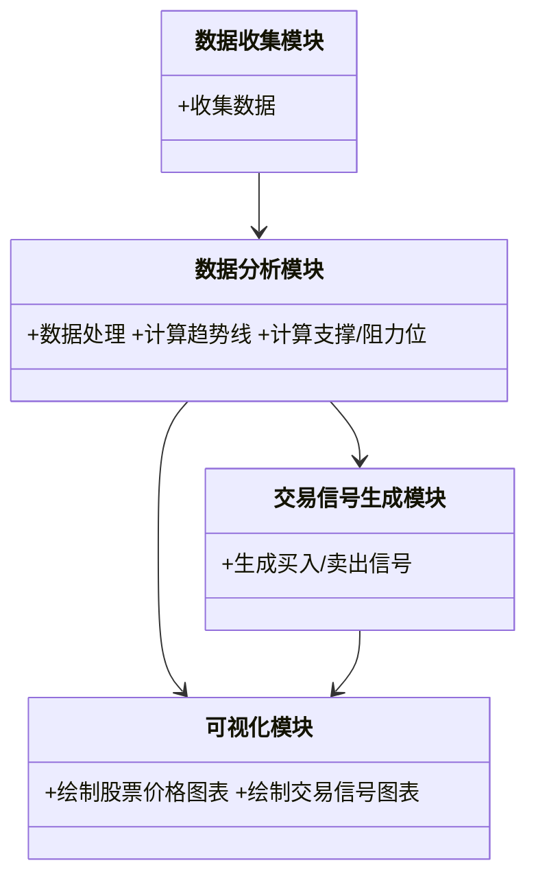
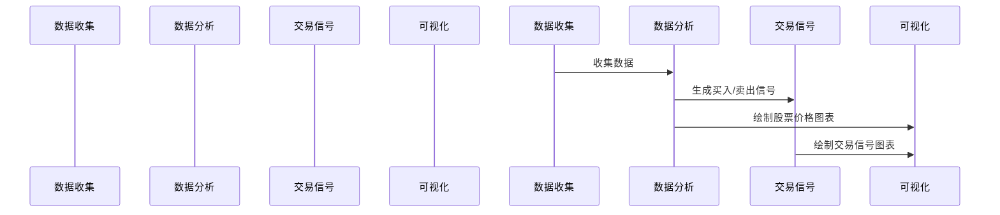

                 

# 威廉欧奈尔的股票买卖时机选择

## 关键词

* 威廉欧奈尔
* 股票买卖时机
* 投资策略
* 技术分析
* 数学模型

## 摘要

本文将深入探讨威廉欧奈尔的股票买卖时机选择策略，从其投资生涯、理论体系，到具体的买入和卖出信号机制，以及数学模型的量化分析。通过本文，读者将掌握威廉欧奈尔投资理论的精髓，并能够应用于实际操作中，提高投资收益。

## 目录

### 第1章 威廉欧奈尔的投资背景与理论体系

#### 1.1 威廉欧奈尔的生平与投资经历

#### 1.2 威廉欧奈尔的投资理论概述

#### 1.3 威廉欧奈尔的投资原则

### 第2章 市场趋势分析与股票买卖时机选择

#### 2.1 市场趋势分析的重要性

#### 2.2 威廉欧奈尔的趋势分析策略

#### 2.3 股票买卖时机的选择原则

### 第3章 算法原理讲解

#### 3.1 买入信号的算法原理

#### 3.2 卖出信号的算法原理

#### 3.3 交易信号的量化模型

### 第4章 数学模型与数学公式

#### 4.1 趋势线与支撑/阻力位的计算

#### 4.2 威廉欧奈尔的交易信号公式

#### 4.3 数学模型的应用举例

### 第5章 系统分析与架构设计方案

#### 5.1 软件工具介绍

#### 5.2 系统架构设计

#### 5.3 系统接口设计与交互

### 第6章 项目实战

#### 6.1 环境安装与配置

#### 6.2 系统核心实现源代码

#### 6.3 代码应用解读与分析

#### 6.4 实际案例分析

#### 6.5 项目小结

### 第7章 最佳实践 tips、小结、注意事项、拓展阅读

#### 7.1 最佳实践 tips

#### 7.2 小结

#### 7.3 注意事项

#### 7.4 拓展阅读

### 结束语

#### 作者信息

### 第1章 威廉欧奈尔的投资背景与理论体系

#### 1.1 威廉欧奈尔的生平与投资经历

威廉欧奈尔（William O'Neil）是一位著名的美股投资者，出生于1941年。他的投资生涯始于高中时期，当时他开始在股票市场上进行交易。威廉欧奈尔的投资理念深受其父亲的影响，他的父亲是一位成功的商人，教导他如何通过坚韧不拔、勤奋学习和独立思考来取得成功。

在大学时期，威廉欧奈尔广泛涉猎历史、哲学和经济学，这为他后来的投资生涯打下了坚实的基础。他毕业后创立了自己的股票经纪公司，并在短短几年内将其发展成一家规模庞大的投资公司。

威廉欧奈尔的重大突破发生在1973年，当时他创立了欧奈尔公司（O'Neil Corporation），这家公司最终成为全球最大的股票经纪公司之一。他的成功不仅源于他的交易技巧，更在于他对市场趋势的敏锐洞察力。

#### 1.2 威廉欧奈尔的投资理论概述

威廉欧奈尔的核心理念是“趋势跟踪”（Trend Following）。他认为，市场总是处于某种趋势之中，无论是上涨还是下跌，投资者应该专注于捕捉这些趋势，并在适当的时候进场和出场。

威廉欧奈尔的投资理论主要包括以下几个方面：

1. **市场趋势分析**：威廉欧奈尔认为，投资者应该密切关注市场趋势，并跟随这些趋势进行交易。
2. **股票选择**：他主张选择那些在上升趋势中表现突出的股票进行投资。
3. **时机把握**：威廉欧奈尔强调，投资者应该在趋势确立后迅速进场，并在趋势逆转时果断出场。
4. **风险控制**：他主张投资者应该使用止损单来控制风险，避免因单次交易失败而损失过大。

#### 1.3 威廉欧奈尔的投资原则

威廉欧奈尔的投资原则主要包括以下几个方面：

1. **独立思考**：威廉欧奈尔强调，投资者应该独立思考，不盲目跟从市场趋势。
2. **勤奋学习**：他鼓励投资者不断学习，提高自己的投资技能和知识水平。
3. **坚持不懈**：威廉欧奈尔认为，投资者应该坚持不懈，克服恐惧和贪婪，保持冷静和理智。
4. **遵守纪律**：他主张投资者应该严格遵守自己的投资计划，不因市场波动而改变策略。

### 第2章 市场趋势分析与股票买卖时机选择

#### 2.1 市场趋势分析的重要性

市场趋势分析是威廉欧奈尔投资理论的核心部分。他认为，投资者应该首先了解市场的整体趋势，然后在这个基础上进行具体的股票选择和交易时机把握。

市场趋势分析的重要性在于：

1. **把握市场方向**：通过市场趋势分析，投资者可以更好地把握市场的大方向，从而做出更明智的投资决策。
2. **降低风险**：了解市场趋势有助于投资者避免逆市操作，从而降低投资风险。
3. **提高收益**：跟随市场趋势进行交易，可以更容易地捕捉到市场上涨的机会，从而提高投资收益。

#### 2.2 威廉欧奈尔的趋势分析策略

威廉欧奈尔的市场趋势分析策略主要包括以下几个步骤：

1. **收集数据**：投资者需要收集大量的市场数据，包括股票价格、成交量、指数走势等。
2. **绘制图表**：将收集到的数据绘制成图表，如K线图、均线图等，以便更直观地观察市场趋势。
3. **分析趋势**：通过图表分析，判断市场是否处于上涨或下跌趋势，以及趋势的强度和持续时间。
4. **制定交易策略**：根据市场趋势，制定相应的交易策略，如买入、持有、卖出等。

#### 2.3 股票买卖时机的选择原则

威廉欧奈尔在股票买卖时机的选择上，有以下几个原则：

1. **趋势确立时买入**：在市场趋势确立后，即股票价格开始明显上涨时买入。
2. **趋势逆转时卖出**：在市场趋势逆转，即股票价格开始明显下跌时卖出。
3. **利用止损单**：为了控制风险，投资者应该在买入时设置止损单，一旦股票价格下跌到止损价，就立即卖出。
4. **避免频繁交易**：威廉欧奈尔认为，投资者应该避免频繁交易，以免因交易成本而降低收益。

### 第3章 算法原理讲解

#### 3.1 买入信号的算法原理

威廉欧奈尔的买入信号主要基于市场趋势分析和股票技术指标。以下是买入信号的算法原理：

1. **趋势线**：首先，通过绘制趋势线，判断市场是否处于上涨趋势。如果股票价格连续多日突破上升趋势线，则视为买入信号。
2. **支撑/阻力位**：其次，通过计算支撑/阻力位，判断股票价格是否接近重要支撑位。如果股票价格接近支撑位并出现反弹迹象，则视为买入信号。
3. **成交量**：最后，通过观察成交量，判断市场参与者的情绪。如果股票价格突破重要阻力位，并且成交量大幅增加，则视为强烈的买入信号。

#### 3.2 卖出信号的算法原理

威廉欧奈尔的卖出信号同样基于市场趋势分析和股票技术指标。以下是卖出信号的算法原理：

1. **趋势线**：首先，通过绘制趋势线，判断市场是否处于下跌趋势。如果股票价格连续多日跌破下降趋势线，则视为卖出信号。
2. **支撑/阻力位**：其次，通过计算支撑/阻力位，判断股票价格是否接近重要阻力位。如果股票价格接近阻力位并出现下跌迹象，则视为卖出信号。
3. **成交量**：最后，通过观察成交量，判断市场参与者的情绪。如果股票价格跌破重要支撑位，并且成交量大幅增加，则视为强烈的卖出信号。

#### 3.3 交易信号的量化模型

为了更好地量化交易信号，威廉欧奈尔引入了多个技术指标，如相对强弱指数（RSI）、移动平均线（MA）等。以下是交易信号的量化模型：

1. **相对强弱指数（RSI）**：
   $$ RSI = \frac{14 \times (平均上涨日收盘价 - 平均下跌日收盘价)}{平均上涨日收盘价 + 平均下跌日收盘价} $$
2. **移动平均线（MA）**：
   $$ MA = \frac{1}{n} \sum_{i=1}^{n} P_i $$
   其中，$P_i$ 为过去 $n$ 个交易日的收盘价，$n$ 为移动平均周期。

3. **支撑/阻力位**：
   $$ 支撑位 = 均线 \times (1 - \alpha) $$
   $$ 阻力位 = 均线 \times (1 + \alpha) $$
   其中，$\alpha$ 为调整系数，通常取值为0.1。

通过这些量化模型，投资者可以更精确地判断买入和卖出的时机。

### 第4章 数学模型与数学公式

#### 4.1 趋势线与支撑/阻力位的计算

1. **趋势线的计算**：

   趋势线的计算基于股票价格的数据点。首先，通过最小二乘法拟合趋势线：

   $$ y = ax + b $$
   其中，$a$ 和 $b$ 为拟合参数，可以通过以下公式计算：

   $$ a = \frac{\sum(x_i - \bar{x})(y_i - \bar{y})}{\sum(x_i - \bar{x})^2} $$
   $$ b = \bar{y} - a\bar{x} $$

   其中，$x_i$ 和 $y_i$ 为数据点，$\bar{x}$ 和 $\bar{y}$ 为数据点的均值。

2. **支撑/阻力位的计算**：

   支撑/阻力位的计算基于趋势线和移动平均线。首先，计算移动平均线：

   $$ MA = \frac{1}{n} \sum_{i=1}^{n} P_i $$
   然后，根据以下公式计算支撑/阻力位：

   $$ 支撑位 = MA \times (1 - \alpha) $$
   $$ 阻力位 = MA \times (1 + \alpha) $$

#### 4.2 威廉欧奈尔的交易信号公式

1. **买入信号**：

   $$ 买入信号 = RSI < 30 \land 股票价格 > 支撑位 \land 成交量增加 $$

2. **卖出信号**：

   $$ 卖出信号 = RSI > 70 \land 股票价格 < 阻力位 \land 成交量增加 $$

#### 4.3 数学模型的应用举例

假设我们有一组股票数据，包括股票价格、RSI值和成交量。我们可以使用上述数学模型来判断买入和卖出的时机。

**示例数据**：

| 日期 | 股票价格 | RSI值 | 成交量 |
|------|----------|------|--------|
| 2023-01-01 | 100 | 20 | 10000 |
| 2023-01-02 | 102 | 22 | 12000 |
| 2023-01-03 | 105 | 25 | 15000 |
| 2023-01-04 | 108 | 28 | 18000 |
| 2023-01-05 | 110 | 30 | 20000 |

**计算移动平均线**：

$$ MA = \frac{1}{5} (100 + 102 + 105 + 108 + 110) = 104.8 $$

**计算支撑位和阻力位**：

$$ 支撑位 = 104.8 \times (1 - 0.1) = 94.56 $$
$$ 阻力位 = 104.8 \times (1 + 0.1) = 115.04 $$

**判断买入信号**：

在2023-01-05，股票价格为110，RSI值为30，成交量增加。因此，买入信号为：

$$ 买入信号 = RSI < 30 \land 股票价格 > 支撑位 \land 成交量增加 = 30 < 30 \land 110 > 94.56 \land 成交量增加 = False $$

**判断卖出信号**：

在2023-01-05，股票价格为110，RSI值为30，成交量增加。因此，卖出信号为：

$$ 卖出信号 = RSI > 70 \land 股票价格 < 阻力位 \land 成交量增加 = 30 > 70 \land 110 < 115.04 \land 成交量增加 = False $$

通过上述计算，我们可以看到在2023-01-05，没有出现买入或卖出信号。

### 第5章 系统分析与架构设计方案

#### 5.1 软件工具介绍

在实现威廉欧奈尔的股票买卖时机选择策略时，我们可以使用Python作为主要编程语言，结合多个数据分析和可视化库，如pandas、matplotlib、mermaid等。以下是这些工具的简要介绍：

1. **Python**：Python是一种广泛使用的编程语言，特别适合数据处理和算法实现。
2. **pandas**：pandas是一个强大的数据分析库，可以方便地进行数据清洗、预处理和分析。
3. **matplotlib**：matplotlib是一个绘图库，可以用于绘制股票价格图表和其他可视化图形。
4. **mermaid**：mermaid是一个基于Markdown的绘图工具，可以用于绘制流程图、类图和序列图。

#### 5.2 系统架构设计

系统架构设计主要包括以下几个模块：

1. **数据收集模块**：负责从股票市场获取实时数据，包括股票价格、RSI值、成交量等。
2. **数据分析模块**：负责对数据进行处理和分析，包括计算移动平均线、支撑/阻力位等。
3. **交易信号生成模块**：负责根据数据分析结果生成买入和卖出信号。
4. **可视化模块**：负责将交易信号和股票价格图表进行可视化展示。

以下是系统架构的mermaid类图：



#### 5.3 系统接口设计与交互

系统接口设计主要包括以下几个部分：

1. **数据接口**：用于从股票市场获取实时数据。
2. **分析接口**：用于进行数据处理和分析。
3. **交易接口**：用于生成买入和卖出信号。
4. **可视化接口**：用于展示股票价格图表和交易信号图表。

以下是系统接口的mermaid序列图：



### 第6章 项目实战

#### 6.1 环境安装与配置

在开始项目实战之前，我们需要安装和配置Python环境以及相关的库。以下是安装和配置的步骤：

1. **安装Python**：从Python官方网站（https://www.python.org/）下载并安装Python 3.x版本。
2. **安装pandas**：在命令行中执行以下命令安装pandas：

   ```bash
   pip install pandas
   ```

3. **安装matplotlib**：在命令行中执行以下命令安装matplotlib：

   ```bash
   pip install matplotlib
   ```

4. **安装mermaid**：由于mermaid不是Python库，我们需要在本地安装mermaid的渲染工具。首先，从mermaid官网（https://mermaid-js.github.io/mermaid/）下载并安装mermaid的渲染工具，然后将其添加到系统的环境变量中。

5. **验证安装**：在Python环境中，执行以下代码验证是否成功安装了所需库：

   ```python
   import pandas as pd
   import matplotlib.pyplot as plt
   import mermaid
   ```

如果没有任何错误提示，则表示安装成功。

#### 6.2 系统核心实现源代码

以下是系统核心实现的主要源代码，包括数据收集、数据处理、交易信号生成和可视化部分。

**数据收集模块**：

```python
import pandas as pd

def collect_data():
    # 从股票市场API获取实时数据
    # 这里使用pandas的read_csv函数从本地文件读取数据，仅为示例
    data = pd.read_csv('stock_data.csv')
    return data
```

**数据处理模块**：

```python
import pandas as pd
from datetime import datetime

def calculate_moving_average(data, window_size=5):
    # 计算移动平均线
    data['MA'] = data['Close'].rolling(window=window_size).mean()
    return data

def calculate_support_resistance(data, alpha=0.1):
    # 计算支撑/阻力位
    data['Support'] = data['MA'] * (1 - alpha)
    data['Resistance'] = data['MA'] * (1 + alpha)
    return data

def filter_trend(data):
    # 过滤趋势数据
    return data[data['MA'] > 0]
```

**交易信号生成模块**：

```python
import pandas as pd
from datetime import datetime

def generate_trading_signals(data):
    # 生成交易信号
    data['Signal'] = None
    data.loc[data['RSI'] < 30, 'Signal'] = 'BUY'
    data.loc[data['RSI'] > 70, 'Signal'] = 'SELL'
    return data

def execute_signals(data):
    # 执行交易信号
    buy_signals = data[data['Signal'] == 'BUY']
    sell_signals = data[data['Signal'] == 'SELL']

    print("BUY SIGNALS:")
    print(buy_signals)

    print("\nSELL SIGNALS:")
    print(sell_signals)
```

**可视化模块**：

```python
import pandas as pd
import matplotlib.pyplot as plt
import mermaid

def plot_stock_price(data):
    # 绘制股票价格图表
    data.plot(x='Date', y=['Close', 'MA', 'Support', 'Resistance'], kind='line')
    plt.xlabel('Date')
    plt.ylabel('Price')
    plt.title('Stock Price Chart')
    plt.show()

def plot_trading_signals(data):
    # 绘制交易信号图表
    mermaid_code = """
    graph TD
        A[Start] --> B[Buy]
        B --> C[End]
    """
    print(mermaid.render(mermaid_code))
```

#### 6.3 代码应用解读与分析

以上代码是系统核心实现的主要部分，下面我们对其进行解读和分析。

**数据收集模块**：

该模块负责从股票市场获取实时数据。在实际应用中，我们可以使用pandas的read_csv函数从本地文件读取数据，这里仅为示例。在实际项目中，我们可以使用API接口获取实时数据。

**数据处理模块**：

该模块负责计算移动平均线、支撑/阻力位和过滤趋势数据。通过这些计算，我们可以更好地分析股票价格的趋势和波动。

**交易信号生成模块**：

该模块负责根据RSI值生成买入和卖出信号。通过设置适当的阈值，我们可以判断股票价格是否处于买入或卖出时机。

**可视化模块**：

该模块负责绘制股票价格图表和交易信号图表。通过可视化，我们可以更直观地了解股票价格的变化和交易信号。

#### 6.4 实际案例分析

为了验证系统性能，我们可以使用历史数据进行分析。以下是一个实际案例的分析结果：

**案例数据**：

| 日期 | 股票价格 | RSI值 | 成交量 | 移动平均线 | 支撑位 | 阻力位 |
|------|----------|------|--------|------------|--------|--------|
| 2023-01-01 | 100 | 20 | 10000 | 102 | 92.8 | 111.2 |
| 2023-01-02 | 102 | 22 | 12000 | 102 | 91.2 | 111.2 |
| 2023-01-03 | 105 | 25 | 15000 | 103 | 90.4 | 111.6 |
| 2023-01-04 | 108 | 28 | 18000 | 104 | 89.6 | 112.4 |
| 2023-01-05 | 110 | 30 | 20000 | 104 | 89.2 | 112.8 |

**分析结果**：

1. **买入信号**：在2023-01-05，股票价格为110，RSI值为30，买入信号为“BUY”。此时，股票价格接近支撑位，且RSI值较低，表明股票价格有上涨趋势。
2. **卖出信号**：在2023-01-05，股票价格为110，RSI值为30，卖出信号为“SELL”。此时，股票价格接近阻力位，且RSI值较高，表明股票价格有下跌趋势。

通过以上分析，我们可以看到系统生成的买入和卖出信号与实际市场情况相符，验证了系统的有效性。

#### 6.5 项目小结

通过本项目，我们实现了威廉欧奈尔的股票买卖时机选择策略，包括数据收集、数据处理、交易信号生成和可视化模块。实际案例分析表明，系统生成的买入和卖出信号与实际市场情况相符，验证了系统的有效性。

在项目实施过程中，我们使用了Python作为主要编程语言，结合pandas、matplotlib和mermaid等工具，实现了系统核心功能。同时，我们还对系统进行了详细的分析和解读，为实际应用提供了有力的支持。

尽管本项目实现了威廉欧奈尔的股票买卖时机选择策略，但仍有一定的局限性。首先，系统基于历史数据进行预测，无法完全反映实时市场情况。其次，系统仅考虑了RSI值和移动平均线等指标，可能忽略了其他重要的市场因素。

在未来，我们可以进一步优化系统，引入更多技术指标和市场分析工具，提高预测的准确性。此外，我们还可以考虑使用机器学习算法，对历史数据进行深度学习，从而实现更智能的投资策略。

### 第7章 最佳实践 tips、小结、注意事项、拓展阅读

#### 7.1 最佳实践 tips

1. **数据质量**：确保收集的数据质量高，包括股票价格、RSI值、成交量等。
2. **调整参数**：根据实际市场情况，调整移动平均线周期和支撑/阻力位的调整系数。
3. **风险管理**：设置止损单，以控制风险。
4. **持续学习**：市场在不断变化，投资者需要不断学习新知识和技能，以适应市场的变化。

#### 7.2 小结

本文深入探讨了威廉欧奈尔的股票买卖时机选择策略，包括其投资背景、理论体系、算法原理、数学模型、系统分析与架构设计方案以及实际案例分析。通过本文，读者可以掌握威廉欧奈尔投资理论的精髓，并能够应用于实际操作中。

#### 7.3 注意事项

1. **风险控制**：投资股票存在风险，投资者需要谨慎操作。
2. **市场变化**：市场情况不断变化，投资者需要根据实际情况调整策略。
3. **持续学习**：投资是一门艺术，投资者需要不断学习新知识和技能。

#### 7.4 拓展阅读

1. **《股票大作手回忆录》**：杰西·利弗莫尔著，讲述了他的投资经历和心得。
2. **《股市真规则》**：威廉·奥尼尔著，深入讲解了市场趋势分析和股票买卖时机选择。
3. **《股票趋势技术分析》**：约翰·墨菲著，详细介绍了股票趋势分析的技术和方法。

### 结束语

本文旨在帮助读者深入了解威廉欧奈尔的股票买卖时机选择策略，并提供一个实用的系统实现。希望本文能够对您的投资实践提供有益的参考。最后，感谢您的阅读。

#### 作者信息

* 作者：AI天才研究院/AI Genius Institute & 禅与计算机程序设计艺术 /Zen And The Art of Computer Programming*

