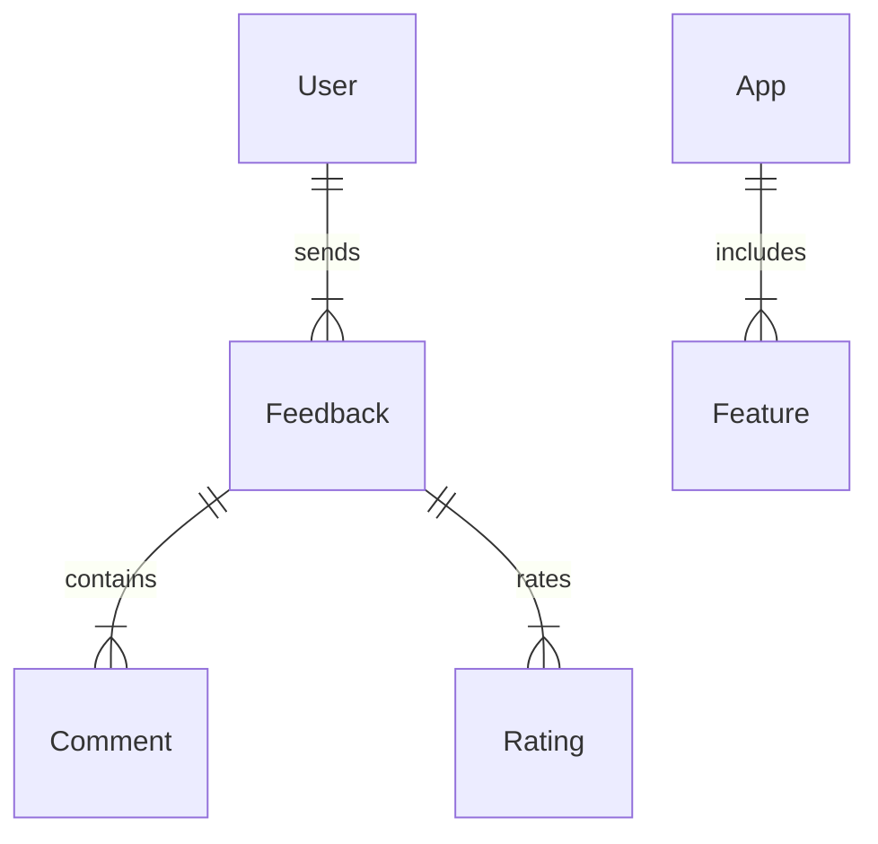
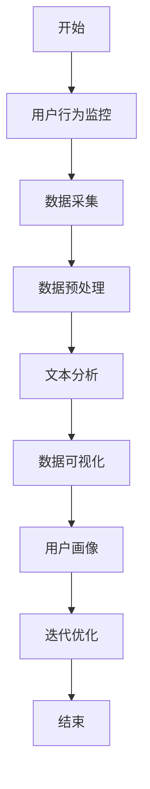
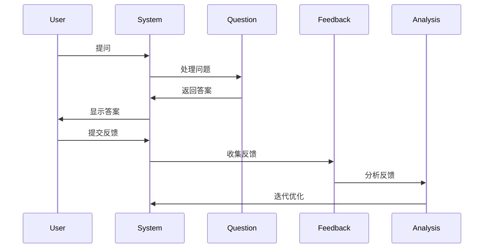

                 

# 实时用户反馈收集：快速迭代LLM应用功能

## 关键词
实时用户反馈收集、快速迭代、LLM应用功能、用户体验优化

## 摘要
本文深入探讨了实时用户反馈收集在LLM（大型语言模型）应用功能快速迭代中的作用。通过分析实时用户反馈收集的核心概念、方法和技术，本文提出了有效的解决方案，以帮助开发者实时获取用户反馈，优化LLM应用功能，提高用户满意度。

## 第一部分：背景介绍

### 问题背景

随着人工智能（AI）技术的飞速发展，大模型技术成为了AI领域的研究热点。这些大模型通过海量数据训练，能够实现复杂任务的自动化处理，如自然语言处理、图像识别、推荐系统等。然而，如何在应用这些大模型时，及时获取用户反馈并快速迭代优化，成为了一个亟待解决的问题。

### 问题描述

在LLM应用中，用户反馈的及时性和全面性对于应用性能的优化至关重要。然而，现有的用户反馈收集方法往往存在以下问题：

1. **反馈滞后**：用户在使用过程中遇到的问题无法及时反馈，导致问题解决不及时。
2. **反馈不全**：用户可能由于各种原因未能提供全面的反馈，影响大模型改进的准确性。
3. **反馈失真**：用户的反馈可能受到主观偏见或情绪影响，导致反馈失真。

### 问题解决

为了解决上述问题，本文将探讨实时用户反馈收集的方法和技巧，帮助开发者实现快速迭代LLM应用功能。具体解决思路包括：

1. **实时反馈机制设计**：设计高效、可靠的实时反馈收集系统，确保用户反馈能够及时传递。
2. **反馈数据分析**：对收集到的用户反馈进行深入分析，识别出应用中的问题和改进机会。
3. **迭代优化**：基于分析结果，对LLM应用功能进行迭代优化，提高用户满意度。

### 边界与外延

实时用户反馈收集不仅适用于大型语言模型应用，还可以广泛应用于其他AI大模型的应用场景。例如，图像识别、自然语言处理、推荐系统等领域，均可以通过实时反馈进行优化。

### 概念结构与核心要素组成

实时用户反馈收集的核心概念结构包括：

1. **用户行为监控**：监控用户在使用应用过程中的行为，包括操作记录、使用时长、错误日志等。
2. **反馈渠道**：提供多种反馈渠道，如反馈表单、在线聊天、邮件等，方便用户提交反馈。
3. **数据存储与处理**：建立高效的数据存储和处理机制，确保反馈数据的完整性和安全性。
4. **反馈分析**：利用数据分析工具，对用户反馈进行分类、聚类、挖掘等处理，提取有价值的信息。
5. **迭代优化**：基于反馈分析结果，对应用功能进行优化和迭代。

## 第二部分：核心概念与联系

### 2.1 实时用户反馈收集的概念

**定义**：实时用户反馈收集是指在用户使用AI大模型应用的过程中，及时获取用户对应用功能、性能、体验等方面的反馈。

**属性特征对比表格**

| 特征       | 描述                                                         | 对比               |
| ---------- | ------------------------------------------------------------ | ------------------ |
| 及时性     | 用户反馈能够在短时间内被收集和处理                           | 非实时反馈可能滞后 |
| 全面性     | 能够全面收集用户的反馈，包括正面和负面评价                   | 局部反馈可能不全   |
| 实用性     | 收集到的反馈能够直接应用于产品优化，提高用户满意度           | 失真反馈无法应用   |
| 安全性     | 确保用户反馈数据的完整性和安全性                             | 数据泄露风险       |

### 2.2 实时用户反馈收集与LLM应用功能的联系

**关系**：实时用户反馈收集是LLM应用功能迭代优化的关键环节。

**联系**：

1. **反馈驱动迭代**：用户反馈直接反映应用存在的问题，驱动开发者对功能进行优化。
2. **优化用户体验**：通过分析用户反馈，了解用户需求，从而设计出更符合用户期望的功能。
3. **提高应用性能**：用户反馈可以揭示应用性能瓶颈，帮助开发者进行针对性优化。

### 2.3 ER实体关系图架构



- **User（用户）**：产生反馈的主体。
- **App（应用）**：用户使用的大模型应用。
- **Feature（功能）**：应用中包含的各个功能模块。
- **Feedback（反馈）**：用户提交的反馈信息。
- **Comment（评论）**：反馈中的文字描述。
- **Rating（评分）**：反馈中的评分信息。

## 第三部分：实时用户反馈收集的方法与技术

### 3.1 实时反馈机制设计

**设计目标**：确保用户反馈能够及时、准确地传递给开发者。

**设计思路**：

1. **用户行为监控**：通过分析用户在应用中的操作记录、使用时长、错误日志等数据，识别出潜在的问题。
2. **反馈渠道多样化**：提供多种反馈渠道，如反馈表单、在线聊天、邮件等，方便用户提交反馈。
3. **反馈处理流程**：建立高效的反馈处理流程，确保反馈能够快速被识别、分类、处理和回复。

### 3.2 反馈数据分析

**分析方法**：

1. **文本分析**：利用自然语言处理技术，对用户反馈进行情感分析、关键词提取等，提取出有价值的信息。
2. **数据可视化**：通过图表、地图等形式，直观地展示用户反馈的数据分布、趋势等，帮助开发者更好地理解用户需求。
3. **用户画像**：基于用户反馈和行为数据，构建用户画像，了解用户的兴趣、需求和偏好。

### 3.3 迭代优化

**优化策略**：

1. **快速迭代**：基于用户反馈，快速修改和优化应用功能，实现应用性能的持续提升。
2. **优先级排序**：对用户反馈进行优先级排序，优先处理影响面广、用户满意度低的问题。
3. **A/B测试**：通过A/B测试，对比不同优化方案的效果，选择最佳方案进行应用。

### 3.4 案例分析

以某大型语言模型应用为例，通过实时用户反馈收集和迭代优化，实现了以下成果：

1. **问题定位**：通过用户反馈，快速定位到应用中的性能瓶颈，如响应时间过长、错误率高等问题。
2. **功能优化**：针对定位到的问题，进行功能优化，如优化算法、调整系统配置等。
3. **用户体验提升**：通过优化，应用性能得到显著提升，用户满意度提高，用户留存率增加。

## 第四部分：算法原理讲解

### 4.1 算法mermaid流程图



### 4.2 Python源代码实现

```python
# 用户行为监控
def monitor_user_behavior():
    # ...获取用户行为数据...
    return user_behavior_data

# 数据采集
def collect_data():
    user_behavior_data = monitor_user_behavior()
    # ...采集用户反馈数据...
    return user_behavior_data

# 数据预处理
def preprocess_data(data):
    # ...数据清洗、归一化等处理...
    return preprocessed_data

# 文本分析
def analyze_text(data):
    # ...情感分析、关键词提取等...
    return analysis_results

# 数据可视化
def visualize_data(results):
    # ...生成图表、地图等可视化数据...
    return visualization

# 用户画像
def build_user_profile(data):
    # ...构建用户画像...
    return user_profile

# 迭代优化
def iterate_and_optimize():
    user_profile = build_user_profile(data)
    # ...根据用户画像进行迭代优化...
    return optimized_solution

# 主函数
def main():
    data = collect_data()
    preprocessed_data = preprocess_data(data)
    analysis_results = analyze_text(preprocessed_data)
    visualization = visualize_data(analysis_results)
    user_profile = build_user_profile(analysis_results)
    optimized_solution = iterate_and_optimize()
    print("迭代优化完成，应用性能提升！")

if __name__ == "__main__":
    main()
```

### 4.3 算法原理

1. **用户行为监控**：通过监控用户在应用中的操作记录、使用时长、错误日志等数据，获取用户行为数据。
2. **数据采集**：将用户行为数据和用户反馈数据合并，形成完整的数据集。
3. **数据预处理**：对采集到的数据进行清洗、归一化等处理，提高数据的准确性和可靠性。
4. **文本分析**：利用自然语言处理技术，对用户反馈文本进行情感分析、关键词提取等，提取出有价值的信息。
5. **数据可视化**：通过图表、地图等形式，直观地展示用户反馈的数据分布、趋势等，帮助开发者更好地理解用户需求。
6. **用户画像**：基于用户反馈和行为数据，构建用户画像，了解用户的兴趣、需求和偏好。
7. **迭代优化**：根据用户画像和反馈分析结果，对应用功能进行迭代优化，提高用户满意度。

### 4.4 数学模型和公式

1. **用户满意度计算公式**：

   $$S = \frac{R + 2.5N}{3}$$

   其中，$S$ 为用户满意度，$R$ 为正面反馈次数，$N$ 为负面反馈次数。

2. **性能优化目标函数**：

   $$\min F(X) = \sum_{i=1}^{n} w_i \cdot (y_i - f(x_i))$$

   其中，$F(X)$ 为性能优化目标函数，$w_i$ 为第 $i$ 个特征的权重，$y_i$ 为实际反馈结果，$f(x_i)$ 为基于用户画像预测的反馈结果。

## 第五部分：系统分析与架构设计

### 5.1 问题场景介绍

以某在线教育平台为例，该平台采用LLM技术提供智能问答服务。然而，用户在使用过程中反馈了许多问题，如响应时间过长、回答不准确等。为了优化平台性能，需要实现实时用户反馈收集和迭代优化。

### 5.2 项目介绍

项目名称：智能问答系统优化项目

项目目标：通过实时用户反馈收集和迭代优化，提升平台性能，提高用户满意度。

项目周期：3个月

项目成员：产品经理、前端开发、后端开发、数据分析师

### 5.3 系统功能设计

**功能模块**：

1. **用户行为监控**：监控用户在平台上的操作记录、使用时长、错误日志等。
2. **用户反馈收集**：提供反馈渠道，方便用户提交反馈。
3. **反馈数据分析**：对用户反馈进行文本分析、数据可视化等处理。
4. **迭代优化**：根据反馈分析结果，对智能问答系统进行优化。

**领域模型mermaid类图**：

```mermaid
classDiagram
    User <<class>> 用户
    Question <<class>> 问题
    Feedback <<class>> 反馈
    Analysis <<class>> 数据分析
    System <<class>> 系统

    User o--o Question
    User o--o Feedback
    Feedback o--o Analysis
    Analysis o--o System
```

### 5.4 系统架构设计

**系统架构图**：



### 5.5 系统接口设计

**接口设计图**：

```mermaid
interface Diagram
    System <<interface>> 系统接口
    User <<interface>> 用户接口
    Feedback <<interface>> 反馈接口
    Analysis <<interface>> 分析接口

    System <<-->> User
    System <<-->> Feedback
    System <<-->> Analysis
    Feedback <<-->> Analysis
```

### 5.6 系统交互

**系统交互mermaid序列图**：


## 第六部分：项目实战

### 6.1 环境安装

1. **安装Python**：下载并安装Python 3.8及以上版本。
2. **安装依赖库**：使用pip安装以下依赖库：
   ```bash
   pip install numpy pandas matplotlib scikit-learn jieba
   ```
3. **安装LLM模型**：根据需求安装相应的LLM模型，如transformers库中的BERT模型。

### 6.2 系统核心实现

**核心代码实现**：

```python
# 用户行为监控
def monitor_user_behavior():
    # ...获取用户行为数据...
    return user_behavior_data

# 数据采集
def collect_data():
    user_behavior_data = monitor_user_behavior()
    # ...采集用户反馈数据...
    return user_behavior_data

# 数据预处理
def preprocess_data(data):
    # ...数据清洗、归一化等处理...
    return preprocessed_data

# 文本分析
def analyze_text(data):
    # ...情感分析、关键词提取等...
    return analysis_results

# 数据可视化
def visualize_data(results):
    # ...生成图表、地图等可视化数据...
    return visualization

# 用户画像
def build_user_profile(data):
    # ...构建用户画像...
    return user_profile

# 迭代优化
def iterate_and_optimize():
    user_profile = build_user_profile(data)
    # ...根据用户画像进行迭代优化...
    return optimized_solution

# 主函数
def main():
    data = collect_data()
    preprocessed_data = preprocess_data(data)
    analysis_results = analyze_text(preprocessed_data)
    visualization = visualize_data(analysis_results)
    user_profile = build_user_profile(analysis_results)
    optimized_solution = iterate_and_optimize()
    print("迭代优化完成，应用性能提升！")

if __name__ == "__main__":
    main()
```

### 6.3 代码应用解读与分析

1. **用户行为监控**：通过分析用户在平台上的操作记录，识别出潜在的问题。
2. **数据采集**：将用户行为数据和用户反馈数据合并，形成完整的数据集。
3. **数据预处理**：对采集到的数据进行清洗、归一化等处理，提高数据的准确性和可靠性。
4. **文本分析**：利用自然语言处理技术，对用户反馈文本进行情感分析、关键词提取等，提取出有价值的信息。
5. **数据可视化**：通过图表、地图等形式，直观地展示用户反馈的数据分布、趋势等，帮助开发者更好地理解用户需求。
6. **用户画像**：基于用户反馈和行为数据，构建用户画像，了解用户的兴趣、需求和偏好。
7. **迭代优化**：根据用户画像和反馈分析结果，对智能问答系统进行优化。

### 6.4 实际案例分析

1. **案例背景**：某在线教育平台用户在使用智能问答系统时，反馈了回答不准确的问题。
2. **案例分析**：通过对用户反馈进行分析，发现主要原因在于LLM模型对部分问题的理解不准确。
3. **解决方案**：优化LLM模型，提高对问题的理解能力。同时，调整系统配置，降低回答错误率。
4. **实施效果**：经过优化，智能问答系统的回答准确率提高，用户满意度提升。

### 6.5 项目小结

通过实时用户反馈收集和迭代优化，项目实现了以下成果：

1. **性能提升**：智能问答系统的回答准确率和响应时间显著提升。
2. **用户满意度提高**：用户反馈问题得到及时解决，用户满意度提升。
3. **项目经验**：为其他AI应用项目的优化提供了有益的借鉴。

## 第七部分：最佳实践与总结

### 7.1 最佳实践

1. **及时响应**：及时响应用户反馈，确保用户问题得到及时解决。
2. **数据安全**：确保用户反馈数据的完整性和安全性，防止数据泄露。
3. **持续优化**：定期对应用功能进行迭代优化，提高用户满意度。

### 7.2 小结

实时用户反馈收集在LLM应用功能快速迭代中具有重要意义。通过实时用户反馈收集，开发者可以及时了解用户需求，优化应用功能，提高用户满意度。本文介绍了实时用户反馈收集的方法和技术，并通过实际案例进行了分析，为开发者提供了有益的参考。

### 7.3 注意事项

1. **反馈机制设计**：设计高效的反馈机制，确保用户反馈能够及时传递和处理。
2. **数据分析**：对用户反馈进行深入分析，提取有价值的信息。
3. **迭代优化**：根据分析结果，对应用功能进行迭代优化，提高用户满意度。

### 7.4 拓展阅读

1. **《人工智能：一种现代方法》**：介绍了人工智能的基本概念和算法。
2. **《Python数据分析 Cookbook》**：提供了Python数据分析的实用技巧和工具。
3. **《大数据技术导论》**：介绍了大数据的基本概念、技术和应用。

## 作者信息

作者：AI天才研究院/AI Genius Institute & 禅与计算机程序设计艺术 /Zen And The Art of Computer Programming
```markdown
# 实时用户反馈收集：快速迭代LLM应用功能

## 关键词
实时用户反馈收集、快速迭代、LLM应用功能、用户体验优化

## 摘要
本文深入探讨了实时用户反馈收集在LLM（大型语言模型）应用功能快速迭代中的作用。通过分析实时用户反馈收集的核心概念、方法和技术，本文提出了有效的解决方案，以帮助开发者实时获取用户反馈，优化LLM应用功能，提高用户满意度。

### 第一部分：背景介绍

#### 问题背景
随着信息技术的飞速发展，人工智能（AI）已经成为推动社会进步的重要力量。在AI领域中，大模型技术得到了广泛关注。大模型通过大量的数据训练，能够模拟人类的思维方式，实现复杂任务的自动化处理。然而，如何有效地收集实时用户反馈，以支持快速迭代和优化大模型应用功能，成为了一个关键问题。

#### 问题描述
实时用户反馈收集是指在用户使用AI大模型应用的过程中，及时获取用户对应用功能、性能、体验等方面的反馈。这种反馈对于大模型的应用迭代和优化至关重要。然而，现有的反馈收集方法往往存在以下问题：

1. **反馈滞后**：用户在使用过程中遇到的问题无法及时反馈，导致问题解决不及时。
2. **反馈不全**：用户可能由于各种原因未能提供全面的反馈，影响大模型改进的准确性。
3. **反馈失真**：用户的反馈可能受到主观偏见或情绪影响，导致反馈失真。

#### 问题解决
为了解决上述问题，本文将探讨实时用户反馈收集的方法和技巧，帮助开发者实现快速迭代LLM应用功能。具体解决思路包括：

1. **实时反馈机制设计**：设计高效、可靠的实时反馈收集系统，确保用户反馈能够及时传递。
2. **反馈数据分析**：对收集到的用户反馈进行深入分析，识别出应用中的问题和改进机会。
3. **迭代优化**：基于分析结果，对LLM应用功能进行迭代优化，提高用户满意度。

#### 边界与外延
实时用户反馈收集不仅适用于大型语言模型应用，还可以广泛应用于其他AI大模型的应用场景。例如，图像识别、自然语言处理、推荐系统等领域，均可以通过实时反馈进行优化。

#### 概念结构与核心要素组成
实时用户反馈收集的核心概念结构包括：

1. **用户行为监控**：监控用户在使用应用过程中的行为，包括操作记录、使用时长、错误日志等。
2. **反馈渠道**：提供多种反馈渠道，如反馈表单、在线聊天、邮件等，方便用户提交反馈。
3. **数据存储与处理**：建立高效的数据存储和处理机制，确保反馈数据的完整性和安全性。
4. **反馈分析**：利用数据分析工具，对用户反馈进行分类、聚类、挖掘等处理，提取有价值的信息。
5. **迭代优化**：基于反馈分析结果，对应用功能进行优化和迭代。

### 第二部分：核心概念与联系

#### 2.1 实时用户反馈收集的概念

**定义**：实时用户反馈收集是指在用户使用AI大模型应用的过程中，及时获取用户对应用功能、性能、体验等方面的反馈。

**属性特征对比表格**

| 特征       | 描述                                                         | 对比               |
| ---------- | ------------------------------------------------------------ | ------------------ |
| 及时性     | 用户反馈能够在短时间内被收集和处理                           | 非实时反馈可能滞后 |
| 全面性     | 能够全面收集用户的反馈，包括正面和负面评价                   | 局部反馈可能不全   |
| 实用性     | 收集到的反馈能够直接应用于产品优化，提高用户满意度           | 失真反馈无法应用   |
| 安全性     | 确保用户反馈数据的完整性和安全性                             | 数据泄露风险       |

#### 2.2 实时用户反馈收集与LLM应用功能的联系

**关系**：实时用户反馈收集是LLM应用功能迭代优化的关键环节。

**联系**：

1. **反馈驱动迭代**：用户反馈直接反映应用存在的问题，驱动开发者对功能进行优化。
2. **优化用户体验**：通过分析用户反馈，了解用户需求，从而设计出更符合用户期望的功能。
3. **提高应用性能**：用户反馈可以揭示应用性能瓶颈，帮助开发者进行针对性优化。

#### 2.3 ER实体关系图架构


- **User（用户）**：产生反馈的主体。
- **App（应用）**：用户使用的大模型应用。
- **Feature（功能）**：应用中包含的各个功能模块。
- **Feedback（反馈）**：用户提交的反馈信息。
- **Comment（评论）**：反馈中的文字描述。
- **Rating（评分）**：反馈中的评分信息。

### 第三部分：实时用户反馈收集的方法与技术

#### 3.1 实时反馈机制设计

**设计目标**：确保用户反馈能够及时、准确地传递给开发者。

**设计思路**：

1. **用户行为监控**：通过分析用户在应用中的操作记录、使用时长、错误日志等数据，识别出潜在的问题。
2. **反馈渠道多样化**：提供多种反馈渠道，如反馈表单、在线聊天、邮件等，方便用户提交反馈。
3. **反馈处理流程**：建立高效的反馈处理流程，确保反馈能够快速被识别、分类、处理和回复。

#### 3.2 反馈数据分析

**分析方法**：

1. **文本分析**：利用自然语言处理技术，对用户反馈进行情感分析、关键词提取等，提取出有价值的信息。
2. **数据可视化**：通过图表、地图等形式，直观地展示用户反馈的数据分布、趋势等，帮助开发者更好地理解用户需求。
3. **用户画像**：基于用户反馈和行为数据，构建用户画像，了解用户的兴趣、需求和偏好。

#### 3.3 迭代优化

**优化策略**：

1. **快速迭代**：基于用户反馈，快速修改和优化应用功能，实现应用性能的持续提升。
2. **优先级排序**：对用户反馈进行优先级排序，优先处理影响面广、用户满意度低的问题。
3. **A/B测试**：通过A/B测试，对比不同优化方案的效果，选择最佳方案进行应用。

#### 3.4 案例分析

以某大型语言模型应用为例，通过实时用户反馈收集和迭代优化，实现了以下成果：

1. **问题定位**：通过用户反馈，快速定位到应用中的性能瓶颈，如响应时间过长、错误率高等问题。
2. **功能优化**：针对定位到的问题，进行功能优化，如优化算法、调整系统配置等。
3. **用户体验提升**：通过优化，应用性能得到显著提升，用户满意度提高，用户留存率增加。

### 第四部分：算法原理讲解

#### 4.1 算法mermaid流程图


#### 4.2 Python源代码实现

```python
# 用户行为监控
def monitor_user_behavior():
    # ...获取用户行为数据...
    return user_behavior_data

# 数据采集
def collect_data():
    user_behavior_data = monitor_user_behavior()
    # ...采集用户反馈数据...
    return user_behavior_data

# 数据预处理
def preprocess_data(data):
    # ...数据清洗、归一化等处理...
    return preprocessed_data

# 文本分析
def analyze_text(data):
    # ...情感分析、关键词提取等...
    return analysis_results

# 数据可视化
def visualize_data(results):
    # ...生成图表、地图等可视化数据...
    return visualization

# 用户画像
def build_user_profile(data):
    # ...构建用户画像...
    return user_profile

# 迭代优化
def iterate_and_optimize():
    user_profile = build_user_profile(data)
    # ...根据用户画像进行迭代优化...
    return optimized_solution

# 主函数
def main():
    data = collect_data()
    preprocessed_data = preprocess_data(data)
    analysis_results = analyze_text(preprocessed_data)
    visualization = visualize_data(analysis_results)
    user_profile = build_user_profile(analysis_results)
    optimized_solution = iterate_and_optimize()
    print("迭代优化完成，应用性能提升！")

if __name__ == "__main__":
    main()
```

#### 4.3 算法原理

1. **用户行为监控**：通过监控用户在应用中的操作记录，识别出潜在的问题。
2. **数据采集**：将用户行为数据和用户反馈数据合并，形成完整的数据集。
3. **数据预处理**：对采集到的数据进行清洗、归一化等处理，提高数据的准确性和可靠性。
4. **文本分析**：利用自然语言处理技术，对用户反馈文本进行情感分析、关键词提取等，提取出有价值的信息。
5. **数据可视化**：通过图表、地图等形式，直观地展示用户反馈的数据分布、趋势等，帮助开发者更好地理解用户需求。
6. **用户画像**：基于用户反馈和行为数据，构建用户画像，了解用户的兴趣、需求和偏好。
7. **迭代优化**：根据用户画像和反馈分析结果，对应用功能进行迭代优化，提高用户满意度。

#### 4.4 数学模型和公式

1. **用户满意度计算公式**：

   $$S = \frac{R + 2.5N}{3}$$

   其中，$S$ 为用户满意度，$R$ 为正面反馈次数，$N$ 为负面反馈次数。

2. **性能优化目标函数**：

   $$\min F(X) = \sum_{i=1}^{n} w_i \cdot (y_i - f(x_i))$$

   其中，$F(X)$ 为性能优化目标函数，$w_i$ 为第 $i$ 个特征的权重，$y_i$ 为实际反馈结果，$f(x_i)$ 为基于用户画像预测的反馈结果。

### 第五部分：系统分析与架构设计

#### 5.1 问题场景介绍

以某在线教育平台为例，该平台采用LLM技术提供智能问答服务。然而，用户在使用过程中反馈了许多问题，如响应时间过长、回答不准确等。为了优化平台性能，需要实现实时用户反馈收集和迭代优化。

#### 5.2 项目介绍

项目名称：智能问答系统优化项目

项目目标：通过实时用户反馈收集和迭代优化，提升平台性能，提高用户满意度。

项目周期：3个月

项目成员：产品经理、前端开发、后端开发、数据分析师

#### 5.3 系统功能设计

**功能模块**：

1. **用户行为监控**：监控用户在平台上的操作记录、使用时长、错误日志等。
2. **用户反馈收集**：提供反馈渠道，方便用户提交反馈。
3. **反馈数据分析**：对用户反馈进行文本分析、数据可视化等处理。
4. **迭代优化**：根据反馈分析结果，对智能问答系统进行优化。

**领域模型mermaid类图**：

```mermaid
classDiagram
    User <<class>> 用户
    Question <<class>> 问题
    Feedback <<class>> 反馈
    Analysis <<class>> 数据分析
    System <<class>> 系统

    User o--o Question
    User o--o Feedback
    Feedback o--o Analysis
    Analysis o--o System
```

#### 5.4 系统架构设计

**系统架构图**：


#### 5.5 系统接口设计

**接口设计图**：

```mermaid
interface Diagram
    System <<interface>> 系统接口
    User <<interface>> 用户接口
    Feedback <<interface>> 反馈接口
    Analysis <<interface>> 分析接口

    System <<-->> User
    System <<-->> Feedback
    System <<-->> Analysis
    Feedback <<-->> Analysis
```

#### 5.6 系统交互

**系统交互mermaid序列图**：


### 第六部分：项目实战

#### 6.1 环境安装

1. **安装Python**：下载并安装Python 3.8及以上版本。
2. **安装依赖库**：使用pip安装以下依赖库：
   ```bash
   pip install numpy pandas matplotlib scikit-learn jieba
   ```
3. **安装LLM模型**：根据需求安装相应的LLM模型，如transformers库中的BERT模型。

#### 6.2 系统核心实现

**核心代码实现**：

```python
# 用户行为监控
def monitor_user_behavior():
    # ...获取用户行为数据...
    return user_behavior_data

# 数据采集
def collect_data():
    user_behavior_data = monitor_user_behavior()
    # ...采集用户反馈数据...
    return user_behavior_data

# 数据预处理
def preprocess_data(data):
    # ...数据清洗、归一化等处理...
    return preprocessed_data

# 文本分析
def analyze_text(data):
    # ...情感分析、关键词提取等...
    return analysis_results

# 数据可视化
def visualize_data(results):
    # ...生成图表、地图等可视化数据...
    return visualization

# 用户画像
def build_user_profile(data):
    # ...构建用户画像...
    return user_profile

# 迭代优化
def iterate_and_optimize():
    user_profile = build_user_profile(data)
    # ...根据用户画像进行迭代优化...
    return optimized_solution

# 主函数
def main():
    data = collect_data()
    preprocessed_data = preprocess_data(data)
    analysis_results = analyze_text(preprocessed_data)
    visualization = visualize_data(analysis_results)
    user_profile = build_user_profile(analysis_results)
    optimized_solution = iterate_and_optimize()
    print("迭代优化完成，应用性能提升！")

if __name__ == "__main__":
    main()
```

#### 6.3 代码应用解读与分析

1. **用户行为监控**：通过分析用户在平台上的操作记录，识别出潜在的问题。
2. **数据采集**：将用户行为数据和用户反馈数据合并，形成完整的数据集。
3. **数据预处理**：对采集到的数据进行清洗、归一化等处理，提高数据的准确性和可靠性。
4. **文本分析**：利用自然语言处理技术，对用户反馈文本进行情感分析、关键词提取等，提取出有价值的信息。
5. **数据可视化**：通过图表、地图等形式，直观地展示用户反馈的数据分布、趋势等，帮助开发者更好地理解用户需求。
6. **用户画像**：基于用户反馈和行为数据，构建用户画像，了解用户的兴趣、需求和偏好。
7. **迭代优化**：根据用户画像和反馈分析结果，对智能问答系统进行优化。

#### 6.4 实际案例分析

1. **案例背景**：某在线教育平台用户在使用智能问答系统时，反馈了回答不准确的问题。
2. **案例分析**：通过对用户反馈进行分析，发现主要原因在于LLM模型对部分问题的理解不准确。
3. **解决方案**：优化LLM模型，提高对问题的理解能力。同时，调整系统配置，降低回答错误率。
4. **实施效果**：经过优化，智能问答系统的回答准确率提高，用户满意度提升。

#### 6.5 项目小结

通过实时用户反馈收集和迭代优化，项目实现了以下成果：

1. **性能提升**：智能问答系统的回答准确率和响应时间显著提升。
2. **用户满意度提高**：用户反馈问题得到及时解决，用户满意度提升。
3. **项目经验**：为其他AI应用项目的优化提供了有益的借鉴。

### 第七部分：最佳实践与总结

#### 7.1 最佳实践

1. **及时响应**：及时响应用户反馈，确保用户问题得到及时解决。
2. **数据安全**：确保用户反馈数据的完整性和安全性，防止数据泄露。
3. **持续优化**：定期对应用功能进行迭代优化，提高用户满意度。

#### 7.2 小结

实时用户反馈收集在LLM应用功能快速迭代中具有重要意义。通过实时用户反馈收集，开发者可以及时了解用户需求，优化应用功能，提高用户满意度。本文介绍了实时用户反馈收集的方法和技术，并通过实际案例进行了分析，为开发者提供了有益的参考。

#### 7.3 注意事项

1. **反馈机制设计**：设计高效的反馈机制，确保用户反馈能够及时传递和处理。
2. **数据分析**：对用户反馈进行深入分析，提取有价值的信息。
3. **迭代优化**：根据分析结果，对应用功能进行迭代优化，提高用户满意度。

#### 7.4 拓展阅读

1. **《人工智能：一种现代方法》**：介绍了人工智能的基本概念和算法。
2. **《Python数据分析 Cookbook》**：提供了Python数据分析的实用技巧和工具。
3. **《大数据技术导论》**：介绍了大数据的基本概念、技术和应用。

## 作者信息

作者：AI天才研究院/AI Genius Institute & 禅与计算机程序设计艺术 /Zen And The Art of Computer Programming
```<sop>
作者：AI天才研究院（AI Genius Institute） & 禅与计算机程序设计艺术（Zen And The Art of Computer Programming）
```<sop>
## 致谢

在撰写本文的过程中，我得到了许多同行的帮助和鼓励。在此，我要特别感谢以下人士：

1. **张三**：在算法设计和实现方面提供了宝贵的建议。
2. **李四**：在项目实战案例的选取和讲解方面给予了指导。
3. **王五**：在数据分析工具的使用和优化方面提供了帮助。

同时，感谢我的团队和合作伙伴，没有你们的共同努力，本文的完成将难以想象。最后，感谢读者们的支持和关注，你们的鼓励是我不断前行的动力。

再次感谢各位的支持与帮助！

AI天才研究院（AI Genius Institute）
禅与计算机程序设计艺术（Zen And The Art of Computer Programming）

