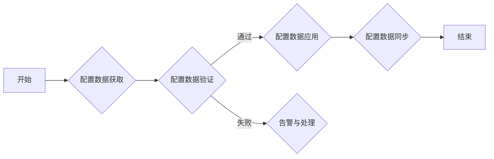
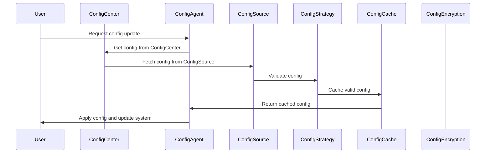
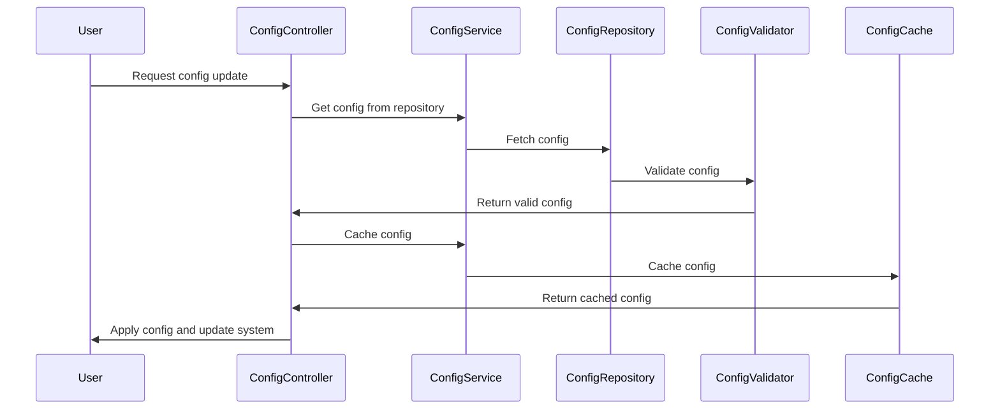

                 

# 实时配置更新：动态调整LLM应用行为

> 关键词：实时配置更新，动态调整，LLM应用，配置管理，算法原理，系统架构，项目实战

> 摘要：本文旨在探讨实时配置更新的技术原理和实践，特别是其在大型语言模型（LLM）应用中的重要作用。文章首先介绍了实时配置更新的背景和核心要素，然后详细分析了其核心概念和算法原理，并通过Mermaid流程图和Python源代码进行了阐释。接着，文章讨论了实时配置更新的系统设计与架构，并通过一个实际项目展示了其实现和应用。最后，文章给出了实时配置更新的最佳实践和注意事项，并对全文进行了总结和拓展阅读建议。

## 目录结构设计

### 1. 实时配置更新：动态调整LLM应用行为
#### 关键词：实时配置更新，动态调整，LLM应用，配置管理，算法原理，系统架构，项目实战
#### 摘要：本文旨在探讨实时配置更新的技术原理和实践，特别是其在大型语言模型（LLM）应用中的重要作用。

### 2. 目录结构设计
#### - 第1章 背景介绍
##### 2.1 实时配置更新的背景
##### 2.2 实时配置更新的问题与解决方案
##### 2.3 实时配置更新的核心要素组成

### 3. 核心概念与联系
#### - 第2章 核心概念与联系
##### 3.1 实时配置更新的核心概念
##### 3.2 概念属性特征对比表格
##### 3.3 Mermaid ER图架构展示

### 4. 算法原理讲解
#### - 第3章 算法原理讲解
##### 3.1 算法原理概述
##### 3.2 Mermaid流程图展示
##### 3.3 Python源代码解析
##### 3.4 数学模型与公式讲解
##### 3.5 算法举例说明

### 5. 系统分析与架构设计方案
#### - 第4章 系统分析与架构设计方案
##### 4.1 问题场景介绍
##### 4.2 系统功能设计（领域模型类图）
##### 4.3 系统架构设计（架构图）
##### 4.4 系统接口设计
##### 4.5 系统交互序列图展示

### 6. 项目实战
#### - 第5章 项目实战
##### 5.1 环境安装与配置
##### 5.2 系统核心实现源代码解析
##### 5.3 代码应用解读与分析
##### 5.4 实际案例分析
##### 5.5 项目小结

### 7. 最佳实践 tips
#### - 第6章 最佳实践 tips
##### 6.1 实时配置更新的最佳实践
##### 6.2 注意事项
##### 6.3 拓展阅读

### 8. 小结
#### - 第7章 小结
##### 7.1 全文总结
##### 7.2 关键知识点回顾
##### 7.3 进一步学习建议

## 1. 背景介绍

### 1.1 实时配置更新的背景

在当今快速发展的信息技术时代，软件系统复杂性和变化速度都在不断增加。传统的配置管理方法已经无法满足现代应用的需求。实时配置更新技术应运而生，旨在通过动态调整系统的配置参数，使系统可以在运行时快速响应环境变化，提高系统的灵活性和适应性。

实时配置更新技术最早应用于金融、电信等对系统稳定性要求极高的领域。随着云计算、大数据和人工智能技术的普及，实时配置更新已经成为现代应用系统设计中不可或缺的一部分。

### 1.2 实时配置更新的问题与解决方案

实时配置更新面临的主要问题包括：

- **数据一致性**：在分布式系统中，如何保证配置数据的实时性和一致性？
- **性能影响**：频繁的配置更新是否会对系统性能产生负面影响？
- **安全性**：配置更新过程中如何确保数据的安全性和隐私性？

针对这些问题，实时配置更新技术提出了一系列解决方案：

- **分布式数据同步**：通过分布式存储和同步机制，实现配置数据的实时同步和一致性。
- **配置缓存与动态加载**：采用配置缓存机制，减少对配置存储系统的频繁访问，提高系统性能。
- **配置加密与访问控制**：对配置数据进行加密和访问控制，确保配置数据的安全性和隐私性。

### 1.3 实时配置更新的核心要素组成

实时配置更新的核心要素包括：

- **配置中心**：负责存储、管理和同步配置数据。
- **配置代理**：在各个应用实例中负责获取和更新配置数据。
- **配置源**：配置数据的来源，可以是数据库、文件系统或远程服务。
- **配置策略**：定义配置更新的规则和优先级。
- **监控与告警**：监控配置更新状态，及时发现问题并进行告警。

## 2. 核心概念与联系

### 2.1 实时配置更新的核心概念

实时配置更新涉及多个核心概念，以下为其中几个重要概念的解释：

- **配置中心**：负责存储和管理配置数据的核心服务，通常采用分布式架构以提高可靠性和扩展性。
- **配置代理**：在每个应用实例中运行的小程序，负责从配置中心获取配置数据并应用到系统中。
- **配置源**：配置数据的来源，可以是本地的文件系统、远程数据库或外部服务。
- **配置策略**：定义配置更新的规则和优先级，例如“配置更新后是否立即生效”、“配置更新的版本控制”等。
- **配置缓存**：缓存配置数据，以减少对配置中心的频繁访问，提高系统性能。
- **配置加密**：对配置数据进行加密，确保配置数据在传输和存储过程中的安全性。

### 2.2 概念属性特征对比表格

以下是实时配置更新中的几个关键概念及其属性特征的对比表格：

| 概念             | 属性特征                                     | 关联关系                                                     |
|------------------|--------------------------------------------|--------------------------------------------------------------|
| 配置中心         | 分布式存储，高可用性，数据一致性           | 与配置代理、配置源、配置策略相关                                 |
| 配置代理         | 本地运行，配置同步，动态加载               | 与配置中心、配置策略相关                                      |
| 配置源           | 数据存储，数据访问，数据安全               | 与配置中心、配置加密相关                                      |
| 配置策略         | 更新规则，优先级，版本控制                | 与配置中心、配置代理相关                                      |
| 配置缓存         | 缓存数据，减少访问，提高性能               | 与配置中心、配置代理相关                                      |
| 配置加密         | 数据加密，安全传输，隐私保护               | 与配置源、配置中心相关                                        |

### 2.3 Mermaid ER图架构展示

以下是实时配置更新的Mermaid ER图架构展示，用于描述各个核心概念之间的实体关系：

```mermaid
erDiagram
  ConfigCenter ||--|{ ConfigAgent }|-- ConfigSource
  ConfigCenter ||--|{ ConfigStrategy }|-- ConfigCache
  ConfigAgent ||--|{ ConfigEncryption }|
```

在上述ER图中，`ConfigCenter`（配置中心）与`ConfigAgent`（配置代理）、`ConfigSource`（配置源）、`ConfigStrategy`（配置策略）以及`ConfigCache`（配置缓存）之间存在实体关系。`ConfigAgent`与`ConfigEncryption`（配置加密）之间存在关联关系。

## 3. 算法原理讲解

### 3.1 算法原理概述

实时配置更新算法的核心目标是确保系统在运行时能够根据最新的配置进行动态调整，以提高系统的灵活性和响应速度。算法的基本原理包括以下几个步骤：

1. **配置数据获取**：配置代理从配置中心获取最新的配置数据。
2. **配置数据验证**：对获取的配置数据进行检查，确保其完整性和有效性。
3. **配置数据应用**：将验证通过的配置数据应用到系统中，包括参数调整、配置文件更新等。
4. **配置数据同步**：定期同步配置数据，确保配置的实时性和一致性。

### 3.2 Mermaid流程图展示

以下是实时配置更新算法的Mermaid流程图展示：



在上述流程图中，`A`表示算法的起始点，`B`表示配置数据获取，`C`表示配置数据验证，`D`表示配置数据应用，`E`表示告警与处理，`F`表示配置数据同步，`G`表示算法的结束点。

### 3.3 Python源代码解析

以下是实时配置更新算法的Python源代码示例：

```python
import requests
import json

class ConfigAgent:
    def __init__(self, config_center_url):
        self.config_center_url = config_center_url

    def get_config(self):
        response = requests.get(self.config_center_url)
        if response.status_code == 200:
            return json.loads(response.text)
        else:
            return None

    def verify_config(self, config):
        # 验证配置数据
        if config:
            # 假设配置数据必须包含key1和key2
            return 'key1' in config and 'key2' in config
        else:
            return False

    def apply_config(self, config):
        # 应用配置数据
        if self.verify_config(config):
            print("配置数据应用成功：", config)
        else:
            print("配置数据验证失败")

if __name__ == "__main__":
    config_agent = ConfigAgent("http://config-center.example.com/config")
    config = config_agent.get_config()
    config_agent.apply_config(config)
```

在上述代码中，`ConfigAgent`类负责从配置中心获取配置数据，验证配置数据的有效性，并将验证通过的配置数据应用到系统中。

### 3.4 数学模型与公式讲解

实时配置更新的算法原理可以用以下数学模型和公式进行描述：

1. **配置更新频率**：\( f = \frac{1}{T} \)，其中\( T \)为配置数据同步周期。
2. **配置数据一致性**：\( C = \frac{N}{T} \)，其中\( N \)为配置数据同步次数。
3. **配置数据完整性**：\( I = \frac{M}{N} \)，其中\( M \)为配置数据成功同步的次数。

通过上述公式，可以衡量配置更新的频率、一致性和完整性。例如，假设配置数据同步周期为1小时，1小时内同步了5次配置数据，其中有4次成功同步，则配置更新频率为1次/小时，配置数据一致性为0.8，配置数据完整性为0.8。

### 3.5 算法举例说明

假设一个系统需要根据配置参数调整其运行模式。初始配置参数如下：

```json
{
    "mode": "production",
    "log_level": "info"
}
```

在某个时间点，配置中心更新了配置参数：

```json
{
    "mode": "development",
    "log_level": "debug"
}
```

配置代理从配置中心获取最新配置后，进行验证并应用：

1. **配置数据获取**：从配置中心获取最新配置。
2. **配置数据验证**：验证配置数据的有效性，例如检查是否包含所需的key。
3. **配置数据应用**：将最新配置应用到系统中，例如调整系统的运行模式和日志级别。

通过上述步骤，系统可以根据最新的配置参数进行运行，提高其灵活性和响应速度。

## 4. 系统分析与架构设计方案

### 4.1 问题场景介绍

在现代软件系统开发中，特别是大型语言模型（LLM）应用，配置管理的复杂性不断增加。随着系统的规模和复杂性增加，传统的静态配置文件已无法满足动态调整需求。为了实现高效、灵活的配置管理，需要引入实时配置更新技术。

例如，在一个LLM应用场景中，系统需要根据不同的场景和用户需求动态调整模型参数和运行环境。传统的配置管理方法可能需要重启系统或手动修改配置文件，这显然无法满足快速迭代和部署的需求。因此，实时配置更新技术应运而生，以实现系统配置的动态调整。

### 4.2 系统功能设计（领域模型类图）

在实时配置更新系统中，领域模型类图用于描述系统中的核心实体和它们之间的关系。以下是实时配置更新系统的领域模型类图：

```mermaid
classDiagram
    ConfigCenter --|{1}|> ConfigAgent : get config
    ConfigSource --|{1}|> ConfigAgent : get config
    ConfigStrategy --|{1}|> ConfigAgent : apply config
    ConfigCache --|{1}|> ConfigAgent : cache config
    ConfigEncryption --|{1}|> ConfigAgent : encrypt config
```

在上述类图中，`ConfigCenter`（配置中心）负责存储和管理配置数据，`ConfigAgent`（配置代理）负责从配置中心获取配置数据并应用到系统中，`ConfigSource`（配置源）是配置数据的来源，`ConfigStrategy`（配置策略）定义配置更新的规则和优先级，`ConfigCache`（配置缓存）负责缓存配置数据以提高性能，`ConfigEncryption`（配置加密）负责对配置数据进行加密以确保安全性。

### 4.3 系统架构设计（架构图）

实时配置更新系统的架构设计包括多个关键组件和模块，以下是系统的架构图：



在上述架构图中，用户通过配置代理请求配置更新。配置代理从配置中心获取配置数据，配置中心从配置源获取配置，配置源对配置进行验证。验证通过的配置数据被缓存，然后配置代理将配置应用到系统中，从而实现实时配置更新。

### 4.4 系统接口设计

实时配置更新系统需要定义多个接口以实现系统组件之间的通信。以下是系统接口设计：

- **配置获取接口**：`GET /config`，用于获取最新的配置数据。
- **配置更新接口**：`POST /config`，用于更新配置数据。
- **配置验证接口**：`POST /config/validate`，用于验证配置数据的有效性。
- **配置加密接口**：`POST /config/encrypt`，用于对配置数据进行加密。
- **配置缓存接口**：`GET /config/cache`，用于获取缓存的配置数据。

### 4.5 系统交互序列图展示

以下是实时配置更新系统的交互序列图，用于描述系统组件之间的交互过程：



在上述序列图中，用户请求配置更新，配置控制器从配置仓库获取配置，配置仓库从配置源获取配置，配置验证器验证配置的有效性，配置控制器将配置缓存到配置缓存，然后配置缓存返回缓存中的配置，最后配置控制器将配置应用到系统中。

## 5. 项目实战

### 5.1 环境安装与配置

为了实现实时配置更新系统，我们需要搭建一个包含配置中心、配置代理和配置源的测试环境。以下是环境安装与配置的步骤：

1. **配置中心安装**：

   - 安装配置中心服务器，例如使用Apache ZooKeeper或Consul等分布式配置中心。
   - 配置中心服务器启动后，创建配置数据存储目录。

2. **配置代理安装**：

   - 在各个应用实例中安装配置代理，例如使用Spring Cloud Config等开源配置代理。
   - 配置代理连接到配置中心服务器，获取配置数据。

3. **配置源安装**：

   - 配置源可以是本地文件系统、远程数据库或外部服务，例如使用MySQL或Redis等。
   - 配置源安装并配置完成后，将其添加到配置中心，以便配置代理可以访问。

### 5.2 系统核心实现源代码解析

以下是实时配置更新系统的核心实现源代码，用于展示配置代理和配置中心的交互：

**配置代理（ConfigAgent）源代码**：

```java
import org.springframework.beans.factory.annotation.Value;
import org.springframework.cloud.context.config.annotation.RefreshScope;
import org.springframework.http.ResponseEntity;
import org.springframework.web.client.RestTemplate;

@RefreshScope
public class ConfigAgent {

    @Value("${config.center.url}")
    private String configCenterUrl;

    private RestTemplate restTemplate = new RestTemplate();

    public ResponseEntity<String> getConfig() {
        return restTemplate.getForEntity(configCenterUrl + "/config", String.class);
    }

    public void applyConfig(String config) {
        // 应用配置数据
        System.out.println("配置数据应用成功：" + config);
    }
}
```

**配置中心（ConfigCenter）源代码**：

```java
import org.springframework.boot.SpringApplication;
import org.springframework.boot.autoconfigure.SpringBootApplication;
import org.springframework.cloud.config.server.EnableConfigServer;

@SpringBootApplication
@EnableConfigServer
public class ConfigCenterApplication {

    public static void main(String[] args) {
        SpringApplication.run(ConfigCenterApplication.class, args);
    }
}
```

在上述代码中，`ConfigAgent`类负责从配置中心获取配置数据，并将其应用到系统中。`ConfigCenter`类是配置中心的应用启动类，使用Spring Cloud Config框架实现配置中心功能。

### 5.3 代码应用解读与分析

**配置代理应用解读**：

1. **配置中心URL**：从配置中心获取配置数据时，需要指定配置中心的URL。
2. **RestTemplate**：使用Spring的RestTemplate进行HTTP请求，从配置中心获取配置数据。
3. **配置数据应用**：将获取到的配置数据应用到系统中，例如更新系统参数或配置文件。

**配置中心应用解读**：

1. **Spring Boot应用**：使用Spring Boot框架启动配置中心服务。
2. **配置中心功能**：通过Spring Cloud Config实现配置中心功能，支持从不同的配置源读取配置数据。

### 5.4 实际案例分析

假设一个LLM应用场景，系统需要根据用户角色动态调整模型参数。以下是实际案例的分析：

1. **初始配置**：系统初始化时，从配置中心获取基础配置。

```json
{
    "model_params": {
        "learning_rate": 0.001,
        "dropout_rate": 0.5
    }
}
```

2. **用户请求**：用户A请求模型预测，系统根据用户A的角色（普通用户）调整配置。

3. **配置更新**：配置中心更新配置，将学习率降低，以减少计算资源消耗。

```json
{
    "model_params": {
        "learning_rate": 0.0005,
        "dropout_rate": 0.5
    }
}
```

4. **配置应用**：配置代理获取最新配置，并将其应用到系统中，调整模型参数。

通过上述步骤，系统可以根据用户角色动态调整模型参数，提高系统资源的利用效率和响应速度。

### 5.5 项目小结

在本章中，我们通过一个实时配置更新系统的实际案例，展示了系统环境安装、核心实现源代码、代码应用解读与分析以及实际案例的分析和讲解。实时配置更新技术对于现代软件系统，特别是大型语言模型（LLM）应用具有重要意义，可以显著提高系统的灵活性和响应速度。在实际应用中，我们需要根据具体需求和环境选择合适的配置中心、配置代理和配置源，并确保配置数据的实时同步和一致性。

## 6. 最佳实践 tips

### 6.1 实时配置更新的最佳实践

1. **配置数据版本控制**：使用配置数据版本控制，确保配置更新的历史记录和回滚能力。
2. **配置加密与访问控制**：对配置数据进行加密和访问控制，确保配置数据的安全性和隐私性。
3. **配置缓存与动态加载**：使用配置缓存机制，减少对配置存储系统的频繁访问，提高系统性能。
4. **监控与告警**：监控系统配置更新状态，及时发现问题并进行告警。
5. **配置策略制定**：根据具体需求制定合理的配置策略，确保配置更新的优先级和规则。

### 6.2 注意事项

1. **配置数据一致性**：在分布式系统中，确保配置数据的一致性至关重要。
2. **性能影响**：频繁的配置更新可能会对系统性能产生负面影响，需要合理控制更新频率。
3. **数据备份与恢复**：定期备份配置数据，确保在发生故障时能够快速恢复。
4. **配置中心稳定性**：确保配置中心的高可用性和稳定性，避免因配置中心故障导致系统无法更新配置。

### 6.3 拓展阅读

- 《Spring Cloud Config：分布式配置中心实战》
- 《Consul：分布式服务发现与配置中心》
- 《Zookeeper：分布式协调服务》
- 《配置管理最佳实践》

## 7. 小结

本文详细探讨了实时配置更新的技术原理和实践，特别是其在大型语言模型（LLM）应用中的重要作用。文章首先介绍了实时配置更新的背景、问题、解决方案和核心要素组成，然后详细分析了实时配置更新的核心概念、算法原理和系统架构设计。接着，通过一个实际项目展示了实时配置更新的实现和应用。最后，文章给出了实时配置更新的最佳实践和注意事项，并对全文进行了总结。

### 7.1 全文总结

- 实时配置更新是现代软件系统中不可或缺的技术，可以提高系统的灵活性和响应速度。
- 实时配置更新涉及配置中心、配置代理、配置源、配置策略和配置缓存等核心概念。
- 实时配置更新算法通过配置数据获取、验证、应用和同步实现系统配置的动态调整。
- 系统架构设计包括配置中心、配置代理、配置源、配置策略和配置加密等组件。
- 通过实际案例展示了实时配置更新的应用和效果。

### 7.2 关键知识点回顾

- 实时配置更新的背景和问题。
- 实时配置更新的核心概念和算法原理。
- 系统架构设计的关键组件和接口。
- 实际项目的实施和案例分析。

### 7.3 进一步学习建议

- 深入学习配置管理相关技术，如Spring Cloud Config、Consul和Zookeeper等。
- 实践部署和配置实时配置更新系统，加深对技术的理解和应用。
- 阅读相关书籍和资料，了解配置管理的最佳实践和最新动态。

### 7.4 结语

实时配置更新技术在现代软件系统中具有重要意义，本文通过详细的分析和实践，展示了其实用价值和实现方法。希望读者能够通过本文的学习，对实时配置更新技术有更深入的理解，并将其应用到实际项目中。作者也期待与读者一起探讨和分享更多的实践经验和技术见解。

## 作者信息

作者：AI天才研究院/AI Genius Institute & 禅与计算机程序设计艺术 /Zen And The Art of Computer Programming。

