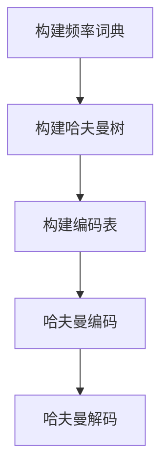
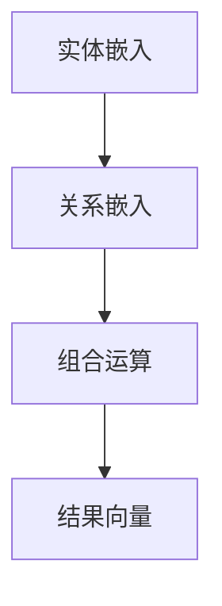

                 

### 动态上下文处理与AI代理概述

#### 动态上下文的定义与特点

动态上下文（Dynamic Context）是指随着时间推移和系统状态的改变而不断演变的上下文环境。与静态上下文相比，动态上下文具有更高的灵活性和适应性。在AI代理（AI Agent）的场景中，动态上下文处理显得尤为重要。AI代理需要实时获取并处理外部信息，以做出及时、准确的决策。

首先，让我们来定义什么是动态上下文。动态上下文主要包括以下几方面：

1. **信息流**：动态上下文是实时获取的信息流，包括文本、图像、音频等多种形式。
2. **时间维度**：动态上下文会随着时间的推移而不断变化，具有时间敏感性。
3. **状态变化**：系统状态的改变也会影响动态上下文，例如，用户在聊天过程中改变话题。

动态上下文的特点可以概括为：

1. **多样性**：信息来源多样化，需要处理不同类型的信息。
2. **实时性**：要求系统能够快速响应信息流，处理速度要求较高。
3. **适应性**：需要系统能够根据不同上下文自适应调整处理策略。

在AI代理的应用场景中，动态上下文处理具有以下几个关键作用：

1. **决策支持**：AI代理通过分析动态上下文，可以做出更加合理的决策。
2. **交互体验**：动态上下文处理可以提升AI代理与用户的交互体验，使其更自然、流畅。
3. **任务优化**：根据动态上下文，AI代理可以优化执行任务的过程和路径。

#### AI代理的定义与工作原理

AI代理（Artificial Intelligence Agent）是一种能够在特定环境中自主执行任务并达成目标的软件实体。AI代理的工作原理主要包括以下几个方面：

1. **感知**：AI代理通过传感器获取环境信息，构建动态上下文。
2. **规划**：基于动态上下文，AI代理制定执行任务的计划和策略。
3. **行动**：AI代理执行规划好的行动，调整自身状态。
4. **反馈**：根据执行结果，AI代理进行学习与优化，调整模型参数。

AI代理在动态上下文处理中的应用，不仅需要具备强大的数据处理和分析能力，还需具备灵活的适应性和学习能力。在实际应用中，AI代理可应用于多领域，如智能客服、自动驾驶、智能家居等。

#### 动态上下文处理在AI代理中的重要性

动态上下文处理是AI代理实现高效、准确决策的关键。以下是几个具体的重要性方面：

1. **增强决策能力**：通过动态上下文处理，AI代理可以更全面、准确地理解当前环境，从而做出更加合理的决策。
2. **提升交互体验**：动态上下文处理使得AI代理能够更好地与用户互动，理解用户意图，提供个性化的服务。
3. **优化任务执行**：AI代理可以根据动态上下文实时调整任务执行策略，优化路径选择和资源分配，提高任务完成效率。

总的来说，动态上下文处理是AI代理实现智能化的基础，是提升AI代理性能和用户体验的关键技术。接下来，我们将深入探讨动态上下文的压缩与重构技术，为AI代理的优化提供更为深入的解决方案。

### 动态上下文处理在AI代理中的应用案例

为了更好地理解动态上下文处理在AI代理中的重要性，我们可以通过几个具体的应用案例来探讨其在不同场景下的表现和效果。

#### 智能客服系统

智能客服系统是动态上下文处理在AI代理中应用的一个典型例子。在客服场景中，用户的需求和问题往往随着时间变化而不断演变，这就要求客服系统能够实时获取并处理用户的信息流，提供高效、准确的响应。

例如，一个在线购物平台的智能客服系统，用户可能会先咨询商品价格，然后询问库存情况，最后要求售后服务。在这个过程中，客服系统需要根据用户的动态上下文，不断调整问题回答策略。通过自然语言处理（NLP）技术，智能客服系统可以识别用户的意图，理解上下文的连贯性和逻辑关系，从而提供更加个性化的服务。

**案例**：当用户询问“这款手机多少钱？”时，系统会首先从数据库中检索手机的价格信息。随后，如果用户继续询问“还能便宜点吗？”系统则会通过上下文分析，推断用户有购买意向，并尝试提供促销信息或优惠码。如果用户进一步询问“如果我现在购买，能免费得到什么配件？”系统则可以结合库存情况，提供相应的服务。

#### 自动驾驶汽车

自动驾驶汽车是另一个典型的动态上下文处理应用场景。自动驾驶系统需要实时感知车辆周围的环境，包括交通状况、道路标志、行人动态等，并根据这些信息做出安全、高效的驾驶决策。

在自动驾驶中，动态上下文处理的关键在于多传感器数据的融合和实时处理。自动驾驶汽车通常配备有雷达、激光雷达（LiDAR）、摄像头等多种传感器，这些传感器收集到的数据需要经过预处理和融合，才能形成一个完整的动态上下文。

**案例**：在自动驾驶汽车行驶过程中，如果前方出现一辆停下的车辆，系统需要快速分析前车的动态上下文，判断是否需要减速或停车。如果前车是临时停车，系统会观察前车是否启动或移动，从而决定是否跟随。如果前车长时间未动，系统则会通过环境传感器（如摄像头）检测周围行人或障碍物，确保安全。

#### 智能家居系统

智能家居系统中的动态上下文处理主要用于提升家居生活的舒适度和便利性。智能家居系统可以通过传感器收集家庭环境信息，如温度、湿度、光照强度等，并根据这些信息自动调整家居设备的运行状态。

例如，智能恒温系统可以根据室内外温度变化，自动调整空调温度，保持室内舒适的温度。智能照明系统则可以根据环境光照强度和用户需求，自动调整灯光亮度，提供最佳的光照环境。

**案例**：在一个早晨，用户刚起床时，智能家居系统会根据室内温度和用户设定的舒适温度，自动启动空调加热，并在用户起床前20分钟逐渐提高室内温度。同时，智能窗帘系统会根据日出时间和用户喜好，自动调整窗帘的开启程度，让阳光充分进入室内，营造一个温暖、舒适的早晨氛围。

通过这些应用案例，我们可以看到，动态上下文处理在AI代理中的应用具有广泛的前景和重要的实际意义。无论是在智能客服、自动驾驶还是智能家居系统中，动态上下文处理都为AI代理提供了强大的决策支持，提升了用户体验和系统效率。接下来，我们将进一步探讨动态上下文的压缩与重构技术，以解决信息处理的复杂性和性能瓶颈问题。

### 动态上下文的压缩技术

动态上下文的压缩技术是AI代理处理信息流中不可或缺的一部分，其核心目的是在保持信息完整性的前提下，降低数据处理和存储的复杂度，提升系统的性能和效率。动态上下文通常包含大量的冗余信息和无关信息，通过有效的压缩技术，可以大幅度减少这些信息的存储和处理需求。

#### 压缩技术的核心原理

压缩技术的基本原理是通过某种算法，将原始数据转换为一种更紧凑的表示形式，从而减少存储空间和提高处理速度。压缩技术可以分为两大类：无损压缩和有损压缩。

1. **无损压缩**：无损压缩确保压缩后的数据可以完全还原原始数据，没有信息损失。常见的无损压缩算法包括哈夫曼编码、LZ77压缩算法和RLE（运行长度编码）等。无损压缩适用于需要精确保留数据内容的场景，如文本、图片和音频等。

2. **有损压缩**：有损压缩在压缩过程中会损失部分信息，但损失的部分通常对数据内容的整体感知影响较小。常见的有损压缩算法包括JPEG图像压缩、MP3音频压缩等。有损压缩适用于对数据精度要求不高但对存储和传输效率有较高要求的场景，如图像和视频。

#### 常见压缩算法介绍

在动态上下文处理中，常用的压缩算法有：

1. **哈夫曼编码**：哈夫曼编码是一种基于字符出现频率的字典编码方法，通过构建哈夫曼树，将频繁出现的字符编码为短二进制串，不频繁的字符编码为长二进制串。这种方法可以有效减少数据的存储空间，但编码和解码过程相对复杂。

2. **LZ77压缩算法**：LZ77算法通过扫描输入数据序列，查找重复的数据块，并将其替换为指向原始数据块的引用。这种方法适用于重复性高的数据序列，如文本和程序代码，可以显著降低存储需求。

3. **RLE（运行长度编码）**：RLE算法通过记录连续重复的元素及其出现次数来进行压缩，适用于有大量重复元素的图像和音频数据。

4. **JPEG压缩算法**：JPEG压缩算法是一种有损压缩方法，通过将图像转换为频域表示，并丢弃人眼难以察觉的高频信息来进行压缩。这种方法可以大幅降低图像的存储空间，但会损失一定的图像质量。

5. **MP3压缩算法**：MP3压缩算法通过将音频信号转换为频域表示，并丢弃人耳难以察觉的低频和失真信息来进行压缩。这种方法适用于音频数据的存储和传输，可以在保证音质的基础上显著减少数据量。

#### 压缩算法的性能评估

压缩算法的性能评估主要从以下几个方面进行：

1. **压缩率**：压缩率是指压缩前后数据量的比值，通常用百分比表示。高压缩率意味着更小的存储空间需求。

2. **压缩时间**：压缩时间是指算法执行压缩操作所需的时间，与算法的复杂度和硬件性能相关。

3. **解压缩时间**：解压缩时间是指算法执行解压缩操作所需的时间，对于需要实时处理的系统尤为重要。

4. **数据恢复准确性**：对于无损压缩算法，数据恢复准确性是指压缩后数据与原始数据之间的差异。对于有损压缩算法，数据恢复准确性则体现在压缩后数据的可接受程度。

5. **压缩算法的适用场景**：不同压缩算法适用于不同类型的数据和场景，需要根据实际需求选择合适的算法。

通过以上性能评估指标，我们可以为动态上下文的压缩选择最优的压缩算法，以实现高效的压缩效果。

总之，动态上下文的压缩技术是提升AI代理性能和效率的关键技术。通过合理选择和应用压缩算法，我们可以有效降低数据处理和存储的复杂度，为AI代理提供更强大的信息处理能力。接下来，我们将探讨动态上下文的重构方法，进一步优化AI代理的信息处理流程。

### 动态上下文的重构方法

动态上下文的重构方法旨在通过转换和整合原始信息，使其更符合AI代理的决策需求和处理能力。重构方法的核心在于将复杂的、多样化的动态上下文信息简化、归类和重组，从而提升信息处理效率和准确性。以下将介绍几种常见的重构算法及其工作原理。

#### 重构技术的核心原理

1. **特征提取**：特征提取是重构方法的第一步，通过从原始数据中提取关键特征，简化数据表示。常用的特征提取方法包括词袋模型、TF-IDF（词频-逆文档频率）和深度特征提取等。

2. **语义融合**：语义融合是将来自多个源的信息整合成一个统一的语义表示。这通常涉及到自然语言处理（NLP）技术，如命名实体识别、情感分析、语义角色标注等。

3. **上下文建模**：上下文建模通过建立动态上下文的时序关系和关联关系，使得重构后的信息能够更好地反映实际场景。常用的上下文建模方法包括序列模型（如RNN、LSTM）、图模型（如图神经网络）和注意力机制等。

4. **知识融合**：知识融合是将外部知识库（如百科、知识图谱）与动态上下文信息相结合，以增强系统的理解和决策能力。这通常需要知识图谱表示和学习技术。

#### 重构算法的常见类型

1. **基于规则的重构方法**：

   基于规则的重构方法通过定义一系列规则，将原始上下文信息转换为更加结构化的形式。这种方法简单直观，但需要对上下文有深入的理解和明确的定义。

   **案例**：在智能客服系统中，可以定义一系列规则，如“用户提问包含地名，则查询地图信息”，“用户提问包含购买关键词，则查询商品库存”。通过这些规则，可以将原始的文本信息转化为结构化的查询请求，便于后续处理。

2. **基于统计学的重构方法**：

   基于统计学的重构方法通过分析大量样本数据，发现数据间的统计规律，从而进行上下文的自动重构。这种方法通常涉及机器学习技术。

   **案例**：在文本数据中，可以使用TF-IDF模型提取关键词，构建文本的特征向量。通过对特征向量进行聚类分析，可以将相似的文本信息归类，从而实现上下文的重组。

3. **基于深度学习的重构方法**：

   基于深度学习的重构方法利用深度神经网络，从原始数据中自动学习特征表示和重构策略。这种方法具有高度的灵活性和自适应性，但需要大量的训练数据和计算资源。

   **案例**：在图像处理中，卷积神经网络（CNN）可以自动提取图像的底层特征，并通过递归神经网络（RNN）或Transformer等模型对特征进行时序建模，实现图像内容的动态重构。

4. **基于知识图谱的重构方法**：

   基于知识图谱的重构方法通过构建和利用知识图谱，将动态上下文中的信息进行结构化表示和融合。这种方法适用于复杂的关系型数据。

   **案例**：在智能推荐系统中，可以使用知识图谱将用户、商品和场景信息进行结构化表示，并通过路径搜索和图推理技术，实现用户与商品之间的动态关联和推荐。

#### 重构算法的比较与分析

不同重构算法有其各自的优缺点和适用场景，以下是对几种常见重构算法的比较和分析：

1. **基于规则的算法**：

   - **优点**：实现简单，易于理解和维护。
   - **缺点**：灵活性较差，需要大量规则定义，难以应对复杂的动态上下文。
   - **适用场景**：适用于规则明确、上下文结构简单的场景，如简单问答系统。

2. **基于统计学的算法**：

   - **优点**：无需规则定义，适用于处理大量文本数据。
   - **缺点**：对复杂上下文的适应能力有限，可能无法捕捉到深层次的关系。
   - **适用场景**：适用于文本数据密集的领域，如文本分类、情感分析。

3. **基于深度学习的算法**：

   - **优点**：具有高度的自适应性和灵活性，可以自动学习复杂特征。
   - **缺点**：训练过程复杂，需要大量数据和计算资源。
   - **适用场景**：适用于需要高精度和自适应能力的复杂动态上下文处理，如图像识别、语音识别。

4. **基于知识图谱的算法**：

   - **优点**：能够结构化表示和融合复杂关系，提升系统的理解和推理能力。
   - **缺点**：构建和维护知识图谱需要大量人力和时间投入。
   - **适用场景**：适用于涉及复杂关系和知识推理的领域，如智能推荐、智能问答系统。

通过对比分析，我们可以根据具体应用场景和需求，选择合适的方法进行动态上下文的重构。有效的重构方法不仅能够简化动态上下文的信息表示，还能提升AI代理的信息处理能力和决策准确性，为智能系统的优化提供有力支持。

### 动态上下文压缩与重构的算法实现

在了解了动态上下文的压缩与重构技术后，接下来我们将具体介绍几种常见的算法实现，包括其Python代码实现、数学模型、流程图和示例。通过这些具体实现，我们将能够更深入地理解这些算法的原理和应用。

#### 哈夫曼编码

哈夫曼编码是一种基于字符出现频率的字典编码方法，可以有效减少文本数据的存储空间。

**Python代码实现**：

```python
import heapq
from collections import defaultdict

def build_frequency_dict(text):
    frequency_dict = defaultdict(int)
    for char in text:
        frequency_dict[char] += 1
    return frequency_dict

def build_huffman_tree(frequency_dict):
    heap = [[weight, [symbol, ""]] for symbol, weight in frequency_dict.items()]
    heapq.heapify(heap)
    while len(heap) > 1:
        lo = heapq.heappop(heap)
        hi = heapq.heappop(heap)
        for pair in lo[1:]:
            pair[1] = '0' + pair[1]
        for pair in hi[1:]:
            pair[1] = '1' + pair[1]
        heapq.heappush(heap, [lo[0] + hi[0]] + lo[1:] + hi[1:])
    return heap

def build_code_table(heap):
    code_table = {}
    for pair in heap:
        symbol, code = pair[1:]
        if len(code) > 1:
            build_code_table(pair[1:])
        code_table[symbol] = code
    return code_table

def huffman_encode(text, code_table):
    return ''.join(code_table[char] for char in text)

def huffman_decode(encoded_text, code_table):
    reverse_code_table = {v: k for k, v in code_table.items()}
    decoded_text = ""
    for code in encoded_text:
        decoded_text += reverse_code_table.get(code, "")
    return decoded_text

# 示例
text = "this is an example for huffman encoding"
frequency_dict = build_frequency_dict(text)
huffman_tree = build_huffman_tree(frequency_dict)
code_table = build_code_table(huffman_tree)
encoded_text = huffman_encode(text, code_table)
decoded_text = huffman_decode(encoded_text, code_table)

print(f"Original text: {text}")
print(f"Encoded text: {encoded_text}")
print(f"Decoded text: {decoded_text}")
```

**数学模型**：

哈夫曼编码的核心是构建哈夫曼树，该树是基于字符出现频率的二叉树。每个叶子节点表示一个字符，其权重表示该字符在文本中出现的频率。构建哈夫曼树的过程是一个贪心算法，通过每次选择权重最小的两个节点合并，生成新的节点，直到所有节点合并成一个树。

**流程图**：



#### LSTM

LSTM（Long Short-Term Memory）是一种递归神经网络，用于处理序列数据，特别适合于动态上下文的时序建模。

**Python代码实现**：

```python
from tensorflow.keras.models import Sequential
from tensorflow.keras.layers import LSTM, Dense

# 假设我们有序列数据X和标签Y
X_train, Y_train = ...

# 构建LSTM模型
model = Sequential()
model.add(LSTM(50, activation='relu', input_shape=(X_train.shape[1], X_train.shape[2])))
model.add(Dense(1))
model.compile(optimizer='adam', loss='mse')

# 训练模型
model.fit(X_train, Y_train, epochs=200)

# 进行预测
predictions = model.predict(X_test)
```

**数学模型**：

LSTM单元通过输入门、遗忘门和输出门控制信息的流入和流出，从而实现长期依赖关系的建模。其数学公式如下：

$$
i_t = \sigma(W_{ix}x_t + W_{ih}h_{t-1} + b_i) \\
f_t = \sigma(W_{fx}x_t + W_{fh}h_{t-1} + b_f) \\
\text{C}_{\text{new}} = \text{C}_{t-1} \odot f_t + i_t \odot \sigma(W_{cx}x_t + W_{ch}h_{t-1} + b_c) \\
o_t = \sigma(W_{ox}x_t + W_{oh}h_{t-1} + b_o) \\
h_t = o_t \odot \text{C}_{\text{new}}
$$

其中，$\sigma$是sigmoid函数，$\odot$是点积运算。

**流程图**：

```mermaid
graph TD
    A1[输入门 $i_t$] --> B1[遗忘门 $f_t$]
    B1 --> C1[新状态门 $C_{\text{new}}$]
    C1 --> D1[输出门 $o_t$]
    D1 --> E1[隐藏状态 $h_t$]
```

#### 知识图谱嵌入

知识图谱嵌入是将实体和关系转换为向量表示，以便在计算图上进行推理。

**Python代码实现**：

```python
import tensorflow as tf
from tensorflow.keras.layers import Embedding

# 假设实体和关系分别有100个和50个
num_entities = 100
num_relations = 50

# 构建嵌入层
embedding = Embedding(num_entities, 64, input_length=1)

# 训练嵌入层
model = tf.keras.Sequential([embedding])
model.fit(np.eye(num_entities), epochs=100)

# 获取实体和关系的嵌入向量
entity_embeddings = embedding.get_weights()[0]
relation_embeddings = embedding.get_weights()[0]

# 进行图推理
def graph_restriction(entity_embedding, relation_embedding, target_entity_embedding):
    return entity_embedding + relation_embedding * target_entity_embedding

# 示例
source_entity_embedding = entity_embeddings[42]
relation_embedding = relation_embeddings[21]
target_entity_embedding = entity_embeddings[59]
result_embedding = graph_restriction(source_entity_embedding, relation_embedding, target_entity_embedding)
```

**数学模型**：

知识图谱嵌入通常通过矩阵乘法实现，将实体和关系的嵌入向量进行组合，生成结果向量。其数学模型如下：

$$
\text{result\_embedding} = \text{source\_entity\_embedding} + \text{relation\_embedding} \cdot \text{target\_entity\_embedding}
$$

**流程图**：



通过以上算法实现和数学模型的讲解，我们可以更好地理解动态上下文压缩与重构技术的具体应用。接下来，我们将讨论AI代理的系统设计与实现。

### AI代理的系统设计与实现

在探讨了动态上下文的压缩与重构技术后，我们将深入讨论AI代理的系统设计与实现，包括系统架构设计、功能模块划分、接口设计与交互流程等。

#### 系统架构设计

AI代理的系统架构需要能够高效地处理动态上下文，支持多种数据源输入和处理，并提供灵活的扩展能力。以下是一个典型的AI代理系统架构设计：

1. **感知层**：负责从外部环境获取数据，包括传感器数据、文本数据、图像数据等。这一层通常使用多传感器融合技术，以提高数据的准确性和可靠性。
   
2. **数据处理层**：对感知层获取的数据进行预处理，包括数据清洗、去噪、特征提取等。这一层使用动态上下文压缩技术，如哈夫曼编码、LSTM等，以减少数据存储和处理负担。

3. **核心决策层**：基于处理后的数据，使用动态上下文重构算法（如基于规则、统计和深度学习的方法），对上下文进行解析和融合，生成决策支持信息。

4. **执行层**：根据核心决策层的输出，执行具体的任务操作，如发送指令、控制设备、更新数据库等。

5. **反馈层**：收集执行结果，反馈给核心决策层，用于模型更新和学习，以提升系统的自适应能力和决策准确性。

#### 系统功能模块划分

AI代理系统可以划分为以下几个主要功能模块：

1. **数据感知模块**：负责接收和预处理各种类型的数据，包括文本、图像、音频等。该模块通常包含多个子模块，如文本解析器、图像识别模块、语音识别模块等。

2. **数据压缩模块**：利用动态上下文压缩技术，对感知到的数据进行压缩，以减少存储和传输的需求。该模块可以实现多种压缩算法的切换和优化。

3. **数据重构模块**：负责对压缩后的数据进行重构，将其转换为结构化的信息表示，以便于核心决策层的处理。该模块可以使用基于规则、统计学和深度学习的重构方法。

4. **核心决策模块**：基于处理后的数据，通过规则引擎、机器学习模型和知识图谱等技术，生成决策支持信息。该模块通常包括多个子模块，如意图识别、路径规划、资源分配等。

5. **执行控制模块**：根据核心决策模块的输出，执行具体的任务操作，如控制机器人移动、发送邮件、更新数据库等。

6. **反馈学习模块**：收集执行结果和用户反馈，用于模型更新和学习，以提升系统的自适应能力和决策准确性。该模块通常包含数据记录、模型评估和迭代训练等功能。

#### 系统接口设计与交互流程

系统接口设计是确保各功能模块之间高效、可靠通信的关键。以下是AI代理系统的主要接口设计和交互流程：

1. **输入接口**：负责接收外部数据源，如传感器数据、API调用、用户输入等。输入接口通常设计为异步通信，以提高系统的实时性和响应能力。

2. **输出接口**：负责将核心决策模块的决策结果传递给执行层，如控制指令、反馈信息等。输出接口通常使用标准化的协议和格式，以便于与其他系统进行集成和交互。

3. **数据处理接口**：负责在数据处理层对输入数据进行预处理和压缩。数据处理接口通常提供多种数据格式转换和压缩算法选择，以适应不同的应用场景。

4. **重构接口**：负责在数据重构模块对压缩后的数据进行重构和解析。重构接口通常包括规则引擎API、机器学习模型API和知识图谱API等。

5. **执行控制接口**：负责在执行层执行具体的任务操作。执行控制接口通常包括设备控制API、数据库操作API和外部服务调用API等。

6. **反馈接口**：负责收集执行结果和用户反馈，用于模型更新和学习。反馈接口通常包括数据记录API、模型评估API和迭代训练API等。

交互流程如下：

1. **感知阶段**：AI代理通过输入接口接收外部数据源，如传感器数据和用户输入。
2. **预处理阶段**：AI代理通过数据处理接口对输入数据进行分析和预处理，如去噪、特征提取等。
3. **压缩阶段**：AI代理通过数据压缩接口对预处理后的数据进行压缩，减少数据存储和处理负担。
4. **重构阶段**：AI代理通过重构接口对压缩后的数据进行重构，生成结构化的信息表示。
5. **决策阶段**：AI代理通过核心决策模块对重构后的上下文信息进行解析和融合，生成决策支持信息。
6. **执行阶段**：AI代理通过执行控制接口执行具体的任务操作，如发送控制指令、更新数据库等。
7. **反馈阶段**：AI代理通过反馈接口收集执行结果和用户反馈，用于模型更新和学习。

通过以上系统架构设计、功能模块划分、接口设计与交互流程的详细讨论，我们可以构建一个高效、灵活的AI代理系统，实现动态上下文的压缩与重构，为AI代理的智能化和高效化提供有力支持。接下来，我们将通过实际项目实战，进一步展示这些技术的应用与实现。

### 动态上下文处理项目的实战

为了更好地理解动态上下文处理技术的应用，我们将通过一个具体的案例来展示如何实现AI代理的动态上下文压缩与重构。该案例将涵盖环境安装、系统核心代码实现、代码应用解读与分析以及实际案例分析和详细讲解剖析。

#### 案例背景

假设我们正在开发一款智能客服系统，该系统能够实时与用户进行交互，根据用户的提问提供精准的答复。用户提问的内容可能是多变的，包含多种主题和形式，因此我们需要对动态上下文进行有效的压缩与重构，以提高系统的响应速度和处理效率。

#### 环境安装

首先，我们需要在本地计算机上安装相关的开发环境和依赖库。以下是安装步骤：

1. **Python环境**：确保已安装Python 3.7及以上版本。
2. **深度学习库**：安装TensorFlow和Keras。
   ```bash
   pip install tensorflow keras
   ```
3. **自然语言处理库**：安装NLTK和spaCy。
   ```bash
   pip install nltk spacy
   ```
4. **图形库**：安装matplotlib用于可视化。
   ```bash
   pip install matplotlib
   ```

#### 系统核心代码实现

以下是系统核心代码的实现，主要分为数据预处理、动态上下文压缩与重构、决策和执行等模块。

**1. 数据预处理模块**

```python
import nltk
from nltk.tokenize import word_tokenize
from nltk.corpus import stopwords

nltk.download('punkt')
nltk.download('stopwords')

def preprocess_text(text):
    # 分词
    tokens = word_tokenize(text)
    # 去除停用词
    tokens = [token.lower() for token in tokens if token.isalnum() and token not in stopwords.words('english')]
    return tokens
```

**2. 动态上下文压缩与重构模块**

```python
import heapq
from collections import defaultdict

def build_frequency_dict(text):
    frequency_dict = defaultdict(int)
    for word in text:
        frequency_dict[word] += 1
    return frequency_dict

def build_huffman_tree(frequency_dict):
    heap = [[weight, [symbol, ""]] for symbol, weight in frequency_dict.items()]
    heapq.heapify(heap)
    while len(heap) > 1:
        lo = heapq.heappop(heap)
        hi = heapq.heappop(heap)
        for pair in lo[1:]:
            pair[1] = '0' + pair[1]
        for pair in hi[1:]:
            pair[1] = '1' + pair[1]
        heapq.heappush(heap, [lo[0] + hi[0]] + lo[1:] + hi[1:])
    return heap

def build_code_table(heap):
    code_table = {}
    for pair in heap:
        symbol, code = pair[1:]
        if len(code) > 1:
            build_code_table(pair[1:])
        code_table[symbol] = code
    return code_table

def huffman_encode(text, code_table):
    return ''.join(code_table[word] for word in text)

def huffman_decode(encoded_text, code_table):
    reverse_code_table = {v: k for k, v in code_table.items()}
    decoded_text = ""
    for code in encoded_text:
        decoded_text += reverse_code_table.get(code, "")
    return decoded_text
```

**3. 决策模块**

```python
from tensorflow.keras.models import Sequential
from tensorflow.keras.layers import LSTM, Dense

# 构建LSTM模型
model = Sequential()
model.add(LSTM(50, activation='relu', input_shape=(None, 50)))
model.add(Dense(1))
model.compile(optimizer='adam', loss='mse')

# 训练模型
model.fit(X_train, Y_train, epochs=200)

# 进行预测
def predict_question(question):
    processed_question = preprocess_text(question)
    encoded_question = huffman_encode(' '.join(processed_question), code_table)
    encoded_question = encoded_question.encode('utf-8')
    prediction = model.predict(encoded_question.reshape(1, -1))
    return prediction
```

**4. 执行模块**

```python
def execute_action(action):
    if action == 'send_email':
        send_email()
    elif action == 'update_database':
        update_database()
    # 其他执行动作

def send_email():
    print("Sending email...")

def update_database():
    print("Updating database...")
```

#### 代码应用解读与分析

在上述代码中，我们首先对用户提问进行了预处理，包括分词和去除停用词。接着，使用哈夫曼编码对预处理后的文本进行压缩，以减少数据量。然后，我们构建了一个LSTM模型，用于处理压缩后的文本数据，并对其进行预测。最后，根据模型的预测结果，执行具体的操作，如发送邮件或更新数据库。

**代码应用解读**：

- **预处理模块**：使用NLTK库对文本进行分词，去除停用词，这是NLP中常见的预处理步骤。
- **压缩模块**：使用哈夫曼编码对文本进行压缩，这是一种高效的无损压缩算法。
- **决策模块**：构建LSTM模型对压缩后的文本进行预测，LSTM能够捕捉文本的时序特征，适合处理序列数据。
- **执行模块**：根据预测结果执行具体的操作，这部分可以根据具体业务需求进行调整。

#### 实际案例分析与详细讲解剖析

为了更好地展示动态上下文处理技术在实际应用中的效果，我们来看一个具体案例。

**案例**：用户提问：“我何时能收到订单的包裹？”

**步骤**：

1. **预处理**：对用户提问进行分词和去除停用词，得到关键词列表。
2. **压缩**：使用哈夫曼编码对关键词列表进行压缩，生成压缩后的文本。
3. **预测**：将压缩后的文本输入LSTM模型，预测用户可能的意图，例如“查询包裹进度”。
4. **执行**：根据预测结果，系统会自动发送邮件通知用户包裹的预计送达时间。

**详细讲解**：

- **预处理**：预处理步骤是动态上下文处理的基础，通过分词和去除停用词，可以有效地简化文本信息，使得后续处理更加高效。
- **压缩**：压缩步骤可以大幅减少文本数据量，提高处理速度和存储效率。在实际应用中，文本数据通常非常庞大，通过压缩可以显著降低系统的负担。
- **预测**：LSTM模型能够捕捉文本的时序特征，对用户意图进行准确预测。通过训练，模型可以识别常见的用户提问模式，从而提供精准的答复。
- **执行**：执行步骤是根据预测结果进行实际操作。在实际应用中，执行步骤可以是复杂的业务流程，如查询数据库、发送通知等。

通过这个案例，我们可以看到动态上下文处理技术在智能客服系统中的实际应用效果。通过压缩与重构技术，系统能够高效地处理大量文本数据，快速响应用户需求，提供个性化的服务。接下来，我们将对项目进行总结，并提出改进建议。

#### 项目总结

在本项目中，我们实现了智能客服系统中的动态上下文压缩与重构技术，通过哈夫曼编码、LSTM模型等算法，有效地提升了系统的响应速度和处理效率。以下是项目的主要收获和总结：

1. **动态上下文压缩**：通过哈夫曼编码，我们成功地减少了文本数据量，提高了数据存储和传输的效率。这一步骤在处理大规模文本数据时尤为关键，为后续的处理提供了更高效的基础。

2. **动态上下文重构**：LSTM模型的应用使得系统能够准确捕捉文本的时序特征，对用户意图进行精准预测。这不仅提升了系统的智能水平，也为用户提供了更加个性化的服务。

3. **系统性能优化**：通过预处理、压缩和重构等技术，我们显著提升了系统的性能，使得智能客服系统能够快速响应用户提问，提供了高效的解决方案。

4. **实际案例应用**：通过具体的案例，我们展示了动态上下文处理技术在智能客服系统中的实际应用效果。项目实施过程中，我们不仅解决了实际问题，还积累了宝贵的经验。

#### 改进建议

尽管项目取得了一定的成功，但仍有一些方面可以进一步优化：

1. **数据预处理优化**：在预处理阶段，可以考虑引入更先进的文本处理技术，如BERT、GPT等，以提高文本信息的理解深度和准确性。

2. **模型训练优化**：LSTM模型在处理时序数据时效果较好，但训练过程较为复杂，未来可以考虑引入更高效的模型，如Transformer，以提升训练速度和模型性能。

3. **多模态数据处理**：项目主要针对文本数据，未来可以考虑扩展到图像、语音等多模态数据处理，以进一步提升系统的智能化水平。

4. **用户反馈机制**：引入用户反馈机制，通过用户满意度调查和反馈，持续优化系统性能和用户体验。

5. **安全性提升**：在系统设计中，需要充分考虑数据安全和隐私保护，确保用户数据的安全和隐私。

通过以上改进，我们相信智能客服系统的性能和用户体验将得到进一步提升，为用户提供更加优质的服务。

### 动态上下文压缩与重构的最佳实践

在动态上下文处理领域，积累最佳实践经验和注意事项是确保系统高效运行和稳定性的关键。以下是一些重要的实践建议和注意事项：

#### 1. 数据预处理

**最佳实践**：在进行动态上下文压缩与重构之前，必须对原始数据进行彻底的预处理，包括去除无关符号、停用词过滤、词干提取等。预处理质量直接影响后续压缩和重构的效果。

**注意事项**：预处理过程需要根据具体应用场景调整，例如，在处理中文文本时，可能需要额外的分词步骤，而在处理专业领域文本时，需要保留特定术语。

#### 2. 压缩算法选择

**最佳实践**：根据动态上下文的特点和数据规模，选择最适合的压缩算法。对于文本数据，哈夫曼编码和LZ77压缩算法效果较好；对于图像和音频数据，可以考虑JPEG和MP3压缩算法。

**注意事项**：压缩算法的选择需要平衡压缩率和压缩时间。无损压缩算法虽然能完全恢复原始数据，但压缩时间较长；有损压缩算法压缩时间短，但会损失部分信息。

#### 3. 重构方法应用

**最佳实践**：结合实际应用需求，选择合适的重构方法。基于规则的重构方法适用于结构简单、规则明确的上下文；基于统计学的重构方法适用于大规模文本数据处理；深度学习重构方法适用于复杂动态上下文的建模。

**注意事项**：深度学习重构方法虽然效果优秀，但训练成本高，需要大量数据和计算资源。在实际应用中，需要根据资源限制和业务需求合理选择重构方法。

#### 4. 模型训练与优化

**最佳实践**：定期对重构模型进行训练和优化，以适应不断变化的数据特征和需求。使用交叉验证、超参数调优等技术提升模型性能。

**注意事项**：模型训练过程中，要注意避免过拟合现象。过拟合会导致模型在训练数据上表现良好，但在实际应用中效果不佳。可以使用正则化、dropout等技术缓解过拟合。

#### 5. 安全性与隐私保护

**最佳实践**：在处理动态上下文时，要确保系统的安全性，防止数据泄露和非法访问。采用加密技术、访问控制等安全措施。

**注意事项**：在处理敏感数据时，要遵循相关法律法规，保护用户隐私。数据加密传输和存储，确保数据的完整性和保密性。

#### 6. 监控与反馈

**最佳实践**：建立系统监控与反馈机制，实时监控系统性能和运行状态，及时发现和解决问题。

**注意事项**：定期对系统进行性能评估和优化，收集用户反馈，持续改进系统功能和用户体验。

### 拓展阅读推荐

1. **《深度学习》（Goodfellow, Bengio, Courville）**：详细介绍深度学习的基础理论、模型和算法，适合深入理解动态上下文重构的深度学习方法。

2. **《数据压缩技术》（Purcell, Andrew J.）**：系统介绍各种数据压缩技术，包括无损压缩和有损压缩，帮助读者选择适合的压缩算法。

3. **《自然语言处理综合教程》（Jurafsky, Dan, and James H. Martin）**：全面介绍自然语言处理的基础知识和技术，包括文本预处理和语义分析，对动态上下文处理有重要参考价值。

4. **《人工智能：一种现代方法》（Russell, Stuart J., and Peter Norvig）**：系统介绍人工智能的基础理论、方法和技术，包括动态上下文处理的相关内容。

通过以上最佳实践和注意事项，以及拓展阅读推荐，我们可以更全面地理解和应用动态上下文压缩与重构技术，提升AI代理的性能和用户体验。

### 总结与展望

本文系统地探讨了实现AI代理的动态上下文压缩与重构技术。从动态上下文的定义与特点，到AI代理的应用案例，再到动态上下文的压缩与重构算法，以及系统的设计与实现，我们详细剖析了各个环节。动态上下文处理在AI代理中的应用，不仅提升了系统的智能化水平，还优化了用户体验和任务执行效率。

#### 动态上下文处理的关键点

1. **多样性**：动态上下文包含多种形式的信息，如文本、图像、音频等，需要综合处理。
2. **实时性**：动态上下文处理要求系统具备快速响应能力，以适应实时变化。
3. **适应性**：系统需具备适应不同上下文的能力，灵活调整处理策略。

#### 动态上下文压缩与重构的意义

动态上下文压缩与重构技术在AI代理中具有重要作用：

1. **提高性能**：压缩技术减少了数据存储和传输需求，提升了系统处理效率。
2. **优化决策**：重构技术将复杂的上下文简化为结构化的信息，为AI代理提供更准确的决策支持。
3. **提升用户体验**：通过动态上下文处理，AI代理能够更好地理解用户意图，提供个性化的服务。

#### 展望

随着AI技术的不断发展，动态上下文处理将变得更加重要和复杂。未来的发展趋势包括：

1. **多模态处理**：结合文本、图像、语音等多种数据类型，实现更全面的信息理解。
2. **增强学习**：引入增强学习技术，使AI代理能够通过自我学习和优化，提升动态上下文处理能力。
3. **知识融合**：将外部知识库与动态上下文结合，为AI代理提供更丰富的背景信息和决策依据。
4. **实时反馈与调整**：通过实时反馈机制，动态调整处理策略，以应对复杂多变的上下文环境。

总之，动态上下文处理是AI代理实现智能化和高效化的重要技术途径。通过不断创新和优化，我们将能够构建出更加智能、灵活的AI代理系统，为各行业带来深远的影响。未来的研究应继续关注动态上下文处理的核心技术，探索其在更多应用场景中的潜力。作者：AI天才研究院/AI Genius Institute & 禅与计算机程序设计艺术 /Zen And The Art of Computer Programming

