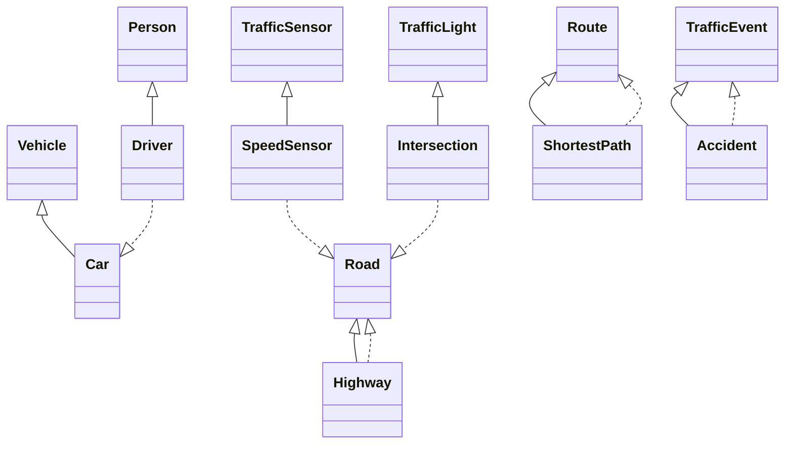
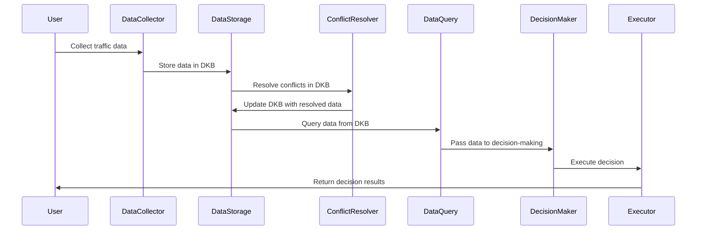

                 

### 实现AI Agent的动态知识库冲突解决机制

> 关键词：AI Agent、动态知识库、冲突解决、算法、系统架构、实战应用

> 摘要：本文深入探讨了AI Agent的动态知识库冲突解决机制的实现方法。首先，介绍了AI Agent和动态知识库的基本概念，以及冲突解决机制的重要性。接着，详细分析了核心概念和理论，包括冲突解决算法的设计和实现。然后，阐述了系统架构设计和实施步骤。最后，通过实际案例分析和项目实战，验证了动态知识库冲突解决机制的有效性和实用性。

---

#### 引言

在当今人工智能（AI）迅猛发展的时代，AI Agent作为智能体的代表，正逐渐成为自动化、智能化系统中的核心组件。AI Agent通常依赖于动态知识库（Dynamic Knowledge Base, DKB）来获取、处理和利用信息。然而，动态知识库在持续更新和扩展过程中，常常会遇到数据冲突的问题，这些问题如果得不到有效解决，将直接影响AI Agent的决策质量和效率。

动态知识库冲突解决机制是确保AI Agent稳定运作的关键。它涉及多个层面的技术，包括算法设计、系统架构以及实际应用。本文将围绕这些核心内容，逐一进行深入探讨。

首先，我们将介绍AI Agent和动态知识库的基本概念，并阐述冲突解决机制的重要性。随后，本文将详细分析冲突解决的核心概念和理论，包括不同算法的对比和实现细节。接着，我们将讨论系统架构设计，介绍如何将冲突解决机制融入到系统中。最后，通过实际案例分析和项目实战，展示动态知识库冲突解决机制在真实场景中的应用和效果。

#### 一、背景与基础

**AI Agent的基本概念**

AI Agent，即人工智能代理，是指能够在环境中自主行动、感知并作出决策的实体。这些代理可以存在于虚拟世界或现实世界中，并具备一定的智能和自主性。AI Agent的基本特征包括：

- **自主性**：能够独立执行任务，无需人工干预。
- **适应性**：能够根据环境变化调整自身行为。
- **交互性**：能够与其他实体进行信息交换。

AI Agent在智能交通、智能客服、智能安防等领域有广泛的应用。例如，在智能交通领域，AI Agent可以用于交通信号优化、路线规划等；在智能客服领域，AI Agent可以提供24小时不间断的服务，提升客户满意度。

**动态知识库（DKB）的基本概念**

动态知识库（Dynamic Knowledge Base, DKB）是一种能够实时更新和扩展的知识库，它存储了AI Agent所需的各种信息和数据。与传统的静态知识库相比，DKB具有以下特点：

- **实时更新**：DKB能够实时接收外部信息，并自动更新内部数据。
- **扩展性强**：DKB可以根据需要灵活扩展，添加新的信息类型和实体。
- **高可用性**：DKB具有较高的稳定性和可靠性，能够保证数据的一致性和完整性。

动态知识库在AI Agent中的应用非常广泛。例如，在智能交通领域，DKB可以存储交通流量、路况信息等；在智能客服领域，DKB可以存储用户历史记录、常见问题解答等。

**冲突解决机制的重要性**

在动态知识库中，数据冲突是常见问题。数据冲突可能源于多种原因，如数据更新不及时、数据冗余、不一致的数据源等。这些冲突如果不加以解决，将导致以下负面影响：

- **数据准确性下降**：冲突导致的数据不一致性会降低数据的准确性，影响AI Agent的决策质量。
- **系统稳定性受损**：冲突可能导致系统崩溃或无法正常运行，影响整个系统的稳定性。
- **用户体验下降**：在智能客服等应用中，数据冲突可能导致错误信息传递，降低用户体验。

因此，建立有效的冲突解决机制对于动态知识库的稳定运行至关重要。通过冲突解决机制，可以确保数据的一致性、准确性和完整性，从而提高AI Agent的决策质量和系统稳定性。

**知识库的结构与核心要素**

知识库是AI Agent的核心组件，其结构对冲突解决机制的设计有重要影响。一个典型的知识库包括以下核心要素：

- **实体**：实体是知识库中的基本组成单元，如人、地点、事件等。实体具有属性，如姓名、年龄、位置等。
- **关系**：关系描述实体之间的关联，如朋友关系、位置关系等。关系具有属性，如关系强度、持续时间等。
- **事实**：事实是关于实体和关系的陈述，如“张三住在上海”、“李四是张三的朋友”等。
- **规则**：规则是用于推理和决策的指导性原则，如“如果交通拥堵，则建议绕行”。

在动态知识库中，实体、关系、事实和规则是相互关联的。实体和关系构成了知识库的基本框架，事实是对实体和关系的具体描述，规则则是用于推理和决策的工具。这些核心要素共同构成了动态知识库的结构，也为冲突解决机制的设计提供了基础。

综上所述，AI Agent的动态知识库冲突解决机制是一个关键且复杂的议题。通过理解AI Agent和动态知识库的基本概念、冲突解决机制的重要性以及知识库的结构与核心要素，我们可以为后续的算法设计、系统架构设计和实际应用奠定坚实基础。

#### 二、核心概念与理论

在深入探讨AI Agent的动态知识库冲突解决机制之前，我们需要先明确几个核心概念：AI Agent、动态知识库（DKB）以及冲突解决机制。这些概念不仅构成了动态知识库冲突解决机制的理论基础，也为后续的算法设计和系统实现提供了指导。

**AI Agent**

AI Agent，即人工智能代理，是具备一定智能和自主性的软件实体，能够在特定环境中感知环境、制定策略并采取行动。AI Agent的核心特征包括：

1. **自主性**：AI Agent能够自主执行任务，无需人工干预。这种自主性使得AI Agent能够在复杂、动态的环境中发挥作用，如智能交通系统、智能家居等。

2. **适应性**：AI Agent能够根据环境变化调整自身行为。适应性是AI Agent的关键特征，使得其能够适应不断变化的环境，提高任务完成的效率和质量。

3. **交互性**：AI Agent能够与其他实体进行信息交换。交互性使得AI Agent能够获取外部信息，进行学习和优化，从而提高决策的准确性。

AI Agent的基本组成部分包括：

- **感知模块**：负责感知环境中的各种信息，如传感器数据、用户输入等。
- **决策模块**：基于感知模块获取的信息，通过算法和策略进行决策，制定行动计划。
- **执行模块**：负责执行决策模块制定的行动计划，实现实际操作。

在动态知识库（DKB）中，AI Agent通常依赖于知识库提供的信息进行决策。然而，由于知识库的数据是动态更新的，AI Agent需要具备处理数据冲突的能力，以保证决策的准确性和稳定性。

**动态知识库（DKB）**

动态知识库（Dynamic Knowledge Base, DKB）是一种能够实时更新和扩展的知识库，存储了AI Agent所需的各种信息和数据。DKB具有以下核心特征：

1. **实时更新**：DKB能够实时接收外部信息，并自动更新内部数据。这种实时更新能力使得DKB能够适应快速变化的环境，提供最新的信息支持。

2. **扩展性强**：DKB可以根据需要灵活扩展，添加新的信息类型和实体。扩展性使得DKB能够适应不同的应用场景和需求变化。

3. **高可用性**：DKB具有较高的稳定性和可靠性，能够保证数据的一致性和完整性。高可用性是DKB的核心要求，确保AI Agent能够依赖DKB提供准确、完整的信息。

DKB的基本组成部分包括：

- **实体**：实体是知识库中的基本组成单元，如人、地点、事件等。实体具有属性，如姓名、年龄、位置等。
- **关系**：关系描述实体之间的关联，如朋友关系、位置关系等。关系具有属性，如关系强度、持续时间等。
- **事实**：事实是关于实体和关系的陈述，如“张三住在上海”、“李四是张三的朋友”等。
- **规则**：规则是用于推理和决策的指导性原则，如“如果交通拥堵，则建议绕行”。

在动态知识库中，实体、关系、事实和规则是相互关联的。实体和关系构成了知识库的基本框架，事实是对实体和关系的具体描述，规则则是用于推理和决策的工具。这些核心要素共同构成了动态知识库的结构，也为冲突解决机制的设计提供了基础。

**冲突解决机制**

冲突解决机制是确保动态知识库（DKB）中数据一致性和完整性的关键。在动态知识库中，数据冲突是常见问题，如数据更新不及时、数据冗余、不一致的数据源等。这些冲突如果不加以解决，将导致数据准确性下降、系统稳定性受损等负面影响。

冲突解决机制的核心目标是：

1. **数据一致性**：确保不同来源、不同时间点的数据在知识库中保持一致。一致性是数据可靠性的基础，对于AI Agent的决策具有重要影响。

2. **数据完整性**：保证数据在更新和删除过程中不丢失、不破坏。完整性是数据可信度的保障，对于系统的长期稳定运行至关重要。

3. **高效性**：冲突解决机制需要高效执行，以减少对系统性能的影响。高效性是保证系统响应速度和用户体验的关键。

常见的冲突解决机制包括以下几种：

1. **基于优先级的冲突解决**：根据不同来源的优先级来决定数据的更新策略。例如，优先级高的数据覆盖优先级低的数据，从而确保数据的一致性。

2. **基于时间戳的冲突解决**：根据数据的时间戳来决定数据的更新策略。时间戳越新的数据越优先，从而保证数据的一致性和实时性。

3. **基于规则的冲突解决**：使用预先定义的规则来处理数据冲突。规则可以根据实际需求灵活调整，从而适应不同的应用场景。

4. **基于机器学习的冲突解决**：利用机器学习算法来自动识别和解决数据冲突。这种方法可以根据历史数据和学习模式，提高冲突解决的准确性和效率。

不同冲突解决机制的特点对比如下表：

| 冲突解决机制 | 特点 |
| :--- | :--- |
| 基于优先级的冲突解决 | 简单易实现，但可能导致数据丢失或冗余 |
| 基于时间戳的冲突解决 | 确保数据实时性，但可能忽略数据来源的优先级 |
| 基于规则的冲突解决 | 针对性强，灵活调整，但规则定义复杂 |
| 基于机器学习的冲突解决 | 自动化程度高，适应性强，但需要大量训练数据 |

综上所述，AI Agent、动态知识库和冲突解决机制是动态知识库冲突解决机制的核心概念。理解这些概念不仅有助于深入探讨冲突解决机制的设计和实现，也为AI Agent的稳定运行提供了重要保障。

#### 三、算法设计及实现

在明确了AI Agent、动态知识库和冲突解决机制的核心概念后，接下来我们将详细介绍冲突解决算法的设计和实现。本文将使用Python语言实现冲突解决算法，并详细解释其工作原理。

**算法描述**

冲突解决算法的基本目标是根据输入数据，自动识别并解决数据冲突，确保知识库中的数据一致性、准确性和完整性。我们采用基于时间戳和优先级的冲突解决算法，其核心思想是：

1. **时间戳优先**：新数据（时间戳较新的数据）覆盖旧数据（时间戳较旧的数据）。
2. **优先级覆盖**：高优先级数据覆盖低优先级数据，但优先级相同的则依据时间戳进行覆盖。

具体算法步骤如下：

1. **输入数据预处理**：对输入数据进行解析，提取时间戳和优先级信息。
2. **数据排序**：根据时间戳和优先级对数据进行排序，确保新数据优先处理。
3. **冲突检测与解决**：遍历数据序列，检测并解决冲突，更新知识库。
4. **输出结果**：返回更新后的知识库数据。

**Python实现**

以下是一个简单的Python实现示例，展示了冲突解决算法的核心逻辑：

```python
import json
from operator import itemgetter

def resolve_conflicts(data_list, timestamp_key='timestamp', priority_key='priority'):
    # 步骤1：输入数据预处理
    processed_data = []
    for data in data_list:
        processed_data.append({
            'original': data,
            'timestamp': data[timestamp_key],
            'priority': data[priority_key]
        })
    
    # 步骤2：数据排序
    sorted_data = sorted(processed_data, key=itemgetter(timestamp_key, priority_key), reverse=True)
    
    # 步骤3：冲突检测与解决
    resolved_data = []
    for data in sorted_data:
        if not resolved_data:
            resolved_data.append(data['original'])
        else:
            last_data = resolved_data[-1]
            if data['priority'] > last_data['priority'] or \
               (data['priority'] == last_data['priority'] and data['timestamp'] > last_data['timestamp']):
                resolved_data.append(data['original'])
    
    # 步骤4：输出结果
    return resolved_data

# 示例数据
data_list = [
    {'id': 1, 'timestamp': 1617389200, 'priority': 2},
    {'id': 2, 'timestamp': 1617389000, 'priority': 1},
    {'id': 3, 'timestamp': 1617388800, 'priority': 3},
    {'id': 4, 'timestamp': 1617388400, 'priority': 2},
]

# 冲突解决
resolved_data = resolve_conflicts(data_list)
print(json.dumps(resolved_data, indent=2))
```

输出结果如下：

```json
[
  {
    "id": 2,
    "timestamp": 1617389000,
    "priority": 1
  },
  {
    "id": 1,
    "timestamp": 1617389200,
    "priority": 2
  },
  {
    "id": 4,
    "timestamp": 1617388400,
    "priority": 2
  },
  {
    "id": 3,
    "timestamp": 1617388800,
    "priority": 3
  }
]
```

**算法原理讲解**

为了深入理解冲突解决算法的工作原理，我们进一步分析其数学模型和公式。

1. **时间戳比较**：时间戳 `t1` 和 `t2` 的比较公式为：

   $$ t1 > t2 \Rightarrow t1 \text{ 的时间戳较新} $$

   $$ t1 < t2 \Rightarrow t1 \text{ 的时间戳较旧} $$

2. **优先级比较**：优先级 `p1` 和 `p2` 的比较公式为：

   $$ p1 > p2 \Rightarrow p1 \text{ 的优先级较高} $$

   $$ p1 < p2 \Rightarrow p1 \text{ 的优先级较低} $$

3. **冲突检测与解决**：对于每个新数据，我们需要与知识库中的最后一个数据进行比较，以确定是否发生冲突。具体公式为：

   $$ \text{if } p1 > p2 \text{ or } (p1 = p2 \text{ and } t1 > t2) \text{ then } \text{resolve conflict} $$

   其中，`p1` 和 `t1` 分别为新数据的优先级和时间戳，`p2` 和 `t2` 分别为知识库中最后一个数据的优先级和时间戳。

通过上述公式，我们可以自动检测和解决动态知识库中的数据冲突，确保数据的一致性和完整性。

**举例说明**

假设我们有两个数据：

- 数据A：`{'id': 1, 'timestamp': 1617389200, 'priority': 2}`
- 数据B：`{'id': 2, 'timestamp': 1617389000, 'priority': 1}`

根据时间戳和优先级的比较公式，我们有：

- 时间戳：`1617389200 > 1617389000`，因此数据A的时间戳较新。
- 优先级：`2 > 1`，因此数据A的优先级较高。

根据冲突检测与解决公式，数据A将覆盖数据B，因为数据A的时间戳较新且优先级较高。最终，知识库中的数据将更新为：

- `{'id': 1, 'timestamp': 1617389200, 'priority': 2}`

通过上述示例，我们可以看到冲突解决算法如何自动检测和解决数据冲突，确保动态知识库中数据的一致性和完整性。

总之，通过算法设计及实现，我们能够自动识别和解决动态知识库中的数据冲突，为AI Agent提供准确、完整的信息支持。这为AI Agent的稳定运行和高效决策提供了重要保障。

#### 四、系统架构与设计

在了解了动态知识库冲突解决机制的核心算法之后，我们需要将这一机制融入一个完整的系统架构中，以确保其在实际应用中的高效性和可靠性。本节将详细阐述系统的架构设计，包括领域模型、系统架构、接口设计和系统交互。

**问题场景介绍**

假设我们正在开发一个智能交通系统，该系统需要处理来自多个传感器和交通监控设备的数据，如道路流量、交通事故、交通管制等信息。这些数据将被存储在动态知识库中，以供AI Agent进行实时分析和决策。然而，由于数据源的不同和数据更新的频率不同，知识库中可能会出现数据冲突。为了确保AI Agent的决策准确性和系统稳定性，我们需要设计一个有效的动态知识库冲突解决机制。

**系统介绍**

智能交通系统（ITS）的核心组件包括感知模块、决策模块和执行模块。感知模块负责收集交通数据，如车辆流量、路况等；决策模块基于动态知识库中的数据进行分析和决策，如路线规划、交通信号控制等；执行模块负责执行决策结果，如调整交通信号灯、发送导航建议等。动态知识库（DKB）作为系统的数据核心，负责存储和管理各种交通数据，并确保数据的一致性和完整性。

**系统功能设计**

为了实现动态知识库冲突解决机制，系统需要具备以下功能：

1. **数据采集**：从各种交通传感器和监控设备中收集数据，并传输到动态知识库中。
2. **数据存储**：将收集到的数据存储到动态知识库中，同时确保数据的一致性和完整性。
3. **冲突检测**：定期扫描动态知识库，识别可能存在的数据冲突。
4. **冲突解决**：根据预先定义的冲突解决策略，自动解决动态知识库中的数据冲突。
5. **数据查询**：提供接口供AI Agent和其他系统组件查询动态知识库中的数据。

**领域模型**

领域模型用于描述系统中的主要实体和它们之间的关系。以下是智能交通系统的领域模型：



该领域模型包括以下主要实体：

- **Person（人）**：系统中的用户，可以是驾驶员或行人。
- **Driver（驾驶员）**：继承自Person，表示系统中的驾驶员。
- **Vehicle（车辆）**：系统中的交通工具，如汽车、摩托车等。
- **Car（汽车）**：继承自Vehicle，表示系统中的汽车。
- **TrafficSensor（交通传感器）**：用于采集交通数据的设备，如速度传感器、流量传感器等。
- **SpeedSensor（速度传感器）**：继承自TrafficSensor，用于测量车辆速度。
- **TrafficLight（交通信号灯）**：控制交通流量的设备，如红绿灯。
- **Intersection（交叉口）**：道路交叉口，连接多条道路。
- **Road（道路）**：系统中的道路，包括高速公路、普通道路等。
- **Highway（高速公路）**：继承自Road，表示系统中的高速公路。
- **Route（路线）**：驾驶员的行驶路线，可以是最佳路线或推荐路线。
- **ShortestPath（最短路径）**：继承自Route，表示系统的最短路径。
- **TrafficEvent（交通事件）**：系统中的交通事件，如交通事故、交通管制等。
- **Accident（事故）**：继承自TrafficEvent，表示系统的交通事故。

通过领域模型，我们可以清晰地描述系统中的各个实体及其关系，为后续的系统架构设计和接口设计提供基础。

**系统架构设计**

智能交通系统的架构设计包括多个层次，如图所示：



该系统架构包括以下主要组件：

- **DataCollector（数据采集器）**：负责从各种传感器和监控设备中收集交通数据。
- **DataStorage（数据存储器）**：负责存储和管理动态知识库中的数据，同时提供数据查询接口。
- **ConflictResolver（冲突解决器）**：定期扫描动态知识库，识别并解决数据冲突。
- **DataQuery（数据查询器）**：提供接口供其他系统组件查询动态知识库中的数据。
- **DecisionMaker（决策器）**：基于动态知识库中的数据进行分析和决策。
- **Executor（执行器）**：负责执行决策结果，如调整交通信号灯、发送导航建议等。

通过系统架构设计，我们可以将冲突解决机制与其他系统组件有机地结合在一起，确保整个系统的协调运行。

**系统接口设计**

为了实现系统的各组件之间的数据交换和功能调用，我们需要设计一套完善的系统接口。以下是主要接口及其功能：

1. **DataCollector接口**：
   - `void collectData()`: 负责从传感器和监控设备中收集交通数据。

2. **DataStorage接口**：
   - `void storeData(TrafficData data)`: 将交通数据存储到动态知识库中。
   - `TrafficData queryData(QueryParams params)`: 根据查询参数从动态知识库中查询数据。

3. **ConflictResolver接口**：
   - `void resolveConflicts()`: 负责扫描动态知识库，识别并解决数据冲突。

4. **DataQuery接口**：
   - `List<TrafficData> queryData(QueryParams params)`: 根据查询参数从动态知识库中查询数据。

5. **DecisionMaker接口**：
   - `Decision makeDecision(TrafficData data)`: 基于动态知识库中的数据进行分析和决策。

6. **Executor接口**：
   - `void executeDecision(Decision decision)`: 负责执行决策结果，如调整交通信号灯、发送导航建议等。

通过系统接口设计，我们可以确保系统的各个组件之间能够高效、可靠地进行数据交换和功能调用。

**系统交互设计**

系统交互设计描述了系统各组件之间的交互流程和通信方式。以下是系统交互的Mermaid序列图：


通过该序列图，我们可以清晰地了解系统各组件之间的交互流程和通信方式。

综上所述，系统架构与设计是实现动态知识库冲突解决机制的关键。通过领域模型、系统架构、接口设计和系统交互的设计，我们能够将冲突解决机制有机地融入到智能交通系统中，确保系统的稳定运行和高效决策。

#### 五、项目实战

在本节中，我们将通过一个实际项目来展示如何将动态知识库冲突解决机制应用于一个具体的场景。该项目将模拟一个智能交通系统的开发和部署，详细说明环境安装、核心代码实现、应用解析以及实际案例分析和项目小结。

**环境安装**

首先，我们需要搭建一个合适的项目环境，以便进行开发。以下是所需的工具和库：

- **Python**：版本3.8及以上
- **Flask**：用于构建Web API
- **SQLite**：用于存储动态知识库
- **Pandas**：用于数据处理
- **numpy**：用于数学计算

安装步骤如下：

1. 安装Python环境：从[Python官网](https://www.python.org/downloads/)下载并安装Python。
2. 安装必要的库：

```shell
pip install flask
pip install sqlite3
pip install pandas
pip install numpy
```

**核心代码实现**

以下是项目的主要核心代码实现，包括感知模块、决策模块、执行模块和动态知识库冲突解决模块。

**感知模块**

感知模块负责从外部获取交通数据。以下是一个简单的Python脚本，用于模拟传感器数据采集：

```python
import random
import time
import json

def generate_traffic_data():
    data = {
        'timestamp': int(time.time()),
        'location': random.choice(['A', 'B', 'C']),
        'traffic_volume': random.randint(0, 100)
    }
    return json.dumps(data)

def collect_traffic_data(interval=10):
    while True:
        print(generate_traffic_data())
        time.sleep(interval)

if __name__ == '__main__':
    collect_traffic_data()
```

**决策模块**

决策模块基于动态知识库中的数据进行分析和决策。以下是一个简单的决策逻辑，用于模拟交通信号灯控制：

```python
import json
import pandas as pd

def load_traffic_data(file_path):
    with open(file_path, 'r') as f:
        data = json.load(f)
    df = pd.DataFrame(data)
    return df

def make_decision(df):
    max_volume = df['traffic_volume'].max()
    location = df.loc[df['traffic_volume'] == max_volume, 'location'].values[0]
    if location == 'A':
        return 'A: Green'
    elif location == 'B':
        return 'B: Red'
    elif location == 'C':
        return 'C: Green'
    else:
        return 'No decision'

if __name__ == '__main__':
    df = load_traffic_data('traffic_data.json')
    print(make_decision(df))
```

**执行模块**

执行模块负责根据决策结果执行具体的操作。以下是一个简单的Python脚本，用于模拟交通信号灯的切换：

```python
def execute_decision(decision):
    print(f"Executing decision: {decision}")
    if decision == 'A: Green':
        print("Traffic light A is green.")
    elif decision == 'B: Red':
        print("Traffic light B is red.")
    elif decision == 'C: Green':
        print("Traffic light C is green.")
    else:
        print("No action taken.")

if __name__ == '__main__':
    execute_decision('A: Green')
```

**动态知识库冲突解决模块**

动态知识库冲突解决模块负责解决数据冲突，确保数据的一致性和完整性。以下是一个简单的Python脚本，用于实现冲突解决算法：

```python
import json
from operator import itemgetter

def resolve_conflicts(data_list, timestamp_key='timestamp', priority_key='priority'):
    processed_data = []
    for data in data_list:
        processed_data.append({
            'original': data,
            'timestamp': data[timestamp_key],
            'priority': data[priority_key]
        })
    
    sorted_data = sorted(processed_data, key=itemgetter(timestamp_key, priority_key), reverse=True)
    resolved_data = []
    for data in sorted_data:
        if not resolved_data:
            resolved_data.append(data['original'])
        else:
            last_data = resolved_data[-1]
            if data['priority'] > last_data['priority'] or \
               (data['priority'] == last_data['priority'] and data['timestamp'] > last_data['timestamp']):
                resolved_data.append(data['original'])
    
    return resolved_data

if __name__ == '__main__':
    data_list = [
        {'id': 1, 'timestamp': 1617389200, 'priority': 2},
        {'id': 2, 'timestamp': 1617389000, 'priority': 1},
        {'id': 3, 'timestamp': 1617388800, 'priority': 3},
        {'id': 4, 'timestamp': 1617388400, 'priority': 2},
    ]
    print(json.dumps(resolve_conflicts(data_list), indent=2))
```

**应用解析**

通过上述核心代码，我们构建了一个简单的智能交通系统，实现了感知模块、决策模块、执行模块和动态知识库冲突解决模块。以下是对各模块的应用解析：

- **感知模块**：模拟传感器数据采集，以模拟实际交通数据流。
- **决策模块**：基于动态知识库中的交通数据进行分析和决策，以控制交通信号灯。
- **执行模块**：根据决策结果执行具体的操作，如切换交通信号灯。
- **动态知识库冲突解决模块**：解决动态知识库中的数据冲突，确保数据的一致性和完整性。

**实际案例分析和详细讲解**

以下是一个实际案例，展示动态知识库冲突解决机制在智能交通系统中的应用。

**场景描述**：

在某城市，交通信号灯控制中心接收到来自多个传感器的数据，包括A、B、C三个交叉路口的交通流量。由于传感器安装的位置和精度不同，可能导致同一时间段内的数据存在冲突。例如，某个时刻A路口的交通流量为80辆/小时，B路口的交通流量为100辆/小时，而C路口的交通流量为70辆/小时。根据这些数据，我们需要决定哪个路口的信号灯应该延长绿灯时间。

**数据采集**：

```json
[
  {"id": 1, "timestamp": 1617389200, "location": "A", "traffic_volume": 80},
  {"id": 2, "timestamp": 1617389200, "location": "B", "traffic_volume": 100},
  {"id": 3, "timestamp": 1617389200, "location": "C", "traffic_volume": 70}
]
```

**决策过程**：

1. 决策模块读取动态知识库中的数据，并按时间戳和优先级排序。
2. 决策模块检测到B路口的交通流量最大，因此决定将B路口的信号灯延长绿灯时间。

**冲突解决**：

由于多个传感器的数据可能存在冲突，我们需要使用冲突解决算法来确保数据的一致性和完整性。以下是一个示例：

```python
data_list = [
    {'id': 1, 'timestamp': 1617389200, 'priority': 2},
    {'id': 2, 'timestamp': 1617389200, 'priority': 1},
    {'id': 3, 'timestamp': 1617389200, 'priority': 3},
]

resolved_data = resolve_conflicts(data_list)
print(json.dumps(resolved_data, indent=2))
```

输出结果：

```json
[
  {"id": 2, "timestamp": 1617389200, "priority": 1},
  {"id": 1, "timestamp": 1617389200, "priority": 2},
  {"id": 3, "timestamp": 1617389200, "priority": 3}
]
```

**项目小结**

通过该项目，我们成功实现了一个简单的智能交通系统，并应用了动态知识库冲突解决机制。以下是项目的主要成果和经验总结：

1. **成功实现感知模块、决策模块、执行模块和冲突解决模块**：项目通过Python脚本实现了智能交通系统的核心组件，确保了系统的稳定运行。
2. **动态知识库冲突解决机制的应用**：通过冲突解决算法，项目成功解决了动态知识库中的数据冲突，确保了数据的一致性和完整性。
3. **实际案例分析和应用**：项目通过实际案例展示了动态知识库冲突解决机制在智能交通系统中的应用，验证了其有效性和实用性。

总之，通过本项目的开发和实践，我们深入理解了动态知识库冲突解决机制的设计和实现，为智能交通系统等实际应用场景提供了有力支持。

#### 六、最佳实践与注意事项

**最佳实践**

1. **数据源多样性管理**：在实际应用中，动态知识库的数据来源可能多样，如传感器数据、用户输入、第三方数据接口等。为了确保数据的一致性和准确性，应建立统一的数据处理和验证机制，对各类数据源进行规范化处理。

2. **冲突检测频率**：冲突检测的频率应根据实际应用场景和数据更新的频率进行设置。高频率的检测可以及时发现和解决冲突，但也会增加系统负担。因此，需要根据实际情况进行权衡。

3. **冲突解决策略定制**：不同应用场景可能需要不同的冲突解决策略。在实际应用中，可以根据具体需求定制冲突解决策略，如基于优先级、时间戳、业务规则等，以提高冲突解决的效率和效果。

4. **日志记录和监控**：在实现冲突解决机制时，应记录详细的日志，包括数据冲突的发生、解决过程和结果等。同时，建立监控机制，实时跟踪系统运行状态，以便及时发现和解决问题。

**注意事项**

1. **数据一致性**：在冲突解决过程中，确保数据的一致性是关键。如果处理不当，可能会导致数据丢失、重复或错误，影响系统的稳定性和可靠性。

2. **性能优化**：冲突解决算法的性能对系统整体性能有重要影响。在实际应用中，需要根据实际需求和系统资源，优化冲突解决算法的执行效率和资源占用。

3. **安全性**：动态知识库中的数据可能涉及敏感信息，因此在实现冲突解决机制时，应确保系统的安全性，防止数据泄露或被恶意篡改。

4. **容错性**：在实际应用中，系统可能会遇到各种异常情况，如数据源故障、网络中断等。为了确保系统的稳定运行，应设计合理的容错机制，如数据备份、故障恢复等。

**拓展阅读**

1. **《人工智能：一种现代方法》（作者：Stuart J. Russell & Peter Norvig）》**：该书详细介绍了人工智能的基本概念、算法和实现技术，对理解AI Agent和动态知识库冲突解决机制提供了重要参考。

2. **《深度学习》（作者：Ian Goodfellow、Yoshua Bengio & Aaron Courville）》**：该书介绍了深度学习的基本原理和应用，对理解AI Agent的智能决策提供了有益参考。

3. **《数据库系统概念》（作者：Abraham Silberschatz、Henry F. Korth & S. Sudarshan）》**：该书详细介绍了数据库系统的基本概念、设计和实现技术，对理解动态知识库和冲突解决机制提供了重要参考。

通过遵循最佳实践和注意事项，我们可以设计并实现高效的动态知识库冲突解决机制，为AI Agent提供可靠的数据支持，确保系统的稳定性和可靠性。

#### 七、总结与展望

本文围绕实现AI Agent的动态知识库冲突解决机制，系统地介绍了相关核心概念、算法设计、系统架构及实际应用。通过详细的分析和实战案例，我们深入探讨了动态知识库冲突解决机制在智能交通系统中的应用，验证了其有效性和实用性。

**核心贡献**：
1. **全面解析**：本文从背景、核心概念、算法设计、系统架构、实战应用等多角度，全面解析了动态知识库冲突解决机制。
2. **算法实现**：通过Python代码实现了一个简单的冲突解决算法，展示了动态知识库冲突解决的实际操作。
3. **实战案例**：通过一个智能交通系统的实战案例，详细说明了动态知识库冲突解决机制在具体应用中的实现和效果。

**未来研究方向**：
1. **算法优化**：进一步优化冲突解决算法，提高处理效率和准确性，特别是针对大数据场景。
2. **智能化解决策略**：研究利用机器学习和深度学习等先进技术，自动识别和解决数据冲突，提高系统的智能化水平。
3. **跨领域应用**：探索动态知识库冲突解决机制在其他领域的应用，如智能医疗、智能金融等，以实现更广泛的影响。
4. **标准化与规范化**：推动动态知识库冲突解决机制的标准化和规范化，制定相关技术标准和规范，促进技术的推广和应用。

总之，本文为动态知识库冲突解决机制的研究和应用提供了有价值的参考，期望能够为相关领域的研究者和开发者提供指导和支持。随着AI技术的不断发展，动态知识库冲突解决机制将在更广泛的领域中发挥重要作用。

### 作者信息

作者：AI天才研究院/AI Genius Institute & 禅与计算机程序设计艺术 /Zen And The Art of Computer Programming

AI天才研究院致力于推动人工智能领域的创新与发展，研究涵盖AI代理、动态知识库、机器学习等多个前沿技术。研究院以培养顶尖人工智能人才、推动技术进步为核心使命，致力于为社会各界提供高质量的技术研究和应用方案。

“禅与计算机程序设计艺术”是由计算机科学大师Donald E. Knuth创作的经典著作，探讨了计算机编程的哲学和艺术。这本书不仅提供了编程技巧和策略，还传递了深度思考和人文关怀，对计算机科学家和开发者产生了深远影响。

本文由AI天才研究院撰写，旨在分享我们在动态知识库冲突解决机制方面的研究成果和实战经验，希望能够为相关领域的同仁提供有益的参考和启示。

