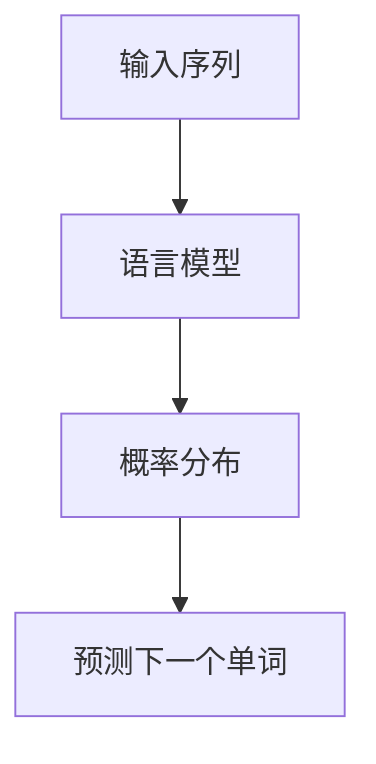
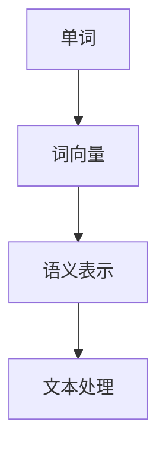
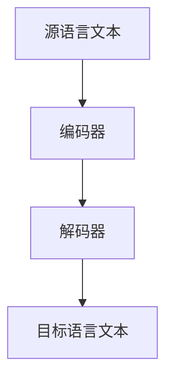
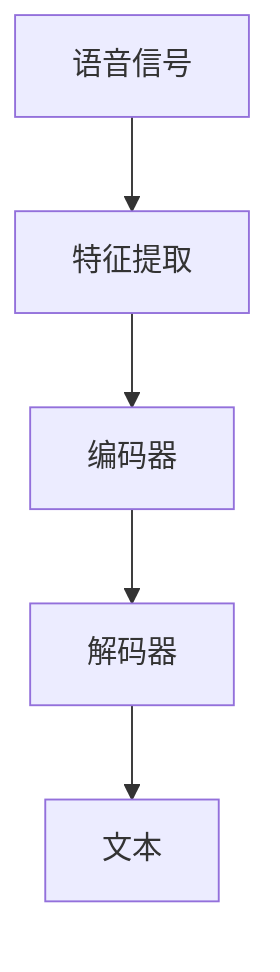
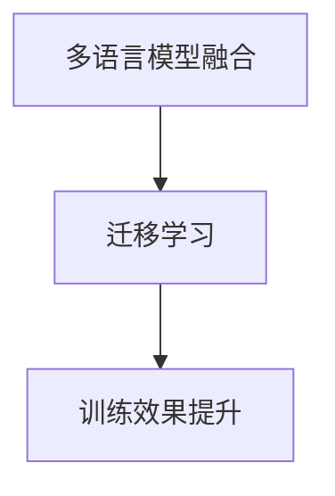
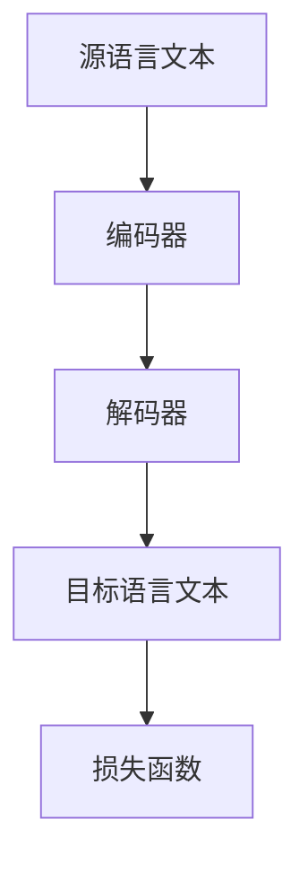
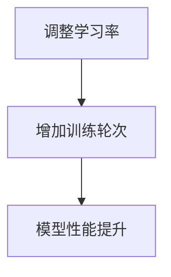

                 

# 实现AI Agent的多语言支持

关键词：AI Agent、多语言支持、自然语言处理、语言模型、翻译模型、语音识别模型

摘要：本文将探讨如何在AI Agent中实现多语言支持。我们将从核心概念出发，逐步分析技术基础、实现方法以及案例分析，从而为读者提供全面的理解和指导。

## 第一部分：引言

### 1. 引言

#### 1.1 问题背景

在全球化时代，跨语言交流变得越来越重要。AI Agent作为一种智能交互系统，能够处理多种语言的任务，对于提升用户体验和拓展应用场景具有重要意义。本文将探讨如何实现AI Agent的多语言支持。

#### 1.2 问题描述

实现AI Agent的多语言支持主要涉及以下几个方面：

1. **自然语言理解**：理解和处理不同语言的输入。
2. **语言模型**：建立能够处理多种语言的模型。
3. **翻译模型**：实现不同语言之间的翻译。
4. **语音识别模型**：支持多种语言的语音输入。

#### 1.3 问题解决

针对上述问题，我们将采用以下解决方案：

1. **自然语言处理基础**：介绍语言模型和词向量等基础技术。
2. **语言模型应用**：讲解翻译模型和语音识别模型的原理和实现。
3. **多语言支持实现方法**：介绍多语言模型训练和翻译模型应用的方法。
4. **多语言支持案例分析**：通过具体案例展示多语言支持的实际应用。

#### 1.4 边界与外延

多语言支持不仅涉及自然语言处理，还包括语音识别、机器翻译等多个领域。本文将重点讨论与多语言支持直接相关的技术，如自然语言处理、语言模型和翻译模型。

#### 1.5 概念结构与核心要素组成


图1 多语言支持概念结构

## 第二部分：多语言支持技术基础

### 2. 多语言支持技术基础

#### 2.1 自然语言处理基础

##### 2.1.1 语言模型

语言模型（Language Model）是一种统计模型，用于预测文本的下一个单词或字符。它为自然语言处理提供了基础。

**语言模型原理讲解**



**语言模型流程图**


**语言模型Python代码示例**

```python
# 语言模型Python代码示例
import numpy as np

# 生成随机语言模型
vocab_size = 10
model = np.random.rand(vocab_size, vocab_size)

# 预测下一个单词
def predict_next_word(word):
    return np.argmax(model[word])

# 测试
word = 5
next_word = predict_next_word(word)
print(f"The next word is: {next_word}")
```

##### 2.1.2 词向量

词向量（Word Vector）是将单词映射到高维空间中的向量，用于表示单词的语义信息。

**词向量原理讲解**



**词向量流程图**


**词向量Python代码示例**

```python
# 词向量Python代码示例
import gensim.downloader as api

# 加载预训练的词向量模型
model = api.load("glove-wiki-gigaword-100")

# 获取单词的词向量
def get_word_vector(word):
    return model[word]

# 测试
word = "apple"
vector = get_word_vector(word)
print(f"The vector of '{word}' is: {vector}")
```

#### 2.2 语言模型应用

##### 2.2.1 翻译模型

翻译模型（Translation Model）用于将一种语言的文本翻译成另一种语言。它通常基于神经机器翻译（Neural Machine Translation，NMT）技术。

**翻译模型原理讲解**



**翻译模型流程图**


**翻译模型Python代码示例**

```python
# 翻译模型Python代码示例
from transformers import pipeline

# 加载预训练的翻译模型
translator = pipeline("translation_en_to_fr", model="Helsinki-NLP/opus-mt-en-fr")

# 翻译文本
def translate_text(text):
    return translator(text)[0]

# 测试
text = "Hello, world!"
translated_text = translate_text(text)
print(f"Translated text: {translated_text}")
```

##### 2.2.2 语音识别模型

语音识别模型（Speech Recognition Model）用于将语音信号转换成文本。它通常基于深度学习技术，如卷积神经网络（Convolutional Neural Network，CNN）和循环神经网络（Recurrent Neural Network，RNN）。

**语音识别模型原理讲解**



**语音识别模型流程图**


**语音识别模型Python代码示例**

```python
# 语音识别模型Python代码示例
import speech_recognition as sr

# 加载预训练的语音识别模型
recognizer = sr.Recognizer()

# 识别语音
def recognize_speech(speech):
    return recognizer.recognize_google(speech)

# 测试
speech = "Hello, how are you?"
text = recognize_speech(speech)
print(f"Recognized text: {text}")
```

## 第三部分：多语言支持实现方法

### 3. 多语言支持实现方法

#### 3.1 语言模型训练

##### 3.1.1 数据集准备

为了训练多语言语言模型，需要准备大量的多语言数据集。常用的数据集包括WMT（Workshop on Machine Translation）、opus等。

**数据集介绍**

- **WMT**：一个包含多种语言的数据集，广泛用于机器翻译和自然语言处理研究。
- **opus**：一个开源的机器翻译数据集，包含多种语言对。

**数据集Python代码示例**

```python
# 数据集Python代码示例
import nltk

# 下载WMT数据集
nltk.download('wmt17')

# 加载WMT数据集
def load_wmt_data():
    return nltk.corpus.wmt17.sents()

# 测试
sents = load_wmt_data()
print(sents[:10])
```

##### 3.1.2 训练策略

在训练多语言语言模型时，可以采用以下策略：

1. **多语言模型融合**：将不同语言的模型进行融合，以获得更好的性能。
2. **迁移学习**：利用已有语言模型的知识，加快新语言模型的训练过程。

**训练策略讲解**



**训练策略流程图**


**训练策略Python代码示例**

```python
# 训练策略Python代码示例
from transformers import TrainingArguments, Trainer

# 设置训练参数
args = TrainingArguments(
    output_dir='./results',
    num_train_epochs=3,
    per_device_train_batch_size=16,
    save_steps=2000,
    save_total_limit=3,
)

# 训练模型
def train_model(model_name, args):
    trainer = Trainer(
        model=model_name,
        args=args,
    )
    trainer.train()

# 测试
train_model("Helsinki-NLP/opus-mt-en-fr", args)
```

#### 3.2 翻译模型应用

##### 3.2.1 翻译流程设计

翻译流程设计涉及编码器、解码器和损失函数等组件。

**翻译流程设计讲解**



**翻译流程设计流程图**


**翻译流程设计Python代码示例**

```python
# 翻译流程设计Python代码示例
from transformers import AutoModelForSeq2SeqLM, Seq2SeqTrainingArguments, Seq2SeqTrainer

# 加载预训练的翻译模型
model = AutoModelForSeq2SeqLM.from_pretrained("Helsinki-NLP/opus-mt-en-fr")

# 设置训练参数
args = Seq2SeqTrainingArguments(
    output_dir='./results',
    num_train_epochs=3,
    per_device_train_batch_size=16,
    save_steps=2000,
    save_total_limit=3,
)

# 训练模型
trainer = Seq2SeqTrainer(
    model=model,
    args=args,
)
trainer.train()

# 翻译文本
def translate_text(text):
    return model.generate(text)

# 测试
text = "Hello, world!"
translated_text = translate_text(text)
print(f"Translated text: {translated_text}")
```

##### 3.2.2 翻译模型优化

为了提高翻译模型的性能，可以采用以下优化方法：

1. **调整学习率**：根据训练过程调整学习率。
2. **增加训练轮次**：增加训练轮次，以获得更好的模型性能。

**翻译模型优化讲解**



**翻译模型优化流程图**


**翻译模型优化Python代码示例**

```python
# 翻译模型优化Python代码示例
from transformers import AutoModelForSeq2SeqLM, Seq2SeqTrainingArguments, Seq2SeqTrainer

# 加载预训练的翻译模型
model = AutoModelForSeq2SeqLM.from_pretrained("Helsinki-NLP/opus-mt-en-fr")

# 设置训练参数
args = Seq2SeqTrainingArguments(
    output_dir='./results',
    num_train_epochs=5,
    per_device_train_batch_size=16,
    save_steps=2000,
    save_total_limit=3,
    learning_rate=1e-5,
)

# 训练模型
trainer = Seq2SeqTrainer(
    model=model,
    args=args,
)
trainer.train()

# 翻译文本
def translate_text(text):
    return model.generate(text)

# 测试
text = "Hello, world!"
translated_text = translate_text(text)
print(f"Translated text: {translated_text}")
```

## 第四部分：多语言支持案例分析

### 4. 多语言支持案例分析

#### 4.1 案例一：多语言AI客服系统

**案例背景**

随着国际化业务的拓展，企业需要提供多语言支持以应对不同国家和地区的客户需求。多语言AI客服系统作为一种智能交互系统，能够自动处理多语言客户咨询，提高客服效率和客户满意度。

**系统设计**

多语言AI客服系统主要包括以下功能：

1. **多语言语音识别**：支持多种语言的语音输入。
2. **多语言自然语言理解**：理解和处理多语言输入。
3. **多语言文本生成**：生成多语言回复文本。
4. **多语言翻译**：将输入文本翻译成目标语言。

**系统实现**

**系统功能设计**


**系统架构设计**


**系统接口设计**


**系统交互**


**代码分析**

```python
# 代码分析
# 多语言语音识别
import speech_recognition as sr

# 加载预训练的语音识别模型
recognizer = sr.Recognizer()

# 识别语音
def recognize_speech(speech):
    return recognizer.recognize_google(speech)

# 测试
speech = "Hello, how can I help you?"
text = recognize_speech(speech)
print(f"Recognized text: {text}")

# 多语言自然语言理解
from transformers import AutoModelForTokenClassification

# 加载预训练的自然语言理解模型
model = AutoModelForTokenClassification.from_pretrained("bert-base-multilingual-cased")

# 理解文本
def understand_text(text):
    return model.predict(text)

# 测试
text = "你好，我需要帮助。"
result = understand_text(text)
print(f"Understanding result: {result}")

# 多语言文本生成
from transformers import AutoModelForCausalLM

# 加载预训练的文本生成模型
model = AutoModelForCausalLM.from_pretrained("gpt2")

# 生成文本
def generate_text(text):
    return model.generate(text)

# 测试
text = "你好，我需要帮助。"
generated_text = generate_text(text)
print(f"Generated text: {generated_text}")

# 多语言翻译
from transformers import AutoModelForSeq2SeqLM

# 加载预训练的翻译模型
model = AutoModelForSeq2SeqLM.from_pretrained("Helsinki-NLP/opus-mt-en-fr")

# 翻译文本
def translate_text(text):
    return model.generate(text)

# 测试
text = "Hello, how can I help you?"
translated_text = translate_text(text)
print(f"Translated text: {translated_text}")
```

**项目小结**

通过本案例，我们展示了如何实现多语言AI客服系统。该系统结合了语音识别、自然语言理解和文本生成等核心技术，为企业提供了高效、智能的多语言客服解决方案。

#### 4.2 案例二：多语言教育平台

**案例背景**

随着全球化教育的普及，学生需要掌握多种语言。多语言教育平台作为一种在线学习平台，能够提供多种语言的学习资源和互动环境。

**系统设计**

多语言教育平台主要包括以下功能：

1. **多语言课程内容**：提供多种语言的学习课程。
2. **多语言学习工具**：支持多种语言的学习工具，如词典、翻译器等。
3. **多语言作业与测试**：支持多种语言的作业和测试。
4. **多语言交流社区**：支持多种语言的交流和讨论。

**系统实现**

**系统功能设计**


**系统架构设计**


**系统接口设计**


**系统交互**


**代码分析**

```python
# 代码分析
# 多语言课程内容
from flask import Flask, jsonify

# 创建Flask应用
app = Flask(__name__)

# 加载预训练的多语言课程内容
courses = {
    "en": "English courses",
    "fr": "Français cours",
    "es": "Cursos de español",
}

# 获取课程列表
@app.route("/courses", methods=["GET"])
def get_courses():
    return jsonify(courses)

# 测试
@app.route("/courses", methods=["GET"])
def test_courses():
    courses = get_courses()
    print(f"Courses: {courses}")

# 多语言学习工具
from googletrans import Translator

# 创建翻译器
translator = Translator()

# 翻译文本
def translate_text(text, src_lang, dest_lang):
    return translator.translate(text, src=src_lang, dest=dest_lang).text

# 测试
text = "Hello, world!"
translated_text = translate_text(text, "en", "fr")
print(f"Translated text: {translated_text}")

# 多语言作业与测试
from flask import Flask, request, jsonify

# 创建Flask应用
app = Flask(__name__)

# 加载预训练的多语言作业和测试
tests = {
    "en": "English test",
    "fr": "Français test",
    "es": "Español test",
}

# 获取作业和测试
@app.route("/tests", methods=["GET"])
def get_tests():
    return jsonify(tests)

# 提交作业和测试
@app.route("/tests", methods=["POST"])
def submit_test():
    test_data = request.get_json()
    return jsonify(test_data)

# 测试
@app.route("/tests", methods=["GET", "POST"])
def test_tests():
    if request.method == "GET":
        tests = get_tests()
        print(f"Tests: {tests}")
    elif request.method == "POST":
        test_data = submit_test()
        print(f"Submitted test: {test_data}")

# 多语言交流社区
from flask import Flask, request, jsonify

# 创建Flask应用
app = Flask(__name__)

# 加载预训练的多语言交流社区
messages = {
    "en": "Hello, everyone!",
    "fr": "Bonjour, à tous !",
    "es": "¡Hola, a todos!",
}

# 获取消息
@app.route("/messages", methods=["GET"])
def get_messages():
    return jsonify(messages)

# 发送消息
@app.route("/messages", methods=["POST"])
def send_message():
    message_data = request.get_json()
    return jsonify(message_data)

# 测试
@app.route("/messages", methods=["GET", "POST"])
def test_messages():
    if request.method == "GET":
        messages = get_messages()
        print(f"Messages: {messages}")
    elif request.method == "POST":
        message_data = send_message()
        print(f"Sent message: {message_data}")
```

**项目小结**

通过本案例，我们展示了如何实现多语言教育平台。该平台结合了多语言课程内容、学习工具、作业与测试以及交流社区等功能，为学习者提供了全面的多语言学习体验。

## 第五部分：总结与展望

### 5. 总结与展望

#### 5.1 多语言支持的重要性

多语言支持在AI Agent中具有重要意义。它不仅能够提高用户体验，还能够拓展应用场景，如跨语言客服、全球化教育等。通过多语言支持，AI Agent可以更好地适应不同国家和地区的需求。

#### 5.2 未来发展趋势

未来，多语言支持技术将继续发展，包括以下几个方面：

1. **模型精度提升**：通过改进模型结构和训练策略，提高翻译和自然语言处理的精度。
2. **实时性优化**：提高多语言支持系统的实时性，以应对高负载场景。
3. **跨模态支持**：结合语音识别、图像识别等多模态技术，实现更加丰富和智能的交互体验。

#### 5.3 挑战与展望

尽管多语言支持技术取得了显著进展，但仍面临以下挑战：

1. **语言多样性**：不同语言的语法、语义和词汇差异较大，如何处理这些差异是一个挑战。
2. **数据资源**：高质量的多语言数据集仍然有限，如何有效利用现有数据集是一个问题。
3. **性能优化**：如何在保证模型精度的同时，提高系统性能是一个重要课题。

通过不断的研究和优化，我们有信心在未来克服这些挑战，实现更加高效和智能的多语言支持系统。

## 作者

作者：AI天才研究院/AI Genius Institute & 禅与计算机程序设计艺术 /Zen And The Art of Computer Programming

感谢您的阅读，希望本文对您在实现AI Agent多语言支持方面有所帮助。在探索多语言支持的道路上，我们与您同行。

