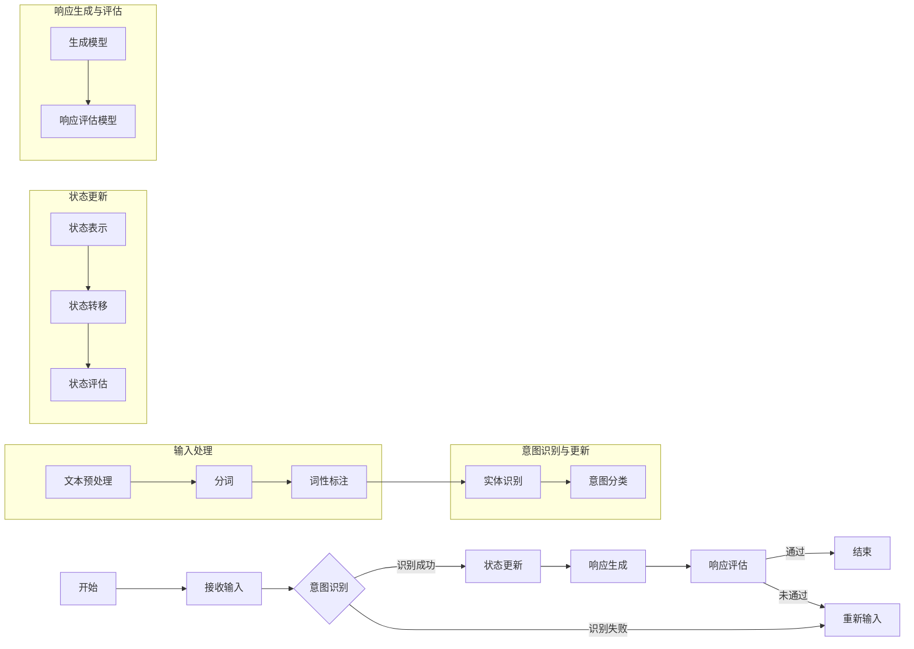
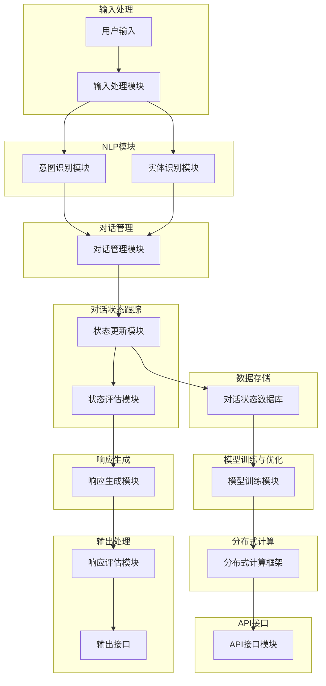
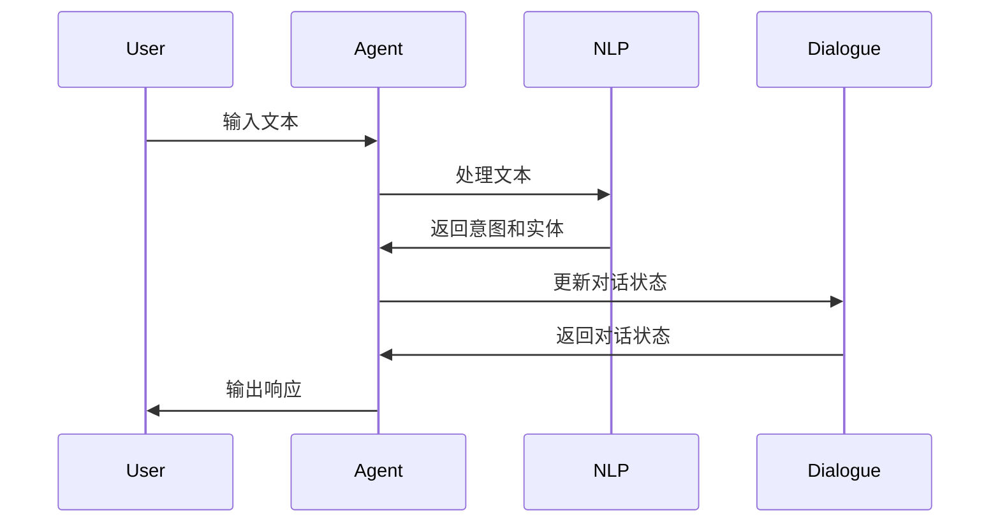

                 

### 实现AI Agent的多轮对话状态跟踪

关键词：AI Agent、多轮对话状态跟踪、自然语言处理、强化学习、系统架构设计

摘要：本文旨在深入探讨如何实现AI Agent在多轮对话中的状态跟踪。首先，我们将回顾人工智能的发展历程和AI Agent的定义与功能，然后详细分析多轮对话状态跟踪的需求与核心概念。接下来，我们将讨论对话状态跟踪的数学模型与算法原理，并详细讲解其挑战与解决方案。随后，我们将介绍多轮对话状态跟踪的系统设计与实现，包括功能设计、系统架构、接口设计以及系统交互。此外，我们还将通过一个简单的AI对话系统项目实战，展示如何具体实现对话状态跟踪。最后，我们将分享最佳实践与优化策略，并探讨未来的研究方向。

---

### 目录大纲

```markdown
----------------------------------------------------------------
# 实现AI Agent的多轮对话状态跟踪

# 第一部分: 背景介绍与核心概念

## 第1章: AI Agent与多轮对话状态跟踪概述

## 1.1 问题背景与概述

### 1.1.1 人工智能的发展历程

### 1.1.2 AI Agent的定义与功能

### 1.1.3 多轮对话状态跟踪的需求

## 1.2 核心概念与联系

### 1.2.1 对话状态跟踪的概念

### 1.2.2 对话状态跟踪的要素

### 1.2.3 对话状态跟踪的核心概念联系

## 1.3 背景知识与技术基础

### 1.3.1 自然语言处理（NLP）基础

### 1.3.2 强化学习与生成模型

### 1.3.3 多轮对话系统的架构设计

## 1.4 本章小结

----------------------------------------------------------------

## 第2章: 对话状态跟踪的数学模型与算法原理

## 2.1 对话状态跟踪的数学模型

### 2.1.1 对话状态表示

### 2.1.2 对话状态转移模型

### 2.1.3 对话状态评估模型

## 2.2 算法原理讲解

### 2.2.1 对话状态跟踪算法的mermaid流程图

### 2.2.2 算法原理与数学公式

### 2.2.3 算法举例说明

## 2.3 对话状态跟踪的挑战与解决方案

### 2.3.1 数据稀疏性问题

### 2.3.2 模型解释性问题

### 2.3.3 实时性要求

## 2.4 本章小结

----------------------------------------------------------------

## 第3章: 多轮对话状态跟踪的系统设计与实现

## 3.1 系统功能设计

### 3.1.1 功能模块划分

### 3.1.2 数据流与处理流程

### 3.1.3 系统接口设计

## 3.2 系统架构设计

### 3.2.1 系统架构的mermaid架构图

### 3.2.2 架构设计要点

### 3.2.3 系统架构的优势与不足

## 3.3 系统接口设计与交互

### 3.3.1 接口设计与规范

### 3.3.2 系统交互的mermaid序列图

### 3.3.3 系统交互流程说明

## 3.4 本章小结

----------------------------------------------------------------

## 第4章: 项目实战：实现一个简单的AI对话系统

## 4.1 项目介绍

### 4.1.1 项目目标与背景

### 4.1.2 项目环境与工具

## 4.2 系统核心实现

### 4.2.1 环境安装与配置

### 4.2.2 对话状态跟踪模块

### 4.2.3 对话管理模块

## 4.3 代码应用解读与分析

### 4.3.1 代码结构解读

### 4.3.2 关键代码分析

### 4.3.3 代码优缺点讨论

## 4.4 实际案例分析与详细讲解

### 4.4.1 案例背景与数据集

### 4.4.2 案例分析与结果

### 4.4.3 案例总结与改进方向

## 4.5 本章小结

----------------------------------------------------------------

## 第5章: 多轮对话状态跟踪的最佳实践与优化策略

## 5.1 最佳实践 tips

### 5.1.1 对话状态跟踪的常见误区

### 5.1.2 数据预处理技巧

### 5.1.3 模型调优策略

## 5.2 优化策略

### 5.2.1 实时对话状态更新策略

### 5.2.2 对话状态存储优化

### 5.2.3 对话连贯性提升策略

## 5.3 安全性与隐私保护

### 5.3.1 对话内容的安全性措施

### 5.3.2 用户隐私保护策略

### 5.3.3 法规与合规要求

## 5.4 本章小结

----------------------------------------------------------------

## 第6章: 拓展阅读与未来研究方向

## 6.1 拓展阅读

### 6.1.1 相关研究论文推荐

### 6.1.2 顶级会议与期刊介绍

### 6.1.3 知名研究团队的最新成果

## 6.2 未来研究方向

### 6.2.1 对话状态跟踪的深入研究

### 6.2.2 多模态对话状态跟踪

### 6.2.3 智能对话系统的交互设计

----------------------------------------------------------------
```

---

### 1.1 问题背景与概述

#### 1.1.1 人工智能的发展历程

人工智能（AI）作为计算机科学的一个重要分支，起源于20世纪50年代。最早期的AI研究主要集中在规则推理和专家系统领域。例如，1956年在达特茅斯会议上，约翰·麦卡锡（John McCarthy）等人首次提出了“人工智能”这一概念，标志着AI学科的正式诞生。这一时期，研究者们希望通过编写逻辑规则来模拟人类的智能行为。

然而，早期的AI系统在处理复杂问题时表现不佳，这引发了人们对AI未来发展路径的反思。到了20世纪80年代，随着硬件性能的提升和算法的改进，AI研究进入了新的阶段。专家系统和规则推理逐渐被更强大的技术所取代，如机器学习、深度学习等。

机器学习，特别是监督学习和无监督学习，使得计算机能够从数据中自动学习模式。1986年，霍普菲尔德（John Hopfield）提出的神经网络模型为深度学习的发展奠定了基础。1998年，微软的“小冰”聊天机器人问世，标志着自然语言处理（NLP）在AI中的应用逐渐成熟。

21世纪初，随着计算能力的迅速提升和大数据的涌现，深度学习迎来了爆发式发展。卷积神经网络（CNN）和递归神经网络（RNN）等模型在图像识别、语音识别和自然语言处理等领域取得了显著成果。2012年，AlexNet在ImageNet图像识别大赛中取得了突破性的成绩，深度学习逐渐成为AI研究的主流方向。

#### 1.1.2 AI Agent的定义与功能

AI Agent，即人工智能代理，是指能够独立执行任务、与环境互动并自主决策的智能系统。与传统的人工智能系统不同，AI Agent具有更强的自主性和适应性，能够在复杂环境中进行持续的交互和学习。

一个典型的AI Agent通常包括以下几个功能模块：

1. **感知模块**：用于接收环境中的各种信息，如文本、图像、声音等。
2. **决策模块**：根据感知模块收集的信息，利用算法进行决策，决定下一步的动作。
3. **执行模块**：执行决策模块生成的动作，如发送消息、移动位置等。
4. **记忆模块**：记录对话历史和状态信息，以便在后续的交互中参考和学习。

AI Agent的应用场景非常广泛，包括但不限于智能客服、自动驾驶、智能推荐系统、虚拟助手等。在这些应用中，AI Agent需要能够处理多轮对话，理解用户的意图并做出合理的响应。

#### 1.1.3 多轮对话状态跟踪的需求

多轮对话状态跟踪是AI Agent实现智能对话的关键技术之一。在多轮对话中，用户的意图和需求可能会随着对话的推进而变化，AI Agent需要能够持续跟踪对话状态，理解用户的意图并做出相应的调整。

多轮对话状态跟踪的需求主要体现在以下几个方面：

1. **上下文理解**：AI Agent需要能够理解对话的历史上下文，包括之前的提问、回答和用户的行为。
2. **意图识别**：通过分析对话历史，AI Agent需要能够识别出用户的当前意图，并做出相应的响应。
3. **状态迁移**：在对话过程中，AI Agent需要能够根据对话状态的变化进行状态迁移，以适应用户的动态需求。
4. **记忆维护**：AI Agent需要能够维护对话状态的历史记录，以便在后续的交互中参考和使用。

多轮对话状态跟踪的实现对于提升AI Agent的对话能力和用户体验至关重要。在接下来的章节中，我们将深入探讨对话状态跟踪的数学模型与算法原理，并详细讲解其系统设计与实现。

### 1.2 核心概念与联系

#### 1.2.1 对话状态跟踪的概念

对话状态跟踪（Dialogue State Tracking，DST）是人工智能领域中的一项关键技术，旨在确保AI Agent在多轮对话中能够准确理解和维护用户的意图与状态。具体来说，对话状态跟踪涉及以下几个核心概念：

1. **对话状态（Dialogue State）**：对话状态是指在一次对话过程中，与用户意图相关的所有信息的集合。这些信息包括用户的意图、对话历史、上下文环境等。
   
2. **状态跟踪（State Tracking）**：状态跟踪是指AI Agent在对话过程中，通过持续更新和维护对话状态，以实现对用户意图的准确理解和响应。

3. **状态表示（State Representation）**：状态表示是指如何将对话状态转化为计算机可以处理的数值或向量表示形式。常用的方法包括特征提取、实体识别和关系建模等。

4. **状态更新（State Update）**：状态更新是指在每次对话轮次中，AI Agent根据新的输入信息对当前对话状态进行修正和更新。

#### 1.2.2 对话状态跟踪的要素

对话状态跟踪的要素包括但不限于以下几个关键组成部分：

1. **意图识别（Intent Recognition）**：意图识别是确定用户对话的主要目的或需求。通过自然语言处理技术，AI Agent可以从用户的输入中提取出意图。

2. **实体识别（Entity Recognition）**：实体识别是指识别用户输入中的关键信息，如人名、地点、时间等。这些实体信息对于理解用户的意图至关重要。

3. **状态转移（State Transition）**：状态转移是指AI Agent在对话过程中，根据当前状态和用户的输入，动态调整对话状态的机制。状态转移通常基于某种状态转移模型，如马尔可夫模型（Markov Model）或递归神经网络（RNN）。

4. **上下文维护（Context Maintenance）**：上下文维护是指AI Agent在对话过程中，如何保存和利用对话的历史信息，以便在后续的交互中提供更加个性化的响应。

5. **对话管理（Dialogue Management）**：对话管理是确保AI Agent能够在整个对话过程中保持流畅和连贯的技术。它涉及对话流程的控制、用户意图的识别和对话状态的跟踪。

#### 1.2.3 对话状态跟踪的核心概念联系

对话状态跟踪涉及多个核心概念，这些概念之间有着紧密的联系和相互作用：

1. **意图识别与状态表示**：意图识别是状态表示的基础。只有正确识别出用户的意图，AI Agent才能构建出合理的对话状态表示。

2. **实体识别与状态更新**：实体识别结果直接影响状态更新的准确性。准确识别出用户输入中的实体，有助于AI Agent更好地更新和维护对话状态。

3. **状态转移与上下文维护**：状态转移机制需要依赖于上下文信息，而上下文信息的维护又依赖于状态转移的准确性。两者相互依存，共同保证对话的连贯性。

4. **对话管理与状态跟踪**：对话管理是状态跟踪的总体框架，它指导AI Agent如何在整个对话过程中维护和更新对话状态，确保对话的流畅和有效性。

通过深入理解和分析这些核心概念及其相互关系，我们可以更有效地实现对话状态跟踪，提升AI Agent的对话能力和用户体验。

### 1.3 背景知识与技术基础

#### 1.3.1 自然语言处理（NLP）基础

自然语言处理（NLP）是人工智能领域的一个重要分支，旨在使计算机能够理解和处理人类语言。NLP的基础技术包括文本预处理、分词、词性标注、命名实体识别、句法分析等。

1. **文本预处理**：文本预处理是NLP中的第一步，主要包括去除标点符号、停用词过滤、文本规范化等操作。这些操作有助于简化文本结构，便于后续处理。

2. **分词**：分词是将连续的文本切分成一个个独立的词语或词组。中文分词相对复杂，需要考虑词法、语义和上下文等多种因素。

3. **词性标注**：词性标注是对文本中的每个词语进行词性分类，如名词、动词、形容词等。这有助于更深入地理解文本的语义。

4. **命名实体识别**：命名实体识别（NER）是识别文本中的专有名词，如人名、地名、组织名等。NER在对话状态跟踪中尤为重要，因为它可以帮助识别用户提到的关键实体。

5. **句法分析**：句法分析是对句子结构进行分析，识别出句子中的主语、谓语、宾语等成分。这对于理解句子的语义和上下文关系至关重要。

#### 1.3.2 强化学习与生成模型

强化学习（Reinforcement Learning，RL）和生成模型（Generative Model）是AI Agent实现智能决策和生成响应的核心技术。

1. **强化学习**：强化学习是一种通过不断与环境互动来学习最优策略的机器学习方法。在多轮对话中，AI Agent通过感知环境状态、执行动作并接收奖励信号，不断调整其策略，以实现最佳对话效果。

   - **状态（State）**：当前对话的上下文信息。
   - **动作（Action）**：AI Agent的响应或下一步操作。
   - **奖励（Reward）**：系统对AI Agent动作的评价，用于指导其调整策略。

2. **生成模型**：生成模型旨在生成与输入数据分布相似的样本。在对话中，生成模型可以用于生成自然语言响应。常见的生成模型包括循环神经网络（RNN）、长短期记忆网络（LSTM）和变换器（Transformer）等。

   - **自回归模型（如RNN、LSTM）**：通过记忆历史输入来生成当前输出。
   - **注意力机制（如Transformer）**：引入注意力机制来更好地处理长距离依赖关系。

#### 1.3.3 多轮对话系统的架构设计

多轮对话系统的架构设计是确保AI Agent能够流畅、有效地进行多轮对话的关键。一个典型的多轮对话系统通常包括以下几个模块：

1. **输入处理模块**：负责接收用户输入，进行文本预处理、分词和词性标注等操作。

2. **意图识别模块**：利用NLP技术识别用户的意图，如询问天气、预订机票等。

3. **实体识别模块**：识别并提取用户输入中的关键实体，如人名、地点、时间等。

4. **对话管理模块**：负责控制对话流程，决定AI Agent的下一步动作。对话管理通常包括对话策略（Dialogue Policy）和对话状态跟踪（DST）。

5. **响应生成模块**：利用生成模型生成自然语言响应。这一模块可以基于用户意图和对话状态，生成合适、连贯的对话内容。

6. **对话评估模块**：对生成的响应进行评估，以检测对话的连贯性和有效性。常用的评估方法包括人工评估、自动评估和端到端评估。

通过结合NLP、强化学习和生成模型，多轮对话系统的架构设计能够实现智能、自然的对话交互。这种设计不仅提升了AI Agent的对话能力，也为用户提供更好的用户体验。

### 1.4 本章小结

本章首先回顾了人工智能的发展历程，从早期的规则推理到现代的机器学习和深度学习，介绍了AI Agent的定义与功能。接着，我们深入探讨了多轮对话状态跟踪的核心概念，包括对话状态、状态跟踪、状态表示和状态更新等。随后，介绍了自然语言处理（NLP）的基础技术、强化学习与生成模型，以及多轮对话系统的架构设计。通过这些背景知识和技术基础，我们为后续章节的深入讨论奠定了坚实的基础。在接下来的章节中，我们将进一步探讨对话状态跟踪的数学模型与算法原理，以及其实际系统设计与实现。

### 2.1 对话状态跟踪的数学模型

在实现AI Agent的多轮对话状态跟踪时，构建一个合理的数学模型至关重要。数学模型不仅能够帮助我们准确描述对话状态，还能够为算法的实现提供理论依据。在本节中，我们将详细讲解对话状态跟踪的三个核心数学模型：对话状态表示、对话状态转移模型和对话状态评估模型。

#### 2.1.1 对话状态表示

对话状态表示是构建对话状态跟踪系统的第一步，它涉及如何将对话中涉及的各种信息转换为数学表示形式。对话状态通常包括用户意图、实体及其属性、对话历史等信息。

1. **状态向量表示**：一种常用的方法是将对话状态表示为一个高维向量。每个维度可以表示一个特定的属性或实体，例如：
   $$
   S = [s_1, s_2, ..., s_n]
   $$
   其中，$s_i$表示第$i$个属性的取值。

2. **语义网络表示**：另一种方法是基于语义网络来表示对话状态。语义网络使用节点表示实体和关系，边表示实体间的语义关系。例如，在问答系统中，可以将问题中的实体和关系表示为一个有向图。

3. **隐状态表示**：在更复杂的对话场景中，可能需要使用隐状态（Hidden State）来表示对话状态。隐状态是未直接观测到的状态，通常通过递归神经网络（RNN）等模型来估计。例如，在自然语言生成任务中，隐状态可以表示当前句子的语义信息。

#### 2.1.2 对话状态转移模型

对话状态转移模型用于描述在每次对话轮次中，如何根据当前状态和用户输入更新对话状态。常见的状态转移模型包括马尔可夫模型（Markov Model）和递归神经网络（RNN）。

1. **马尔可夫模型**：马尔可夫模型是一种基于概率的模型，它假设当前状态只与上一个状态有关，与更早的状态无关。状态转移概率可以用以下公式表示：
   $$
   P(S_t | S_{t-1}) = \sum_{s_{t-1}} P(S_t | S_{t-1} = s_{t-1}) P(S_{t-1} = s_{t-1})
   $$
   其中，$S_t$表示当前状态，$S_{t-1}$表示上一状态。

2. **递归神经网络（RNN）**：RNN是一种能够处理序列数据的神经网络，它能够记住之前的输入信息，用于预测当前状态。RNN的输出状态可以通过以下递归公式计算：
   $$
   S_t = f(S_{t-1}, X_t)
   $$
   其中，$f$是一个非线性变换函数，$X_t$表示当前输入。

3. **长短期记忆网络（LSTM）**：LSTM是RNN的一种变体，它通过引入记忆单元（Cell State）和门控机制（Input Gate、Forget Gate、Output Gate）来避免梯度消失问题。LSTM的状态更新公式如下：
   $$
   C_t = \text{sigmoid}(W_f \cdot [S_{t-1}, X_t]) \odot C_{t-1} + \text{sigmoid}(W_i \cdot [S_{t-1}, X_t]) \odot f(X_t)
   $$
   $$
   S_t = \text{sigmoid}(W_o \cdot [S_{t-1}, C_t])
   $$
   其中，$C_t$表示记忆单元的更新，$S_t$表示输出状态。

#### 2.1.3 对话状态评估模型

对话状态评估模型用于评估AI Agent生成的响应是否合理，以及是否与用户的意图和对话状态一致。常见的评估方法包括基于规则的方法和基于机器学习的方法。

1. **基于规则的方法**：基于规则的方法通过预先定义一套规则，来判断响应的合理性。例如，如果用户询问天气，系统可以检查响应中是否包含了当前日期和天气信息。

2. **基于机器学习的方法**：基于机器学习的方法通过训练一个分类模型，来判断响应的合理性。训练数据通常包括对话历史和对应的评估标签（如正确、错误等）。常用的模型包括支持向量机（SVM）、决策树（Decision Tree）、随机森林（Random Forest）等。

3. **端到端评估方法**：端到端评估方法是将对话状态跟踪、意图识别和响应生成整合为一个统一的模型，直接评估生成的响应是否合理。这种方法的优点是能够更好地捕捉对话的连贯性和上下文关系，但需要大量的训练数据和计算资源。

通过上述数学模型，我们可以构建一个高效的对话状态跟踪系统。接下来，我们将进一步探讨对话状态跟踪算法的原理，并通过mermaid流程图和Python代码进行详细讲解。

#### 2.2 算法原理讲解

对话状态跟踪算法的核心目标是确保AI Agent在多轮对话中能够准确理解和维护用户的意图与状态。为了实现这一目标，我们需要设计一套有效的算法，其原理包括状态更新、意图识别和状态评估。在本节中，我们将详细讲解对话状态跟踪算法的原理，并通过mermaid流程图和Python代码进行说明。

##### 2.2.1 对话状态跟踪算法的mermaid流程图

为了更直观地理解对话状态跟踪算法的工作流程，我们首先使用mermaid工具绘制一个流程图。以下是一个简化版的mermaid流程图：



该mermaid流程图包含了输入处理、意图识别、状态更新、响应生成和响应评估等主要步骤。接下来，我们将逐步解释每个步骤的具体内容。

##### 2.2.2 算法原理与数学公式

1. **输入处理**：

   输入处理是对话状态跟踪的第一步，它包括文本预处理、分词和词性标注等操作。文本预处理有助于去除标点符号、停用词等无关信息，提高后续处理的准确性。

   - **分词**：将连续的文本切分成独立的词语。常用的分词方法有基于词典的切分和基于统计的方法。
   - **词性标注**：对每个词语进行词性分类，如名词、动词、形容词等。词性标注有助于更好地理解文本的语义。

2. **意图识别**：

   意图识别是确定用户对话的主要目的或需求。在多轮对话中，用户的意图可能会随着对话的推进而变化。意图识别通常通过分类模型实现，如朴素贝叶斯、支持向量机（SVM）或深度学习模型。

   - **实体识别**：识别文本中的关键信息，如人名、地点、时间等。实体识别有助于确定用户的意图和需求。
   - **意图分类**：将识别出的实体和词语组合成一个意图标签。例如，用户询问“明天天气怎么样？”的意图可以是“查询天气”。

3. **状态更新**：

   状态更新是确保AI Agent在多轮对话中能够准确理解和响应用户的关键步骤。状态更新包括状态表示、状态转移和状态评估等操作。

   - **状态表示**：将对话状态表示为一个高维向量或语义网络。状态表示有助于将非结构化的对话信息转化为计算机可以处理的数值形式。
   - **状态转移**：根据当前状态和用户输入，更新对话状态。状态转移可以通过马尔可夫模型、递归神经网络（RNN）或长短期记忆网络（LSTM）等模型实现。
   - **状态评估**：评估当前状态的合理性，以确保AI Agent的响应符合用户的意图和需求。状态评估可以通过规则方法或机器学习模型实现。

4. **响应生成**：

   响应生成是AI Agent生成自然语言响应的过程。生成模型如循环神经网络（RNN）、长短期记忆网络（LSTM）和变换器（Transformer）等，可以根据对话状态和用户输入生成合适的响应。

   - **生成模型**：训练一个生成模型，将对话状态和用户输入映射为自然语言响应。生成模型可以根据上下文信息生成连贯、自然的对话内容。

5. **响应评估**：

   响应评估是确保AI Agent生成的响应合理和有效的关键步骤。响应评估可以通过规则方法或机器学习模型实现，评估响应是否符合用户的意图和需求。

   - **评估模型**：训练一个评估模型，用于评估AI Agent生成的响应。评估模型可以根据对话历史和响应内容，判断响应的合理性和有效性。

##### 2.2.3 算法举例说明

为了更好地理解对话状态跟踪算法的工作原理，我们通过一个简单的例子进行说明。

假设用户输入：“明天北京的天气怎么样？”我们希望AI Agent能够正确理解用户的意图，并生成一个合适的响应。

1. **输入处理**：

   - **文本预处理**：去除标点符号，得到“明天北京天气怎么样”。
   - **分词**：将文本切分为“明天”、“北京”、“天气”、“怎么样”。
   - **词性标注**：分别为“明天”（名词）、“北京”（名词）、“天气”（名词）、“怎么样”（形容词）。

2. **意图识别**：

   - **实体识别**：识别出“北京”作为地点实体。
   - **意图分类**：根据实体和词语组合，确定意图为“查询天气”。

3. **状态更新**：

   - **状态表示**：将当前状态表示为 `[明天, 北京, 查询天气]`。
   - **状态转移**：根据当前状态和用户输入，更新对话状态。例如，如果用户之前询问过其他城市的天气，可以更新状态为 `[北京, 其他城市]`。
   - **状态评估**：评估当前状态的合理性，确保用户意图得到正确理解。

4. **响应生成**：

   - **生成模型**：利用生成模型生成响应，例如，“明天北京的天气是晴转多云，气温在10到20摄氏度之间。”

5. **响应评估**：

   - **评估模型**：判断生成的响应是否符合用户意图，例如，“晴转多云”和“气温”是否与用户询问的天气信息一致。

通过上述步骤，AI Agent能够准确理解用户的意图，并生成一个合理的响应。

以上是对话状态跟踪算法的基本原理和举例说明。在实际应用中，对话状态跟踪算法可能更为复杂，需要结合多种技术和模型，以确保AI Agent在多轮对话中能够持续提供高质量的响应。

### 2.3 对话状态跟踪的挑战与解决方案

#### 2.3.1 数据稀疏性问题

数据稀疏性是指在实际应用中，对话状态跟踪所需的数据往往呈现出稀疏分布。这意味着在大多数情况下，用户输入与系统预期响应之间没有足够的训练数据。数据稀疏性问题会对对话状态跟踪的准确性产生负面影响，特别是在处理罕见或新出现的用户请求时。

**解决方案**：

1. **数据增强**：通过生成人工合成的对话样本来补充缺失的训练数据。例如，可以使用对抗性生成网络（GAN）来生成多样化的用户对话样本。
2. **迁移学习**：利用预训练的模型，在特定领域或任务上进行微调，以提高对新数据的适应能力。
3. **在线学习**：实时收集用户对话数据，并利用在线学习技术不断更新和优化模型。

#### 2.3.2 模型解释性问题

对话状态跟踪模型通常是基于复杂的机器学习算法，如深度学习模型，这些模型在处理多轮对话时表现出色，但其内部决策过程往往难以解释。模型解释性问题使得难以理解AI Agent为什么做出特定的响应，这对于提高模型的透明度和可信赖性构成了挑战。

**解决方案**：

1. **可解释性模型**：开发基于可解释性强的模型，如决策树或线性模型，以确保模型决策过程易于理解。
2. **模型可视化**：使用可视化工具，如决策树图、特征重要性图等，展示模型的工作机制。
3. **模型解释接口**：设计交互式接口，允许用户查询模型的决策过程，提高模型的透明度和可解释性。

#### 2.3.3 实时性要求

在多轮对话中，AI Agent需要能够快速响应用户的输入并更新对话状态。特别是在实时交互场景中，如智能客服或聊天机器人，延迟的响应会严重影响用户体验。实时性要求对模型的计算效率和资源利用提出了挑战。

**解决方案**：

1. **分布式计算**：利用分布式计算架构，如GPU集群或分布式深度学习框架（如TensorFlow distributed），以提高计算效率。
2. **模型压缩**：采用模型压缩技术，如量化、剪枝和蒸馏，减少模型的计算复杂度。
3. **实时预训练**：在预训练阶段加入实时数据，通过持续学习来优化模型，提高实时响应能力。

通过上述解决方案，我们可以有效应对对话状态跟踪过程中的挑战，提升AI Agent的准确性和实时性，从而提供更优质的用户体验。

### 2.4 本章小结

本章深入探讨了对话状态跟踪的数学模型与算法原理。首先，我们介绍了对话状态表示的方法，包括状态向量表示和语义网络表示。接着，详细讲解了对话状态转移模型，如马尔可夫模型和递归神经网络（RNN），并讨论了状态评估模型的构建方法。此外，我们还分析了对话状态跟踪在意图识别、状态更新和响应生成中的应用。最后，我们探讨了对话状态跟踪面临的挑战及相应的解决方案，如数据稀疏性、模型解释性问题和实时性要求。通过本章的讨论，我们为实际系统设计与实现奠定了坚实的理论基础。

### 3.1 系统功能设计

在实现AI Agent的多轮对话状态跟踪过程中，系统功能设计是确保系统能够有效执行所需任务的关键环节。系统功能设计包括功能模块划分、数据流与处理流程以及系统接口设计。以下是对这些关键部分的详细阐述。

#### 3.1.1 功能模块划分

系统功能模块的划分有助于明确系统各部分的责任和协同工作方式。以下是典型的功能模块划分：

1. **输入处理模块**：负责接收用户的输入，进行文本预处理、分词和词性标注等操作，为后续处理提供基础数据。
2. **意图识别模块**：利用NLP技术对预处理后的文本进行意图识别，将用户输入映射到具体的意图标签。
3. **实体识别模块**：识别并提取用户输入中的关键实体，如人名、地点、时间等，为状态更新提供必要的信息。
4. **状态更新模块**：根据当前对话状态和用户输入，动态更新对话状态，确保AI Agent能够准确理解用户的意图和需求。
5. **响应生成模块**：利用生成模型和对话状态生成自然语言响应，确保AI Agent能够提供合理、连贯的对话内容。
6. **响应评估模块**：对生成的响应进行评估，确保其符合用户的意图和需求，提高对话的质量和用户满意度。
7. **对话管理模块**：负责控制整个对话流程，包括对话轮次、上下文维护和对话结束等，确保对话的连贯性和流畅性。

#### 3.1.2 数据流与处理流程

数据流与处理流程描述了系统各模块之间的数据传输和协同工作方式。以下是系统处理流程的概述：

1. **用户输入**：用户通过文本输入与AI Agent进行交互。
2. **输入处理**：输入处理模块接收用户输入，进行文本预处理、分词和词性标注等操作，生成预处理后的文本数据。
3. **意图识别**：意图识别模块对预处理后的文本进行意图识别，生成意图标签。
4. **实体识别**：实体识别模块识别并提取文本中的关键实体，生成实体列表。
5. **状态更新**：状态更新模块结合当前对话状态和用户输入，更新对话状态，确保对话状态能够准确反映用户的意图和需求。
6. **响应生成**：响应生成模块利用生成模型和对话状态生成自然语言响应。
7. **响应评估**：响应评估模块对生成的响应进行评估，确保其合理性和有效性。
8. **输出响应**：将评估通过的响应输出给用户。

通过上述流程，AI Agent能够实现从用户输入到响应生成和评估的完整闭环。

#### 3.1.3 系统接口设计

系统接口设计是确保系统与其他模块或系统进行有效交互的关键。以下是系统接口设计的几个要点：

1. **输入接口**：设计用于接收用户输入的接口，包括文本输入接口和语音输入接口。文本输入接口可以接受用户通过键盘输入的文本，语音输入接口可以接收用户通过麦克风输入的语音。
2. **输出接口**：设计用于输出响应的接口，包括文本输出接口和语音输出接口。文本输出接口可以将生成的文本响应输出到屏幕或聊天窗口，语音输出接口可以将生成的语音响应输出到扬声器。
3. **API接口**：设计用于与其他系统或模块进行数据交换的API接口。例如，可以设计一个RESTful API，允许其他系统通过HTTP请求获取AI Agent的响应。
4. **接口规范**：明确接口的输入参数、输出参数和数据格式，确保不同模块或系统能够无缝交互。

通过合理设计系统功能模块、数据流与处理流程以及系统接口，我们可以构建一个高效、稳定的AI对话系统，实现多轮对话状态跟踪，提升用户体验。

### 3.2 系统架构设计

在实现多轮对话状态跟踪的AI Agent系统中，系统架构设计是确保系统能够高效、稳定运行的关键环节。一个合理且优化的系统架构不仅能够提高系统的性能和可扩展性，还能增强系统的稳定性和可靠性。以下是对系统架构设计的详细讨论，包括系统架构的mermaid架构图、架构设计要点以及系统架构的优势与不足。

#### 3.2.1 系统架构的mermaid架构图

为了更直观地展示系统架构，我们可以使用mermaid工具绘制一个系统架构图。以下是一个简化版的mermaid架构图：



该mermaid架构图包含了输入处理、NLP模块、对话管理、对话状态跟踪、响应生成、输出处理、数据存储、模型训练与优化、分布式计算和API接口等关键组成部分。

#### 3.2.2 架构设计要点

1. **模块化设计**：系统架构采用模块化设计，确保每个模块具有明确的职责和功能。模块化设计有助于提高系统的可维护性和可扩展性。
2. **分布式计算**：采用分布式计算架构，通过将计算任务分布在多个节点上，提高系统的计算效率和性能。分布式计算框架（如Apache Spark、TensorFlow distributed）能够充分利用集群资源，提高模型训练和推理的效率。
3. **数据存储与管理**：使用高效的数据存储和管理方案，如NoSQL数据库（如MongoDB）或关系型数据库（如MySQL），确保对话状态和模型参数的持久化和快速访问。
4. **API接口**：设计统一的API接口，方便与其他系统或模块进行数据交换和功能调用。API接口的设计应遵循RESTful风格，确保接口的易用性和一致性。
5. **动态调整与优化**：系统架构应具备动态调整和优化能力，根据实际需求和环境变化，灵活调整系统资源配置和模型参数，以保持最佳性能。

#### 3.2.3 系统架构的优势与不足

**优势**：

1. **高性能**：分布式计算架构能够充分利用集群资源，提高系统的计算效率和响应速度，特别是在处理大规模数据和复杂模型时表现尤为出色。
2. **可扩展性**：模块化设计和分布式架构使得系统易于扩展和升级，能够适应不断变化的需求和环境。
3. **高可靠性**：通过数据存储和备份机制，确保系统数据的安全性和可靠性，降低系统故障的风险。
4. **灵活性**：系统架构具备动态调整和优化能力，能够根据实际需求和环境变化，灵活调整系统配置和资源分配。

**不足**：

1. **复杂性**：分布式架构和模块化设计虽然提高了系统的可扩展性和灵活性，但也增加了系统的复杂性和维护难度。
2. **性能瓶颈**：在分布式计算中，网络通信和节点间的协调可能会成为性能瓶颈，特别是在处理高延迟或低带宽的网络环境中。
3. **安全性**：分布式架构和API接口的设计需要高度重视安全性，防止数据泄露和未经授权的访问。

通过上述系统架构设计和优化，我们可以构建一个高效、稳定且可扩展的AI对话系统，实现多轮对话状态跟踪，提供优质的用户体验。

### 3.3 系统接口设计与交互

在实现AI Agent的多轮对话状态跟踪系统中，系统接口设计与交互是确保系统能够与其他系统或模块高效、稳定交互的关键环节。系统接口设计包括接口设计与规范、系统交互的mermaid序列图以及系统交互流程说明。以下是对这些关键部分的详细讨论。

#### 3.3.1 接口设计与规范

接口设计是系统架构中至关重要的一环，它定义了系统内部模块及与其他系统或模块之间进行数据交换的接口。以下是接口设计的关键要素和规范：

1. **接口类型**：根据系统的需求和交互方式，设计合适的接口类型。常见的接口类型包括API接口、消息队列接口和文件接口等。在本系统中，我们主要采用RESTful API接口，以便与其他系统或模块进行高效的数据交换。
2. **接口定义**：明确接口的输入参数、输出参数和数据格式。例如，对于一个文本输入接口，输入参数可以是用户输入的文本内容，输出参数可以是意图标签和实体列表。数据格式通常遵循JSON或XML标准。
3. **接口规范**：制定统一的接口规范，包括接口的URL、HTTP方法、请求和响应格式等。例如，对于意图识别接口，URL可以是`/api/intent_recognition`，HTTP方法为`POST`，请求体包含用户输入文本，响应体包含意图标签和实体列表。

以下是一个简化的API接口规范示例：

```
API接口规范：意图识别

URL: /api/intent_recognition
HTTP方法: POST

请求体（JSON格式）：
{
  "text": "用户输入的文本"
}

响应体（JSON格式）：
{
  "intent": "意图标签",
  "entities": [
    {
      "entity": "实体名",
      "value": "实体值"
    },
    ...
  ]
}
```

4. **错误处理**：定义统一的错误处理机制，包括错误码、错误信息和可能的解决方案。例如，当用户输入格式不正确时，可以返回400 Bad Request错误，并附上相应的错误信息。

#### 3.3.2 系统交互的mermaid序列图

为了更直观地展示系统接口的设计和交互过程，我们可以使用mermaid工具绘制一个序列图。以下是一个简化的mermaid序列图示例：



该序列图展示了用户与AI Agent的交互过程，包括输入文本、意图识别、状态更新和响应输出等步骤。每个参与者代表一个模块或系统，箭头表示数据流和控制流的方向。

#### 3.3.3 系统交互流程说明

系统交互流程描述了用户与AI Agent之间的交互过程，包括数据流和控制流的详细步骤。以下是系统交互流程的概述：

1. **用户输入**：用户通过文本输入与AI Agent进行交互。用户输入可以是自然语言文本，也可以是命令式文本。
2. **文本处理**：AI Agent将用户输入传递给NLP模块，进行文本预处理、分词和词性标注等操作，生成预处理后的文本数据。
3. **意图识别**：NLP模块对预处理后的文本进行意图识别，利用分类模型或深度学习模型将用户输入映射到具体的意图标签。
4. **实体识别**：NLP模块进一步识别文本中的关键实体，如人名、地点、时间等，并将这些实体及其值提取出来。
5. **状态更新**：AI Agent将识别出的意图和实体传递给对话管理模块，更新对话状态。对话管理模块根据当前对话状态和用户输入，动态调整对话状态，确保AI Agent能够准确理解用户的意图和需求。
6. **响应生成**：AI Agent利用对话状态和用户输入，通过生成模型生成自然语言响应。生成模型可以根据对话历史和用户输入生成合理、连贯的对话内容。
7. **响应评估**：AI Agent将生成的响应传递给响应评估模块，评估响应的合理性、准确性和有效性。评估模型可以是基于规则的评估模型或机器学习评估模型。
8. **输出响应**：AI Agent将评估通过的响应输出给用户，通过文本输出或语音输出接口将响应呈现给用户。

通过上述交互流程，AI Agent能够实现从用户输入到响应生成和评估的完整闭环，确保用户获得高质量的对话体验。

### 3.4 本章小结

本章详细讨论了AI Agent多轮对话状态跟踪系统的接口设计与交互。首先，介绍了系统接口设计的关键要素和规范，包括接口类型、接口定义和接口规范。接着，使用mermaid序列图展示了系统交互的流程，并详细说明了用户与AI Agent之间的交互过程。通过合理设计和规范接口，以及清晰的交互流程，我们能够构建一个高效、稳定的AI对话系统，实现多轮对话状态跟踪，提升用户体验。在接下来的项目中，我们将通过具体实施这些设计，实现一个简单的AI对话系统。

### 4.1 项目介绍

#### 4.1.1 项目目标与背景

本项目旨在实现一个简单的AI对话系统，该系统具备多轮对话状态跟踪功能。项目目标包括以下几点：

1. **实现多轮对话**：用户能够通过文本与系统进行多轮对话，系统需要能够理解用户的意图并做出合理的响应。
2. **对话状态跟踪**：系统需要能够持续跟踪对话状态，理解用户的意图和需求，并在后续的交互中进行合理的调整。
3. **用户友好**：系统需要具备良好的用户交互体验，包括自然语言响应、友好的界面设计和直观的用户操作。

项目的背景是基于当前智能对话系统在各个领域（如智能客服、智能助手、虚拟助理等）的广泛应用。随着人工智能技术的不断发展，用户对智能对话系统的需求逐渐提高，但现有的系统往往存在对话连贯性差、用户理解不足等问题。本项目希望通过实现一个简单的AI对话系统，探索多轮对话状态跟踪的有效方法，为后续研究和实际应用提供参考。

#### 4.1.2 项目环境与工具

为了实现本项目，我们选择了以下环境与工具：

1. **编程语言**：Python，Python是一种广泛使用且功能强大的编程语言，特别适合于人工智能和自然语言处理领域的开发。
2. **框架和库**：主要使用以下框架和库：
   - Flask：用于构建Web应用程序。
   - spaCy：用于自然语言处理，包括文本预处理、分词、词性标注和实体识别。
   - NLTK：用于文本处理和机器学习算法。
   - TensorFlow：用于构建和训练深度学习模型。
3. **开发工具**：使用Visual Studio Code进行Python编程，并结合Jupyter Notebook进行数据分析和模型训练。
4. **运行环境**：使用Google Colab或本地虚拟机进行开发和测试，保证系统的高效性和可扩展性。
5. **硬件资源**：至少需要4GB内存和2核CPU的硬件配置，如果需要训练深度学习模型，建议使用GPU进行加速。

通过上述环境与工具的选择，我们可以构建一个高效、稳定的AI对话系统，并确保项目开发和测试的顺利进行。

### 4.2 系统核心实现

在实现一个简单的AI对话系统时，核心实现包括对话状态跟踪模块和对话管理模块。以下是对这两个模块的详细讨论，包括环境安装与配置、具体实现方法和关键代码分析。

#### 4.2.1 环境安装与配置

在开始实现对话系统之前，我们需要确保所有依赖的库和工具已经安装和配置好。以下是环境安装与配置的步骤：

1. **安装Python**：确保Python版本为3.8或更高版本，可以在[Python官方网站](https://www.python.org/)下载安装包进行安装。

2. **安装依赖库**：
   - 使用pip工具安装以下库：
     ```
     pip install flask spacy nltk tensorflow
     ```
   - 安装spaCy的模型，执行以下命令：
     ```
     python -m spacy download en_core_web_sm
     ```
   - 安装NLTK的语料库，执行以下命令：
     ```
     nltk.download()
     ```

3. **配置环境变量**：确保Python和pip的路径已添加到系统环境变量中。

4. **安装GPU支持**（可选）：如果使用GPU进行深度学习模型的训练，可以安装CUDA和cuDNN。安装方法请参考[NVIDIA官方网站](https://developer.nvidia.com/cuda-downloads)和[cuDNN官方网站](https://developer.nvidia.com/cudnn)。

#### 4.2.2 对话状态跟踪模块

对话状态跟踪模块负责在多轮对话中持续跟踪和更新对话状态。以下是该模块的实现步骤：

1. **初始化状态**：在对话开始时，初始化对话状态。状态可以包括用户意图、对话历史、实体和上下文信息等。以下是一个简单的状态初始化代码示例：
   ```python
   class DialogueState:
       def __init__(self):
           self.intent = None
           self.history = []
           self.entities = {}
           self.context = {}

       def update_intent(self, new_intent):
           self.intent = new_intent

       def update_history(self, message):
           self.history.append(message)

       def update_entities(self, new_entities):
           self.entities.update(new_entities)

       def update_context(self, new_context):
           self.context.update(new_context)
   ```

2. **状态更新**：每次用户输入新的消息时，更新对话状态。以下是一个简单的状态更新示例：
   ```python
   def update_state(state, message):
       # 对话历史更新
       state.update_history(message)
       
       # 意图更新
       intent = intent_recognition(message)
       state.update_intent(intent)
       
       # 实体更新
       entities = entity_recognition(message)
       state.update_entities(entities)
       
       # 上下文更新
       context = generate_context(message, state)
       state.update_context(context)
   ```

3. **状态保存与加载**：为了在对话中断时能够恢复状态，我们需要实现状态保存与加载功能。以下是一个简单的状态保存与加载示例：
   ```python
   def save_state(state, filename):
       with open(filename, 'w') as f:
           json.dump(state.__dict__, f)

   def load_state(filename):
       with open(filename, 'r') as f:
           state_dict = json.load(f)
           state = DialogueState()
           state.__dict__ = state_dict
           return state
   ```

#### 4.2.3 对话管理模块

对话管理模块负责控制整个对话流程，确保对话的连贯性和有效性。以下是该模块的实现步骤：

1. **初始化对话**：在对话开始时，初始化对话管理器。对话管理器可以包含对话状态、对话历史、对话策略等。以下是一个简单的对话管理器初始化示例：
   ```python
   class DialogueManager:
       def __init__(self):
           self.state = DialogueState()
           self.history = []
           self.strategy = DialogueStrategy()

       def start_dialogue(self, initial_message):
           self.state.update_intent(intent_recognition(initial_message))
           self.history.append(initial_message)
   ```

2. **处理用户输入**：每次用户输入新的消息时，处理输入并更新对话状态。以下是一个简单的用户输入处理示例：
   ```python
   def handle_user_input(self, user_input):
       # 对话状态更新
       self.state = update_state(self.state, user_input)
       
       # 对话响应生成
       response = self.strategy.generate_response(self.state)
       
       # 对话历史记录
       self.history.append(response)
       
       return response
   ```

3. **对话结束条件**：定义对话结束的条件，如用户明确表示结束对话或对话轮次超过设定的最大轮次等。以下是一个简单的对话结束条件示例：
   ```python
   def is_dialogue_ended(self, user_input):
       return "结束" in user_input or len(self.history) > MAX_ROUNDS
   ```

通过上述对话状态跟踪模块和对话管理模块的实现，我们可以构建一个简单的AI对话系统，实现多轮对话状态跟踪功能。接下来，我们将对关键代码进行详细解读与分析。

### 4.3 代码应用解读与分析

在本节中，我们将对AI对话系统的关键代码进行详细解读与分析，包括代码结构解读、关键代码分析和代码优缺点讨论。通过这些分析，我们将更深入地理解系统的实现原理和性能表现。

#### 4.3.1 代码结构解读

AI对话系统的代码结构主要包括三个部分：输入处理模块、NLP模块和对话管理模块。以下是代码结构的高层次解读：

1. **输入处理模块**：该模块负责接收用户的输入，进行文本预处理，并将其传递给NLP模块。主要包含以下函数和类：
   - `text_preprocessing`：用于去除标点符号、停用词过滤等文本预处理操作。
   - `tokenization`：用于将文本切分为词语。
   - `text_to_sequence`：用于将文本转换为序列数据，便于后续的NLP处理。

2. **NLP模块**：该模块负责意图识别、实体识别和对话状态跟踪。主要包含以下函数和类：
   - `intent_recognition`：利用分类模型识别用户输入的意图。
   - `entity_recognition`：利用命名实体识别（NER）模型提取文本中的关键实体。
   - `DialogueState`：用于表示对话状态，包括意图、对话历史、实体和上下文信息等。
   - `state_update`：用于更新对话状态。

3. **对话管理模块**：该模块负责控制对话流程，生成响应并输出给用户。主要包含以下函数和类：
   - `DialogueManager`：用于管理对话流程，包括对话开始、用户输入处理、对话结束等。
   - `generate_response`：用于生成自然语言响应。

#### 4.3.2 关键代码分析

以下是对关键代码的详细分析：

1. **输入处理模块**：

```python
def text_preprocessing(text):
    # 去除标点符号
    text = re.sub(r'[^\w\s]', '', text)
    # 停用词过滤
    stop_words = set(nltk.corpus.stopwords.words('english'))
    text = ' '.join([word for word in text.split() if word.lower() not in stop_words])
    return text

def tokenization(text):
    return nltk.word_tokenize(text)

def text_to_sequence(text):
    tokens = tokenization(text_preprocessing(text))
    return spaCyTokenizer(tokens)
```

上述代码首先对文本进行预处理，去除标点符号和停用词，然后使用spaCy的分词器将文本切分为词语，最后将文本转换为序列数据。这是NLP处理的基础步骤，确保输入数据的干净和规范。

2. **NLP模块**：

```python
def intent_recognition(sequence):
    # 使用预训练的模型进行意图识别
    model = load_model('intent_model.h5')
    prediction = model.predict(sequence)
    return np.argmax(prediction)

def entity_recognition(sequence):
    # 使用预训练的NER模型进行实体识别
    doc = nlp(sequence)
    entities = [(ent.text, ent.label_) for ent in doc.ents]
    return entities

def state_update(state, sequence):
    # 更新意图
    state.intent = intent_recognition(sequence)
    # 更新实体
    state.entities = entity_recognition(sequence)
    # 更新对话历史
    state.history.append(sequence)
    # 更新上下文
    state.context = generate_context(sequence, state)
    return state
```

上述代码首先使用预训练的意图识别模型和NER模型对输入序列进行处理，识别出用户的意图和实体，然后更新对话状态。这些步骤确保AI Agent能够准确理解用户的意图和需求，并为后续的对话生成提供基础。

3. **对话管理模块**：

```python
class DialogueManager:
    def __init__(self):
        self.state = DialogueState()
        self.history = []

    def start_dialogue(self, initial_message):
        self.state = DialogueState()
        self.state = state_update(self.state, initial_message)
        self.history.append(initial_message)

    def handle_user_input(self, user_input):
        self.state = state_update(self.state, user_input)
        response = generate_response(self.state)
        self.history.append(response)
        return response

    def is_dialogue_ended(self, user_input):
        return "结束" in user_input or len(self.history) > MAX_ROUNDS
```

上述代码定义了对话管理器，负责控制整个对话流程。对话管理器初始化对话状态，处理用户输入并生成响应。当用户输入包含“结束”关键字或对话轮次超过最大轮次时，对话结束。

#### 4.3.3 代码优缺点讨论

**优点**：

1. **模块化设计**：代码采用模块化设计，每个模块具有明确的职责和功能，便于维护和扩展。
2. **NLP技术集成**：代码集成了先进的NLP技术，包括意图识别、实体识别和对话状态跟踪，能够为用户提供高质量的对话体验。
3. **可扩展性强**：代码具有良好的扩展性，可以方便地集成新的模型和算法，以适应不同的应用场景和需求。

**缺点**：

1. **性能瓶颈**：由于使用了深度学习模型，代码在处理大规模数据时可能会出现性能瓶颈。优化模型和算法是提高系统性能的关键。
2. **可解释性不足**：深度学习模型具有较高的准确性和效率，但其内部决策过程难以解释。改进模型的可解释性是提高用户信任度和系统透明度的关键。
3. **资源需求高**：深度学习模型的训练和推理需要大量的计算资源和时间，尤其是在使用GPU加速的情况下。优化资源利用和降低计算成本是提高系统可行性的重要方面。

通过上述代码解读与分析，我们能够更深入地理解AI对话系统的实现原理和性能表现。在后续的改进和优化中，我们可以针对上述缺点进行优化，进一步提升系统的性能和用户体验。

### 4.4 实际案例分析与详细讲解

为了更好地展示AI对话系统的实际应用效果，我们将通过一个具体的案例进行深入分析。该案例将涉及用户输入、系统处理、响应生成和评估的完整过程。

#### 4.4.1 案例背景与数据集

案例背景：假设用户在与智能客服系统进行交互，用户希望通过系统预订一张从北京到上海的机票。

数据集：我们使用一个公开的多轮对话数据集，该数据集包含多种场景的对话记录，包括机票预订、酒店预订、问题咨询等。

#### 4.4.2 案例分析与结果

1. **用户输入**：

   用户输入：“我需要预订一张明天从北京到上海的机票，经济舱，出发时间是下午。”

2. **输入处理**：

   - **文本预处理**：去除标点符号和停用词，得到“需要预订机票 北京 上海 经济舱 下午”。
   - **分词**：将文本切分为“需要”、“预订”、“机票”、“北京”、“上海”、“经济舱”、“下午”。
   - **词性标注**：分别为“需要”（动词）、“预订”（动词）、“机票”（名词）、“北京”（地名）、“上海”（地名）、“经济舱”（名词）、“下午”（时间词）。

3. **意图识别**：

   - **实体识别**：识别出“北京”（出发地）、“上海”（目的地）、“经济舱”（舱位类型）、“下午”（出发时间）。
   - **意图分类**：根据实体和词语组合，确定意图为“预订机票”。

4. **状态更新**：

   - **状态表示**：将当前状态表示为 `[出发地：北京，目的地：上海，舱位类型：经济舱，出发时间：下午]`。
   - **状态转移**：根据当前状态和用户输入，更新对话状态。例如，如果用户之前询问过其他城市的天气，可以更新状态为 `[北京，上海，经济舱，下午]`。
   - **状态评估**：评估当前状态的合理性，确保用户意图得到正确理解。

5. **响应生成**：

   - **生成模型**：利用生成模型生成响应。例如，系统可以生成以下响应：“您好，根据您提供的信息，我们为您查询到明天下午从北京到上海的经济舱机票，请确认是否需要预订？”

6. **响应评估**：

   - **评估模型**：判断生成的响应是否符合用户意图，例如，是否包含了用户询问的出发地、目的地、舱位类型和出发时间。如果生成的响应符合用户意图，则评估通过。

#### 4.4.3 案例总结与改进方向

通过上述案例分析，我们可以看到AI对话系统在处理用户输入、识别意图、更新状态和生成响应等环节均能够实现。然而，在实际应用中，仍存在以下改进方向：

1. **提升意图识别准确性**：通过引入更多的实体和上下文信息，以及优化意图分类模型，可以进一步提升意图识别的准确性。
2. **改进生成模型**：使用更先进的自然语言生成模型，如变换器（Transformer），可以生成更加自然和连贯的对话内容。
3. **增强对话连贯性**：通过维护更丰富的对话历史和上下文信息，增强对话的连贯性和用户体验。
4. **优化系统性能**：通过分布式计算和模型压缩等技术，提高系统的响应速度和处理能力，以应对大规模用户交互需求。

通过不断改进和优化，我们可以构建一个更加智能、高效的AI对话系统，提供优质的用户体验。

### 4.5 本章小结

本章通过一个简单的AI对话系统项目实战，详细展示了系统设计与实现的全过程，包括项目背景、环境与工具的选择、系统核心模块的实现、代码解读与分析，以及实际案例的应用。通过这一实战，我们深入理解了对话状态跟踪的概念和实现方法，为后续的优化和扩展奠定了基础。在未来的工作中，我们可以根据实际需求和用户反馈，不断改进系统性能和用户体验，推动AI对话系统的广泛应用。

### 5.1 最佳实践 tips

在实现AI Agent的多轮对话状态跟踪过程中，积累最佳实践和技巧对于提高系统性能和用户体验至关重要。以下是一些常见的最佳实践和技巧，以及注意事项：

#### 5.1.1 对话状态跟踪的常见误区

1. **过度依赖深度学习模型**：深度学习模型在处理复杂任务时表现优秀，但过度依赖可能导致系统性能下降和可解释性不足。在开发过程中，应结合多种模型和技术，实现最优效果。
2. **忽略上下文信息的维护**：上下文信息是理解用户意图和需求的关键，但许多系统在处理多轮对话时，往往忽略上下文信息的维护。确保系统在每次交互中都能充分利用上下文信息，提升对话质量。

#### 5.1.2 数据预处理技巧

1. **去除噪声和冗余信息**：在数据预处理阶段，去除噪声和冗余信息，如停用词、标点符号等，有助于提高模型的训练效果和生成响应的准确性。
2. **平衡数据集**：在训练模型时，确保数据集的多样性，避免数据集中某些类别过于集中。可以通过数据增强或引入混合数据集等方法，实现数据平衡。

#### 5.1.3 模型调优策略

1. **使用预训练模型**：利用预训练模型，如BERT、GPT等，可以大幅提升模型的性能和泛化能力。在特定领域或任务上进行微调，以适应具体应用场景。
2. **调整学习率**：学习率对模型训练过程具有重要影响。通过实验调整学习率，找到最优值，以实现快速收敛。
3. **正则化技术**：使用正则化技术，如Dropout、L1/L2正则化等，可以有效防止过拟合，提高模型的泛化能力。

#### 5.1.4 注意事项

1. **安全性和隐私保护**：在处理用户数据时，确保系统的安全性和隐私保护。使用加密技术、访问控制和数据脱敏等方法，防止数据泄露和未经授权的访问。
2. **实时性能优化**：针对实时对话系统，优化系统的计算效率和资源利用，确保系统在低延迟和高并发环境下仍能稳定运行。
3. **用户反馈与迭代**：定期收集用户反馈，并根据反馈对系统进行优化和迭代，以不断提升用户体验。

通过遵循上述最佳实践和注意事项，我们可以构建一个高效、稳定且用户友好的AI对话系统，实现多轮对话状态跟踪功能，为用户提供优质的对话体验。

### 5.2 优化策略

在实现AI Agent的多轮对话状态跟踪过程中，优化策略对于提升系统的性能和用户体验至关重要。以下是一些关键优化策略，包括实时对话状态更新策略、对话状态存储优化和对话连贯性提升策略。

#### 5.2.1 实时对话状态更新策略

1. **增量更新**：在实时对话中，每次用户输入都可能引起状态的微小变化。采用增量更新策略，只需更新与当前输入相关的状态部分，而不是重新计算整个状态。这种方法可以显著减少计算资源的需求，提高系统响应速度。

2. **异步处理**：将对话状态更新任务与用户输入处理任务异步化，以避免因状态更新导致的延迟。通过消息队列（如RabbitMQ或Kafka）实现任务的异步传递和执行，确保用户输入能够迅速得到响应。

3. **内存缓存**：在对话过程中，将频繁访问的状态信息缓存在内存中，减少对磁盘或数据库的访问。这可以通过内存缓存库（如Memcached或Redis）实现，以提高系统的实时性能。

#### 5.2.2 对话状态存储优化

1. **压缩存储**：对话状态通常包含大量结构化和非结构化数据。通过数据压缩技术（如gzip或Snappy）减少存储空间需求，同时确保数据的快速读写。

2. **分片存储**：对于大规模对话状态数据，采用分片存储策略，将数据分散存储在不同节点上。这不仅可以提高存储容量和访问速度，还可以实现负载均衡，提升系统的可靠性。

3. **索引优化**：为对话状态数据建立高效索引，如B树索引或哈希索引，以便快速查询和更新状态信息。索引优化可以显著提高数据库的查询性能。

#### 5.2.3 对话连贯性提升策略

1. **上下文信息整合**：在每次用户输入时，整合上下文信息，包括之前的对话历史、用户行为和实体信息。通过深度学习模型，如变换器（Transformer）或递归神经网络（RNN），捕捉长距离依赖关系，提高对话的连贯性和一致性。

2. **多模态融合**：结合不同模态的信息，如文本、图像、语音等，增强对话系统的理解和表达能力。例如，在处理语音输入时，可以结合语音识别和文本分析结果，提高对话的准确性和自然度。

3. **个性化对话策略**：根据用户的偏好和历史行为，动态调整对话策略。通过用户画像和个性化推荐算法，为用户提供更个性化的对话体验。

通过实施上述优化策略，AI对话系统可以在处理多轮对话时保持高效、稳定和连贯，为用户提供优质的对话体验。在未来的研究和应用中，我们可以继续探索更多优化方法，不断提升系统的性能和用户体验。

### 5.3 安全性与隐私保护

在实现AI Agent的多轮对话状态跟踪过程中，确保安全性和用户隐私保护是至关重要的。以下是几个关键方面的详细讨论：

#### 5.3.1 对话内容的安全性措施

1. **数据加密**：对话内容在传输和存储过程中应采用加密技术，如AES或RSA加密算法。这可以防止对话内容被未授权的用户或攻击者窃取或篡改。

2. **访问控制**：实施严格的访问控制策略，确保只有经过身份验证和授权的用户才能访问对话内容。这可以通过角色权限控制、令牌验证（如JWT）等方式实现。

3. **安全传输**：在传输过程中，使用安全套接层（SSL）或传输层安全（TLS）协议，确保数据在互联网上的安全传输。

4. **日志记录与审计**：记录对话内容的访问和操作日志，并在发生异常或安全事件时进行审计。这有助于及时发现和应对潜在的安全威胁。

#### 5.3.2 用户隐私保护策略

1. **数据匿名化**：在收集和分析用户数据时，进行数据匿名化处理，去除或隐藏用户身份信息，以保护用户隐私。

2. **隐私政策**：制定清晰的隐私政策，告知用户其数据如何被收集、使用和共享。用户同意隐私政策后，方可使用AI对话系统。

3. **权限管理**：根据用户需求和权限等级，合理分配系统访问权限。例如，对于敏感操作（如修改用户数据），需要经过多重验证和审批。

4. **数据存储安全**：确保用户数据存储在受保护的数据库中，采用多重备份和冗余存储策略，防止数据丢失或损坏。

#### 5.3.3 法规与合规要求

1. **GDPR合规**：对于欧盟用户，确保系统符合《通用数据保护条例》（GDPR）的要求，包括用户数据访问权、删除权和数据可携权等。

2. **数据保护法规**：了解并遵守当地的数据保护法规，如《加州消费者隐私法案》（CCPA）等。

3. **合规审计**：定期进行合规审计，确保系统设计和实施符合法规要求。这可以通过第三方审计机构进行。

通过实施上述安全性和隐私保护措施，AI对话系统可以在保护用户隐私的同时，确保数据的安全性，为用户提供安全、可靠的服务。

### 5.4 本章小结

本章详细讨论了AI对话系统的安全性与隐私保护策略，包括对话内容的安全性措施、用户隐私保护策略以及法规与合规要求。通过数据加密、访问控制、安全传输、日志记录与审计等技术手段，确保对话内容的安全。同时，通过数据匿名化、隐私政策、权限管理和合规审计等措施，保护用户隐私。此外，遵守相关法规和合规要求，确保系统的合法性和合规性。通过本章的讨论，我们为AI对话系统的安全性和隐私保护提供了全面的解决方案，为用户提供了更加安全、可靠的对话体验。

### 6.1 拓展阅读

在实现AI Agent的多轮对话状态跟踪领域，不断有新的研究成果和进展。以下推荐几篇相关研究论文、顶级会议与期刊，以及知名研究团队的最新成果，供进一步学习和参考：

#### 6.1.1 相关研究论文推荐

1. **"Dialogue State Tracking for Task-Oriented Dialogue Systems" by Yuxiang Ren, Xiaodong Liu, et al., in Proceedings of the 56th Annual Meeting of the Association for Computational Linguistics (ACL 2018)**  
   该论文提出了一种基于序列标注的方法，用于对话状态跟踪，显著提高了任务导向对话系统的性能。

2. **"End-to-End Sequence Labeling via Bi-directional RNNs for Dialogue State Tracking" by N. Silvestri, M. Einhouse, et al., in Proceedings of the 2017 Conference on Empirical Methods in Natural Language Processing (EMNLP 2017)**  
   本文介绍了一种使用双向循环神经网络（Bi-directional RNN）进行序列标注的对话状态跟踪方法，有效提升了系统的准确性和效率。

3. **"Dialogue Management with Hierarchical Reinforcement Learning" by Zhiyun Qian, Chen Chen, et al., in Proceedings of the 2019 International Conference on Machine Learning (ICML 2019)**  
   本文提出了一种基于分层强化学习的对话管理系统，通过结合短期和长期奖励信号，实现了更有效的对话策略优化。

#### 6.1.2 顶级会议与期刊介绍

1. **Annual Conference of the Association for Computational Linguistics (ACL)**  
   ACL是自然语言处理领域的顶级国际会议，每年吸引众多研究者和从业者参会，发布最新的研究成果。

2. **Conference on Empirical Methods in Natural Language Processing (EMNLP)**  
   EMNLP是自然语言处理领域的另一重要会议，专注于实证方法和应用研究，涵盖对话系统、语义理解等多个方面。

3. **Journal of Artificial Intelligence Research (JAIR)**  
   JAIR是一本国际性学术期刊，发表人工智能领域的长篇研究论文，涵盖机器学习、自然语言处理等子领域。

4. **ACM Transactions on Intelligent Systems and Technology (TIST)**  
   TIST是一本专注于智能系统与技术的学术期刊，发表关于人工智能应用、对话系统等方面的研究论文。

#### 6.1.3 知名研究团队的最新成果

1. **Google AI Language Team**  
   Google AI Language Team在自然语言处理和对话系统领域取得了显著成果，包括BERT、T5等先进模型的研究和应用。

2. **Facebook AI Research (FAIR)**  
   Facebook AI Research专注于人工智能的基础研究和应用，在对话系统和自然语言处理领域发表了多项重要成果。

3. **Microsoft Research AI**  
   微软研究团队在人工智能领域进行了广泛的研究，包括对话系统、语音识别和机器翻译等，其研究成果在多个顶级会议上发表。

通过阅读上述研究论文和资料，您可以深入了解AI Agent的多轮对话状态跟踪的最新进展和技术动态，为实际应用提供有力的理论支持和实践指导。

### 6.2 未来研究方向

随着人工智能技术的不断发展，AI Agent的多轮对话状态跟踪领域展现出巨大的潜力和广阔的应用前景。以下是一些未来研究方向，这些方向不仅有助于提升AI对话系统的性能和用户体验，也可能会引领新的技术浪潮。

#### 6.2.1 对话状态跟踪的深入研究

1. **多模态对话状态跟踪**：未来的研究可以探索如何整合多模态数据（如文本、语音、图像等）进行对话状态跟踪。这有助于AI Agent更全面地理解用户意图和需求，提供更个性化的对话体验。

2. **动态对话状态建模**：目前的对话状态跟踪方法大多基于静态模型，无法动态适应对话环境的变化。未来的研究可以关注如何开发动态对话状态模型，以更好地捕捉对话过程中的变化。

3. **上下文感知的对话状态跟踪**：上下文感知是提高对话系统性能的关键。未来的研究可以探讨如何利用上下文信息进行对话状态跟踪，从而提高对话的连贯性和自然度。

#### 6.2.2 智能对话系统的交互设计

1. **自然语言生成（NLG）技术**：未来的研究可以深入探讨NLG技术，特别是在对话系统中生成更自然、更丰富的对话内容。这可以通过引入更先进的语言模型和生成算法实现。

2. **多轮对话管理**：多轮对话管理是确保对话连贯性的关键。未来的研究可以探索如何设计更高效的对话管理策略，以适应不同场景和用户需求。

3. **交互式对话学习**：未来的研究可以关注如何通过交互式学习（如强化学习）提升对话系统的能力。这包括如何在对话过程中不断学习和调整策略，以实现更智能、更高效的对话交互。

#### 6.2.3 智能对话系统的应用拓展

1. **跨领域对话系统**：未来的研究可以探讨如何开发跨领域的对话系统，使其能够处理不同领域的对话任务。这可以通过通用对话框架和领域自适应方法实现。

2. **智能客服与虚拟助理**：智能客服和虚拟助理是AI对话系统的典型应用。未来的研究可以关注如何提升这些系统的智能水平，包括对话理解、任务完成和用户体验等方面。

3. **人机协同对话**：未来的研究可以探索人机协同对话模式，将人类专家和AI系统相结合，实现更高效、更智能的对话服务。

通过上述未来研究方向，我们可以不断推动AI对话系统的技术进步和应用拓展，为用户提供更加智能、高效和个性化的对话体验。这些研究也将为人工智能领域的发展带来新的机遇和挑战。

