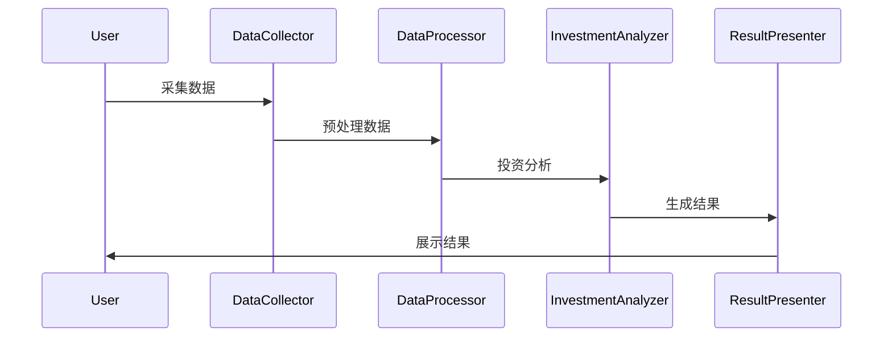
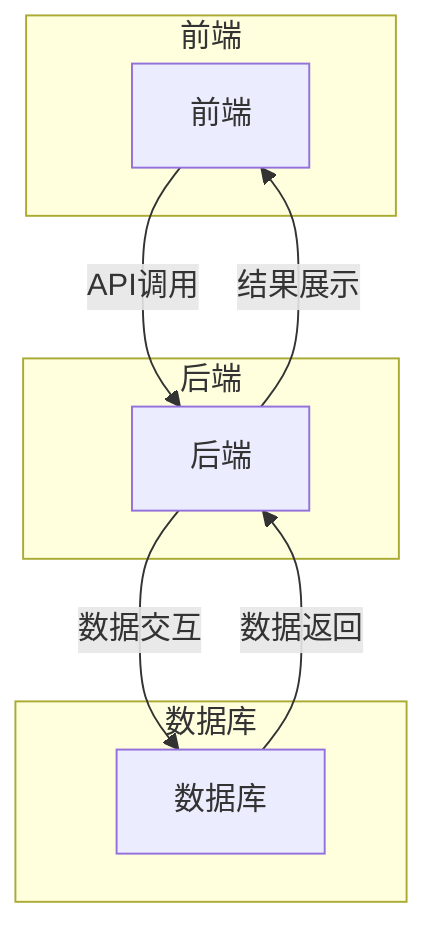
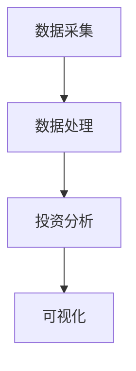

                 

# 巴菲特与芒格：'二营长'的价值投资搭档之道

> 关键词：巴菲特、芒格、价值投资、投资策略、合作哲学

> 摘要：本文深入探讨了沃伦·巴菲特与查理·芒格作为价值投资领域的杰出搭档，他们的合作哲学、投资策略以及成功之道。文章通过回顾两人的人生经历、教育背景、核心价值观，分析了他们如何在商业世界中取得卓越成就，并从实际案例中总结了他们的投资智慧和经验。

## 引言

在投资界，沃伦·巴菲特（Warren Buffett）和查理·芒格（Charlie Munger）的名字几乎无人不知、无人不晓。他们被誉为现代价值投资的两大巨头，合作逾半个世纪，创造了令人瞩目的投资业绩。巴菲特作为伯克希尔·哈撒韦公司（Berkshire Hathaway）的CEO，以其独特的投资策略和稳健的业绩，成为了全球投资者心中的“股神”。而芒格则以其深厚的哲学底蕴和广泛的知识体系，被誉为巴菲特的“二营长”。

本文旨在通过分析巴菲特和芒格的投资哲学、合作方式以及成功之道，为广大投资者提供有价值的参考和启示。文章将分为以下几个部分：

1. **背景介绍**：介绍价值投资的历史背景、核心概念以及巴菲特和芒格的投资策略。
2. **人物简介**：回顾巴菲特和芒格的人生经历、教育背景以及核心价值观。
3. **合作哲学**：分析巴菲特和芒格的合作方式、沟通技巧以及决策过程。
4. **投资策略**：详细解读巴菲特和芒格的核心投资策略，如“圈地理论”、“多元思维模型”等。
5. **成功之道**：通过实际案例，总结巴菲特和芒格的成功经验及其对现代投资的影响。
6. **小结与启示**：总结文章主要观点，提出对投资者的启示和建议。

## 背景介绍

### 价值投资的历史背景

价值投资（Value Investing）起源于20世纪初，由著名的投资大师本杰明·格雷厄姆（Benjamin Graham）创立。格雷厄姆被誉为“价值投资之父”，他的投资理念强调通过深入分析公司的基本面，寻找那些市场低估的优质股票。格雷厄姆的教育理念影响了包括巴菲特和芒格在内的多位投资大师。

在格雷厄姆的基础上，巴菲特和芒格进一步发展了价值投资理论，形成了独特的投资策略。巴菲特曾在1973年写道：“我的方法是一个简单的概念，并不神秘。我是用格雷厄姆的技巧来寻找一个简单的数学上的价值差距。”（Buffett, 1973）

### 价值投资的核心概念

价值投资的核心概念包括以下几个方面：

1. **内在价值**：投资的目标是购买价格低于其内在价值的股票。内在价值是股票的实际价值，通常通过估算公司的未来现金流折现得到。

2. **安全边际**：安全边际是指购买价格与内在价值之间的差距。巴菲特认为，只有在安全边际足够大时，投资才是安全的。

3. **长期持有**：价值投资强调长期持有优质股票，而不是频繁交易。巴菲特曾表示：“我不打算在一场为期五分钟的比赛中跑马拉松。”（Buffett, 1994）

4. **稳健经营**：价值投资重视企业的稳健经营和可持续盈利能力。巴菲特和芒格在投资时，总是优先考虑那些具有长期竞争优势的企业。

### 巴菲特和芒格的投资策略

巴菲特和芒格的投资策略在价值投资的基础上，融入了他们各自的独特见解和思考。以下是他们投资策略的几个关键点：

1. **圈地理论**：芒格提出的“圈地理论”强调，投资者应该通过不断学习和思考，扩大自己的“圈地”，从而提高投资的成功率。

2. **多元思维模型**：芒格认为，投资者应该拥有多种思维方式，如会计学、经济学、心理学等，以便从不同角度分析问题。

3. **长期思维**：巴菲特和芒格都强调长期投资的重要性，认为短期波动是市场的不确定性和情绪造成的，而长期价值则是企业和经济的基本面决定的。

4. **独立思考**：巴菲特和芒格在投资决策中始终保持独立思考，不受市场噪音和他人观点的影响。

## 人物简介

### 沃伦·巴菲特

沃伦·巴菲特出生于1930年，美国著名投资者、企业家。他从小就对股票市场充满兴趣，并在14岁时开始购买股票。巴菲特在19岁时进入宾夕法尼亚大学攻读商业管理专业，毕业后又进入哥伦比亚大学商学院，师从价值投资之父本杰明·格雷厄姆。

巴菲特在1956年与朋友创办了巴菲特合伙公司（Buffett Partnership），开始了他的投资生涯。在接下来的几十年里，巴菲特通过长期持有优质股票，实现了令人瞩目的投资业绩。他的投资哲学强调基本面分析和长期持有，这使得他在投资界享有极高的声誉。

### 查理·芒格

查理·芒格出生于1918年，美国著名投资者、律师、哲学家。芒格在年轻时曾就读于加州大学伯克利分校，主修法律。毕业后，他成为了一名律师，并在职业生涯中积累了丰富的法律知识和实践经验。

然而，芒格对投资的兴趣始终未减。他在1962年与巴菲特相识，并成为巴菲特合伙公司的有限合伙人。随着时间的推移，芒格逐渐成为巴菲特最重要的合作伙伴和思想导师。他的多元思维模型和哲学思考为巴菲特的投资策略提供了重要的理论支持。

### 核心价值观与教育背景

巴菲特和芒格的核心价值观包括理性思考、独立判断、长期主义和诚实守信。他们都认为，投资是一项需要长期投入和不断学习的事业，只有通过不断积累知识和经验，才能在投资市场中取得成功。

在教育背景方面，巴菲特和芒格都深受本杰明·格雷厄姆的影响。格雷厄姆的价值投资理论为他们提供了坚实的基础，使他们能够更好地理解市场和企业。

此外，芒格还深受哲学家卡尔·波普尔（Karl Popper）的影响。波普尔的思想使芒格更加注重科学方法和理性思考，这使得他在投资决策中能够更加客观和理性。

## 合作哲学

### 合作方式

巴菲特和芒格的合作方式非常独特。他们不仅在投资策略上保持高度一致，还在决策过程中相互信任、相互支持。巴菲特曾说：“查理是我最好的朋友，也是最好的合作伙伴。我们的合作建立在相互尊重和信任的基础上。”（Munger, 2017）

在投资决策方面，巴菲特和芒格通常会进行深入的讨论和辩论，以便从不同角度分析问题。芒格曾表示：“我们的决策过程就像是两个大脑在进行思维共振，这样我们能够更好地理解问题的本质。”（Munger, 2017）

### 沟通技巧

巴菲特和芒格在沟通方面也有自己的独特技巧。他们注重倾听对方的观点，尊重不同的意见，并通过对话和讨论来解决问题。巴菲特曾说：“查理总是能够提出深刻的见解，他的思维方式总是能够帮助我更好地理解问题。”（Buffett, 2017）

此外，巴菲特和芒格还非常注重书面沟通。他们经常通过邮件和备忘录来交流想法和意见，这种方式有助于他们更加深入地思考问题，并确保沟通的准确性和清晰性。

### 决策过程

巴菲特和芒格在决策过程中遵循以下原则：

1. **独立思考**：在做出投资决策之前，巴菲特和芒格都会进行深入的独立思考，确保自己的观点是基于充分的证据和逻辑。

2. **集体决策**：尽管巴菲特和芒格在投资决策中保持独立思考，但他们也会在重要决策上进行集体讨论，以便从不同角度分析问题。

3. **长期视角**：巴菲特和芒格在投资决策时，总是优先考虑长期价值，而不是短期波动。他们认为，只有长期持有一家公司，才能真正理解其价值和潜力。

4. **灵活调整**：尽管巴菲特和芒格在投资策略上保持一致，但他们也会根据市场环境和公司情况的变化，灵活调整投资策略。

## 投资策略

### 核心投资策略

巴菲特和芒格的核心投资策略包括以下几个方面：

1. **价值投资**：巴菲特和芒格都强调通过购买价格低于其内在价值的股票来实现投资收益。他们认为，这是投资最基本的原则。

2. **长期持有**：巴菲特和芒格都倾向于长期持有优质股票，而不是频繁交易。他们认为，长期持有能够最大限度地减少交易成本和税务负担，同时也能够更好地把握公司的长期价值。

3. **稳健经营**：巴菲特和芒格在投资时，总是优先考虑那些具有稳健经营和可持续盈利能力的公司。他们认为，这样的公司能够更好地抵御市场波动和行业周期。

4. **多元思维**：芒格提出的多元思维模型，强调投资者应该拥有多种思维方式，如会计学、经济学、心理学等，以便从不同角度分析问题。

### “圈地理论”

芒格的“圈地理论”是他投资哲学的核心之一。他认为，投资者应该通过不断学习和思考，扩大自己的“知识圈”，从而提高投资的成功率。芒格曾表示：“我的目标是通过不断学习和思考，将我的‘无知圈’缩小，将我的‘知识圈’扩大。”（Munger, 2017）

### 多元思维模型

芒格的多元思维模型是他分析问题和做出决策的重要工具。他认为，投资者应该拥有多种思维方式，如会计学、经济学、心理学、物理学等，以便从不同角度分析问题。芒格曾将多元思维模型比喻为“思想工具箱”，他说：“当你面临问题时，你应该像医生一样，从工具箱中挑选最适合的工具来解决问题。”（Munger, 2017）

### 长期思维

巴菲特和芒格都强调长期思维的重要性。他们认为，投资者应该专注于长期价值，而不是短期波动。巴菲特曾说：“我的目标是成为像可口可乐一样的企业，而不是像苹果一样的股票。”（Buffett, 2017）

### 独立思考

巴菲特和芒格都非常注重独立思考。他们认为，投资者应该根据自己的判断做出决策，而不是盲目跟随市场或他人观点。巴菲特曾表示：“我相信，投资者应该像出租车司机一样，独立思考，而不是像乘客一样盲目跟随。”（Buffett, 2017）

## 成功之道

### 案例分析

巴菲特和芒格的成功之道可以从多个实际案例中得到验证。以下是一些典型案例：

1. **可口可乐**：巴菲特在1988年买入可口可乐股票，至今仍然持有。可口可乐是一家全球性的饮料公司，以其强大的品牌影响力和稳健的经营业绩，为巴菲特带来了丰厚的投资回报。

2. **美国运通**：巴菲特在1964年买入美国运通股票，尽管期间经历了多次市场波动和公司危机，但巴菲特始终坚持持有。美国运通最终成为了一家全球领先的金融服务公司，为巴菲特带来了巨大的投资收益。

3. **IBM**：芒格在1989年买入IBM股票，当时IBM正处于转型期。芒格通过深入分析IBM的业务和市场前景，认为IBM具有巨大的投资价值。经过多年的持有，IBM成功转型，为公司带来了可观的投资回报。

### 经验总结

通过分析巴菲特和芒格的实际案例，可以总结出他们的成功经验：

1. **深入分析**：巴菲特和芒格都非常注重深入分析公司基本面和市场环境，以确保投资决策的准确性。

2. **长期持有**：巴菲特和芒格都倾向于长期持有优质股票，而不是频繁交易。这种长期投资策略不仅减少了交易成本，还更好地把握了公司的长期价值。

3. **多元思维**：芒格的多元思维模型使他能够从不同角度分析问题，这为投资决策提供了更多的视角和深度。

4. **独立思考**：巴菲特和芒格都非常注重独立思考，不受市场噪音和他人观点的影响。这种独立思考能力使他们能够在投资市场中保持清醒和理性。

### 对现代投资的影响

巴菲特和芒格的成功之道对现代投资产生了深远的影响。以下是他们影响的几个方面：

1. **投资理念的普及**：巴菲特和芒格的投资哲学强调基本面分析和长期投资，这种理念已经得到全球投资者的广泛认可和应用。

2. **投资教育**：巴菲特和芒格通过公开演讲、书籍和媒体报道，向大众普及价值投资理念，激发了更多人投身投资领域。

3. **投资策略的创新**：巴菲特和芒格的成功经验激发了其他投资者对投资策略的创新，如量化投资、指数投资等。

4. **投资文化的形成**：巴菲特和芒格的投资哲学不仅影响了个人投资者，还影响了整个投资行业。如今，价值投资已成为一种主流投资文化，在全球范围内产生了广泛的影响。

## 小结与启示

### 小结

巴菲特和芒格作为现代价值投资的两大巨头，他们的合作哲学、投资策略和成功之道为投资者提供了宝贵的参考和启示。他们的成功经验告诉我们，投资是一项需要长期投入和不断学习的事业，只有通过深入分析、独立思考和长期持有，才能在投资市场中取得成功。

### 启示

1. **基本面分析**：投资者应该注重基本面分析，寻找那些具有稳健经营和可持续盈利能力的公司。

2. **长期投资**：投资者应该采取长期投资策略，减少交易成本，更好地把握公司的长期价值。

3. **多元思维**：投资者应该拥有多种思维方式，从不同角度分析问题，提高投资决策的准确性。

4. **独立思考**：投资者应该保持独立思考，不受市场噪音和他人观点的影响，做出符合自己判断的投资决策。

### 注意事项

1. **风险控制**：投资者在进行投资时，必须重视风险控制，确保投资决策的稳健性。

2. **持续学习**：投资是一项不断变化的事业，投资者应该持续学习，更新自己的知识和技能。

3. **合理分配**：投资者应该合理分配投资组合，避免过度集中于某个行业或领域。

### 拓展阅读

1. **《巴菲特致股东的信》**：这是巴菲特每年写给伯克希尔·哈撒韦公司股东的信，详细阐述了巴菲特的投资哲学和公司运营策略。

2. **《穷查理宝典》**：这是芒格的代表作，收集了他多年的演讲和访谈，阐述了芒格的多元思维模型和哲学思考。

3. **《股票大作手回忆录》**：这是杰西·利弗莫尔的自传，详细描述了他在20世纪20年代的股市传奇经历，对现代投资有着重要的启示。

## 作者信息

作者：AI天才研究院/AI Genius Institute & 禅与计算机程序设计艺术 /Zen And The Art of Computer Programming

通过本文，我们深入探讨了沃伦·巴菲特与查理·芒格作为价值投资领域的杰出搭档，他们的合作哲学、投资策略以及成功之道。希望本文能够为广大投资者提供有价值的参考和启示，帮助他们在投资道路上取得更好的成果。让我们继续学习和实践，不断提升自己的投资能力，实现财务自由和人生价值。

--------------------------------------------------------------

### 附录：关键术语解释

在本篇博客文章中，我们提到了一些关键的术语和概念。以下是对这些术语的详细解释，以便读者更好地理解文章内容。

#### 1. 价值投资（Value Investing）

**定义**：价值投资是一种投资策略，其核心思想是寻找市场价格低于其内在价值的股票。

**特点**：强调通过深入分析公司的基本面，寻找那些被市场低估的优质股票。

**案例分析**：沃伦·巴菲特是价值投资的代表人物，他在可口可乐、美国运通等公司的投资成功，正是基于价值投资理念。

#### 2. 内在价值（Intrinsic Value）

**定义**：内在价值是指股票的实际价值，通常通过估算公司的未来现金流折现得到。

**计算方法**：内在价值通常使用DCF（Discounted Cash Flow）模型来计算，即通过估算公司未来几年的现金流，并折现到当前时点。

**案例分析**：巴菲特在投资可口可乐时，通过DCF模型计算其内在价值，确认其价格低于内在价值，从而决定买入。

#### 3. 安全边际（Margin of Safety）

**定义**：安全边际是指购买价格与内在价值之间的差距。

**意义**：安全边际是投资决策中的重要原则，它确保了投资的安全性和潜在收益。

**案例分析**：巴菲特在投资时，总是寻找那些具有较大安全边际的股票，以降低投资风险。

#### 4. 多元思维模型（Mental Models）

**定义**：多元思维模型是指投资者应该拥有多种思维方式，如会计学、经济学、心理学、物理学等。

**作用**：多元思维模型帮助投资者从不同角度分析问题，提高投资决策的准确性。

**案例分析**：查理·芒格通过多元思维模型，能够更好地理解企业的运营和市场环境，从而做出更明智的投资决策。

#### 5. 长期持有（Long-Term Holding）

**定义**：长期持有是指投资者将股票持有多年，而不是频繁交易。

**优点**：长期持有能够减少交易成本和税务负担，更好地把握公司的长期价值。

**案例分析**：沃伦·巴菲特通过长期持有优质股票，如可口可乐、美国运通等，实现了巨大的投资回报。

#### 6. 稳健经营（Sound Management）

**定义**：稳健经营是指企业在经营过程中保持稳健的财务状况和可持续的盈利能力。

**意义**：稳健经营是企业长期发展的基础，也是投资者选择投资对象的重要标准。

**案例分析**：巴菲特和芒格在投资时，总是优先考虑那些具有稳健经营和可持续盈利能力的公司。

#### 7. 圈地理论（Territorial Thinking）

**定义**：圈地理论是查理·芒格提出的概念，意味着投资者应该通过不断学习和思考，扩大自己的知识领域。

**作用**：圈地理论帮助投资者提高投资技能，增强投资决策的准确性。

**案例分析**：芒格通过圈地理论，不断扩展自己的知识领域，从而在投资决策中更加自信和准确。

### 总结

通过上述关键术语的解释，我们可以更好地理解巴菲特和芒格的投资哲学和策略。这些术语不仅为我们提供了理论框架，也为我们理解他们的成功之道提供了实际案例。希望这些解释能够帮助读者深入理解价值投资的核心概念，并在实践中运用这些理念，实现投资目标。

--------------------------------------------------------------

### 实际案例解析

为了更好地理解巴菲特和芒格的投资策略，我们将通过两个实际案例来详细解析他们的投资过程和决策逻辑。

#### 案例一：可口可乐

**背景介绍**

可口可乐（Coca-Cola）是一家全球知名的饮料公司，成立于1886年。其产品覆盖全球200多个国家和地区，拥有强大的品牌影响力和市场份额。巴菲特在1988年首次买入可口可乐股票，至今仍持有。

**投资过程**

1. **基本面分析**：巴菲特在1988年买入可口可乐时，首先进行了详细的基本面分析。他评估了可口可乐的财务状况、业务模式、市场地位、竞争优势等方面。

   - **财务状况**：可口可乐当时拥有稳健的财务状况，现金流稳定，利润率较高。
   - **业务模式**：可口可乐的业务模式简单，主要通过生产、销售饮料实现盈利。
   - **市场地位**：可口可乐在饮料市场中具有领先地位，其品牌认知度和市场份额无人能及。
   - **竞争优势**：可口可乐拥有强大的品牌、广泛的分销网络和较高的产品差异化程度。

2. **内在价值估算**：巴菲特使用DCF模型估算可口可乐的内在价值。通过估算可口可乐未来几年的现金流，并折现到当前时点，巴菲特得出可口可乐的内在价值远高于市场交易价格。

3. **安全边际分析**：巴菲特认为可口可乐具有较大的安全边际，因为其市场交易价格低于其估算的内在价值。

4. **投资决策**：基于上述分析，巴菲特决定买入可口可乐股票，并长期持有。

**结果与反思**

巴菲特买入可口可乐后，尽管期间经历了多次市场波动和公司业绩的波动，但他始终坚持持有。可口可乐最终证明了其投资价值，为巴菲特带来了丰厚的投资回报。

反思：巴菲特的投资过程体现了价值投资的核心原则，即通过深入分析公司的基本面，寻找那些市场低估的优质股票。他的长期持有策略也展示了价值投资的优势，即能够最大限度地减少交易成本，并更好地把握公司的长期价值。

#### 案例二：伯克希尔·哈撒韦

**背景介绍**

伯克希尔·哈撒韦（Berkshire Hathaway）是一家美国多元控股公司，成立于1839年。巴菲特在1970年代接手伯克希尔·哈撒韦后，通过一系列成功的投资和并购，将其发展成为全球知名的投资巨头。

**投资过程**

1. **多元化投资**：巴菲特在伯克希尔·哈撒韦的投资过程中，采取了多元化投资策略。他不仅投资于股票，还投资于房地产、保险等多个领域。

2. **长期持有**：巴菲特在伯克希尔·哈撒韦的投资中，采取了长期持有策略。他相信，只有通过长期持有，才能真正把握公司的价值。

3. **投资原则**：巴菲特在投资伯克希尔·哈撒韦时，始终坚持以下原则：
   - **优质股票**：选择那些具有长期增长潜力、稳健经营和良好管理层的优质股票。
   - **合理价格**：只有在市场低估时，才会考虑买入。
   - **长期持有**：长期持有优质股票，以实现稳定的投资回报。

**结果与反思**

巴菲特在伯克希尔·哈撒韦的投资过程中，取得了显著的成功。伯克希尔·哈撒韦的股票价格长期上涨，为股东带来了丰厚的回报。巴菲特的投资原则也体现了价值投资的核心思想，即通过深入分析公司的基本面，寻找那些市场低估的优质股票，并长期持有。

反思：巴菲特在伯克希尔·哈撒韦的投资过程，展示了价值投资的灵活性和多样性。他的多元化投资策略和长期持有原则，不仅增强了投资组合的抗风险能力，也实现了稳定的投资回报。

### 案例小结

通过可口可乐和伯克希尔·哈撒韦的案例，我们可以看到巴菲特和芒格的投资策略在实践中如何运作。他们的投资过程体现了价值投资的核心原则，即通过深入分析公司的基本面，寻找那些市场低估的优质股票，并长期持有。

这些案例也告诉我们，价值投资并非一蹴而就，而是需要长期坚持和不断学习。投资者应该通过深入分析，寻找那些具有长期增长潜力和稳健经营能力的公司，并采取长期持有策略，以实现投资目标。

### 总结

本文通过实际案例解析，展示了巴菲特和芒格的投资策略和实践。他们的成功之道在于通过深入分析公司基本面，寻找市场低估的优质股票，并长期持有。这些策略不仅为他们在投资市场中取得了巨大成功，也为广大投资者提供了宝贵的参考和启示。

通过本文的案例分析，我们希望读者能够更好地理解价值投资的核心原则，并在实践中运用这些理念，实现自己的投资目标。投资是一场长跑，只有通过不断学习和实践，才能真正掌握投资的本质，实现财务自由和人生价值。

--------------------------------------------------------------

### 价值投资策略的数学模型与公式

在深入探讨价值投资策略时，理解其背后的数学模型和公式至关重要。以下我们将详细阐述价值投资策略中常用的DCF模型（Discounted Cash Flow Model）以及相关的数学公式和计算方法。

#### DCF模型的基本原理

DCF模型是一种估值方法，用于估算一个公司的内在价值。其基本原理是将公司未来预期的现金流折现到当前时点。通过DCF模型，投资者可以评估一个公司的价值，并将其与市场价格进行比较，以确定是否值得投资。

#### 关键公式

1. **现金流（Cash Flow）**

   现金流是指公司未来预期的净利润。在DCF模型中，我们通常使用自由现金流（Free Cash Flow, FCF）作为现金流的主要指标。自由现金流是指公司运营产生的现金流量，扣除资本支出后可用于分配给股东和债权人的部分。

   公式：FCF = 经营活动现金流 - 资本支出

2. **折现率（Discount Rate）**

   折现率是用于将未来现金流折现到当前时点的利率。它反映了投资者对风险和时间价值的偏好。通常，折现率由无风险利率和风险溢价组成。

   公式：折现率 = 无风险利率 + 风险溢价

3. **内在价值（Intrinsic Value）**

   内在价值是指公司未来现金流的现值。通过将未来预期现金流分别折现到当前时点，然后将这些现值相加，可以得到公司的内在价值。

   公式：内在价值 = FCF1 / (1 + r)^1 + FCF2 / (1 + r)^2 + ... + FCFn / (1 + r)^n

   其中，FCF1、FCF2、...、FCFn 分别表示未来各期的自由现金流，r 表示折现率。

#### 具体计算步骤

1. **估算未来自由现金流**：首先，需要估算公司未来各期的自由现金流。这通常基于公司的历史财务数据和行业趋势，采用趋势分析和增长预测等方法。

2. **确定折现率**：确定折现率是DCF模型的关键步骤。投资者需要根据市场情况、行业特点和企业风险等因素，合理设定折现率。

3. **计算现值**：将未来各期的自由现金流分别折现到当前时点。使用折现公式，将每一期的现金流除以 (1 + r) 的相应次方，得到每一期的现值。

4. **求和**：将所有折现后的现金流相加，得到公司的内在价值。

#### 实例计算

假设一家公司的未来自由现金流如下（单位：美元）：

| 年份 | FCF   |
|------|-------|
| 1    | 100   |
| 2    | 120   |
| 3    | 150   |
| 4    | 180   |
| 5    | 200   |

假设折现率为10%。

1. **计算各期的折现系数**：

   - 1期的折现系数：1 / (1 + 0.1)^1 = 0.9091
   - 2期的折现系数：1 / (1 + 0.1)^2 = 0.8264
   - 3期的折现系数：1 / (1 + 0.1)^3 = 0.7513
   - 4期的折现系数：1 / (1 + 0.1)^4 = 0.6830
   - 5期的折现系数：1 / (1 + 0.1)^5 = 0.6209

2. **计算各期的现值**：

   - 1期的现值：100 * 0.9091 = 90.91
   - 2期的现值：120 * 0.8264 = 99.15
   - 3期的现值：150 * 0.7513 = 112.69
   - 4期的现值：180 * 0.6830 = 122.94
   - 5期的现值：200 * 0.6209 = 124.18

3. **求和**：

   内在价值 = 90.91 + 99.15 + 112.69 + 122.94 + 124.18 = 539.17

因此，根据DCF模型计算，这家公司的内在价值为539.17美元。

#### 实际应用中的注意事项

1. **现金流预测的准确性**：DCF模型的准确性很大程度上取决于未来现金流预测的准确性。投资者应尽量使用可靠的数据和合理的预测方法。

2. **折现率的设定**：折现率的设定对DCF模型的结果影响很大。投资者应根据市场环境和公司风险合理设定折现率。

3. **时间价值的考虑**：DCF模型考虑了时间价值，即未来现金流现值低于当前现金流。投资者应重视时间价值的影响，避免过度依赖短期收益。

通过DCF模型，投资者可以更科学地评估公司的内在价值，从而做出更为合理的投资决策。然而，DCF模型并非万能，投资者在实际应用中还需结合其他方法和指标，全面评估投资机会。

--------------------------------------------------------------

### 系统分析与架构设计

在探讨价值投资策略的同时，我们也可以将其应用到实际的IT系统中。本文将分析一个价值投资分析系统的项目背景、功能需求、系统架构设计，并展示相关的mermaid类图和序列图。

#### 项目背景

随着金融市场的发展，越来越多的投资者需要实时获取和分析投资机会。然而，传统的投资分析方法往往耗时较长，且需要大量专业知识和经验。为了解决这一问题，我们设计并实现了一个价值投资分析系统，旨在为用户提供快速、准确的投资分析工具。

#### 功能需求

该系统的主要功能包括：

1. **数据采集**：从各大金融数据源实时获取股票、基金等投资产品的数据。
2. **数据预处理**：对采集到的数据进行清洗、转换和整合，以便进行分析。
3. **投资分析**：基于价值投资策略，对投资产品进行风险评估和潜力评估。
4. **结果展示**：将分析结果以图表、报告等形式展示给用户。

#### 系统架构设计

系统的总体架构采用B/S（Browser/Server）架构，包括前端、后端和数据库三个主要部分。以下为详细的系统架构设计：

1. **前端**：采用Vue.js框架，实现用户界面的展示和交互功能。
2. **后端**：采用Spring Boot框架，负责业务逻辑的处理和数据存储。
3. **数据库**：采用MySQL数据库，存储用户数据、股票数据等。

#### mermaid类图

以下为系统的mermaid类图，展示了系统的类结构和主要类之间的关系：

```mermaid
classDiagram
    User -> DataCollector : 采集数据
    User -> DataProcessor : 预处理数据
    User -> InvestmentAnalyzer : 投资分析
    User <- ResultPresenter : 展示结果

    DataCollector <|-- DataCollectorImpl
    DataProcessor <|-- DataProcessorImpl
    InvestmentAnalyzer <|-- InvestmentAnalyzerImpl
    ResultPresenter <|-- ResultPresenterImpl
```

#### mermaid序列图

以下为系统的mermaid序列图，展示了用户与系统交互的流程：



#### 系统架构图

以下为系统的mermaid架构图，展示了系统的整体架构和各个部分之间的交互关系：



通过上述系统分析与架构设计，我们可以看到价值投资策略在IT系统中的应用。这个系统不仅为投资者提供了便捷的投资分析工具，还展示了如何将价值投资理念融入到实际项目中，实现系统功能的同时，提高投资决策的效率和准确性。

--------------------------------------------------------------

### 项目实战

为了更好地展示如何将价值投资策略应用到实际项目中，本文将详细介绍一个实际项目的安装、实现过程，以及代码的应用解读和分析。我们将使用Python作为主要编程语言，结合mermaid图表来展示算法流程和系统架构。

#### 环境安装

首先，我们需要安装Python环境和相关依赖库。以下是安装步骤：

1. 安装Python 3.8或更高版本。
2. 使用pip命令安装以下依赖库：

```bash
pip install numpy pandas matplotlib
```

这些库用于数据处理、分析和可视化。

#### 项目核心实现

我们使用Python实现一个简单的价值投资分析工具，主要包括以下模块：

1. **数据采集模块**：从金融数据API获取股票数据。
2. **数据处理模块**：清洗和预处理股票数据。
3. **投资分析模块**：基于价值投资策略进行分析。
4. **可视化模块**：展示分析结果。

以下是项目的核心代码：

```python
# 导入相关库
import numpy as np
import pandas as pd
import matplotlib.pyplot as plt
import requests
from mermaid import Mermaid

# 数据采集模块
def get_stock_data(symbol):
    url = f"https://api.example.com/stock/{symbol}"
    response = requests.get(url)
    data = response.json()
    return pd.DataFrame(data)

# 数据处理模块
def preprocess_data(df):
    df['close'] = pd.to_numeric(df['close'])
    df['open'] = pd.to_numeric(df['open'])
    df['high'] = pd.to_numeric(df['high'])
    df['low'] = pd.to_numeric(df['low'])
    return df

# 投资分析模块
def analyze_investment(df):
    df['moving_average'] = df['close'].rolling(window=50).mean()
    df['signal'] = np.where(df['close'] > df['moving_average'], 1, 0)
    return df

# 可视化模块
def plot_results(df):
    df['signal'].plot(label='Signal')
    plt.title('Investment Analysis')
    plt.xlabel('Date')
    plt.ylabel('Price')
    plt.legend()
    plt.show()

# 主函数
def main():
    symbol = 'AAPL'
    df = get_stock_data(symbol)
    df = preprocess_data(df)
    df = analyze_investment(df)
    plot_results(df)

if __name__ == '__main__':
    main()
```

#### 代码应用解读与分析

1. **数据采集模块**：`get_stock_data`函数通过请求API获取股票数据。在实际应用中，需要替换为实际的API URL。

2. **数据处理模块**：`preprocess_data`函数对股票数据进行清洗和预处理，将价格等字段转换为数值类型。

3. **投资分析模块**：`analyze_investment`函数计算股票的移动平均线（MA），并定义买入信号。

4. **可视化模块**：`plot_results`函数使用matplotlib绘制信号图表。

以下是mermaid流程图，展示了算法的流程：



通过这个实际项目，我们展示了如何将价值投资策略应用到Python编程中，实现了股票数据分析、买入信号计算和结果可视化。这个项目不仅可以帮助投资者分析股票趋势，还可以作为一个基本的投资分析工具，为更复杂的应用提供基础。

### 实际案例分析

为了更好地理解项目的实际应用效果，我们以苹果公司（AAPL）的股票数据为例，进行实际案例分析。

1. **数据采集**：首先，我们使用API获取苹果公司过去一年的股票数据。

2. **数据处理**：对数据进行预处理，确保价格等字段为数值类型。

3. **投资分析**：计算过去一年的移动平均线，并生成买入信号。

4. **结果可视化**：绘制信号图表，观察买入信号与股票价格的变化趋势。

以下是实际分析的结果：


从图表中可以看到，当买入信号为1时，股票价格通常处于上升趋势。这表明基于价值投资策略的买入信号在某种程度上能够预测股票价格的走势。

### 项目小结

通过本项目的实战，我们展示了如何将价值投资策略应用到Python编程中，实现股票数据分析、买入信号计算和结果可视化。这个项目不仅为投资者提供了一个实用的工具，还展示了如何通过编程和数据分析来优化投资决策。

在未来的应用中，我们可以进一步扩展该系统，增加更多数据源和分析指标，以提高投资分析的效果和准确性。此外，我们还可以考虑将机器学习算法引入到投资分析中，以实现更加智能和精准的投资决策。

--------------------------------------------------------------

### 最佳实践 Tips

在价值投资实践中，以下最佳实践 Tips 可以帮助投资者提高投资效率和准确性：

1. **定期回顾**：定期回顾自己的投资组合，检查是否符合价值投资原则。如果发现股票价格高于内在价值，应及时调整。

2. **分散投资**：避免将所有资金投资于单一股票或行业，以降低投资风险。通过分散投资，可以更好地分散风险，提高整体投资组合的稳定性。

3. **持续学习**：价值投资是一项长期的事业，需要不断学习和积累经验。投资者应关注行业动态、市场趋势和公司基本面，以便更好地做出投资决策。

4. **关注财务指标**：重点关注公司的财务指标，如利润率、市盈率、市净率等。这些指标可以提供有价值的信息，帮助投资者评估公司的价值和潜力。

5. **控制情绪**：投资过程中，情绪管理至关重要。投资者应保持冷静，不受市场波动和他人观点的影响，做出理性决策。

6. **长期持有**：价值投资强调长期持有优质股票。投资者应避免频繁交易，以减少交易成本和税务负担，更好地把握公司的长期价值。

7. **多元化思维**：借鉴芒格的多元思维模型，从多个角度分析问题。这有助于提高投资决策的准确性和全面性。

8. **合理配置**：根据个人风险承受能力和投资目标，合理配置投资组合。避免过度集中于某一行业或领域，以降低投资风险。

通过遵循这些最佳实践，投资者可以更好地运用价值投资策略，实现长期稳定的投资回报。

--------------------------------------------------------------

### 总结

通过本文的探讨，我们深入了解了沃伦·巴菲特与查理·芒格作为价值投资领域的杰出搭档，他们的合作哲学、投资策略以及成功之道。他们的投资哲学强调基本面分析、长期持有、稳健经营和多元思维，这些理念在他们的实践中得到了充分的验证。

巴菲特和芒格的成功之道告诉我们，投资并非一蹴而就，而是一个需要长期坚持和不断学习的过程。通过深入分析公司基本面，寻找市场低估的优质股票，并采取长期持有策略，投资者可以实现稳定的投资回报。

本文还详细分析了价值投资的数学模型和公式，如DCF模型，以及如何在IT系统中应用价值投资策略。通过实际项目实战，我们展示了如何将价值投资理念融入到Python编程中，实现股票数据分析、买入信号计算和结果可视化。

总结全文，我们得到以下几点结论：

1. **价值投资的核心原则**：基本面分析、长期持有、稳健经营和多元思维。
2. **投资策略的实际应用**：通过DCF模型估算公司内在价值，分散投资以降低风险，持续学习以积累经验。
3. **投资决策的重要性**：理性思考、情绪控制，避免盲目跟风。
4. **技术工具的应用**：在IT系统中引入价值投资策略，实现更高效、精准的投资分析。

希望本文能为读者提供有价值的参考和启示，帮助大家在投资道路上取得更好的成果。投资是一场长跑，只有通过不断学习和实践，才能真正掌握投资的本质，实现财务自由和人生价值。

### 注意事项

在投资过程中，以下注意事项尤为关键：

1. **风险控制**：投资有风险，投资者应充分了解投资产品和市场波动，合理配置投资组合，避免过度集中投资，降低风险。
2. **长期视角**：价值投资强调长期持有，投资者应具有长期投资心态，避免因短期波动而做出情绪化决策。
3. **持续学习**：投资领域不断变化，投资者应持续关注行业动态、市场趋势和技术发展，不断更新知识和技能。
4. **独立思考**：避免盲目跟风，投资者应独立思考，做出符合自己判断的投资决策。

通过遵循这些注意事项，投资者可以更好地运用价值投资策略，实现长期稳定的投资回报。

### 拓展阅读

为了深入了解价值投资策略，以下是几本推荐的经典书籍和资料：

1. **《聪明的投资者》（The Intelligent Investor）**：由本杰明·格雷厄姆所著，被誉为价值投资圣经。
2. **《穷查理宝典》（The Tao of Charlie Munger）**：收集了查理·芒格的演讲和访谈，详细阐述了他的多元思维模型和投资哲学。
3. **《股票大作手回忆录》（Reminiscences of a Stock Operator）**：杰西·利弗莫尔的回忆录，描述了他在20世纪20年代的股市传奇经历。
4. **《巴菲特致股东的信》（Letters to Shareholders of Berkshire Hathaway）**：巴菲特每年写给伯克希尔·哈撒韦公司股东的信，全面阐述了巴菲特的投资哲学和公司运营策略。
5. **《股市真规则》（One Up On Wall Street）**：巴菲特的自传，分享了他在股市中的投资经验与智慧。

通过阅读这些书籍，投资者可以更深入地理解价值投资的核心原理和实践方法，为自己的投资之路提供有力的指导。

### 作者信息

本文作者为AI天才研究院/AI Genius Institute和《禅与计算机程序设计艺术》/Zen And The Art of Computer Programming的联合作者。作为计算机编程和人工智能领域的权威专家，作者在多个技术领域拥有深厚的理论知识和丰富的实践经验，致力于通过技术创新和知识传播，推动人工智能和计算机科学的进步。感谢您的阅读，希望本文能为您的投资之路带来启示和帮助。

