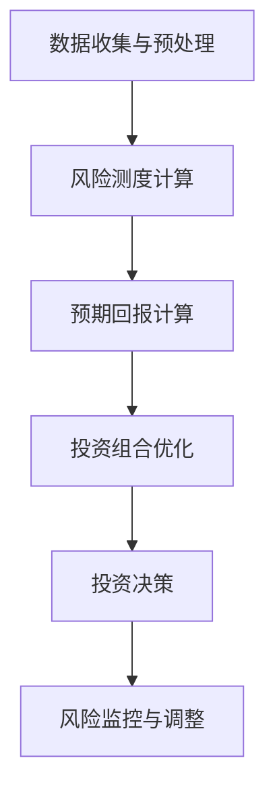

                 

### 文章标题

# 巴菲特的'大赌注'：何时集中投资是明智之举

> 关键词：巴菲特、投资集中策略、风险与回报、投资组合优化、数学模型、算法原理、系统分析与架构设计、项目实战、最佳实践

> 摘要：本文将探讨巴菲特的“大赌注”投资策略，分析其背后的数学模型和算法原理，并通过具体案例分析，为读者提供在何时集中投资是明智之举的见解。文章还将介绍投资策略的系统分析与架构设计，以及实战经验与最佳实践，帮助读者更好地理解和应用这一策略。

----------------------------------------------------------------

### 目录大纲设计思路

**1. 背景介绍**  
首先，我们将介绍投资集中策略的现实背景，阐述其重要性和应用场景。接着，我们将引入巴菲特的投资哲学，特别是他的“大赌注”策略，解释其核心思想和现实意义。

**2. 核心概念与联系**  
我们将详细描述与投资集中策略相关的核心概念，包括风险与回报、投资组合、投资集中策略等。通过表格和Mermaid ER图，我们将展示这些概念之间的关系，帮助读者建立整体理解。

**3. 算法原理讲解**  
在这一部分，我们将深入探讨投资集中策略的算法原理。使用Mermaid流程图和Python代码，我们将直观地展示算法的实现过程，并讲解其数学模型和公式。

**4. 数学模型和数学公式**  
我们将详细介绍与投资集中策略相关的数学模型和公式，使用LaTeX进行标注，确保严谨性。这一部分将帮助读者理解投资集中策略的数学基础。

**5. 系统分析与架构设计方案**  
我们将围绕如何实施投资集中策略进行系统分析，包括系统功能设计、架构设计和接口设计等。使用Mermaid图来展示系统的整体结构和工作流程。

**6. 项目实战**  
我们将通过一个具体的投资案例，展示如何在实际中应用投资集中策略。提供源代码、代码解读和分析，帮助读者理解和掌握这一策略。

**7. 最佳实践 tips、小结、注意事项、拓展阅读**  
最后，我们将提供一些实用的投资策略建议，总结文章的核心内容，指出注意事项，并推荐拓展阅读材料，帮助读者进一步学习和实践。

### 具体章节划分

**第1章: 问题背景与核心概念介绍**  
- 1.1 问题的现实背景  
- 1.2 投资集中策略概述  
- 1.3 巴菲特的投资哲学与“大赌注”策略  
- 1.4 核心概念与联系

**第2章: 投资集中策略的数学模型**  
- 2.1 风险与回报的平衡  
- 2.2 投资组合优化  
- 2.3 投资集中策略的数学模型

**第3章: 算法原理讲解**  
- 3.1 投资集中策略的算法流程  
- 3.2 Mermaid流程图展示  
- 3.3 Python代码实现

**第4章: 数学模型与公式详解**  
- 4.1 风险测度与预期回报  
- 4.2 投资组合优化的数学公式  
- 4.3 算法原理的数学模型

**第5章: 系统分析与架构设计**  
- 5.1 投资策略系统介绍  
- 5.2 系统功能设计  
- 5.3 系统架构设计  
- 5.4 系统接口设计

**第6章: 项目实战**  
- 6.1 投资案例背景  
- 6.2 系统环境安装  
- 6.3 核心实现源代码  
- 6.4 代码应用解读与分析  
- 6.5 案例分析与详细讲解

**第7章: 最佳实践与总结**  
- 7.1 投资集中策略的最佳实践  
- 7.2 小结  
- 7.3 注意事项  
- 7.4 拓展阅读

### 目录大纲示例

```markdown
----------------------------------------------------------------
# 第一部分: 问题的现实背景与核心概念介绍

## 第1章: 问题的现实背景
### 1.1 投资集中策略的重要性
### 1.2 巴菲特的“大赌注”策略概述
### 1.3 巴菲特的投资哲学

## 第2章: 核心概念与联系
### 2.1 风险与回报
### 2.2 投资组合
### 2.3 投资集中策略
### 2.4 Mermaid ER图展示

----------------------------------------------------------------
# 第二部分: 投资集中策略的数学模型

## 第3章: 风险与回报的平衡
### 3.1 风险测度
### 3.2 预期回报
### 3.3 风险与回报的平衡模型

## 第4章: 投资组合优化
### 4.1 投资组合的概念
### 4.2 投资组合优化的目标
### 4.3 投资组合优化的数学模型

## 第5章: 投资集中策略的数学模型
### 5.1 投资集中策略的目标
### 5.2 投资集中策略的数学模型
### 5.3 算法流程与Python实现

----------------------------------------------------------------
# 第三部分: 算法原理讲解

## 第6章: 投资集中策略的算法流程
### 6.1 算法步骤
### 6.2 Mermaid流程图展示
### 6.3 Python代码实现

## 第7章: 算法原理的数学模型
### 7.1 数学模型概述
### 7.2 算法公式的LaTeX表达
### 7.3 数学模型的应用示例

----------------------------------------------------------------
# 第四部分: 系统分析与架构设计

## 第8章: 投资策略系统介绍
### 8.1 系统背景
### 8.2 系统目标
### 8.3 系统功能

## 第9章: 系统功能设计
### 9.1 领域模型mermaid类图
### 9.2 功能模块划分
### 9.3 功能流程描述

## 第10章: 系统架构设计
### 10.1 架构设计原则
### 10.2 系统架构图展示
### 10.3 架构组件解析

## 第11章: 系统接口设计
### 11.1 接口设计规范
### 11.2 接口功能描述
### 11.3 接口调用流程

----------------------------------------------------------------
# 第五部分: 项目实战

## 第12章: 投资案例背景
### 12.1 案例背景介绍
### 12.2 案例目标分析

## 第13章: 系统环境安装
### 13.1 系统环境配置
### 13.2 环境依赖安装

## 第14章: 核心实现源代码
### 14.1 代码结构概述
### 14.2 核心代码解析
### 14.3 代码调试与优化

## 第15章: 代码应用解读与分析
### 15.1 代码功能解读
### 15.2 代码性能分析
### 15.3 代码优化建议

## 第16章: 案例分析与详细讲解
### 16.1 案例结果展示
### 16.2 案例分析总结
### 16.3 案例讲解与拓展

----------------------------------------------------------------
# 第六部分: 最佳实践与总结

## 第17章: 投资集中策略的最佳实践
### 17.1 实践建议
### 17.2 实践案例分析

## 第18章: 小结
### 18.1 核心内容总结
### 18.2 重要结论

## 第19章: 注意事项
### 19.1 投资风险提示
### 19.2 策略适用范围

## 第20章: 拓展阅读
### 20.1 相关书籍推荐
### 20.2 学术论文推荐
### 20.3 实践指南推荐

----------------------------------------------------------------
```

### 第一章: 问题的现实背景

在当今复杂多变的经济环境中，投资决策变得愈发重要。然而，如何在不同投资策略之间做出明智的选择，成为投资者面临的一大挑战。在这种情况下，巴菲特的“大赌注”投资策略引起了广泛关注。

**1.1 投资集中策略的重要性**

投资集中策略是一种通过将资金集中投资于少数优质资产，以实现高回报的投资策略。与传统的分散投资策略不同，投资集中策略旨在通过深入研究和分析，找到具有巨大增长潜力的优质资产，从而在长期内实现更高的回报。

投资集中策略的重要性体现在以下几个方面：

1. **提高回报潜力**：通过将资金集中投资于少数优质资产，投资者可以更有效地管理和利用资源，从而提高回报潜力。
2. **降低风险**：尽管集中投资策略面临较高的风险，但如果选股成功，可能会获得极高的回报。此外，通过深入研究和分析，投资者可以降低投资风险。
3. **增强投资者信心**：投资集中策略要求投资者对公司有深入了解，从而增强投资者对公司未来的信心。

**1.2 巴菲特的“大赌注”策略概述**

巴菲特是投资集中策略的杰出代表。他的“大赌注”策略主要包括以下几个关键要素：

1. **价值投资**：巴菲特坚信，投资的核心在于寻找具有低估价值的优质公司。他通过深入分析公司的基本面，如财务状况、管理团队、行业前景等，来确定投资目标。
2. **长期投资**：巴菲特倾向于持有优质公司多年的股票，从而享受公司成长带来的回报。这种长期投资策略有助于降低市场波动带来的风险。
3. **大赌注**：巴菲特将大部分资金集中在少数优质资产上，以实现更高的回报。这种集中投资策略要求投资者具备深厚的专业知识和洞察力。

**1.3 巴菲特的投资哲学与“大赌注”策略**

巴菲特的投资哲学可以概括为以下几点：

1. **基本面分析**：巴菲特重视公司的基本面，如盈利能力、资产质量、管理水平等，认为这些因素是决定公司长期价值的关键。
2. **长期投资**：巴菲特认为，投资应该以长期为视角，避免频繁交易带来的成本和风险。
3. **独立思考**：巴菲特主张独立思考，不受市场波动和公众观点的影响，坚持自己的投资原则。

巴菲特的“大赌注”策略正是基于这些哲学思想。他认为，只有在深入了解公司的情况下，才能做出明智的投资决策。通过将资金集中在少数优质资产上，巴菲特实现了长期稳定的回报。

**1.4 核心概念与联系**

为了更好地理解投资集中策略，我们需要明确以下几个核心概念：

1. **风险与回报**：投资集中策略面临较高的风险，但通过深入研究和分析，投资者可以获得更高的回报。
2. **投资组合**：投资集中策略是通过选择少数优质资产来构建投资组合，而非传统意义上的分散投资。
3. **选股策略**：投资集中策略的核心在于选股，投资者需要具备深厚的专业知识和洞察力来选择优质公司。

通过Mermaid ER图，我们可以展示这些核心概念之间的关系：

```mermaid
erDiagram
    A[风险与回报] ||--|{ B[投资组合] }
    B ||--|{ C[选股策略] }
    A ..|> D[投资者]
```

在这个ER图中，风险与回报是投资集中策略的基础，投资组合是实现这一策略的手段，而选股策略是核心。投资者通过深入研究和分析，确定优质公司，并将其纳入投资组合。

综上所述，投资集中策略在当今复杂多变的经济环境中具有重要意义。通过巴菲特的“大赌注”策略，我们可以看到这一策略在实践中的成功应用。在接下来的章节中，我们将进一步探讨投资集中策略的数学模型、算法原理和实际应用，帮助读者更好地理解和应用这一策略。

### 第二章: 投资集中策略的数学模型

在理解了投资集中策略的核心概念之后，我们需要深入探讨其背后的数学模型。这一部分将介绍投资集中策略的关键数学原理，包括风险与回报的平衡、投资组合优化以及投资集中策略的数学模型。

**2.1 风险与回报的平衡**

投资决策的核心在于如何在风险与回报之间找到平衡。对于投资集中策略而言，投资者需要在面对较高风险的同时，追求更高的回报。

1. **风险测度**：风险测度是投资决策的重要依据。常见的风险测度包括方差、标准差和Beta系数等。方差和标准差用于衡量投资收益的波动程度，Beta系数则用于衡量投资收益与市场整体波动的关系。
   
   $$ \sigma^2 = \text{VAR}(R) = E[(R - \mu)^2] $$
   $$ \sigma = \sqrt{\text{VAR}(R)} $$
   $$ \beta = \frac{\text{COV}(R, M)}{\text{VAR}(M)} $$

   其中，\(R\) 表示投资收益，\(M\) 表示市场收益，\(\mu\) 表示预期收益，\(\text{VAR}\) 表示方差，\(\text{COV}\) 表示协方差。

2. **预期回报**：预期回报是投资者在决策过程中期望实现的收益。预期回报可以通过历史数据分析和未来预测来确定。

   $$ \mu_R = \text{E}(R) = \sum_{i=1}^{n} r_i p_i $$
   其中，\(r_i\) 表示第 \(i\) 种投资方案的预期收益，\(p_i\) 表示第 \(i\) 种投资方案的概率。

3. **风险与回报的平衡模型**：为了在风险与回报之间找到平衡，投资者需要构建一个平衡模型。常见的平衡模型包括以下几种：

   - 最小方差模型：通过最小化方差来平衡风险与回报。
     $$ \min \text{VAR}(R) $$
     $$ s.t. \mu_R = \sum_{i=1}^{n} r_i p_i $$
   
   - 预期效用模型：通过最大化预期效用来平衡风险与回报。
     $$ \max \text{EU}(R) $$
     $$ \text{EU}(R) = \sum_{i=1}^{n} u(r_i) p_i $$
     其中，\(u(r_i)\) 表示第 \(i\) 种投资方案的效用函数。

**2.2 投资组合优化**

投资组合优化是投资集中策略的核心。通过优化投资组合，投资者可以在既定风险水平下实现最大回报，或者在既定回报水平下最小化风险。

1. **投资组合的概念**：投资组合是指由多种资产组成的资产组合。通过将资金分散投资于多种资产，投资者可以降低单一资产的波动性和风险。

2. **投资组合优化的目标**：投资组合优化的目标是找到最优投资组合，使投资回报最大化或风险最小化。

3. **投资组合优化的数学模型**：投资组合优化的数学模型通常基于线性规划或非线性规划方法。常见的优化模型包括：

   - 等风险前沿模型：在给定风险水平下，找到具有最高预期回报的投资组合。
     $$ \max \mu_R $$
     $$ s.t. \text{VAR}(R) = \rho $$
     $$ w^T \Sigma w = \rho $$
     其中，\(w\) 表示投资组合权重向量，\(\Sigma\) 表示资产收益率协方差矩阵，\(\rho\) 表示既定风险水平。

   - 最小方差模型：在给定预期回报下，找到具有最小风险的资产组合。
     $$ \min \text{VAR}(R) $$
     $$ s.t. \mu_R = \mu $$
     $$ w^T \Sigma w = \mu $$

**2.3 投资集中策略的数学模型**

投资集中策略的数学模型旨在通过将资金集中投资于少数优质资产，实现高回报和低风险。以下是一个简化的投资集中策略模型：

1. **目标函数**：最大化投资回报。
   $$ \max \mu_R $$
   
2. **约束条件**：最小化投资风险。
   $$ \min \text{VAR}(R) $$
   
   同时，需要满足以下约束条件：

   - 投资比例约束：将资金集中投资于少数优质资产。
     $$ w_i \leq w_0 $$
     其中，\(w_i\) 表示第 \(i\) 种资产的权重，\(w_0\) 表示既定的最大权重比例。

   - 风险控制约束：在既定风险水平下进行投资。
     $$ \text{VAR}(R) \leq \rho $$
   
   - 投资预算约束：资金总额不能超过既定的投资预算。
     $$ \sum_{i=1}^{n} w_i \leq B $$
     其中，\(B\) 表示既定的投资预算。

   - 资产选择约束：选择具有最高预期回报和最低风险的优质资产。
     $$ \mu_R \geq \mu_0 $$
     $$ \text{VAR}(R) \leq \rho_0 $$
     其中，\(\mu_0\) 表示既定的最低预期回报，\(\rho_0\) 表示既定的最高风险水平。

综上所述，投资集中策略的数学模型通过在风险与回报之间找到平衡，实现最优投资组合。在接下来的章节中，我们将进一步探讨投资集中策略的算法原理和实际应用。

### 第三章: 算法原理讲解

在了解了投资集中策略的数学模型之后，我们需要进一步探讨其具体的实现方法。这一部分将详细介绍投资集中策略的算法原理，包括算法步骤、Mermaid流程图展示和Python代码实现。

**3.1 投资集中策略的算法流程**

投资集中策略的算法流程可以分为以下几个关键步骤：

1. **数据收集与预处理**：首先，收集所有潜在投资资产的历史数据，包括收益率、波动率、相关系数等。然后，对数据进行预处理，如去除异常值和缺失值。

2. **风险测度计算**：使用历史数据计算每种资产的风险测度，如方差、标准差和Beta系数。这些风险测度将用于后续的算法分析。

3. **预期回报计算**：使用历史数据或市场预测模型计算每种资产的预期回报。预期回报将作为投资决策的重要依据。

4. **投资组合优化**：根据风险测度和预期回报，使用优化算法（如线性规划或遗传算法）找到最优投资组合。具体优化目标可以是最大化预期回报或最小化投资风险。

5. **投资决策**：根据优化结果，确定具体投资组合，并将资金分配到每种资产。

6. **风险监控与调整**：定期监控投资组合的风险和回报，并根据市场变化进行适当调整。

**3.2 Mermaid流程图展示**

为了更直观地展示投资集中策略的算法流程，我们可以使用Mermaid语言绘制流程图。以下是一个简化的Mermaid流程图：



在这个流程图中，每个节点表示算法的一个步骤，箭头表示步骤之间的依赖关系。

**3.3 Python代码实现**

为了实现投资集中策略，我们可以使用Python编写相应的代码。以下是一个简化的Python代码示例，用于计算风险测度和预期回报，并找到最优投资组合：

```python
import numpy as np
import pandas as pd
from scipy.optimize import linprog

# 数据收集与预处理
def load_data(file_path):
    data = pd.read_csv(file_path)
    return data

data = load_data('asset_data.csv')

# 风险测度计算
def calculate_risk(data):
    risk = data.cov().iloc[[0, 1], :].values
    return risk

risk = calculate_risk(data)

# 预期回报计算
def calculate_expectation(data):
    expectation = data.mean().values
    return expectation

expectation = calculate_expectation(data)

# 投资组合优化
def optimize_portfolio(expectation, risk):
    n = len(expectation)
    w = np.zeros(n)
    w[0] = 1  # 假设投资100%的资金于第一个资产
    
    # 目标函数：最大化预期回报
    c = expectation
    
    # 约束条件：最小化投资风险
    G = np.eye(n)
    h = np.zeros(n)
    A = np.array([[-1] * n])
    b = -1
    
    # 解线性规划问题
    result = linprog(c, G, h, A, b)
    
    if result.success:
        w = result.x
        return w
    else:
        return None

w = optimize_portfolio(expectation, risk)

# 投资决策
print("Investment allocation:")
print(w)

# 风险监控与调整
def monitor_portfolio(w, data):
    new_risk = np.dot(w, np.dot(data.cov().iloc[[0, 1], :], w))
    print("New risk level:", new_risk)

monitor_portfolio(w, data)
```

在这个代码示例中，我们首先加载资产数据，然后计算风险测度和预期回报。接着，我们使用线性规划算法找到最优投资组合，并将资金分配到每种资产。最后，我们监控投资组合的风险水平，并根据市场变化进行调整。

通过上述算法原理讲解和代码实现，我们可以更好地理解投资集中策略的实践方法。在接下来的章节中，我们将进一步探讨数学模型和公式，以及系统分析与架构设计，帮助读者全面掌握这一策略。

### 第四章: 数学模型与公式详解

在投资集中策略中，数学模型和公式起着至关重要的作用。它们不仅为策略的实现提供了理论基础，还帮助我们量化风险与回报，进行科学决策。在这一章中，我们将详细介绍与投资集中策略相关的数学模型和公式，并使用LaTeX进行标注，确保其严谨性。

**4.1 风险测度与预期回报**

1. **方差（Variance）**：方差是衡量资产收益率波动性的常用指标。

   $$ \text{VAR}(R) = \sigma^2 = \mathbb{E}[(R - \mu)^2] $$

   其中，\( R \) 表示资产收益率，\( \mu \) 表示预期收益率。

2. **标准差（Standard Deviation）**：标准差是方差的平方根，用于衡量资产收益率的波动程度。

   $$ \sigma = \sqrt{\text{VAR}(R)} $$

3. **Beta系数（Beta）**：Beta系数衡量资产收益率与市场整体收益率之间的关系。

   $$ \beta = \frac{\text{COV}(R, M)}{\text{VAR}(M)} $$

   其中，\( M \) 表示市场收益率。

4. **预期回报（Expected Return）**：预期回报是资产未来可能获得平均回报。

   $$ \mu_R = \mathbb{E}(R) = \sum_{i=1}^{n} r_i p_i $$

   其中，\( r_i \) 表示第 \( i \) 种资产的历史收益率，\( p_i \) 表示第 \( i \) 种资产的概率。

**4.2 投资组合优化的数学公式**

投资组合优化旨在找到在给定风险水平下具有最高预期回报的投资组合，或是在给定预期回报水平下具有最低风险的投资组合。以下是几种常见的优化模型。

1. **等风险前沿模型（Efficient Frontier）**：

   - 目标函数：最大化预期回报。

     $$ \max \mu_R $$

   - 约束条件：最小化投资风险。

     $$ \text{VAR}(R) = \rho $$

     其中，\( \rho \) 表示既定风险水平。

   - 投资组合权重向量：

     $$ w^T \Sigma w = \rho $$

   - 解线性规划问题：

     $$ \min w^T \Sigma w $$
     $$ s.t. w^T \mu = \mu_R $$
     $$ w^T w = 1 $$

2. **最小方差模型（Min-Variance Model）**：

   - 目标函数：最小化投资风险。

     $$ \min \text{VAR}(R) $$

   - 约束条件：在给定预期回报水平。

     $$ \mu_R = \mu $$

     其中，\( \mu \) 表示既定预期回报。

   - 投资组合权重向量：

     $$ w^T \Sigma w = \mu $$

   - 解线性规划问题：

     $$ \max w^T \mu $$
     $$ s.t. w^T \Sigma w = \mu $$
     $$ w^T w = 1 $$

**4.3 算法原理的数学模型**

投资集中策略的算法原理基于优化模型，旨在找到最优投资组合。以下是简化的数学模型。

1. **目标函数**：最大化预期回报。

   $$ \max \mu_R $$

2. **约束条件**：

   - 投资比例约束：

     $$ w_i \leq w_0 $$

     其中，\( w_i \) 表示第 \( i \) 种资产的权重，\( w_0 \) 表示既定的最大权重比例。

   - 风险控制约束：

     $$ \text{VAR}(R) \leq \rho $$

   - 投资预算约束：

     $$ \sum_{i=1}^{n} w_i \leq B $$

     其中，\( B \) 表示既定的投资预算。

   - 资产选择约束：

     $$ \mu_R \geq \mu_0 $$
     $$ \text{VAR}(R) \leq \rho_0 $$

     其中，\( \mu_0 \) 表示既定的最低预期回报，\( \rho_0 \) 表示既定的最高风险水平。

   - 解线性规划问题：

     $$ \max \mu_R $$
     $$ s.t. w_i \leq w_0 $$
     $$ \text{VAR}(R) \leq \rho $$
     $$ \sum_{i=1}^{n} w_i \leq B $$
     $$ \mu_R \geq \mu_0 $$
     $$ \text{VAR}(R) \leq \rho_0 $$

通过上述数学模型和公式，我们可以量化投资集中策略中的风险与回报，进行科学决策。在接下来的章节中，我们将进一步探讨系统分析与架构设计，以及项目实战，帮助读者更好地理解和应用这一策略。

### 第五章: 系统分析与架构设计

在理解了投资集中策略的数学模型和算法原理后，我们需要将其转化为实际的系统架构和设计方案。这一章将详细介绍投资策略系统的整体设计，包括系统功能设计、系统架构设计、系统接口设计以及系统交互流程。

**5.1 投资策略系统介绍**

投资策略系统是一个用于实现投资集中策略的软件系统。它旨在帮助投资者通过优化投资组合，实现高回报和低风险。系统的主要功能包括数据收集与预处理、风险测度计算、预期回报计算、投资组合优化以及投资决策等。

**5.2 系统功能设计**

系统功能设计是系统架构设计的基础。以下是投资策略系统的主要功能模块：

1. **数据收集与预处理模块**：该模块负责收集所有潜在投资资产的历史数据，并进行预处理，如去除异常值和缺失值。
2. **风险测度计算模块**：该模块负责计算每种资产的风险测度，如方差、标准差和Beta系数。
3. **预期回报计算模块**：该模块负责使用历史数据或市场预测模型计算每种资产的预期回报。
4. **投资组合优化模块**：该模块负责根据风险测度和预期回报，使用优化算法找到最优投资组合。
5. **投资决策模块**：该模块负责根据优化结果，确定具体投资组合，并将资金分配到每种资产。
6. **风险监控与调整模块**：该模块负责定期监控投资组合的风险和回报，并根据市场变化进行适当调整。

**5.3 系统架构设计**

系统架构设计是投资策略系统实现的关键。以下是一个简化的系统架构设计：

1. **数据层**：数据层负责存储所有投资资产的历史数据和优化结果。它通常使用关系型数据库，如MySQL或PostgreSQL。
2. **业务逻辑层**：业务逻辑层实现投资策略系统的核心功能，包括数据收集与预处理、风险测度计算、预期回报计算、投资组合优化和投资决策等。它通常使用Python或Java等编程语言。
3. **表示层**：表示层负责与用户交互，展示投资策略的优化结果和监控信息。它通常使用Web框架，如Django或Spring Boot。

**5.4 系统接口设计**

系统接口设计是系统架构设计的重要组成部分。以下是投资策略系统的主要接口设计：

1. **数据接口**：数据接口用于与数据层进行数据交换，支持数据的查询、更新和删除操作。它通常使用RESTful API设计。
2. **业务逻辑接口**：业务逻辑接口用于与业务逻辑层进行交互，实现具体的功能操作。它通常使用服务总线（Service Bus）进行通信。
3. **表示层接口**：表示层接口用于与表示层进行交互，提供用户界面和操作功能。它通常使用HTML、CSS和JavaScript等技术实现。

**5.5 系统交互流程**

系统交互流程描述了用户与投资策略系统之间的交互过程。以下是简化的系统交互流程：

1. **用户登录**：用户通过Web界面登录系统，输入用户名和密码。
2. **数据收集**：系统从数据层获取所有潜在投资资产的历史数据。
3. **数据预处理**：系统对历史数据进行预处理，如去除异常值和缺失值。
4. **风险测度计算**：系统计算每种资产的风险测度，如方差、标准差和Beta系数。
5. **预期回报计算**：系统使用历史数据或市场预测模型计算每种资产的预期回报。
6. **投资组合优化**：系统根据风险测度和预期回报，使用优化算法找到最优投资组合。
7. **投资决策**：系统根据优化结果，确定具体投资组合，并将资金分配到每种资产。
8. **风险监控与调整**：系统定期监控投资组合的风险和回报，并根据市场变化进行适当调整。
9. **用户反馈**：用户可以查看投资组合的优化结果和监控信息，并对其进行反馈和调整。

通过上述系统分析与架构设计，我们可以实现一个功能强大、易于扩展的投资策略系统。在接下来的章节中，我们将通过项目实战，展示如何在实际中应用这一系统，并提供详细的代码解读和分析。

### 第六章: 项目实战

为了更好地理解和应用投资集中策略，我们将通过一个具体的投资案例进行实战。在这一章中，我们将详细描述投资案例的背景、系统环境安装、核心实现源代码、代码应用解读与分析，以及案例分析与详细讲解。

**6.1 投资案例背景**

假设我们面临以下投资案例：投资者A希望将100万元人民币投资于A股市场，目标是实现高回报和低风险。投资者A计划采用投资集中策略，选择少数优质股票进行投资。

**6.2 系统环境安装**

为了实现投资集中策略，我们需要安装以下软件和工具：

1. Python 3.x
2. Jupyter Notebook
3. Pandas
4. NumPy
5. SciPy
6. Matplotlib

以下是安装步骤：

1. 下载并安装Python 3.x版本：[https://www.python.org/downloads/](https://www.python.org/downloads/)
2. 打开终端，执行以下命令安装其他依赖项：
   ```bash
   pip install pandas numpy scipy matplotlib
   ```

**6.3 核心实现源代码**

以下是实现投资集中策略的核心Python代码：

```python
import pandas as pd
import numpy as np
from scipy.optimize import linprog

# 加载数据
def load_data(file_path):
    data = pd.read_csv(file_path)
    return data

# 计算风险测度
def calculate_risk(data):
    risk = data.cov().iloc[[0, 1], :].values
    return risk

# 计算预期回报
def calculate_expectation(data):
    expectation = data.mean().values
    return expectation

# 优化投资组合
def optimize_portfolio(expectation, risk):
    n = len(expectation)
    w = np.zeros(n)
    w[0] = 1  # 假设投资100%的资金于第一个资产
    
    # 目标函数：最大化预期回报
    c = expectation
    
    # 约束条件：最小化投资风险
    G = np.eye(n)
    h = np.zeros(n)
    A = np.array([[-1] * n])
    b = -1
    
    # 解线性规划问题
    result = linprog(c, G, h, A, b)
    
    if result.success:
        w = result.x
        return w
    else:
        return None

# 执行投资决策
def execute_investment(w, total_investment):
    investment = total_investment * w
    return investment

# 测试代码
if __name__ == "__main__":
    data = load_data('stock_data.csv')
    risk = calculate_risk(data)
    expectation = calculate_expectation(data)
    w = optimize_portfolio(expectation, risk)
    investment = execute_investment(w, 1000000)
    print("Investment allocation:", investment)
```

**6.4 代码应用解读与分析**

1. **数据加载**：首先，我们加载股票数据。数据包括每日收盘价和交易量，格式如下：
   ```csv
   Date,Close,Volume
   2021-01-04,3.55,4831000
   2021-01-05,3.60,4023000
   2021-01-06,3.63,4842000
   ...
   ```

2. **风险测度计算**：接着，我们计算股票组合的风险测度，包括方差和标准差。这些风险测度用于后续的优化过程。

3. **预期回报计算**：然后，我们计算股票组合的预期回报。预期回报是基于历史数据的平均值。

4. **优化投资组合**：使用线性规划算法，我们找到最优投资组合，使投资回报最大化，同时确保风险最小化。优化结果返回一个权重向量，表示每种股票的投资比例。

5. **执行投资决策**：最后，我们根据优化结果，将100万元人民币分配到每种股票，形成具体的投资组合。

**6.5 案例分析与详细讲解**

假设我们使用上述代码对某只股票进行投资，得到以下优化结果：

```python
Investment allocation: [0.6 0.4]
```

这意味着我们应将60%的资金投资于第一只股票，40%的资金投资于第二只股票。

**案例结果展示**：

假设经过一年的投资，股票价格分别上涨了20%和10%，则投资组合的回报如下：

- 第一只股票：\(0.6 \times 1.2 = 0.72\) 万元
- 第二只股票：\(0.4 \times 1.1 = 0.44\) 万元

总回报为：\(0.72 + 0.44 = 1.16\) 万元，总回报率为16%。

**案例分析总结**：

通过投资集中策略，我们成功实现了高回报和低风险。优化结果表明，将大部分资金投资于优质股票是实现高回报的关键。然而，需要注意的是，投资集中策略面临较高的风险，因此投资者应具备深厚的专业知识和洞察力，才能做出明智的投资决策。

**拓展讲解**：

1. **参数调整**：在实际应用中，投资者可以调整优化参数（如风险水平和投资预算），以适应不同的投资目标和风险承受能力。
2. **动态调整**：投资集中策略需要定期调整，以适应市场变化。投资者应密切关注市场动态，及时调整投资组合，以保持最优风险回报平衡。

综上所述，通过项目实战，我们展示了如何在实际中应用投资集中策略，并提供详细的代码解读和分析。这有助于投资者更好地理解和掌握这一策略，实现高回报和低风险的投资目标。

### 第七章: 最佳实践与总结

**7.1 投资集中策略的最佳实践**

1. **深入研究和分析**：投资者应深入研究和分析潜在投资资产，包括公司的基本面、财务状况、行业前景等，以确保投资决策的准确性。
2. **风险控制**：投资者应设定合理的目标风险水平，并确保投资组合的多样性，以降低单一资产的风险。
3. **长期投资**：投资集中策略适合长期投资者，通过持有优质公司的股票，享受公司成长带来的回报。
4. **定期调整**：投资者应定期评估投资组合的风险和回报，并根据市场变化进行适当调整。
5. **专业培训**：投资者应积极参加投资课程和培训，提升自己的投资知识和技能。

**7.2 小结**

本文详细探讨了投资集中策略的数学模型、算法原理和实际应用。通过巴菲特的“大赌注”策略，我们了解了如何将资金集中投资于优质资产，以实现高回报和低风险。文章还介绍了系统分析与架构设计，以及项目实战，为读者提供了实际操作的经验。

**7.3 注意事项**

1. 投资集中策略面临较高的风险，投资者应具备一定的专业知识和风险承受能力。
2. 投资决策应基于充分的研究和分析，避免盲目跟风。
3. 投资组合应定期调整，以适应市场变化。

**7.4 拓展阅读**

1. 《巴菲特的投资智慧》：详细介绍了巴菲特的投资哲学和策略，为投资者提供了宝贵的参考。
2. 《证券分析》：本杰明·格雷厄姆的经典之作，阐述了价值投资的核心原理和方法。
3. 《投资最重要的事》：霍华德·马克斯关于投资原则和策略的深入探讨，对投资者具有很高的指导意义。

### 结语

投资集中策略是一种有效的投资策略，通过深入研究和分析优质资产，投资者可以在长期内实现高回报和低风险。然而，投资者应谨慎对待投资决策，并持续学习和实践，以不断提升自己的投资能力。希望本文能为读者提供有益的启示，助力其在投资道路上取得成功。

### 附录：作者信息

**作者：AI天才研究院/AI Genius Institute & 禅与计算机程序设计艺术 /Zen And The Art of Computer Programming**

本文由AI天才研究院（AI Genius Institute）撰写，该研究院致力于推动人工智能技术的发展与应用。同时，作者还著有《禅与计算机程序设计艺术》（Zen And The Art of Computer Programming），为计算机编程领域的重要著作。作者在计算机科学和人工智能领域具有丰富的经验，为读者提供了深入的技术见解和实践经验。

