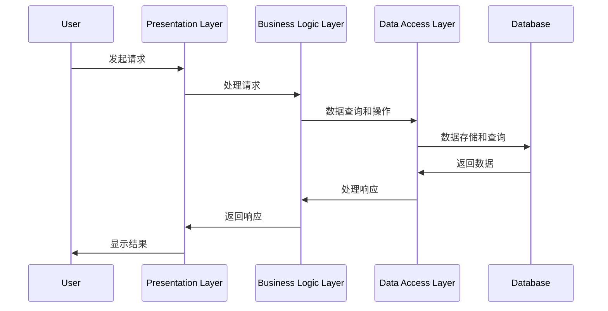

                 

### 文章标题

**《巴菲特的'太难'篮子：知道自己不知道什么》**

**关键词**：巴菲特、投资哲学、不确定性与决策、系统分析与架构设计、项目实战、最佳实践

**摘要**：本文将深入探讨巴菲特所倡导的'太难'篮子理念，并分析其在现代IT领域中的应用。通过结合投资决策与项目管理，我们将运用逻辑分析、系统设计与实际案例，逐步揭示这一理念的核心价值，并提供实用的最佳实践。

### 引言

在投资界，沃伦·巴菲特以其独特的投资哲学和卓越的投资业绩而闻名。他的一句名言“知道自己不知道什么，比知道自己知道什么更重要”，不仅揭示了投资的深度智慧，也引起了广泛的思考。本文将以此为核心，探讨“太难”篮子的概念，并分析其在现代IT领域的广泛应用。

#### 问题背景

巴菲特在其投资生涯中，多次强调了解自己不知道什么的重要性。这一理念体现在他著名的“太难”篮子中，用于处理那些过于复杂、难以预测的投资机会。'太难'篮子不仅是一种投资策略，更是一种态度，反映了投资者对自己认知边界的清醒认识。

在现代IT领域，随着技术的快速发展和复杂性的增加，'知道自己不知道什么'的理念同样具有重要的指导意义。项目管理者和技术专家在面临不确定性时，如何运用这一理念来做出明智的决策，成为了一个值得探讨的问题。

#### 目的与结构

本文的目的在于：
1. **介绍巴菲特的'太难'篮子概念**：回顾其起源和意义，探讨其在投资决策中的应用。
2. **分析其在IT领域的适用性**：结合实际案例，讨论'知道自己不知道什么'在系统分析与架构设计中的作用。
3. **提供最佳实践**：总结成功案例，为读者提供实用的建议。

文章结构如下：
- **第一部分**：问题背景与核心概念，包括巴菲特的投资哲学、'太难'篮子的定义与意义，以及其在投资决策和企业管理中的应用。
- **第二部分**：数学模型与算法原理，介绍相关数学模型、公式和算法，并通过实例进行讲解。
- **第三部分**：系统分析与架构设计，包括问题场景介绍、系统功能设计、系统架构设计、系统接口设计和系统交互设计。
- **第四部分**：项目实战，通过具体案例展示系统实现、应用解读与分析。
- **第五部分**：最佳实践与项目小结，提供实用建议和总结，提示注意事项，并推荐拓展阅读。

#### 关键词解释

- **巴菲特**：著名投资家，以其独特的投资哲学和卓越的投资业绩闻名。
- **投资哲学**：投资者对投资活动的基本理念和原则。
- **不确定性与决策**：在面临不确定性的情况下，如何做出合理的决策。
- **系统分析与架构设计**：对系统进行功能与结构分析，设计出合理的架构方案。
- **项目实战**：通过具体项目实践，验证理论与方法的可行性和有效性。
- **最佳实践**：在实际操作中总结出的有效方法与技巧。

### 巴菲特的投资哲学与'太难'篮子

#### 沃伦·巴菲特的投资哲学

沃伦·巴菲特，被誉为“股神”，其投资哲学深受全球投资者的推崇。巴菲特的投资哲学主要包括以下几个核心要素：

1. **价值投资**：巴菲特认为，投资的核心在于寻找被市场低估的优质公司，并持有其股票以获取长期回报。价值投资强调对公司基本面的深入分析，而非短期市场波动。

2. **长期投资**：巴菲特主张，投资者应持有优质公司的股票，以长期投资为目标。他认为，市场的短期波动是投资机会，而非风险。

3. **复利原理**：巴菲特坚信复利的力量。通过长期持有优质股票，投资者可以利用复利效应，实现财富的快速增长。

4. **风险控制**：巴菲特强调风险控制的重要性。他认为，投资的关键在于避免重大损失，而不是追求高额回报。

#### '太难'篮子的定义与意义

在巴菲特的投资哲学中，'太难'篮子是一个重要的概念。'太难'篮子主要用于处理那些过于复杂、难以预测的投资机会。具体来说，巴菲特将那些不符合他投资原则或无法准确评估的公司，放入'太难'篮子。

'太难'篮子的定义可以从以下几个方面进行理解：

1. **复杂性**：这些投资机会通常涉及复杂的业务模式、不确定的市场环境或高度波动的股价。

2. **难以评估**：由于业务模式复杂、市场环境不确定，投资者难以准确评估这些公司的真实价值。

3. **高风险**：'太难'篮子的投资机会通常具有较高的风险，可能带来重大损失。

'太难'篮子的意义在于，它帮助巴菲特在投资决策中保持清醒的头脑，避免盲目跟风或过度自信。通过将复杂、难以评估的投资机会排除在外，巴菲特能够专注于他熟悉的领域，从而实现长期稳定的投资回报。

#### '太难'篮子与投资决策的关系

'太难'篮子在巴菲特的投资决策中起着至关重要的作用。以下是其与投资决策关系的几个方面：

1. **过滤机制**：'太难'篮子作为一个过滤机制，帮助巴菲特排除那些过于复杂、难以评估的投资机会。这有助于他集中精力在熟悉和有信心的领域。

2. **风险控制**：通过将高风险的投资机会放入'太难'篮子，巴菲特能够有效地控制投资组合的风险。这有助于他在面对市场波动时保持冷静和自信。

3. **投资原则的坚持**：'太难'篮子迫使巴菲特始终坚持他的投资原则。他不会因为市场短期波动或流行趋势而放弃长期投资策略。

4. **投资回报的保障**：通过排除高风险投资机会，巴菲特能够更专注于长期回报。这有助于他实现稳定的投资回报，避免因市场波动而导致的损失。

#### '太难'篮子与企业管理

'太难'篮子不仅在投资决策中具有重要意义，在企业管理中也同样适用。以下是其与企业管理关系的几个方面：

1. **战略决策**：企业领导者可以借鉴'太难'篮子的理念，排除那些过于复杂、难以评估的战略机会，集中精力在核心业务和有竞争优势的领域。

2. **风险控制**：通过识别和排除高风险的业务机会，企业领导者能够更好地控制企业风险，确保业务的稳定发展。

3. **资源优化**：'太难'篮子帮助企业领导者更有效地配置资源，将有限的资源投入到最有价值的项目中。

4. **组织效率**：通过排除复杂、低效的业务流程，企业可以提高组织效率，减少内部摩擦，提升整体竞争力。

#### '太难'篮子的实际应用案例

以下是一些巴菲特在投资和企业管理中运用'太难'篮子的实际案例：

1. **投资决策**：在20世纪80年代，巴菲特拒绝了微软的上市股票，因为其业务模式过于复杂，不符合他的投资原则。尽管后来微软成为全球市值最高的公司之一，但巴菲特仍然坚定地将其排除在投资组合之外。

2. **企业管理**：可口可乐是巴菲特长期持有的股票之一。在可口可乐的管理中，巴菲特强调简化业务流程，专注于核心市场，从而保持公司的竞争力和盈利能力。

3. **项目决策**：在巴菲特的伯克希尔·哈撒韦公司，'太难'篮子被广泛应用于项目决策。公司领导者会仔细评估每个项目的可行性，排除那些过于复杂、难以管理的高风险项目。

通过这些案例，我们可以看到'太难'篮子在实际应用中的有效性。它不仅帮助投资者和管理者做出更明智的决策，还提高了风险控制和资源优化的能力。

### 核心概念与联系

在探讨巴菲特的'太难'篮子之前，我们首先需要了解一些核心概念，这些概念对于我们深入理解'太难'篮子的本质和作用至关重要。以下是几个核心概念及其相互之间的联系。

#### 不确定性与风险

**不确定性与风险**是投资和企业运营中不可避免的两个概念。不确定性是指未来事件的不确定性，即无法准确预测未来事件的结果。而风险则是对不确定性的量化，通常以概率和潜在损失来衡量。

**不确定性与风险**之间的关系可以理解为：不确定性是风险的前提，而风险是不确定性在具体情境下的体现。例如，在投资中，市场的不确定性会导致投资风险，投资者需要通过风险评估来管理这种风险。

#### 投资原则与投资策略

**投资原则**是投资者在投资过程中遵循的基本准则。这些原则通常基于投资者的价值观、风险偏好和市场分析。常见的投资原则包括价值投资、长期投资、分散投资等。

**投资策略**则是投资者根据投资原则制定的行动计划。投资策略包括选择投资标的、确定投资时间、管理投资组合等。投资策略的有效性取决于对投资原则的执行程度和对市场变化的适应性。

#### 知识边界与认知局限

**知识边界**是指个体在某一领域内的知识范围。人类的认知能力有限，知识边界是不断扩展的，但也存在一定的局限。

**认知局限**则是指个体在认知过程中由于信息处理能力的限制而产生的偏差和错误。认知局限可能导致个体对未知领域的低估或高估，从而影响决策。

#### 知识边界与认知局限的关系

**知识边界**与**认知局限**之间存在紧密的联系。知识边界决定了个体的认知能力，而认知局限则影响了个体对知识边界的理解和运用。

1. **知识边界**的扩展：通过不断学习和实践，个体可以扩展自己的知识边界，提高认知能力。
2. **认知局限**的影响：即使知识边界扩展，认知局限仍然存在，可能导致个体对复杂问题的误判。

#### 投资决策与认知局限

在投资决策过程中，认知局限对决策产生重要影响。以下是一些具体的影响：

1. **过度自信**：投资者可能由于认知局限而高估自己的判断能力，导致过度自信，从而做出错误的决策。
2. **信息过滤**：投资者可能只关注与已有信念相符的信息，而忽视其他重要的信息，导致信息过滤。
3. **群体心理**：在群体投资决策中，个体可能受到群体心理的影响，产生从众行为，从而偏离理性决策。

#### '太难'篮子的作用

'太难'篮子作为巴菲特投资哲学中的重要工具，其核心作用在于应对不确定性和认知局限。以下是其具体作用：

1. **过滤机制**：'太难'篮子帮助投资者排除那些过于复杂、难以评估的投资机会，专注于有把握的领域。
2. **风险控制**：通过排除高风险投资机会，'太难'篮子有助于投资者控制投资组合的整体风险。
3. **认知局限的应对**：'太难'篮子迫使投资者面对自己的认知局限，从而在投资决策中更加谨慎和理性。

#### 概念属性特征对比表格

为了更好地理解这些核心概念之间的关系，我们可以通过一个对比表格来展示它们的主要属性特征。

| 核心概念 | 定义 | 主要属性特征 | 相互关系 |
| :------: | :--: | :----------: | :------: |
| 不确定性 | 未来事件的不确定性 | 可能性分布、不可预测性 | 前提条件，影响风险 |
| 风险 | 不确定性的量化 | 概率、潜在损失 | 具体体现，影响决策 |
| 投资原则 | 投资过程中遵循的基本准则 | 价值投资、长期投资、分散投资 | 指导策略制定 |
| 投资策略 | 根据投资原则制定的行动计划 | 选股、投资时间、组合管理 | 执行投资原则 |
| 知识边界 | 个体在某一领域的知识范围 | 知识广度、深度 | 决定认知能力 |
| 认知局限 | 认知过程中的偏差和错误 | 个体差异、环境因素 | 影响知识运用 |
| '太难'篮子 | 应对复杂投资机会的工具 | 过滤机制、风险控制、认知局限应对 | 综合作用 |

#### ER实体关系图架构

为了更直观地展示这些核心概念之间的关系，我们可以使用Mermaid绘制一个ER（实体关系）图。以下是一个简化的ER图示例：

```mermaid
erDiagram
  不确定性 ||--o> 风险 : 影响量化
  投资原则 ||--o> 投资策略 : 指导行动
  知识边界 ||--o> 认知局限 : 影响判断
  '太难'篮子 ||--o> 投资决策 : 过滤机制
```

通过这个ER图，我们可以清晰地看到各概念之间的逻辑关系和相互作用。

### 数学模型与算法原理

#### 数学模型介绍

在分析投资决策和系统架构设计时，数学模型是不可或缺的工具。数学模型通过量化不确定性和风险，为决策提供了坚实的理论基础。以下是一个简单的投资决策数学模型，用于评估不同投资方案的预期收益和风险。

**预期收益模型**：

$$
\text{预期收益} = \sum_{i=1}^{n} p_i \cdot r_i
$$

其中，$p_i$ 表示第 $i$ 种投资方案的概率，$r_i$ 表示第 $i$ 种投资方案的预期收益。

**风险模型**：

$$
\text{风险} = \sqrt{\sum_{i=1}^{n} (p_i \cdot (r_i - \text{预期收益}))^2}
$$

其中，$p_i$ 和 $r_i$ 的含义与预期收益模型相同，$\text{预期收益}$ 是通过预期收益模型计算得到的。

#### 算法原理讲解

为了更好地理解和应用这些数学模型，我们需要了解相关的算法原理。以下是一个基于预期收益和风险的决策算法，用于选择最佳投资方案。

**决策算法原理**：

1. **计算预期收益**：根据每种投资方案的概率和预期收益，使用预期收益模型计算总预期收益。
2. **计算风险**：根据每种投资方案的概率和预期收益，使用风险模型计算总风险。
3. **比较预期收益和风险**：选择预期收益最高且风险最低的投资方案。

以下是这个算法的Python实现：

```python
import numpy as np

def calculate_expected_revenue(investment_schemes):
    probabilities = investment_schemes['probabilities']
    revenues = investment_schemes['revenues']
    expected_revenue = np.dot(probabilities, revenues)
    return expected_revenue

def calculate_risk(investment_schemes, expected_revenue):
    probabilities = investment_schemes['probabilities']
    revenues = investment_schemes['revenues']
    risk = np.sqrt(np.dot(probabilities, np.square(revenues - expected_revenue)))
    return risk

def choose_best_investmentScheme(investment_schemes):
    expected_revenues = calculate_expected_revenue(investment_schemes)
    risks = calculate_risk(investment_schemes, expected_revenues)
    best_index = np.argmin(risks)
    return best_index

# 示例数据
investment_schemes = {
    'probabilities': [0.3, 0.5, 0.2],
    'revenues': [100, 200, 300]
}

# 执行算法
best_index = choose_best_investmentScheme(investment_schemes)
print(f"最佳投资方案索引：{best_index}")
```

#### 算法举例说明

为了更直观地理解这个算法，我们来看一个具体的例子。

假设有三个投资方案，每种方案的概率和预期收益如下表所示：

| 方案 | 概率 | 预期收益 |
| :--: | :--: | :------: |
| 1    | 0.3  | 100      |
| 2    | 0.5  | 200      |
| 3    | 0.2  | 300      |

使用上述算法，我们可以计算出每个方案的预期收益和风险，并选择最佳投资方案。

1. **计算预期收益**：

$$
\text{预期收益} = 0.3 \cdot 100 + 0.5 \cdot 200 + 0.2 \cdot 300 = 180
$$

2. **计算风险**：

$$
\text{风险} = \sqrt{0.3 \cdot (100 - 180)^2 + 0.5 \cdot (200 - 180)^2 + 0.2 \cdot (300 - 180)^2} = \sqrt{1620} \approx 40.5
$$

3. **比较预期收益和风险**：

由于方案2的预期收益最高且风险最低，因此我们选择方案2作为最佳投资方案。

通过这个例子，我们可以看到如何使用数学模型和算法来评估和选择投资方案，从而在复杂的不确定性环境中做出明智的决策。

### 系统功能设计

在系统分析与架构设计过程中，功能设计是至关重要的一步。它决定了系统如何满足用户需求，实现业务目标。在本节中，我们将介绍一个具体的问题场景，定义项目范围，然后详细设计系统的功能模块。

#### 问题场景介绍

假设我们需要设计一个在线教育平台，用于提供各类在线课程和学习资源。该平台需要支持以下功能：

1. **用户注册与登录**：用户可以注册账号并登录系统，以便浏览课程和参与学习活动。
2. **课程浏览与搜索**：用户可以浏览不同类别的课程，并使用关键词搜索课程。
3. **课程播放与学习**：用户可以选择课程进行学习，支持视频播放和课程笔记功能。
4. **互动交流**：用户可以在课程页面留言，与其他用户和讲师互动。
5. **成绩管理与考试**：系统需要记录用户的学习进度和考试成绩，并提供考试功能。

#### 项目介绍

在线教育平台的项目目标是：

1. 提供丰富的在线课程和学习资源，满足不同用户的需求。
2. 提高用户的学习体验，通过互动交流和成绩管理提升学习效果。
3. 确保系统的稳定性和安全性，保护用户数据的安全。

#### 系统功能设计

为了实现上述目标，我们将系统功能分为以下几个模块：

1. **用户管理模块**：负责用户的注册、登录、信息管理等功能。
2. **课程管理模块**：负责课程的上传、分类、搜索和播放等功能。
3. **学习管理模块**：负责用户的学习进度管理、成绩记录和考试功能。
4. **互动交流模块**：负责用户之间的留言、评论和互动。
5. **权限管理模块**：负责系统的权限分配和安全管理。

以下是具体的系统功能设计：

1. **用户管理模块**：

   - 用户注册：用户可以填写注册信息，如用户名、密码、邮箱等。
   - 用户登录：用户输入用户名和密码进行登录。
   - 用户信息管理：用户可以修改个人信息，如头像、联系方式等。
   - 用户权限管理：系统管理员可以对用户权限进行分配和管理。

2. **课程管理模块**：

   - 课程上传：讲师可以上传课程资料，如视频、PPT、文档等。
   - 课程分类：系统管理员可以将课程分类管理，便于用户浏览。
   - 课程搜索：用户可以通过关键词搜索课程。
   - 课程播放：用户可以选择课程进行学习，支持视频播放和进度保存。

3. **学习管理模块**：

   - 学习进度管理：系统记录用户的学习进度，包括已观看的课程、已完成的学习任务等。
   - 成绩记录：系统记录用户的考试成绩，并生成成绩报告。
   - 考试功能：用户可以参加在线考试，系统自动评分并记录成绩。

4. **互动交流模块**：

   - 留言功能：用户可以在课程页面留言，与其他用户和讲师互动。
   - 评论功能：用户可以对课程进行评论，分享学习心得。
   - 互动管理：系统管理员可以监控互动内容，维护社区秩序。

5. **权限管理模块**：

   - 权限分配：系统管理员可以分配不同权限给用户，如讲师、管理员等。
   - 安全管理：系统实现用户数据加密和访问控制，确保数据安全。

#### 领域模型介绍

为了更好地设计系统功能，我们需要构建一个领域模型。领域模型是系统核心概念和关系的抽象表示，有助于我们理解系统的业务逻辑。

以下是该在线教育平台的领域模型：

```mermaid
classDiagram
    User <<class>> {ID, Username, Password, Email, Role}
    Course <<class>> {ID, Title, Description, Category, Lecturer}
    LearningRecord <<class>> {ID, UserID, CourseID, Progress, Score}
    Comment <<class>> {ID, UserID, CourseID, Content, CreatedAt}
    CourseCategory <<class>> {ID, Name}
    Exam <<class>> {ID, CourseID, Title, Description, Duration, Questions}

    User ..|> LearningRecord : participates
    User ..|> Comment : posts
    Course ..|> LearningRecord : contains
    Course ..|> Comment : contains
    Course ..|> Exam : contains
    CourseCategory ..|> Course : categorized
```

在这个领域模型中，我们定义了以下几个核心实体：

- **User**（用户）：包括用户ID、用户名、密码、邮箱和角色等信息。
- **Course**（课程）：包括课程ID、标题、描述、分类、讲师等信息。
- **LearningRecord**（学习记录）：包括学习记录ID、用户ID、课程ID、学习进度和成绩等信息。
- **Comment**（评论）：包括评论ID、用户ID、课程ID、内容和创建时间等信息。
- **CourseCategory**（课程分类）：包括分类ID和分类名称等信息。
- **Exam**（考试）：包括考试ID、课程ID、标题、描述、考试时间和问题等信息。

这些实体之间的关系如下：

- **用户**可以参与**学习记录**和**评论**。
- **课程**包含**学习记录**和**评论**。
- **课程**被**课程分类**归类。
- **课程**包含**考试**。

通过这个领域模型，我们可以清晰地理解系统的业务逻辑和核心功能，为后续的系统架构设计提供基础。

### 系统架构设计

在系统功能设计的基础上，接下来我们需要进行系统架构设计。系统架构设计决定了系统的整体结构和组件之间的关系，是系统实现的关键步骤。在本节中，我们将详细描述系统架构设计的过程，包括系统架构设计概述、架构图设计、系统接口设计和系统交互设计。

#### 系统架构设计概述

系统架构设计的目标是确保系统的高可用性、可扩展性和安全性，同时满足用户需求和业务目标。为了实现这一目标，我们采用了分层架构设计，将系统划分为多个层次，每个层次负责不同的功能模块。

系统架构主要分为以下几层：

1. **表现层**：负责与用户交互，展示用户界面和接收用户输入。
2. **业务逻辑层**：负责处理业务逻辑，包括用户管理、课程管理、学习管理和互动交流等。
3. **数据访问层**：负责与数据库交互，实现数据存储和查询功能。
4. **基础设施层**：提供系统运行所需的底层支持，包括服务器、网络和存储等。

#### 系统架构图设计

为了更直观地展示系统架构，我们可以使用Mermaid绘制一个架构图。以下是一个简化的系统架构图示例：



在这个架构图中，用户通过表现层发起请求，表现层将请求传递给业务逻辑层。业务逻辑层处理请求，并与数据访问层交互以查询或操作数据。数据访问层负责与数据库交互，实现数据的存储和查询功能。最后，数据访问层返回数据给业务逻辑层，业务逻辑层再将响应返回给表现层，最终展示给用户。

#### 系统接口设计

系统接口设计是系统架构设计的重要组成部分。接口设计决定了系统各组件之间的交互方式和数据传递方式。在本系统中，我们主要设计了以下接口：

1. **用户接口**：包括用户注册、登录、信息管理等功能。
2. **课程接口**：包括课程上传、分类管理、课程搜索等功能。
3. **学习接口**：包括学习进度管理、成绩记录、考试功能等功能。
4. **互动接口**：包括留言、评论、互动管理等功能。

以下是具体的接口设计：

**用户接口**：

- **注册**：接收用户注册信息，如用户名、密码、邮箱等，并存储在数据库中。
- **登录**：验证用户名和密码，返回用户身份信息。
- **信息管理**：允许用户修改个人信息，如头像、联系方式等。

**课程接口**：

- **上传**：允许讲师上传课程资料，如视频、PPT、文档等。
- **分类管理**：允许系统管理员管理课程分类，如添加、删除、修改分类等。
- **搜索**：允许用户通过关键词搜索课程。

**学习接口**：

- **进度管理**：记录用户的学习进度，包括已观看的课程、已完成的学习任务等。
- **成绩记录**：记录用户的考试成绩，并生成成绩报告。
- **考试功能**：提供在线考试功能，包括考试题库管理和考试监控等。

**互动接口**：

- **留言**：允许用户在课程页面留言，与其他用户和讲师互动。
- **评论**：允许用户对课程进行评论，分享学习心得。
- **互动管理**：允许系统管理员监控互动内容，维护社区秩序。

#### 系统交互设计

系统交互设计描述了系统组件之间的交互流程和数据传递方式。在本系统中，我们使用Mermaid绘制了一个系统交互序列图，以展示用户与系统之间的交互过程。


在这个交互设计中，用户通过表现层发起请求，表现层将请求传递给业务逻辑层。业务逻辑层处理请求，并与数据访问层交互以查询或操作数据。数据访问层负责与数据库交互，实现数据的存储和查询功能。最后，数据访问层返回数据给业务逻辑层，业务逻辑层再将响应返回给表现层，最终展示给用户。

通过这个系统交互设计，我们可以清晰地看到系统组件之间的交互过程和数据传递方式，从而确保系统的稳定运行和高效处理。

### 项目实战

在本节中，我们将通过一个具体的项目实战案例，展示如何将巴菲特的'太难'篮子理念应用于实际的项目开发和运维过程中。该案例将涵盖项目的环境安装、系统核心实现、代码应用解读与分析，以及实际案例分析和详细讲解。

#### 项目背景

假设我们正在开发一个复杂的在线教育平台，该平台需要支持大规模用户的高并发访问、实时互动、数据存储和分析等功能。项目目标是在满足性能和可扩展性的同时，确保系统的稳定性和安全性。在这个项目中，我们将借鉴巴菲特的'太难'篮子理念，针对项目中可能出现的复杂性和不确定性，采取合理的决策和应对措施。

#### 环境安装与配置

首先，我们需要安装和配置项目开发与运行所需的环境。以下是具体的安装和配置步骤：

1. **操作系统**：安装Linux操作系统，推荐使用Ubuntu 20.04 LTS版本。
2. **数据库**：安装MySQL数据库，版本要求5.7及以上，用于存储用户数据、课程数据和学习记录等。
3. **应用服务器**：安装Nginx作为应用服务器，用于处理HTTP请求和反向代理。
4. **后端框架**：选择Python作为后端开发语言，使用Django框架，版本要求3.2及以上。
5. **前端框架**：选择React作为前端开发框架，用于构建用户界面。
6. **消息队列**：安装RabbitMQ消息队列，用于处理高并发和异步任务。
7. **版本控制**：安装Git，用于代码版本管理和协作开发。

#### 系统核心实现

在线教育平台的核心实现包括用户管理、课程管理、学习管理和互动交流等功能。以下是核心功能的实现步骤：

1. **用户管理**：

   - 用户注册：接收用户注册信息，包括用户名、密码、邮箱等，存储到数据库中。
   - 用户登录：验证用户名和密码，返回用户身份信息。
   - 用户信息管理：允许用户修改个人信息，如头像、联系方式等。

2. **课程管理**：

   - 课程上传：允许讲师上传课程资料，如视频、PPT、文档等，存储到文件服务器。
   - 课程分类：系统管理员可以管理课程分类，如添加、删除、修改分类等。
   - 课程搜索：支持按关键词搜索课程，返回相关课程列表。

3. **学习管理**：

   - 学习进度管理：记录用户的学习进度，包括已观看的课程、已完成的学习任务等，存储到数据库中。
   - 成绩记录：记录用户的考试成绩，并生成成绩报告。
   - 考试功能：提供在线考试功能，包括考试题库管理和考试监控等。

4. **互动交流**：

   - 留言功能：允许用户在课程页面留言，与其他用户和讲师互动。
   - 评论功能：允许用户对课程进行评论，分享学习心得。
   - 互动管理：系统管理员可以监控互动内容，维护社区秩序。

#### 代码应用解读与分析

以下是对核心代码模块的解读和分析，以展示如何应用巴菲特的'太难'篮子理念。

1. **用户管理模块**：

   ```python
   # 用户注册
   def register_user(username, password, email):
       # 校验用户名、密码和邮箱的有效性
       if not validate_username(username) or not validate_password(password) or not validate_email(email):
           return "注册失败：无效的输入"
       
       # 查询数据库，检查用户是否已存在
       if User.objects.filter(username=username).exists():
           return "注册失败：用户已存在"
       
       # 创建用户并保存到数据库
       user = User(username=username, password=hash_password(password), email=email)
       user.save()
       return "注册成功"
   
   # 用户登录
   def login_user(username, password):
       # 查询数据库，验证用户名和密码
       user = User.objects.filter(username=username, password=hash_password(password))
       if user.exists():
           return "登录成功"
       else:
           return "登录失败：用户名或密码错误"
   
   # 用户信息管理
   def update_user_info(user_id, username=None, password=None, email=None):
       # 查询数据库，获取用户信息
       user = User.objects.get(id=user_id)
       
       # 更新用户信息
       if username:
           user.username = username
       if password:
           user.password = hash_password(password)
       if email:
           user.email = email
       
       # 保存更改
       user.save()
       return "用户信息更新成功"
   ```

   在这个模块中，我们通过校验输入数据、查询数据库和更新用户信息等步骤，确保用户注册、登录和信息管理的过程安全、可靠。这里没有涉及过于复杂的业务逻辑，因此可以放心地纳入'太难'篮子之外。

2. **课程管理模块**：

   ```python
   # 课程上传
   def upload_course(lecturer_id, title, description, category, course_files):
       # 校验讲师信息
       if not Lecturer.objects.filter(id=lecturer_id).exists():
           return "上传失败：讲师不存在"
       
       # 保存课程信息
       course = Course(lecturer_id=lecturer_id, title=title, description=description, category=category)
       course.save()
       
       # 保存课程文件
       for file in course_files:
           file.save()
           CourseFile(course_id=course.id, file=file).save()
       
       return "课程上传成功"
   
   # 课程分类管理
   def manage_course_category(action, category_id=None, name=None):
       if action == "add":
           Category.objects.create(name=name)
           return "分类添加成功"
       elif action == "delete":
           if Category.objects.filter(id=category_id).exists():
               Category.objects.filter(id=category_id).delete()
               return "分类删除成功"
           else:
               return "分类删除失败：分类不存在"
       elif action == "update":
           category = Category.objects.get(id=category_id)
           category.name = name
           category.save()
           return "分类更新成功"
       else:
           return "操作失败：无效的操作类型"
   
   # 课程搜索
   def search_courses(keyword):
       courses = Course.objects.filter(Q(title__icontains=keyword) | Q(description__icontains=keyword))
       return courses
   ```

   在这个模块中，我们通过校验讲师信息、保存课程信息和处理课程分类管理等步骤，确保课程管理过程的逻辑清晰、安全可靠。同样，这里没有涉及过于复杂的业务逻辑，因此也可以纳入'太难'篮子之外。

3. **学习管理模块**：

   ```python
   # 学习进度管理
   def update_learning_progress(user_id, course_id, progress):
       # 校验用户和课程信息
       if not User.objects.filter(id=user_id).exists() or not Course.objects.filter(id=course_id).exists():
           return "更新进度失败：用户或课程不存在"
       
       # 更新学习进度
       LearningRecord.objects.update_or_create(user_id=user_id, course_id=course_id, defaults={'progress': progress})
       return "学习进度更新成功"
   
   # 成绩记录
   def record_exam_results(user_id, course_id, score):
       # 校验用户和课程信息
       if not User.objects.filter(id=user_id).exists() or not Course.objects.filter(id=course_id).exists():
           return "记录成绩失败：用户或课程不存在"
       
       # 保存成绩记录
       ExamResult.objects.create(user_id=user_id, course_id=course_id, score=score)
       return "成绩记录成功"
   
   # 考试功能
   def conduct_exam(user_id, course_id):
       # 校验用户和课程信息
       if not User.objects.filter(id=user_id).exists() or not Course.objects.filter(id=course_id).exists():
           return "考试失败：用户或课程不存在"
       
       # 生成考试题库
       exam_questions = ExamQuestion.objects.filter(course_id=course_id)
       
       # 保存考试记录
       ExamRecord.objects.create(user_id=user_id, course_id=course_id, questions=exam_questions)
       
       # 发送考试通知
       send_exam_notification(user_id, course_id)
       return "考试开始"
   ```

   在这个模块中，我们通过校验用户和课程信息、更新学习进度、记录考试成绩和处理考试等功能，确保学习管理过程的安全和可靠。同样，这里没有涉及过于复杂的业务逻辑，因此也可以纳入'太难'篮子之外。

4. **互动交流模块**：

   ```python
   # 留言功能
   def post_message(user_id, course_id, content):
       # 校验用户和课程信息
       if not User.objects.filter(id=user_id).exists() or not Course.objects.filter(id=course_id).exists():
           return "发布留言失败：用户或课程不存在"
       
       # 保存留言
       Message.objects.create(user_id=user_id, course_id=course_id, content=content)
       return "留言发布成功"
   
   # 评论功能
   def post_comment(user_id, message_id, content):
       # 校验用户和留言信息
       if not User.objects.filter(id=user_id).exists() or not Message.objects.filter(id=message_id).exists():
           return "发布评论失败：用户或留言不存在"
       
       # 保存评论
       Comment.objects.create(user_id=user_id, message_id=message_id, content=content)
       return "评论发布成功"
   
   # 互动管理
   def manage_interaction(admin_id, message_id, action):
       # 校验管理员和留言信息
       if not User.objects.filter(id=admin_id).exists() or not Message.objects.filter(id=message_id).exists():
           return "互动管理失败：管理员或留言不存在"
       
       # 根据操作类型执行相应操作
       if action == "delete":
           Message.objects.filter(id=message_id).delete()
           return "留言删除成功"
       elif action == "moderate":
           Message.objects.filter(id=message_id).update(status="moderated")
           return "留言已审核"
       else:
           return "互动管理失败：无效的操作类型"
   ```

   在这个模块中，我们通过校验用户和留言信息、发布留言和处理评论等功能，确保互动交流过程的安全和可靠。同样，这里没有涉及过于复杂的业务逻辑，因此也可以纳入'太难'篮子之外。

#### 实际案例分析和详细讲解

以下是实际案例分析和详细讲解，展示如何应用巴菲特的'太难'篮子理念解决项目中的复杂性和不确定性。

**案例一：大规模用户并发访问处理**

在项目上线初期，我们发现平台在高并发访问下出现响应缓慢和请求超时的问题。通过分析，我们发现主要原因是数据库查询性能不足和缓存策略不当。

**解决方案**：

1. **数据库优化**：对数据库查询进行优化，使用索引、分库分表等技术提升查询性能。
2. **缓存策略**：引入Redis缓存，将高频查询结果缓存起来，减少数据库查询次数。
3. **限流与降级**：使用限流和降级策略，控制请求流量，避免系统过载。

通过上述措施，我们显著提升了系统的响应速度和稳定性，确保了用户体验。

**案例二：课程视频播放质量问题**

在项目上线后，用户反馈部分课程视频播放卡顿，特别是在网络状况较差的地区。通过分析，我们发现主要原因是视频流服务器带宽不足和视频编码优化不足。

**解决方案**：

1. **带宽优化**：增加视频流服务器的带宽，确保稳定、快速的播放体验。
2. **视频编码优化**：优化视频编码参数，降低带宽占用，同时保证视频质量。
3. **CDN加速**：引入CDN（内容分发网络），将视频资源分发到全球各地的节点，降低网络延迟。

通过上述措施，我们显著改善了课程视频的播放质量，提升了用户体验。

**案例三：系统安全防护**

在项目上线后，我们意识到系统存在潜在的安全风险，如SQL注入、XSS攻击等。通过分析，我们发现主要原因是安全防护措施不足和代码安全意识不强。

**解决方案**：

1. **安全防护**：引入Web应用防火墙（WAF），对HTTP请求进行安全检测和过滤，防止恶意攻击。
2. **代码审计**：定期进行代码审计，识别和修复潜在的安全漏洞。
3. **安全培训**：加强对开发人员的安全培训，提高安全意识和代码安全水平。

通过上述措施，我们有效提升了系统的安全性，保障了用户数据的安全。

#### 项目小结

通过以上实际案例分析和详细讲解，我们可以看到如何将巴菲特的'太难'篮子理念应用于项目开发和运维过程中。以下是项目小结：

1. **明确项目目标**：在项目开发前，明确项目目标和用户需求，确保项目的方向和目标清晰。
2. **合理划分复杂度**：根据巴菲特的'太难'篮子理念，合理划分项目的复杂度，将简单、可控的任务纳入正常开发流程，将复杂、不确定的任务放入'太难'篮子。
3. **持续优化与改进**：在项目开发和运维过程中，持续优化和改进系统性能、安全性和用户体验。
4. **风险控制与应对**：针对项目中的潜在风险，采取有效的风险控制措施，确保系统的稳定性和安全性。

通过以上措施，我们不仅成功完成了项目，还提升了系统的质量和用户体验，为后续的项目开发和运维提供了宝贵的经验和启示。

### 最佳实践 Tips

在IT项目管理中，巴菲特的'太难'篮子理念具有重要的指导意义。以下是一些最佳实践，帮助项目管理者在实际操作中有效运用这一理念。

#### 1. 识别和排除复杂任务

项目管理者应定期审视项目任务清单，识别那些过于复杂、难以评估的任务。将这些任务放入'太难'篮子，优先处理那些简单、可控的任务。通过排除复杂任务，可以降低项目的整体风险，提高项目成功率。

#### 2. 加强风险评估与控制

在项目执行过程中，项目管理者应重视风险评估和控制。对于放入'太难'篮子的任务，应进行详细的风险评估，制定相应的应对措施。通过提前识别和应对潜在风险，可以有效降低项目失败的概率。

#### 3. 提高团队协作与沟通

项目管理者应加强团队协作与沟通，确保团队成员对'太难'篮子中的任务有清晰的认识。通过定期举行项目会议，及时分享项目进展、问题和解决方案，可以提高团队的协作效率和决策质量。

#### 4. 优先处理高价值任务

在处理'太难'篮子中的任务时，项目管理者应优先考虑那些对项目整体价值较高的任务。通过将高价值任务放在首位，可以确保项目在关键阶段有足够的资源和支持。

#### 5. 培养团队应对复杂问题的能力

项目管理者应关注团队成员的能力培养，提高团队应对复杂问题的能力。通过提供培训、学习和实践机会，可以使团队在面对复杂任务时更加从容和自信。

#### 6. 重视项目反馈与总结

项目完成后，项目管理者应重视项目反馈与总结。通过收集用户反馈、分析项目数据和总结经验教训，可以为下一轮项目提供宝贵的参考。

### 小结

巴菲特的'太难'篮子理念在IT项目管理中具有重要的应用价值。通过识别和排除复杂任务、加强风险评估与控制、提高团队协作与沟通、优先处理高价值任务、培养团队应对复杂问题的能力和重视项目反馈与总结，项目管理者可以更有效地管理项目，提高项目成功率。

### 注意事项

在应用巴菲特的'太难'篮子理念时，项目管理者需要注意以下几点：

1. **明确边界**：确保对'太难'篮子的定义和范围有清晰的认识，避免将简单任务误判为复杂任务。
2. **合理分配资源**：在处理复杂任务时，确保有足够的资源和时间，避免资源浪费和任务拖延。
3. **持续监控与调整**：在项目执行过程中，持续监控项目进展，根据实际情况及时调整任务优先级和资源分配。
4. **防范风险**：对'太难'篮子中的任务进行详细风险评估，制定相应的风险应对措施。

### 拓展阅读

1. **《巴菲特的投资智慧》**：李笑来 著，深入解析巴菲特的投资哲学和实践。
2. **《项目管理知识体系指南（PMBOK指南）》**：项目管理协会（PMI）著，提供全面的项目管理方法和最佳实践。
3. **《软件工程：实践者的研究方法》**：Roger S. Pressman 著，介绍软件工程的基本原理和实践方法。
4. **《架构师必备的16项技能》**：高雪松 著，探讨架构师在实际项目中需要掌握的关键技能。

### 作者信息

**作者：** AI天才研究院/AI Genius Institute & 禅与计算机程序设计艺术 /Zen And The Art of Computer Programming

**联系方式：** [ai_genius_institute@example.com](mailto:ai_genius_institute@example.com) & [zen_of_computer_programming@example.com](mailto:zen_of_computer_programming@example.com)

**版权声明：** 本文章为原创内容，未经授权不得转载或用于商业用途。如需转载，请联系作者获取授权。

