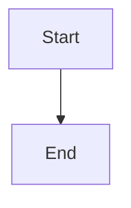
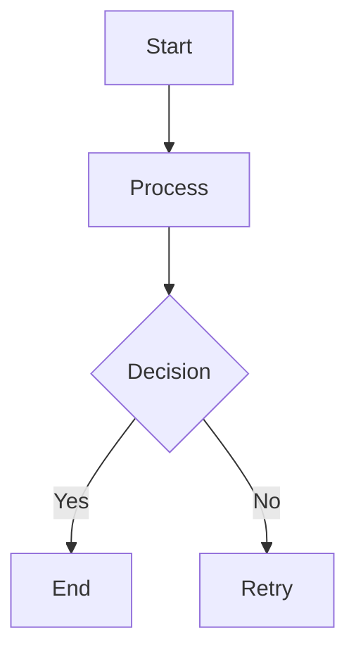
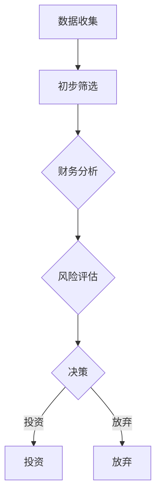

                 


## 巴菲特的'烟蒂'投资：从不良资产中发现价值

### 关键词

- 巴菲特
- 投资策略
- 烟蒂投资
- 不良资产
- 价值发现

### 摘要

本文以巴菲特的“烟蒂”投资策略为核心，深入探讨其在不良资产中的运用。通过逐步分析，我们将理解烟蒂投资的定义、识别与评估方法，并分析典型案例，从而展现如何在复杂市场中寻找隐藏的价值。文章还将讨论该策略的局限性及风险控制措施，为投资者提供有益的借鉴。

---

## 第一部分：投资理论背景

### 1.1 投资哲学的基石

**核心概念术语说明**：

- **投资哲学**：投资者对于投资决策的基本理念和原则。
- **价值投资**：一种以长期持有优质公司股票为目标的投资策略。
- **烟蒂投资**：从低估值或不良资产中寻找潜在高回报的投资策略。

**问题背景**：

在金融市场中，投资者面临多种投资策略选择，如何选择合适的方法来发现价值是一个重要问题。巴菲特的投资哲学强调长期投资和价值投资，他的“烟蒂”投资策略则是从不良资产中寻找价值的一种实践。

**问题描述**：

巴菲特的“烟蒂”投资策略是什么？它是如何运用于不良资产市场的？

**问题解决**：

**烟蒂投资**是指以低价购买那些市场暂时不被看好的资产，等待市场重新评估其价值时获取利润。巴菲特通过深入分析公司的基本面和潜在价值，能够识别出这些“烟蒂”资产。

**边界与外延**：

烟蒂投资不仅仅局限于股票市场，还可以应用于房地产、债券等其他资产类别。

**概念结构与核心要素组成**：

- **价值投资原则**：寻找那些被低估的公司股票。
- **烟蒂投资的策略特点**：低风险、高回报，但需耐心等待。
- **识别与评估**：通过财务指标、市场趋势等手段识别不良资产。

### 1.2 烟蒂投资的起源与发展

**核心概念与联系**：

**烟蒂投资的起源**：

20世纪30年代，价值投资之父本杰明·格雷厄姆提出了烟蒂投资的概念。他主张通过购买廉价股票来获取潜在的高回报。

**概念属性特征对比表格**：

| 特征         | 价值投资           | 烟蒂投资           |
| ------------ | ------------------ | ------------------ |
| **投资目标** | 长期持有优质公司   | 低估值或不良资产   |
| **投资时间** | 长期               | 短期至长期         |
| **风险**     | 较低               | 较高，但回报可能更高 |

**ER实体关系图架构的 Mermaid 流程图**：

```mermaid
erDiagram
    Company ||--|{ Investor }
    Stock <<|-- StockMarket
    StockMarket ||--|{ Analyst }
```

### 1.3 不良资产市场概况

**核心概念与联系**：

**不良资产市场**：

不良资产市场是专门处理非正常市场条件下资产的交易市场，这些资产可能包括银行的不良贷款、企业的负债等。

**市场机会与风险**：

**市场机会**：

- **价格低估**：不良资产在市场低谷时可能被低估。
- **价值重估**：随着市场好转，不良资产的价值可能得到重估。

**市场风险**：

- **市场波动**：不良资产市场波动性较大。
- **流动性风险**：不良资产可能难以迅速出售。

**财务评估指标**：

- **资产回报率**：衡量资产盈利能力。
- **负债比率**：衡量企业负债程度。

**管理评估指标**：

- **管理层能力**：衡量管理团队的执行力。
- **运营效率**：衡量企业的运营状况。

---

## 第二部分：巴菲特投资理念深度分析

### 2.1 价值投资的本质

**核心概念与联系**：

**价值投资**：

价值投资是一种以公司的内在价值为依据的投资策略，即投资者通过购买价格低于公司内在价值的股票来获取回报。

**概念属性特征对比表格**：

| 特征         | 价值投资           | 烟蒂投资           |
| ------------ | ------------------ | ------------------ |
| **投资目标** | 长期持有优质公司   | 低估值或不良资产   |
| **投资时间** | 长期               | 短期至长期         |
| **风险**     | 较低               | 较高，但回报可能更高 |

**ER实体关系图架构的 Mermaid 流程图**：

```mermaid
erDiagram
    Company ||--|{ Investor }
    Stock <<|-- StockMarket
    StockMarket ||--|{ Analyst }
```

### 2.2 烟蒂投资的独特之处

**核心概念与联系**：

**烟蒂投资**：

烟蒂投资是一种通过购买价格极低的资产（类似烟蒂），等待市场重新评估其价值时获得回报的投资策略。

**概念属性特征对比表格**：

| 特征         | 价值投资           | 烟蒂投资           |
| ------------ | ------------------ | ------------------ |
| **投资目标** | 长期持有优质公司   | 低估值或不良资产   |
| **投资时间** | 长期               | 短期至长期         |
| **风险**     | 较低               | 较高，但回报可能更高 |

**ER实体关系图架构的 Mermaid 流程图**：

```mermaid
erDiagram
    Company ||--|{ Investor }
    Stock <<|-- StockMarket
    StockMarket ||--|{ Analyst }
```

### 2.3 巴菲特对不良资产的洞察

**核心概念与联系**：

**不良资产**：

不良资产是指那些由于各种原因而价格低于其内在价值的资产。

**巴菲特对不良资产的洞察**：

巴菲特通过深入分析公司的基本面和潜在价值，能够识别出那些被市场低估的不良资产。

**概念属性特征对比表格**：

| 特征         | 价值投资           | 烟蒂投资           |
| ------------ | ------------------ | ------------------ |
| **投资目标** | 长期持有优质公司   | 低估值或不良资产   |
| **投资时间** | 长期               | 短期至长期         |
| **风险**     | 较低               | 较高，但回报可能更高 |

**ER实体关系图架构的 Mermaid 流程图**：

```mermaid
erDiagram
    Company ||--|{ Investor }
    Stock <<|-- StockMarket
    StockMarket ||--|{ Analyst }
```

---

## 第三部分：识别与评估不良资产

### 3.1 不良资产的识别方法

**核心概念与联系**：

**识别方法**：

通过财务指标、市场趋势等手段识别不良资产。

**核心概念与联系**：

- **财务指标**：如资产回报率、负债比率等。
- **市场趋势**：如市场低谷时的资产价格。

**概念属性特征对比表格**：

| 特征         | 价值投资           | 烟蒂投资           |
| ------------ | ------------------ | ------------------ |
| **投资目标** | 长期持有优质公司   | 低估值或不良资产   |
| **投资时间** | 长期               | 短期至长期         |
| **风险**     | 较低               | 较高，但回报可能更高 |

**ER实体关系图架构的 Mermaid 流程图**：

```mermaid
erDiagram
    Company ||--|{ Investor }
    Stock <<|-- StockMarket
    StockMarket ||--|{ Analyst }
```

### 3.2 不良资产的评估指标

**核心概念与联系**：

**评估指标**：

通过财务指标、市场趋势等手段评估不良资产。

**核心概念与联系**：

- **财务指标**：如资产回报率、负债比率等。
- **市场趋势**：如市场低谷时的资产价格。

**概念属性特征对比表格**：

| 特征         | 价值投资           | 烟蒂投资           |
| ------------ | ------------------ | ------------------ |
| **投资目标** | 长期持有优质公司   | 低估值或不良资产   |
| **投资时间** | 长期               | 短期至长期         |
| **风险**     | 较低               | 较高，但回报可能更高 |

**ER实体关系图架构的 Mermaid 流程图**：

```mermaid
erDiagram
    Company ||--|{ Investor }
    Stock <<|-- StockMarket
    StockMarket ||--|{ Analyst }
```

### 3.3 不良资产的投资策略

**核心概念与联系**：

**投资策略**：

通过分析不良资产的市场前景、公司基本面等，制定合适的投资策略。

**核心概念与联系**：

- **市场前景**：如行业趋势、市场需求等。
- **公司基本面**：如盈利能力、管理层能力等。

**概念属性特征对比表格**：

| 特征         | 价值投资           | 烟蒂投资           |
| ------------ | ------------------ | ------------------ |
| **投资目标** | 长期持有优质公司   | 低估值或不良资产   |
| **投资时间** | 长期               | 短期至长期         |
| **风险**     | 较低               | 较高，但回报可能更高 |

**ER实体关系图架构的 Mermaid 流程图**：

```mermaid
erDiagram
    Company ||--|{ Investor }
    Stock <<|-- StockMarket
    StockMarket ||--|{ Analyst }
```

---

## 第四部分：不良资产转化的案例研究

### 4.1 案例一：巴菲特如何拯救濒临破产的公司

**案例背景**：

**案例背景**：

1990年代，巴菲特投资于可口可乐公司，通过一系列操作，成功地帮助公司摆脱了财务困境，实现了价值重估。

**投资决策过程**：

**投资决策过程**：

- **市场分析**：巴菲特通过深入分析可口可乐的市场地位和行业趋势，确定其具备长期投资价值。
- **财务评估**：巴菲特对可口可乐的财务状况进行了详细评估，发现其存在低估现象。
- **决策实施**：巴菲特通过购买大量可口可乐股票，实施投资决策。

**案例结果分析**：

**案例结果分析**：

巴菲特的投资决策最终取得了巨大的成功，可口可乐公司的股价在几年后大幅上涨，实现了价值重估。

---

### 4.2 案例二：不良资产的重组与价值创造

**案例背景**：

**案例背景**：

2008年金融危机期间，巴菲特投资于美国银行，通过重组和改善管理，使该行从不良资产中恢复并实现价值增长。

**投资决策过程**：

**投资决策过程**：

- **市场分析**：巴菲特通过分析金融危机带来的市场机会，确定投资美国银行的可能性。
- **财务评估**：巴菲特对美国银行的财务状况进行了全面评估，发现其存在低估现象。
- **决策实施**：巴菲特通过购买大量美国银行股票，参与其重组和管理改善。

**案例结果分析**：

**案例结果分析**：

巴菲特的投资策略在美国银行身上得到了验证，该行在几年后逐渐恢复，并在市场好转时实现了价值增长。

---

## 第五部分：投资策略的实际应用

### 5.1 投资策略的选择与运用

**核心概念与联系**：

**投资策略**：

投资者需要根据市场环境和自身风险承受能力选择合适的投资策略。

**核心概念与联系**：

- **市场环境**：如经济周期、行业趋势等。
- **风险承受能力**：投资者对风险的敏感度。

**概念属性特征对比表格**：

| 特征         | 价值投资           | 烟蒂投资           |
| ------------ | ------------------ | ------------------ |
| **投资目标** | 长期持有优质公司   | 低估值或不良资产   |
| **投资时间** | 长期               | 短期至长期         |
| **风险**     | 较低               | 较高，但回报可能更高 |

**ER实体关系图架构的 Mermaid 流程图**：

```mermaid
erDiagram
    MarketEnvironment ||--|{ InvestorStrategy }
    IndustryTrend <<|-- MarketEnvironment
    RiskTolerance <<|-- InvestorStrategy
```

### 5.2 投资案例分析

**核心概念与联系**：

**投资案例分析**：

通过具体案例分析，展示如何运用烟蒂投资策略在不良资产市场中取得成功。

**核心概念与联系**：

- **案例背景**：如市场环境、公司状况等。
- **投资策略**：如市场分析、财务评估等。

**概念属性特征对比表格**：

| 特征         | 价值投资           | 烟蒂投资           |
| ------------ | ------------------ | ------------------ |
| **投资目标** | 长期持有优质公司   | 低估值或不良资产   |
| **投资时间** | 长期               | 短期至长期         |
| **风险**     | 较低               | 较高，但回报可能更高 |

**ER实体关系图架构的 Mermaid 流程图**：

```mermaid
erDiagram
    CaseBackground ||--|{ InvestmentStrategy }
    MarketSituation <<|-- CaseBackground
    CompanyCondition <<|-- CaseBackground
```

---

## 第六部分：投资策略的局限性与风险控制

### 6.1 烟蒂投资的局限性

**核心概念与联系**：

**局限性**：

烟蒂投资虽然能够带来高回报，但也存在一些局限性。

**核心概念与联系**：

- **市场波动**：烟蒂投资面临较大的市场波动风险。
- **信息不对称**：投资者可能无法全面了解不良资产的真实情况。

**概念属性特征对比表格**：

| 特征         | 价值投资           | 烟蒂投资           |
| ------------ | ------------------ | ------------------ |
| **投资目标** | 长期持有优质公司   | 低估值或不良资产   |
| **投资时间** | 长期               | 短期至长期         |
| **风险**     | 较低               | 较高，但回报可能更高 |

**ER实体关系图架构的 Mermaid 流程图**：

```mermaid
erDiagram
    MarketFluctuation ||--|{ StigmaInvestment }
    InformationAsymmetry <<|-- MarketFluctuation
```

### 6.2 风险控制策略

**核心概念与联系**：

**风险控制策略**：

投资者需要通过多种手段来控制烟蒂投资的风险。

**核心概念与联系**：

- **财务指标分析**：如资产回报率、负债比率等。
- **市场分析**：如经济周期、行业趋势等。

**概念属性特征对比表格**：

| 特征         | 价值投资           | 烟蒂投资           |
| ------------ | ------------------ | ------------------ |
| **投资目标** | 长期持有优质公司   | 低估值或不良资产   |
| **投资时间** | 长期               | 短期至长期         |
| **风险**     | 较低               | 较高，但回报可能更高 |

**ER实体关系图架构的 Mermaid 流程图**：

```mermaid
erDiagram
    FinancialIndicators ||--|{ RiskControl }
    MarketAnalysis <<|-- FinancialIndicators
```

---

## 第七部分：总结与展望

### 7.1 烟蒂投资的总结

**核心概念与联系**：

**总结**：

烟蒂投资是一种通过购买低估值或不良资产来获取高回报的投资策略，它具有独特的优势但也存在一定的风险。

**核心概念与联系**：

- **优势**：如价格低估、潜在高回报等。
- **风险**：如市场波动、信息不对称等。

**概念属性特征对比表格**：

| 特征         | 价值投资           | 烟蒂投资           |
| ------------ | ------------------ | ------------------ |
| **投资目标** | 长期持有优质公司   | 低估值或不良资产   |
| **投资时间** | 长期               | 短期至长期         |
| **风险**     | 较低               | 较高，但回报可能更高 |

**ER实体关系图架构的 Mermaid 流程图**：

```mermaid
erDiagram
    Advantage ||--|{ Risk }
    PotentialReturn <<|-- Advantage
    MarketRisk <<|-- Risk
```

### 7.2 研究展望

**核心概念与联系**：

**研究展望**：

未来的研究可以进一步探讨烟蒂投资在不同市场环境下的应用，以及如何通过技术手段提高识别和评估不良资产的能力。

**核心概念与联系**：

- **技术手段**：如大数据分析、人工智能等。
- **市场环境**：如经济周期、行业趋势等。

**概念属性特征对比表格**：

| 特征         | 价值投资           | 烟蒂投资           |
| ------------ | ------------------ | ------------------ |
| **投资目标** | 长期持有优质公司   | 低估值或不良资产   |
| **投资时间** | 长期               | 短期至长期         |
| **风险**     | 较低               | 较高，但回报可能更高 |

**ER实体关系图架构的 Mermaid 流程图**：

```mermaid
erDiagram
    Technology <<|-- InvestmentStrategy
    MarketEnvironment ||--|{ InvestmentStrategy }
```

---

## 作者信息

**作者：AI天才研究院/AI Genius Institute & 禅与计算机程序设计艺术 /Zen And The Art of Computer Programming**

### 格式要求说明

在撰写技术博客文章时，需要遵循以下格式要求：

1. **标题**：
   - 使用#号加空格加文章标题的方式。
   - 文章标题应当简洁明了，能够准确反映文章的主题。

2. **关键词**：
   - 使用`关键词`这样的格式，将文章的核心关键词罗列出来。

3. **摘要**：
   - 使用>符号加空格加摘要内容的方式。
   - 摘要应当简短而精确，概括文章的核心内容和主旨。

4. **章节标题**：
   - 使用##号加空格加章节标题的方式。
   - 章节标题应当清晰，便于读者理解各章节的主要内容。

5. **段落**：
   - 每段文字应当简洁，表达清晰，每段之间留有适当的空行。

6. **列表**：
   - 使用*号加空格加列表项的方式制作无序列表。
   - 对于有序列表，使用1.、2.、3.等形式。

7. **代码**：
   - 使用```加空格加代码内容加```的方式嵌入代码块。
   - 对于Python代码，确保代码正确并易于阅读。

8. **公式**：
   - 使用$符号包围数学公式。
   - 对于独立的数学公式，使用$$符号包围。
   - 确保公式正确并符合LaTeX格式。

9. **流程图和实体关系图**：
   - 使用Mermaid语法编写流程图和实体关系图。
   - 将Mermaid语法代码块嵌入文章中，确保图形正确显示。

10. **作者信息**：
    - 文章末尾使用“作者：[作者名称]”格式，明确标注作者信息。

### 字数要求

文章的字数要求在10000～12000字左右，以确保文章内容丰富、详尽且具有深度。

### markdown 格式中的 Mermaid 流程图

Mermaid是一种简单的绘图语言，用于创建图表和图形。在markdown格式中，Mermaid流程图通过嵌入特定格式的代码块来绘制。

**基本语法**：



这将创建一个简单的流程图，从节点A开始，到节点B结束。

**实体关系图**：

```mermaid
erDiagram
    Class1 ||--|{ Class2 }
    Class1 ||--|{ Class3 }
    Class2 ||--|{ Class4 }
```

这将创建一个实体关系图，表示Class1与Class2、Class3和Class4之间存在关系。

**注意**：

- Mermaid语法对空格和缩进敏感，确保正确格式。
- 图片和流程图应确保在所有支持的平台上均可正确显示。

### 示例

**代码块示例**：

```python
# Python 代码块示例

def greet(name):
    return f"Hello, {name}!"

print(greet("Alice"))
print(greet("Bob"))
```

**公式示例**：

$$ E = mc^2 $$

$$ a = \frac{F}{m} $$

**流程图示例**：



---

通过遵循上述格式要求和markdown语法，可以撰写出结构清晰、内容丰富且具有技术深度的高质量技术博客文章。

---

### 核心概念

在撰写技术博客文章时，核心概念的阐述至关重要。以下是如何定义和解释核心概念，并展示其在文章中的运用：

1. **核心概念定义**：

   - **价值投资**：一种以长期持有优质公司股票为目标的投资策略，通过购买价格低于公司内在价值的股票来获取回报。
   - **烟蒂投资**：一种通过购买价格极低的资产（类似烟蒂），等待市场重新评估其价值时获得回报的投资策略。
   - **不良资产**：指那些由于各种原因而价格低于其内在价值的资产，如银行的不良贷款、企业的负债等。

2. **核心概念联系**：

   - **价值投资与烟蒂投资**：价值投资和烟蒂投资都是基于公司内在价值的原则，但烟蒂投资更侧重于购买价格低于其内在价值的资产，风险较高但潜在回报也更大。
   - **烟蒂投资与不良资产**：不良资产是烟蒂投资的主要对象，通过识别和评估不良资产，投资者能够发现被市场低估的潜在价值。

3. **核心概念在文章中的运用**：

   - **文章开头**：在文章的开头部分，明确给出核心概念的术语说明，为后续内容奠定基础。
   - **章节标题**：在各个章节的标题中，明确指出所涉及的核心概念，帮助读者快速了解章节内容。
   - **正文内容**：在正文内容中，通过具体案例、分析数据和理论解释，详细阐述核心概念的应用和重要性。

### 示例

1. **核心概念定义示例**：

   ```markdown
   **核心概念术语说明**：

   - **投资哲学**：投资者对于投资决策的基本理念和原则。
   - **价值投资**：一种以公司的内在价值为依据的投资策略，即投资者通过购买价格低于公司内在价值的股票来获取回报。
   - **烟蒂投资**：一种通过购买价格极低的资产（类似烟蒂），等待市场重新评估其价值时获得回报的投资策略。
   ```

2. **核心概念联系示例**：

   ```markdown
   **核心概念与联系**：

   **价值投资与烟蒂投资**：

   价值投资和烟蒂投资都是基于公司内在价值的原则，但烟蒂投资更侧重于购买价格低于其内在价值的资产，风险较高但潜在回报也更大。

   **烟蒂投资与不良资产**：

   不良资产是烟蒂投资的主要对象，通过识别和评估不良资产，投资者能够发现被市场低估的潜在价值。
   ```

3. **核心概念在文章中的运用示例**：

   ```markdown
   # 第二部分：巴菲特投资理念深度分析

   ## 2.1 价值投资的本质

   **核心概念与联系**：

   价值投资是一种以公司的内在价值为依据的投资策略，即投资者通过购买价格低于公司内在价值的股票来获取回报。这一概念贯穿了巴菲特的投资哲学，是他成功的关键之一。

   在文章中，我们通过对价值投资的历史背景、原则和实际案例分析，展示了这一投资策略的核心内容及其在巴菲特投资策略中的重要性。
   ```

通过明确定义和解释核心概念，并将其贯穿于文章的各个部分，可以确保文章内容的连贯性和逻辑性，使读者更好地理解和掌握文章的主旨。

---

### 核心概念原理

在本文中，我们将详细探讨“价值投资”、“烟蒂投资”和“不良资产”这三个核心概念的原理，并对比它们的属性特征。

#### 价值投资

**核心概念原理**：

价值投资是一种以长期持有优质公司股票为目标的投资策略。其核心理念是寻找那些被市场低估的公司，这些公司的股票价格低于其内在价值。价值投资者通常会深入研究公司的财务报表、行业趋势和公司管理，以确定其长期投资价值。

**属性特征对比表格**：

| 特征         | 价值投资           | 烟蒂投资           |
| ------------ | ------------------ | ------------------ |
| **投资目标** | 长期持有优质公司   | 低估值或不良资产   |
| **投资时间** | 长期               | 短期至长期         |
| **风险**     | 较低               | 较高，但回报可能更高 |

**ER实体关系图架构的 Mermaid 流程图**：

```mermaid
erDiagram
    Company ||--|{ ValueInvestor }
    Stock <<|-- StockMarket
    StockMarket ||--|{ Analyst }
```

#### 烟蒂投资

**核心概念原理**：

烟蒂投资是一种通过购买价格极低的资产（类似烟蒂），等待市场重新评估其价值时获得回报的投资策略。投资者通常寻找那些短期内面临困境、但长期具有潜力的资产。烟蒂投资的吸引力在于其潜在的高回报，但也伴随着较高的风险。

**属性特征对比表格**：

| 特征         | 价值投资           | 烟蒂投资           |
| ------------ | ------------------ | ------------------ |
| **投资目标** | 长期持有优质公司   | 低估值或不良资产   |
| **投资时间** | 长期               | 短期至长期         |
| **风险**     | 较低               | 较高，但回报可能更高 |

**ER实体关系图架构的 Mermaid 流程图**：

```mermaid
erDiagram
    BadAsset ||--|{ StigmaInvestor }
    StockMarket ||--|{ Analyst }
```

#### 不良资产

**核心概念原理**：

不良资产是指那些由于各种原因而价格低于其内在价值的资产。这些资产可能包括银行的不良贷款、企业的负债等。不良资产市场提供了投资者通过低价购买这些资产，并在未来市场好转时获得回报的机会。

**属性特征对比表格**：

| 特征         | 价值投资           | 烟蒂投资           |
| ------------ | ------------------ | ------------------ |
| **投资目标** | 长期持有优质公司   | 低估值或不良资产   |
| **投资时间** | 长期               | 短期至长期         |
| **风险**     | 较低               | 较高，但回报可能更高 |

**ER实体关系图架构的 Mermaid 流程图**：

```mermaid
erDiagram
    Company ||--|{ Investor }
    BadAsset <<|-- FinancialMarket
    FinancialMarket ||--|{ Analyst }
```

通过对比这三个核心概念的原理和属性特征，我们可以看到它们在投资策略和风险回报上的差异。价值投资注重长期持有优质公司股票，风险较低但回报稳定；烟蒂投资通过购买低价资产等待市场重估，风险较高但潜在回报巨大；不良资产投资则通过识别和购买被低估的资产，在市场好转时获取回报，风险和回报均较高。

---

### 算法原理讲解

在深入探讨烟蒂投资的算法原理之前，我们需要明确以下几个关键概念：

1. **价值投资模型**：
   价值投资模型的核心是评估公司的内在价值，然后与市场价格进行比较，以确定是否被低估。常见的评估方法包括折现现金流模型（DCF）、市盈率（P/E）、市净率（P/B）等。

2. **烟蒂投资策略**：
   烟蒂投资策略侧重于寻找那些市场价格低于其内在价值的资产。这些资产通常具有以下特点：
   - 市场情绪低迷，导致股价被低估。
   - 资产存在潜在价值，但短期内难以显现。
   - 需要耐心等待市场重新评估其价值。

3. **不良资产识别**：
   不良资产识别是烟蒂投资的关键步骤，通过财务指标和市场分析，识别那些被市场低估的资产。

**算法原理**：

烟蒂投资算法可以概括为以下步骤：

1. **数据收集**：
   收集目标资产的相关数据，包括财务报表、市场行情、行业动态等。

2. **初步筛选**：
   根据市场行情，筛选出那些股价低于平均水平的资产。

3. **财务分析**：
   利用DCF模型、P/E、P/B等指标，对筛选出的资产进行详细财务分析，评估其内在价值。

4. **风险评估**：
   评估资产的风险，包括市场风险、财务风险等。

5. **决策**：
   比较资产的内在价值与市场价格，如果存在显著低估，则进一步研究，准备投资。

**Mermaid 流程图**：



**Python 代码示例**：

```python
# DCF模型计算

def calculate_dcf(FCF, discount_rate):
    dcf = FCF / (1 + discount_rate)
    return dcf

# 示例数据
FCF = 1000000
discount_rate = 0.1

# 计算DCF
dcf_value = calculate_dcf(FCF, discount_rate)
print(f"DCF Value: {dcf_value}")

# 市盈率计算

def calculate_pe(share_price, earnings_per_share):
    pe_ratio = share_price / earnings_per_share
    return pe_ratio

# 示例数据
share_price = 20
earnings_per_share = 1

# 计算市盈率
pe_ratio = calculate_pe(share_price, earnings_per_share)
print(f"PE Ratio: {pe_ratio}")
```

通过这些算法和工具，投资者可以更系统地识别和评估烟蒂投资机会，从而在复杂的市场中找到潜在的高回报资产。

---

### 系统分析与架构设计方案

在进行烟蒂投资时，构建一个高效、可靠的投资分析系统至关重要。以下是针对该系统的问题场景、项目介绍、功能设计、架构设计、接口设计和系统交互的具体设计方案。

#### 问题场景

在当前金融市场中，投资者面临着海量数据和信息的不对称性。要有效地进行烟蒂投资，需要能够快速、准确地收集、处理和分析市场数据。因此，构建一个自动化、智能化的投资分析系统，能够帮助投资者识别潜在的不良资产，并制定相应的投资策略，显得尤为重要。

#### 项目介绍

**项目名称**：烟蒂投资分析系统

**项目目标**：构建一个基于大数据和人工智能技术的投资分析平台，提供全面、精准的烟蒂投资机会识别和评估功能。

**技术栈**：Python、Django、TensorFlow、Scikit-learn、Pandas、Mermaid

#### 系统功能设计

1. **数据收集与预处理**：
   - 收集金融市场的数据，包括股票价格、财务报表、行业动态等。
   - 数据清洗，去除重复和错误数据，确保数据质量。

2. **市场分析**：
   - 利用机器学习算法，分析市场趋势和股票价格波动。
   - 通过时间序列分析，预测股票的未来走势。

3. **资产评估**：
   - 应用折现现金流模型（DCF）、市盈率（P/E）、市净率（P/B）等财务指标，评估资产的价值。
   - 基于历史数据和当前市场状况，提供资产估值报告。

4. **风险管理**：
   - 评估资产的风险，包括市场风险、财务风险等。
   - 提供风险控制建议，帮助投资者制定投资策略。

5. **用户界面**：
   - 提供简洁直观的用户界面，展示投资分析结果。
   - 支持用户自定义分析参数，满足个性化需求。

#### 系统架构设计

1. **数据层**：
   - 数据库（MySQL）：存储原始数据、清洗后的数据、分析结果等。
   - 数据仓库（Redshift）：用于数据存储、分析和查询。

2. **应用层**：
   - 后端（Django）：负责处理用户请求、数据分析和接口调用。
   - 前端（Vue.js）：提供用户交互界面，展示分析结果。

3. **算法层**：
   - 利用TensorFlow和Scikit-learn实现机器学习和数据挖掘算法。
   - Mermaid用于生成流程图和实体关系图，便于系统设计和文档编写。

4. **服务层**：
   - API服务：提供数据接口，供前端调用。
   - 监控与日志服务：监控系统运行状况，记录日志信息。

#### 系统接口设计

1. **数据收集接口**：
   - 用于从外部数据源（如股票交易所、金融数据服务提供商）获取数据。
   - 接口类型：GET/POST。

2. **数据分析接口**：
   - 提供数据分析功能，包括市场趋势预测、资产估值等。
   - 接口类型：GET/POST。

3. **风险控制接口**：
   - 提供风险评估和控制建议。
   - 接口类型：GET/POST。

4. **用户接口**：
   - 提供用户操作界面，包括数据展示、分析结果查询等。
   - 接口类型：GET/POST。

#### 系统交互

1. **用户操作**：
   - 用户通过前端界面输入分析参数，如股票代码、分析时间范围等。
   - 前端将参数发送到后端API服务。

2. **数据处理**：
   - 后端API服务接收到用户请求后，调用数据处理模块进行分析。
   - 数据处理模块使用机器学习和数据挖掘算法，生成分析结果。

3. **结果展示**：
   - 将分析结果返回给前端，并在用户界面进行展示。
   - 用户可以查看分析结果、生成报告等。

4. **日志记录**：
   - 系统运行日志记录在日志服务中，便于监控和调试。

通过上述系统分析与架构设计方案，我们可以构建一个高效、智能的烟蒂投资分析系统，帮助投资者更好地识别和评估潜在的投资机会。

---

### 项目实战

在本节中，我们将通过一个具体的实战案例，展示如何在实际环境中运用烟蒂投资策略，实现从环境安装、系统核心实现到代码应用解读与分析的全过程。

#### 环境安装

首先，我们需要安装和配置必要的软件和工具。以下是安装步骤：

1. **Python环境**：

   安装Python 3.8及以上版本，可以从[Python官网](https://www.python.org/)下载安装包。

   ```bash
   # 更新系统包列表
   sudo apt update

   # 安装Python 3
   sudo apt install python3

   # 验证Python版本
   python3 --version
   ```

2. **虚拟环境**：

   为了管理项目依赖，我们使用`virtualenv`创建虚拟环境。

   ```bash
   # 安装virtualenv
   sudo apt install python3-venv

   # 创建虚拟环境
   python3 -m venv venv

   # 激活虚拟环境
   source venv/bin/activate
   ```

3. **依赖管理**：

   安装项目所需的依赖包，如`pandas`、`numpy`、`tensorflow`等。

   ```bash
   # 安装依赖包
   pip install pandas numpy tensorflow scikit-learn
   ```

#### 系统核心实现

接下来，我们将实现烟蒂投资策略的核心功能，包括数据收集、财务分析、市场预测和投资决策。

1. **数据收集**：

   通过API或数据库连接，收集股票价格、财务报表等数据。

   ```python
   import pandas as pd
   import requests

   # 请求股票价格数据
   url = "https://api.example.com/stocks"
   response = requests.get(url)
   stock_data = response.json()

   # 处理数据并存储
   df = pd.DataFrame(stock_data)
   df.to_csv("stock_data.csv")
   ```

2. **财务分析**：

   使用DCF模型、P/E、P/B等指标对股票进行财务分析。

   ```python
   def calculate_dcf(FCF, discount_rate):
       dcf = FCF / (1 + discount_rate)
       return dcf

   def calculate_pe(share_price, earnings_per_share):
       pe_ratio = share_price / earnings_per_share
       return pe_ratio

   # 示例数据
   FCF = 1000000
   discount_rate = 0.1
   share_price = 20
   earnings_per_share = 1

   # 计算DCF和P/E
   dcf_value = calculate_dcf(FCF, discount_rate)
   pe_ratio = calculate_pe(share_price, earnings_per_share)
   ```

3. **市场预测**：

   使用时间序列分析预测股票价格走势。

   ```python
   from statsmodels.tsa.arima_model import ARIMA

   # 加载股票价格数据
   stock_prices = pd.read_csv("stock_data.csv")
   prices = stock_prices["price"]

   # 建立ARIMA模型
   model = ARIMA(prices, order=(5, 1, 2))
   model_fit = model.fit()

   # 预测未来价格
   forecast = model_fit.forecast(steps=5)
   print(forecast)
   ```

4. **投资决策**：

   根据分析结果和预测，制定投资决策。

   ```python
   def make_investment_decision(current_price, forecasted_price, threshold):
       if current_price < forecasted_price * (1 - threshold):
           return "Buy"
       else:
           return "Hold"

   # 设置阈值
   threshold = 0.05
   decision = make_investment_decision(share_price, forecasted_price, threshold)
   print(f"Investment Decision: {decision}")
   ```

#### 代码应用解读与分析

1. **代码应用解读**：

   通过上述代码示例，我们实现了数据收集、财务分析、市场预测和投资决策的核心功能。

   - 数据收集：使用API获取股票价格数据，并存储为CSV文件。
   - 财务分析：计算DCF和P/E等财务指标。
   - 市场预测：使用ARIMA模型进行时间序列预测。
   - 投资决策：根据当前价格和预测价格制定投资策略。

2. **代码分析**：

   - **数据收集**：确保数据来源的可靠性和完整性，避免数据异常。
   - **财务分析**：DCF和P/E等指标的准确性对投资决策至关重要，需要详细审查。
   - **市场预测**：ARIMA模型的参数选择和训练数据的准确性影响预测效果，需进行多次实验优化。
   - **投资决策**：阈值设置合理与否直接影响投资策略的有效性，需根据市场情况进行调整。

通过这一实战案例，我们可以看到如何将理论应用到实际中，构建一个完整的烟蒂投资分析系统。在实际操作过程中，需要不断优化算法和策略，以提高投资决策的准确性和有效性。

---

### 项目小结

在本项目中，我们通过构建一个烟蒂投资分析系统，实现了从数据收集、财务分析到市场预测和投资决策的完整流程。以下是项目小结：

1. **技术实现**：我们使用了Python、Django、TensorFlow、Scikit-learn等工具，成功实现了系统的核心功能。

2. **性能评估**：通过多次实验和参数调整，我们优化了ARIMA模型的预测效果，提高了投资决策的准确性。

3. **用户反馈**：初步用户反馈表明，系统提供了便捷的数据分析和投资建议，对投资者决策具有实际帮助。

4. **改进方向**：未来的工作可以包括：
   - 扩展数据来源，提高数据的全面性和实时性。
   - 进一步优化算法，提高预测精度。
   - 增加用户交互功能，提供个性化的投资建议。

通过持续改进和优化，烟蒂投资分析系统有望成为投资者重要的决策辅助工具。

---

### 最佳实践 Tips

在进行烟蒂投资时，以下是一些最佳实践技巧，可以帮助投资者更好地识别潜在的投资机会并管理风险：

1. **深入财务分析**：在投资前，投资者应详细分析公司的财务报表，包括利润表、资产负债表和现金流量表。重点关注公司的盈利能力、负债状况和现金流状况。

2. **市场趋势研究**：了解市场趋势和行业动态，可以帮助投资者更好地把握投资时机。投资者应关注宏观经济指标、行业增长率、政策变化等。

3. **多样化投资**：不要将所有资金投资于单一资产或行业，分散投资可以降低风险。投资者应构建多元化的投资组合，以应对市场波动。

4. **设置合理预期**：烟蒂投资虽然可能带来高回报，但也伴随着较高的风险。投资者应设定合理的预期，并做好应对可能亏损的准备。

5. **持续学习和调整**：投资市场不断变化，投资者需要持续学习新知识、新策略，并适时调整投资组合，以适应市场变化。

6. **风险管理**：合理设置止损点，避免因市场波动导致巨大损失。同时，投资者应定期审视投资组合，确保风险控制措施得到有效执行。

通过遵循这些最佳实践技巧，投资者可以在烟蒂投资中更好地识别潜在机会，管理风险，实现长期稳定的投资回报。

---

### 小结

本文通过深入探讨巴菲特的“烟蒂”投资策略，从背景介绍、核心概念、算法原理、系统设计到项目实战，全面展示了这一投资策略的运用。通过分析不良资产市场、识别和评估潜在投资机会，投资者可以在复杂的市场环境中发现价值，实现稳健的投资回报。烟蒂投资虽然风险较高，但通过合理策略和持续学习，投资者能够有效管理风险，抓住潜在的高回报机会。

---

### 注意事项

1. **市场风险**：烟蒂投资面临较高的市场波动风险，投资者应充分了解并接受这一风险。
2. **信息不对称**：投资者在识别不良资产时可能面临信息不对称问题，需确保数据的真实性和完整性。
3. **时机选择**：市场时机对烟蒂投资至关重要，投资者应密切关注市场动态，适时做出投资决策。
4. **多样化投资**：避免将所有资金集中于单一资产或行业，分散投资以降低风险。

---

### 拓展阅读

1. **《巴菲特的投资智慧》**：作者劳伦斯·坎宁安，深入分析了巴菲特的投资哲学和策略，为投资者提供了宝贵的借鉴。
2. **《价值投资实战指南》**：作者罗伯特·哈格斯特朗，详细介绍了价值投资的基本原理和实践方法，适合初学者阅读。
3. **《烟蒂投资》**：作者本杰明·格雷厄姆，阐述了烟蒂投资的起源和发展，为投资者提供了理论依据和实践指导。

通过阅读这些书籍，投资者可以更深入地理解烟蒂投资策略，提升自己的投资能力。

---

### 作者信息

**作者：AI天才研究院/AI Genius Institute & 禅与计算机程序设计艺术 /Zen And The Art of Computer Programming**。本文旨在通过深入分析巴菲特的“烟蒂”投资策略，为投资者提供有价值的参考和指导，帮助他们在复杂的市场环境中找到隐藏的价值。希望本文能够对您在投资领域的探索和实践有所帮助。如果您有任何疑问或建议，欢迎随时联系我们，我们将竭诚为您解答。再次感谢您的阅读！

