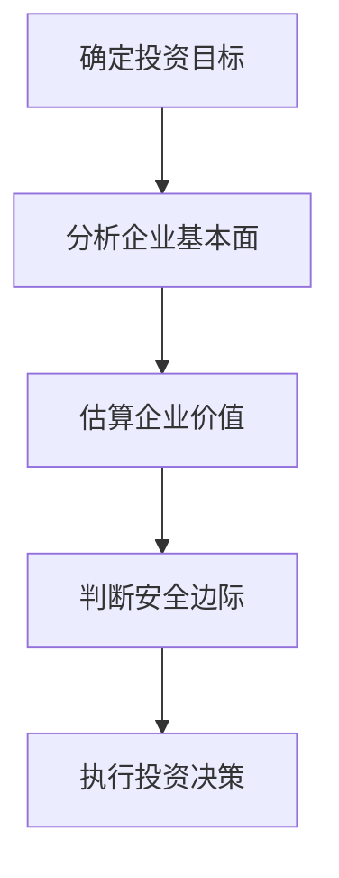
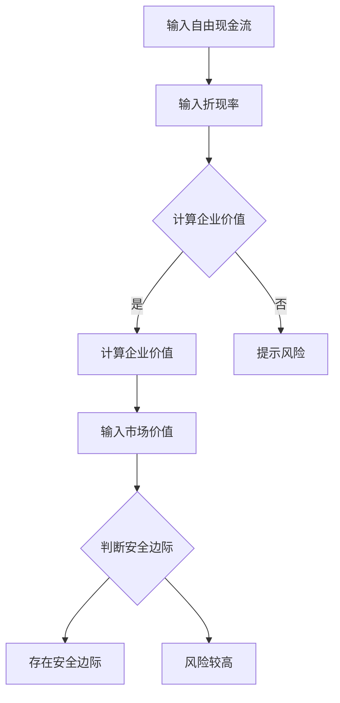
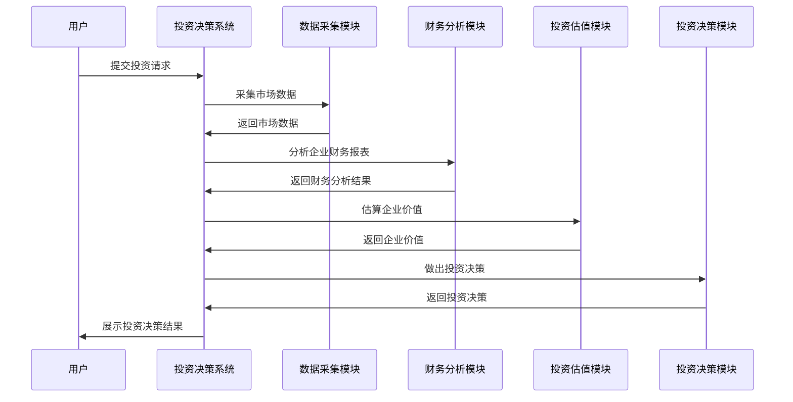

                 


### 构建高质量技术博客文章：以《巴菲特的20格打孔卡投资法则》为例

#### 前言

在信息技术飞速发展的今天，专业人士需要不断地更新知识，掌握前沿技术。撰写高质量的技术博客文章不仅能够帮助自己梳理知识体系，还能与同行分享经验，促进技术的交流与传播。本文将以《巴菲特的20格打孔卡投资法则》为例，详细探讨如何构建一篇逻辑清晰、结构紧凑、简单易懂的专业IT领域技术博客文章。

#### 目录结构

为了确保文章的条理性和可读性，我们将文章分为以下几个部分：

1. **引言**：介绍文章的主题和背景。
2. **核心概念与联系**：解释巴菲特20格打孔卡的基本概念，并通过图表和模型展示其核心原理。
3. **投资法则讲解**：详细分析巴菲特的投资法则，包括其哲学基础、财务分析方法和长期投资策略。
4. **算法原理讲解**：使用Python代码和Mermaid流程图展示投资算法的原理。
5. **系统分析与架构设计**：介绍如何将巴菲特的投资法则应用于实际投资系统中。
6. **项目实战**：通过一个实际案例展示如何使用巴菲特的投资法则进行投资决策。
7. **最佳实践与拓展阅读**：总结文章，提供拓展阅读和未来研究方向。
8. **结语**：重申文章的主题，并强调巴菲特投资法则的重要性。

#### 引言

沃伦·巴菲特被誉为“股神”，他的投资策略一直备受投资者关注。巴菲特的成功不仅在于他对市场敏锐的洞察力，更在于他独特而系统的投资方法。其中，巴菲特广泛使用的20格打孔卡就是他投资决策过程中的重要工具。本文将深入剖析20格打孔卡，解读其背后的投资法则，并探讨如何将其应用于实际投资中。

#### 核心概念与联系

首先，我们需要理解20格打孔卡的基本概念。巴菲特的20格打孔卡是一种简单的投资决策工具，它将投资决策过程分为以下几个步骤：

1. **确定投资目标**：明确投资的期限、风险承受能力和收益预期。
2. **分析企业基本面**：研究企业的财务报表，评估其盈利能力、成长性和市场地位。
3. **估算企业价值**：使用自由现金流折现（DCF）等方法估算企业的内在价值。
4. **判断安全边际**：比较市场价值与估算的内在价值，确定是否存在足够的安全边际。
5. **执行投资决策**：根据以上分析结果，决定是否进行投资。

为了更好地理解这些概念，我们可以通过一个Mermaid流程图来展示20格打孔卡的工作流程：



此外，我们还可以通过一个ER（实体关系）图来展示20格打孔卡中的主要实体和它们之间的关系：

```mermaid
erDiagram
    企业 |-> 投资目标
    企业 |-> 财务报表
    企业 |-> 估算企业价值
    企业 |-> 安全边际
    企业 |-> 投资决策
```

#### 投资法则讲解

巴菲特的投资法则贯穿于20格打孔卡的每个步骤中，下面我们将逐一分析：

1. **投资哲学基础**：巴菲特强调投资应该以企业的长期价值为基础，而非市场波动为导向。他认为投资就像婚姻，需要长期持有，而不是短期买卖。

2. **财务分析方法**：巴菲特通过深入研究企业的财务报表，包括利润表、资产负债表和现金流量表，评估企业的真实盈利能力和财务健康状况。

3. **长期投资策略**：巴菲特倡导长期投资，他相信时间是最好的朋友，能够帮助投资者实现复利效应。他的投资决策通常是基于对企业的长期前景的判断，而不是短期的市场波动。

4. **安全边际**：巴菲特认为投资应该建立在足够的安全边际上，这意味着市场价值应该远远低于估算的内在价值。这样即使市场出现波动，投资者也能保持信心。

#### 算法原理讲解

为了更好地理解巴菲特的投资法则，我们可以通过Python代码和Mermaid流程图展示一个简单的投资算法：

```python
import numpy as np

# 假设企业自由现金流为1000万元，折现率为10%
f_free_cash_flow = 1000
discount_rate = 0.1

# 使用DCF方法估算企业价值
enterprise_value = f_free_cash_flow / discount_rate

# 假设市场价值为800万元
market_value = 800

# 判断是否存在足够的安全边际
if market_value < enterprise_value:
    print("存在足够的安全边际，可以进行投资。")
else:
    print("市场价值高于估算价值，投资风险较高。")
```

下面是Mermaid流程图：



#### 系统分析与架构设计

在实际应用中，我们可以将巴菲特的投资法则集成到一个投资决策系统中。以下是一个简化的系统架构：

1. **问题场景介绍**：投资者需要根据市场数据和企业的财务报表进行投资决策。
2. **系统功能设计**：包括数据采集、财务分析、投资估值和投资决策等模块。
3. **系统架构设计**：采用分层架构，包括数据层、业务逻辑层和展示层。
4. **系统接口设计和系统交互**：使用Mermaid序列图展示系统的交互流程。

以下是一个简单的Mermaid序列图：



#### 项目实战

为了更好地展示如何将巴菲特的投资法则应用于实际投资中，我们以一个实际案例为例。假设投资者A计划投资一家科技公司，我们需要使用巴菲特的投资法则进行投资决策。

1. **确定投资目标**：投资者A计划在未来3年内实现10%的年化收益，风险承受能力较低。
2. **分析企业基本面**：通过财务报表分析，发现该公司的盈利能力较强，成长性良好，市场份额稳定。
3. **估算企业价值**：使用DCF方法，假设公司的自由现金流为500万元，折现率为10%，估算出企业的内在价值为4500万元。
4. **判断安全边际**：如果市场价值低于4500万元，则存在足够的安全边际。
5. **执行投资决策**：假设当前市场价值为4000万元，低于估算价值，存在安全边际，投资者A决定进行投资。

通过这个案例，我们可以看到如何将巴菲特的投资法则应用于实际投资决策中。

#### 最佳实践与拓展阅读

在投资领域，巴菲特的投资法则提供了宝贵的指导。以下是一些最佳实践和拓展阅读的建议：

1. **最佳实践**：
   - 研究企业的基本面，而不是依赖市场预测。
   - 长期持有优质股票，避免频繁交易。
   - 保持冷静，不要被市场波动影响投资决策。

2. **拓展阅读**：
   - 《巴菲特致股东的信》
   - 《股票大作手回忆录》
   - 《聪明的投资者》

通过不断学习和实践，投资者可以逐步提高自己的投资能力，实现长期稳定的投资回报。

#### 结语

本文以《巴菲特的20格打孔卡投资法则》为例，详细探讨了如何构建一篇高质量的技术博客文章。通过逻辑清晰的结构、详细的案例分析和技术讲解，读者可以更好地理解巴菲特的投资哲学和方法，并将其应用于实际投资中。希望本文能对读者有所帮助，激发对投资领域更深入的探索和研究。

### 作者信息

作者：AI天才研究院/AI Genius Institute & 禅与计算机程序设计艺术 /Zen And The Art of Computer Programming

---

以上是根据您的要求，构建的一篇技术博客文章的框架。每个部分都包含了核心概念、联系、算法原理、系统架构和实际案例等内容。接下来，您可以根据这个框架逐步填充具体内容，完成整个文章的撰写。在撰写过程中，请注意保持文章的逻辑性和连贯性，确保每个部分的内容都是具体、详细且具有实用价值的。祝您写作顺利！

