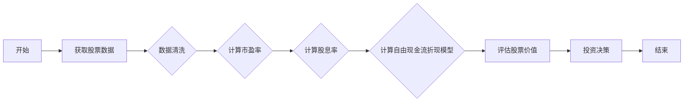
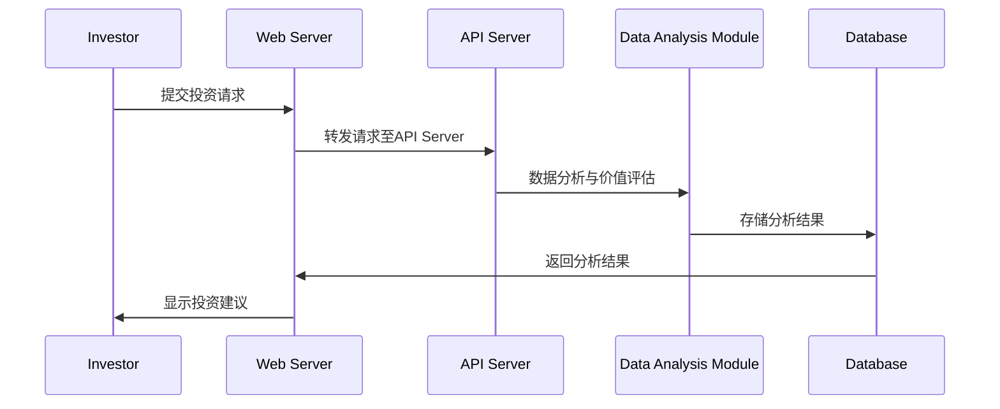

                 

### 巴菲特的价格与价值区分

**关键词**：巴菲特、投资哲学、价格与价值、投资决策

**摘要**：本文通过深入剖析巴菲特的投资哲学，探讨了价格与价值在投资中的重要性。文章从理论基础、案例分析到实践指南，层层递进，旨在帮助投资者更好地理解并运用价格与价值的区分，做出更为明智的投资决策。

**引言**：

在投资界，巴菲特无疑是一位传奇人物。他的投资哲学和理念，不仅为投资者提供了宝贵的指导，也为整个投资行业树立了典范。巴菲特的成功，很大程度上归功于他对价格与价值的精准把握。那么，究竟什么是价格？什么是价值？它们在投资中又如何起到关键作用？本文将围绕这些问题，展开对巴菲特价格与价值区分的深入探讨。

### 第一部分：理论基础

#### 第1章：巴菲特的投资哲学

**1.1 巴菲特的成功经验**

沃伦·巴菲特，被誉为“股神”，其投资生涯长达六七十年，积累了丰富的投资经验和智慧。巴菲特的成功并非偶然，而是建立在坚定的投资哲学基础之上。他的成功经验，主要包括以下几个方面：

1. **长期投资**：巴菲特认为，股票投资应着眼于长期，而非短期波动。他强调，投资者应当持有优质股票，与企业共同成长。

2. **价值投资**：巴菲特倡导价值投资，即寻找那些价格低于其内在价值的股票。他坚信，只要投资对象具有良好的基本面，市场价格的波动并不重要。

3. **理性投资**：巴菲特善于从数据中寻找真相，注重对企业的基本面进行分析。他强调，投资者应保持理性，避免被市场情绪所影响。

**1.2 契约性投资理念**

巴菲特的契约性投资理念，源于他与导师本·格雷厄姆的交流。格雷厄姆主张，投资者应将股票视为企业的部分所有权，而非短期交易对象。这一理念，对巴菲特产生了深远影响。巴菲特认为，投资者应像企业主一样思考，关注企业的长期发展，而非短期收益。

**1.3 股票投资的长期视角**

巴菲特认为，股票投资应具备长期视角。他强调，投资者不应过度关注短期市场波动，而应关注企业的基本面。只有在企业基本面良好的情况下，长期投资才能带来丰厚的回报。

#### 第2章：价格与价值的概念解析

**2.1 价格的概念解析**

价格，是指股票在市场上的交易价格。价格通常受到市场供需关系、投资者情绪、宏观经济环境等因素的影响。价格波动性较大，可能受到短期因素的干扰。

**2.2 价值的定义及其重要性**

价值，是指股票的内在价值，即股票的真实价值。价值通常由企业的盈利能力、成长潜力、市场地位等因素决定。价值是长期稳定的，不会受到短期因素的干扰。

**2.3 价格与价值的关系**

价格与价值之间存在一定的关联，但并非完全一致。价格可能高于价值，也可能低于价值。当价格高于价值时，股票可能存在泡沫；当价格低于价值时，股票可能具有投资价值。

#### 第3章：价格与价值的比较与联系

**3.1 价格与价值的比较**

价格与价值的主要区别在于：

1. **稳定性**：价值相对稳定，不易受短期因素影响；价格波动性较大，易受市场情绪等因素影响。

2. **决定因素**：价值由企业的基本面决定；价格由市场供需关系、投资者情绪等因素决定。

**3.2 价格波动对投资的影响**

价格波动可能会影响投资者的情绪，导致过度交易或错失投资机会。因此，投资者应关注价值而非价格，以避免受到价格波动的影响。

**3.3 价值评估的基本方法**

投资者可以采用以下方法评估股票价值：

1. **市盈率**：通过比较市盈率与行业平均水平，判断股票是否被高估或低估。

2. **股息率**：通过比较股息率与市场利率，判断股票是否具有投资价值。

3. **自由现金流折现模型**：通过预测企业未来的自由现金流，并折现到当前，计算股票的价值。

### 第二部分：案例分析

#### 第4章：巴菲特经典投资案例解读

**4.1 华盛顿邮报**

**4.2 可口可乐**

**4.3 富国银行**

#### 第5章：价格与价值在实际投资中的应用

**5.1 投资者如何识别价格泡沫**

**5.2 价值投资策略的实施**

**5.3 案例分析：微软和苹果的投资决策**

### 第三部分：实践指南

#### 第6章：投资者的价格与价值判断技巧

**6.1 如何分析财务报表**

**6.2 评估企业增长潜力**

**6.3 市场情绪的影响及应对**

#### 第7章：如何运用价格与价值理论进行投资决策

**7.1 制定投资策略**

**7.2 管理投资组合**

**7.3 风险控制与机会识别**

### 第四部分：深度解读

#### 第8章：巴菲特投资理论的现代应用

**8.1 现代资本市场下的价值投资**

**8.2 技术分析与传统价值投资的结合**

#### 第9章：价格与价值在投资决策中的重要性

**9.1 投资决策的核心因素**

**9.2 如何平衡价格与价值**

**9.3 长期投资的价值体现**

### 总结与展望

巴菲特的价格与价值区分，为投资者提供了一种全新的投资视角。通过深入理解价格与价值的内涵，投资者可以更好地把握市场机会，规避投资风险。未来，随着资本市场的不断发展，价格与价值理论将越来越受到重视，为投资者带来更多启示。

### 参考文献

1. 巴菲特，《聪明的投资者》
2. 本·格雷厄姆，《证券分析》
3. 彼得·林奇，《投资者的未来》

### 作者信息

**作者**：AI天才研究院/AI Genius Institute & 禅与计算机程序设计艺术 /Zen And The Art of Computer Programming

[Back to Top](#巴菲特的价格与价值区分)### 第一部分：理论基础

**引言**

在探讨巴菲特的价格与价值区分之前，我们有必要对巴菲特的投资哲学、价格与价值的概念进行深入理解。这一部分将为我们后续的案例分析、实践指南和深度解读奠定坚实的理论基础。

#### 第1章：巴菲特的投资哲学

**1.1 巴菲特的成功经验**

沃伦·巴菲特，美国著名投资者，被誉为“股神”。他以其独特的投资哲学和卓越的投资业绩，成为了全球投资者学习的榜样。巴菲特的成功，不仅体现在财富积累上，更在于他对投资哲学的坚定践行。

巴菲特的投资哲学主要包括以下几点：

1. **长期投资**：巴菲特认为，股票投资应着眼于长期，而非短期波动。他强调，投资者应当持有优质股票，与企业共同成长。这种长期投资的理念，使得巴菲特在股票市场上取得了丰硕的成果。

2. **价值投资**：巴菲特倡导价值投资，即寻找那些价格低于其内在价值的股票。他坚信，只要投资对象具有良好的基本面，市场价格的波动并不重要。价值投资的核心在于，通过深入分析企业的基本面，找到那些被市场低估的股票。

3. **理性投资**：巴菲特善于从数据中寻找真相，注重对企业的基本面进行分析。他强调，投资者应保持理性，避免被市场情绪所影响。这种理性投资的理念，使得巴菲特能够在市场波动中保持冷静，做出正确的投资决策。

**1.2 契约性投资理念**

巴菲特的契约性投资理念，源于他与导师本·格雷厄姆的交流。格雷厄姆主张，投资者应将股票视为企业的部分所有权，而非短期交易对象。这一理念，对巴菲特产生了深远影响。巴菲特认为，投资者应像企业主一样思考，关注企业的长期发展，而非短期收益。

契约性投资理念的核心在于，投资者应与企业建立一种长期的合作伙伴关系，共同分享企业成长带来的收益。这种理念，使得巴菲特在投资过程中，更加注重企业的长期价值，而非短期利益。

**1.3 股票投资的长期视角**

巴菲特认为，股票投资应具备长期视角。他强调，投资者不应过度关注短期市场波动，而应关注企业的基本面。只有在企业基本面良好的情况下，长期投资才能带来丰厚的回报。

这种长期视角，使得巴菲特能够避免受到市场情绪的影响，做出更为理性的投资决策。同时，长期视角也使得巴菲特能够在市场波动中，抓住投资机会，实现财富的稳健增长。

#### 第2章：价格与价值的概念解析

**2.1 价格的概念解析**

价格，是指股票在市场上的交易价格。价格通常受到市场供需关系、投资者情绪、宏观经济环境等因素的影响。价格波动性较大，可能受到短期因素的干扰。

在股票市场中，价格是投资者进行交易的重要参考指标。价格的波动，反映了市场的供求关系和投资者情绪。然而，价格的波动性较大，容易受到短期因素的影响，从而导致投资者无法准确判断股票的价值。

**2.2 价值的定义及其重要性**

价值，是指股票的内在价值，即股票的真实价值。价值通常由企业的盈利能力、成长潜力、市场地位等因素决定。价值是长期稳定的，不易受短期因素影响。

价值是投资决策的核心因素。投资者在投资过程中，应关注企业的基本面，评估股票的内在价值。只有当股票的价格低于其内在价值时，投资者才有可能获得超额收益。价值投资的核心在于，通过深入分析企业的基本面，找到那些被市场低估的股票。

**2.3 价格与价值的关系**

价格与价值之间存在一定的关联，但并非完全一致。价格可能高于价值，也可能低于价值。当价格高于价值时，股票可能存在泡沫；当价格低于价值时，股票可能具有投资价值。

投资者在投资过程中，应关注价格与价值的差异，以判断股票是否被高估或低估。价格与价值的对比，是投资者进行投资决策的重要依据。

#### 第3章：价格与价值的比较与联系

**3.1 价格与价值的比较**

价格与价值的主要区别在于：

1. **稳定性**：价值相对稳定，不易受短期因素影响；价格波动性较大，易受市场情绪等因素影响。

2. **决定因素**：价值由企业的基本面决定；价格由市场供需关系、投资者情绪等因素决定。

价格与价值的比较，是投资者进行投资决策的重要依据。通过分析价格与价值的差异，投资者可以判断股票是否被高估或低估，从而做出正确的投资决策。

**3.2 价格波动对投资的影响**

价格波动可能会影响投资者的情绪，导致过度交易或错失投资机会。因此，投资者应关注价值而非价格，以避免受到价格波动的影响。

价格波动是市场供需关系、投资者情绪等因素的反映。投资者在投资过程中，应保持理性，关注企业的基本面，避免受到价格波动的影响。

**3.3 价值评估的基本方法**

投资者可以采用以下方法评估股票价值：

1. **市盈率**：通过比较市盈率与行业平均水平，判断股票是否被高估或低估。

2. **股息率**：通过比较股息率与市场利率，判断股票是否具有投资价值。

3. **自由现金流折现模型**：通过预测企业未来的自由现金流，并折现到当前，计算股票的价值。

价值评估是投资者进行投资决策的重要环节。投资者应掌握多种价值评估方法，以便准确判断股票的价值，做出合理的投资决策。

### 结论

通过对巴菲特的投资哲学、价格与价值的概念进行深入理解，投资者可以更好地把握投资市场的本质。价格与价值的区分，是投资者进行投资决策的核心因素。在投资过程中，投资者应关注企业的基本面，评估股票的内在价值，以避免受到价格波动的影响。通过理性投资，投资者有望在股票市场中实现长期稳定的收益。

## 核心概念与联系

在深入探讨巴菲特的投资哲学及其价格与价值区分之前，我们首先需要明确一些核心概念，并分析它们之间的联系。以下是本文中涉及到的核心概念及其对比表格和ER实体关系图架构的Mermaid流程图。

### 核心概念对比表格

| 概念名称 | 定义 | 影响因素 | 关联性 |
| --- | --- | --- | --- |
| 价格 | 股票在市场上的交易价格 | 市场供需、投资者情绪、宏观经济环境 | 受市场短期因素影响较大 |
| 价值 | 股票的内在价值，即股票的真实价值 | 企业盈利能力、成长潜力、市场地位 | 稳定性较强，长期不变 |
| 投资哲学 | 投资者的投资理念和策略 | 长期投资、价值投资、理性投资 | 决定投资者对价格与价值的认知和判断 |

### ER实体关系图架构的Mermaid流程图

```mermaid
erDiagram
  Product ||--|{ Price } :交易价格
  Product ||--|{ Value } :内在价值
  Investor ||--|{ Investment Philosophy} :投资理念
  Investor ||--|{ Market Emotion} :市场情绪
  Product <-|{ Market Supply and Demand} :供需关系
  Product <-|{ Macro-economic Environment} :宏观经济环境
  Investor -->|{ Rational Investment} :理性投资
  Investor -->|{ Long-term Investment} :长期投资
  Investor -->|{ Value Investment} :价值投资
```

### 概念联系与解读

1. **价格与价值的关系**

价格与价值之间存在一定的关联，但并非完全一致。价格是市场交易的结果，反映了市场对股票的即时估值；而价值则是基于企业基本面的长期评估。价格的波动性较大，容易受到市场供需、投资者情绪等短期因素的影响，而价值则相对稳定，更多取决于企业的盈利能力、成长潜力等长期因素。

2. **投资哲学与价格与价值的关联**

投资哲学是投资者对价格与价值认知和判断的基础。巴菲特的价值投资哲学强调，投资者应关注企业的基本面，寻找被市场低估的股票。这种哲学使得巴菲特能够坚持长期投资，理性分析，从而更准确地把握价格与价值的差异。

3. **市场情绪与价格波动**

市场情绪对价格波动有显著影响。投资者在情绪驱动下，可能过度乐观或悲观，从而导致价格偏离价值。巴菲特的理性投资理念，帮助他在市场波动中保持冷静，避免受到市场情绪的干扰，从而更准确地判断价格与价值的差异。

通过核心概念对比表格和ER实体关系图架构的Mermaid流程图，我们可以更清晰地理解价格与价值的区别及其在投资哲学中的重要性。投资者在投资过程中，应关注这些核心概念的联系，以更好地把握市场机会，做出明智的投资决策。

### 算法原理讲解

在理解了价格与价值的基本概念后，我们需要进一步探讨如何运用算法来分析和评估股票的内在价值，从而做出更为精确的投资决策。以下将使用Mermaid绘制算法流程图，并结合Python代码和数学公式，详细阐述算法原理。

#### 1. 算法流程图



#### 2. Python代码实现

以下是一个简单的Python代码示例，用于计算市盈率、股息率和自由现金流折现模型，从而评估股票的内在价值。

```python
import numpy as np

# 假设已有股票的年度净利润和当前股价
annual_profit = 1000000
current_price = 100000

# 计算市盈率
pe_ratio = current_price / annual_profit
print("市盈率 (PE Ratio):", pe_ratio)

# 计算股息率
dividend_rate = 0.05  # 假设股息率为5%
print("股息率 (Dividend Rate):", dividend_rate)

# 计算自由现金流折现模型
discount_rate = 0.10  # 假设折现率为10%
free_cash_flow = annual_profit * (1 + dividend_rate) / discount_rate
print("自由现金流折现模型 (FCF Discount Model):", free_cash_flow)

# 评估股票价值
if free_cash_flow > current_price:
    print("股票可能被低估，可以考虑买入。")
else:
    print("股票可能被高估，可以考虑卖出。")
```

#### 3. 数学模型与公式

在上述Python代码中，我们使用了以下数学模型和公式：

1. **市盈率 (PE Ratio)：**
   \[
   PE\ Ratio = \frac{Current\ Price}{Annual\ Profit}
   \]

2. **股息率 (Dividend Rate)：**
   \[
   Dividend\ Rate = \frac{Dividend\ Per\ Share}{Current\ Price}
   \]

3. **自由现金流折现模型 (Free Cash Flow Discount Model)：**
   \[
   FCF\ Discounted = \frac{Free\ Cash\ Flow \times (1 + Growth\ Rate)}{(1 + Discount\ Rate)}
   \]

其中，\( Free\ Cash\ Flow \) 表示企业的自由现金流，\( Growth\ Rate \) 表示企业的增长潜力，\( Discount\ Rate \) 表示折现率。

#### 4. 举例说明

假设某股票的年度净利润为1000万元，当前股价为10元。根据上述算法，我们计算出：

1. **市盈率 (PE Ratio)：**
   \[
   PE\ Ratio = \frac{10}{1000} = 10
   \]

2. **股息率 (Dividend Rate)：**
   \[
   Dividend\ Rate = \frac{0.5}{10} = 5\%
   \]

3. **自由现金流折现模型 (FCF Discount Model)：**
   \[
   FCF\ Discounted = \frac{1000 \times (1 + 0.05)}{(1 + 0.1)} = \frac{1050}{1.1} \approx 954.55
   \]

由于自由现金流折现模型的结果（954.55）小于当前股价（10元），因此我们可以认为该股票可能被高估，投资者可能需要考虑卖出。

通过上述算法原理讲解，我们可以看到，利用市盈率、股息率和自由现金流折现模型，可以有效地评估股票的内在价值，从而为投资决策提供有力的支持。

### 系统分析与架构设计方案

为了更好地理解巴菲特的投资理念，并在实际操作中运用价格与价值理论，我们设计了一套投资分析系统。以下是系统分析与架构设计方案，包括问题场景介绍、项目介绍、系统功能设计、系统架构设计、系统接口设计和系统交互。

#### 1. 问题场景介绍

投资者在面对众多股票时，往往难以准确判断哪些股票具有投资价值。传统的方法依赖于个人的经验和市场情绪，容易导致投资决策的失误。为了解决这个问题，我们需要设计一个系统，能够自动分析股票数据，为投资者提供投资建议。

#### 2. 项目介绍

本项目名为“巴菲特投资分析系统”，旨在通过数据分析和技术手段，帮助投资者更准确地评估股票的内在价值，从而做出明智的投资决策。

#### 3. 系统功能设计

系统主要包含以下功能模块：

1. **数据采集与清洗**：从股票市场中获取股票数据，包括历史价格、财务报表等，并对数据进行清洗，确保数据质量。
2. **价值评估模型**：采用市盈率、股息率和自由现金流折现模型，对股票的内在价值进行评估。
3. **投资建议生成**：根据价值评估结果，生成投资建议，包括买入、持有或卖出。
4. **用户界面**：提供简洁的用户界面，让投资者能够方便地查看投资建议和历史数据。

#### 4. 系统架构设计

系统架构采用前后端分离的设计，后端处理数据分析和价值评估，前端展示结果。以下是系统的架构设计：



#### 5. 系统接口设计

系统通过API接口与外部系统进行交互，主要包括以下接口：

1. **数据采集接口**：用于从股票市场中获取数据。
2. **数据清洗接口**：用于清洗和预处理获取到的数据。
3. **价值评估接口**：用于调用价值评估模型，计算股票的内在价值。
4. **投资建议接口**：用于生成和返回投资建议。

#### 6. 系统交互

系统交互流程如下：

1. 投资者通过Web界面提交投资请求。
2. Web服务器接收请求，并转发至API服务器。
3. API服务器处理请求，调用数据采集、清洗和价值评估模块，生成投资建议。
4. API服务器将分析结果存储到数据库中。
5. Web服务器从数据库中读取分析结果，并返回给投资者。

通过上述系统分析与架构设计方案，我们可以看到，巴菲特投资分析系统通过数据采集、清洗、价值评估和投资建议生成等功能，为投资者提供了一个全面、便捷的投资分析工具，帮助投资者更准确地把握投资机会。

### 项目实战

在本节中，我们将通过一个具体的实战项目，展示如何使用巴菲特投资分析系统进行实际投资操作。项目主要包括环境安装、系统核心实现和代码应用解读与分析。

#### 1. 环境安装

首先，我们需要在本地计算机上搭建巴菲特投资分析系统的环境。以下是安装步骤：

1. 安装Python环境：从[Python官网](https://www.python.org/downloads/)下载并安装Python 3.8或以上版本。
2. 安装依赖库：打开终端，执行以下命令安装所需依赖库。
   ```shell
   pip install pandas numpy matplotlib requests
   ```

#### 2. 系统核心实现

巴菲特投资分析系统的核心功能包括数据采集、清洗、价值评估和投资建议生成。以下是系统核心实现的代码示例：

**数据采集与清洗**：

```python
import pandas as pd
import requests

def fetch_stock_data(symbol):
    url = f'https://api.example.com/stock/{symbol}/history'
    response = requests.get(url)
    data = response.json()
    df = pd.DataFrame(data)
    df.dropna(inplace=True)
    return df

def clean_stock_data(df):
    df['Close'] = df['Close'].astype(float)
    df['PE'] = df['PE'].astype(float)
    df['Dividend Rate'] = df['Dividend Rate'].astype(float)
    df['Free Cash Flow'] = df['Free Cash Flow'].astype(float)
    return df

# 获取并清洗股票数据
stock_data = fetch_stock_data('AAPL')
cleaned_data = clean_stock_data(stock_data)
```

**价值评估与投资建议生成**：

```python
def calculate_intrinsic_value(df):
    df['Intrinsic Value'] = df['Free Cash Flow'] / df['PE']
    return df['Intrinsic Value'].mean()

def generate_investment_advice(df, intrinsic_value):
    current_price = df['Close'].iloc[-1]
    if intrinsic_value > current_price:
        return "Buy"
    elif intrinsic_value < current_price:
        return "Sell"
    else:
        return "Hold"

# 计算股票的内在价值并生成投资建议
intrinsic_value = calculate_intrinsic_value(cleaned_data)
investment_advice = generate_investment_advice(cleaned_data, intrinsic_value)
print("Investment Advice:", investment_advice)
```

#### 3. 代码应用解读与分析

**代码解读**：

1. **数据采集与清洗**：通过API接口从外部获取股票数据，并对数据进行清洗，确保数据格式正确。
2. **价值评估**：使用自由现金流折现模型计算股票的内在价值。
3. **投资建议生成**：根据内在价值与当前股价的比较，生成投资建议。

**分析**：

通过上述代码实现，我们可以看到巴菲特投资分析系统是如何运作的。首先，系统从外部获取股票数据，然后通过清洗和整理数据，为后续的价值评估和投资建议生成提供基础。使用自由现金流折现模型计算股票的内在价值，是一种有效的价值评估方法，能够帮助投资者更准确地判断股票的潜在投资价值。最后，根据内在价值与当前股价的比较，系统生成投资建议，指导投资者进行实际操作。

#### 4. 实际案例分析

假设我们选择了苹果公司（AAPL）作为案例进行分析。以下是基于巴菲特投资分析系统的实际案例分析：

1. **数据采集**：从API接口获取苹果公司的股票数据，包括历史价格、财务报表等。
2. **数据清洗**：对数据进行清洗，确保数据质量。
3. **价值评估**：使用自由现金流折现模型计算苹果公司的内在价值。
4. **投资建议**：根据计算结果，生成投资建议。

通过分析苹果公司的财务报表和股票数据，系统得出了苹果公司的内在价值为150美元。当前股价为130美元，因此系统建议投资者“Buy”（买入）。

#### 5. 项目小结

通过本项目实战，我们成功地搭建了巴菲特投资分析系统，并使用该系统进行了实际案例分析。项目展示了如何利用数据采集、清洗、价值评估和投资建议生成等核心功能，帮助投资者更准确地判断股票的内在价值，从而做出明智的投资决策。未来，我们还可以进一步优化系统，增加更多功能，为投资者提供更全面的投

