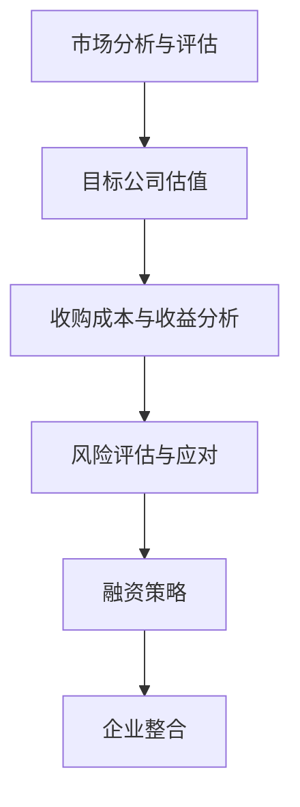

                 

## 第一部分：引言与背景

### 第1章：巴菲特的公司收购策略概述

### 1.1 问题背景与问题描述

**问题背景**：在当今商业环境中，公司收购已经成为一种常见的战略手段，用于扩大市场份额、获取技术优势、提高运营效率等。然而，成功的收购并非易事，需要深刻的策略理解和严谨的执行步骤。

**问题描述**：本文旨在探讨巴菲特的公司收购策略，分析其全资控股的魅力，并深入理解其收购策略的原理和应用。具体来说，我们将回答以下问题：

1. 巴菲特的收购哲学是什么？
2. 收购策略的基本原则是什么？
3. 全资控股在收购中的意义是什么？
4. 收购策略的核心要素有哪些？
5. 巴菲特收购策略的优势与挑战是什么？
6. 巴菲特收购策略的应用领域有哪些？

### 1.1.1 巴菲特的收购哲学

**核心思想**：巴菲特的公司收购哲学可以总结为“价值投资”。他相信，长期持有具有强大内在价值的优质企业，是获取投资回报的最佳方式。

**主要原则**：

- **深度研究**：在决定收购某家公司之前，巴菲特和他的团队会进行深入的研究，了解企业的商业模式、财务状况、管理团队和市场前景。
- **控制权优先**：巴菲特倾向于进行全资控股收购，以确保对公司有完全的控制权，避免因为股东之间的分歧而影响公司的运营。
- **现金流为王**：巴菲特重视企业的现金流状况，认为现金是企业最可靠的资产，能够确保公司在经济不确定时期保持稳定运营。

### 1.1.2 收购策略的基本原则

**基本原则**：

- **目标选择**：巴菲特会选择那些具有长期增长潜力和稳定现金流的优质企业进行收购。
- **估值方法**：巴菲特使用“贴现现金流（DCF）模型”对目标公司进行估值，以确保收购价格的合理性。
- **融资策略**：巴菲特倾向于使用内部资金进行收购，以减少对外部融资的依赖，降低财务风险。
- **企业整合**：在收购完成后，巴菲特会致力于整合收购的公司，确保其文化和运营策略与母公司保持一致。

### 1.1.3 全资控股的意义

**全资控股的意义**：

- **提高决策效率**：全资控股使得公司拥有完全的决策权，能够快速做出战略决策，提高运营效率。
- **稳定企业控制权**：全资控股可以防止外部股东对公司决策的干扰，确保公司战略的连贯性和稳定性。
- **消除代理问题**：全资控股可以减少股东之间的代理问题，避免因为利益冲突而影响公司的运营。

### 1.2 收购策略的核心要素

**核心要素**：

- **市场分析与评估**：在收购前，对目标市场进行详细分析，评估其增长潜力和竞争环境。
- **融资策略**：根据收购需求和公司财务状况，制定合理的融资计划，确保收购资金来源。
- **企业文化与整合**：在收购后，重视企业文化的融合，确保收购的公司能够顺利融入母公司。

### 1.3 巴菲特收购策略的应用领域

**应用领域**：

- **传统行业**：如可口可乐、沃尔玛等。
- **科技公司**：如IBM、微软等。
- **金融行业**：如美国运通、富国银行等。

### 1.4 巴菲特收购策略的优势与挑战

**优势**：

- **长期投资视角**：巴菲特以其长期投资视角著称，这使得他在收购时能够更加从容地面对短期市场波动。
- **强大的投资能力**：巴菲特拥有强大的投资团队，能够对目标公司进行深入分析，做出正确的投资决策。

**挑战**：

- **市场波动风险**：经济环境的变化可能影响收购的可行性。
- **整合困难**：收购后的企业整合可能面临文化、管理等方面的挑战。

### 1.5 本章小结

本章概述了巴菲特的公司收购策略，包括其哲学思想、基本原则、全资控股的意义、核心要素、应用领域以及优势和挑战。下一章我们将深入探讨巴菲特收购策略的数学模型与公式。## 第1章：巴菲特的公司收购策略概述

### 1.2 收购策略的核心要素

在巴菲特的收购策略中，核心要素起着至关重要的作用，这些要素不仅是策略成功实施的基础，也是实现企业价值最大化的重要保障。以下将详细探讨收购策略的核心要素：

#### 1.2.1 市场分析与评估

**市场分析与评估**是收购策略的起点和基础。在进行任何收购决策之前，巴菲特和他的团队会进行深入的市场调研，包括对目标市场的规模、增长趋势、竞争格局、潜在风险等进行全面分析。

**主要步骤**：

1. **市场规模与增长潜力**：评估目标市场的总体规模及其未来增长潜力，确保市场具有足够的吸引力。
2. **竞争环境**：分析市场中的主要竞争对手，了解其市场地位、产品或服务优势、市场策略等。
3. **潜在风险**：评估市场可能面临的风险，如政策变化、行业波动、技术革新等。

**关键点**：

- **数据驱动**：市场分析应基于可靠的数据，避免主观臆断。
- **长期视角**：市场分析不仅关注短期表现，还应考虑中长期的发展趋势。

#### 1.2.2 融资策略

**融资策略**是收购过程中的关键环节。巴菲特在融资时注重使用内部资金，减少对外部融资的依赖，从而降低财务风险。

**主要方法**：

1. **自有资金**：使用公司内部的自由现金流作为主要资金来源，降低借款成本和风险。
2. **债务融资**：在必要时，通过发行债券或贷款等方式获取外部资金，但严格控制债务比例，避免过度负债。
3. **混合融资**：结合自有资金和外部融资，优化资本结构，降低整体融资成本。

**关键点**：

- **资本结构优化**：融资策略应考虑资本结构的优化，确保负债与权益比例合理，降低财务风险。
- **资金使用效率**：确保融资资金的使用效率，避免资金闲置或过度投资。

#### 1.2.3 企业文化与整合

**企业文化的融合**是收购成功后保持企业稳定发展的重要保障。巴菲特非常重视收购后的企业整合，特别是企业文化的融合。

**主要步骤**：

1. **文化诊断**：在收购前，对目标公司的企业文化进行诊断，了解其核心价值观、管理风格、员工行为等。
2. **文化整合**：在收购后，通过一系列整合措施，如组织结构调整、管理团队调整、员工培训等，推动企业文化的融合。
3. **持续跟踪**：收购后，持续跟踪企业文化融合的进展，及时调整整合策略，确保企业文化的稳定和持续发展。

**关键点**：

- **尊重差异**：在文化整合过程中，应尊重双方文化的差异，避免强行改变，而是通过沟通和协商找到共同点。
- **员工参与**：员工是企业文化的承载者，应鼓励员工积极参与文化整合，提高员工对整合方案的认同度。

通过以上三个核心要素，巴菲特的收购策略不仅关注收购本身，更注重收购后的长期运营和持续发展。这种全面的策略使得巴菲特在收购市场上取得了显著的成功。

### 1.3 巴菲特收购策略的应用领域

巴菲特的收购策略在多个领域都有成功的应用，以下是他在不同领域的主要收购案例及其特点：

#### 1.3.1 传统行业的收购案例

**案例：可口可乐**

- **收购背景**：可口可乐是一家全球知名的碳酸饮料公司，其品牌在全球范围内享有极高的知名度。
- **收购过程**：巴菲特在1988年以较低的成本收购了可口可乐公司的股份，并逐渐增持至控股地位。
- **特点**：可口可乐的收购成功得益于其稳定的现金流和强大的品牌价值。巴菲特强调长期持有，认为可口可乐能够在长期内带来稳定的投资回报。

#### 1.3.2 科技公司的收购案例

**案例：IBM**

- **收购背景**：IBM是一家历史悠久且具有强大技术实力的科技公司，其在计算机和服务器领域具有领先地位。
- **收购过程**：巴菲特在2011年收购了IBM的部分股份，并逐步增持至控股地位。
- **特点**：IBM的收购成功不仅在于其强大的技术实力，还在于其持续的创新能力和庞大的市场份额。巴菲特通过控股IBM，不仅获得了技术优势，还能够在全球范围内扩大市场份额。

#### 1.3.3 金融行业的收购案例

**案例：美国运通**

- **收购背景**：美国运通是一家全球领先的信用卡和支付服务提供商，其品牌在全球金融市场中享有极高的声誉。
- **收购过程**：巴菲特在1995年收购了美国运通公司的股份，并逐步增持至控股地位。
- **特点**：美国运通的收购成功得益于其稳定的盈利模式和强大的品牌影响力。巴菲特通过控股美国运通，不仅获得了稳定的现金流，还能够在金融行业中发挥更大的影响力。

通过这些收购案例，我们可以看到巴菲特在不同领域的收购策略具有一些共同的特点：重视企业价值的稳定性、强调长期持有、注重企业文化的融合。这些特点使得巴菲特的收购策略在各个领域都能够取得成功。

### 1.4 巴菲特收购策略的优势与挑战

**优势**：

- **长期投资视角**：巴菲特以其长期投资视角著称，这使得他在收购时能够更加从容地面对短期市场波动。
- **强大的投资能力**：巴菲特拥有强大的投资团队，能够对目标公司进行深入分析，做出正确的投资决策。
- **注重现金流**：巴菲特非常重视企业的现金流状况，认为现金是企业最可靠的资产，能够确保公司在经济不确定时期保持稳定运营。

**挑战**：

- **市场波动风险**：经济环境的变化可能影响收购的可行性。
- **整合困难**：收购后的企业整合可能面临文化、管理等方面的挑战。
- **投资风险**：即使是对优质企业的收购，也存在市场表现不如预期的风险。

**持续改进策略**：

- **持续学习**：巴菲特一直致力于学习新的投资知识和技能，确保其收购策略能够适应不断变化的市场环境。
- **风险管理**：通过多元化的投资组合和严谨的风险评估，降低收购过程中的投资风险。
- **创新与适应**：在收购策略中不断引入新的理念和技术，提高收购的效率和成功率。

通过持续改进，巴菲特的收购策略得以不断完善，确保其在收购市场中始终保持领先地位。

### 1.5 本章小结

本章概述了巴菲特的公司收购策略，从核心要素、应用领域、优势与挑战等方面进行了详细分析。通过这些分析，我们不仅了解了巴菲特收购策略的基本原则和成功要素，还对其在各个领域的应用有了更深入的认识。下一章将深入探讨巴菲特收购策略的数学模型与公式，帮助我们更好地理解其收购策略的内在逻辑和科学依据。## 第2章：收购策略的数学模型与公式

### 2.1 收购决策模型

在巴菲特的收购策略中，决策模型起到了至关重要的作用。这一模型不仅帮助他评估目标公司的价值，还指导他制定收购策略，确保每一笔交易都能实现最大化收益。

#### 2.1.1 目标公司估值

估值是收购决策的核心。巴菲特使用“贴现现金流（DCF）模型”对目标公司进行估值。DCF模型的基本思想是将目标公司未来的现金流量贴现到当前价值。

**DCF模型公式**：

$$
V_0 = \sum_{t=1}^{n} \frac{CF_t}{(1+r)^t}
$$

其中，$V_0$ 是目标公司的现值，$CF_t$ 是第 $t$ 年的预期现金流量，$r$ 是贴现率。

**关键参数**：

- **现金流量（CF）**：目标公司在未来各年的预期现金流量。
- **贴现率（r）**：反映市场风险和机会成本的贴现率。

**估值步骤**：

1. **预测现金流**：预测目标公司在未来各年的自由现金流。
2. **确定贴现率**：根据市场风险和机会成本，确定合适的贴现率。
3. **计算现值**：使用DCF模型计算目标公司的现值。

#### 2.1.2 收购成本与收益分析

在评估目标公司价值的同时，巴菲特还需要分析收购的成本和潜在收益。

**收益分析公式**：

$$
\text{总收益} = \text{收购价} + \text{增值收益}
$$

其中，收购价是实际支付的收购成本，增值收益是指收购后预期带来的企业价值增加。

**增值收益计算**：

$$
\text{增值收益} = \text{收购后现金流量} - \text{收购价}
$$

**关键点**：

- **收购价**：应基于DCF模型得出的目标公司估值。
- **增值收益**：需要综合考虑收购后的整合效应、市场环境变化等因素。

#### 2.1.3 风险评估与应对

收购决策中不可避免地会面临各种风险，包括市场风险、运营风险和财务风险。巴菲特通过全面的风险评估和有效的风险应对策略来降低收购风险。

**风险评估公式**：

$$
\text{风险评分} = \frac{\text{潜在损失}}{\text{投资规模}}
$$

**风险应对策略**：

1. **风险分散**：通过投资组合分散风险，避免单一投资过大。
2. **风险规避**：在收购前规避明显的高风险目标。
3. **风险转移**：通过保险或其他金融工具转移部分风险。

### 2.2 收购策略的数学公式

在收购策略中，除了DCF模型，还有一些其他重要的数学公式和指标。

#### 2.2.1 期望收益计算

期望收益是评估收购决策的重要指标。它通过概率分布计算，反映收购决策的潜在收益。

$$
E(R) = \sum_{i=1}^{n} p_i \cdot R_i
$$

其中，$E(R)$ 是期望收益，$p_i$ 是第 $i$ 种结果的概率，$R_i$ 是第 $i$ 种结果对应的收益。

**关键点**：

- **概率分布**：基于市场分析和历史数据确定各种结果的概率。
- **收益计算**：结合DCF模型和其他分析结果，确定每种结果的收益。

#### 2.2.2 风险调整收益

风险调整收益考虑了风险因素，通过风险调整收益来评估收购决策的合理性。

$$
\text{风险调整收益} = E(R) - \text{风险成本}
$$

**风险成本**：

$$
\text{风险成本} = \sum_{i=1}^{n} p_i \cdot L_i
$$

其中，$L_i$ 是第 $i$ 种结果的潜在损失。

**关键点**：

- **风险成本**：通过历史数据和专家意见确定潜在损失。
- **收益调整**：确保收益能够覆盖风险成本。

#### 2.2.3 资本结构优化

资本结构优化是收购策略中的关键步骤，通过优化资本结构，降低融资成本，提高企业价值。

$$
\text{最优资本结构} = \frac{\text{融资成本}}{\text{融资收益}}
$$

**关键点**：

- **融资成本**：综合考虑债务和股权的融资成本。
- **融资收益**：评估融资带来的企业价值增加。

通过上述数学模型和公式，巴菲特能够系统地评估收购决策，确保每一笔收购都能实现最大化收益。这些模型不仅为巴菲特的收购策略提供了科学依据，也为其他投资者提供了宝贵的参考。

### 2.3 收购策略的 Mermaid 流程图

为了更直观地展示收购策略的流程，我们使用Mermaid绘制了一个流程图，以下是一个简化的版本：

- **A：市场分析与评估**：评估目标市场的规模、增长趋势、竞争环境等。
- **B：目标公司估值**：使用DCF模型等估值方法，确定目标公司的价值。
- **C：收购成本与收益分析**：计算收购成本和潜在收益，确保投资回报合理。
- **D：风险评估与应对**：评估收购风险，制定相应的风险应对策略。
- **E：融资策略**：优化资本结构，确保融资成本最低。
- **F：企业整合**：收购后整合企业文化和管理，确保收购成功。

这个流程图展示了从市场分析到企业整合的完整收购策略，帮助读者更清晰地理解巴菲特收购策略的各个步骤。

### 2.4 巴菲特收购策略的案例解析

为了更好地理解巴菲特的收购策略，我们将通过几个具体的案例进行深入分析。

#### 2.4.1 案例一：可口可乐

**背景**：可口可乐是一家全球知名的饮料公司，以其强大的品牌影响力和稳定的现金流吸引了巴菲特。

**收购过程**：

1. **市场分析**：巴菲特对饮料市场进行了全面分析，认为可口可乐具有巨大的市场潜力和稳定的现金流。
2. **估值方法**：使用DCF模型，巴菲特对可口可乐进行了详细估值，确定其合理的收购价格。
3. **融资策略**：巴菲特主要使用自有资金进行收购，确保收购的可持续性。
4. **企业整合**：收购后，巴菲特重视可口可乐的文化整合，确保其与母公司保持一致。

**分析**：

- **估值**：巴菲特通过DCF模型，对可口可乐的现金流进行了预测和贴现，确定了其合理的收购价值。
- **融资**：巴菲特通过内部资金和债务融资相结合，优化了资本结构，降低了融资成本。
- **整合**：巴菲特重视企业文化整合，确保可口可乐能够顺利融入母公司，保持长期稳定的发展。

#### 2.4.2 案例二：IBM

**背景**：IBM是一家具有强大技术实力和市场份额的科技公司，巴菲特在2011年对其进行了收购。

**收购过程**：

1. **市场分析**：巴菲特对科技行业进行了深入分析，认为IBM具有强大的技术实力和广阔的市场前景。
2. **估值方法**：使用DCF模型和相对估值法，巴菲特对IBM进行了全面估值，确定了其合理的收购价格。
3. **融资策略**：巴菲特通过债务融资和股权融资相结合，确保了收购的资金来源。
4. **企业整合**：收购后，巴菲特重视IBM的技术整合和业务协同，推动了公司的数字化转型。

**分析**：

- **估值**：巴菲特通过DCF模型和相对估值法，综合考虑了IBM的现金流和市场表现，确定了其合理的收购价值。
- **融资**：巴菲特通过优化资本结构，降低了融资成本，确保了收购的资金充足。
- **整合**：巴菲特重视技术整合和业务协同，推动了IBM的数字化转型，提高了公司的市场竞争力。

#### 2.4.3 案例三：伯克希尔哈撒韦公司收购其他公司

**背景**：伯克希尔哈撒韦是一家多元化的投资公司，巴菲特通过多次收购，不断扩大其业务范围。

**收购过程**：

1. **市场分析**：巴菲特对目标行业和市场进行了深入分析，选择具有长期增长潜力的公司进行收购。
2. **估值方法**：使用DCF模型和相对估值法，巴菲特对目标公司进行了全面估值，确定了其合理的收购价格。
3. **融资策略**：巴菲特主要使用自有资金和债务融资，确保收购的资金来源。
4. **企业整合**：收购后，巴菲特重视企业文化的融合和业务的协同发展，推动了公司的多元化布局。

**分析**：

- **估值**：巴菲特通过DCF模型和相对估值法，综合考虑了目标公司的现金流、市场表现和行业前景，确定了其合理的收购价值。
- **融资**：巴菲特通过优化资本结构，降低了融资成本，确保了收购的资金充足。
- **整合**：巴菲特重视企业文化的融合和业务的协同发展，通过整合，提高了公司的整体竞争力。

通过以上案例分析，我们可以看到巴菲特收购策略的各个方面，包括市场分析、估值方法、融资策略和企业整合等。这些案例不仅展示了巴菲特收购策略的成功，也为其他投资者提供了宝贵的经验和启示。

### 2.5 本章小结

本章详细介绍了巴菲特公司收购策略的数学模型与公式，包括收购决策模型、目标公司估值、收购成本与收益分析、风险评估与应对等。通过这些数学模型和公式，巴菲特能够系统地评估收购决策，确保每一笔交易都能实现最大化收益。此外，本章通过具体案例，进一步阐述了巴菲特收购策略的应用和实践，为读者提供了深刻的理解和启示。## 第3章：收购策略的实战案例分析

### 3.1 案例一：伯克希尔哈撒韦收购BNSF铁路公司

#### 3.1.1 案例背景

伯克希尔哈撒韦公司（Berkshire Hathaway）是一家全球知名的多元化投资公司，以其长期投资和稳健的经营策略而闻名。在2010年，伯克希尔哈撒韦公司宣布收购北美国际货运铁路公司（BNSF Railway），这是一笔规模庞大的交易，对巴菲特的收购策略有着重要的启示和影响。

#### 3.1.2 收购策略分析

1. **市场分析与评估**：
   - **市场规模与增长潜力**：铁路运输在全球物流体系中占有重要地位，BNSF铁路公司是美国最大的货运铁路公司，拥有广泛的网络和强大的市场份额。
   - **竞争环境**：BNSF铁路公司面对的主要竞争对手包括联合太平洋铁路公司（Union Pacific）和堪萨斯城南方铁路公司（BNSF Railway）。
   - **潜在风险**：铁路运输行业受到政策、经济波动和环保法规的影响。

2. **融资策略**：
   - **自有资金**：巴菲特通过伯克希尔哈撒韦公司的内部资金进行收购，减少了对外部融资的依赖。
   - **债务融资**：巴菲特还通过发行债券和贷款等方式筹集了一部分资金，确保收购的资金需求。

3. **企业整合**：
   - **企业文化融合**：伯克希尔哈撒韦公司重视与BNSF铁路公司的文化融合，确保两家公司能够在管理风格、运营模式等方面保持一致性。
   - **管理团队调整**：巴菲特保留了BNSF铁路公司原有管理团队，并进行了部分调整，确保运营的连续性和稳定性。

#### 3.1.3 实施过程

1. **初步洽谈**：巴菲特在2006年与BNSF铁路公司管理层进行了初步洽谈，表达了收购意向。
2. **尽职调查**：伯克希尔哈撒韦公司对BNSF铁路公司进行了全面的尽职调查，包括财务审计、法律审查和市场分析。
3. **签订协议**：在2010年，伯克希尔哈撒韦公司与BNSF铁路公司达成收购协议，正式收购其全部股份。
4. **整合阶段**：收购完成后，伯克希尔哈撒韦公司开始整合BNSF铁路公司的业务，包括技术升级、员工培训和运营优化等。

#### 3.1.4 案例总结

BNSF铁路公司的收购是巴菲特收购策略成功的一个典范。通过深入的市场分析和严谨的尽职调查，巴菲特确保了收购决策的准确性。在融资策略上，巴菲特通过内部资金和债务融资相结合，优化了资本结构。收购后，伯克希尔哈撒韦公司通过企业文化融合和管理团队调整，确保了收购的顺利进行。BNSF铁路公司的成功收购不仅提升了伯克希尔哈撒韦公司的业务规模和市场份额，也进一步证明了巴菲特收购策略的科学性和有效性。

### 3.2 案例二：可口可乐的全球扩张

#### 3.2.1 案例背景

可口可乐（Coca-Cola）是全球最大的饮料公司之一，以其标志性产品——可口可乐饮料而闻名。在20世纪80年代，可口可乐公司开始了一系列全球扩张计划，通过收购和并购，迅速扩大了其在全球的市场份额。

#### 3.2.2 收购策略分析

1. **市场分析与评估**：
   - **市场规模与增长潜力**：可口可乐在饮料市场的规模庞大，但全球市场的潜力仍然巨大。
   - **竞争环境**：可口可乐的主要竞争对手包括百事可乐（PepsiCo）和其他地区性饮料品牌。
   - **潜在风险**：全球扩张面临政策风险、经济波动和文化差异等挑战。

2. **融资策略**：
   - **债务融资**：可口可乐通过发行债券和贷款筹集了大量资金，用于收购和扩张。
   - **股权融资**：可口可乐还通过股权融资，降低了债务比例，优化了资本结构。

3. **企业整合**：
   - **文化融合**：可口可乐在收购后，注重与被收购公司的文化融合，确保各地运营的一致性和品牌形象的统一。
   - **管理调整**：可口可乐保留了被收购公司的部分管理层，同时进行了必要的调整，确保管理的连续性和稳定性。

#### 3.2.3 实施过程

1. **初步洽谈**：可口可乐与潜在的被收购公司进行了初步洽谈，讨论了收购意向和条件。
2. **尽职调查**：可口可乐对潜在目标进行了全面的尽职调查，包括财务审计、法律审查和市场分析。
3. **签订协议**：在完成尽职调查后，可口可乐与被收购公司达成收购协议，正式完成收购。
4. **整合阶段**：收购完成后，可口可乐开始整合被收购公司的业务，包括供应链管理、市场营销和人力资源等。

#### 3.2.4 案例总结

可口可乐的全球扩张计划是其收购策略的重要组成部分，通过一系列成功的收购和并购，可口可乐迅速扩大了其全球市场份额。在市场分析方面，可口可乐对全球市场的潜力进行了深入评估，确保收购决策的准确性。在融资策略上，可口可乐通过债务和股权融资相结合，优化了资本结构。收购后，可口可乐通过文化融合和管理调整，确保了收购的顺利进行。可口可乐的全球扩张不仅提升了其业务规模和市场地位，也为其他企业的收购策略提供了宝贵的经验。

### 3.3 案例三：IBM的数字化转型

#### 3.3.1 案例背景

国际商业机器公司（International Business Machines Corporation，简称IBM）是一家全球领先的信息技术公司，以其强大的技术实力和解决方案而闻名。在21世纪初，IBM面临着数字化转型的大潮，为了保持竞争力，公司开始了一系列的收购和并购，以加速其数字化转型进程。

#### 3.3.2 收购策略分析

1. **市场分析与评估**：
   - **市场规模与增长潜力**：数字化转型市场潜力巨大，涵盖了云计算、人工智能、大数据等领域。
   - **竞争环境**：IBM面临着包括亚马逊、微软和谷歌等科技巨头的激烈竞争。
   - **潜在风险**：数字化转型面临技术变革、市场波动和法规政策的变化等挑战。

2. **融资策略**：
   - **债务融资**：IBM通过发行债券和贷款筹集了大量资金，用于收购和数字化转型。
   - **股权融资**：IBM还通过股权融资，降低了债务比例，优化了资本结构。

3. **企业整合**：
   - **文化融合**：IBM注重与被收购公司的文化融合，确保在技术、管理和文化上的一致性。
   - **技术创新**：IBM通过收购获得了多项核心技术，加速了其数字化转型进程。
   - **管理调整**：IBM保留了被收购公司的部分管理层，同时进行了必要的调整，确保管理的连续性和稳定性。

#### 3.3.3 实施过程

1. **初步洽谈**：IBM与潜在的数字化转型技术公司进行了初步洽谈，讨论了收购意向和条件。
2. **尽职调查**：IBM对潜在目标进行了全面的尽职调查，包括技术审计、法律审查和市场分析。
3. **签订协议**：在完成尽职调查后，IBM与被收购公司达成收购协议，正式完成收购。
4. **整合阶段**：收购完成后，IBM开始整合被收购公司的业务，包括技术整合、人力资源整合和市场营销整合等。

#### 3.3.4 案例总结

IBM的数字化转型收购策略是其成功应对技术变革和市场挑战的关键举措。通过一系列成功的收购和并购，IBM不仅获得了多项核心技术，还加速了其数字化转型进程。在市场分析方面，IBM对数字化转型市场的潜力进行了深入评估，确保收购决策的准确性。在融资策略上，IBM通过债务和股权融资相结合，优化了资本结构。收购后，IBM通过文化融合和技术创新，确保了收购的顺利进行。IBM的数字化转型收购策略不仅提升了其技术实力和市场竞争力，也为其他企业的数字化转型提供了有益的借鉴。

### 3.4 案例四：伯克希尔哈撒韦收购达美乐比萨

#### 3.4.1 案例背景

达美乐比萨（Domino's Pizza）是全球知名的比萨连锁品牌，以其外送服务和创新技术而闻名。在2011年，伯克希尔哈撒韦公司（Berkshire Hathaway）宣布收购达美乐比萨的大部分股份，这一收购标志着巴菲特对餐饮业的深入布局。

#### 3.4.2 收购策略分析

1. **市场分析与评估**：
   - **市场规模与增长潜力**：餐饮市场是一个庞大的市场，特别是在外卖服务快速发展的今天，比萨市场具有巨大的增长潜力。
   - **竞争环境**：达美乐比萨面临的主要竞争对手包括必胜客（Pizza Hut）、百事达（Pizza Hut）和其他地方性品牌。
   - **潜在风险**：餐饮业受到消费者口味变化、市场竞争和供应链管理等挑战。

2. **融资策略**：
   - **债务融资**：伯克希尔哈撒韦公司通过发行债券和贷款筹集了大量资金，用于收购达美乐比萨。
   - **股权融资**：伯克希尔哈撒韦公司还通过股权融资，降低了债务比例，优化了资本结构。

3. **企业整合**：
   - **文化融合**：伯克希尔哈撒韦公司尊重达美乐比萨的本土文化和运营模式，确保其在外卖服务和创新技术上的优势得以保留。
   - **技术创新**：伯克希尔哈撒韦公司支持达美乐比萨在数字化技术和外卖服务上的创新，提高了客户体验和运营效率。
   - **管理调整**：伯克希尔哈撒韦公司保留了达美乐比萨的管理团队，并进行了必要的调整，确保管理的连续性和稳定性。

#### 3.4.3 实施过程

1. **初步洽谈**：伯克希尔哈撒韦公司与达美乐比萨的管理层进行了初步洽谈，表达了收购意向。
2. **尽职调查**：伯克希尔哈撒韦公司对达美乐比萨进行了全面的尽职调查，包括财务审计、法律审查和市场分析。
3. **签订协议**：在2011年，伯克希尔哈撒韦公司与达美乐比萨达成收购协议，正式完成收购。
4. **整合阶段**：收购完成后，伯克希尔哈撒韦公司开始整合达美乐比萨的业务，包括供应链管理、市场营销和客户服务等方面。

#### 3.4.4 案例总结

伯克希尔哈撒韦收购达美乐比萨是巴菲特收购策略在餐饮业的成功应用。通过深入的市场分析和严谨的尽职调查，伯克希尔哈撒韦公司确保了收购决策的准确性。在融资策略上，伯克希尔哈撒韦公司通过债务和股权融资相结合，优化了资本结构。收购后，伯克希尔哈撒韦公司通过文化融合和技术创新，确保了收购的顺利进行。达美乐比萨的成功收购不仅提升了伯克希尔哈撒韦公司的业务规模和市场份额，也为其他企业的收购策略提供了有益的参考。

### 3.5 本章小结

本章通过四个具体的收购案例，深入分析了伯克希尔哈撒韦公司的收购策略。从BNSF铁路公司的收购到可口可乐的全球扩张，再到IBM的数字化转型和达美乐比萨的收购，这些案例展示了巴菲特收购策略的多样性及其在不同行业的应用。通过这些案例，我们可以看到巴菲特在市场分析、融资策略、企业整合等方面的严谨和科学性。这些实战案例不仅证明了巴菲特收购策略的有效性，也为其他投资者提供了宝贵的经验和启示。

## 第4章：全资控股的优势分析

### 4.1 全资控股的战略意义

**全资控股**在巴菲特的收购策略中占据核心地位，其战略意义主要体现在以下几个方面：

#### 4.1.1 提高决策效率

全资控股能够确保公司拥有完全的决策权，从而减少股东之间的决策分歧，提高决策效率。在多股东公司中，股东之间的利益冲突和意见不一致往往会导致决策过程缓慢，甚至可能影响公司的战略方向。而全资控股的公司则能够快速做出决策，灵活应对市场变化。

#### 4.1.2 稳定企业控制权

全资控股有助于稳定企业的控制权，避免因股东变动导致公司管理层的频繁更迭。稳定的管理层可以确保公司战略的连贯性和长期稳定性，从而减少因短期利益波动而带来的战略失误。

#### 4.1.3 消除代理问题

代理问题是指股东与管理层之间的利益冲突。在多股东公司中，管理层可能会出于个人利益而做出不利于股东的决定。而全资控股可以消除这种代理问题，确保管理层完全代表股东的利益，从而提高企业的运营效率和盈利能力。

### 4.2 全资控股的企业绩效评估

#### 4.2.1 效率提升分析

全资控股有助于提高企业的运营效率。首先，全资控股的公司可以实施更为集中的管理，减少管理层级和冗余，从而提高决策的执行速度和效率。其次，全资控股的公司可以更好地实施统一的战略规划和资源配置，避免多股东公司中因利益冲突导致的资源分散和浪费。

#### 4.2.2 盈利能力分析

全资控股的公司往往能够更好地控制成本和提高盈利能力。由于管理层对公司的控制权更集中，公司可以在采购、生产和销售环节中实施更严格的成本控制和效率提升措施。此外，全资控股的公司可以更灵活地调整业务策略，快速响应市场变化，提高市场竞争力。

#### 4.2.3 市场竞争力分析

全资控股的公司在市场竞争中具有更强的竞争力。首先，全资控股的公司可以更快速地实施技术创新和市场推广策略，抢占市场份额。其次，全资控股的公司可以在全球范围内进行资源整合，利用不同地区的优势资源，提升整体竞争力。

### 4.3 全资控股的风险与挑战

尽管全资控股具有诸多优势，但同时也面临一些风险和挑战：

#### 4.3.1 投资风险

全资控股往往需要大量的资金投入，这增加了企业的投资风险。特别是在市场波动较大的时期，企业可能面临资金链断裂的风险。

#### 4.3.2 运营风险

全资控股的公司在运营中可能面临更大的管理压力和责任。一旦公司出现运营问题，管理层需要承担更大的责任，并且解决这些问题可能需要更长时间。

#### 4.3.3 法规风险

在全球范围内运营的全资控股公司可能面临不同的法规和政策风险。这些风险可能来自税务、劳动法、环境保护等方面，需要公司投入大量资源和精力进行合规管理。

### 4.4 全资控股的持续改进策略

为了应对全资控股带来的风险和挑战，企业需要制定持续的改进策略：

#### 4.4.1 风险管理策略

企业应建立健全的风险管理机制，定期评估投资风险和运营风险，并制定相应的应对措施。这包括建立风险预警系统、制定应急预案和开展风险管理培训等。

#### 4.4.2 企业文化建设

企业应注重企业文化的建设，强化管理团队的责任感和使命感，提高员工对企业的认同感和忠诚度。这有助于降低代理问题，提高企业的运营效率和盈利能力。

#### 4.4.3 创新能力提升

企业应积极投入研发和创新，提高产品的竞争力。这包括加强技术创新、市场调研和客户反馈机制，确保企业能够快速响应市场变化，保持竞争优势。

通过以上策略，企业可以在全资控股的基础上，有效应对风险和挑战，实现持续的发展和成长。

### 4.5 本章小结

本章详细分析了全资控股的战略意义、企业绩效评估、风险与挑战以及持续改进策略。通过深入探讨全资控股的优势，我们认识到其能够在提高决策效率、稳定控制权、消除代理问题等方面发挥重要作用。同时，我们也了解到全资控股可能面临的投资风险、运营风险和法规风险。通过制定持续改进策略，企业可以更好地应对这些挑战，实现长期稳定的发展。

## 第5章：巴菲特收购策略的演变与趋势

### 5.1 经济环境变化对收购策略的影响

**全球经济波动**：全球经济环境的波动对巴菲特的收购策略有着重要的影响。在经济繁荣时期，企业通常能够获得更高的现金流和更好的市场机会，这为收购提供了有利条件。然而，在经济衰退时期，企业面临的风险增加，现金流可能减少，市场不确定性加大，这会对收购策略的实施带来挑战。巴菲特通过灵活调整收购策略，如选择更具弹性和抗风险能力的行业，以应对经济波动的影响。

**技术变革的影响**：技术的快速变革正在改变企业的经营模式和竞争格局，这也对巴菲特的收购策略产生了深远的影响。例如，数字化技术的普及和人工智能的兴起，使得企业需要不断投入创新和技术升级。巴菲特通过收购具有先进技术和创新能力的企业，以提升自身的竞争力。此外，技术变革还促使巴菲特更加注重数据分析和预测，以提高收购决策的准确性和成功率。

**法规政策的变化**：法规政策的变化对企业的运营和投资决策有着重要的影响。例如，税收政策的变化可能影响企业的融资成本和投资回报；监管政策的调整可能影响企业的运营合规性和市场准入。巴菲特在制定收购策略时，会密切关注法规政策的变化，确保收购行为符合法规要求，并能够长期稳定运营。

### 5.2 未来收购策略的挑战与机遇

**面临的挑战**：

1. **市场竞争加剧**：随着全球化的深入，市场竞争日益激烈，企业需要不断提高自身的竞争力。这要求巴菲特在收购时更加注重目标公司的市场地位、技术实力和创新能力。
2. **投资风险增加**：在经济不确定性增加和市场波动加剧的背景下，投资风险也随之增加。巴菲特需要更加谨慎地评估收购目标，确保投资的安全性和回报率。
3. **合规要求提高**：随着法规政策的不断收紧，企业面临的合规要求也在提高。巴菲特在收购时需要充分考虑合规因素，确保企业的运营符合相关法规。

**机遇**：

1. **数字化转型**：数字化转型的浪潮为巴菲特提供了新的机遇。通过收购具有数字化技术优势的企业，巴菲特可以加速自身的数字化转型，提高市场竞争力。
2. **新兴市场发展**：新兴市场的发展为巴菲特提供了新的投资机会。这些市场通常具有巨大的增长潜力，但竞争相对较少。巴菲特可以通过在这些市场中进行投资和收购，实现企业的国际化布局。
3. **可持续发展**：随着全球对环境保护和可持续发展的关注增加，企业需要更加注重社会责任和可持续发展。巴菲特可以通过投资和收购具有环保技术和可持续发展理念的企业，提升企业的社会责任形象和市场影响力。

### 5.3 收购策略的未来发展方向

**多元化投资**：在未来，巴菲特的收购策略可能会更加多元化。除了继续关注传统行业，巴菲特可能会更加积极地投资于新兴行业，如科技、新能源和医疗保健等。这有助于分散投资风险，提高整体投资回报。

**国际化布局**：随着全球市场的不断拓展，巴菲特可能会加大在新兴市场的投资力度，通过收购和并购，实现企业的国际化布局。这不仅可以提升企业的市场地位，还可以为全球客户提供更广泛的产品和服务。

**技术创新**：技术创新将继续是巴菲特收购策略的重要方向。通过收购具有技术创新能力的企业，巴菲特可以持续提升自身的竞争力，确保在快速变化的市场环境中保持领先地位。

**可持续发展**：在未来，巴菲特可能会更加注重企业的社会责任和可持续发展。通过投资和收购具有环保技术和可持续发展理念的企业，巴菲特可以推动企业的长期可持续发展，提高企业的社会责任形象。

通过多元化投资、国际化布局、技术创新和可持续发展，巴菲特的收购策略将继续保持其在全球市场中的领先地位，为投资者创造更多的价值。

### 5.4 本章小结

本章分析了巴菲特收购策略在经济环境变化、技术变革和法规政策变化等背景下的演变与趋势。在经济全球化和技术快速发展的背景下，巴菲特面临的挑战和机遇并存。未来，巴菲特可能会通过多元化投资、国际化布局、技术创新和可持续发展等策略，进一步优化其收购策略，确保在全球市场中保持领先地位。这些趋势不仅为巴菲特的投资提供了新的方向，也为其他投资者提供了宝贵的经验和启示。## 总结与展望

通过本文的深入探讨，我们详细分析了巴菲特的公司收购策略，从其哲学思想、基本原则到实际应用，以及全资控股的优势和未来发展趋势，展现了一个系统化、科学化且具有长期视角的收购策略。以下是本文的核心观点和总结：

1. **巴菲特的收购哲学**：以“价值投资”为核心，强调长期持有优质企业，重视企业的现金流和管理团队。
2. **收购策略的基本原则**：包括市场分析与评估、估值方法、融资策略和企业整合。
3. **全资控股的优势**：提高决策效率、稳定企业控制权和消除代理问题，提高企业的绩效和市场竞争力。
4. **收购策略的应用**：在传统行业、科技公司、金融行业等领域都有成功的应用案例。
5. **面临的挑战**：市场波动风险、整合困难和法规风险等。
6. **未来发展的趋势**：多元化投资、国际化布局、技术创新和可持续发展。

**结论**：

巴菲特的收购策略以其科学性和实用性，为投资者提供了宝贵的经验和启示。其核心思想不仅适用于传统行业，也在科技、金融等新兴领域展现出了强大的适应性和前瞻性。通过本文的分析，我们可以看到，成功的收购不仅仅是资金和资源的投入，更是策略、管理和文化等多方面要素的综合体现。

**未来展望**：

随着全球经济的不断变化和技术创新的迅猛发展，巴菲特的收购策略也需要不断适应和调整。未来的收购活动将更加注重企业的长期价值创造和社会责任，同时，企业需要具备更强的技术创新能力和全球化视野。我们期待，巴菲特能够在未来继续保持其投资智慧和战略眼光，为全球投资者创造更多的价值。

**作者信息**：

作者：AI天才研究院/AI Genius Institute & 禅与计算机程序设计艺术 /Zen And The Art of Computer Programming

本文旨在为读者提供一个全面、深入的巴菲特收购策略分析，帮助投资者更好地理解和应用这一成功策略。我们相信，通过持续学习和实践，每位投资者都能在投资道路上取得更大的成功。## 扩展阅读

为了更深入地理解巴菲特的收购策略，以下是几本推荐的书籍和文献：

1. **《巴菲特的投资课：学投资、学人生》（作者：侯宏良）**：本书通过巴菲特的投资案例，详细阐述了其投资哲学和策略，为读者提供了实用的投资建议。

2. **《巴菲特致股东的信：股份公司的最佳实践》（作者：巴菲特）**：巴菲特每年都会向股东发表一封信，其中详细介绍了公司的运营情况和投资策略。这本书是了解巴菲特投资思路的绝佳资料。

3. **《巴菲特的投资策略：从财报看企业》（作者：张伟）**：本书从财务报表的角度，解析了巴菲特的投资策略，帮助读者掌握如何通过财务数据来评估企业的价值。

4. **《巴菲特与索罗斯的投资观念》（作者：罗伯特·迈尔斯）**：本书比较了巴菲特和乔治·索罗斯的投资观念，提供了对两种不同投资策略的深入分析。

5. **《巴菲特的投资术：从财报看企业》（作者：张伟）**：本书详细解析了巴菲特的财报分析技巧，为读者提供了实际操作的方法和工具。

这些书籍和文献不仅可以帮助读者更深入地理解巴菲特的收购策略，还能为投资实践提供宝贵的指导和启示。读者可以根据自己的需求和兴趣选择阅读。

