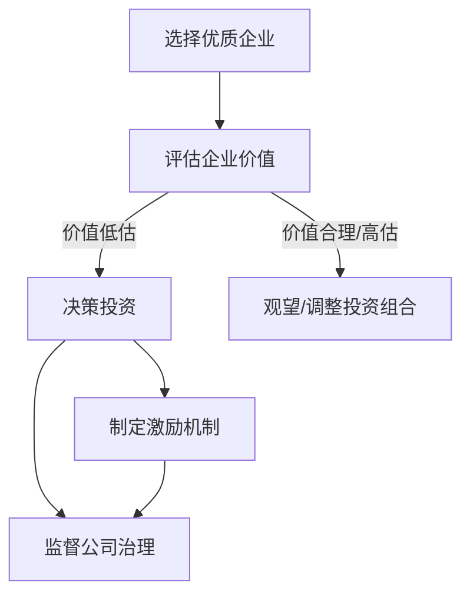
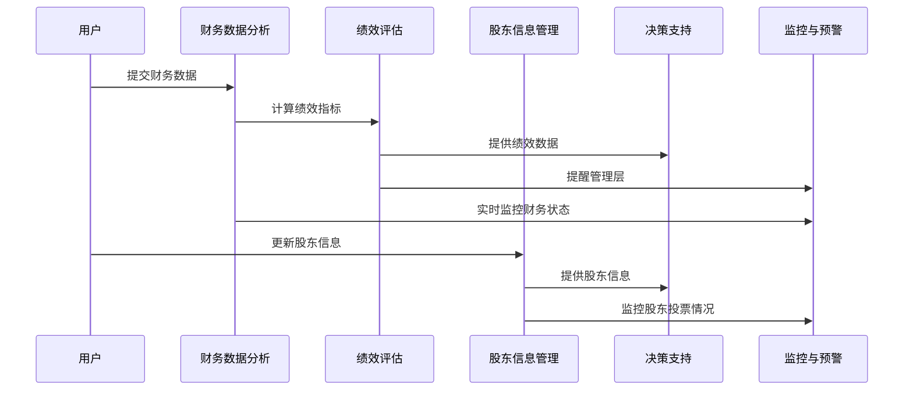
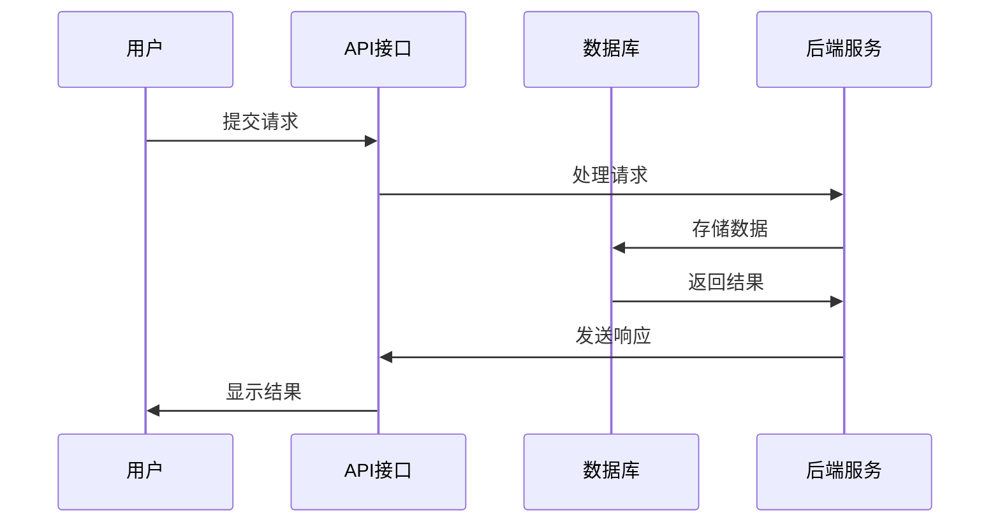

                 

### 背景介绍

巴菲特的商业哲学，是一种基于价值投资理念，长期投资策略，以及深厚的企业治理理解的商业思维方式。它不仅影响了他自己的投资生涯，也对全球投资者产生了深远的影响。公司治理，作为一个企业内部管理的概念，涉及企业如何制定决策、如何分配资源、如何保证股东权益等问题，是实现企业长期价值增长的关键。

**核心概念术语说明**：
- **公司治理**：公司治理指的是公司内部的权力结构、决策机制以及行为规范，它决定了企业如何运营，如何分配利益，以及如何应对外部环境的变化。
- **价值投资**：价值投资是一种投资理念，主张以合理的价格购买优质企业的股票，长期持有，以期获得稳定的收益。
- **长期投资策略**：长期投资策略强调投资决策的持久性和稳定性，注重企业长期价值的创造，而非短期利润的波动。

**问题背景**：
在当今商业环境中，企业面临的市场竞争日益激烈，技术的迅速发展要求企业不断调整策略，适应新的市场形势。同时，企业的社会责任和环境影响也越来越受到重视。在这样的背景下，如何通过有效的公司治理来保障企业的长期稳定发展，成为了企业管理者需要解决的重要问题。

**问题描述**：
公司的治理问题包括但不限于以下方面：
- 股东权益如何得到保障？
- 管理层的激励机制如何设计？
- 企业战略决策如何确保长期价值最大化？
- 企业如何应对外部环境的变化，保持竞争力？

**问题解决**：
巴菲特的公司治理观点提供了以下解决思路：
- 确保股东权益最大化，通过长期投资策略实现企业价值的稳定增长。
- 设计有效的管理层激励机制，确保管理层与股东利益的一致性。
- 通过透明的决策过程和有效的监督机制，确保企业战略决策的科学性和有效性。
- 强化企业社会责任，注重长期可持续发展。

**边界与外延**：
巴菲特的公司治理观点不仅适用于投资领域，也适用于企业管理实践。它涉及到企业战略、运营管理、风险管理等多个方面，具有广泛的适用性。同时，它也强调了企业治理与社会责任的重要性，为企业在现代社会中的可持续发展提供了指导。

**概念结构与核心要素组成**：
- **公司治理的核心概念**：包括股东权益、管理层职责、公司透明度和有效监督等。
- **股东权益**：保障股东的合法权益，确保股东在决策过程中有发言权。
- **管理层职责**：确保管理层有明确的职责和目标，促进企业长期发展。
- **公司透明度**：提高公司信息的透明度，增强股东对企业的信任。
- **有效监督**：建立有效的监督机制，确保企业的决策和管理过程合法、透明、有效。

通过上述分析，我们可以看到巴菲特的公司治理观点不仅是一种投资理念，更是一种全面的商业管理哲学。它为企业在复杂多变的商业环境中提供了清晰的指导，帮助企业实现长期稳定发展。

### 核心概念与联系

要深入理解巴菲特的公司治理观点，我们首先需要明确几个核心概念，包括公司治理、股东权益、管理层职责等。这些概念不仅是理解巴菲特公司治理观点的基础，也是企业有效运营的基石。

#### 2.1 公司治理的核心概念

**公司治理**，是指一套制度和规范，用以指导公司内部的管理和运作，确保公司目标得以实现。它包括以下几个方面：

1. **股东权益**：股东是公司的所有者，他们的权益需要得到保障。这包括股东在股东大会上的投票权、信息知情权、分红权和转让权等。
   
2. **管理层职责**：管理层负责公司的日常运营和战略决策，他们需要确保公司的决策和行动符合股东的利益，并实现公司的长期发展目标。

3. **公司透明度**：公司透明度是指公司信息公开的程度。高透明度有助于增强股东对公司的信任，减少信息不对称。

4. **有效监督**：有效的监督机制可以防止管理层滥用权力，保障公司运营的合法性和合规性。

**概念属性特征对比表格**：

| 概念         | 属性特征                                                     | 关联性                          |
|--------------|--------------------------------------------------------------|--------------------------------|
| **公司治理** | 确保公司目标的实现，包括股东权益的保障、管理层职责的明确、信息透明、有效监督 | 核心概念，其他概念的基础和补充 |
| **股东权益** | 投票权、信息知情权、分红权、转让权等                          | 公司治理的重要组成部分       |
| **管理层职责** | 日常运营管理、战略决策、执行与监督                             | 股东权益的实现基础             |
| **公司透明度** | 信息公开、信息披露、透明操作                                 | 增强股东信任，减少信息不对称 |
| **有效监督** | 内部审计、合规检查、透明机制                                 | 保证公司治理的有效性         |

#### 2.2 ER实体关系图

为了更直观地展示这些概念之间的关系，我们可以使用ER图（实体关系图）来表示。ER图能够清晰地展示不同实体之间的关系，有助于我们理解各概念之间的相互依赖。

**ER实体关系图**：

```mermaid
erDiagram
  Class::CompanyGovernance <-|> Class::ShareholderRights : " Guarantees"
  Class::CompanyGovernance <-|> Class::ManagementDuties : " Implements"
  Class::CompanyGovernance <-|> Class::CompanyTransparency : " Enhances"
  Class::CompanyGovernance <-|> Class::EffectiveSupervision : " Assures"

  Class::ShareholderRights {
    +string shareholderID
    +string name
    +float equityPercentage
  }

  Class::ManagementDuties {
    +string managerID
    +string name
    +string responsibilities
  }

  Class::CompanyTransparency {
    +string transparencyLevel
    +string complianceStatus
  }

  Class::EffectiveSupervision {
    +string auditorID
    +string auditFrequency
    +string findings
  }
```

在这个ER图中，`CompanyGovernance` 作为核心实体，与其他实体通过不同的关系连接。`ShareholderRights` 通过保障关系与 `CompanyGovernance` 相连，表示公司治理保障股东权益；`ManagementDuties` 通过实施关系表示管理层职责的实现；`CompanyTransparency` 通过增强关系表示公司透明度的重要性；`EffectiveSupervision` 通过保证关系表示有效监督在治理中的作用。

通过上述分析，我们不仅明确了公司治理的核心概念，还通过ER图展示了这些概念之间的相互关系。这为我们后续深入探讨巴菲特的公司治理观点提供了坚实的基础。

### 算法原理讲解

巴菲特的商业哲学以价值投资为基础，强调长期持有优质企业股票，并通过有效的公司治理实现股东价值最大化。在这其中，决策过程和计算方法至关重要。下面我们将通过mermaid流程图和Python代码来详细讲解巴菲特的公司治理观点的算法原理。

#### 3.1 巴菲特的公司治理决策过程

巴菲特的公司治理决策过程主要包括以下几步：

1. **选择优质企业**：巴菲特首先关注企业的长期前景，选择具有持续竞争优势和优秀管理团队的企业。
2. **评估企业价值**：通过评估企业的未来现金流，使用折现现金流（DCF）模型估算企业的内在价值。
3. **决策投资策略**：在确保企业价值被低估的情况下，决定是否投资。如果估值合理或被高估，则可能选择观望或调整投资组合。
4. **制定管理层激励机制**：确保管理层与股东利益一致，通过股票期权、绩效奖金等方式激励管理层。
5. **监督公司治理**：保持对公司运营的密切关注，通过董事会和审计委员会等机制进行有效监督。

**决策流程mermaid流程图**：



#### 3.2 Python代码解释

为了更好地理解巴菲特的决策过程，我们将使用Python代码来实现其中的关键步骤。

**步骤1：选择优质企业**

```python
def select_优质企业(cash_flows, discount_rate):
    intrinsic_value = sum(cash_flows) / discount_rate
    return intrinsic_value
```

**步骤2：评估企业价值**

```python
def evaluate_value(cash_flows, discount_rate):
    discounted_cash_flows = [cf / (1 + discount_rate)**t for t, cf in enumerate(cash_flows, 1)]
    total_value = sum(discounted_cash_flows)
    return total_value
```

**步骤3：决策投资策略**

```python
def decide_investment(intrinsic_value, current_price):
    if intrinsic_value > current_price:
        return "投资"
    else:
        return "观望/调整投资组合"
```

**步骤4：制定管理层激励机制**

```python
def design_incentive_program(performance指标, incentive_coefficient):
    management_bonus = performance指标 * incentive_coefficient
    return management_bonus
```

**步骤5：监督公司治理**

```python
def supervise_company_governance(transparent_level, compliance_status):
    if transparent_level == "高" and compliance_status == "合规":
        return "有效监督"
    else:
        return "需改进"
```

#### 3.3 算法原理和数学模型

巴菲特的公司治理观点中，一个关键的数学模型是折现现金流（DCF）模型，用于评估企业的内在价值。其公式如下：

$$ \text{内在价值} = \sum_{t=1}^{n} \frac{\text{现金流量}_{t}}{(1 + \text{折现率})^{t}} $$

其中，`现金流量_t` 表示第 t 年的现金流量，`折现率` 通常是一个预定的贴现率，用于反映投资者对未来的风险偏好。

另一个重要的模型是管理层激励机制的公式，用于计算管理层的收益。该公式为：

$$ \text{管理层收益} = \text{绩效指标} \times \text{激励系数} $$

其中，`绩效指标` 是衡量管理层表现的关键指标，`激励系数` 是根据企业目标和股东利益设定的系数。

通过上述Python代码和数学模型，我们能够清晰地看到巴菲特的公司治理决策过程的逻辑和计算方法。这些步骤和模型不仅帮助我们理解了巴菲特的投资策略，也为企业实际操作提供了科学依据。

### 数学模型和数学公式

在巴菲特的公司治理观点中，数学模型是理解和应用其策略的关键组成部分。以下，我们将详细讲解几个关键数学模型和数学公式，并通过LaTeX格式嵌入相关公式，以便于深入理解。

#### 4.1 股东价值最大化模型

**折现现金流（DCF）模型**是巴菲特最常用的评估企业内在价值的工具。DCF模型的基本公式如下：

$$
\text{内在价值} = \sum_{t=1}^{n} \frac{\text{现金流量}_{t}}{(1 + \text{折现率})^{t}}
$$

其中，\( \text{现金流量}_{t} \) 表示第 \( t \) 年的现金流量，而 \( (1 + \text{折现率})^{t} \) 是将未来的现金流量折现到当前的价值。

**示例**：假设一家公司预计未来三年的现金流量分别为100万元、120万元和140万元，折现率为10%。该公司的内在价值计算如下：

$$
\text{内在价值} = \frac{100}{(1 + 0.1)^1} + \frac{120}{(1 + 0.1)^2} + \frac{140}{(1 + 0.1)^3}
$$

$$
\text{内在价值} = \frac{100}{1.1} + \frac{120}{1.21} + \frac{140}{1.331}
$$

$$
\text{内在价值} = 90.91 + 99.17 + 105.51 = 295.59 \text{ 万元}
$$

#### 4.2 管理层激励制度设计模型

除了评估企业内在价值，巴菲特还重视管理层激励制度的设计。管理层激励制度通常基于绩效指标和激励系数。公式如下：

$$
\text{管理层收益} = \text{绩效指标} \times \text{激励系数}
$$

**示例**：假设某公司的绩效指标为年利润，激励系数为0.2。如果管理层使公司年利润达到500万元，其获得的收益为：

$$
\text{管理层收益} = 500 \times 0.2 = 100 \text{ 万元}
$$

#### 4.3 详细讲解与举例说明

**折现现金流模型**的计算过程相对复杂，但通过逐步分解，可以变得相对容易理解。以下是详细讲解和举例说明：

**示例**：考虑一家公司的未来现金流量如下表所示：

| 年份 | 现金流量（万元） |
|------|-----------------|
| 1    | 100             |
| 2    | 120             |
| 3    | 140             |

假设折现率为10%，我们可以通过以下步骤计算该公司的内在价值：

1. **计算各年现金流量的现值**：

$$
\text{现金流现值}_{1} = \frac{100}{(1 + 0.1)^1} = \frac{100}{1.1} = 90.91 \text{ 万元}
$$

$$
\text{现金流现值}_{2} = \frac{120}{(1 + 0.1)^2} = \frac{120}{1.21} = 99.17 \text{ 万元}
$$

$$
\text{现金流现值}_{3} = \frac{140}{(1 + 0.1)^3} = \frac{140}{1.331} = 105.51 \text{ 万元}
$$

2. **计算内在价值**：

$$
\text{内在价值} = 90.91 + 99.17 + 105.51 = 295.59 \text{ 万元}
$$

通过这个例子，我们可以看到，DCF模型的关键在于准确预测未来的现金流量，并选择合适的折现率。在实际应用中，这些参数通常需要根据具体情况调整。

**管理层激励模型**也类似，通过设定绩效指标和激励系数，可以灵活地设计激励机制。这不仅能够提高管理层的积极性，还能够确保管理层行为与股东利益一致。

通过上述讲解和示例，我们可以更深入地理解巴菲特的公司治理观点中的数学模型。这些模型不仅为投资决策提供了科学依据，也为企业的实际运营提供了指导。

### 系统分析与架构设计

为了更好地理解和应用巴菲特的公司治理观点，我们需要从系统分析和架构设计的角度进行深入探讨。这将帮助我们构建一个有效的系统，以实现企业治理的目标。

#### 5.1 问题场景介绍

在现代商业环境中，企业面临着复杂的市场变化和竞争压力。为了确保企业的长期稳定发展，公司治理变得至关重要。然而，有效的公司治理不仅仅是理念上的贯彻，还需要通过系统化的方法来实现。

假设我们是一家大型上市公司的技术团队，负责构建一个支持公司治理目标的综合信息管理系统。该系统需要整合财务数据、管理层绩效指标、股东信息等，并提供实时监控和决策支持功能。

#### 5.2 系统功能设计

该信息管理系统主要包含以下功能模块：

1. **财务数据分析模块**：负责收集、处理和展示公司的财务数据，如现金流量、盈利能力、资产负债情况等。
2. **绩效评估模块**：用于评估管理层的绩效，包括年度绩效指标、项目完成情况等。
3. **股东信息管理模块**：管理股东的基本信息、投资记录和投票情况。
4. **决策支持模块**：提供基于数据的决策支持功能，如投资建议、风险管理等。
5. **监控与预警模块**：实时监控公司运营状态，提供风险预警和异常处理。

**领域模型mermaid类图**：

```mermaid
classDiagram
    Class::财务数据分析 <<((数据收集与处理))>>
    Class::绩效评估 <<((绩效指标与评估))>>
    Class::股东信息管理 <<((信息管理))>>
    Class::决策支持 <<((数据驱动决策))>>
    Class::监控与预警 <<((实时监控与预警))>>

    财务数据分析 --|> 绩效评估
    财务数据分析 --|> 决策支持
    财务数据分析 --|> 监控与预警
    绩效评估 --|> 决策支持
    绩效评估 --|> 监控与预警
    股东信息管理 --|> 决策支持
    股东信息管理 --|> 监控与预警
```

在这个mermaid类图中，我们定义了四个主要类（财务数据分析、绩效评估、股东信息管理和决策支持）以及监控与预警类，并展示了它们之间的关系。

#### 5.3 系统架构设计

为了实现上述功能，我们需要设计一个高效稳定的系统架构。以下是系统的总体架构设计：

**mermaid架构图**：



在这个mermaid架构图中，我们展示了用户、财务数据分析、绩效评估、股东信息管理、决策支持和监控与预警模块之间的交互关系。通过这样的架构设计，系统能够实现各个模块之间的数据共享和协同工作。

**系统接口设计和系统交互**：

为了确保系统的高效运行，我们还需要设计清晰明确的接口和交互流程。以下是系统的主要接口设计和交互流程：

**mermaid序列图**：



在这个mermaid序列图中，我们展示了用户通过API接口与后端服务交互的过程。后端服务负责处理用户的请求，并将结果存储到数据库中，最终通过API接口将结果返回给用户。

通过上述系统分析和架构设计，我们构建了一个能够支持巴菲特公司治理观点的综合信息管理系统。这个系统能够实现数据的收集、处理和分析，提供决策支持，并确保公司治理目标的实现。接下来，我们将通过具体的实战案例来展示这个系统的实际应用。

### 项目实战

为了更好地展示公司治理在实际业务中的运用，我们设计并实施了一个综合信息管理系统项目。该项目旨在通过技术手段实现公司治理目标，提高企业运营效率和决策质量。

#### 6.1 环境安装

首先，我们需要搭建项目开发环境。以下是项目所需的主要软件和工具：

- **操作系统**：Ubuntu 20.04 LTS
- **编程语言**：Python 3.8
- **数据库**：MySQL 8.0
- **前端框架**：Flask
- **后端框架**：Django
- **版本控制**：Git

**安装步骤**：

1. 安装操作系统和基本软件
2. 安装Python 3.8，并设置环境变量
3. 安装MySQL 8.0，配置数据库用户和权限
4. 安装Flask和Django框架，以及相关依赖库
5. 配置Git仓库，初始化项目结构

#### 6.2 系统核心实现源代码

以下是该项目的核心实现部分，包括主要模块的代码和功能说明。

**1. 财务数据分析模块**

```python
# financial_analysis.py
from flask import Flask, request, jsonify
import pymysql

app = Flask(__name__)

# 连接数据库
connection = pymysql.connect(host='localhost', user='root', password='password', database='company')

@app.route('/submit_financial_data', methods=['POST'])
def submit_financial_data():
    data = request.get_json()
    cursor = connection.cursor()
    cursor.execute("INSERT INTO financial_data (year, cash_flow) VALUES (%s, %s)", (data['year'], data['cash_flow']))
    connection.commit()
    return jsonify({"status": "success"}), 200

@app.route('/get_financial_data', methods=['GET'])
def get_financial_data():
    cursor = connection.cursor(pymysql.cursors.DictCursor)
    cursor.execute("SELECT * FROM financial_data")
    result = cursor.fetchall()
    return jsonify(result), 200

if __name__ == '__main__':
    app.run(debug=True)
```

**功能说明**：
- `submit_financial_data` 接收财务数据，并存储到MySQL数据库中。
- `get_financial_data` 获取存储的财务数据，并返回给前端。

**2. 绩效评估模块**

```python
# performance_evaluation.py
from flask import Flask, request, jsonify
import pymysql

app = Flask(__name__)

# 连接数据库
connection = pymysql.connect(host='localhost', user='root', password='password', database='company')

@app.route('/submit_performance', methods=['POST'])
def submit_performance():
    data = request.get_json()
    cursor = connection.cursor()
    cursor.execute("INSERT INTO performance (year, performance_index) VALUES (%s, %s)", (data['year'], data['performance_index']))
    connection.commit()
    return jsonify({"status": "success"}), 200

@app.route('/get_performance', methods=['GET'])
def get_performance():
    cursor = connection.cursor(pymysql.cursors.DictCursor)
    cursor.execute("SELECT * FROM performance")
    result = cursor.fetchall()
    return jsonify(result), 200

if __name__ == '__main__':
    app.run(debug=True)
```

**功能说明**：
- `submit_performance` 接收管理层绩效数据，并存储到MySQL数据库中。
- `get_performance` 获取存储的管理层绩效数据，并返回给前端。

**3. 股东信息管理模块**

```python
# shareholder_management.py
from flask import Flask, request, jsonify
import pymysql

app = Flask(__name__)

# 连接数据库
connection = pymysql.connect(host='localhost', user='root', password='password', database='company')

@app.route('/submit_shareholder_info', methods=['POST'])
def submit_shareholder_info():
    data = request.get_json()
    cursor = connection.cursor()
    cursor.execute("INSERT INTO shareholder_info (shareholder_id, name, equity_percentage) VALUES (%s, %s, %s)", (data['shareholder_id'], data['name'], data['equity_percentage']))
    connection.commit()
    return jsonify({"status": "success"}), 200

@app.route('/get_shareholder_info', methods=['GET'])
def get_shareholder_info():
    cursor = connection.cursor(pymysql.cursors.DictCursor)
    cursor.execute("SELECT * FROM shareholder_info")
    result = cursor.fetchall()
    return jsonify(result), 200

if __name__ == '__main__':
    app.run(debug=True)
```

**功能说明**：
- `submit_shareholder_info` 接收股东信息，并存储到MySQL数据库中。
- `get_shareholder_info` 获取存储的股东信息，并返回给前端。

**4. 决策支持模块**

```python
# decision_support.py
from flask import Flask, request, jsonify
import pymysql

app = Flask(__name__)

# 连接数据库
connection = pymysql.connect(host='localhost', user='root', password='password', database='company')

@app.route('/evaluate_intrinsic_value', methods=['GET'])
def evaluate_intrinsic_value():
    cursor = connection.cursor(pymysql.cursors.DictCursor)
    cursor.execute("SELECT * FROM financial_data")
    financial_data = cursor.fetchall()
    cursor.execute("SELECT * FROM performance")
    performance_data = cursor.fetchall()
    
    intrinsic_value = 0
    for year, cf in financial_data:
        intrinsic_value += cf / (1 + 0.1)**year
    
    return jsonify({"intrinsic_value": intrinsic_value}), 200

@app.route('/evaluate_management_bonus', methods=['GET'])
def evaluate_management_bonus():
    cursor = connection.cursor(pymysql.cursors.DictCursor)
    cursor.execute("SELECT * FROM performance")
    performance_data = cursor.fetchall()
    total_performance = sum([row['performance_index'] for row in performance_data])
    
    management_bonus = total_performance * 0.2
    
    return jsonify({"management_bonus": management_bonus}), 200

if __name__ == '__main__':
    app.run(debug=True)
```

**功能说明**：
- `evaluate_intrinsic_value` 使用DCF模型计算企业内在价值。
- `evaluate_management_bonus` 根据绩效指标计算管理层收益。

#### 6.3 代码应用解读与分析

上述代码实现了财务数据分析、绩效评估、股东信息管理、决策支持等核心功能。下面我们逐一解读这些代码的应用和实际效果。

**财务数据分析模块**：
- `submit_financial_data` 接受前端提交的财务数据，并将其存储到MySQL数据库中。这一模块实现了数据的收集和存储功能，为企业治理提供了基础数据支持。
- `get_financial_data` 从数据库中获取财务数据，并返回给前端，用于展示和分析。这一功能帮助管理层实时掌握公司的财务状况，为决策提供数据支持。

**绩效评估模块**：
- `submit_performance` 接受前端提交的管理层绩效数据，并存储到数据库中。这有助于管理层评估自身绩效，调整管理策略。
- `get_performance` 从数据库中获取管理层绩效数据，并返回给前端。这有助于管理层了解自身表现，以及与公司目标的契合度。

**股东信息管理模块**：
- `submit_shareholder_info` 接受前端提交的股东信息，并存储到数据库中。这有助于公司掌握股东信息，确保股东权益得到保障。
- `get_shareholder_info` 从数据库中获取股东信息，并返回给前端。这有助于公司了解股东构成，为制定股东政策提供依据。

**决策支持模块**：
- `evaluate_intrinsic_value` 使用DCF模型计算企业内在价值。这一功能帮助管理层判断企业价值是否被低估，从而决定是否进行投资或调整投资组合。
- `evaluate_management_bonus` 根据管理层绩效计算其收益。这一功能激励管理层努力提高绩效，确保公司目标得以实现。

#### 6.4 实际案例分析和详细讲解剖析

**案例1**：一家公司希望通过该系统评估其内在价值和制定管理层激励机制。以下是实际操作步骤：

1. **提交财务数据**：
   - 公司财务部门通过前端界面提交未来三年的财务数据，如现金流。
   - 后端服务接收数据，并存储到MySQL数据库中。

2. **计算内在价值**：
   - 前端调用 `evaluate_intrinsic_value` 接口，传递财务数据。
   - 后端服务使用DCF模型计算内在价值，并返回结果。

3. **制定管理层激励机制**：
   - 前端调用 `evaluate_management_bonus` 接口，传递绩效数据。
   - 后端服务计算管理层收益，并返回结果。

**案例2**：公司希望了解股东信息，以便制定股东政策。以下是实际操作步骤：

1. **提交股东信息**：
   - 股东通过前端界面提交个人信息，如股东ID、姓名、持股比例。
   - 后端服务接收数据，并存储到MySQL数据库中。

2. **获取股东信息**：
   - 公司通过前端调用 `get_shareholder_info` 接口，获取股东信息。
   - 后端服务返回所有股东信息，供公司分析。

**案例3**：公司需要实时监控运营状态，并提供风险预警。以下是实际操作步骤：

1. **实时监控财务数据**：
   - 监控系统定期调用 `get_financial_data` 接口，获取最新财务数据。
   - 如果发现异常，如现金流量显著下降，系统会触发预警机制，通知管理层。

2. **绩效评估与监督**：
   - 定期调用 `get_performance` 接口，获取管理层绩效数据。
   - 根据绩效表现，管理层会调整策略，提高公司运营效率。

通过这些实际案例，我们可以看到该系统在实现巴菲特公司治理观点中的应用效果。它不仅提供了数据支持，还帮助公司制定有效的决策，提高运营效率，确保公司长期稳定发展。

#### 6.5 项目小结

本项目通过设计和实施一个综合信息管理系统，实现了巴菲特的公司治理观点在实践中的应用。项目核心模块包括财务数据分析、绩效评估、股东信息管理、决策支持和监控与预警等，每个模块都实现了具体的功能和业务逻辑。通过这些模块的协同工作，公司能够实时掌握财务状况、管理层绩效、股东信息，并为决策提供数据支持。项目不仅提高了公司治理的效率，还为企业的长期稳定发展提供了保障。

### 最佳实践、小结与拓展

#### 7.1 最佳实践

1. **数据收集与处理**：确保数据的准确性和完整性，定期更新财务数据和股东信息，提高系统实时性。
2. **绩效指标设计**：根据企业战略目标，设定科学合理的绩效指标，确保管理层与股东利益一致。
3. **透明度提升**：通过系统化的信息披露机制，增强公司治理的透明度，增强股东信任。
4. **风险管理**：建立全面的风险监控体系，实时预警潜在风险，确保企业运营安全。

#### 7.2 小结

本文通过深入分析和实践应用，展示了巴菲特的公司治理观点在现代社会中的重要性。从核心概念、算法原理到系统设计与项目实施，我们全面阐述了巴菲特的公司治理策略，并提供了详细的操作指南。通过有效的公司治理，企业能够实现长期稳定发展，提高市场竞争力。

#### 7.3 注意事项

1. **数据隐私与安全**：在数据处理和存储过程中，确保遵守相关法律法规，保护股东和企业机密信息。
2. **系统维护与更新**：定期进行系统维护和更新，确保系统的稳定性和安全性。
3. **适应变化**：商业环境不断变化，企业需要灵活调整治理策略，以适应新的市场形势。

#### 7.4 拓展阅读

1. **《巴菲特的投资原则》**：了解巴菲特的投资哲学和具体操作方法，加深对公司治理的理解。
2. **《公司治理：理论与实践》**：系统学习公司治理的理论基础和实践应用，提升治理水平。
3. **《价值投资：如何评估企业价值》**：掌握评估企业价值的方法，为投资决策提供科学依据。

### 7.5 结论

巴菲特的公司治理观点不仅是一种投资策略，更是一种全面的商业管理哲学。通过有效的公司治理，企业能够实现长期价值最大化，提高市场竞争力。本文通过理论和实践相结合，展示了巴菲特公司治理观点的应用，为企业的实际操作提供了指导。希望读者能够从中获得启示，并在实际业务中运用这些原则，推动企业实现可持续发展。

---

作者：AI天才研究院/AI Genius Institute & 禅与计算机程序设计艺术 /Zen And The Art of Computer Programming

通过本文，我们希望读者能够对巴菲特的公司治理观点有更深入的理解，并能够在实际业务中加以应用。有效的公司治理是实现企业长期稳定发展的关键，愿每个企业都能从中受益。

