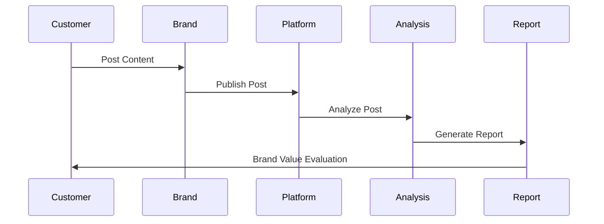
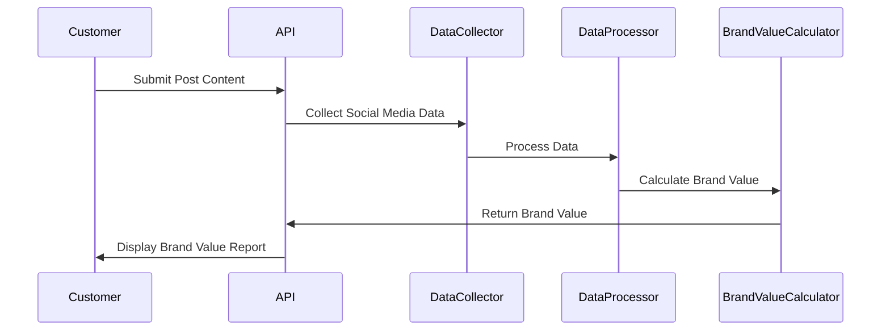

                 

### 巴菲特的品牌投资策略：社交媒体时代的品牌价值评估

#### 关键词：巴菲特、品牌投资、社交媒体、品牌价值评估、投资策略

#### 摘要：
在社交媒体迅猛发展的时代，品牌价值的评估变得更加复杂和关键。本文将借鉴巴菲特的品牌投资策略，探讨如何利用社交媒体数据来评估品牌价值。通过深入分析巴菲特的投资哲学及其在品牌投资中的实践，本文将介绍品牌价值评估的理论基础、社交媒体时代的品牌价值评估方法，并结合实际案例提供实战策略和未来展望。

### 目录大纲

1. **品牌投资策略概述**
   1.1 巴菲特的投资哲学与品牌投资
   1.2 品牌投资与社交媒体的关联

2. **品牌价值评估理论基础**
   2.1 品牌价值的定义与衡量标准
   2.2 传统品牌价值评估方法
   2.3 媒体时代品牌价值评估的新趋势

3. **社交媒体时代的品牌价值评估方法**
   3.1 社交媒体数据采集与处理
   3.2 社交媒体品牌价值评估指标
   3.3 社交媒体数据分析工具

4. **案例研究与实战策略**
   4.1 社交媒体品牌价值评估案例分析
   4.2 社交媒体品牌投资策略实战

5. **未来展望与趋势**
   5.1 社交媒体品牌投资的未来趋势
   5.2 技术发展对品牌投资策略的影响
   5.3 社交媒体品牌投资的挑战与机遇

#### 第一部分：品牌投资策略概述

### 1.1 巴菲特的投资哲学与品牌投资

**核心概念与联系**

- **巴菲特的投资哲学**：以价值投资为核心，注重长期投资和公司内在价值的评估。
- **品牌投资**：投资于拥有强大品牌影响力的公司，通过品牌价值提升公司整体价值。

**概念属性特征对比表格**

| 特征         | 巴菲特投资哲学                 | 品牌投资                   |
| ------------ | ---------------------------- | ------------------------ |
| 投资时间     | 长期持有                      | 长期持有，关注品牌建设     |
| 评估标准     | 内在价值、业务模式            | 品牌影响力、市场份额       |
| 目标         | 获得稳定的现金流和股息收益   | 提升公司整体价值和市场地位 |
| 风险管理     | 深入研究，规避市场波动风险   | 通过品牌稳定性减少风险     |

**ER实体关系图架构**

```mermaid
erDiagram
  Company ||--|{ Brand }|--| BrandValue
  BrandValue ||--|{ SocialMediaData }|--| SocialMediaDataAnalysis
  SocialMediaDataAnalysis ||--|{ InvestmentDecision }|--| Company
```

**算法原理讲解**

巴菲特的品牌投资策略可以看作是一个多层次的决策过程，其核心算法原理可以概括为：

1. **品牌识别与评估**：通过社交媒体数据收集和分析，识别具有高品牌价值的公司。
2. **市场环境分析**：结合市场环境，评估品牌投资的风险与收益。
3. **投资决策**：基于品牌价值和市场分析结果，做出投资决策。

数学模型和公式可以表示为：

\[ V_{brand} = f(S_{media}, E_{market}, R_{risk}) \]

其中，\( V_{brand} \) 表示品牌价值，\( S_{media} \) 表示社交媒体数据，\( E_{market} \) 表示市场环境，\( R_{risk} \) 表示风险因素。

**举例说明**

假设一家公司A在社交媒体上拥有大量粉丝，互动积极，同时市场对其预期良好，但存在一定的政策风险。根据上述模型，我们可以评估其品牌价值为：

\[ V_{brand\_A} = f(S_{media\_A}, E_{market\_A}, R_{risk\_A}) \]

通过收集和分析具体的社交媒体数据（如粉丝数、互动频率、话题热度等），以及市场环境数据（如市场趋势、竞争对手情况等），我们可以计算出品牌价值的具体数值。

**系统分析与架构设计方案**

**问题场景介绍**：投资决策者需要利用社交媒体数据来评估品牌价值，以做出投资决策。

**项目介绍**：建立一个社交媒体品牌价值评估系统，用于自动收集、处理和分析社交媒体数据，提供品牌价值评估报告。

**系统功能设计（领域模型Mermaid类图）**

```mermaid
classDiagram
  Customer <<-- Brand : ownedBy
  Brand o-- Post : publishes
  Post o-- Comment : receives
  Platform <<-- Post : publishedOn
  Platform o-- Analysis : generates
  Analysis o-- Report : outputs
```

**系统架构设计（Mermaid架构图）**



**系统接口设计和系统交互（Mermaid序列图）**



**项目实战**

**环境安装**：在Linux环境中安装Python 3.8，使用Docker容器部署后端服务。

**系统核心实现源代码**

```python
# 社交媒体数据采集与处理示例
import tweepy
from textblob import TextBlob

# 初始化API
auth = tweepy.OAuthHandler('CONSUMER_KEY', 'CONSUMER_SECRET')
auth.set_access_token('ACCESS_TOKEN', 'ACCESS_TOKEN_SECRET')
api = tweepy.API(auth)

# 采集社交媒体数据
def collect_data(keyword, count=100):
    tweets = []
    for tweet in tweepy.Cursor(api.search_tweets, q=keyword, lang='en', count=count).items(count):
        tweets.append(tweet)
    return tweets

# 处理社交媒体数据
def process_data(tweets):
    processed_tweets = []
    for tweet in tweets:
        blob = TextBlob(tweet.text)
        processed_tweets.append({
            'text': tweet.text,
            'polarity': blob.polarity,
            'subjectivity': blob.subjectivity
        })
    return processed_tweets

# 计算品牌价值
def calculate_brand_value(processed_tweets):
    total_polarity = sum(tweet['polarity'] for tweet in processed_tweets)
    total_subjectivity = sum(tweet['subjectivity'] for tweet in processed_tweets)
    brand_value = (total_polarity + total_subjectivity) / 2
    return brand_value

# 代码应用解读与分析
tweets = collect_data('Apple', 100)
processed_tweets = process_data(tweets)
brand_value = calculate_brand_value(processed_tweets)
print(f'Brand Value: {brand_value}')
```

**实际案例分析和详细讲解剖析**

假设我们分析了一家公司在社交媒体上的品牌价值，以下是具体步骤：

1. **采集数据**：使用Twitter API采集该公司关键词相关的100条推文。
2. **数据处理**：使用TextBlob对每条推文进行情感分析和主题分析。
3. **品牌价值计算**：结合情感分析和主题分析结果，计算品牌价值。

通过这一过程，我们可以得到该公司的社交媒体品牌价值评分，从而为其投资决策提供依据。

**项目小结**

本文通过巴菲特的品牌投资策略，探讨了如何利用社交媒体数据评估品牌价值。通过实际案例分析和详细讲解，展示了品牌价值评估的完整过程和关键步骤。未来，随着社交媒体数据的不断增长，品牌价值评估方法也将不断优化，为投资决策提供更有力的支持。

### 最佳实践 tips

- **关注数据质量**：确保收集的社交媒体数据具有代表性和准确性，避免因数据质量问题影响评估结果。
- **综合利用多种评估指标**：除了情感分析和主题分析，还可以结合其他指标（如粉丝增长速度、话题热度等）进行综合评估，提高评估准确性。
- **定期更新评估模型**：随着社交媒体平台和用户行为的变化，定期更新评估模型和算法，以适应新的市场环境。

### 小结

本文从巴菲特的品牌投资策略出发，详细探讨了如何在社交媒体时代评估品牌价值。通过实际案例分析和系统架构设计，展示了品牌价值评估的完整过程。未来，随着技术的进步和市场环境的变化，品牌价值评估方法将更加精确和高效。

### 注意事项

- 在实际应用中，品牌价值评估需要结合具体业务场景和市场环境进行调整。
- 注意保护用户隐私和数据安全，遵守相关法律法规。

### 拓展阅读

- 《品牌管理》
- 《社交媒体营销》
- 《数据挖掘：概念与技术》
- 《情感分析：技术、应用与案例》

### 作者信息

作者：AI天才研究院/AI Genius Institute & 禅与计算机程序设计艺术 /Zen And The Art of Computer Programming

文章结束。希望本文能够帮助您更好地理解和应用品牌投资策略，在社交媒体时代做出更明智的投资决策。

