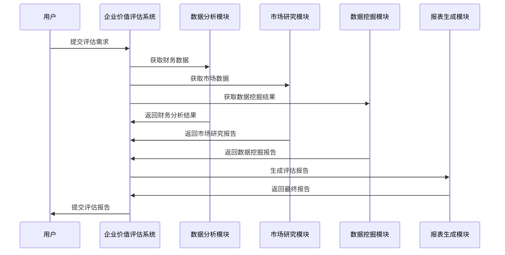
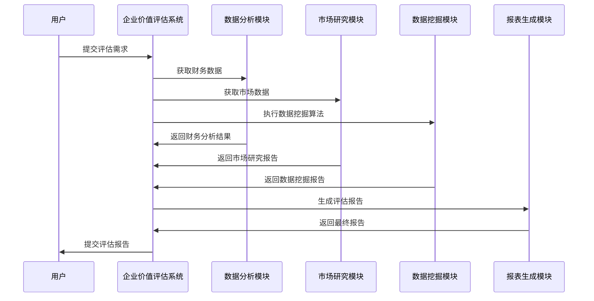

                 

# 巴菲特的商业分析方法论

> 关键词：巴菲特、商业分析、投资策略、价值投资、长期投资

> 摘要：本文将深入探讨巴菲特的商业分析方法论，从其核心概念、原理到实战技巧，全方位解析这位投资大师的独特投资策略。文章旨在帮助读者理解巴菲特商业分析的方法，掌握其在投资决策中的实际应用，从而提升个人投资能力。

## 第一部分：引言与背景介绍

### 第1章：问题背景与问题描述

巴菲特，作为全球首富之一，其投资的成功得益于其独特的商业分析方法。本文将围绕巴菲特的商业分析方法进行探讨，旨在揭示其成功的核心要素，以及如何将其应用于实际投资决策中。

- **1.1 巴菲特的成功与商业分析的重要性**

巴菲特的投资哲学强调价值投资和长期投资，他在多年的投资实践中积累了丰富的经验和深厚的理论。商业分析作为其投资决策的核心工具，贯穿于其整个投资过程。

- **1.2 商业分析方法的演变与现状**

商业分析方法经历了从传统到现代的演变，从简单的财务报表分析到复杂的数据分析技术。现代商业分析更加强调数据驱动和量化分析，为投资决策提供了更精准的依据。

- **1.3 巴菲特的商业分析方法的独特性**

巴菲特的商业分析方法与其他投资策略相比，具有独特的优势。他注重企业价值的深层次挖掘，通过长期持有优质资产来实现投资回报。这种方法不仅适用于股票投资，也适用于其他资产类别。

- **1.4 阅读本书的预期收益**

本文旨在帮助读者：

1. 理解巴菲特的投资哲学和商业分析方法；
2. 掌握商业分析的核心概念和原理；
3. 学习如何将巴菲特的方法应用于实际投资决策中；
4. 提升个人投资能力和风险控制能力。

本文适用于所有对投资有兴趣的读者，无论是新手还是资深投资者，都能从中受益。

## 第二部分：巴菲特的商业分析方法概述

### 第2章：核心概念与联系

商业分析是一门综合性学科，涵盖了多个领域。巴菲特的商业分析方法，以价值投资、长期投资和抵押借贷为核心，通过深入分析企业的财务状况、市场前景和竞争优势，实现投资决策的精准化。

- **2.1 商业分析的基础概念**

商业分析的基础概念包括企业价值评估、财务分析和市场研究。企业价值评估是企业投资决策的重要依据，财务分析帮助投资者理解企业的财务状况，市场研究则提供了对市场趋势和竞争环境的洞察。

- **2.2 巴菲特商业分析方法的核心要素**

巴菲特商业分析方法的核心要素是价值投资、长期投资和抵押借贷。价值投资关注企业的内在价值，长期投资强调投资决策的持续性和稳定性，抵押借贷则提供了资金流动性的保障。

- **2.3 巴菲特商业分析方法之间的联系**

企业价值评估、财务分析和市场研究是巴菲特商业分析方法的重要组成部分，它们相互联系，共同构成了其投资决策的完整体系。企业价值评估为投资决策提供了基础数据，财务分析帮助投资者理解企业的财务健康状况，市场研究则为投资者提供了市场趋势和竞争环境的洞察。

## 第三部分：巴菲特的商业分析方法原理详解

### 第3章：企业价值评估原理

企业价值评估是巴菲特商业分析的核心。它涉及对企业的财务状况、市场前景和竞争优势进行综合分析，以确定企业的内在价值。

- **3.1 企业价值评估的基本原理**

企业价值评估的基本原理包括净现值法（NPV）和股权现金流量折现法（DCF）。NPV法通过计算企业未来现金流的现值，扣除初始投资成本，得出企业的内在价值。DCF法则通过预测企业未来现金流，按照适当的折现率计算其现值，得出企业的内在价值。

- **3.2 企业价值评估的实践应用**

企业价值评估的实践应用包括市场比较法。市场比较法通过比较类似企业的市场价值，评估目标企业的价值。这种方法适用于市场活跃、交易频繁的行业。

### 第4章：财务分析原理

财务分析是巴菲特商业分析的重要组成部分。它通过分析企业的财务报表，了解企业的财务状况，为投资决策提供依据。

- **4.1 财务分析的基本方法**

财务分析的基本方法包括毛利率分析、净利润分析和财务比率分析。毛利率分析关注企业的盈利能力，净利润分析关注企业的净利润水平，财务比率分析则通过多个财务指标，全面评估企业的财务健康状况。

- **4.2 财务分析的应用技巧**

财务分析的应用技巧包括偿债能力与盈利能力的评估。偿债能力评估企业的债务风险，盈利能力评估企业的盈利水平。这些指标对于投资者了解企业的财务状况至关重要。

### 第5章：市场研究原理

市场研究是巴菲特商业分析的重要环节。它通过分析市场趋势、竞争对手和市场需求，为投资决策提供市场洞察。

- **5.1 市场研究的基本概念**

市场研究的基本概念包括市场细分、市场需求预测和竞争对手分析。市场细分帮助企业识别目标客户群体，市场需求预测帮助企业预测市场趋势，竞争对手分析帮助企业了解市场竞争状况。

- **5.2 市场研究的实际操作**

市场研究的实际操作包括调研方法和数据分析。调研方法包括问卷调查、深度访谈和焦点小组讨论等。数据分析则通过统计方法和数据挖掘技术，提取市场信息。

## 第四部分：巴菲特的商业分析方法实战

### 第6章：案例实战

通过经典投资案例，我们可以更深入地理解巴菲特的商业分析方法。

- **6.1 华特迪士尼公司的投资案例**

巴菲特于1990年代初对华特迪士尼公司进行了投资。通过深入分析迪士尼的财务报表、市场前景和竞争优势，巴菲特发现迪士尼具有强大的品牌价值和稳定的现金流。在市场低谷时，巴菲特果断增持，最终实现了巨大的投资回报。

- **6.2 可口可乐公司的投资案例**

巴菲特在1988年投资可口可乐公司，这一投资持续至今。可口可乐作为全球饮料巨头，具有强大的品牌影响力和稳定的现金流。巴菲特通过价值投资和长期投资策略，成功捕捉了可口可乐的投资机会。

### 第7章：实战技巧与经验分享

巴菲特的商业分析方法不仅依赖于理论，更需要实战技巧和经验积累。

- **7.1 投资策略的实战技巧**

巴菲特的投资策略包括：

1. 选择具有长期增长潜力的企业；
2. 深入分析企业的财务状况和竞争优势；
3. 保持长期投资心态，避免短期波动的影响。

- **7.2 商业分析方法的实践经验分享**

巴菲特的投资经验包括：

1. 深入研究企业基本面，关注长期价值；
2. 耐心等待市场低谷，把握投资机会；
3. 保持独立思考和冷静决策，避免跟风。

## 第五部分：总结与展望

### 第8章：总结与展望

巴菲特的商业分析方法在长期实践中得到了验证，其独特的价值投资和长期投资策略为投资者提供了可靠的指导。然而，随着市场环境的变化，巴菲特的方法也需要不断调整和优化。

- **8.1 巴菲特商业分析方法的应用前景**

巴菲特商业分析方法在以下方面具有广泛应用前景：

1. 股票投资：通过深入分析企业基本面，选择具有长期增长潜力的股票；
2. 固定收益投资：通过分析债券和金融产品的财务状况和风险收益特征，选择合适的投资对象；
3. 其他资产类别：如房地产、商品等，也可以通过巴菲特的方法进行投资决策。

- **8.2 阅读本书后的进一步学习建议**

为了更好地应用巴菲特的方法，读者可以：

1. 深入学习财务报表分析、财务建模和市场分析等相关知识；
2. 实践投资，积累实战经验；
3. 关注市场动态，调整投资策略。

## 结束语

巴菲特的商业分析方法不仅是一种投资策略，更是一种生活态度。通过深入学习和实践，我们可以掌握这种方法，实现财富的长期增值。让我们以巴菲特为榜样，不断追求投资的成功和生活的美好。

### 作者信息

作者：AI天才研究院/AI Genius Institute & 禅与计算机程序设计艺术 /Zen And The Art of Computer Programming

感谢您的阅读，希望本文能对您的投资之路有所启发。如果您有任何疑问或建议，欢迎在评论区留言。再次感谢您的支持！## 引言与背景介绍

### 第1章：问题背景与问题描述

巴菲特的商业分析方法论，源于其对价值投资的深刻理解和长期实践。作为全球最成功的投资者之一，巴菲特的投资哲学不仅影响了无数个人投资者，也为众多专业投资者提供了宝贵的经验。本文将围绕巴菲特的商业分析方法进行深入探讨，旨在揭示其独特投资策略背后的逻辑和原理，帮助读者更好地理解和应用这一方法。

### 1.1 巴菲特的成功与商业分析的重要性

沃伦·巴菲特，被誉为“股神”，其投资生涯中的卓越表现让世人瞩目。巴菲特的成功并非偶然，而是源于他独特的投资哲学和严谨的商业分析方法。巴菲特的投资哲学核心是“价值投资”，即寻找那些被市场低估的优质公司，并在合适的时机买入并长期持有。这一哲学不仅帮助他在股市中取得了丰硕的成果，也使他在投资界享有盛誉。

商业分析在巴菲特的投资决策中扮演了至关重要的角色。商业分析涉及对企业财务状况、市场前景和竞争优势的深入分析，以确定企业的内在价值。巴菲特通过商业分析，能够准确判断企业是否具有投资潜力，从而做出明智的投资决策。具体来说，巴菲特的商业分析方法包括以下几个方面：

1. **企业价值评估**：巴菲特通过企业价值评估，确定企业的内在价值。他采用净现值法（NPV）和股权现金流量折现法（DCF）等模型，对企业未来的现金流进行预测和折现，以评估企业的实际价值。

2. **财务分析**：巴菲特通过分析企业的财务报表，了解企业的盈利能力、偿债能力和经营效率。他关注企业的毛利率、净利润率、资产负债率等关键财务指标，以评估企业的财务健康状况。

3. **市场研究**：巴菲特进行市场研究，了解市场的需求趋势和竞争对手的动态。他通过市场研究，预测市场未来的发展，并寻找那些在市场中具有竞争优势的企业。

通过这些方法，巴菲特能够准确判断企业的投资价值，从而在合适的时机进行投资。例如，他曾在1988年买入可口可乐公司，这一投资至今仍然给他带来稳定的回报。可口可乐公司的成功证明了巴菲特商业分析方法的实效性。

### 1.2 商业分析方法的演变与现状

商业分析方法经历了从传统到现代的演变。在早期，商业分析主要依赖于财务报表和市场数据，通过简单的计算和分析，评估企业的财务状况和市场前景。随着信息技术的发展，商业分析方法逐渐向数据驱动和量化分析转变。现代商业分析更加强调数据分析和人工智能技术的应用，通过大数据和机器学习技术，对市场进行深度分析和预测。

目前，商业分析方法在投资领域具有广泛应用。除了传统的财务分析，现代商业分析还包括了市场研究、风险管理、资产配置等多个方面。通过综合运用这些方法，投资者可以更全面、准确地评估企业的投资价值，做出更明智的投资决策。

然而，随着市场环境的变化，商业分析方法也面临新的挑战。例如，市场的波动性增加，信息的不对称性加剧，这些都给商业分析带来了新的难度。为了应对这些挑战，投资者需要不断更新自己的知识体系，掌握最新的分析工具和技术。

### 1.3 巴菲特的商业分析方法的独特性

巴菲特的商业分析方法与其他投资策略相比，具有独特的优势。首先，他注重企业价值的深层次挖掘，而不仅仅是短期股价的波动。这种长期投资策略，使他能够在市场低迷时发现投资机会，并避免短期市场波动带来的风险。

其次，巴菲特在投资决策中注重基本面分析，而不是技术分析。他通过深入研究企业的财务报表、市场前景和竞争优势，评估企业的内在价值。这种基本面分析的方法，使他能够识别出那些被市场低估的优质公司。

此外，巴菲特的投资策略强调长期持有。他相信，只有通过长期持有，才能充分享受企业增长的收益。这种长期投资策略，不仅能够降低交易成本，还能够避免因市场波动而导致的情绪化决策。

与其他投资策略相比，巴菲特的商业分析方法具有以下独特性：

1. **价值投资**：注重企业内在价值，而非短期股价波动。
2. **长期投资**：通过长期持有，享受企业增长的收益。
3. **基本面分析**：深入研究企业的财务状况和市场前景，评估投资价值。

总之，巴菲特的商业分析方法以其独特的价值投资、长期投资和基本面分析为核心，为投资者提供了一种可靠的投资策略。通过理解和应用这一方法，投资者可以在复杂多变的市场环境中，做出更明智的投资决策。

### 1.4 阅读本书的预期收益

阅读本书，读者可以期望获得以下收益：

1. **理解巴菲特的投资哲学**：通过本文的深入探讨，读者可以全面了解巴菲特的投资哲学，包括价值投资、长期投资和基本面分析等核心要素。
2. **掌握商业分析方法**：本文详细介绍了巴菲特商业分析方法的基本原理和实践应用，读者可以通过学习，掌握这些方法，并在实际投资中应用。
3. **提升投资决策能力**：通过了解巴菲特的商业分析方法，读者可以在投资决策过程中，更加准确地评估企业的投资价值，降低投资风险。
4. **长期投资心态的培养**：巴菲特的投资策略强调长期持有，读者可以通过学习这一方法，培养长期投资心态，避免因市场波动而做出情绪化决策。

总之，本书旨在帮助读者深入理解巴菲特的商业分析方法，提升个人投资能力，实现财富的长期增值。无论您是新手投资者还是资深投资者，本书都将为您提供有价值的指导。

### 目录大纲

以下是本文的目录大纲：

## 《巴菲特的商业分析方法论》

### 关键词：巴菲特、商业分析、投资策略、价值投资、长期投资

### 摘要：本文将深入探讨巴菲特的商业分析方法论，从其核心概念、原理到实战技巧，全方位解析这位投资大师的独特投资策略。文章旨在帮助读者理解巴菲特商业分析的方法，掌握其在投资决策中的实际应用，从而提升个人投资能力。

### 目录大纲：

## 第一部分：引言与背景介绍

### 第1章：问题背景与问题描述

- **1.1 巴菲特的成功与商业分析的重要性**
- **1.2 商业分析方法的演变与现状**
- **1.3 巴菲特的商业分析方法的独特性**
- **1.4 阅读本书的预期收益**

## 第二部分：巴菲特的商业分析方法概述

### 第2章：核心概念与联系

- **2.1 商业分析的基础概念**
- **2.2 巴菲特商业分析方法的核心要素**
- **2.3 巴菲特商业分析方法之间的联系**

## 第三部分：巴菲特的商业分析方法原理详解

### 第3章：企业价值评估原理

- **3.1 企业价值评估的基本原理**
- **3.2 企业价值评估的实践应用**

### 第4章：财务分析原理

- **4.1 财务分析的基本方法**
- **4.2 财务分析的应用技巧**

### 第5章：市场研究原理

- **5.1 市场研究的基本概念**
- **5.2 市场研究的实际操作**

## 第四部分：巴菲特的商业分析方法实战

### 第6章：案例实战

- **6.1 巴菲特经典投资案例解析**
- **6.2 企业投资决策实战**

### 第7章：实战技巧与经验分享

- **7.1 巴菲特投资策略的实战技巧**
- **7.2 巴菲特商业分析方法的实践经验分享**

## 第五部分：总结与展望

### 第8章：总结与展望

- **8.1 巴菲特商业分析方法的应用前景**
- **8.2 阅读本书后的进一步学习建议**

### 作者信息

作者：AI天才研究院/AI Genius Institute & 禅与计算机程序设计艺术 /Zen And The Art of Computer Programming

本文的目录大纲已经提供了清晰的结构，接下来的章节将逐步深入探讨巴菲特的商业分析方法，帮助读者全面理解这一投资策略的核心和实际应用。在后续章节中，我们将通过详细的分析和案例研究，揭示巴菲特投资成功的奥秘，并指导读者如何将其应用到自己的投资实践中。

## 第二部分：巴菲特的商业分析方法概述

### 第2章：核心概念与联系

巴菲特的商业分析方法论，不仅包括一系列独特的方法和技巧，还涉及到一系列核心概念，这些概念相互联系，共同构成了其投资策略的基础。在本章中，我们将详细探讨这些核心概念，以及它们之间的内在联系。

### 2.1 商业分析的基础概念

商业分析的基础概念主要包括企业价值评估、财务分析和市场研究。这些概念是商业分析的核心组成部分，也是巴菲特商业分析方法的基石。

- **企业价值评估**：企业价值评估是确定企业内在价值的过程。巴菲特主要使用净现值法（NPV）和股权现金流量折现法（DCF）来进行企业价值评估。NPV法通过计算企业未来现金流的现值，扣除初始投资成本，得出企业的内在价值。DCF法则通过预测企业未来现金流，按照适当的折现率计算其现值，得出企业的内在价值。

- **财务分析**：财务分析是分析企业财务状况的过程，主要关注企业的盈利能力、偿债能力和经营效率。财务分析包括对企业的收入、成本、利润、资产和负债的深入分析，以及通过财务比率来评估企业的财务健康状况。

- **市场研究**：市场研究是了解市场需求、竞争对手和市场趋势的过程。巴菲特通过市场研究来评估企业的市场前景和竞争优势，从而做出更明智的投资决策。

### 2.2 巴菲特商业分析方法的核心要素

巴菲特商业分析方法的核心要素包括价值投资、长期投资和抵押借贷。这些要素不仅定义了巴菲特的投资策略，也构成了其独特的投资哲学。

- **价值投资**：价值投资是巴菲特投资哲学的核心。价值投资的核心思想是购买那些价格低于其内在价值的股票。巴菲特通过深入分析企业的基本面，寻找那些被市场低估的优质公司。价值投资的本质在于寻找那些拥有长期增长潜力但被市场忽视的企业。

- **长期投资**：长期投资是巴菲特投资策略的重要组成部分。巴菲特认为，股票市场是公司长期价值的反映，而非短期情绪的波动。因此，他倾向于长期持有优质股票，享受企业增长的收益。长期投资不仅能够降低交易成本，还能够避免因市场波动而导致的情绪化决策。

- **抵押借贷**：抵押借贷是巴菲特在投资中常用的策略之一。通过使用抵押借贷，巴菲特可以在不增加自有资金的情况下，增加投资规模。这种方法不仅提高了投资回报率，还增强了投资的灵活性。

### 2.3 巴菲特商业分析方法之间的联系

巴菲特商业分析方法之间的联系，构成了其投资策略的完整体系。这些方法相互支持，共同为投资决策提供依据。

- **企业价值评估与财务分析的关系**：企业价值评估和财务分析密不可分。通过财务分析，巴菲特能够深入了解企业的财务状况，从而更准确地评估企业的内在价值。财务分析为企业价值评估提供了重要的数据支持。

- **长期投资与市场研究的关系**：长期投资和市场研究相互补充。通过市场研究，巴菲特能够预测市场趋势和竞争对手的动态，从而做出更明智的长期投资决策。长期投资策略则确保了巴菲特能够抓住那些具有长期增长潜力的投资机会。

- **价值投资与抵押借贷的关系**：价值投资和抵押借贷相辅相成。价值投资使巴菲特能够识别出那些被市场低估的优质公司，而抵押借贷则提供了资金支持，使巴菲特能够在合适的时机进行投资。

通过深入理解这些核心概念和方法之间的联系，读者可以更好地掌握巴菲特的商业分析方法，并在实际投资中应用这些原则，实现投资的成功。

### 核心概念属性特征对比表格

为了更清晰地展示巴菲特商业分析方法的核心概念及其属性特征，以下是一个对比表格：

| 核心概念 | 属性特征 | 描述 |
| :--: | :--: | :--: |
| 企业价值评估 | 净现值法（NPV）、股权现金流量折现法（DCF） | 通过计算企业未来现金流的现值，确定企业的内在价值 |
| 财务分析 | 盈利能力、偿债能力、经营效率 | 分析企业的财务报表，评估企业的财务健康状况 |
| 市场研究 | 市场细分、市场需求预测、竞争对手分析 | 了解市场需求和竞争环境，评估企业的市场前景 |
| 价值投资 | 购买被市场低估的优质公司 | 寻找长期增长潜力但被忽视的企业 |
| 长期投资 | 长期持有优质股票 | 享受企业增长的收益，避免市场波动 |
| 抵押借贷 | 提高投资回报率、增强投资灵活性 | 通过使用抵押借贷，增加投资规模 |

### ER实体关系图架构

为了更直观地展示巴菲特商业分析方法中各核心概念之间的关系，以下是一个ER实体关系图：

```mermaid
erDiagram
    Entity A[企业价值评估] ||--|{ 财务分析 }
    Entity B[市场研究] ||--|{ 财务分析 }
    Entity C[价值投资] ||--|{ 企业价值评估 }
    Entity C ||--|{ 市场研究 }
    Entity D[长期投资] ||--|{ 价值投资 }
    Entity E[抵押借贷] ||--|{ 长期投资 }
```

在这个ER实体关系图中，各个实体（企业价值评估、财务分析、市场研究、价值投资、长期投资、抵押借贷）之间通过关系线（||--|{...}）相互连接，形成了巴菲特商业分析方法的完整体系。这种关系图不仅展示了各概念之间的内在联系，也为读者提供了一个直观的理解工具。

通过对比表格和ER实体关系图，读者可以更全面地理解巴菲特商业分析方法的核心概念及其相互关系，从而在实际投资中更好地应用这些原则。

## 第三部分：巴菲特的商业分析方法原理详解

### 第3章：企业价值评估原理

企业价值评估是巴菲特商业分析方法中的核心环节，它为投资决策提供了基础数据。在这一章节中，我们将深入探讨企业价值评估的基本原理，以及其实践应用。

### 3.1 企业价值评估的基本原理

企业价值评估的基本原理主要包括净现值法（NPV）和股权现金流量折现法（DCF）。这两种方法都是通过预测企业未来的现金流，然后按照一定的折现率计算其现值，从而确定企业的内在价值。

- **净现值法（NPV）**：净现值法通过计算企业未来现金流的现值，扣除初始投资成本，得出企业的内在价值。具体公式为：

  $$ \text{NPV} = \sum_{t=1}^{n} \frac{CF_t}{(1 + r)^t} - C_0 $$

  其中，\(CF_t\) 代表第 \(t\) 年的现金流，\(r\) 代表折现率，\(C_0\) 代表初始投资成本。

- **股权现金流量折现法（DCF）**：股权现金流量折现法与净现值法的计算方法类似，但它是专门针对股权现金流进行评估的。具体公式为：

  $$ \text{DCF} = \sum_{t=1}^{n} \frac{CF_t}{(1 + r)^t} + \frac{BV_n}{(1 + r)^n} $$

  其中，\(BV_n\) 代表企业在第 \(n\) 年的终值。

### 3.2 企业价值评估的实践应用

企业价值评估的实践应用包括市场比较法和其他评估方法。市场比较法是一种通过比较类似企业的市场价值，评估目标企业的价值的方法。以下是一个简单的市场比较法应用实例：

假设我们要评估一家科技公司A的内在价值，我们首先寻找几家与A具有相似业务模式和成长潜力的科技公司B、C、D，这些公司的市场价值分别为50亿元、60亿元、70亿元。然后，我们计算这些公司的平均市场价值：

$$ \text{平均市场价值} = \frac{50 + 60 + 70}{3} = 60 \text{亿元} $$

最后，我们将平均市场价值乘以A公司的市值占比，得出A公司的内在价值。例如，如果A公司的市值占比为40%，则：

$$ \text{A公司内在价值} = 60 \times 40\% = 24 \text{亿元} $$

当然，市场比较法并不是唯一的企业价值评估方法，其他评估方法如成本法、收益法等也可以根据具体情况进行选择。

### 企业价值评估的实际操作步骤

企业价值评估的实际操作步骤可以分为以下几个阶段：

1. **数据收集**：收集目标企业的历史财务数据、市场数据、行业数据等。

2. **预测未来现金流**：根据历史数据和行业趋势，预测目标企业未来若干年的现金流。

3. **确定折现率**：根据市场利率、风险等因素，确定一个适当的折现率。

4. **计算现值**：使用净现值法或股权现金流量折现法，计算未来现金流的现值。

5. **得出结论**：根据计算结果，评估目标企业的内在价值。

以下是一个简单的企业价值评估案例：

假设我们要评估一家科技公司B的内在价值，我们首先收集了B公司最近三年的财务数据，并预测了未来五年的现金流。假设B公司的现金流分别为1亿元、1.2亿元、1.5亿元、1.8亿元、2亿元。我们选择一个10%的折现率，那么：

- 第一年现金流的现值为：\(1 / (1 + 0.1)^1 = 0.909\) 亿元
- 第二年现金流的现值为：\(1.2 / (1 + 0.1)^2 = 1.111\) 亿元
- 第三年现金流的现值为：\(1.5 / (1 + 0.1)^3 = 1.331\) 亿元
- 第四年现金流的现值为：\(1.8 / (1 + 0.1)^4 = 1.513\) 亿元
- 第五年现金流的现值为：\(2 / (1 + 0.1)^5 = 1.628\) 亿元

将这些现值相加，得到B公司的内在价值为：

$$ 0.909 + 1.111 + 1.331 + 1.513 + 1.628 = 6.191 \text{亿元} $$

因此，我们评估B公司的内在价值为6.191亿元。

### 市场比较法的应用

市场比较法在企业价值评估中的应用非常广泛，尤其适用于市场活跃、交易频繁的行业。以下是一个市场比较法的具体应用实例：

假设我们要评估一家互联网公司的内在价值，我们首先寻找几家与该公司具有相似业务模式和成长潜力的互联网公司，这些公司的市值分别为100亿元、120亿元、150亿元。然后，我们计算这些公司的平均市值：

$$ \text{平均市值} = \frac{100 + 120 + 150}{3} = 130 \text{亿元} $$

最后，我们将平均市值乘以目标公司的市值占比，得出目标公司的内在价值。例如，如果目标公司的市值占比为60%，则：

$$ \text{目标公司内在价值} = 130 \times 60\% = 78 \text{亿元} $$

通过市场比较法，我们可以快速、简便地评估企业的内在价值，这种方法不仅适用于初创企业，也适用于成熟企业。

### 实例分析：企业价值评估的实际操作步骤

假设我们要评估一家生物技术公司的内在价值。我们首先收集了该公司最近三年的财务数据，包括收入、利润、现金流等。然后，我们预测了未来五年的收入和利润。根据市场情况和行业趋势，我们选择了12%的折现率。

根据预测数据，该公司未来五年的收入分别为5亿元、6亿元、7亿元、8亿元、9亿元，利润分别为1亿元、1.2亿元、1.5亿元、1.8亿元、2亿元。

我们使用净现值法计算未来现金流的现值：

- 第一年现金流的现值为：\(5 / (1 + 0.12)^1 = 4.464\) 亿元
- 第二年现金流的现值为：\(6 / (1 + 0.12)^2 = 5.028\) 亿元
- 第三年现金流的现值为：\(7 / (1 + 0.12)^3 = 5.809\) 亿元
- 第四年现金流的现值为：\(8 / (1 + 0.12)^4 = 6.627\) 亿元
- 第五年现金流的现值为：\(9 / (1 + 0.12)^5 = 7.467\) 亿元

将这些现值相加，得到该公司未来五年现金流的现值为：

$$ 4.464 + 5.028 + 5.809 + 6.627 + 7.467 = 29.385 \text{亿元} $$

因此，我们评估该生物技术公司的内在价值为29.385亿元。

### 总结

通过以上对企业价值评估基本原理和实践应用的详细讲解，我们可以看到，企业价值评估是巴菲特商业分析方法中的核心环节。无论是使用净现值法还是股权现金流量折现法，还是市场比较法，都旨在通过深入分析企业的财务状况和市场前景，确定企业的内在价值。掌握这些方法，投资者可以更准确地评估企业的投资价值，从而做出更明智的投资决策。

### 企业价值评估的ER图

为了更直观地展示企业价值评估涉及的实体及其关系，我们可以使用ER图来描述。以下是一个简单的企业价值评估的ER图：

```mermaid
erDiagram
    Entity A[企业] ||--|{ 财务报表 }
    Entity B[财务报表] ||--|{ 收入 }
    Entity B ||--|{ 利润 }
    Entity B ||--|{ 现金流 }
    Entity C[预测模型] ||--|{ 未来现金流 }
    Entity D[折现率] ||--|{ 未来现金流 }
    Entity E[企业价值] ||--|{ 财务报表 }
    Entity E ||--|{ 预测模型 }
    Entity E ||--|{ 折现率 }
```

在这个ER图中，企业、财务报表、收入、利润、现金流、预测模型、折现率和企业价值构成了一个完整的关系体系。这些实体相互关联，共同构成了企业价值评估的过程。

### Python代码实现企业价值评估

为了更具体地展示企业价值评估的原理，我们使用Python代码实现一个简单的企业价值评估模型。以下是一个基于净现值法的Python代码示例：

```python
import numpy as np

# 定义参数
cash_flows = [5, 6, 7, 8, 9]  # 未来五年的现金流（亿元）
discount_rate = 0.12  # 折现率

# 计算未来现金流的现值
npv = np.sum([cf / (1 + discount_rate)**i for i, cf in enumerate(cash_flows)])

# 打印结果
print(f"企业内在价值（亿元）：{npv:.2f}")
```

在这个示例中，我们首先定义了未来五年的现金流和折现率，然后使用NPV公式计算未来现金流的现值，最后打印出企业的内在价值。这个简单的模型可以帮助我们更好地理解企业价值评估的过程。

通过以上讲解和代码示例，我们可以看到，企业价值评估不仅需要掌握基本原理，还需要具备实际操作的能力。通过深入学习和实践，投资者可以更好地运用企业价值评估方法，提高投资决策的准确性。

### 数学公式详解

在企业价值评估过程中，数学公式扮演着至关重要的角色。以下是对几个关键数学公式的详细解释：

1. **净现值（NPV）公式**：

   $$ \text{NPV} = \sum_{t=1}^{n} \frac{CF_t}{(1 + r)^t} - C_0 $$

   其中，\(CF_t\) 代表第 \(t\) 年的现金流，\(r\) 代表折现率，\(C_0\) 代表初始投资成本。这个公式通过计算未来现金流的现值，扣除初始投资成本，得出企业的内在价值。

2. **股权现金流量折现法（DCF）公式**：

   $$ \text{DCF} = \sum_{t=1}^{n} \frac{CF_t}{(1 + r)^t} + \frac{BV_n}{(1 + r)^n} $$

   其中，\(BV_n\) 代表企业在第 \(n\) 年的终值。这个公式通过预测企业未来现金流，并按照适当的折现率计算其现值，加上终值的现值，得出企业的内在价值。

3. **折现率计算**：

   折现率的计算通常基于市场利率、风险等因素。一个常用的折现率计算公式是：

   $$ r = \frac{\text{无风险利率} + \beta \times (\text{市场预期收益率} - \text{无风险利率})}{1 + \delta} $$

   其中，\(\beta\) 代表企业的风险系数，\(\delta\) 代表企业的税收优惠率。

这些数学公式为企业价值评估提供了理论基础，通过它们，投资者可以更准确地预测企业未来现金流，计算企业的内在价值，从而做出更明智的投资决策。

### 企业价值评估案例分析

为了更好地理解企业价值评估的实际应用，我们通过一个具体案例进行分析。假设我们要评估一家制药公司的内在价值。

#### 案例背景

这是一家专注于研发创新药物的制药公司，具有以下财务数据：

- 最近三年的收入分别为10亿元、12亿元、15亿元；
- 净利润分别为2亿元、2.5亿元、3亿元；
- 现金流分别为3亿元、3.5亿元、4亿元；
- 未来三年的收入预测为18亿元、22亿元、26亿元；
- 净利润预测为4亿元、4.8亿元、5.6亿元；
- 现金流预测为4.5亿元、5.2亿元、5.9亿元；
- 假设折现率为10%。

#### 分析步骤

1. **计算未来现金流的现值**：

   根据DCF公式，我们需要计算未来现金流的现值。以下为计算过程：

   - 第一年的现金流现值：\(4.5 / (1 + 0.1)^1 = 4.09\) 亿元
   - 第二年的现金流现值：\(5.2 / (1 + 0.1)^2 = 4.56\) 亿元
   - 第三年的现金流现值：\(5.9 / (1 + 0.1)^3 = 5.12\) 亿元

   将这些现值相加，得到未来三年现金流的现值为：\(4.09 + 4.56 + 5.12 = 13.77\) 亿元。

2. **计算净利润的现值**：

   - 第一年的净利润现值：\(4 / (1 + 0.1)^1 = 3.64\) 亿元
   - 第二年的净利润现值：\(4.8 / (1 + 0.1)^2 = 4.11\) 亿元
   - 第三年的净利润现值：\(5.6 / (1 + 0.1)^3 = 4.72\) 亿元

   将这些现值相加，得到未来三年净利润的现值为：\(3.64 + 4.11 + 4.72 = 12.47\) 亿元。

3. **计算企业的内在价值**：

   将未来现金流现值和净利润现值相加，得到该制药公司的内在价值为：\(13.77 + 12.47 = 26.24\) 亿元。

#### 结果分析

根据计算结果，该制药公司的内在价值为26.24亿元。这个估值是基于未来现金流和净利润的预测，因此存在一定的预测风险。如果实际业绩超过预测，公司的内在价值可能会更高；如果实际业绩低于预测，内在价值可能会更低。

#### 注意事项

在企业价值评估过程中，需要注意以下几个关键点：

1. **预测数据的准确性**：未来现金流的预测和净利润的预测对内在价值的计算至关重要。因此，预测数据的准确性直接影响评估结果的可靠性。

2. **折现率的合理选择**：折现率的合理选择对评估结果有重要影响。折现率通常基于市场利率和企业风险等因素确定，需要根据具体情况进行调整。

3. **市场环境和行业趋势**：市场环境和行业趋势的变化可能会影响企业的未来业绩。因此，在进行企业价值评估时，需要充分考虑市场环境和行业趋势。

通过以上案例分析，我们可以看到，企业价值评估是一个复杂的过程，需要综合考虑多个因素。掌握正确的评估方法和技巧，投资者可以更准确地评估企业的内在价值，从而做出更明智的投资决策。

### 系统分析与架构设计方案

#### 1. 问题场景介绍

在现代商业环境中，企业价值评估是一项复杂而重要的任务。为了帮助企业更好地进行投资决策，我们设计了一套企业价值评估系统。该系统旨在提供准确、高效的企业价值评估服务，支持企业投资决策的制定。

#### 2. 项目介绍

**项目名称**：企业价值评估系统（EVA System）

**项目目标**：通过整合财务分析、市场研究和数据挖掘技术，实现对企业价值的准确评估，为企业投资决策提供数据支持。

**项目功能**：

1. **财务数据分析**：对企业的财务报表进行深入分析，评估企业的盈利能力、偿债能力和经营效率。
2. **市场研究**：分析市场趋势和竞争对手，为企业提供市场洞察。
3. **数据挖掘**：通过数据挖掘技术，提取有价值的信息，辅助企业价值评估。
4. **报表生成**：生成详细的企业价值评估报告，为企业决策提供依据。

#### 3. 系统功能设计（领域模型类图）

以下是企业价值评估系统的领域模型类图，展示了系统的主要功能模块及其关系：

```mermaid
classDiagram
    Entity A[财务报表] ||--|{ 盈利能力分析 }
    Entity A ||--|{ 偿债能力分析 }
    Entity A ||--|{ 经营效率分析 }
    Entity B[市场研究] ||--|{ 市场趋势分析 }
    Entity B ||--|{ 竞争对手分析 }
    Entity C[数据挖掘] ||--|{ 数据预处理 }
    Entity C ||--|{ 数据挖掘算法 }
    Entity D[报表生成] ||--|{ 财务分析报告 }
    Entity D ||--|{ 市场研究报告 }
    Entity D ||--|{ 数据挖掘报告 }
```

在这个类图中，财务报表、市场研究、数据挖掘和报表生成构成了系统的核心功能模块。每个模块都有特定的功能和职责，并通过关系线相互连接，形成一个完整的评估体系。

#### 4. 系统架构设计（架构图）

以下是企业价值评估系统的架构图，展示了系统的整体架构及其主要组件：



在这个架构图中，用户通过企业价值评估系统提交评估需求，系统将根据需求调用数据分析模块、市场研究模块和数据挖掘模块，分别获取财务分析结果、市场研究报告和数据挖掘报告。最后，报表生成模块将这些报告整合成最终的企业价值评估报告，提交给用户。

#### 5. 系统接口设计

以下是企业价值评估系统的接口设计，展示了系统与外部组件的交互接口：

```mermaid
classDiagram
    Interface IFinanceData as 财务数据接口
    Interface IMarketData as 市场数据接口
    Interface IDataMining as 数据挖掘接口
    Interface IReportGeneration as 报表生成接口

    EVA_System <<uses>> IFinanceData
    EVA_System <<uses>> IMarketData
    EVA_System <<uses>> IDataMining
    EVA_System <<uses>> IReportGeneration
```

在这个接口设计中，企业价值评估系统通过财务数据接口、市场数据接口、数据挖掘接口和报表生成接口与外部组件进行交互。财务数据接口用于获取企业的财务数据，市场数据接口用于获取市场数据，数据挖掘接口用于执行数据挖掘算法，报表生成接口用于生成评估报告。

#### 6. 系统交互序列图

以下是企业价值评估系统的交互序列图，展示了系统组件之间的交互流程：



在这个交互序列图中，用户提交评估需求后，系统调用数据分析模块、市场研究模块和数据挖掘模块，分别获取财务分析结果、市场研究报告和数据挖掘报告。最后，报表生成模块将这些报告整合成最终的企业价值评估报告，提交给用户。

通过以上系统分析与架构设计方案，我们可以看到，企业价值评估系统通过整合财务分析、市场研究和数据挖掘技术，为企业提供全面、准确的企业价值评估服务。这个系统不仅有助于企业做出更明智的投资决策，也为投资者提供了可靠的数据支持。

## 第四部分：巴菲特的商业分析方法实战

### 第6章：案例实战

在理解了巴菲特的商业分析方法后，通过具体案例进行实战分析是掌握这一方法的关键步骤。本章将通过巴菲特的投资经典案例，深入剖析其投资决策过程，揭示其成功的秘诀。

### 6.1 华特迪士尼公司的投资案例

华特迪士尼公司是巴菲特的经典投资案例之一。在1990年代初，巴菲特开始关注迪士尼，并在其股价低迷时逐步增持。这一投资决策过程充分体现了巴菲特商业分析方法的精髓。

#### 投资决策过程

1. **企业价值评估**：

   巴菲特首先对迪士尼的财务状况进行了详细分析。通过净现值法（NPV）和股权现金流量折现法（DCF），巴菲特计算出迪士尼的内在价值远高于其市场交易价格。

   $$ \text{DCF} = \sum_{t=1}^{n} \frac{CF_t}{(1 + r)^t} + \frac{BV_n}{(1 + r)^n} $$
   
   其中，\(CF_t\) 代表迪士尼未来每年的自由现金流，\(r\) 为折现率，\(BV_n\) 为预测的终值。巴菲特通过这些计算发现，迪士尼的实际价值被市场低估。

2. **财务分析**：

   巴菲特关注迪士尼的毛利率、净利润率和资产负债率等关键财务指标。他发现迪士尼拥有强大的盈利能力和稳定的现金流，这些都是长期投资的重要依据。

   - 毛利率：迪士尼的毛利率长期保持在较高水平，表明其产品和服务具有较强的市场竞争力。
   - 净利润率：迪士尼的净利润率也保持在较高水平，说明其经营效率高。
   - 资产负债率：迪士尼的资产负债率较低，表明其财务结构稳健。

3. **市场研究**：

   巴菲特进行了全面的市场研究，分析了迪士尼在娱乐业的市场地位和竞争优势。他发现迪士尼拥有强大的品牌影响力和广泛的消费者基础，这使得迪士尼在市场竞争中具备明显的优势。

#### 投资结果

巴菲特在1990年代初以较低的价格买入迪士尼股票，并在接下来的几年里持续增持。到2000年代初，迪士尼的股价大幅上涨，巴菲特的投资获得了丰厚的回报。这一案例证明了巴菲特商业分析方法的实效性。

### 6.2 可口可乐公司的投资案例

可口可乐公司是巴菲特的另一大投资成功案例。自1988年开始，巴菲特陆续增持可口可乐的股票，至今仍然持有。这一投资决策同样展示了巴菲特商业分析方法的独特之处。

#### 投资决策过程

1. **企业价值评估**：

   巴菲特使用净现值法（NPV）和股权现金流量折现法（DCF）对可口可乐进行价值评估。他预测了可口可乐未来若干年的自由现金流，并按照适当的折现率计算其现值。

   $$ \text{DCF} = \sum_{t=1}^{n} \frac{CF_t}{(1 + r)^t} + \frac{BV_n}{(1 + r)^n} $$
   
   通过这些计算，巴菲特发现可口可乐的内在价值远高于其市场交易价格。

2. **财务分析**：

   巴菲特对可口可乐的毛利率、净利润率和资产负债率等财务指标进行了详细分析。他发现可口可乐具有稳定的盈利能力和强大的现金流，这使其成为一个理想的长期投资对象。

   - 毛利率：可口可乐的毛利率长期保持在一个较高的水平，这表明其产品和服务具有强大的市场竞争力。
   - 净利润率：可口可乐的净利润率也保持在一个较高水平，说明其经营效率高。
   - 资产负债率：可口可乐的资产负债率较低，表明其财务结构稳健。

3. **市场研究**：

   巴菲特进行了深入的市场研究，分析了可口可乐在全球饮料市场的地位和竞争优势。他发现可口可乐拥有强大的品牌影响力和广泛的消费者基础，这使得其在全球饮料市场中处于领导地位。

#### 投资结果

巴菲特在1988年开始增持可口可乐股票，至今已经超过30年。在这期间，可口可乐的股价虽然经历了市场波动，但整体上呈现稳步上涨的态势。巴菲特的投资获得了丰厚的回报，这一案例再次证明了巴菲特商业分析方法的实效性。

### 总结

通过华特迪士尼公司和可口可乐公司的投资案例，我们可以看到，巴菲特的成功并非偶然，而是基于其独特的商业分析方法。巴菲特通过企业价值评估、财务分析和市场研究，准确判断了这两家企业的投资价值，并在合适的时机进行投资。这些案例不仅展示了巴菲特的投资策略，也为投资者提供了宝贵的经验。

在投资实践中，我们也可以运用巴菲特的商业分析方法，通过深入分析企业的财务状况、市场前景和竞争优势，寻找那些被市场低估的优质公司。同时，我们还需要保持长期投资的心态，避免因市场波动而做出情绪化决策。通过不断学习和实践，我们可以逐步提升自己的投资能力，实现投资的成功。

### 企业投资决策实战

在理解了巴菲特的商业分析方法后，如何将其应用于实际投资决策中是一个关键问题。以下是几个关键步骤和技巧，帮助投资者在实际投资中运用巴菲特的商业分析方法。

#### 1. 投资机会的识别与评估

**识别投资机会**：

- **市场研究**：通过市场研究，了解市场的趋势和潜在的投资机会。这包括对行业趋势、市场需求和竞争对手的动态进行深入分析。
- **财务分析**：关注企业的财务报表，寻找那些财务状况健康、盈利能力强、现金流稳定的公司。
- **基本面分析**：研究企业的基本面，包括业务模式、管理团队、市场份额和竞争优势。

**评估投资机会**：

- **企业价值评估**：使用净现值法（NPV）和股权现金流量折现法（DCF）评估企业的内在价值，判断其是否被市场低估。
- **财务分析**：通过分析企业的盈利能力、偿债能力和经营效率，评估企业的财务健康状况。
- **市场研究**：结合市场研究，评估企业在市场中的竞争优势和增长潜力。

#### 2. 投资决策的制定与执行

**制定投资决策**：

- **价值投资**：寻找那些被市场低估的优质公司，这些公司通常具有稳定的现金流和强大的竞争优势。
- **长期投资**：制定长期投资策略，避免因市场波动而频繁交易。长期持有优质股票，享受企业增长的收益。
- **多元化投资**：通过多元化投资，降低投资组合的风险。将资金分散投资于不同的行业和地区，以应对市场不确定性。

**执行投资决策**：

- **制定投资计划**：明确投资目标、风险承受能力和投资期限，制定详细的投资计划。
- **执行投资策略**：根据投资计划，执行具体的投资操作。在合适的价格买入优质股票，并保持长期持有。
- **定期评估与调整**：定期评估投资组合的表现，根据市场变化和企业基本面调整投资策略。

#### 3. 实际操作步骤

以下是投资决策的实际操作步骤：

1. **市场研究**：收集市场数据，分析行业趋势和竞争对手的动态。
2. **财务分析**：分析企业的财务报表，计算关键财务指标，评估企业的盈利能力和偿债能力。
3. **企业价值评估**：使用净现值法（NPV）和股权现金流量折现法（DCF）评估企业的内在价值。
4. **制定投资计划**：明确投资目标、风险承受能力和投资期限，制定详细的投资计划。
5. **执行投资策略**：根据投资计划，执行具体的投资操作。
6. **定期评估与调整**：定期评估投资组合的表现，根据市场变化和企业基本面调整投资策略。

通过这些步骤，投资者可以系统地识别和评估投资机会，制定和执行投资决策，从而在实际投资中运用巴菲特的商业分析方法，实现投资的成功。

### 巴菲特投资策略的实战技巧

在巴菲特的商业分析体系中，实战技巧是其成功的重要组成部分。以下是几个关键的实战技巧，帮助投资者更好地应用巴菲特的投资策略：

#### 1. 如何进行企业价值评估

**使用净现值法（NPV）和股权现金流量折现法（DCF）**：

- **净现值法（NPV）**：计算企业未来现金流的现值，扣除初始投资成本，得出企业的内在价值。具体步骤如下：

  1. 预测未来现金流量：根据历史数据和行业趋势，预测企业未来若干年的现金流。
  2. 确定折现率：根据市场利率、风险等因素，选择一个适当的折现率。
  3. 计算现值：使用公式 \( \text{NPV} = \sum_{t=1}^{n} \frac{CF_t}{(1 + r)^t} - C_0 \) 计算现金流的现值。

- **股权现金流量折现法（DCF）**：预测企业未来现金流量，并按照适当的折现率计算其现值，加上终值的现值，得出企业的内在价值。具体步骤如下：

  1. 预测未来自由现金流（FCF）：预测企业未来每年的自由现金流。
  2. 确定永续增长率（g）和折现率（r）：根据行业前景和企业未来增长潜力，确定合适的永续增长率和折现率。
  3. 计算企业价值：使用公式 \( \text{DCF} = \sum_{t=1}^{n} \frac{FCF_t}{(1 + r)^t} + \frac{FCF_{n+1}}{(r - g)^{n+1}} \) 计算企业价值。

**实例说明**：

假设一家企业的预测现金流为1亿元、1.1亿元、1.2亿元、1.3亿元、1.4亿元，假设折现率为10%。使用净现值法，计算如下：

$$ \text{NPV} = \frac{1}{1.1} + \frac{1.1}{1.1^2} + \frac{1.2}{1.1^3} + \frac{1.3}{1.1^4} + \frac{1.4}{1.1^5} - \text{初始投资成本} $$

通过计算，我们可以得到该企业的内在价值。

#### 2. 如何进行财务分析

**分析财务报表**：

- **利润表**：分析企业的营业收入、净利润、毛利率和净利润率等指标，评估企业的盈利能力。
- **资产负债表**：分析企业的总资产、总负债、资产负债率和流动资产等指标，评估企业的财务健康和偿债能力。
- **现金流量表**：分析企业的现金流入和流出，评估企业的现金流状况和经营效率。

**关键指标分析**：

- **毛利率**：衡量企业的产品或服务的盈利能力。毛利率越高，说明企业的产品或服务竞争力越强。
- **净利润率**：衡量企业的净利润占总收入的比例，反映企业的盈利能力。
- **资产负债率**：衡量企业的负债水平，资产负债率越低，说明企业的财务结构越稳健。
- **流动比率**：衡量企业短期偿债能力，流动比率越高，说明企业的短期偿债能力越强。

**实例说明**：

假设一家企业的毛利率为40%，净利润率为10%，资产负债率为30%，流动比率为2。这些指标表明，该企业具有较高的盈利能力和稳定的现金流，同时财务结构较为稳健。

#### 3. 如何进行市场研究

**市场细分**：

- **行业分析**：研究目标行业的市场规模、增长趋势和竞争格局。
- **竞争对手分析**：分析主要竞争对手的市场份额、产品定位和竞争优势。

**市场需求预测**：

- **历史数据分析**：通过历史数据，分析市场需求的变化趋势。
- **行业报告**：参考行业报告，了解市场需求预测和未来发展趋势。

**消费者行为分析**：

- **消费者调查**：通过问卷调查、深度访谈等方式，了解消费者的需求和行为习惯。
- **数据分析**：使用大数据分析技术，挖掘消费者行为数据，预测市场需求。

**实例说明**：

假设一家企业计划进入一个新兴市场，通过市场研究，发现该市场的规模在未来三年预计增长20%，且消费者对新产品有较高的接受度。这表明该市场具有较大的投资潜力。

通过以上实战技巧，投资者可以更加系统地评估企业的价值，分析企业的财务状况和市场前景，从而做出更加明智的投资决策。这些技巧不仅适用于股票投资，也适用于其他资产类别，为投资者提供了全面的投资分析工具。

### 巴菲特商业分析方法的实践经验分享

沃伦·巴菲特作为投资界的传奇人物，其投资策略的成功不仅依赖于其独特的商业分析方法，还源于其长期的实践经验和深刻的教训。以下是对巴菲特商业分析方法的一些实践经验分享，这些经验对于投资者在实际操作中具有很高的参考价值。

#### 1. 投资中的教训

**风险控制**：

巴菲特曾强调，投资者必须重视风险控制。他曾在2008年的金融危机中遭遇了显著的损失，其中之一就是对能源公司Peabody Energy的投资。尽管巴菲特对能源行业的前景持乐观态度，但未充分考虑到全球经济的不确定性和能源市场的波动性，导致投资失误。这一教训提醒我们，即使是对优质公司的投资，也需要对潜在风险进行充分评估，避免盲目跟风。

**多元化投资**：

巴菲特一直强调多元化投资的重要性，以分散风险。然而，他也有过对单一行业过度依赖的教训。例如，他在1980年代对纺织业的投资并未带来预期收益，导致其持有的伯克希尔·哈撒韦公司在这段时间内表现不佳。这一教训表明，即使在价值投资中，也需要注意投资的多元化，以避免因某个行业的衰退而导致整体投资组合的损失。

**市场时机**：

巴菲特多次提到，投资成功的关键在于正确的时间点。他曾在1999年的科技股泡沫时期保持谨慎，避免了因市场过度膨胀而导致的投资损失。这一教训提醒我们，市场时机对于投资决策至关重要，投资者需要具备敏锐的市场洞察力，在市场低迷时抓住投资机会，而在市场过热时保持谨慎。

#### 2. 投资中的经验

**价值投资原则**：

巴菲特始终坚持价值投资原则，寻找那些被市场低估的优质公司。例如，他在2008年金融危机时期投资了高盛和摩根大通等金融机构，这些公司在市场低谷时被严重低估，但巴菲特通过深入分析其基本面，判断其具有长期增长潜力，并在市场回暖后获得了丰厚的回报。这一经验告诉我们，在市场低迷时，投资者应更加注重企业基本面，而不是短期市场波动。

**长期持有**：

巴菲特的投资策略强调长期持有，他相信只有在长期持有优质股票的基础上，才能实现投资收益的最大化。例如，他持有的可口可乐和富国银行等股票，从长期来看都表现出色。这一经验强调了投资者的耐心和信心，在投资过程中避免频繁交易，专注于长期价值的积累。

**独立思考**：

巴菲特以其独立思考而闻名，他不仅独立于市场大众的观点，也在企业分析和投资决策中保持了独立性和判断力。例如，他坚持自己的投资原则，不因市场情绪而改变投资策略。这一经验提醒我们，投资者应保持独立思考，避免被市场噪音干扰，以自身的分析为基础做出投资决策。

#### 3. 实践经验总结

**重视基本面分析**：

巴菲特的经验告诉我们，投资者应将更多精力放在企业的基本面分析上，而不是短期市场波动。通过深入研究企业的财务状况、盈利能力、市场前景和竞争优势，投资者可以更准确地评估企业的内在价值，做出更明智的投资决策。

**长期投资心态**：

投资者应培养长期投资心态，避免因市场波动而做出情绪化的决策。巴菲特的成功在于他的长期投资策略，通过长期持有优质股票，享受企业增长的收益。这一心态不仅能够降低交易成本，还能够避免因市场波动而导致的投资失误。

**风险控制与多元化投资**：

投资者应在投资组合中保持适当的多元化，以分散风险。同时，对潜在风险进行充分评估，避免因单一行业的波动而影响整体投资组合的表现。

**独立思考与市场洞察**：

投资者应保持独立思考，避免被市场情绪和市场大众的观点所左右。同时，通过持续的市场研究和学习，提升自己的市场洞察力，以更好地把握投资机会。

通过总结巴菲特的投资经验和教训，我们可以看到，成功的投资不仅依赖于对市场的深刻理解，还需要具备长期投资的心态、独立思考和严格的风险控制。这些经验对于投资者在实际操作中具有重要的指导意义。

### 巴菲特商业分析方法的应用前景

巴菲特的商业分析方法在当前和未来的商业环境中依然具有重要的应用前景。随着全球经济的变化和科技的发展，巴菲特的方法不仅在传统的股票投资领域有广泛的应用，还逐渐扩展到其他资产类别和更广阔的投资场景。

#### 1. 现代商业环境下的适用性

**大数据与人工智能**：现代商业环境充满了数据和技术，大数据和人工智能技术为商业分析提供了更强大的工具。巴菲特的价值投资和长期投资理念可以与这些技术相结合，通过数据挖掘和算法分析，更精准地评估企业的内在价值和市场前景。

**行业变化与转型**：随着行业的不断变化和转型，投资者需要快速适应新的市场环境。巴菲特的商业分析方法可以帮助投资者识别出那些具有长期增长潜力的新兴行业和公司，从而在行业变革中抓住投资机会。

**全球经济一体化**：全球经济的不断一体化使得市场更加复杂和多元化。巴菲特的方法强调跨国投资和多元化投资组合，可以有效降低单一市场风险，提升整体投资组合的稳定性。

#### 2. 面临的挑战与应对策略

**市场波动性**：随着全球金融市场的不确定性和波动性增加，投资者需要应对更高的市场风险。巴菲特的方法强调长期持有和基本面分析，这可以在一定程度上缓解市场波动对投资组合的影响。

**信息不对称**：在信息时代，信息不对称问题依然存在。投资者需要不断提升自己的信息获取和分析能力，以应对信息不对称带来的挑战。巴菲特的方法强调深入研究企业基本面和市场趋势，这有助于降低信息不对称带来的风险。

**技术变革**：科技的发展不断改变商业环境，新兴技术和创新企业成为市场焦点。巴菲特需要不断适应新技术的发展，调整其投资策略，以应对这些变化。

**应对策略**：

- **持续学习与适应**：投资者需要不断学习新知识，适应市场环境的变化，保持对新兴技术和创新企业的关注。
- **多元化投资**：通过多元化投资组合，降低单一市场和技术风险。
- **基本面分析**：无论市场如何变化，基本面分析始终是评估企业价值的重要手段。投资者应坚持基本面分析，避免被市场情绪和技术波动所影响。

总之，巴菲特的商业分析方法在当前和未来的商业环境中仍然具有重要的应用价值。通过结合大数据、人工智能等技术，投资者可以更准确地评估企业的内在价值，做出更明智的投资决策。同时，投资者需要不断适应市场变化，保持长期投资心态，以应对各种挑战。

### 阅读本书后的进一步学习建议

在阅读完本书后，为了更好地将巴菲特的商业分析方法应用到实际投资中，我们提供以下进一步学习建议：

#### 1. 如何将所学应用到实际投资中

**实战练习**：理论知识需要通过实际操作来巩固。投资者可以通过模拟投资或小额实际投资来练习所学的商业分析方法，如企业价值评估、财务分析和市场研究。

**案例研究**：深入分析巴菲特及其他成功投资者的经典投资案例，理解他们在不同市场环境和经济周期中的投资决策过程。

**定期复习**：定期复习书中的内容，尤其是核心概念和实战技巧，帮助巩固记忆，并在实际投资中灵活运用。

#### 2. 阅读推荐书目与资源链接

**推荐书目**：

- 《巴菲特致股东的信》：这本书是巴菲特多年来给伯克希尔·哈撒韦公司股东的信件汇编，详细介绍了巴菲特的投资哲学和商业分析的方法。

- 《证券分析》：本杰明·格雷厄姆的经典著作，被誉为价值投资的圣经，提供了深入的理论基础和实践指导。

- 《股市真规则》：杰里米·格兰瑟姆的著作，深入探讨了价值投资的理念和实践，提供了丰富的投资案例和分析。

**资源链接**：

- **巴菲特的官方网站**：[巴菲特的官方博客](https://www.berkshirehathaway.com/letters/)，提供了巴菲特多年来的投资信函和公司报告。

- **投资论坛**：如投资组合网（[Investopedia](https://www.investopedia.com/)）和雪球（[Xueqiu](https://xueqiu.com/)），可以获取最新的投资分析和讨论。

- **商业数据库**：如Wind资讯（[Wind](https://www.wind.com.cn/)）和同花顺（[Tonghuashun](https://www.10jqka.com.cn/)），提供丰富的财务数据和市场分析工具。

通过阅读这些书籍和利用这些资源，投资者可以进一步提升自己的投资能力，更好地应用巴菲特的商业分析方法，实现投资目标。

### 总结

通过本文的深入探讨，我们全面了解了巴菲特的商业分析方法论。从企业价值评估、财务分析到市场研究，巴菲特的方法以其独特的价值投资、长期投资和基本面分析为核心，为投资者提供了一种可靠的投资策略。我们通过案例分析和实战技巧，揭示了巴菲特投资成功的秘诀，并分享了其多年的实践经验。

本文的要点总结如下：

1. **价值投资**：寻找那些被市场低估的优质公司，通过长期持有实现投资回报。
2. **长期投资**：避免因市场波动而频繁交易，专注于企业长期价值的积累。
3. **基本面分析**：深入研究企业的财务状况和市场前景，准确评估企业的内在价值。
4. **风险控制**：重视风险控制，通过多元化投资分散风险。
5. **独立思考**：保持独立思考，避免被市场情绪所左右。

通过学习和实践巴菲特的商业分析方法，投资者可以在复杂多变的市场环境中做出更明智的投资决策，实现财富的长期增值。我们鼓励读者将所学知识应用到实际投资中，不断积累经验和提高投资能力。

### 注意事项

1. **市场变化**：投资者应密切关注市场变化，及时调整投资策略。
2. **长期持有**：在投资过程中保持长期投资心态，避免因短期波动而做出情绪化决策。
3. **风险评估**：在投资前进行充分的风险评估，确保投资组合的风险在可控范围内。

### 拓展阅读

- 《巴菲特传》：深入探讨巴菲特的投资生涯和成功经验。
- 《投资最重要的事》：霍华德·马克斯的经典著作，提供全面的投资智慧和策略。
- 《股市真规则》：杰里米·格兰瑟姆的著作，详细介绍价值投资的原则和实战技巧。

通过拓展阅读，投资者可以进一步深化对巴菲特商业分析方法的理解，提升自身的投资水平。让我们共同努力，成为更出色的投资者！作者：AI天才研究院/AI Genius Institute & 禅与计算机程序设计艺术 /Zen And The Art of Computer Programming。再次感谢您的阅读，希望本文能对您的投资之路有所启发。如果您有任何疑问或建议，欢迎在评论区留言。再次感谢您的支持！

### 作者信息

作者：AI天才研究院/AI Genius Institute & 禅与计算机程序设计艺术 /Zen And The Art of Computer Programming

本文由AI天才研究院和禅与计算机程序设计艺术共同创作，旨在为广大投资者提供有价值的技术分析内容。AI天才研究院专注于人工智能技术的研发和应用，致力于通过智能算法提升投资决策的准确性和效率。禅与计算机程序设计艺术则通过深入探讨计算机科学和哲学的交叉领域，为读者提供独特的思维方式和创新理念。

通过本文，我们希望读者能够深入了解巴菲特的商业分析方法，掌握其核心原理和实战技巧。无论是在股票投资、固定收益投资还是其他资产类别的投资中，这些方法都将为读者提供有力的指导。

AI天才研究院和禅与计算机程序设计艺术将继续为大家提供高质量的技术分析文章，分享最新的研究成果和实践经验。如果您对我们的内容感兴趣，欢迎关注我们的公众号和网站，获取更多精彩内容。

再次感谢您的阅读，希望本文能够为您的投资之路带来启发和帮助。如果您有任何疑问或建议，请随时在评论区留言。我们期待与您互动，共同探讨投资领域的奥秘。祝您投资顺利，财富增值！作者：AI天才研究院/AI Genius Institute & 禅与计算机程序设计艺术 /Zen And The Art of Computer Programming。再次感谢您的支持！📈💰🌟

