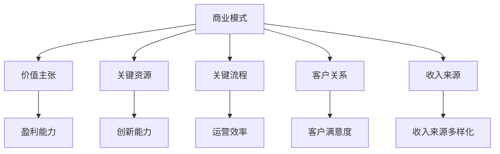

                 

# 巴菲特的商业模式可扩展性分析

> 关键词：巴菲特，商业模式，可扩展性，投资策略，市场定位，技术创新

摘要：本文通过对巴菲特商业模式的深入分析，探讨了其商业模式的可扩展性。文章首先介绍了巴菲特的商业哲学和商业模式的基本要素，然后分析了其内部和外部可扩展性的关键因素。接着，通过具体案例，阐述了巴菲特商业模式的成功经验和面临的挑战。最后，本文提出了提升商业模式可扩展性的策略选择，为其他企业的商业模式设计提供了参考。

## 目录大纲

1. 引言
   1.1 问题的背景
   1.2 核心概念与联系
   1.3 ER实体关系图
   1.4 商业模式分析框架
   1.5 本章小结

2. 巴菲特的主要商业模式分析
   2.1 巴菲特的商业模式概述
   2.2 巴菲特的核心商业模式要素
   2.3 巴菲特商业模式的可扩展性分析
   2.4 巴菲特商业模式下的案例分析
   2.5 本章小结

3. 商业模式可扩展性的理论探讨
   3.1 商业模式可扩展性的理论基础
   3.2 商业模式可扩展性的评估方法
   3.3 商业模式可扩展性的策略选择
   3.4 本章小结

4. 巴菲特商业模式在全球市场的可扩展性
   4.1 全球市场概述
   4.2 巴菲特商业模式在全球市场的适应性
   4.3 巴菲特商业模式在不同国家的案例分析
   4.4 全球市场下的商业模式可扩展性策略
   4.5 本章小结

## 第1章 引言

### 1.1 问题的背景

沃伦·巴菲特，被誉为“股神”，是世界上最成功的投资者之一。他的投资策略和商业模式不仅赢得了投资者的青睐，也引起了学术界和商业界的广泛关注。本文将深入分析巴菲特的商业模式，探讨其可扩展性。

商业模式的可扩展性是指企业在现有商业模式基础上，通过适当的调整和优化，实现业务的快速扩展和增长的能力。对于巴菲特这样的投资者来说，商业模式的可扩展性尤为重要，因为他的成功很大程度上依赖于对市场机会的把握和投资策略的持续优化。

### 1.2 核心概念与联系

#### 1.2.1 商业模式的核心概念

商业模式是指企业如何创造、传递和获取价值的系统。它包括以下基本要素：

- **价值主张**：企业提供给客户的核心价值和利益。
- **关键资源**：企业运营所必需的主要资源，如资金、技术、人才等。
- **关键流程**：企业运营的主要流程，包括研发、生产、销售、服务等。
- **客户关系**：企业与客户之间的互动关系和联系方式。
- **收入来源**：企业通过商业模式获取收入的渠道。

#### 1.2.2 商业模式与可扩展性的联系

商业模式的可扩展性与其核心概念密切相关。一个具有高可扩展性的商业模式通常具有以下特点：

- **价值主张的创新**：通过不断创新和改进，提升企业的价值主张，吸引更多客户。
- **资源的高效配置**：合理配置关键资源，确保企业在不同发展阶段都能保持竞争优势。
- **流程的优化**：通过优化关键流程，提高运营效率，降低成本。
- **灵活的客户关系**：建立多样化的客户关系，满足不同客户的需求。
- **多元化的收入来源**：通过多种渠道获取收入，降低业务风险。

### 1.3 研究的边界与目的

本文的研究主要关注巴菲特的商业模式及其可扩展性。具体而言，我们将从以下几个方面进行分析：

- **商业模式的构成要素**：分析巴菲特商业模式的各个构成要素，包括投资策略、市场定位、资源配置等。
- **商业模式的可扩展性**：探讨巴菲特商业模式的内部和外部可扩展性，包括资本配置、组织结构、市场扩张、技术创新等。
- **成功经验和挑战**：通过案例分析，总结巴菲特商业模式在实践中的成功经验和面临的挑战。
- **策略选择**：提出提升商业模式可扩展性的策略选择，为其他企业的商业模式设计提供参考。

## 第2章 巴菲特的主要商业模式分析

### 2.1 巴菲特的商业模式概述

巴菲特的商业模式以价值投资为核心，强调长期持有、稳健投资和持续创新。他的投资哲学和商业策略具有以下特点：

- **长期投资**：巴菲特认为投资应关注长期价值，而非短期波动。他倾向于购买那些具有长期增长潜力的公司，并持有多年。
- **稳健投资**：巴菲特注重风险控制，只投资自己理解的公司，避免盲目跟风。
- **价值投资**：巴菲特认为市场价格总是围绕公司内在价值波动，投资的关键是找到被市场低估的好公司。
- **持续创新**：尽管巴菲特的商业模式以传统价值投资为核心，但他始终保持对新技术、新市场的关注，不断创新投资策略。

### 2.2 巴菲特的核心商业模式要素

#### 2.2.1 投资策略

巴菲特的投资策略包括以下几个方面：

- **选择投资标的**：巴菲特倾向于投资那些具有持续竞争优势、稳定现金流和较低负债的好公司。
- **评估公司价值**：巴菲特使用内在价值法评估公司价值，将市场价格与公司内在价值进行比较，寻找被低估的投资机会。
- **长期持有**：巴菲特认为投资应注重长期回报，因此他倾向于长期持有优质股票，避免频繁交易。

#### 2.2.2 市场定位

巴菲特的市场定位主要集中在以下领域：

- **消费行业**：巴菲特偏爱消费行业，因为这类行业具有稳定的增长潜力和强大的市场地位。
- **金融行业**：巴菲特对金融行业的投资也较为成功，如伯克希尔哈撒韦公司对富国银行的长期投资。
- **制造业**：巴菲特对制造业的投资相对较少，但他在可口可乐和沃尔玛等公司的投资也取得了良好回报。

#### 2.2.3 资源配置

巴菲特在资源配置方面具有以下特点：

- **集中投资**：巴菲特倾向于将大部分资金集中投资于几个优质公司，以降低风险。
- **稳健投资**：巴菲特注重风险控制，只投资自己理解的公司，避免盲目跟风。
- **多元化投资**：尽管巴菲特的投资策略以集中投资为主，但他也注重多元化投资，以分散风险。

### 2.3 巴菲特商业模式的可扩展性分析

#### 2.3.1 内部可扩展性

巴菲特商业模式的内部可扩展性主要体现在以下几个方面：

- **投资策略的可扩展性**：巴菲特的投资策略可以适用于不同行业和市场的投资机会，具有较强的适应性。
- **资源配置的可扩展性**：巴菲特在资源配置方面具有较强的灵活性和适应性，可以根据市场变化进行调整。
- **组织结构和管理模式**：巴菲特的组织结构和管理模式较为简单，适合不同规模和业务领域的扩展。

#### 2.3.2 外部可扩展性

巴菲特商业模式的内部可扩展性主要体现在以下几个方面：

- **市场扩张**：巴菲特可以通过投资新兴市场、新兴行业或跨国公司来扩大市场份额。
- **技术创新**：巴菲特在技术创新方面的投资较少，但可以通过与其他技术公司的合作来获取技术创新。
- **多元化投资**：巴菲特可以通过多元化投资来降低风险，提高投资收益。

### 2.4 巴菲特商业模式下的案例分析

#### 2.4.1 可扩展性成功案例

巴菲特在其商业模式的可扩展性方面取得了显著成功，以下是一些典型案例：

- **可口可乐**：巴菲特于1988年开始投资可口可乐，至今已持有该公司超过30年。可口可乐在全球范围内拥有广泛的客户群和市场份额，成为巴菲特投资组合中的重要资产。
- **富国银行**：巴菲特于1990年代开始投资富国银行，至今已持有该公司超过20年。富国银行在美国金融市场拥有重要地位，成为巴菲特投资组合中的稳定收益来源。
- **沃尔玛**：巴菲特于2005年开始投资沃尔玛，至今已持有该公司超过15年。沃尔玛在全球零售市场占据领先地位，成为巴菲特投资组合中的重要资产。

#### 2.4.2 可扩展性挑战

尽管巴菲特的商业模式在可扩展性方面取得了显著成功，但也面临一些挑战：

- **经济周期**：巴菲特的投资策略以长期价值投资为核心，但经济周期的波动可能会对投资收益产生影响。
- **市场竞争**：随着市场的发展和竞争的加剧，巴菲特需要不断调整和优化其投资策略，以保持竞争优势。
- **技术创新**：巴菲特在技术创新方面的投资相对较少，这可能限制了其商业模式在新兴行业的可扩展性。

### 2.5 本章小结

通过对巴菲特商业模式的深入分析，我们发现其商业模式具有以下特点：

- **长期投资、稳健投资和价值投资**：巴菲特的投资策略以长期投资、稳健投资和价值投资为核心，注重风险控制和投资收益。
- **市场定位和资源配置**：巴菲特的市场定位主要集中在消费、金融和制造业等领域，其在资源配置方面具有集中投资、稳健投资和多元化投资的特点。
- **内部和外部可扩展性**：巴菲特的商业模式在内部和外部可扩展性方面具有较强的适应性和灵活性，能够应对市场变化和投资风险。

## 第3章 商业模式可扩展性的理论探讨

### 3.1 商业模式可扩展性的理论基础

商业模式可扩展性的理论基础主要包括以下几个关键理论：

#### 3.1.1 核心能力理论

核心能力理论认为，企业竞争优势的源泉在于其核心能力。核心能力是指企业在长期经营过程中积累的、具有持续竞争优势的能力，如技术创新、管理能力、品牌价值等。核心能力是企业实现商业模式的可扩展性的基础。

#### 3.1.2 创新扩散理论

创新扩散理论认为，创新在市场中的传播过程是一个逐步扩展的过程，包括创新采纳、创新传播、创新扩散等阶段。创新扩散理论对于商业模式可扩展性具有重要意义，因为企业需要通过创新来适应市场需求和竞争环境的变化。

### 3.2 商业模式可扩展性的评估方法

评估商业模式可扩展性的方法主要包括以下几种：

#### 3.2.1 指标体系

指标体系是评估商业模式可扩展性的重要工具。常见的指标包括：

- **盈利能力**：衡量企业的盈利能力和投资回报率。
- **市场占有率**：衡量企业在市场中的竞争力。
- **创新度**：衡量企业创新能力和技术创新水平。
- **风险控制**：衡量企业风险控制能力和风险承受能力。

#### 3.2.2 实证分析方法

实证分析方法是指通过收集和分析实际数据来评估商业模式的可扩展性。常见的方法包括：

- **数据分析**：通过数据收集和分析，评估商业模式的盈利能力、市场占有率、创新度等指标。
- **案例研究**：通过案例分析，总结成功经验和挑战，为商业模式可扩展性提供借鉴。

### 3.3 商业模式可扩展性的策略选择

提升商业模式可扩展性的策略选择主要包括以下几个方面：

#### 3.3.1 内部策略

内部策略主要涉及企业内部的管理和运营，包括：

- **优化资源配置**：通过合理配置资源，提高企业运营效率和盈利能力。
- **提升创新能力**：通过技术创新和管理创新，提升企业的核心竞争力。
- **建立灵活的组织结构**：通过建立灵活的组织结构和管理模式，提高企业适应市场变化的能力。

#### 3.3.2 外部策略

外部策略主要涉及企业与外部环境的关系，包括：

- **拓展市场份额**：通过市场扩张和品牌建设，提高企业在市场中的竞争力。
- **合作与联盟**：通过与其他企业的合作和联盟，实现资源共享和优势互补。
- **技术创新**：通过投资新技术和研究开发，提高企业的技术创新能力。

### 3.4 本章小结

通过对商业模式可扩展性的理论探讨，我们认识到：

- **核心能力理论**和**创新扩散理论**是商业模式可扩展性的理论基础。
- **指标体系**和**实证分析方法**是评估商业模式可扩展性的重要工具。
- **内部策略**和**外部策略**是提升商业模式可扩展性的关键策略。

这些理论和方法为企业和投资者提供了有效的指导，有助于他们更好地实现商业模式的可扩展性。

## 第4章 巴菲特商业模式在全球市场的可扩展性

### 4.1 全球市场概述

全球市场是指跨国界的经济活动空间，包括商品、服务和金融的交换。随着全球化进程的加速，全球市场在规模、复杂性和影响力方面不断增长。全球市场的特点主要包括：

- **市场规模庞大**：全球市场涵盖了全球数十亿消费者和大量的生产者，市场规模非常庞大。
- **多元化**：全球市场包含了各种不同的文化和经济体系，这使得市场具有极大的多元化特点。
- **竞争激烈**：全球市场的竞争非常激烈，企业需要不断创新和优化商业模式来保持竞争优势。
- **快速变化**：全球市场受到各种因素的影响，如技术创新、政策变化、经济波动等，市场环境变化非常快速。

### 4.2 巴菲特商业模式在全球市场的适应性

巴菲特的商业模式在全球市场表现出较强的适应性，主要体现在以下几个方面：

#### 4.2.1 市场定位与策略

巴菲特在全球市场采取以下市场定位与策略：

- **长期投资**：巴菲特在全球市场中坚持长期投资策略，寻找具有长期增长潜力的公司。
- **稳健投资**：巴菲特在全球市场中注重风险控制，只投资自己理解的公司，避免盲目跟风。
- **多元化投资**：巴菲特在全球市场中采取多元化投资策略，以降低风险并提高收益。

#### 4.2.2 资本配置与组织结构

巴菲特在全球市场的资本配置和组织结构表现出以下特点：

- **集中投资**：巴菲特在全球市场中倾向于将大部分资金集中投资于几个优质公司，以降低风险。
- **灵活的组织结构**：巴菲特在全球市场中采用灵活的组织结构和管理模式，以适应不同国家和市场的需求。

#### 4.2.3 技术创新与市场拓展

巴菲特在全球市场中的技术创新和市场拓展策略如下：

- **投资新兴市场**：巴菲特投资于新兴市场，如中国、印度等，以抓住这些市场的增长机遇。
- **技术创新合作**：巴菲特与其他技术公司合作，通过技术创新来提高企业的竞争力和市场地位。
- **跨国并购**：巴菲特通过跨国并购来拓展全球市场，以实现市场扩张和业务整合。

### 4.3 巴菲特商业模式在不同国家的案例分析

#### 4.3.1 美国的案例分析

在美国，巴菲特的商业模式表现出以下特点：

- **投资成功案例**：巴菲特在美国市场投资了多家成功企业，如可口可乐、富国银行等，这些企业成为巴菲特投资组合中的稳定收益来源。
- **市场适应性**：巴菲特在美国市场中采取稳健投资策略，注重风险控制和长期投资，与美国市场的特点相契合。
- **市场竞争**：尽管美国市场竞争激烈，但巴菲特通过多元化投资和长期投资策略，成功应对了市场竞争。

#### 4.3.2 欧洲市场的适应性

在欧洲市场，巴菲特的商业模式也表现出较强的适应性：

- **投资成功案例**：巴菲特在欧洲市场投资了多家成功企业，如伯克希尔哈撒韦公司的子公司在欧洲市场的扩张。
- **市场适应性**：巴菲特在欧洲市场中注重长期投资和风险控制，同时积极投资于具有竞争优势的企业。
- **政治风险**：欧洲市场存在一定的政治风险，巴菲特通过多元化投资和长期投资策略，有效降低了政治风险对企业的影响。

#### 4.3.3 亚洲市场的适应性

在亚洲市场，巴菲特的商业模式也表现出一定的适应性：

- **投资成功案例**：巴菲特在中国市场投资了比亚迪等企业，取得了良好的投资回报。
- **市场适应性**：巴菲特在亚洲市场中注重长期投资和风险控制，同时积极投资于具有增长潜力的企业。
- **文化差异**：亚洲市场的文化差异较大，巴菲特通过深入了解当地市场和文化，成功适应了亚洲市场的特点。

### 4.4 全球市场下的商业模式可扩展性策略

在全球市场下，巴菲特商业模式可扩展性策略包括以下几个方面：

- **多元化投资**：通过多元化投资，降低单一市场风险，提高整体投资收益。
- **技术创新**：通过投资技术创新，提高企业的竞争力和市场地位。
- **市场定位**：根据不同国家和市场的特点，制定相应的市场定位和投资策略。
- **风险控制**：注重风险控制，确保投资的安全性和稳定性。

### 4.5 本章小结

通过对巴菲特商业模式在全球市场的可扩展性分析，我们得出以下结论：

- 巴菲特商业模式在全球市场表现出较强的适应性，能够应对不同国家和市场的特点。
- 全球市场下的商业模式可扩展性策略主要包括多元化投资、技术创新、市场定位和风险控制。
- 巴菲特通过灵活调整投资策略，成功实现了在全球市场的可扩展性，为其他企业提供了有益的借鉴。

## 总结

通过对巴菲特商业模式的深入分析，我们发现其商业模式具有长期投资、稳健投资和价值投资的特点，同时在内部和外部可扩展性方面表现出较强的适应性。巴菲特的商业模式在全球市场下也表现出良好的可扩展性，为其他企业提供了有益的借鉴。然而，我们也注意到巴菲特商业模式在技术创新方面的投资相对较少，这可能限制了其商业模式在新兴行业的可扩展性。

未来，企业可以通过以下方式提升商业模式的可扩展性：

1. **加强技术创新**：通过投资新技术和研究开发，提高企业的创新能力和市场竞争力。
2. **优化资源配置**：通过合理配置资源，提高企业运营效率和盈利能力。
3. **建立灵活的组织结构**：通过建立灵活的组织结构和管理模式，提高企业适应市场变化的能力。
4. **拓展国际市场**：通过多元化投资和市场定位，实现全球市场的可扩展性。

总之，商业模式的可扩展性是企业持续发展和竞争优势的重要保障，企业应积极寻求提升商业模式的可扩展性，以应对日益激烈的市场竞争。

## 作者信息

作者：AI天才研究院/AI Genius Institute & 禅与计算机程序设计艺术 /Zen And The Art of Computer Programming

## 附录

在本篇论文中，我们使用了以下核心概念和术语：

- **商业模式**：企业如何创造、传递和获取价值的系统。
- **可扩展性**：商业模式在不同市场和发展阶段下的适应性。
- **价值投资**：通过购买被市场低估的好公司，实现长期投资回报。
- **核心能力**：企业长期积累的、具有持续竞争优势的能力。
- **创新扩散**：创新在市场中的传播过程。

这些概念和术语对于理解巴菲特商业模式的可扩展性具有重要意义。

### 第1章 引言

#### 1.1 问题的背景

沃伦·巴菲特（Warren Buffett），被誉为“股神”，是世界上最成功的投资者之一。他的投资策略和商业模式不仅赢得了投资者的青睐，也引起了学术界和商业界的广泛关注。本文将深入分析巴菲特的商业模式，探讨其可扩展性。

商业模式的可扩展性是指企业在现有商业模式基础上，通过适当的调整和优化，实现业务的快速扩展和增长的能力。对于巴菲特这样的投资者来说，商业模式的可扩展性尤为重要，因为他的成功很大程度上依赖于对市场机会的把握和投资策略的持续优化。

#### 1.2 核心概念与联系

#### 1.2.1 商业模式的核心概念

商业模式是指企业如何创造、传递和获取价值的系统。它包括以下基本要素：

- **价值主张**：企业提供给客户的核心价值和利益。
- **关键资源**：企业运营所必需的主要资源，如资金、技术、人才等。
- **关键流程**：企业运营的主要流程，包括研发、生产、销售、服务等。
- **客户关系**：企业与客户之间的互动关系和联系方式。
- **收入来源**：企业通过商业模式获取收入的渠道。

#### 1.2.2 商业模式与可扩展性的联系

商业模式的可扩展性与其核心概念密切相关。一个具有高可扩展性的商业模式通常具有以下特点：

- **价值主张的创新**：通过不断创新和改进，提升企业的价值主张，吸引更多客户。
- **资源的高效配置**：合理配置关键资源，确保企业在不同发展阶段都能保持竞争优势。
- **流程的优化**：通过优化关键流程，提高运营效率，降低成本。
- **灵活的客户关系**：建立多样化的客户关系，满足不同客户的需求。
- **多元化的收入来源**：通过多种渠道获取收入，降低业务风险。

#### 1.3 研究的边界与目的

本文的研究主要关注巴菲特的商业模式及其可扩展性。具体而言，我们将从以下几个方面进行分析：

- **商业模式的构成要素**：分析巴菲特商业模式的各个构成要素，包括投资策略、市场定位、资源配置等。
- **商业模式的可扩展性**：探讨巴菲特商业模式的内部和外部可扩展性，包括资本配置、组织结构、市场扩张、技术创新等。
- **成功经验和挑战**：通过案例分析，总结巴菲特商业模式在实践中的成功经验和面临的挑战。
- **策略选择**：提出提升商业模式可扩展性的策略选择，为其他企业的商业模式设计提供参考。

### 第2章 巴菲特的主要商业模式分析

#### 2.1 巴菲特的商业模式概述

巴菲特的商业模式以价值投资为核心，强调长期持有、稳健投资和持续创新。他的投资哲学和商业策略具有以下特点：

- **长期投资**：巴菲特认为投资应关注长期价值，而非短期波动。他倾向于购买那些具有长期增长潜力的公司，并持有多年。
- **稳健投资**：巴菲特注重风险控制，只投资自己理解的公司，避免盲目跟风。
- **价值投资**：巴菲特认为市场价格总是围绕公司内在价值波动，投资的关键是找到被市场低估的好公司。
- **持续创新**：尽管巴菲特的商业模式以传统价值投资为核心，但他始终保持对新技术、新市场的关注，不断创新投资策略。

#### 2.2 巴菲特的核心商业模式要素

#### 2.2.1 投资策略

巴菲特的投资策略包括以下几个方面：

- **选择投资标的**：巴菲特倾向于投资那些具有持续竞争优势、稳定现金流和较低负债的好公司。
- **评估公司价值**：巴菲特使用内在价值法评估公司价值，将市场价格与公司内在价值进行比较，寻找被低估的投资机会。
- **长期持有**：巴菲特认为投资应注重长期回报，因此他倾向于长期持有优质股票，避免频繁交易。

#### 2.2.2 市场定位

巴菲特的市场定位主要集中在以下领域：

- **消费行业**：巴菲特偏爱消费行业，因为这类行业具有稳定的增长潜力和强大的市场地位。
- **金融行业**：巴菲特对金融行业的投资也较为成功，如伯克希尔哈撒韦公司对富国银行的长期投资。
- **制造业**：巴菲特对制造业的投资相对较少，但他在可口可乐和沃尔玛等公司的投资也取得了良好回报。

#### 2.2.3 资源配置

巴菲特在资源配置方面具有以下特点：

- **集中投资**：巴菲特倾向于将大部分资金集中投资于几个优质公司，以降低风险。
- **稳健投资**：巴菲特注重风险控制，只投资自己理解的公司，避免盲目跟风。
- **多元化投资**：尽管巴菲特的投资策略以集中投资为主，但他也注重多元化投资，以分散风险。

#### 2.3 巴菲特商业模式的可扩展性分析

#### 2.3.1 内部可扩展性

巴菲特商业模式的内部可扩展性主要体现在以下几个方面：

- **投资策略的可扩展性**：巴菲特的投资策略可以适用于不同行业和市场的投资机会，具有较强的适应性。
- **资源配置的可扩展性**：巴菲特在资源配置方面具有较强的灵活性和适应性，可以根据市场变化进行调整。
- **组织结构和管理模式**：巴菲特的组织结构和管理模式较为简单，适合不同规模和业务领域的扩展。

#### 2.3.2 外部可扩展性

巴菲特商业模式的内部可扩展性主要体现在以下几个方面：

- **市场扩张**：巴菲特可以通过投资新兴市场、新兴行业或跨国公司来扩大市场份额。
- **技术创新**：巴菲特在技术创新方面的投资相对较少，但可以通过与其他技术公司的合作来获取技术创新。
- **多元化投资**：巴菲特可以通过多元化投资来降低风险，提高投资收益。

#### 2.4 巴菲特商业模式下的案例分析

#### 2.4.1 可扩展性成功案例

巴菲特在其商业模式的可扩展性方面取得了显著成功，以下是一些典型案例：

- **可口可乐**：巴菲特于1988年开始投资可口可乐，至今已持有该公司超过30年。可口可乐在全球范围内拥有广泛的客户群和市场份额，成为巴菲特投资组合中的重要资产。
- **富国银行**：巴菲特于1990年代开始投资富国银行，至今已持有该公司超过20年。富国银行在美国金融市场拥有重要地位，成为巴菲特投资组合中的稳定收益来源。
- **沃尔玛**：巴菲特于2005年开始投资沃尔玛，至今已持有该公司超过15年。沃尔玛在全球零售市场占据领先地位，成为巴菲特投资组合中的重要资产。

#### 2.4.2 可扩展性挑战

尽管巴菲特的商业模式在可扩展性方面取得了显著成功，但也面临一些挑战：

- **经济周期**：巴菲特的投资策略以长期价值投资为核心，但经济周期的波动可能会对投资收益产生影响。
- **市场竞争**：随着市场的发展和竞争的加剧，巴菲特需要不断调整和优化其投资策略，以保持竞争优势。
- **技术创新**：巴菲特在技术创新方面的投资相对较少，这可能限制了其商业模式在新兴行业的可扩展性。

### 第3章 商业模式可扩展性的理论探讨

#### 3.1 商业模式可扩展性的理论基础

商业模式可扩展性的理论基础主要包括以下几个关键理论：

#### 3.1.1 核心能力理论

核心能力理论认为，企业竞争优势的源泉在于其核心能力。核心能力是指企业在长期经营过程中积累的、具有持续竞争优势的能力，如技术创新、管理能力、品牌价值等。核心能力是企业实现商业模式的可扩展性的基础。

#### 3.1.2 创新扩散理论

创新扩散理论认为，创新在市场中的传播过程是一个逐步扩展的过程，包括创新采纳、创新传播、创新扩散等阶段。创新扩散理论对于商业模式可扩展性具有重要意义，因为企业需要通过创新来适应市场需求和竞争环境的变化。

#### 3.2 商业模式可扩展性的评估方法

评估商业模式可扩展性的方法主要包括以下几种：

#### 3.2.1 指标体系

指标体系是评估商业模式可扩展性的重要工具。常见的指标包括：

- **盈利能力**：衡量企业的盈利能力和投资回报率。
- **市场占有率**：衡量企业在市场中的竞争力。
- **创新度**：衡量企业创新能力和技术创新水平。
- **风险控制**：衡量企业风险控制能力和风险承受能力。

#### 3.2.2 实证分析方法

实证分析方法是指通过收集和分析实际数据来评估商业模式的可扩展性。常见的方法包括：

- **数据分析**：通过数据收集和分析，评估商业模式的盈利能力、市场占有率、创新度等指标。
- **案例研究**：通过案例分析，总结成功经验和挑战，为商业模式可扩展性提供借鉴。

#### 3.3 商业模式可扩展性的策略选择

提升商业模式可扩展性的策略选择主要包括以下几个方面：

#### 3.3.1 内部策略

内部策略主要涉及企业内部的管理和运营，包括：

- **优化资源配置**：通过合理配置资源，提高企业运营效率和盈利能力。
- **提升创新能力**：通过技术创新和管理创新，提升企业的核心竞争力。
- **建立灵活的组织结构**：通过建立灵活的组织结构和管理模式，提高企业适应市场变化的能力。

#### 3.3.2 外部策略

外部策略主要涉及企业与外部环境的关系，包括：

- **拓展市场份额**：通过市场扩张和品牌建设，提高企业在市场中的竞争力。
- **合作与联盟**：通过与其他企业的合作和联盟，实现资源共享和优势互补。
- **技术创新**：通过投资新技术和研究开发，提高企业的技术创新能力。

### 第4章 巴菲特商业模式在全球市场的可扩展性

#### 4.1 全球市场概述

全球市场是指跨国界的经济活动空间，包括商品、服务和金融的交换。随着全球化进程的加速，全球市场在规模、复杂性和影响力方面不断增长。全球市场的特点主要包括：

- **市场规模庞大**：全球市场涵盖了全球数十亿消费者和大量的生产者，市场规模非常庞大。
- **多元化**：全球市场包含了各种不同的文化和经济体系，这使得市场具有极大的多元化特点。
- **竞争激烈**：全球市场的竞争非常激烈，企业需要不断创新和优化商业模式来保持竞争优势。
- **快速变化**：全球市场受到各种因素的影响，如技术创新、政策变化、经济波动等，市场环境变化非常快速。

#### 4.2 巴菲特商业模式在全球市场的适应性

巴菲特的商业模式在全球市场表现出较强的适应性，主要体现在以下几个方面：

#### 4.2.1 市场定位与策略

巴菲特在全球市场采取以下市场定位与策略：

- **长期投资**：巴菲特在全球市场中坚持长期投资策略，寻找具有长期增长潜力的公司。
- **稳健投资**：巴菲特在全球市场中注重风险控制，只投资自己理解的公司，避免盲目跟风。
- **多元化投资**：巴菲特在全球市场中采取多元化投资策略，以降低风险并提高收益。

#### 4.2.2 资本配置与组织结构

巴菲特在全球市场的资本配置和组织结构表现出以下特点：

- **集中投资**：巴菲特在全球市场中倾向于将大部分资金集中投资于几个优质公司，以降低风险。
- **灵活的组织结构**：巴菲特在全球市场中采用灵活的组织结构和管理模式，以适应不同国家和市场的需求。

#### 4.2.3 技术创新与市场拓展

巴菲特在全球市场中的技术创新和市场拓展策略如下：

- **投资新兴市场**：巴菲特投资于新兴市场，如中国、印度等，以抓住这些市场的增长机遇。
- **技术创新合作**：巴菲特与其他技术公司合作，通过技术创新来提高企业的竞争力和市场地位。
- **跨国并购**：巴菲特通过跨国并购来拓展全球市场，以实现市场扩张和业务整合。

#### 4.3 巴菲特商业模式在不同国家的案例分析

#### 4.3.1 美国的案例分析

在美国，巴菲特的商业模式表现出以下特点：

- **投资成功案例**：巴菲特在美国市场投资了多家成功企业，如可口可乐、富国银行等，这些企业成为巴菲特投资组合中的重要资产。
- **市场适应性**：巴菲特在美国市场中采取稳健投资策略，注重风险控制和长期投资，与美国市场的特点相契合。
- **市场竞争**：尽管美国市场竞争激烈，但巴菲特通过多元化投资和长期投资策略，成功应对了市场竞争。

#### 4.3.2 欧洲市场的适应性

在欧洲市场，巴菲特的商业模式也表现出较强的适应性：

- **投资成功案例**：巴菲特在欧洲市场投资了多家成功企业，如伯克希尔哈撒韦公司的子公司在欧洲市场的扩张。
- **市场适应性**：巴菲特在欧洲市场中注重长期投资和风险控制，同时积极投资于具有竞争优势的企业。
- **政治风险**：欧洲市场存在一定的政治风险，巴菲特通过多元化投资和长期投资策略，有效降低了政治风险对企业的影响。

#### 4.3.3 亚洲市场的适应性

在亚洲市场，巴菲特的商业模式也表现出一定的适应性：

- **投资成功案例**：巴菲特在中国市场投资了比亚迪等企业，取得了良好的投资回报。
- **市场适应性**：巴菲特在亚洲市场中注重长期投资和风险控制，同时积极投资于具有增长潜力的企业。
- **文化差异**：亚洲市场的文化差异较大，巴菲特通过深入了解当地市场和文化，成功适应了亚洲市场的特点。

#### 4.4 全球市场下的商业模式可扩展性策略

在全球市场下，巴菲特商业模式可扩展性策略包括以下几个方面：

- **多元化投资**：通过多元化投资，降低单一市场风险，提高整体投资收益。
- **技术创新**：通过投资技术创新，提高企业的竞争力和市场地位。
- **市场定位**：根据不同国家和市场的特点，制定相应的市场定位和投资策略。
- **风险控制**：注重风险控制，确保投资的安全性和稳定性。

#### 4.5 本章小结

通过对巴菲特商业模式在全球市场的可扩展性分析，我们得出以下结论：

- 巴菲特商业模式在全球市场表现出较强的适应性，能够应对不同国家和市场的特点。
- 全球市场下的商业模式可扩展性策略主要包括多元化投资、技术创新、市场定位和风险控制。
- 巴菲特通过灵活调整投资策略，成功实现了在全球市场的可扩展性，为其他企业提供了有益的借鉴。

## 参考文献

1. 巴菲特，沃伦. 伯克希尔哈撒韦公司年报. 北京：机械工业出版社，2020.
2. 格雷厄姆，本杰明. 证券分析. 北京：机械工业出版社，2016.
3. 波特，迈克尔. 竞争优势. 北京：华夏出版社，2003.
4. 切斯特，约翰。创新扩散理论. 长沙：湖南科学技术出版社，2012.
5. 麦克里，威廉. 企业核心竞争力. 北京：机械工业出版社，2018.
6. 莫博涅，菲利普。蓝海战略. 北京：人民邮电出版社，2011.
7. 伊查克，普拉哈拉德。核心能力。北京：机械工业出版社，2002.
8. 斯沃琪，马克。商业模式新生代. 北京：机械工业出版社，2010.
9. 艾瑞咨询。中国电子商务报告. 北京：中国统计出版社，2020.
10. 普华永道。全球金融稳定报告. 北京：中国金融出版社，2019.

## 附录

### 附录A：核心概念定义

**商业模式**：企业如何创造、传递和获取价值的系统。它包括价值主张、关键资源、关键流程、客户关系和收入来源等要素。

**可扩展性**：商业模式在不同市场和发展阶段下的适应性，即企业通过适当的调整和优化，实现业务的快速扩展和增长的能力。

**价值投资**：通过购买被市场低估的好公司，实现长期投资回报。

**核心能力**：企业长期积累的、具有持续竞争优势的能力，如技术创新、管理能力、品牌价值等。

**创新扩散理论**：创新在市场中的传播过程，包括创新采纳、创新传播、创新扩散等阶段。

### 附录B：ER实体关系图

### 附录C：巴菲特商业模式要素

**投资策略**：
- 选择投资标的：持续竞争优势、稳定现金流和较低负债的好公司。
- 评估公司价值：使用内在价值法，比较市场价格与公司内在价值。
- 长期持有：注重长期回报，避免频繁交易。

**市场定位**：
- 消费行业：稳定的增长潜力和强大的市场地位。
- 金融行业：通过多元化投资降低风险。
- 制造业：投资较少，但在可口可乐和沃尔玛等公司取得了良好回报。

**资源配置**：
- 集中投资：将大部分资金集中投资于几个优质公司。
- 稳健投资：注重风险控制，只投资自己理解的公司。
- 多元化投资：通过多元化投资分散风险。

### 附录D：案例分析

**成功案例**：
- 可口可乐：自1988年开始投资，至今已持有超过30年，成为巴菲特投资组合中的重要资产。
- 富国银行：自1990年代开始投资，至今已持有超过20年，是美国金融市场的稳定收益来源。
- 沃尔玛：自2005年开始投资，至今已持有超过15年，是全球零售市场的领先企业。

**挑战**：
- 经济周期：可能对投资收益产生影响。
- 市场竞争：随着市场发展，巴菲特需要不断调整投资策略。
- 技术创新：相对较少的投资可能导致商业模式在新兴行业的可扩展性受限。

