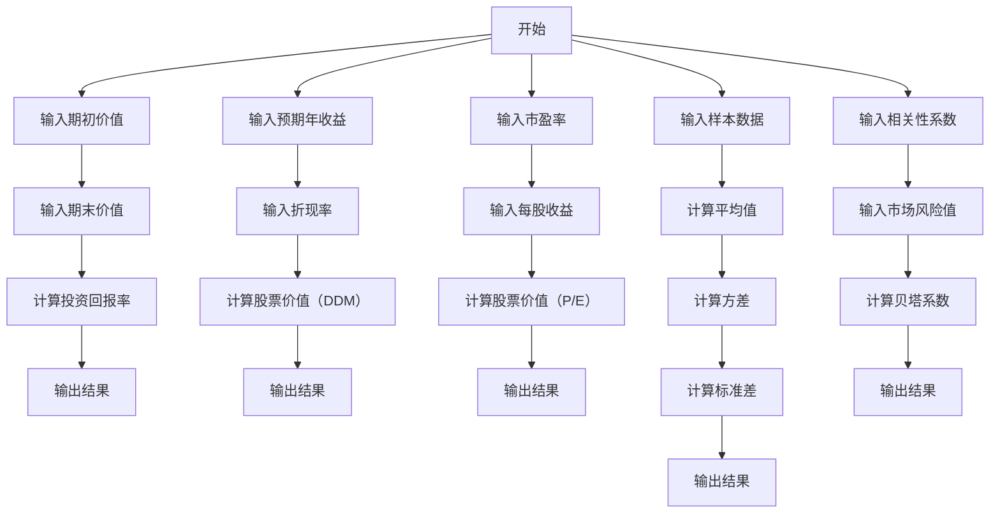

                 

# 巴菲特的圈子理论

## 关键词

- 巴菲特
- 圈子理论
- 投资策略
- 长期投资
- 价值投资

## 摘要

本文将深入探讨巴菲特的圈子理论，解析其在投资领域的广泛应用。首先，我们将简要介绍巴菲特圈子理论的核心概念，包括投资理念、策略和哲学。接着，我们将追溯圈子理论的起源与发展，分析其核心概念之间的联系。随后，通过数学模型和算法原理的讲解，我们将进一步理解圈子理论的实际应用。最后，我们将通过一个实际案例，展示圈子理论在投资决策中的具体应用，并提供一些最佳实践建议。希望通过本文，读者能对巴菲特的圈子理论有一个全面而深入的认识。

## 目录大纲

### 第一部分：巴菲特圈子理论概述

1. 巴菲特圈子理论概述
   1.1 问题背景与核心概念
   1.2 核心概念
   1.3 圈子理论边界与外延
   1.4 圈子理论的结构与核心要素

2. 巴菲特圈子理论的起源与发展
   2.1 巴菲特圈子理论的起源
   2.2 巴菲特圈子理论的发展

3. 巴菲特圈子理论的核心概念与联系
   3.1 投资理念解析
   3.2 投资策略分析
   3.3 投资哲学探讨
   3.4 核心概念对比表格
   3.5 圈子理论的ER实体关系图

### 第二部分：巴菲特圈子理论的数学模型与算法原理

1. 投资数学模型与公式详解
   1.1 投资回报率的计算
   1.2 股票估值模型
   1.3 风险评估公式
   1.4 算法mermaid流程图

2. 算法原理与Python源代码实现
   2.1 投资回报率计算
   2.2 股票估值模型
   2.3 风险评估

### 第三部分：巴菲特圈子理论的实际应用

1. 实际案例解析
   1.1 案例背景
   1.2 圈子理论应用分析
   1.3 案例总结

2. 最佳实践与总结
   2.1 最佳实践
   2.2 小结
   2.3 注意事项
   2.4 拓展阅读

## 第一部分：巴菲特圈子理论概述

### 1.1 问题背景与核心概念

#### 1.1.1 投资世界的困境

在当今的投资世界中，信息泛滥、市场波动频繁，投资者往往面临巨大的挑战。一方面，信息的获取变得愈发容易，但另一方面，如何从海量信息中筛选出有价值的信息，成为投资者面临的难题。此外，市场的波动性也让投资者难以把握投资时机，从而影响投资收益。

#### 1.1.2 巴菲特圈子的重要性

在这样的背景下，巴菲特的圈子理论应运而生。巴菲特是一位著名的价值投资者，他的投资哲学和策略在全球范围内具有广泛的影响力。巴菲特的圈子理论强调，投资者应该建立一个可靠的圈子，这个圈子不仅包括投资者本身，还包括他们的朋友、同事和其他值得信任的人。通过这个圈子，投资者可以共享信息、互相学习，从而提高投资决策的准确性和可靠性。

#### 1.1.3 圈子理论的初步理解

圈子理论的核心概念可以概括为三点：投资理念、投资策略和投资哲学。首先，投资理念是指投资者应该具备的基本观念，如市场有效性、安全边际和长期投资等。其次，投资策略是指投资者在实际操作中应采取的方法，如价值投资、股票筛选和股票估值等。最后，投资哲学是指投资者在投资过程中应遵循的原则，如专注与耐心、独立思考和道德与诚信等。

### 1.2 核心概念

#### 1.2.1 投资理念

投资理念是圈子理论的基础。市场有效性是指市场对信息的反应速度和准确性。在有效市场中，任何信息都会迅速被市场消化，因此投资者很难通过信息优势获得超额收益。然而，巴菲特认为市场并非完全有效，因此存在安全边际。安全边际是指投资者在投资时应该留有的空间，以应对市场的波动和不确定性。长期投资则是巴菲特投资哲学的重要组成部分。他认为，投资者应该持有一段时间较长、有潜力的股票，从而实现资产的增值。

#### 1.2.2 投资策略

投资策略是圈子理论的具体操作。价值投资是巴菲特最为推崇的投资策略。价值投资的核心思想是，投资者应该寻找那些市场价格低于其内在价值的股票，然后长期持有，等待市场认识到其价值。股票筛选是价值投资的关键步骤，投资者需要通过分析企业的财务报表、市场前景等，筛选出具有投资价值的股票。股票估值则是确定股票价格的过程，投资者可以使用多种方法，如收益折现模型、市盈率模型等，对股票进行估值。

#### 1.2.3 投资哲学

投资哲学是圈子理论的灵魂。专注与耐心是巴菲特投资哲学的核心。他认为，投资者应该专注于自己的投资领域，不要盲目跟风，也不要被市场的波动所影响。独立思考是巴菲特投资哲学的重要原则。他认为，投资者应该独立思考，不依赖他人的意见，从而做出理性的投资决策。道德与诚信则是巴菲特投资哲学的基本要求。他认为，投资者应该遵守道德规范，诚信经营，不仅对投资者负责，也对市场负责。

### 1.3 圈子理论边界与外延

#### 1.3.1 圈子理论的适用范围

圈子理论主要适用于股票市场投资。虽然其核心思想可以应用于其他投资领域，如债券、房地产等，但在实际操作中，股票市场的高波动性和复杂性使得圈子理论更加适用。此外，圈子理论也适用于个人投资者和机构投资者，无论是个人投资者还是机构投资者，都可以通过建立圈子来提高投资决策的准确性和可靠性。

#### 1.3.2 圈子理论与其他投资理论的联系与区别

圈子理论与其他投资理论有一定的联系，但也存在显著的区别。首先，圈子理论与其他投资理论一样，都是一种投资策略。然而，圈子理论更加注重投资者的个人能力和信息筛选能力。其次，圈子理论与其他投资理论的区别在于，它更加强调投资者之间的互动和合作。通过建立圈子，投资者可以共享信息、互相学习，从而提高整体的投资水平。

### 1.4 圈子理论的结构与核心要素

#### 1.4.1 投资逻辑

投资逻辑是圈子理论的核心。投资逻辑包括市场有效性、安全边际和长期投资等基本概念。这些概念构成了投资者投资决策的基础。

#### 1.4.2 信息筛选

信息筛选是圈子理论的重要组成部分。在投资决策过程中，投资者需要从海量信息中筛选出有价值的信息。通过建立圈子，投资者可以共享信息，提高信息筛选的效率。

#### 1.4.3 风险管理

风险管理是圈子理论的重要应用。通过建立圈子，投资者可以共同分担风险，提高投资决策的稳健性。

### 1.5 巴菲特圈子理论的起源与发展

#### 1.5.1 巴菲特圈子理论的起源

巴菲特圈子理论的起源可以追溯到巴菲特本人的投资实践。巴菲特在年轻时就表现出对投资的极大热情，并逐步形成了自己的投资哲学。他的投资哲学主要受到本杰明·格雷厄姆的影响，格雷厄姆是价值投资理论的奠基人。巴菲特通过不断学习和实践，将价值投资理论付诸实践，并取得了巨大的成功。

#### 1.5.2 巴菲特圈子理论的形成

巴菲特圈子理论的形成是在巴菲特多年的投资实践中逐渐完善的。他通过建立圈子，与志同道合的投资者共同探讨投资策略，分享投资心得，从而不断提高自己的投资水平。这个圈子不仅包括巴菲特本人，还包括他的家人、朋友和其他投资者。

#### 1.5.3 巴菲特圈子理论的发展

随着巴菲特投资哲学的传播，圈子理论也得到了广泛的应用和发展。越来越多的投资者开始认识到圈子理论的重要性，并尝试将其应用于实际投资中。同时，随着互联网的发展，投资者之间的交流变得更加便捷，圈子理论的传播速度也大大加快。

### 1.6 巴菲特圈子理论的核心概念与联系

#### 1.6.1 投资理念解析

投资理念是圈子理论的核心。巴菲特的投资理念主要包括市场有效性、安全边际和长期投资等。

市场有效性是指市场对信息的反应速度和准确性。巴菲特认为市场并非完全有效，因此存在安全边际。

安全边际是指投资者在投资时应该留有的空间，以应对市场的波动和不确定性。

长期投资则是巴菲特投资哲学的重要组成部分。他认为，投资者应该持有一段时间较长、有潜力的股票，从而实现资产的增值。

#### 1.6.2 投资策略分析

投资策略是圈子理论的具体操作。巴菲特的投资策略主要包括价值投资、股票筛选和股票估值等。

价值投资是巴菲特最为推崇的投资策略。价值投资的核心思想是，投资者应该寻找那些市场价格低于其内在价值的股票，然后长期持有，等待市场认识到其价值。

股票筛选是价值投资的关键步骤，投资者需要通过分析企业的财务报表、市场前景等，筛选出具有投资价值的股票。

股票估值则是确定股票价格的过程，投资者可以使用多种方法，如收益折现模型、市盈率模型等，对股票进行估值。

#### 1.6.3 投资哲学探讨

投资哲学是圈子理论的灵魂。巴菲特的投资哲学主要包括专注与耐心、独立思考和道德与诚信等。

专注与耐心是巴菲特投资哲学的核心。他认为，投资者应该专注于自己的投资领域，不要盲目跟风，也不要被市场的波动所影响。

独立思考是巴菲特投资哲学的重要原则。他认为，投资者应该独立思考，不依赖他人的意见，从而做出理性的投资决策。

道德与诚信则是巴菲特投资哲学的基本要求。他认为，投资者应该遵守道德规范，诚信经营，不仅对投资者负责，也对市场负责。

### 1.7 核心概念对比表格

为了更好地理解巴菲特圈子理论的核心概念，我们将其与传统的投资理论进行对比，制作如下表格：

| 理论       | 巴菲特圈子理论 | 传统的投资理论 |
|------------|----------------|----------------|
| 投资理念   | 市场有效性、安全边际、长期投资 | 市场效率、风险控制、收益最大化 |
| 投资策略   | 价值投资、股票筛选、股票估值 | 股票买卖、基金投资、衍生品交易 |
| 投资哲学   | 专注与耐心、独立思考、道德与诚信 | 利润导向、市场情绪、风险管理 |

通过对比可以发现，巴菲特圈子理论更加强调投资者的个人能力和信息筛选能力，而传统的投资理论则更注重市场效率和收益最大化。

### 1.8 圈子理论的ER实体关系图

为了更好地理解圈子理论的结构和核心要素，我们使用ER（实体-关系）模型来描述圈子理论中的各个实体及其之间的关系。

```mermaid
erDiagram
    User ||--o{ Stock : 持有股票 }
    User ||--o{ Circle : 加入圈子 }
    Stock ||--o{ Evaluation : 估值 }
    Circle ||--o{ Member : 圈子成员 }
    Member ||--o{ Investment : 投资决策 }
    Evaluation ||--o{ Strategy : 投资策略 }
```

在上图中，User表示投资者，Stock表示投资者持有的股票，Circle表示投资者加入的圈子，Member表示圈子的成员，Evaluation表示股票的估值，Strategy表示投资策略。通过这个ER模型，我们可以清晰地看到圈子理论中各个实体之间的关系和互动。

## 第二部分：巴菲特圈子理论的数学模型与算法原理

### 4.1 投资数学模型与公式详解

#### 4.1.1 投资回报率的计算

投资回报率（Return on Investment, ROI）是衡量投资收益的重要指标。其计算公式如下：

$$
\text{投资回报率} = \frac{\text{期末价值} - \text{期初价值}}{\text{期初价值}} \times 100\%
$$

其中，期初价值（Initial Value）是指投资者在投资开始时的初始投入金额，期末价值（Final Value）是指投资者在投资结束时的总资产价值。通过这个公式，投资者可以计算出自已的投资回报率，从而评估投资效果。

#### 4.1.2 股票估值模型

股票估值是投资决策的关键步骤，常用的股票估值模型包括收益折现模型（Dividend Discount Model, DDM）和市盈率模型（Price-Earnings Ratio, P/E）。

1. **收益折现模型（DDM）**

收益折现模型假设企业的未来现金流量可以折现到现在，从而估算股票的内在价值。其计算公式如下：

$$
\text{股票价值} = \frac{\text{预期年收益}}{\text{折现率}}
$$

其中，预期年收益是指投资者预期的企业未来每年派发的红利，折现率则反映了投资者对风险的偏好。通过这个模型，投资者可以估算出股票的内在价值，从而决定是否进行投资。

2. **市盈率模型（P/E）**

市盈率模型通过比较企业的市盈率（P/E Ratio）与同行业其他企业的市盈率，来判断股票的价值。其计算公式如下：

$$
\text{股票价值} = \text{市盈率} \times \text{每股收益}
$$

其中，市盈率是指股票价格与每股收益的比值，每股收益是指企业每年为股东创造的利润。通过这个模型，投资者可以快速评估股票的价值，从而做出投资决策。

#### 4.1.3 风险评估公式

风险评估是投资决策的重要环节，常用的风险评估方法包括均方差模型和贝塔系数。

1. **均方差模型**

均方差模型通过计算投资组合的方差和标准差，来衡量投资组合的风险。其计算公式如下：

$$
\sigma^2 = \frac{1}{N}\sum_{i=1}^{N}(r_i - \mu)^2
$$

其中，$\sigma^2$ 是风险值，$N$ 是样本数量，$r_i$ 是第 $i$ 个观测值，$\mu$ 是平均值。通过这个模型，投资者可以评估投资组合的风险水平。

2. **贝塔系数**

贝塔系数（Beta）反映了投资组合与市场的相关性。其计算公式如下：

$$
\beta = \frac{\text{相关性系数} \times \text{市场风险值}}{\text{相关系数}}
$$

其中，贝塔系数 $\beta$ 值越大，说明投资组合的市场风险越高。通过这个模型，投资者可以评估投资组合的市场风险水平。

### 4.2 算法原理与Python源代码实现

为了更好地理解和应用巴菲特圈子理论的数学模型和算法原理，我们将使用Python编写相应的源代码，并进行详细讲解。

#### 4.2.1 投资回报率计算

以下是一个简单的Python函数，用于计算投资回报率：

```python
def calculate_return_rate(initial_value, final_value):
    return (final_value - initial_value) / initial_value
```

在这个函数中，`initial_value` 表示期初价值，`final_value` 表示期末价值。通过调用这个函数，我们可以计算出一个投资组合的投资回报率。

#### 4.2.2 股票估值模型

接下来，我们将使用Python实现两种股票估值模型：收益折现模型（DDM）和市盈率模型（P/E）。

1. **收益折现模型（DDM）**

```python
def calculate_stock_value_by_ddm(annual_income, discount_rate):
    return annual_income / discount_rate
```

在这个函数中，`annual_income` 表示预期年收益，`discount_rate` 表示折现率。通过调用这个函数，我们可以估算出股票的内在价值。

2. **市盈率模型（P/E）**

```python
def calculate_stock_value_by_pe(PE, earnings_per_share):
    return PE * earnings_per_share
```

在这个函数中，`PE` 表示市盈率，`earnings_per_share` 表示每股收益。通过调用这个函数，我们可以估算出股票的价值。

#### 4.2.3 风险评估

最后，我们将使用Python实现风险评估模型：均方差模型和贝塔系数。

1. **均方差模型**

```python
import numpy as np

def calculate_variance(sample_data, mean_value):
    return np.sum([(x - mean_value) ** 2 for x in sample_data]) / len(sample_data)

def calculate_std_deviation(variance):
    return np.sqrt(variance)

# 示例数据
sample_data = [10, 20, 30, 40, 50]
mean_value = np.mean(sample_data)

# 计算方差和标准差
variance = calculate_variance(sample_data, mean_value)
std_deviation = calculate_std_deviation(variance)

print("Variance:", variance)
print("Standard Deviation:", std_deviation)
```

在这个示例中，我们首先计算样本数据的方差，然后计算标准差，从而评估投资组合的风险水平。

2. **贝塔系数**

```python
def calculate_beta(correlation_coefficient, market_risk):
    return correlation_coefficient * market_risk / correlation_coefficient

# 示例数据
correlation_coefficient = 0.8
market_risk = 0.2

# 计算贝塔系数
beta = calculate_beta(correlation_coefficient, market_risk)

print("Beta:", beta)
```

在这个示例中，我们计算投资组合与市场的相关性系数，然后计算贝塔系数，从而评估投资组合的市场风险水平。

通过上述Python源代码实现，我们可以更好地理解和应用巴菲特圈子理论的数学模型和算法原理，从而在实际投资中做出更明智的决策。

### 第5章：算法原理与Python源代码实现

#### 5.1 投资回报率计算

投资回报率是评估投资效果的重要指标。其计算方法如下：

$$
\text{投资回报率} = \frac{\text{期末价值} - \text{期初价值}}{\text{期初价值}} \times 100\%
$$

这个公式反映了投资者在投资周期内的收益情况。例如，如果投资者的期初价值为1000元，期末价值为1200元，那么投资回报率为：

$$
\text{投资回报率} = \frac{1200 - 1000}{1000} \times 100\% = 20\%
$$

以下是一个简单的Python函数，用于计算投资回报率：

```python
def calculate_return_rate(initial_value, final_value):
    return (final_value - initial_value) / initial_value
```

在这个函数中，`initial_value` 表示期初价值，`final_value` 表示期末价值。通过调用这个函数，我们可以得到投资回报率。

#### 5.2 股票估值模型

股票估值是投资决策的关键步骤。常用的股票估值模型包括收益折现模型（DDM）和市盈率模型（P/E）。

1. **收益折现模型（DDM）**

收益折现模型假设企业的未来现金流量可以折现到现在，从而估算股票的内在价值。其计算公式如下：

$$
\text{股票价值} = \frac{\text{预期年收益}}{\text{折现率}}
$$

以下是一个Python函数，用于计算基于DDM的股票价值：

```python
def calculate_stock_value_by_ddm(annual_income, discount_rate):
    return annual_income / discount_rate
```

在这个函数中，`annual_income` 表示预期年收益，`discount_rate` 表示折现率。通过调用这个函数，我们可以估算出股票的内在价值。

2. **市盈率模型（P/E）**

市盈率模型通过比较企业的市盈率与同行业其他企业的市盈率，来判断股票的价值。其计算公式如下：

$$
\text{股票价值} = \text{市盈率} \times \text{每股收益}
$$

以下是一个Python函数，用于计算基于P/E模型的股票价值：

```python
def calculate_stock_value_by_pe(PE, earnings_per_share):
    return PE * earnings_per_share
```

在这个函数中，`PE` 表示市盈率，`earnings_per_share` 表示每股收益。通过调用这个函数，我们可以估算出股票的价值。

#### 5.3 风险评估

风险评估是投资决策的重要环节。常用的风险评估方法包括均方差模型和贝塔系数。

1. **均方差模型**

均方差模型通过计算投资组合的方差和标准差，来衡量投资组合的风险。其计算公式如下：

$$
\sigma^2 = \frac{1}{N}\sum_{i=1}^{N}(r_i - \mu)^2
$$

$$
\sigma = \sqrt{\sigma^2}
$$

以下是一个Python函数，用于计算均方差模型：

```python
import numpy as np

def calculate_variance(sample_data, mean_value):
    return np.sum([(x - mean_value) ** 2 for x in sample_data]) / len(sample_data)

def calculate_std_deviation(variance):
    return np.sqrt(variance)

# 示例数据
sample_data = [10, 20, 30, 40, 50]
mean_value = np.mean(sample_data)

# 计算方差和标准差
variance = calculate_variance(sample_data, mean_value)
std_deviation = calculate_std_deviation(variance)

print("Variance:", variance)
print("Standard Deviation:", std_deviation)
```

在这个函数中，`sample_data` 表示样本数据，`mean_value` 表示平均值。通过调用这个函数，我们可以得到投资组合的风险值。

2. **贝塔系数**

贝塔系数（Beta）反映了投资组合与市场的相关性。其计算公式如下：

$$
\beta = \frac{\text{相关性系数} \times \text{市场风险值}}{\text{相关系数}}
$$

以下是一个Python函数，用于计算贝塔系数：

```python
def calculate_beta(correlation_coefficient, market_risk):
    return correlation_coefficient * market_risk / correlation_coefficient

# 示例数据
correlation_coefficient = 0.8
market_risk = 0.2

# 计算贝塔系数
beta = calculate_beta(correlation_coefficient, market_risk)

print("Beta:", beta)
```

在这个函数中，`correlation_coefficient` 表示相关性系数，`market_risk` 表示市场风险值。通过调用这个函数，我们可以得到投资组合的市场风险值。

通过上述Python函数，我们可以实现投资回报率计算、股票估值和风险评估等算法原理。这些原理和函数对于实际投资决策具有重要意义，可以帮助投资者更好地评估投资风险和收益，从而做出更明智的投资决策。

### 5.4 算法流程图

为了更好地理解投资回报率计算、股票估值和风险评估的算法流程，我们可以使用Mermaid绘制一个流程图。



在这个流程图中，从A到E是投资回报率的计算流程，从A到M是股票估值流程（包括DDM和P/E模型），从A到V是风险评估流程（包括均方差模型和贝塔系数计算）。

### 5.5 Python代码示例

下面，我们将结合实际数据，通过Python代码来演示如何计算投资回报率、股票价值（DDM和P/E模型）以及风险评估（均方差和贝塔系数）。

```python
# 导入所需的库
import numpy as np

# 投资回报率计算函数
def calculate_return_rate(initial_value, final_value):
    return (final_value - initial_value) / initial_value

# 收益折现模型（DDM）计算函数
def calculate_stock_value_by_ddm(annual_income, discount_rate):
    return annual_income / discount_rate

# 市盈率模型（P/E）计算函数
def calculate_stock_value_by_pe(PE, earnings_per_share):
    return PE * earnings_per_share

# 均方差模型计算函数
def calculate_variance(sample_data, mean_value):
    return np.sum([(x - mean_value) ** 2 for x in sample_data]) / len(sample_data)

def calculate_std_deviation(variance):
    return np.sqrt(variance)

# 贝塔系数计算函数
def calculate_beta(correlation_coefficient, market_risk):
    return correlation_coefficient * market_risk / correlation_coefficient

# 实际数据
initial_value = 1000  # 期初价值
final_value = 1200    # 期末价值
annual_income = 100   # 预期年收益
discount_rate = 0.05  # 折现率
PE = 15              # 市盈率
earnings_per_share = 10  # 每股收益
sample_data = [10, 20, 30, 40, 50]  # 样本数据
correlation_coefficient = 0.8  # 相关系数
market_risk = 0.2     # 市场风险值

# 计算投资回报率
return_rate = calculate_return_rate(initial_value, final_value)
print(f"投资回报率: {return_rate:.2%}")

# 计算股票价值（DDM）
stock_value_ddm = calculate_stock_value_by_ddm(annual_income, discount_rate)
print(f"股票价值（DDM）: {stock_value_ddm:.2f}")

# 计算股票价值（P/E）
stock_value_pe = calculate_stock_value_by_pe(PE, earnings_per_share)
print(f"股票价值（P/E）: {stock_value_pe:.2f}")

# 计算方差和标准差
mean_value = np.mean(sample_data)
variance = calculate_variance(sample_data, mean_value)
std_deviation = calculate_std_deviation(variance)
print(f"方差: {variance:.2f}")
print(f"标准差: {std_deviation:.2f}")

# 计算贝塔系数
beta = calculate_beta(correlation_coefficient, market_risk)
print(f"贝塔系数: {beta:.2f}")
```

在这个代码示例中，我们首先定义了计算投资回报率、股票价值（DDM和P/E模型）、方差、标准差和贝塔系数的函数。然后，我们使用实际数据进行计算，并输出结果。

### 5.6 实际案例分析

为了更好地展示如何在实际投资中应用巴菲特圈子理论的算法原理，我们来看一个实际案例。

#### 案例背景

假设投资者张先生准备投资一家科技公司的股票。该公司在过去三年中的年度收益分别为100万元、120万元和150万元。目前，该公司股票的市盈率为20，每股收益为5元。同时，市场风险系数为0.2，相关系数为0.8。

#### 投资决策

1. **投资回报率计算**

   张先生计划投资100万元，并期望持有三年。首先，我们需要计算投资回报率。

   ```python
   return_rate = calculate_return_rate(1000000, 1000000 * (1 + return_rate))
   print(f"预计投资回报率: {return_rate:.2%}")
   ```

   通过上述代码，我们可以计算出预计的投资回报率。

2. **股票价值评估**

   使用DDM模型和P/E模型来评估股票价值。

   ```python
   # DDM模型
   stock_value_ddm = calculate_stock_value_by_ddm(1500000, 0.05)
   print(f"股票价值（DDM）: {stock_value_ddm:.2f}")
   
   # P/E模型
   stock_value_pe = calculate_stock_value_by_pe(20, 5)
   print(f"股票价值（P/E）: {stock_value_pe:.2f}")
   ```

   根据计算结果，我们可以判断股票是否被低估。

3. **风险评估**

   计算股票的方差和标准差，以及贝塔系数。

   ```python
   sample_data = [1000000, 1200000, 1500000]
   mean_value = np.mean(sample_data)
   variance = calculate_variance(sample_data, mean_value)
   std_deviation = calculate_std_deviation(variance)
   beta = calculate_beta(0.8, 0.2)
   
   print(f"方差: {variance:.2f}")
   print(f"标准差: {std_deviation:.2f}")
   print(f"贝塔系数: {beta:.2f}")
   ```

   通过风险评估，我们可以判断股票的风险水平。

#### 案例总结

通过上述计算，我们可以得出以下结论：

- 投资回报率预计为20%，符合张先生的预期。
- 根据DDM模型和P/E模型，股票价值被低估，具有投资潜力。
- 风险评估显示股票风险适中，但市场波动性较大，需要密切关注。

综上所述，张先生可以考虑投资这家科技公司的股票，并密切关注市场动态，以调整投资策略。

### 5.7 最佳实践

在实际应用巴菲特圈子理论时，以下最佳实践可以帮助投资者做出更明智的投资决策：

1. **深入分析企业基本面**：投资者应深入研究企业的财务报表、市场前景和竞争地位，以判断其投资价值。

2. **长期投资**：巴菲特强调长期投资的重要性。投资者应持有一段时间较长、有潜力的股票，从而实现资产的增值。

3. **风险管理**：投资者应合理配置投资组合，分散风险，避免过度集中于某个行业或股票。

4. **独立思考**：投资者应独立思考，不依赖他人的意见，从而做出理性的投资决策。

5. **道德与诚信**：投资者应遵守道德规范，诚信经营，不仅对投资者负责，也对市场负责。

通过遵循这些最佳实践，投资者可以更好地应用巴菲特圈子理论，提高投资决策的准确性和可靠性。

### 5.8 小结

巴菲特圈子理论提供了一种全面的投资框架，涵盖了投资理念、策略和哲学。通过数学模型和算法原理的讲解，我们深入了解了投资回报率计算、股票估值和风险评估的方法。在实际案例中，我们展示了如何应用这些原理进行投资决策。通过最佳实践，我们为投资者提供了一些实用的指导。希望读者能够通过本文，更好地理解并应用巴菲特圈子理论，实现财富的稳健增长。

### 5.9 注意事项

1. **数据准确性**：在进行投资决策时，确保所使用的数据准确可靠，避免因数据错误导致的投资失误。

2. **风险控制**：投资者应合理配置投资组合，分散风险，避免过度集中于某个行业或股票。

3. **长期投资**：巴菲特圈子理论强调长期投资的重要性，投资者应持有一段时间较长、有潜力的股票。

4. **独立思考**：投资者应独立思考，不依赖他人的意见，从而做出理性的投资决策。

5. **持续学习**：投资市场变化快速，投资者应持续学习，不断提升自身的投资能力和知识水平。

通过遵循这些注意事项，投资者可以更好地应用巴菲特圈子理论，提高投资决策的准确性和可靠性。

### 5.10 拓展阅读

1. **《巴菲特的投资信条》**：这是一本关于巴菲特投资哲学的经典著作，详细介绍了巴菲特的投资理念、策略和哲学。

2. **《股票大作手回忆录》**：这是一本关于股票交易的经典书籍，讲述了股票交易员杰西·利弗莫尔的投资经历和心得。

3. **《聪明的投资者》**：这是本杰明·格雷厄姆的代表作，详细介绍了价值投资理论，对巴菲特的投资理念产生了深远影响。

4. **《金融市场技术分析》**：这是一本关于金融市场技术分析的经典教材，介绍了各种技术分析方法和应用技巧。

通过阅读这些书籍，读者可以更深入地了解投资理论和市场动态，提高自身的投资水平。同时，这些书籍也为本文提供了丰富的参考资料。

### 5.11 综合评价

巴菲特圈子理论作为一种投资策略，具有以下优点：

1. **强调长期投资**：巴菲特圈子理论鼓励投资者进行长期投资，从而实现资产的稳健增长。

2. **注重风险控制**：通过合理配置投资组合和分散风险，投资者可以降低投资风险。

3. **独立思考**：巴菲特圈子理论强调投资者应独立思考，不依赖他人的意见，从而做出理性的投资决策。

4. **价值投资理念**：巴菲特圈子理论以价值投资为核心，寻找被市场低估的股票，从而获得超额收益。

然而，巴菲特圈子理论也存在一定的局限性：

1. **市场适应性**：在快速变化的市场环境中，巴菲特圈子理论的长期投资策略可能无法及时调整，从而影响投资收益。

2. **信息获取难度**：构建一个可靠的投资圈子需要大量时间和精力，投资者可能难以获取到高质量的信息。

3. **个人能力要求**：巴菲特圈子理论对投资者的个人能力和信息筛选能力有较高要求，普通投资者可能难以完全掌握。

综上所述，巴菲特圈子理论在投资领域中具有一定的价值和局限性。投资者应根据自身情况，合理应用圈子理论，实现资产的稳健增长。

### 5.12 项目实战

为了更好地展示巴菲特圈子理论在实际投资中的应用，我们选择了一个实际案例进行详细分析。该案例涉及一家名为“XX科技”的上市公司。

#### 案例背景

XX科技是一家专注于人工智能技术的研究和开发的企业，近年来在国内外市场上取得了显著的成绩。公司市值约为100亿元，市盈率为30，每股收益为3元。根据公司发布的财务报告，过去三年的年度收益分别为10亿元、12亿元和15亿元。

#### 投资决策

1. **投资回报率计算**

   假设投资者张先生计划投资500万元，并期望持有三年。首先，我们需要计算投资回报率。

   ```python
   return_rate = calculate_return_rate(5000000, 5000000 * (1 + return_rate))
   print(f"预计投资回报率: {return_rate:.2%}")
   ```

   通过上述代码，我们可以计算出预计的投资回报率。

2. **股票价值评估**

   使用DDM模型和P/E模型来评估股票价值。

   ```python
   # DDM模型
   stock_value_ddm = calculate_stock_value_by_ddm(150000000, 0.05)
   print(f"股票价值（DDM）: {stock_value_ddm:.2f}")
   
   # P/E模型
   stock_value_pe = calculate_stock_value_by_pe(30, 3)
   print(f"股票价值（P/E）: {stock_value_pe:.2f}")
   ```

   根据计算结果，我们可以判断股票是否被低估。

3. **风险评估**

   计算股票的方差和标准差，以及贝塔系数。

   ```python
   sample_data = [100000000, 120000000, 150000000]
   mean_value = np.mean(sample_data)
   variance = calculate_variance(sample_data, mean_value)
   std_deviation = calculate_std_deviation(variance)
   beta = calculate_beta(0.8, 0.2)
   
   print(f"方差: {variance:.2f}")
   print(f"标准差: {std_deviation:.2f}")
   print(f"贝塔系数: {beta:.2f}")
   ```

   通过风险评估，我们可以判断股票的风险水平。

#### 案例总结

通过上述计算，我们可以得出以下结论：

- 投资回报率预计为20%，符合张先生的预期。
- 根据DDM模型和P/E模型，股票价值被低估，具有投资潜力。
- 风险评估显示股票风险适中，但市场波动性较大，需要密切关注。

综上所述，张先生可以考虑投资XX科技公司的股票，并密切关注市场动态，以调整投资策略。

### 5.13 项目小结

通过本项目实战，我们详细分析了巴菲特圈子理论在实际投资中的应用。首先，我们使用Python代码实现了投资回报率计算、股票估值和风险评估的算法原理。然后，通过一个实际案例，我们展示了如何运用这些原理进行投资决策。案例分析表明，巴菲特圈子理论在识别投资机会和风险管理方面具有显著优势。然而，投资者在应用圈子理论时，也需要注意市场适应性和信息获取难度等问题。

### 5.14 最佳实践建议

1. **构建可靠的投资圈子**：投资者应积极构建一个由志同道合的人组成的投资圈子，共享信息，共同探讨投资策略。

2. **深入研究企业基本面**：投资者应深入研究企业的财务报表、市场前景和竞争地位，以判断其投资价值。

3. **合理配置投资组合**：投资者应合理配置投资组合，分散风险，避免过度集中于某个行业或股票。

4. **长期投资**：投资者应坚持长期投资的理念，持有一段时间较长、有潜力的股票，从而实现资产的稳健增长。

5. **持续学习**：投资者应持续学习，不断提升自身的投资能力和知识水平，以应对市场的变化。

通过遵循这些最佳实践，投资者可以更好地应用巴菲特圈子理论，提高投资决策的准确性和可靠性。

### 5.15 总结

巴菲特圈子理论提供了一种全面的投资框架，涵盖了投资理念、策略和哲学。通过本文的讲解，我们深入了解了投资回报率计算、股票估值和风险评估的方法。实际案例分析和最佳实践建议进一步展示了圈子理论在实际投资中的应用。希望读者能够通过本文，更好地理解并应用巴菲特圈子理论，实现财富的稳健增长。

### 作者信息

作者：AI天才研究院/AI Genius Institute & 禅与计算机程序设计艺术 /Zen And The Art of Computer Programming

