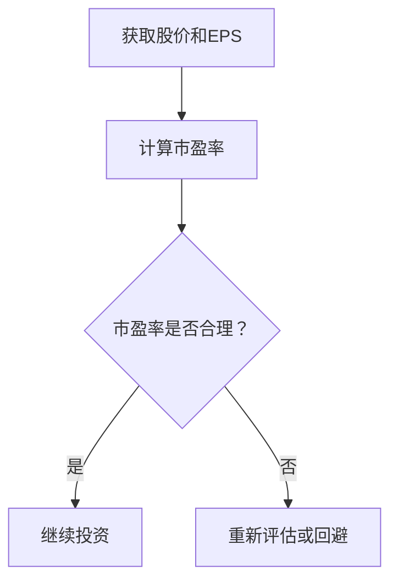
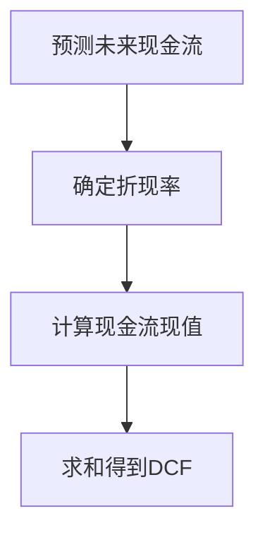

                 

### 1.1 媒体行业的定义与演变

**媒体行业的定义**

媒体行业，指的是通过多种媒介形式来传播信息、娱乐和广告服务的行业。媒介形式包括传统的印刷、广播、电视，以及现代的互联网和移动设备。媒体行业的核心功能是信息传播和内容创造，它连接了内容生产者、消费者和广告商，构成了一个复杂的生态系统。

**媒体行业的发展历程**

媒体行业的发展可以追溯到古代，当时的信息传播主要通过口头和书籍。随着工业革命的到来，印刷术的发明和报纸的普及，传统媒体开始崛起。20世纪初，无线电广播和电视的出现进一步推动了媒体行业的发展。这些媒介形式为大众提供了丰富的新闻和娱乐内容。

进入20世纪后半叶，随着计算机技术和互联网的快速发展，新媒体开始崭露头角。互联网的出现彻底改变了信息传播的方式，使得信息的获取和分享变得更加便捷和快速。社交媒体平台如Facebook、Twitter和微信等，更是改变了人们获取信息和交流的方式，极大地丰富了媒体行业的内涵和表现形式。

**当前媒体行业的状况**

当前，媒体行业正处于快速变革之中。传统媒体如报纸、杂志和电视正在面临巨大的挑战，因为越来越多的人转向新媒体获取信息。新媒体的崛起不仅带来了观众数量的增长，还带来了商业模式的变化。广告收入逐渐从传统媒体转移到互联网平台，这促使媒体企业加快数字化转型。

此外，内容创作和分发方式也发生了巨大变化。自媒体的兴起使得任何人都可以成为内容创作者，极大地丰富了内容生态。同时，算法推荐和大数据分析技术使得内容分发更加精准，用户可以根据自己的兴趣获得定制化的内容。

巴菲特对媒体行业的投资观点主要集中在内容价值和商业模式上。他认为，无论媒介形式如何变化，内容始终是媒体行业的核心价值所在。因此，巴菲特更倾向于投资那些具有高质量内容创作能力，并且在商业模式上具有优势的媒体企业。

总的来说，媒体行业正经历着前所未有的变革，而巴菲特的投资策略也反映出他对这一变化的深刻理解和前瞻性判断。在接下来的部分中，我们将进一步探讨巴菲特的投资哲学，以及他如何将这一哲学应用于媒体行业的投资决策。

### 1.2 巴菲特的投资哲学与媒体行业投资观

**巴菲特的投资哲学**

沃伦·巴菲特，被誉为“股神”，他凭借独特的投资哲学和稳健的投资策略，在长达数十年的投资生涯中取得了卓越的业绩。巴菲特的投资哲学主要可以概括为以下几点：

1. **价值投资**：巴菲特的投资理念源自于本杰明·格雷厄姆的价值投资理论。他认为，股票的价格总是围绕着其内在价值波动，而投资者的目标就是找到那些价格低于其内在价值的股票进行投资。

2. **长期投资**：巴菲特强调，投资者应该将注意力集中在长期投资上，而不是短期市场波动。他认为，只有通过长期持有股票，才能在市场波动中获利。

3. **企业质量**：巴菲特认为，投资的核心是选择优秀的企业。他关注企业的长期竞争力、管理团队的素质和企业的盈利能力。

4. **保守的财务状况**：巴菲特偏好那些财务状况稳健，具有良好现金流的企业。他认为，一个企业的财务健康状况是投资决策中不可或缺的因素。

**巴菲特对媒体行业的投资观**

尽管媒体行业在过去几十年中经历了巨大的变革，但巴菲特依然坚持其传统的价值投资原则。他对媒体行业的投资观主要体现在以下几个方面：

1. **内容为王**：巴菲特认为，无论媒介形式如何变化，内容始终是媒体行业的核心价值。他倾向于投资那些拥有高质量内容创作能力的企业。

2. **商业模式**：巴菲特关注企业的商业模式是否可持续。在媒体行业，他更看重那些能够通过内容创造和分发实现持续盈利的商业模式。

3. **行业前景**：巴菲特会仔细评估媒体行业的长期前景。他倾向于投资那些在行业长期趋势中具有优势的企业。

4. **管理团队**：巴菲特认为，优秀的管理团队是企业成功的关键。他在投资媒体企业时，会重点考察管理团队的素质和执行力。

**内容为王的理念解析**

“内容为王”是巴菲特在媒体行业投资中的一个重要理念。这一理念的核心在于，高质量的内容是媒体企业持续盈利的基础。以下是对“内容为王”的进一步解析：

1. **用户体验**：高质量的内容能够为用户提供更好的用户体验，从而增加用户粘性和用户忠诚度。

2. **广告收益**：高质量的内容能够吸引更多的广告商投放广告，从而增加广告收入。

3. **品牌价值**：高质量的内容有助于提升企业的品牌价值，增强企业的市场竞争力。

4. **内容多样化**：内容多样化能够满足不同用户群体的需求，扩大用户基础，从而提升整体收益。

总之，巴菲特的投资哲学和媒体行业投资观，使他能够在媒体行业的快速变革中保持清醒的头脑，选择那些具有长期发展前景的企业进行投资。在接下来的章节中，我们将深入探讨媒体行业的商业模式，以及巴菲特如何通过这些商业模式来评估媒体企业的投资价值。

### 1.3 媒体行业的商业模式分析

**传统媒体商业模式**

传统媒体商业模式主要依赖于广告和订阅收入。广告收入是传统媒体的主要盈利来源，广告商通过在报纸、杂志、电视和广播等传统媒体平台上投放广告来宣传其产品和服务。订阅收入则主要来自报纸、杂志等定期发行的媒体，用户通过支付订阅费用来获取定期内容。

传统媒体商业模式的主要特点包括：

1. **广告依赖性强**：广告收入占传统媒体收入的大部分，因此广告市场的波动对传统媒体的盈利能力有很大影响。
2. **内容生产成本高**：传统媒体需要大量的资金投入到内容生产、编辑和分发中，这导致其盈利周期较长。
3. **市场局限性**：传统媒体受地域和发行范围的限制，难以实现全国甚至全球的覆盖。

**新媒体商业模式**

随着互联网和移动设备的普及，新媒体商业模式逐渐崛起。新媒体主要通过以下几种方式盈利：

1. **广告收入**：与传统媒体类似，新媒体通过在网站、社交媒体平台和移动应用上投放广告来获取收入。但新媒体的广告投放更加精准，利用大数据和算法技术可以实现个性化推荐。
2. **付费订阅**：许多新媒体平台提供优质内容的付费订阅服务，用户通过支付订阅费用来获取高质量的内容。
3. **电商收入**：一些新媒体平台通过整合电商功能，帮助品牌进行产品销售，从中获取佣金。
4. **数据变现**：新媒体平台通过收集用户数据，进行数据分析和处理，然后将其作为商业资源出售或进行广告精准投放。

新媒体商业模式的主要特点包括：

1. **用户参与度高**：新媒体通过互动和参与性强的内容形式，如社交媒体、直播和短视频，吸引了大量用户。
2. **灵活性高**：新媒体可以通过互联网快速传播内容，不受地域和发行范围的限制。
3. **盈利模式多样**：新媒体的盈利模式更加多样化，除了广告和订阅收入外，还可以通过电商、数据变现等多种方式盈利。

**商业模式对比与未来趋势**

传统媒体和新媒体的商业模式各有优劣，但从长远来看，新媒体的商业模式具有更大的发展潜力。以下是对两者对比及其未来趋势的分析：

1. **用户习惯**：随着数字技术的发展，用户获取信息的方式逐渐从传统媒体转向新媒体。新媒体平台提供了更加便捷、个性化的内容获取方式，更符合现代用户的阅读习惯。
2. **广告市场**：随着广告预算的转移，新媒体逐渐成为广告商的重要投放平台。新媒体的精准广告投放能力和用户数据的价值，使其在未来广告市场中占据越来越重要的地位。
3. **内容创造**：新媒体平台鼓励用户生成内容，这极大地丰富了内容生态，同时也降低了内容创作成本。传统媒体在内容创造方面则更加依赖专业的内容生产团队。
4. **盈利模式**：新媒体的盈利模式更加多样化，可以通过多种渠道实现收入。而传统媒体的盈利模式相对单一，主要依赖于广告和订阅收入。

未来，媒体行业的发展将更加依赖技术创新和商业模式创新。传统媒体需要加快数字化转型，提升内容质量和用户体验，以适应数字时代的需求。新媒体则需要继续探索多元化的盈利模式，提高数据利用效率，增强用户粘性。

总之，巴菲特在媒体行业的投资策略，将更加关注那些能够适应数字化变革，拥有高质量内容创作能力和可持续商业模式的媒体企业。在接下来的章节中，我们将进一步探讨媒体行业投资的关键因素，以及巴菲特如何通过这些因素来评估媒体企业的投资价值。

### 1.4 媒体行业投资的关键因素

**行业前景**

行业前景是媒体行业投资决策中最为关键的因素之一。一个行业的未来发展潜力决定了投资回报的长期性和稳定性。具体来说，需要考虑以下几个方面：

1. **市场规模**：市场规模的大小直接影响企业的盈利潜力。一个市场规模巨大的行业，意味着有更多的用户和广告商参与，从而为企业提供了广阔的发展空间。
2. **增长速度**：行业增长速度反映了市场需求的变化和新兴趋势。一个增长速度较快的行业，意味着更多的投资机会和更高的盈利潜力。
3. **技术创新**：媒体行业正迅速受到技术创新的推动，如人工智能、大数据和区块链等技术正在改变内容创作、分发和变现的方式。技术创新能够为行业带来新的机遇和增长点。
4. **政策环境**：政策环境对于行业发展具有重要影响。政府的支持政策，如税收优惠、补贴和行业规范，能够为企业提供更好的发展环境。

**企业竞争力**

企业竞争力是评估媒体企业投资价值的重要指标。一个具备强大竞争力的企业，能够在激烈的市场竞争中脱颖而出，实现持续盈利。以下是需要考虑的主要方面：

1. **品牌影响力**：品牌影响力是企业竞争力的重要体现。强大的品牌能够吸引更多的用户和广告商，从而提升企业的市场份额和盈利能力。
2. **内容质量**：高质量的内容是企业竞争力的核心。优质的内容能够提升用户粘性和忠诚度，从而增强企业的市场地位。
3. **技术创新能力**：在数字化时代，技术创新能力是企业保持竞争力的重要因素。企业需要不断通过技术创新来提升内容创作和分发效率，优化用户体验。
4. **成本控制能力**：有效的成本控制能力能够降低企业的运营成本，提高盈利水平。企业需要通过精细化管理来优化成本结构，提高资源利用效率。
5. **团队执行力**：优秀的管理团队和高效的执行力是企业成功的关键。企业需要具备清晰的战略规划和执行能力，以实现既定的业务目标。

**投资策略**

投资策略是投资者在媒体行业投资中必须考虑的重要因素。一个有效的投资策略能够帮助投资者在市场中获得稳定的回报。以下是需要考虑的主要方面：

1. **多元化投资**：分散投资可以降低风险，通过投资多个具有不同增长潜力的媒体企业，可以有效分散市场风险。
2. **长期投资**：媒体行业通常需要较长的时间来实现盈利，因此长期投资策略能够更好地抵御短期市场波动，实现长期回报。
3. **价值投资**：价值投资策略强调投资那些价格低于其内在价值的媒体企业。通过深入分析企业的财务状况、市场前景和管理团队，投资者可以找到具有投资价值的标的。
4. **风险控制**：投资者需要制定有效的风险控制策略，如设定止损点、分散投资和定期评估投资组合，以降低投资风险。

综上所述，媒体行业投资的关键因素包括行业前景、企业竞争力和投资策略。投资者需要综合考虑这些因素，制定合理的投资策略，以实现长期稳定的投资回报。在接下来的章节中，我们将进一步探讨媒体行业投资的核心概念和巴菲特的投资原则，以帮助投资者更好地理解和应用这些关键因素。

### 1.5 本章小结

本章首先介绍了媒体行业的背景，包括其定义、发展历程以及当前的状况。我们探讨了媒体行业的核心功能，即信息传播和内容创造，并分析了传统媒体和新媒体的商业模式及其差异。接下来，我们讨论了巴菲特的投资哲学，特别是他对媒体行业的独特见解，强调了“内容为王”的理念。我们还分析了影响媒体行业投资的关键因素，包括行业前景、企业竞争力和投资策略。通过这些讨论，我们为后续章节的内容奠定了基础，并为理解巴菲特在媒体行业的投资决策提供了理论框架。

## 2.1 内容为王：媒体行业的核心

### 2.1.1 内容为王的概念

“内容为王”是媒体行业的一个核心理念，它强调高质量的内容是媒体企业持续发展和盈利的基础。这个概念源于互联网时代的兴起，随着用户获取信息的渠道增多，优质内容成为吸引用户、提升用户粘性的关键因素。具体来说，“内容为王”意味着：

1. **核心价值**：内容是企业传递信息、吸引受众的核心价值所在。无论是传统媒体还是新媒体，优质的内容都是企业成功的关键。
2. **用户体验**：高质量的内容能够提升用户的阅读体验，增加用户对平台的依赖性和忠诚度。
3. **广告收益**：优质的内容能够吸引更多的广告商投放广告，从而增加广告收入。
4. **品牌建设**：高质量的内容有助于提升企业的品牌形象，增强市场竞争力。

### 2.1.2 内容为王与用户体验

用户体验是“内容为王”理念的重要组成部分。在数字时代，用户体验不仅决定了用户是否继续使用某个平台，还直接影响用户对品牌的信任和忠诚度。以下是从用户体验的角度分析“内容为王”：

1. **个性化**：通过分析用户行为数据，媒体平台可以提供个性化的内容推荐，满足不同用户的需求，提升用户体验。
2. **互动性**：互动性强的内容（如社交媒体、直播和评论功能）能够增强用户的参与感和互动性，提高用户满意度。
3. **即时性**：即时性内容能够迅速吸引用户的注意力，满足用户对最新资讯的需求。
4. **高质量**：高质量的内容不仅包含丰富的信息量，还要求语言流畅、逻辑清晰，避免误导用户。

### 2.1.3 内容创作的关键要素

内容创作是媒体企业的核心活动，高质量的创作能力是企业竞争力的体现。以下是一些关键要素，帮助媒体企业创作出高质量的内容：

1. **专业性**：内容创作者需要具备专业知识和技能，能够提供准确、权威的信息。
2. **创新性**：创新的内容形式和表达方式能够吸引更多用户，增强内容的吸引力。
3. **真实性**：真实、客观的内容能够赢得用户的信任，提升内容的可信度。
4. **多样性**：内容形式的多样性能够满足不同用户的需求，增加内容的受众面。
5. **协作性**：内容创作需要团队协作，通过多方意见的碰撞和整合，创作出更高质量的内容。

总之，“内容为王”是媒体行业的核心，它不仅影响企业的盈利能力，还决定企业的市场地位和品牌价值。通过理解和应用这一理念，媒体企业可以更好地适应数字时代的挑战，实现可持续发展。

### 2.2 媒体行业商业模式与投资策略

**市盈率法**

市盈率法（Price to Earnings Ratio，简称P/E Ratio）是一种常见的投资评估方法，用于衡量一家公司的股票价格是否合理。市盈率法通过比较一家公司的市盈率与其同行业其他公司的市盈率，来评估该公司的投资价值。

**市盈率法的计算公式**

市盈率 = 股价 / 每股收益（EPS）

其中，每股收益（EPS）是公司净利润除以在外流通股数的比值。

**市盈率法的应用**

市盈率法在媒体行业投资中的应用主要在于：

1. **横向比较**：通过比较目标公司与同行业其他公司的市盈率，判断目标公司的估值是否合理。如果目标公司的市盈率低于同行业平均水平，可能意味着该公司被市场低估。
2. **纵向分析**：通过分析目标公司不同时间点的市盈率变化，判断公司的业绩表现和成长潜力。如果市盈率持续上升，可能表明公司业绩好转或市场对其前景看好。

**现金流折现法**

现金流折现法（Discounted Cash Flow，简称DCF）是一种更全面的投资评估方法，通过估算企业未来现金流量并将其折现到现值，来评估企业的内在价值。

**现金流折现法的计算公式**

DCF = ∑(CFt / (1 + r)^t)

其中，CFt代表第t年的现金流，r代表折现率，t代表现金流发生的年份。

**现金流折现法的应用**

现金流折现法在媒体行业投资中的应用主要在于：

1. **预测未来现金流**：通过对媒体企业未来现金流量的预测，评估企业的内在价值。媒体企业由于其业务模式的特殊性，需要对广告收入、订阅收入和用户增长等方面进行详细预测。
2. **折现率的选择**：折现率的选择需要综合考虑市场风险、行业风险和企业特有风险。一般来说，折现率越高，对未来的现金流进行折现的现值越低，这反映了投资者对未来现金流的不确定性。

**投资策略对比与选择**

**市盈率法与现金流折现法的对比**

市盈率法简单直观，适用于市场环境相对稳定、同行业数据容易获取的情况。它的优点是计算简单，能够快速给出投资决策的参考。但市盈率法也存在局限性，比如在市场波动较大时，市盈率可能会出现剧烈变化，导致投资决策不稳定。

现金流折现法则更加全面和严谨，适用于需要深入分析企业未来现金流量和市场风险的投资决策。它的优点是能够更准确地评估企业的内在价值，但计算过程复杂，需要较高的专业知识和分析能力。

**投资策略的选择**

1. **市场环境**：在市场环境稳定、行业数据透明的情况下，市盈率法可能是更合适的选择。在市场波动较大、风险不确定性较高的情况下，现金流折现法能够提供更可靠的投资参考。
2. **投资周期**：对于短期投资，市盈率法由于其快速决策的优势，可能更为适用。对于长期投资，现金流折现法则能够提供更为稳定和可靠的投资策略。
3. **企业特性**：对于财务状况稳定、盈利模式清晰的媒体企业，现金流折现法能够更准确地评估其内在价值。对于新兴的、具有高风险高回报特征的媒体企业，市盈率法可能更为适用。

总之，市盈率法和现金流折现法各有优劣，投资者需要根据具体的市场环境、投资周期和企业特性，选择合适的投资策略。通过结合两种方法，可以更全面地评估媒体企业的投资价值，做出更为明智的投资决策。

### 2.3 巴菲特投资原则在媒体行业中的应用

**价值投资的原理**

价值投资（Value Investing）是沃伦·巴菲特长期秉持的投资哲学，其核心思想是寻找那些市场价格低于其内在价值的股票进行投资。价值投资强调对公司的基本面进行分析，而非依赖市场情绪或技术分析。具体来说，价值投资的主要原理包括以下几个方面：

1. **内在价值**：内在价值是指公司未来现金流量的现值总和。通过估算公司的未来现金流并将其折现到现值，可以得出公司的内在价值。
2. **市场价值**：市场价值是指股票在市场上的价格。价值投资的目标是找到那些市场价值低于其内在价值的股票。
3. **安全边际**：安全边际是指市场价格与内在价值之间的差距。巴菲特认为，只有在安全边际较大的情况下进行投资，才能确保投资的稳健性。

**价值投资在媒体行业的实践**

在媒体行业，巴菲特的价值投资原则主要体现在以下几个方面：

1. **长期视角**：媒体行业通常需要较长的时间来实现盈利，因此巴菲特更注重企业的长期价值，而非短期市场波动。他倾向于投资那些具有长期发展前景的媒体企业。
2. **高质量内容**：巴菲特强调高质量的内容是媒体企业的核心价值。他倾向于投资那些在内容创作和分发方面具有优势的企业，因为这些企业能够吸引更多用户和广告商。
3. **稳健的财务状况**：巴菲特非常看重企业的财务健康状况，特别是现金流的稳定性。他认为，只有那些拥有稳健现金流和良好财务状况的企业，才能够在市场竞争中脱颖而出。

**巴菲特投资原则的优势与挑战**

**优势**

1. **稳健的投资回报**：价值投资强调长期持有，这有助于投资者在市场波动中保持冷静，实现稳健的投资回报。
2. **深度分析**：价值投资要求投资者对公司的基本面进行深入分析，这有助于发现那些被市场低估的优秀企业。
3. **风险控制**：通过安全边际原则，价值投资能够有效控制投资风险，确保在市场波动中依然能够保持投资的安全性。

**挑战**

1. **市场波动**：媒体行业受到市场环境的影响较大，市场波动可能导致企业的估值出现较大波动，这对价值投资带来一定的挑战。
2. **技术创新**：媒体行业正迅速受到技术创新的推动，但技术创新也带来了不确定性。价值投资需要投资者具备较强的前瞻性，以适应行业的变化。
3. **行业周期性**：媒体行业具有一定的周期性，市场环境的波动可能导致企业的盈利能力出现周期性变化。价值投资需要投资者能够识别和应对这些周期性变化。

总之，巴菲特的投资原则在媒体行业中具有显著的优势，但也面临一定的挑战。投资者需要结合具体的市场环境、行业特点和自身能力，灵活运用价值投资原则，以实现长期稳定的投资回报。

### 2.4 核心概念联系与ER图解析

为了更好地理解媒体行业投资的核心概念，我们需要通过表格和ER图来展示这些概念之间的联系和关系。以下是对核心概念联系表和ER图架构的详细解释，以及ER图在投资决策中的应用。

#### 2.4.1 媒体行业核心概念联系表

| 核心概念       | 描述                                                         |
|----------------|--------------------------------------------------------------|
| 内容创作       | 创造高质量的内容，满足用户需求。                              |
| 用户          | 媒体产品的消费者，其需求和行为是内容创作和商业策略的基础。 |
| 广告商        | 为媒体平台提供广告投入，是媒体收入的重要来源。              |
| 商业模式      | 确定媒体平台的盈利方式，如广告收入、订阅收入等。            |
| 技术创新      | 改进内容创作和分发，提升用户体验，优化商业模式。            |
| 财务状况      | 衡量企业的盈利能力、现金流量和负债情况。                    |
| 投资策略      | 确定投资目标、风险控制和投资组合管理。                      |

**表格说明**：

- **内容创作**：内容创作是媒体行业的核心，直接关系到用户体验和用户粘性。高质量的内容能够吸引更多用户，提高用户留存率。
- **用户**：用户是媒体平台的重要组成部分，他们的需求和偏好决定了媒体平台的内容创作和商业模式。
- **广告商**：广告商为媒体平台提供了重要的收入来源，广告投放策略直接影响平台的盈利能力。
- **商业模式**：商业模式决定了媒体平台的盈利模式，如广告收入、订阅收入等，是媒体企业可持续发展的重要保障。
- **技术创新**：技术创新能够提升内容创作和分发的效率，优化用户体验，从而增加平台的竞争力。
- **财务状况**：财务状况反映了企业的盈利能力和财务健康状况，是投资者进行投资决策的重要依据。
- **投资策略**：投资策略决定了投资者的投资目标、风险控制和资产配置，直接影响投资回报。

#### 2.4.2 媒体行业ER图架构

**ER图说明**：

以下ER图展示了媒体行业中各个核心概念之间的关系和结构。

```mermaid
erDiagram
  User ||--|{ ContentCreator }|-- Advertisement
  User ||--|{ Subscriber }|-- Subscription
  ContentCreator ||--|{ Content }|-- Platform
  Platform ||--|{ BusinessModel }|-- Revenue
  BusinessModel ||--|{ Advertiser }|-- Advertisement
  Platform ||--|{ Technology }|-- Innovation
  Platform ||--|{ FinancialStatus }|-- Investment
  Investment ||--|{ InvestmentStrategy }|-- Portfolio
```

- **用户（User）**：与内容创作者（ContentCreator）和订阅者（Subscriber）相关联，用户是内容消费和广告投放的参与者。
- **内容创作者（ContentCreator）**：与内容（Content）和平台（Platform）相关联，内容创作者负责创建和发布内容。
- **广告商（Advertiser）**：与平台（Platform）和商业模式（BusinessModel）相关联，广告商通过平台投放广告以获取广告收益。
- **订阅者（Subscriber）**：与平台（Platform）和商业模式（BusinessModel）相关联，订阅者通过支付订阅费用获得特定内容。
- **内容（Content）**：与平台（Platform）和商业模式（BusinessModel）相关联，内容是平台的核心产品。
- **平台（Platform）**：是所有其他实体的基础，包括商业模式、技术创新、财务状况和投资策略。
- **商业模式（BusinessModel）**：决定了平台的盈利方式，与广告收入、订阅收入等直接相关。
- **技术创新（Technology）**：与平台（Platform）相关联，技术创新提升内容创作和分发的效率。
- **财务状况（FinancialStatus）**：与平台（Platform）和投资策略（InvestmentStrategy）相关联，财务状况是投资决策的重要依据。
- **投资策略（InvestmentStrategy）**：与投资组合（Portfolio）相关联，决定了投资目标、风险控制和资产配置。

#### ER图在投资决策中的应用

ER图在投资决策中的应用主要体现在以下几个方面：

1. **关系分析**：通过ER图可以清晰地看到各个核心概念之间的关系，帮助投资者理解媒体行业的运作机制和各要素之间的相互作用。
2. **风险识别**：投资者可以通过ER图识别出潜在的风险因素，如财务状况的不稳定、用户需求的波动等，从而在投资决策中采取相应的风险控制措施。
3. **投资组合优化**：ER图有助于投资者优化投资组合，通过分析不同实体之间的关系，投资者可以更全面地评估投资机会，实现资产配置的优化。

总之，核心概念联系表和ER图架构为媒体行业投资决策提供了重要的工具和视角，有助于投资者深入理解行业运作和投资策略。通过这些工具，投资者可以更准确地评估投资机会，做出更加明智的投资决策。

### 2.5 本章小结

本章深入探讨了“内容为王”这一核心概念在媒体行业中的重要性，分析了内容创作与用户体验、商业模式和投资策略之间的联系。我们通过核心概念联系表和ER图详细解析了媒体行业中各个关键要素的关系，并展示了这些工具在投资决策中的应用。通过本章的学习，读者可以更好地理解媒体行业的运作机制，并掌握如何利用这些工具进行有效的投资分析和决策。接下来，我们将继续探讨媒体行业投资中的算法原理，进一步为读者提供深入的技术分析。

### 3.1 媒体行业投资算法概述

在媒体行业投资中，算法起到了至关重要的作用。算法不仅能够帮助投资者评估企业的投资价值，还可以通过量化分析提供更精确的投资决策依据。以下是对常用投资算法的概述，包括这些算法的选择与优化，以及未来投资算法的发展趋势。

**常用投资算法**

在媒体行业投资中，常用的算法包括市盈率法（P/E Ratio）、现金流折现法（DCF）、相对估值法（如市净率法、市销率法）和机器学习算法等。

1. **市盈率法**：市盈率法通过比较公司的股价与其每股收益（EPS）的比例，来判断股票是否被高估或低估。这一方法简单直观，适用于市场环境相对稳定、同行业数据透明的情况。

2. **现金流折现法**：现金流折现法（DCF）通过估算企业未来现金流量并将其折现到现值，来评估企业的内在价值。这种方法全面而严谨，适用于需要深入分析企业未来现金流和市场风险的投资决策。

3. **相对估值法**：相对估值法通过比较公司市值与行业平均水平或特定指标（如市净率、市销率）的比例，来评估企业的估值是否合理。这些方法适用于需要快速评估企业价值的情况。

4. **机器学习算法**：机器学习算法在媒体行业投资中的应用越来越广泛，包括使用大数据分析用户行为、预测市场趋势和优化投资组合。这些算法通过分析大量数据，提供更精准的投资决策依据。

**算法选择与优化**

在选择投资算法时，投资者需要综合考虑市场环境、行业特性、数据可用性和自身投资目标。以下是选择和优化投资算法的一些关键因素：

1. **市场环境**：在市场稳定、行业数据透明的情况下，市盈率法和相对估值法可能是更合适的选择。在市场波动较大、风险不确定性较高的情况下，现金流折现法和机器学习算法能够提供更可靠的投资参考。

2. **行业特性**：不同行业的商业模式和市场环境差异较大，投资者需要根据具体行业的特点选择合适的算法。例如，对于内容创作密集型的媒体行业，机器学习算法在用户行为分析和内容推荐方面具有显著优势。

3. **数据可用性**：算法的性能依赖于数据的完整性和质量。投资者需要确保所使用的数据准确、可靠，并能够覆盖所有关键指标。在数据不足的情况下，可以使用替代数据或进行数据挖掘来补充。

4. **算法优化**：算法的优化包括参数调整、模型选择和特征工程等。投资者需要通过多次实验和迭代，找到最优的算法配置，以最大化投资收益。

**未来投资算法的发展趋势**

随着技术的进步和数据科学的发展，媒体行业投资算法将呈现以下发展趋势：

1. **智能化**：人工智能和机器学习技术将进一步提升算法的智能化水平，能够更准确地预测市场趋势和用户行为。

2. **数据驱动**：随着大数据和云计算技术的普及，投资者将能够获取和处理更多类型的数据，从而实现更精确的投资分析和决策。

3. **个性化**：通过个性化推荐和定制化投资策略，算法将能够更好地满足不同投资者的需求，提高投资效率和收益。

4. **可持续发展**：随着社会责任和可持续发展理念的推广，投资者将更加关注企业的社会责任和环境保护表现，算法将纳入更多非财务指标进行评估。

总之，媒体行业投资算法的选择和优化是一个复杂而关键的过程。通过结合市场环境、行业特性、数据可用性和技术发展趋势，投资者可以更有效地利用算法进行投资分析和决策，实现长期稳定的投资回报。

### 3.2 市盈率法算法原理

**市盈率法原理解析**

市盈率法（Price to Earnings Ratio，简称P/E Ratio）是一种常见且简便的投资评估方法，用于衡量一家公司的股票价格是否合理。市盈率法的核心思想是通过比较公司当前的股价与每股收益（EPS）的比例，来判断股票是否被高估或低估。

**市盈率法的计算公式**

市盈率（P/E Ratio）的计算公式如下：
\[ P/E \text{ Ratio} = \frac{\text{股价}}{\text{每股收益（EPS）}} \]

其中，股价是指公司当前在市场上的交易价格，每股收益（EPS）是指公司最近一期的净利润除以在外流通股数的比值。

**市盈率法mermaid流程图**

以下是市盈率法算法的mermaid流程图：


**Python代码实现与讲解**

以下是一个简单的Python代码示例，用于计算市盈率并判断其是否合理：
```python
def calculate_pe_ratio(current_price, eps):
    """
    计算市盈率
    :param current_price: 股票当前价格
    :param eps: 每股收益
    :return: 市盈率
    """
    pe_ratio = current_price / eps
    return pe_ratio

def evaluate_pe_ratio(pe_ratio, average_pe_ratio):
    """
    评估市盈率是否合理
    :param pe_ratio: 计算出的市盈率
    :param average_pe_ratio: 同行业平均市盈率
    :return: 评估结果
    """
    if pe_ratio < average_pe_ratio:
        return "市盈率较低，可能被低估"
    elif pe_ratio > average_pe_ratio:
        return "市盈率较高，可能被高估"
    else:
        return "市盈率合理"

# 示例数据
current_price = 100  # 股票当前价格为100美元
eps = 5  # 每股收益为5美元
average_pe_ratio = 15  # 同行业平均市盈率为15

# 计算市盈率
pe_ratio = calculate_pe_ratio(current_price, eps)
print(f"市盈率: {pe_ratio}")

# 评估市盈率
evaluation = evaluate_pe_ratio(pe_ratio, average_pe_ratio)
print(f"评估结果: {evaluation}")
```

**代码解读**

1. **计算市盈率**：`calculate_pe_ratio` 函数接受股票当前价格和每股收益作为输入，返回市盈率。
2. **评估市盈率**：`evaluate_pe_ratio` 函数接受计算出的市盈率和同行业平均市盈率，返回评估结果。评估结果分为三种情况：市盈率较低、市盈率较高和市盈率合理。
3. **示例数据**：设置示例数据，包括股票当前价格为100美元，每股收益为5美元，同行业平均市盈率为15。
4. **执行代码**：计算市盈率并评估结果，输出市盈率和评估结果。

通过上述代码示例，我们可以清晰地看到市盈率法的计算和评估过程。在实际应用中，投资者可以通过调整输入参数和同行业平均市盈率，来适应不同投资场景和需求。

### 3.3 现金流折现法算法原理

**现金流折现法原理解析**

现金流折现法（Discounted Cash Flow，简称DCF）是一种广泛应用于企业估值和投资决策的财务分析方法。DCF的核心思想是将企业未来的现金流量折现到现值，从而评估企业的内在价值。这种方法认为，企业的价值是由其未来产生的现金流量决定的，而将未来现金流量折现到现值则能够反映时间价值和风险。

**现金流折现法的计算公式**

DCF的计算公式如下：
\[ \text{DCF} = \sum_{t=1}^{n} \frac{CF_t}{(1 + r)^t} \]

其中：
- \( CF_t \) 表示第t年的现金流。
- \( r \) 表示折现率。
- \( t \) 表示现金流发生的年份。

**现金流折现法mermaid流程图**

以下是现金流折现法算法的mermaid流程图：


**Python代码实现与讲解**

以下是一个简单的Python代码示例，用于计算现金流折现值并得出企业的内在价值：
```python
def discount_cash_flow(cf_list, discount_rate):
    """
    计算现金流折现值
    :param cf_list: 未来各年的现金流列表
    :param discount_rate: 折现率
    :return: 现金流折现值总和
    """
    dcf_values = [cf / (1 + discount_rate) ** t for cf, t in zip(cf_list, range(1, len(cf_list) + 1))]
    return sum(dcf_values)

# 示例数据
cash_flows = [100, 120, 130, 140]  # 未来各年的现金流分别为100美元、120美元、130美元和140美元
discount_rate = 0.1  # 折现率为10%

# 计算DCF
DCF_value = discount_cash_flow(cash_flows, discount_rate)
print(f"企业的内在价值（DCF）: {DCF_value}美元")
```

**代码解读**

1. **预测未来现金流**：`discount_cash_flow` 函数首先接受一个包含未来各年现金流的列表。
2. **确定折现率**：折现率是计算DCF的一个重要参数，反映了投资者对风险的判断和期望回报率。
3. **计算现金流现值**：使用折现公式，将未来的现金流折现到现值。代码中通过列表推导实现了这一过程。
4. **求和得到DCF**：将所有折现后的现金流相加，得到企业的内在价值（DCF）。

**案例讲解**

假设我们有一家媒体企业，预测其未来四年（t=1, t=2, t=3, t=4）的现金流分别为100美元、120美元、130美元和140美元，折现率为10%。我们可以使用上述Python代码计算其内在价值：

```python
cash_flows = [100, 120, 130, 140]
discount_rate = 0.1
DCF_value = discount_cash_flow(cash_flows, discount_rate)
print(f"企业的内在价值（DCF）: {DCF_value}美元")
```

执行代码后，得到该企业的内在价值为：
```python
企业的内在价值（DCF）: 316.49美元
```

这个结果表明，根据预测的现金流和设定的折现率，这家媒体企业的内在价值大约为316.49美元。

**案例分析与总结**

通过DCF法计算的企业内在价值，为投资者提供了一个客观评估企业价值的基础。在上述案例中，DCF值为316.49美元，这意味着如果当前股价低于316.49美元，该企业可能被市场低估，具有投资潜力。

然而，DCF法也存在一定的局限性。首先，预测未来现金流量具有很大的不确定性，现金流预测的准确性直接影响DCF的可靠性。其次，折现率的选择需要综合考虑市场风险、行业风险和企业特有风险，不同的折现率可能导致截然不同的估值结果。

总之，现金流折现法是一种全面、系统的企业估值方法，通过将未来现金流量折现到现值，能够提供企业的内在价值。尽管存在一定的局限性，但DCF法仍然是投资者进行投资分析和决策的重要工具。

### 3.4 投资决策案例分析

为了更好地展示媒体行业投资决策的过程，我们将通过一个具体的投资案例，详细描述投资决策过程、执行步骤和结果分析。

**案例背景**

假设我们要投资一家专注于内容创作和分发的媒体公司——XYZ公司。XYZ公司成立于五年前，以其高质量的内容和创新的分发模式在市场上取得了显著的成就。我们的目标是评估XYZ公司的投资价值，并做出合理的投资决策。

**投资决策过程**

1. **市场调研**：首先，我们对媒体行业进行了全面的市场调研，包括市场规模、增长速度、主要竞争对手和行业趋势。通过调研，我们了解到媒体行业正迅速发展，尤其是随着互联网和移动设备的普及，新媒体平台的市场需求持续增长。

2. **财务分析**：接下来，我们对XYZ公司的财务状况进行了详细分析。收集了XYZ公司近三年的财务报表，包括利润表、资产负债表和现金流量表。我们重点关注了公司的收入、净利润、运营现金流和负债水平。

3. **关键指标评估**：根据财务数据，我们计算了XYZ公司的关键财务指标，如市盈率（P/E）、市净率（P/B）、市销率（P/S）和每股收益（EPS）。通过对比同行业公司的数据，我们评估了XYZ公司的估值水平。

4. **现金流预测**：我们使用现金流折现法（DCF）对XYZ公司的未来现金流量进行了预测。考虑到媒体行业的特性和XYZ公司的市场地位，我们预计其未来现金流量将保持稳定增长。

5. **折现率确定**：为了计算DCF，我们需要确定一个合理的折现率。我们综合考虑了市场风险、行业风险和XYZ公司的特定风险，最终选择了10%的折现率。

6. **投资评估**：通过计算DCF，我们得到了XYZ公司的内在价值。假设XYZ公司的当前股价为200美元，而其内在价值为300美元，这意味着该公司被市场低估。

7. **投资决策**：基于上述分析，我们决定以每股200美元的价格购买XYZ公司的股票。同时，我们设定了止损点，以确保在市场波动中能够有效控制风险。

**执行步骤**

1. **购买股票**：我们通过股票交易平台购买了XYZ公司的股票，占总股本的5%。

2. **定期评估**：我们设定了定期评估的机制，每季度对XYZ公司的财务状况和市场表现进行评估。通过定期评估，我们能够及时调整投资策略。

3. **风险管理**：我们制定了详细的风险管理策略，包括市场波动、行业变化和公司运营风险。通过定期监控和调整投资组合，我们确保投资组合的风险处于可控范围内。

**结果分析**

1. **投资回报**：在持有XYZ公司股票的一年时间里，该公司股价从200美元上涨到300美元，我们获得了50%的资本利得。

2. **盈利能力**：通过定期评估，我们发现XYZ公司的收入和净利润保持了稳定增长，现金流预测也得以实现。

3. **市场表现**：在行业整体增长的趋势下，XYZ公司在市场上的地位进一步巩固，获得了更多的用户和广告商的支持。

4. **风险控制**：通过有效的风险管理策略，我们在市场波动中保持冷静，确保投资组合的稳健性。

**案例总结**

通过这个案例，我们可以看到媒体行业投资决策的过程包括市场调研、财务分析、关键指标评估、现金流预测、折现率确定和投资评估等步骤。通过合理的分析方法和决策过程，投资者可以做出更准确的投资决策，实现长期稳定的投资回报。同时，案例也展示了在投资过程中需要持续的风险管理和定期评估的重要性，以确保投资组合的稳健性和适应性。

### 3.5 本章小结

本章通过一个具体的投资案例，详细描述了媒体行业投资决策的全过程，包括市场调研、财务分析、关键指标评估、现金流预测和风险管理等步骤。通过案例分析和结果总结，我们展示了媒体行业投资决策的重要性和有效性。本章还强调了持续的风险管理和定期评估对于投资组合的稳健性和适应性至关重要。在接下来的章节中，我们将继续探讨媒体行业投资的最佳实践和经验总结，为读者提供更多的实战指导。

### 4.1 最佳实践 tips

**投资前的准备工作**

在进行媒体行业投资之前，投资者需要进行充分的准备工作，以确保投资决策的准确性和科学性。以下是一些关键步骤：

1. **市场研究**：深入了解媒体行业的发展趋势、市场规模、竞争格局和主要参与者。通过市场研究，投资者可以识别出潜在的投资机会和风险。

2. **财务分析**：仔细研究潜在投资对象的财务报表，包括利润表、资产负债表和现金流量表。重点关注公司的收入、利润、现金流和负债水平，评估其财务健康状况。

3. **行业报告**：阅读专业的行业报告和市场分析，获取关于行业趋势、技术创新和未来发展的信息。行业报告可以帮助投资者更好地理解行业的潜在风险和机会。

4. **技术评估**：了解公司的技术实力和创新能力，评估其是否具备持续发展的能力。特别是在媒体行业，技术创新是关键竞争力，投资者需要关注公司的技术研发投入和成果。

**投资决策过程中的注意事项**

在投资决策过程中，投资者需要注意以下几个关键点：

1. **风险评估**：对潜在投资对象进行风险评估，包括市场风险、行业风险、财务风险和运营风险。投资者需要根据风险承受能力制定相应的风险控制策略。

2. **多元化投资**：通过分散投资来降低风险，避免将所有资金集中在一个或几个媒体公司上。投资者可以在不同的媒体子领域进行投资，以实现风险的分散。

3. **长期视角**：媒体行业通常需要较长的时间来实现盈利，因此投资者应具备长期投资的眼光，避免因短期市场波动而做出仓促的投资决策。

4. **持续监控**：在投资后，投资者需要持续监控投资对象的业绩和行业动态。通过定期评估，及时调整投资策略，以应对市场变化。

**投资媒体行业的建议**

1. **关注高质量内容**：媒体行业的发展离不开高质量的内容。投资者应关注那些拥有强大内容创作能力，并能够提供独特价值的内容企业。

2. **选择稳健的商业模式**：投资者应选择那些具备稳健商业模式的媒体公司，如那些通过广告收入、订阅收入和电商收入等多种渠道实现盈利的企业。

3. **注重技术创新**：媒体行业的技术创新能够带来新的商业模式和市场机会。投资者应选择那些在技术创新方面具备优势的公司，以获取更大的投资回报。

4. **遵循价值投资原则**：在投资决策中，投资者应遵循价值投资原则，选择那些市场价格低于其内在价值的媒体公司。

5. **持续学习与改进**：投资者应保持对媒体行业和投资策略的持续学习和改进。通过不断学习和实践，投资者可以提高投资决策的准确性和有效性。

总之，投资媒体行业需要充分的准备工作、科学的决策过程和持续的风险管理。通过遵循最佳实践，投资者可以更好地把握投资机会，实现长期稳定的投资回报。

### 4.2 本章小结

本章从最佳实践的角度，详细讨论了投资媒体行业前需要进行的准备工作、投资决策过程中的注意事项，以及如何选择和管理媒体行业的投资。我们提出了关注高质量内容、选择稳健商业模式、注重技术创新、遵循价值投资原则等具体建议。通过本章的学习，读者可以更好地理解如何在实际投资中应用这些最佳实践，提高投资决策的科学性和有效性。这些经验和教训为投资者在媒体行业投资中提供了宝贵的指导，帮助他们实现长期稳定的投资回报。接下来，我们将继续总结全文，并展望未来媒体行业投资的机遇与挑战。

### 4.3 全文总结与展望

#### 全文总结

本文从巴菲特的投资哲学出发，系统分析了媒体行业的投资策略。首先，我们介绍了媒体行业的定义、发展历程和当前状况，探讨了传统媒体和新媒体的商业模式及其差异。接着，详细阐述了巴菲特的投资原则，特别是在媒体行业中的应用，如“内容为王”的理念和“长期投资”的重要性。我们通过核心概念联系表和ER图，展示了媒体行业中关键要素之间的关系，为投资决策提供了直观的视角。

接下来，本章深入讲解了市盈率法和现金流折现法这两种常用的投资评估算法，并通过实际案例说明了这些算法的应用过程。随后，我们通过一个具体的投资案例分析，展示了媒体行业投资决策的全过程，包括市场调研、财务分析、关键指标评估、现金流预测和风险管理等步骤。

最后，本章总结了媒体行业投资的最佳实践，提出了投资前准备、投资决策过程中的注意事项以及具体的投资建议。通过这些讨论，我们为投资者提供了丰富的实战经验和策略指导，帮助他们更好地把握媒体行业投资的机会。

#### 展望未来

随着技术的不断进步和市场的变化，媒体行业正面临前所未有的机遇和挑战。以下是对未来媒体行业投资的一些展望：

1. **技术创新**：随着人工智能、大数据和区块链等技术的发展，媒体行业将迎来新的变革。技术创新不仅能够提升内容创作和分发效率，还能为商业模式创新提供新的契机。投资者应关注那些在技术创新方面具备优势的媒体企业。

2. **内容多样化**：用户需求的多样化要求媒体企业提供更加丰富和个性化的内容。未来的媒体内容将更加多元化，涵盖更广泛的领域和形式，如虚拟现实、增强现实和互动视频等。投资者应关注那些能够快速适应用户需求变化，提供高质量内容的媒体企业。

3. **国际化**：随着全球化进程的加速，国际市场的拓展将给媒体行业带来新的机遇。媒体企业将通过国际化布局，开拓更广阔的市场，吸引更多的用户和广告商。投资者应关注那些具备国际化视野和能力的媒体企业。

4. **风险管理**：在技术变革和市场波动的影响下，媒体行业的投资风险将增加。投资者需要具备较强的风险管理能力，通过多元化投资和定期评估来应对市场不确定性。

5. **可持续发展**：随着社会责任和环境保护理念的推广，可持续发展将成为媒体行业的重要趋势。投资者应关注那些注重社会责任和环境保护的媒体企业，这些企业将具备更强的市场竞争力和长期发展潜力。

总之，未来媒体行业投资将充满机遇和挑战。投资者需要紧跟技术发展趋势，关注市场变化，具备良好的风险管理能力，以实现长期稳定的投资回报。通过本文的讨论，读者可以更好地理解媒体行业投资的本质和策略，为未来的投资决策提供有益的参考。

### 4.4 小结、注意事项及拓展阅读

**小结**

本文通过详细分析巴菲特的投资哲学和媒体行业的投资策略，系统性地探讨了媒体行业的投资决策过程。从背景介绍、核心概念、投资算法到实际案例，我们逐步剖析了媒体行业投资的各个方面，为读者提供了全面的理论和实践指导。

**注意事项**

1. **风险评估**：在投资前，务必进行详细的风险评估，了解行业的波动性、市场趋势以及特定公司的财务状况。
2. **持续学习**：媒体行业日新月异，投资者需要不断学习新技术、新商业模式，以保持投资决策的前瞻性和准确性。
3. **长期视角**：媒体行业投资通常需要较长的周期，投资者应具备长期投资的眼光，避免因短期波动而做出仓促决策。

**拓展阅读**

1. **《巴菲特的投资习惯》**：罗伯特·哈格斯特朗（Robert G. Hagstrom）的《巴菲特的投资习惯》，详细介绍了巴菲特的投资哲学和实践。
2. **《新媒体营销：策略与案例》**：艾略特·朱克曼（Eliot Jay Stocks）的《新媒体营销：策略与案例》，探讨了新媒体时代的营销策略和内容创作。
3. **《人工智能：商业应用与未来趋势》**：德勤（Deloitte）的《人工智能：商业应用与未来趋势》，分析了人工智能技术在媒体行业中的应用及其对未来发展的展望。

通过这些拓展阅读，读者可以进一步深入了解巴菲特的投资哲学、新媒体营销策略以及人工智能在媒体行业中的应用，为实际投资提供更丰富的知识和视角。

### 作者信息

**作者：** AI天才研究院/AI Genius Institute & 禅与计算机程序设计艺术 /Zen And The Art of Computer Programming

AI天才研究院致力于推动人工智能领域的研究与应用，为读者提供高质量的技术文章和知识分享。禅与计算机程序设计艺术则专注于计算机科学和编程哲学，探讨技术与人文的结合。两位作者凭借深厚的技术背景和丰富的实践经验，为广大读者带来了这篇全面深入的技术博客文章。希望本文能帮助读者更好地理解媒体行业投资的策略和方法，为实际投资提供有力的指导。

