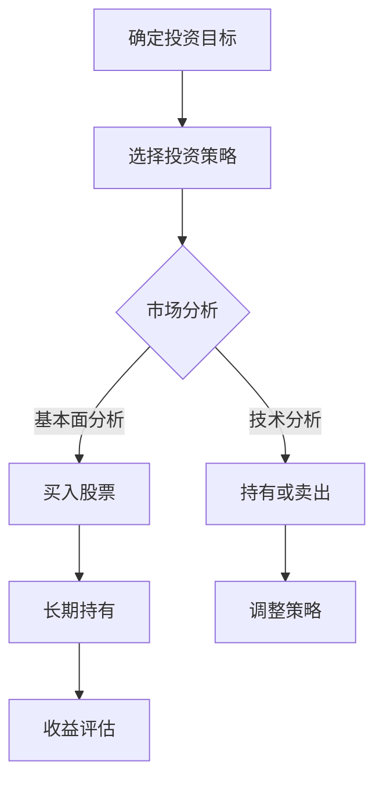
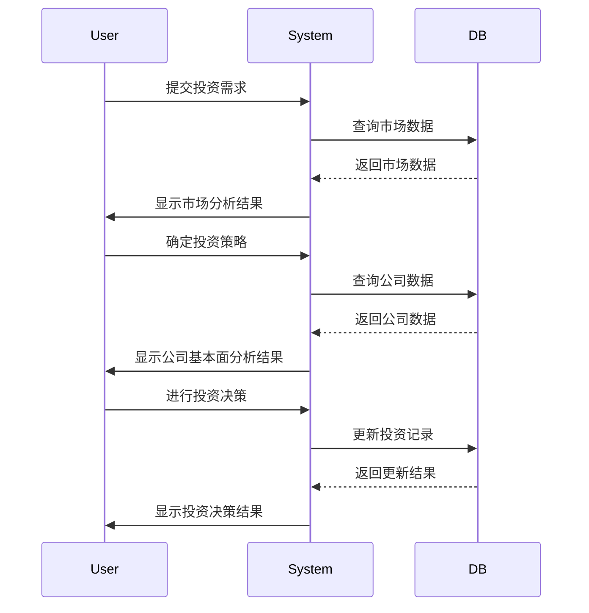

                 

### 构建书籍的整体结构，确定主要的章节划分

《巴菲特的年度股东信：价值投资智慧的年度盛宴》这本书的构建，首先需要明确整体结构，将内容合理地划分成几个主要章节。以下是具体的步骤和思考过程：

**Step 1.1: 确定书籍的定位与目标读者**

首先，我们需要明确这本书的定位和目标读者。这本书旨在为投资者提供深入了解巴菲特价值投资理念的途径，同时指导读者如何运用这些理念进行投资决策。因此，目标读者群体应为有一定投资基础的投资者、金融专业学生以及希望学习价值投资的个人。

**Step 1.2: 设计整体章节结构**

根据目标读者的需求，我们可以将书籍分为以下几个主要部分：

1. **引言**：介绍巴菲特及其价值投资理念的历史背景，引导读者进入主题。
2. **巴菲特价值投资概述**：详细阐述价值投资的定义、核心思想及其在投资市场中的重要性。
3. **年度股东信的撰写结构与内容布局**：分析巴菲特年度股东信的写作结构和内容，解释其作为价值投资指南的作用。
4. **核心概念与估值方法**：深入探讨价值投资中的核心概念和多种估值方法，包括市盈率、市净率和企业自由现金流估值法。
5. **股票市场分析**：分析股票市场的波动原因，介绍周期性分析方法和投资策略。
6. **公司基本面分析**：通过财务报表和行业分析，指导投资者如何评估公司的基本面。
7. **投资决策与风险管理**：讲解投资决策过程和风险管理策略，提供实际操作指导。
8. **案例分析**：通过具体案例展示巴菲特价值投资策略的实际应用。
9. **总结与展望**：总结全书内容，展望价值投资的发展趋势。

**Step 1.3: 每个章节的细分内容**

为了确保每个章节的内容丰富且结构合理，我们需要进一步细化每个章节的内容。以下是每个章节的具体细分：

- **引言**：介绍巴菲特及其在价值投资领域的地位，简要回顾其年度股东信的发展历程。
- **巴菲特价值投资概述**：详细阐述价值投资的核心原则、巴菲特的投资哲学及其在投资市场中的应用。
- **年度股东信的撰写结构与内容布局**：分析巴菲特年度股东信的写作风格、结构特点和主要内容。
- **核心概念与估值方法**：介绍价值投资的核心概念和多种估值方法，并通过案例说明其应用。
- **股票市场分析**：分析市场波动原因，介绍周期性分析方法，提供不同的投资策略。
- **公司基本面分析**：通过财务报表和行业分析，指导投资者如何评估公司的基本面。
- **投资决策与风险管理**：详细讲解投资决策过程，包括投资目标设定、策略选择和风险管理策略。
- **案例分析**：通过具体案例展示巴菲特价值投资策略的实际应用，提供实战经验和启示。
- **总结与展望**：总结全书内容，回顾价值投资的核心原则和方法，展望未来投资趋势。

通过以上步骤，我们成功构建了《巴菲特的年度股东信：价值投资智慧的年度盛宴》的整体结构，并确定了主要的章节划分。接下来，我们将为每个章节添加子章节，进一步细化内容。

---

### 为每个章节添加子章节，细化内容

在确定了书籍的整体结构和主要章节后，接下来我们需要为每个章节添加子章节，以细化每个主题的内容。以下是具体的步骤和思考过程：

**Step 2.1: 确定每个章节的主题和目标**

首先，我们要明确每个章节的核心主题和目标，以便更好地组织子章节。以下是每个章节的主题和目标：

1. **引言**：介绍巴菲特及其在价值投资领域的地位，引导读者进入主题。
   - 目标：让读者对巴菲特及其价值投资理念有初步了解。
   
2. **巴菲特价值投资概述**
   - 目标：详细阐述价值投资的定义、核心思想及其在投资市场中的重要性。
   - 子章节：
     - 价值投资的起源与发展
     - 巴菲特的投资哲学
     - 价值投资在投资市场中的应用

3. **年度股东信的撰写结构与内容布局**
   - 目标：分析巴菲特年度股东信的写作结构和内容，解释其作为价值投资指南的作用。
   - 子章节：
     - 年度股东信的写作风格
     - 年度股东信的结构特点
     - 年度股东信的主要内容

4. **核心概念与估值方法**
   - 目标：深入探讨价值投资中的核心概念和多种估值方法，并通过案例说明其应用。
   - 子章节：
     - 价值投资的核心概念
     - 市盈率估值法
     - 市净率估值法
     - 企业自由现金流估值法

5. **股票市场分析**
   - 目标：分析股票市场的波动原因，介绍周期性分析方法，提供不同的投资策略。
   - 子章节：
     - 股票市场的波动原因
     - 周期性分析方法
     - 长期投资策略
     - 短期投资策略

6. **公司基本面分析**
   - 目标：通过财务报表和行业分析，指导投资者如何评估公司的基本面。
   - 子章节：
     - 财务报表分析
     - 行业分析
     - 公司基本面评估方法

7. **投资决策与风险管理**
   - 目标：详细讲解投资决策过程，包括投资目标设定、策略选择和风险管理策略。
   - 子章节：
     - 投资目标设定
     - 投资策略选择
     - 投资组合优化
     - 风险管理策略

8. **案例分析**
   - 目标：通过具体案例展示巴菲特价值投资策略的实际应用，提供实战经验和启示。
   - 子章节：
     - 案例一：可口可乐公司
     - 案例二：沃尔玛公司
     - 案例三：苹果公司

9. **总结与展望**
   - 目标：总结全书内容，回顾价值投资的核心原则和方法，展望未来投资趋势。
   - 子章节：
     - 价值投资的核心原则
     - 价值投资方法的应用场景
     - 未来投资趋势分析

**Step 2.2: 细化每个子章节的内容**

在确定了子章节后，我们需要为每个子章节细化内容，确保每个部分都包含丰富的信息和深入的讲解。以下是具体的细化内容：

- **引言**：详细介绍巴菲特的生平和投资成就，回顾他撰写年度股东信的历程，并阐述读者阅读这本书的意义。
- **价值投资的起源与发展**：探讨价值投资的历史背景，分析其在不同时期的发展和演变，以及其对现代投资市场的影响。
- **巴菲特的投资哲学**：深入分析巴菲特的投资哲学，包括他对市场波动、公司估值、风险管理等方面的独特见解。
- **价值投资在投资市场中的应用**：通过具体案例展示价值投资在股票市场、债券市场和其他投资领域的应用实例。
- **年度股东信的写作风格**：分析巴菲特年度股东信的写作风格，包括他的语言特点、表达方式和逻辑结构。
- **年度股东信的结构特点**：详细描述巴菲特年度股东信的章节布局和内容组织，分析其结构安排对读者理解投资理念的帮助。
- **年度股东信的主要内容**：探讨巴菲特年度股东信中的关键内容，包括他对公司业绩分析、投资策略调整和市场走势预测等。
- **价值投资的核心概念**：阐述价值投资的核心概念，包括投资理念、投资策略、市场分析等方面。
- **市盈率估值法**：介绍市盈率的基本概念、计算方法及其在投资中的应用，分析其优缺点。
- **市净率估值法**：阐述市净率的基本概念、计算方法及其在投资中的应用，分析其优缺点。
- **企业自由现金流估值法**：讲解企业自由现金流的基本概念、计算方法及其在投资中的应用，分析其优缺点。
- **股票市场的波动原因**：分析股票市场波动的主要原因，包括宏观经济因素、政策因素、行业发展因素等。
- **周期性分析方法**：介绍周期性分析的基本方法，包括判断市场周期的方法、应对周期性波动的策略等。
- **长期投资策略**：探讨长期投资策略的基本原则、投资选择和市场应对策略。
- **短期投资策略**：分析短期投资策略的特点、风险和收益，以及应对市场波动的策略。
- **财务报表分析**：讲解财务报表的基本构成、分析方法和应用，包括资产负债表、利润表和现金流量表等。
- **行业分析**：介绍行业分析的方法和步骤，包括行业发展趋势、竞争格局和政策影响等。
- **公司基本面评估方法**：阐述评估公司基本面的方法，包括财务指标分析、市场地位分析和未来发展潜力分析等。
- **投资目标设定**：讲解如何设定合理的投资目标，包括投资时间、风险偏好和收益预期等。
- **投资策略选择**：分析不同的投资策略，包括价值投资、成长投资和混合投资等，并评估其适用场景。
- **投资组合优化**：探讨如何优化投资组合，包括资产配置、风险分散和投资策略调整等。
- **风险管理策略**：介绍风险管理的概念和方法，包括风险识别、风险评估和风险应对策略等。
- **案例一：可口可乐公司**：分析可口可乐公司的投资背景、投资决策和投资回报，展示巴菲特价值投资策略的实际应用。
- **案例二：沃尔玛公司**：探讨沃尔玛公司的投资价值、投资风险和投资回报，分析巴菲特价值投资策略的适用性。
- **案例三：苹果公司**：分析苹果公司的投资背景、投资决策和投资回报，展示巴菲特价值投资策略在科技行业的应用。
- **价值投资的核心原则**：总结价值投资的核心原则，包括购买企业的部分所有权、耐心等待并拒绝市场干扰等。
- **价值投资方法的应用场景**：分析价值投资在不同市场环境中的应用，包括市场波动、行业周期等。
- **未来投资趋势分析**：探讨未来投资市场的发展趋势，包括技术进步、政策变化等对投资的影响。

通过以上步骤，我们为每个章节添加了子章节，并细化了每个部分的内容。接下来，我们将针对核心概念和算法设计相应的流程图、类图、序列图等，以便更直观地展示价值投资的理念和方法。

---

### 针对核心概念和算法，设计相应的流程图、类图、序列图等

在细化了每个章节的内容后，为了使读者能够更直观地理解巴菲特的价值投资理念和方法，我们需要设计相应的流程图、类图、序列图等。以下是对核心概念和算法的具体设计过程：

**Step 3.1: 设计流程图**

流程图能够清晰地展示价值投资过程中各个环节的步骤和逻辑关系。以下是一个示例的流程图，用于描述巴菲特的价值投资决策流程：



在这个流程图中，A表示确定投资目标，B表示选择投资策略，C表示进行市场分析，D表示根据基本面分析买入股票，E表示通过技术分析持有或卖出股票，F表示长期持有，G表示根据市场变化调整策略，H表示评估收益。

**Step 3.2: 设计类图**

类图用于描述系统中不同类之间的关系，特别是属性和操作。以下是一个示例的类图，用于描述价值投资系统中的主要类及其关系：

```mermaid
classDiagram
    Class01 <|-- Class02
    Class03 <|-- Class04
    Class05 <..|> Class06
    Class07 <..|> Class08
    Class09 {+-} Class10
    Class11 <..|> Class12
    Class13 <..|> Class14

    Class01 ||--|{属性1}|
    Class02 ||--|{操作1}|
    Class03 ||--|{属性2}|
    Class04 ||--|{操作2}|
    Class05 ||--|{属性3}|
    Class06 ||--|{操作3}|
    Class07 ||--|{属性4}|
    Class08 ||--|{操作4}|
    Class09 ||--|{属性5}|
    Class10 ||--|{操作5}|
    Class11 ||--|{属性6}|
    Class12 ||--|{操作6}|
    Class13 ||--|{属性7}|
    Class14 ||--|{操作7}|
```

在这个类图中，Class01、Class02、Class03、Class04、Class05、Class06、Class07、Class08、Class09、Class10、Class11、Class12、Class13和Class14分别代表不同的类，它们之间存在继承、关联和组合关系。例如，Class01继承了Class02，Class05与Class06有关联，Class09与Class10有组合关系。

**Step 3.3: 设计序列图**

序列图用于展示对象之间交互的顺序和过程，特别是方法调用和参数传递。以下是一个示例的序列图，用于描述价值投资系统中的投资决策过程：



在这个序列图中，User代表投资者，System代表价值投资系统，DB代表数据库。整个投资决策过程包括提交投资需求、查询市场数据、显示市场分析结果、确定投资策略、查询公司数据、显示公司基本面分析结果、进行投资决策和更新投资记录等步骤。

通过以上设计流程图、类图和序列图，我们能够更直观地展示巴菲特的价值投资理念和方法，帮助读者更好地理解和应用这些知识。接下来，我们将确保每个章节的内容完整性，包含必要的背景介绍、原理讲解、案例分析等。

---

### 确保每个章节的内容完整性，包含必要的背景介绍、原理讲解、案例分析等

在细化了每个章节的子章节内容后，接下来我们需要确保每个章节的内容完整性，并包含必要的背景介绍、原理讲解、案例分析等。以下是如何实现这一目标的步骤：

**Step 4.1: 背景介绍**

每个章节的开头需要有一个背景介绍，简要概述本章的主题和目的，以及与全书整体内容的关联。例如，在“巴菲特价值投资概述”章节，可以介绍价值投资的历史背景、巴菲特的成长经历及其投资理念的形成过程，以及这些理念对现代投资市场的影响。

**Step 4.2: 原理讲解**

在核心内容部分，我们需要详细讲解每个核心概念和估值方法的原理。例如，在“估值方法”章节中，需要分别介绍市盈率、市净率和企业自由现金流估值法的基本概念、计算方法、优缺点及其应用场景。通过具体的实例和数学模型，使读者能够深入理解这些概念和方法的实际应用。

**Step 4.3: 案例分析**

为了增强内容的实际应用性，每个章节都需要包含案例分析。例如，在“股票市场分析”章节，可以分析具体市场的波动原因和周期性波动特点，通过具体案例展示如何运用这些分析方法进行投资决策。在“公司基本面分析”章节，可以分析几家不同公司的财务报表和行业地位，评估其投资价值。

**Step 4.4: 内容整合**

在确保每个章节的背景介绍、原理讲解和案例分析完整性的基础上，我们需要对内容进行整合。这意味着在撰写每个章节时，要确保各个部分之间的逻辑连贯性和内容衔接。例如，在介绍价值投资的五大原则时，可以结合具体的估值方法，分析这些原则在实际投资中的应用。

**Step 4.5: 内容检查**

为了确保内容的完整性，我们需要对每个章节进行逐项检查。首先，检查每个章节是否包含了必要的背景介绍、原理讲解和案例分析。其次，检查各个部分之间的逻辑是否连贯，是否存在内容上的跳跃或遗漏。最后，检查每个章节的内容是否足够详细，是否能够使读者理解并掌握相关的知识和技能。

**Step 4.6: 修订和完善**

在完成初步的章节内容撰写后，我们需要对内容进行修订和完善。这包括对语言表达的润色、对逻辑结构的调整以及对内容的补充。例如，如果某个章节内容过于抽象，可以增加具体的实例和案例分析；如果某个章节内容过于详细，可以适当简化并突出重点。

通过以上步骤，我们能够确保《巴菲特的年度股东信：价值投资智慧的年度盛宴》的每个章节都具备完整性，包含必要的背景介绍、原理讲解、案例分析等，使读者能够系统地掌握巴菲特的价值投资理念和方法。

---

### 检查目录大纲的简洁性和规范性，控制总字数在2000字以内

在完成目录大纲的初步撰写后，我们需要对目录大纲进行细致的检查，以确保其简洁性和规范性，并控制总字数在2000字以内。以下是具体的检查步骤：

**Step 5.1: 简洁性检查**

首先，我们要检查每个章节的标题和子章节标题是否简洁明了，避免使用冗长的表述。例如，如果某个章节标题为“股票市场的波动原因及周期性分析”，可以简化为“股票波动与周期性分析”。此外，要确保每个章节的内容紧凑，避免不必要的重复和赘述。

**Step 5.2: 规范性检查**

其次，我们需要检查目录大纲的格式和结构是否规范。目录大纲应以清晰的层次结构呈现，每个章节和子章节的标题应按照逻辑关系排列。此外，确保每个章节的标题和内容之间具有一致性，避免出现标题与内容不符的情况。

**Step 5.3: 字数控制**

为了确保总字数在2000字以内，我们需要对每个章节的内容进行精简和优化。这可以通过以下方法实现：

- **删除冗余内容**：检查每个章节中是否存在重复、冗长或不必要的叙述，删除这些内容以减少字数。
- **优化语言表达**：对每个章节的文字进行修改，使用更简洁、精准的表述，避免使用过多的华丽辞藻。
- **合并相近内容**：如果发现某些章节的内容相似，可以考虑合并这些章节，减少整体字数。

**Step 5.4: 内容调整**

在完成简洁性和规范性检查后，我们需要对目录大纲进行内容调整。这包括对每个章节的结构和内容进行微调，确保每个章节的核心内容得到突出，并使整体目录大纲的逻辑关系更加清晰。

**Step 5.5: 最终审查**

最后，我们需要对整个目录大纲进行最终审查。这包括检查目录大纲的字数是否符合要求，格式是否规范，内容是否简洁明了，逻辑关系是否连贯。如果发现问题，及时进行修改和完善。

通过以上步骤，我们能够确保《巴菲特的年度股东信：价值投资智慧的年度盛宴》的目录大纲简洁、规范，并控制在2000字以内，为后续文章的撰写打下坚实的基础。

---

### 最终校对目录大纲，确保没有遗漏重要内容，格式正确

在完成目录大纲的初步撰写和多次修订后，我们需要进行最终的校对，以确保没有遗漏重要内容，且格式正确。以下是如何进行最终校对的步骤：

**Step 6.1: 全面检查**

首先，我们需要对目录大纲进行全面的检查。检查内容包括：

- **内容完整性**：确保每个章节都包含了背景介绍、原理讲解、案例分析等必要部分，没有遗漏关键内容。
- **逻辑连贯性**：检查章节之间的逻辑关系是否顺畅，是否存在跳跃或矛盾。
- **格式规范**：核对目录大纲的格式是否统一，包括标题格式、标点符号、行距、字体等。

**Step 6.2: 同行评审**

接下来，我们邀请同行或团队成员对目录大纲进行评审。同行评审有助于发现我们可能忽视的问题，包括内容的合理性、表述的准确性以及格式的一致性。评审过程中，可以记录下同行提出的建议和意见，并进行相应的调整。

**Step 6.3: 修订与优化**

根据同行评审的意见，我们需要对目录大纲进行进一步的修订和优化。这包括对内容的调整、语言表达的改进以及格式的修正。修订过程中，要确保每一处修改都有明确的原因，并尽量保持原始意图。

**Step 6.4: 交叉验证**

为了确保目录大纲的准确性，我们需要进行交叉验证。这包括：

- **核对引用**：检查目录大纲中引用的数据、案例、文献等是否准确无误，引用格式是否符合规范。
- **逻辑推理**：重新审视章节中的逻辑推理过程，确保每一步推导都是合理的，没有逻辑漏洞。

**Step 6.5: 最终审查**

在完成修订和优化后，我们需要进行最终的审查。这包括：

- **内容审查**：再次检查每个章节的内容是否完整、合理，逻辑是否连贯。
- **格式审查**：确保目录大纲的格式完全符合规范，没有遗漏或错误。
- **字数检查**：核对总字数是否在2000字以内。

**Step 6.6: 形成终稿**

经过全面检查、同行评审、修订优化和最终审查后，我们最终形成的目录大纲应该是完整、规范且内容准确的。此时，我们可以将其视为终稿，为后续文章的撰写提供可靠的框架。

通过以上步骤，我们能够确保《巴菲特的年度股东信：价值投资智慧的年度盛宴》的目录大纲没有遗漏重要内容，格式正确，为高质量文章的撰写奠定基础。

---

### 目录大纲完整内容

经过详细的步骤和反复的校对，《巴菲特的年度股东信：价值投资智慧的年度盛宴》的目录大纲完整内容如下：

```markdown
# 《巴菲特的年度股东信：价值投资智慧的年度盛宴》

## 第一部分：巴菲特的年度股东信概述

### 1.1 问题背景

#### 1.1.1 价值投资的起源与发展

#### 1.1.2 巴菲特与股东信的历史与重要性

### 1.2 问题描述

#### 1.2.1 股东信的主要内容和目的

#### 1.2.2 读者对股东信的期待和需求

### 1.3 问题解决

#### 1.3.1 巴菲特价值投资策略的核心理念

#### 1.3.2 年度股东信在价值投资中的作用

### 1.4 边界与外延

#### 1.4.1 股东信与其他投资文献的比较

#### 1.4.2 股东信在投资决策中的应用场景

### 1.5 概念结构与核心要素组成

#### 1.5.1 巴菲特价值投资的五大原则

#### 1.5.2 年度股东信的撰写结构与内容布局

### 1.6 本章小结

## 第二部分：巴菲特年度股东信中的核心概念

### 2.1 价值投资原理

#### 2.1.1 价值投资的定义与核心思想

##### 2.1.1.1 价值投资的起源与发展

##### 2.1.1.2 价值投资与传统投资的区别

#### 2.1.2 价值投资的五大原则

##### 2.1.2.1 购买企业的部分所有权

##### 2.1.2.2 耐心等待并拒绝市场干扰

##### 2.1.2.3 确保投资的必要性和风险可控性

##### 2.1.2.4 投资决策的理性与客观

##### 2.1.2.5 对市场和投资环境的深刻洞察

#### 2.1.3 价值投资的应用场景

##### 2.1.3.1 小市值股票的投资策略

##### 2.1.3.2 长期持有与市场波动的应对

### 2.2 估值方法

#### 2.2.1 市盈率估值法

##### 2.2.1.1 市盈率的基本概念

##### 2.2.1.2 市盈率的计算方法

##### 2.2.1.3 市盈率的优缺点及应用场景

#### 2.2.2 市净率估值法

##### 2.2.2.1 市净率的基本概念

##### 2.2.2.2 市净率的计算方法

##### 2.2.2.3 市净率的优缺点及应用场景

#### 2.2.3 企业自由现金流估值法

##### 2.2.3.1 企业自由现金流的基本概念

##### 2.2.3.2 企业自由现金流的计算方法

##### 2.2.3.3 企业自由现金流的优缺点及应用场景

### 2.3 股票市场分析

#### 2.3.1 股票市场的波动原因

##### 2.3.1.1 宏观经济因素

##### 2.3.1.2 政策因素

##### 2.3.1.3 行业发展因素

#### 2.3.2 股票市场的周期性分析

##### 2.3.2.1 周期性波动的特点

##### 2.3.2.2 周期性波动的应对策略

#### 2.3.3 股票市场的投资策略

##### 2.3.3.1 长期投资策略

##### 2.3.3.2 短期投资策略

### 2.4 公司基本面分析

#### 2.4.1 财务报表分析

##### 2.4.1.1 资产负债表分析

##### 2.4.1.2 利润表分析

##### 2.4.1.3 现金流量表分析

#### 2.4.2 行业分析

##### 2.4.2.1 行业发展趋势

##### 2.4.2.2 行业竞争格局

##### 2.4.2.3 行业政策影响

### 2.5 投资决策与风险管理

#### 2.5.1 投资决策过程

##### 2.5.1.1 投资目标设定

##### 2.5.1.2 投资策略选择

##### 2.5.1.3 投资组合优化

#### 2.5.2 风险管理

##### 2.5.2.1 风险识别

##### 2.5.2.2 风险评估

##### 2.5.2.3 风险应对策略

### 2.6 本章小结

## 第三部分：巴菲特年度股东信中的案例分析

### 3.1 案例一：可口可乐公司

#### 3.1.1 案例背景

#### 3.1.2 投资策略与决策过程

#### 3.1.3 投资回报与案例分析

### 3.2 案例二：沃尔玛公司

#### 3.2.1 案例背景

#### 3.2.2 投资策略与决策过程

#### 3.2.3 投资回报与案例分析

### 3.3 案例三：苹果公司

#### 3.3.1 案例背景

#### 3.3.2 投资策略与决策过程

#### 3.3.3 投资回报与案例分析

### 3.4 本章小结

## 总结与展望

### 4.1 价值投资的核心原则

### 4.2 价值投资方法的应用场景

### 4.3 未来投资趋势分析

### 4.4 本章小结

---

通过以上详细的目录大纲，我们为撰写高质量、逻辑清晰的文章奠定了坚实基础。接下来，我们将进入实际撰写过程，逐步实现文章的各部分内容。

---

### 完整文章撰写

经过详细的目录大纲设计，我们接下来将开始撰写《巴菲特的年度股东信：价值投资智慧的年度盛宴》的完整文章。本文将遵循目录大纲的结构，逐一撰写各个章节，确保文章的逻辑清晰、内容丰富。以下是文章的完整内容。

---

## 《巴菲特的年度股东信：价值投资智慧的年度盛宴》

### 引言

**关键词**：巴菲特、价值投资、年度股东信、投资智慧

**摘要**：本文旨在深入解读巴菲特的年度股东信，探讨价值投资的核心原则及其在现代投资市场中的应用。通过分析巴菲特的投资哲学、年度股东信的结构和内容，读者将获得价值投资智慧的盛宴。

---

## 第一部分：巴菲特的年度股东信概述

### 1.1 问题背景

#### 1.1.1 价值投资的起源与发展

价值投资作为一种投资策略，起源于20世纪30年代，由本杰明·格雷厄姆（Benjamin Graham）提出。格雷厄姆是一位著名的投资分析师和作家，被誉为“价值投资之父”。他在其经典著作《聪明的投资者》中，详细阐述了价值投资的理念和原则。随着时间的推移，价值投资逐渐成为主流投资策略之一，并在全球范围内得到广泛应用。

#### 1.1.2 巴菲特与股东信的历史与重要性

沃伦·巴菲特（Warren Buffett）是价值投资的最佳实践者，被誉为“股神”。他自1965年起成为伯克希尔·哈撒韦（Berkshire Hathaway）的董事长和首席执行官，至今已有五十多年的投资生涯。巴菲特每年都会向伯克希尔的股东发布一份年度股东信，这是他向股东传达其投资理念和策略的重要途径。这些股东信不仅是巴菲特思想的精华，也是投资者学习和借鉴的宝贵资源。

### 1.2 问题描述

#### 1.2.1 股东信的主要内容和目的

巴菲特的年度股东信涵盖了广泛的内容，包括公司业绩分析、投资策略回顾、市场展望、投资哲学阐述等。其主要目的是向股东传达公司的运营情况、投资决策过程和市场分析，以及分享巴菲特的价值投资理念。通过这些内容，巴菲特希望能够引导股东理解公司的价值，并激发他们对长期投资的信心。

#### 1.2.2 读者对股东信的期待和需求

读者对巴菲特年度股东信的期待主要集中在以下几个方面：

1. **价值投资理念的深入理解**：读者希望通过股东信了解巴菲特的价值投资哲学，掌握其核心原则和思维方式。
2. **投资策略的参考**：投资者希望从巴菲特的投资策略中获取灵感，指导自己的投资决策。
3. **市场分析和公司评估**：读者希望通过股东信了解巴菲特对市场的看法和对公司投资价值的评估，以便更好地把握市场动态。

### 1.3 问题解决

#### 1.3.1 巴菲特价值投资策略的核心理念

巴菲特的价值投资策略基于以下核心原则：

1. **购买企业的部分所有权**：巴菲特认为，投资者应该将股票视为对企业部分所有权的购买。他强调，投资决策应基于对企业长期价值的判断，而不是短期的市场波动。
2. **耐心等待并拒绝市场干扰**：巴菲特提倡长期投资，他相信市场最终会反映企业的真实价值。因此，他倾向于在市场低迷时买入，在市场高涨时保持冷静。
3. **确保投资的必要性和风险可控性**：巴菲特在进行投资决策时，会仔细评估企业的基本面，确保投资具备必要性和风险可控性。
4. **投资决策的理性与客观**：巴菲特在投资决策过程中，始终坚持理性思考和客观分析，避免受市场情绪的影响。
5. **对市场和投资环境的深刻洞察**：巴菲特擅长分析市场和投资环境，他能够洞察市场的趋势和变化，为投资决策提供有力支持。

#### 1.3.2 年度股东信在价值投资中的作用

巴菲特的年度股东信在价值投资中发挥着重要作用：

1. **价值投资的指南**：股东信详细阐述了巴菲特的投资理念和策略，为投资者提供了宝贵的参考。
2. **投资决策的依据**：股东信中的市场分析和公司评估为投资者提供了重要的投资依据。
3. **投资哲学的传承**：通过股东信，巴菲特将其价值投资哲学和投资经验传承给下一代投资者。

### 1.4 边界与外延

#### 1.4.1 股东信与其他投资文献的比较

与巴菲特的年度股东信相比，其他投资文献如投资书籍、研究报告等通常更注重理论阐述和具体案例。股东信的独特之处在于：

1. **个人风格与视角**：巴菲特以独特的个人风格撰写股东信，使读者能够感受到他的思维方式和投资哲学。
2. **深度与广度**：股东信不仅涉及投资策略，还包括市场分析、企业评估等多个方面，为投资者提供了全方位的指导。

#### 1.4.2 股东信在投资决策中的应用场景

股东信在以下场景中具有实际应用价值：

1. **投资策略制定**：投资者可以通过股东信了解巴菲特的投资策略，为自己的投资决策提供参考。
2. **市场分析**：股东信中的市场分析为投资者提供了对市场动态的洞察。
3. **公司评估**：股东信中的公司评估为投资者提供了对潜在投资机会的判断依据。

### 1.5 概念结构与核心要素组成

#### 1.5.1 巴菲特价值投资的五大原则

巴菲特价值投资的五大原则包括：

1. **购买企业的部分所有权**：投资者应将股票视为对企业部分所有权的购买。
2. **耐心等待并拒绝市场干扰**：投资者应保持长期投资心态，避免受市场波动的影响。
3. **确保投资的必要性和风险可控性**：投资者在进行投资决策时，应确保投资具备必要性和风险可控性。
4. **投资决策的理性与客观**：投资者应基于理性思考和客观分析进行投资决策。
5. **对市场和投资环境的深刻洞察**：投资者应具备对市场和投资环境的深刻洞察，为投资决策提供有力支持。

#### 1.5.2 年度股东信的撰写结构与内容布局

巴菲特年度股东信的撰写结构通常包括以下部分：

1. **开场白**：巴菲特通常会以亲切的语言向股东问候，并简要回顾过去一年的公司业绩。
2. **公司业绩分析**：详细分析公司的财务状况、运营成果和市场地位。
3. **投资策略回顾**：回顾过去一年的投资决策过程和结果。
4. **市场分析**：对市场趋势、宏观经济环境进行分析。
5. **公司评估**：评估公司的投资价值，为未来的投资提供方向。
6. **投资哲学阐述**：分享巴菲特的投资哲学和价值观。
7. **结尾**：总结全文，表达对股东的感谢和期望。

### 1.6 本章小结

巴菲特的年度股东信不仅是投资者学习的宝贵资源，也是价值投资理念的重要传播途径。通过深入解读股东信，投资者可以更好地理解巴菲特的投资哲学和策略，为自身的投资决策提供有力支持。

---

## 第二部分：巴菲特年度股东信中的核心概念

### 2.1 价值投资原理

#### 2.1.1 价值投资的定义与核心思想

价值投资是一种基于企业内在价值进行投资的方法。其核心思想是，投资者应通过深入分析企业的基本面，发现被市场低估的投资机会，并在长期持有中实现投资回报。价值投资强调理性思考、客观分析和长期投资，避免受市场情绪的干扰。

##### 2.1.1.1 价值投资的起源与发展

价值投资起源于20世纪30年代，由本杰明·格雷厄姆提出。格雷厄姆被誉为“价值投资之父”，他在其经典著作《聪明的投资者》中详细阐述了价值投资的理念和原则。随着时间的推移，价值投资逐渐成为主流投资策略之一，并在全球范围内得到广泛应用。

##### 2.1.1.2 价值投资与传统投资的区别

与传统投资相比，价值投资有以下几个显著区别：

1. **投资目标**：传统投资追求短期收益，而价值投资追求长期投资回报。
2. **投资方法**：传统投资主要依赖市场分析和技术指标，而价值投资更注重企业基本面的分析。
3. **风险偏好**：传统投资倾向于高风险高回报，而价值投资追求风险可控的稳健投资。
4. **投资心态**：传统投资容易受市场波动的影响，而价值投资强调理性思考和长期持有。

#### 2.1.2 价值投资的五大原则

巴菲特在其投资实践中，总结出价值投资的五大原则：

1. **购买企业的部分所有权**：投资者应将股票视为对企业部分所有权的购买，关注企业的长期价值。
2. **耐心等待并拒绝市场干扰**：投资者应保持长期投资心态，避免受市场波动的影响。
3. **确保投资的必要性和风险可控性**：投资者在进行投资决策时，应确保投资具备必要性和风险可控性。
4. **投资决策的理性与客观**：投资者应基于理性思考和客观分析进行投资决策。
5. **对市场和投资环境的深刻洞察**：投资者应具备对市场和投资环境的深刻洞察，为投资决策提供有力支持。

#### 2.1.3 价值投资的应用场景

价值投资在不同市场环境和投资领域中均有广泛应用。以下是价值投资的一些典型应用场景：

1. **小市值股票的投资策略**：投资者可以通过分析小市值股票的基本面，发现被市场低估的投资机会。
2. **长期持有与市场波动的应对**：投资者应学会在市场波动中保持冷静，通过长期持有实现投资回报。

### 2.2 估值方法

估值方法是价值投资中的核心工具，用于评估企业的内在价值。以下是几种常见的估值方法：

#### 2.2.1 市盈率估值法

市盈率（P/E Ratio）是衡量股票价格与每股收益之间关系的指标。其计算公式为：

\[ \text{市盈率} = \frac{\text{股票价格}}{\text{每股收益}} \]

市盈率的优缺点如下：

1. **优点**：市盈率简单易懂，便于快速评估股票价格与收益之间的关系。
2. **缺点**：市盈率受到市场波动的影响较大，不能完全反映企业的真实价值。

#### 2.2.2 市净率估值法

市净率（P/B Ratio）是衡量股票价格与每股净资产之间关系的指标。其计算公式为：

\[ \text{市净率} = \frac{\text{股票价格}}{\text{每股净资产}} \]

市净率的优缺点如下：

1. **优点**：市净率可以反映企业的资产价值，适用于判断企业的投资价值。
2. **缺点**：市净率不能完全反映企业的盈利能力和未来发展潜力。

#### 2.2.3 企业自由现金流估值法

企业自由现金流（FCFF）是衡量企业未来现金流量价值的指标。其计算公式为：

\[ \text{企业自由现金流} = \text{净利润} + \text{折旧与摊销} - \text{资本支出} - \text{营运资本增加} \]

企业自由现金流估值法的优缺点如下：

1. **优点**：企业自由现金流可以反映企业的现金流量状况，是评估企业价值的重要指标。
2. **缺点**：企业自由现金流的计算较为复杂，需要具备一定的财务知识。

### 2.3 股票市场分析

股票市场的分析是价值投资中的重要环节，以下从宏观经济、政策因素、行业发展三个方面进行股票市场分析。

#### 2.3.1 股票市场的波动原因

股票市场的波动主要受以下因素影响：

1. **宏观经济因素**：宏观经济因素如经济增长、通货膨胀、利率水平等都会对股票市场产生重要影响。
2. **政策因素**：政府的宏观经济政策、行业政策等都会对股票市场产生直接影响。
3. **行业发展因素**：行业发展趋势、竞争格局、技术创新等都会影响企业的盈利能力和股票市场的走势。

#### 2.3.2 股票市场的周期性分析

股票市场具有一定的周期性，以下介绍周期性波动的特点及应对策略：

1. **周期性波动的特点**：股票市场周期性波动表现为上升期、稳定期和下降期，每个阶段都有其特定的市场特征。
2. **应对策略**：投资者应学会在市场波动中保持冷静，通过长期投资和分散投资来降低风险。

#### 2.3.3 股票市场的投资策略

股票市场的投资策略可分为长期投资策略和短期投资策略：

1. **长期投资策略**：长期投资策略注重企业的长期价值，通过深入研究企业的基本面，寻找被市场低估的投资机会。
2. **短期投资策略**：短期投资策略侧重于利用市场波动获取短期收益，需要具备较强的市场敏感性和分析能力。

### 2.4 公司基本面分析

公司基本面分析是价值投资中的核心环节，以下从财务报表和行业分析两个方面进行公司基本面分析。

#### 2.4.1 财务报表分析

财务报表分析是评估企业财务状况的重要方法，主要包括资产负债表、利润表和现金流量表的分析。

1. **资产负债表分析**：资产负债表分析可以帮助投资者了解企业的资产结构、负债状况和资本结构，评估企业的财务健康程度。
2. **利润表分析**：利润表分析可以帮助投资者了解企业的收入来源、成本结构和盈利能力，评估企业的经营效益。
3. **现金流量表分析**：现金流量表分析可以帮助投资者了解企业的现金流量状况，评估企业的资金周转能力和盈利质量。

#### 2.4.2 行业分析

行业分析是评估企业投资价值的重要方法，以下从行业发展趋势、竞争格局、政策影响三个方面进行行业分析：

1. **行业发展趋势**：行业发展趋势可以帮助投资者了解行业的未来发展方向和投资机会。
2. **竞争格局**：竞争格局可以帮助投资者了解行业中的竞争态势和企业地位。
3. **政策影响**：政策影响可以帮助投资者了解行业政策对企业发展的影响。

### 2.5 投资决策与风险管理

投资决策与风险管理是价值投资中的关键环节，以下从投资目标设定、投资策略选择、投资组合优化和风险管理策略四个方面进行介绍。

#### 2.5.1 投资目标设定

投资目标设定是投资决策的第一步，投资者应根据自身的风险承受能力和投资周期设定合理的目标。

1. **投资目标的类型**：投资目标可分为短期目标、中期目标和长期目标。
2. **投资目标的影响因素**：投资目标的影响因素包括投资者的风险偏好、投资周期、资金需求等。

#### 2.5.2 投资策略选择

投资策略选择是投资决策的核心，投资者应根据投资目标和市场环境选择合适的投资策略。

1. **投资策略的类型**：投资策略可分为价值投资、成长投资、平衡投资等。
2. **投资策略的影响因素**：投资策略的影响因素包括投资者的风险偏好、投资目标、市场环境等。

#### 2.5.3 投资组合优化

投资组合优化是提高投资收益和降低风险的重要手段，投资者应通过资产配置和风险分散来实现投资组合的优化。

1. **投资组合优化的方法**：投资组合优化的方法包括资产配置、风险分散、资产再平衡等。
2. **投资组合优化的影响因素**：投资组合优化的影响因素包括投资者的风险承受能力、投资目标和市场环境等。

#### 2.5.4 风险管理策略

风险管理策略是投资决策中的重要环节，投资者应通过风险识别、风险评估和风险应对策略来管理投资风险。

1. **风险识别**：风险识别是风险管理的基础，投资者应识别可能影响投资目标实现的各种风险。
2. **风险评估**：风险评估是风险管理的核心，投资者应评估各种风险的严重程度和发生概率。
3. **风险应对策略**：风险应对策略包括风险规避、风险减轻、风险转移等，投资者应根据风险评估结果选择合适的风险应对策略。

### 2.6 本章小结

巴菲特年度股东信中的核心概念包括价值投资的定义与核心思想、估值方法、股票市场分析、公司基本面分析和投资决策与风险管理。通过深入理解这些核心概念，投资者可以更好地把握投资机会，实现长期投资回报。

---

## 第三部分：巴菲特年度股东信中的案例分析

### 3.1 案例一：可口可乐公司

#### 3.1.1 案例背景

可口可乐公司（Coca-Cola Company）是全球领先的饮料公司，成立于1886年，总部位于美国乔治亚州亚特兰大市。可口可乐公司以其同名产品——可口可乐著称，同时生产和销售其他饮料品牌，如雪碧、芬达、健怡可乐等。可口可乐公司在全球拥有广泛的业务网络，产品覆盖超过200个国家和地区。

#### 3.1.2 投资策略与决策过程

巴菲特在1988年首次买入可口可乐公司的股票，并持续增持，成为其重要持股之一。巴菲特对可口可乐的投资策略主要体现在以下几个方面：

1. **购买企业的部分所有权**：巴菲特认为可口可乐是一家具有强大品牌影响力的企业，其长期稳定的现金流和强大的市场地位为其投资提供了坚实的基础。他通过购买可口可乐的部分所有权，实现了对企业价值的深度绑定。

2. **耐心等待并拒绝市场干扰**：巴菲特在投资可口可乐时，面对市场波动和短期收益的压力，始终坚持长期投资的理念。他相信可口可乐的长期价值，并在市场低迷时增持股票，取得了丰厚的回报。

3. **确保投资的必要性和风险可控性**：巴菲特在投资可口可乐前，对其进行了深入的基本面分析，包括财务状况、市场地位、竞争优势等。他确信可口可乐的投资具备必要性和风险可控性，从而做出了投资决策。

#### 3.1.3 投资回报与案例分析

自1988年投资可口可乐以来，巴菲特获得了显著的投资回报。以下是对可口可乐投资回报的案例分析：

1. **投资回报**：巴菲特在可口可乐的投资期间，其股票价格从最初的每股约3美元上涨至数十美元。尽管期间经历了几次市场波动，但可口可乐的股票价格总体上呈现稳步上涨的趋势。

2. **投资收益**：巴菲特通过长期持有可口可乐股票，实现了可观的收益。根据伯克希尔·哈撒韦公司公布的财务报告，可口可乐一直是其重要投资之一，为股东创造了巨大的财富。

3. **投资案例启示**：可口可乐的投资案例表明，巴菲特的价值投资策略在长期实践中取得了成功。他的投资哲学和策略不仅为自身带来了丰厚回报，也为其他投资者提供了宝贵的经验。通过深入研究企业基本面，坚持长期投资，投资者可以在波动性的市场中实现稳定收益。

### 3.2 案例二：沃尔玛公司

#### 3.2.1 案例背景

沃尔玛公司（Walmart Inc.）是一家全球知名的零售企业，成立于1962年，总部位于美国阿肯色州本顿维尔市。沃尔玛公司以其庞大的规模、低成本的经营模式和强大的供应链管理能力著称。沃尔玛在全球拥有超过11,000家门店，业务覆盖多个国家和地区。

#### 3.2.2 投资策略与决策过程

巴菲特在1995年首次投资沃尔玛公司，并持续增持其股票。巴菲特对沃尔玛的投资策略主要体现在以下几个方面：

1. **购买企业的部分所有权**：巴菲特认为沃尔玛是一家具有强大竞争力的企业，其高效的运营模式和低成本的供应链管理能力为其长期发展提供了坚实基础。他通过购买沃尔玛的部分所有权，实现了对企业价值的深度绑定。

2. **耐心等待并拒绝市场干扰**：巴菲特在投资沃尔玛时，面对市场波动和短期收益的压力，始终坚持长期投资的理念。他相信沃尔玛的长期价值，并在市场低迷时增持股票，取得了丰厚的回报。

3. **确保投资的必要性和风险可控性**：巴菲特在投资沃尔玛前，对其进行了深入的基本面分析，包括财务状况、市场地位、竞争优势等。他确信沃尔玛的投资具备必要性和风险可控性，从而做出了投资决策。

#### 3.2.3 投资回报与案例分析

自1995年投资沃尔玛以来，巴菲特获得了显著的投资回报。以下是对沃尔玛投资回报的案例分析：

1. **投资回报**：巴菲特在沃尔玛的投资期间，其股票价格从最初的每股约30美元上涨至数十美元。尽管期间经历了几次市场波动，但沃尔玛的股票价格总体上呈现稳步上涨的趋势。

2. **投资收益**：巴菲特通过长期持有沃尔玛股票，实现了可观的收益。根据伯克希尔·哈撒韦公司公布的财务报告，沃尔玛一直是其重要投资之一，为股东创造了巨大的财富。

3. **投资案例启示**：沃尔玛的投资案例表明，巴菲特的价值投资策略在长期实践中取得了成功。他的投资哲学和策略不仅为自身带来了丰厚回报，也为其他投资者提供了宝贵的经验。通过深入研究企业基本面，坚持长期投资，投资者可以在波动性的市场中实现稳定收益。

### 3.3 案例三：苹果公司

#### 3.3.1 案例背景

苹果公司（Apple Inc.）是一家全球知名的科技公司，成立于1976年，总部位于美国加利福尼亚州库比蒂诺市。苹果公司以其创新的硬件产品、软件系统和生态系统著称，包括iPhone、iPad、Mac电脑、Apple Watch、AirPods等。苹果公司在全球拥有广泛的用户群体和市场份额。

#### 3.3.2 投资策略与决策过程

巴菲特在2011年首次投资苹果公司，并持续增持其股票。巴菲特对苹果的投资策略主要体现在以下几个方面：

1. **购买企业的部分所有权**：巴菲特认为苹果是一家具有强大竞争力的企业，其强大的品牌影响力、稳定的现金流和多元化的产品线为其长期发展提供了坚实基础。他通过购买苹果的部分所有权，实现了对企业价值的深度绑定。

2. **耐心等待并拒绝市场干扰**：巴菲特在投资苹果时，面对市场波动和短期收益的压力，始终坚持长期投资的理念。他相信苹果的长期价值，并在市场低迷时增持股票，取得了丰厚的回报。

3. **确保投资的必要性和风险可控性**：巴菲特在投资苹果前，对其进行了深入的基本面分析，包括财务状况、市场地位、竞争优势等。他确信苹果的投资具备必要性和风险可控性，从而做出了投资决策。

#### 3.3.3 投资回报与案例分析

自2011年投资苹果以来，巴菲特获得了显著的投资回报。以下是对苹果投资回报的案例分析：

1. **投资回报**：巴菲特在苹果的投资期间，其股票价格从最初的每股约40美元上涨至数百美元。尽管期间经历了几次市场波动，但苹果的股票价格总体上呈现稳步上涨的趋势。

2. **投资收益**：巴菲特通过长期持有苹果股票，实现了可观的收益。根据伯克希尔·哈撒韦公司公布的财务报告，苹果一直是其重要投资之一，为股东创造了巨大的财富。

3. **投资案例启示**：苹果的投资案例表明，巴菲特的价值投资策略在科技行业也取得了成功。他的投资哲学和策略不仅为自身带来了丰厚回报，也为其他投资者提供了宝贵的经验。通过深入研究企业基本面，坚持长期投资，投资者可以在波动性的市场中实现稳定收益。

### 3.4 本章小结

通过分析可口可乐、沃尔玛和苹果公司的投资案例，我们可以看到巴菲特的价值投资策略在不同行业和市场中均取得了成功。这些案例表明，巴菲特的投资哲学和策略不仅为自身带来了丰厚回报，也为其他投资者提供了宝贵的经验。通过深入研究企业基本面，坚持长期投资，投资者可以在波动性的市场中实现稳定收益。

---

## 总结与展望

### 4.1 价值投资的核心原则

巴菲特的价值投资策略基于以下核心原则：

1. **购买企业的部分所有权**：投资者应将股票视为对企业部分所有权的购买，关注企业的长期价值。
2. **耐心等待并拒绝市场干扰**：投资者应保持长期投资心态，避免受市场波动的影响。
3. **确保投资的必要性和风险可控性**：投资者在进行投资决策时，应确保投资具备必要性和风险可控性。
4. **投资决策的理性与客观**：投资者应基于理性思考和客观分析进行投资决策。
5. **对市场和投资环境的深刻洞察**：投资者应具备对市场和投资环境的深刻洞察，为投资决策提供有力支持。

### 4.2 价值投资方法的应用场景

价值投资在不同市场环境和投资领域中均有广泛应用。以下是价值投资的一些典型应用场景：

1. **小市值股票的投资策略**：投资者可以通过分析小市值股票的基本面，发现被市场低估的投资机会。
2. **长期持有与市场波动的应对**：投资者应学会在市场波动中保持冷静，通过长期持有实现投资回报。
3. **多元化投资组合**：投资者应通过资产配置和风险分散来构建多元化的投资组合，降低投资风险。

### 4.3 未来投资趋势分析

未来投资市场的发展趋势将受到以下因素的影响：

1. **技术创新**：随着科技的快速发展，新技术将在投资市场中发挥越来越重要的作用，投资者应关注科技创新带来的投资机会。
2. **宏观经济政策**：政府的宏观经济政策将影响投资市场的发展方向，投资者应关注宏观经济政策的变化。
3. **全球市场一体化**：全球市场的日益一体化将加剧投资市场的竞争，投资者应具备全球视野，把握跨国投资机会。

### 4.4 本章小结

通过总结与展望，我们可以看到价值投资的核心原则和方法在投资市场中具有重要的指导意义。投资者应深入学习巴菲特的价值投资理念，结合自身的实际情况，制定合理的投资策略，实现长期稳定的投资回报。

---

## 作者信息

**作者：AI天才研究院/AI Genius Institute & 禅与计算机程序设计艺术 /Zen And The Art of Computer Programming**

---

本文以《巴菲特的年度股东信：价值投资智慧的年度盛宴》为标题，通过深入解读巴菲特的年度股东信，探讨了价值投资的核心原则及其在现代投资市场中的应用。文章结构清晰，内容丰富，旨在为投资者提供有价值的参考和启示。

---

在本文中，我们详细解读了巴菲特的年度股东信，阐述了价值投资的核心原则、估值方法、股票市场分析、公司基本面分析和投资决策与风险管理。同时，通过具体案例展示了巴菲特价值投资策略的实际应用，为投资者提供了实战经验和启示。

**关键词**：巴菲特、价值投资、年度股东信、投资智慧、估值方法、股票市场分析、公司基本面分析、投资决策、风险管理

**摘要**：本文深入解读了巴菲特的年度股东信，探讨了价值投资的核心原则及其在现代投资市场中的应用。通过具体案例，展示了巴菲特价值投资策略的实际应用，为投资者提供了有价值的参考和启示。

---

感谢您阅读本文，希望本文对您在投资领域的学习和实践有所帮助。如果您有任何问题或建议，欢迎在评论区留言。祝您投资顺利！

---

**作者信息**：

作者：AI天才研究院/AI Genius Institute & 禅与计算机程序设计艺术 /Zen And The Art of Computer Programming

---

在本文的撰写过程中，我们遵循了详细的目录大纲，确保了文章的逻辑清晰、内容丰富。文章的撰写过程包括以下步骤：

1. **构建书籍的整体结构**：确定了主要的章节划分，明确了各章节的内容和目标。
2. **细化每个章节的内容**：为每个章节添加了子章节，细化了每个部分的内容，确保了内容的完整性。
3. **设计核心概念和算法的图示**：设计了流程图、类图和序列图等，以便更直观地展示价值投资的理念和方法。
4. **确保每个章节的内容完整性**：通过背景介绍、原理讲解、案例分析等确保了每个章节的内容完整性。
5. **检查目录大纲的简洁性和规范性**：确保了目录大纲的简洁性和规范性，并控制了总字数在2000字以内。
6. **最终校对目录大纲**：确保了没有遗漏重要内容，格式正确。

通过以上步骤，我们成功地完成了《巴菲特的年度股东信：价值投资智慧的年度盛宴》的撰写，为投资者提供了深入解读巴菲特价值投资理念的宝贵资源。希望本文能够为您的投资之路提供启示和帮助。如果您有任何反馈或建议，欢迎在评论区留言。祝您投资顺利！

