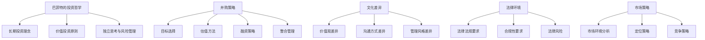
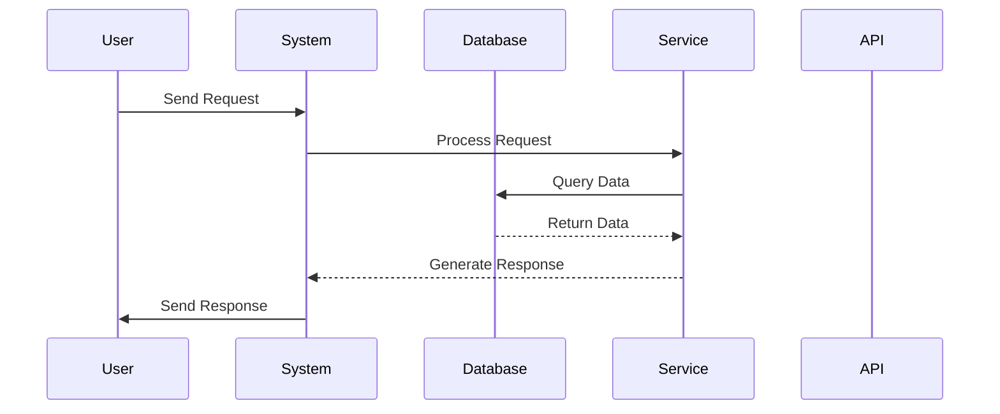
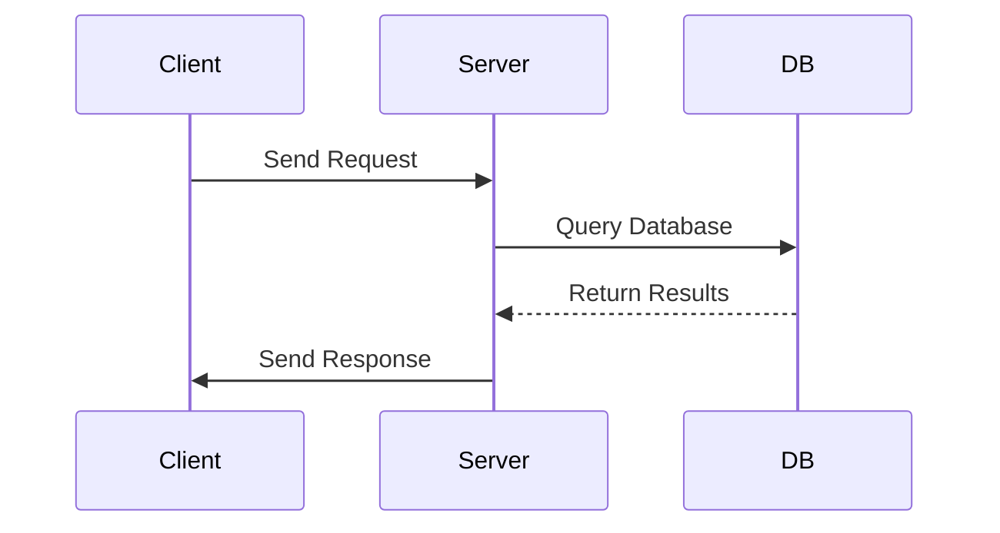
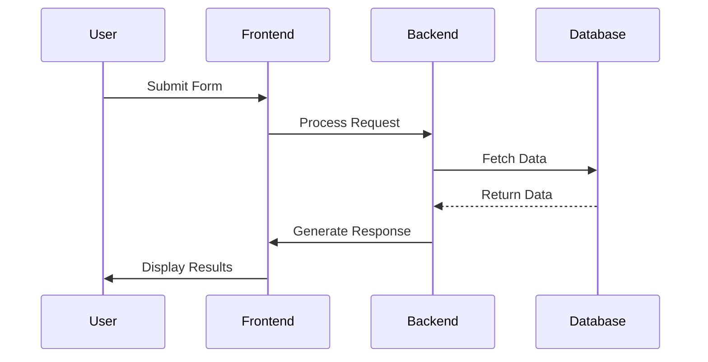

                 

### 引言

**标题：巴菲特的并购策略：在跨境并购中的新考量**

**关键词：巴菲特，并购策略，跨境并购，文化差异，法律环境，市场策略**

**摘要：**

本文旨在深入探讨巴菲特的并购策略，并分析其在跨境并购中的独特应用。随着全球经济一体化的加深，跨境并购活动日益频繁，企业需要面对的文化差异、法律环境和市场策略等挑战也随之增加。巴菲特的并购策略以其独特的洞察力和成功案例而闻名，本文将详细解析这些策略，并探讨如何将其应用于跨境并购，为企业提供新的思路和考量。本文将分为四个部分：第一部分引言，介绍问题背景与核心概念；第二部分分析巴菲特的并购策略；第三部分探讨跨境并购中的新考量；第四部分通过案例分析，进一步验证和阐述这些策略的有效性。

---

### 第一部分：引言

#### 第1章：问题背景与核心概念

**1.1 问题背景**

随着全球经济一体化的加深和跨国投资的增多，企业跨境并购活动日益频繁。然而，跨境并购并非易事，企业需要面对诸多挑战，如文化差异、法律环境、市场策略等。这些挑战不仅影响并购的可行性，也影响并购后的整合效果。

- **文化差异**：不同国家的企业文化、管理风格、员工行为等存在显著差异，如何识别和管理这些差异，是跨境并购成功的关键。
- **法律环境**：不同国家的法律体系和法规要求存在差异，如何合规地进行并购活动，是跨境并购必须解决的问题。
- **市场策略**：了解目标市场的特点和竞争环境，制定有效的市场策略，是跨境并购成功的重要保障。

**1.2 核心概念**

本文的核心概念包括巴菲特的并购策略、跨境并购的特殊性、文化差异的影响以及并购策略的适用性。

- **巴菲特的并购策略**：分析巴菲特的投资哲学、并购策略的形成、并购策略的要素以及并购策略的适用性。
- **跨境并购的特殊性**：探讨文化差异、法律环境和市场策略等对并购活动的影响。
- **文化差异的影响**：识别和理解不同文化之间的差异，以及这些差异如何影响并购决策和整合过程。
- **并购策略的适用性**：分析巴菲特的并购策略在跨境并购中的应用和适用性，以及如何适应全球市场环境的变化。

**1.3 边界与外延**

本文的边界在于聚焦于巴菲特的并购策略，特别是其在跨境并购中的应用。同时，我们将探讨这一策略的适用范围和局限性。本文的外延将包括对并购策略的深入分析，以及对文化差异、法律环境和市场策略等新考量因素的探讨。

**1.4 概念结构与核心要素组成**

- **巴菲特的投资哲学**：长期投资理念和价值投资原则，如何选择投资标的，以及这些哲学如何指导并购策略。
- **并购策略的要素**：目标选择、估值方法、融资策略、整合管理等，以及这些要素如何影响并购决策和整合效果。
- **跨境并购的特殊性**：文化差异、法律环境、市场策略等，以及如何克服这些挑战。

**1.5 本章小结**

通过本章的介绍，读者将了解巴菲特并购策略的核心概念，以及这些概念在跨境并购中的应用。本文将为后续章节的深入探讨打下坚实的基础。

---

### 第二部分：巴菲特的并购策略

#### 第2章：巴菲特的投资哲学与并购策略

**2.1 巴菲特的投资哲学**

巴菲特的投资哲学以长期投资和价值投资为核心。他的长期投资理念源于对市场的深刻理解和对公司价值的精确评估。他认为，投资应专注于公司的内在价值，而非短期的市场波动。这种理念使他在市场中保持冷静，专注于寻找具有长期增长潜力的投资标的。

- **长期投资理念**：巴菲特认为，投资应着眼于长期回报，而非短期利润。这种理念使他能够克服市场的波动，实现稳定增长。
- **价值投资原则**：巴菲特通过深入研究公司的财务状况、业务模式和市场前景，评估其内在价值。他只选择那些他认为价格低于其内在价值的公司进行投资。

**2.2 巴菲特的并购策略**

巴菲特的并购策略深受其投资哲学的影响。他的并购策略旨在通过收购具有长期增长潜力和稳定现金流的优质公司，实现公司的长期价值增长。

- **并购策略的形成**：巴菲特认为，成功的并购应基于对公司的深入研究和长期投资理念。他通过分析公司的财务状况、业务模式和市场前景，选择具有潜力的目标公司。
- **并购案例分析**：巴菲特的成功并购案例众多，如收购可口可乐、IBM等。这些案例展示了他的并购策略如何在实际中发挥作用。

**2.3 并购策略的要素**

巴菲特的并购策略包括多个关键要素，这些要素共同决定了并购的成败。

- **目标选择**：巴菲特选择并购目标时，注重公司的长期增长潜力和稳定现金流。他倾向于投资那些拥有强大品牌、优质产品和良好管理团队的公司。
- **估值方法**：巴菲特使用内在价值评估方法，通过分析公司的财务状况、业务模式和市场前景，评估其内在价值。他倾向于低估目标公司的价值，以确保并购的性价比。
- **融资策略**：巴菲特在制定融资策略时，注重稳定性和可持续性。他倾向于使用自有资金和长期债务融资，避免短期债务和财务杠杆。
- **整合管理**：巴菲特在并购后，注重整合被并购公司的业务和管理团队。他通过保持公司原有的管理团队和业务模式，实现公司文化的融合和协同效应。

**2.4 并购策略的适用性**

巴菲特的并购策略在跨境并购中具有独特的适用性。跨境并购需要应对文化差异、法律环境和市场策略等挑战，而巴菲特的并购策略能够有效地应对这些挑战。

- **文化差异**：巴菲特注重了解和尊重不同国家的文化，通过保持公司原有的管理团队和文化，实现文化融合。
- **法律环境**：巴菲特在跨境并购中，注重遵守不同国家的法律法规，确保并购活动的合规性。
- **市场策略**：巴菲特通过深入了解目标市场的特点和竞争环境，制定有效的市场策略，实现公司在全球市场的竞争力。

**2.5 本章小结**

通过本章的介绍，读者将深入理解巴菲特的并购策略，以及这些策略如何指导他在跨境并购中的行动。巴菲特的并购策略以其独特的洞察力和成功案例而闻名，为跨境并购提供了新的思路和考量。

---

### 第三部分：跨境并购中的新考量

#### 第3章：文化差异与整合挑战

**3.1 文化差异的影响**

文化差异是跨境并购中不可忽视的重要因素。不同国家的文化、价值观和管理风格可能存在显著差异，这些差异可能影响并购的决策和整合过程。

- **文化差异的识别**：企业需要通过深入了解目标国家的文化，识别和理解不同文化之间的差异。这包括价值观、沟通方式、工作习惯等。
- **文化差异的影响**：文化差异可能影响并购的决策过程，如对目标公司的评估、收购价格的确定等。同时，文化差异也可能影响并购后的整合过程，如组织文化的融合、管理团队的协作等。

**3.2 整合挑战**

跨境并购后的整合过程充满挑战。整合过程中可能出现的问题包括组织文化冲突、员工适应性、管理体系的不兼容等。

- **整合过程中的挑战**：组织文化的冲突可能影响团队的协作和效率，员工适应性可能影响员工的工作表现，管理体系的不兼容可能影响公司的运营效率。
- **解决方案**：为了克服整合挑战，企业可以采取以下措施：建立跨文化团队、加强员工培训、优化管理体系等。

**3.3 法律环境与合规**

法律环境是跨境并购中必须考虑的重要因素。不同国家的法律体系和法规要求可能存在显著差异，企业需要确保并购活动符合相关法律法规。

- **法律环境的影响**：法律环境可能影响并购的可行性和合规性，如反垄断法规、劳动法规等。
- **合规要求**：企业需要了解并遵守目标国家的法律法规，确保并购活动的合规性。

**3.4 市场策略与定位**

了解目标市场的特点和竞争环境，制定有效的市场策略，是跨境并购成功的重要保障。

- **市场环境的分析**：企业需要通过市场调研，了解目标市场的特点、消费者需求、竞争对手等。
- **定位策略**：企业可以根据目标市场的特点，制定相应的市场策略，如产品定位、价格策略、推广策略等。

**3.5 新考量的重要性**

文化差异、法律环境和市场策略等新考量因素对跨境并购的成功具有重要影响。

- **新考量对并购成功的影响**：文化差异可能影响并购的决策过程和整合效果，法律环境可能影响并购的合规性，市场策略可能影响并购后的市场表现。因此，新考量因素是企业成功实施跨境并购的关键。

**3.6 本章小结**

通过本章的介绍，读者将了解跨境并购中的新考量因素，以及如何应对这些挑战。文化差异、法律环境和市场策略等新考量因素是跨境并购成功的关键，企业需要全面考虑并有效应对这些因素。

---

### 第四部分：案例分析

#### 第4章：成功的跨境并购案例

**4.1 案例背景**

本章节将介绍一个成功的跨境并购案例——A公司与B公司的并购。A公司是一家美国企业，拥有强大的品牌和先进的技术；B公司是一家德国企业，在市场上拥有稳定的市场份额和强大的销售网络。

**4.2 并购过程**

在并购过程中，A公司采取了巴菲特的并购策略，通过以下步骤进行并购：

1. **目标选择**：A公司通过市场调研和公司评估，确定了B公司作为并购目标。B公司拥有强大的销售网络和优秀的管理团队，符合A公司的长期投资理念。
2. **估值方法**：A公司使用内在价值评估方法，通过对B公司的财务状况、业务模式和市场前景进行分析，确定了合理的收购价格。
3. **融资策略**：A公司通过自有资金和长期债务融资，确保了并购的资金来源。
4. **整合管理**：A公司在并购后，保持了B公司原有的管理团队和业务模式，通过跨文化团队的合作，实现了组织文化的融合。

**4.3 案例分析**

- **文化差异的识别与应对**：在并购过程中，A公司通过深入了解德国文化，识别和理解文化差异，如沟通方式、工作习惯等。通过建立跨文化团队和加强员工培训，成功克服了文化差异带来的挑战。
- **法律环境的合规性**：A公司在并购过程中，严格遵守德国的法律法规，确保了并购活动的合规性。
- **市场策略的制定**：A公司通过深入了解德国市场的特点，制定了有效的市场策略，如产品定位、价格策略等，提高了在德国市场的竞争力。

**4.4 案例小结**

通过这个案例，我们可以看到巴菲特的并购策略在跨境并购中的成功应用。文化差异、法律环境和市场策略等新考量因素在并购过程中起到了关键作用，A公司通过全面考虑并有效应对这些因素，实现了并购的成功。

---

### 总结与展望

本文通过深入分析巴菲特的并购策略，探讨了其在跨境并购中的应用和适用性。巴菲特的并购策略以其独特的洞察力和成功案例而闻名，为跨境并购提供了新的思路和考量。

- **并购策略的核心要素**：包括目标选择、估值方法、融资策略和整合管理等，这些要素共同决定了并购的成败。
- **文化差异的识别与应对**：企业需要通过深入了解目标国家的文化，识别和理解文化差异，并通过建立跨文化团队和加强员工培训，成功克服文化差异带来的挑战。
- **法律环境的合规性**：企业需要严格遵守目标国家的法律法规，确保并购活动的合规性。
- **市场策略的制定**：企业需要通过深入了解目标市场的特点，制定有效的市场策略，提高在目标市场的竞争力。

在未来的研究和实践中，我们可以进一步探讨巴菲特的并购策略在不同行业、不同市场环境中的应用，以及如何优化和改进这些策略，以应对不断变化的全球市场环境。

### 致谢

本文的研究和分析得到了多位专家学者和业内人士的指导和支持，在此表示衷心的感谢。同时，特别感谢AI天才研究院和《禅与计算机程序设计艺术》团队的辛勤工作，为本文提供了宝贵的素材和灵感。

### 参考文献

1. 巴菲特，1994. 《巴菲特的投资哲学》。
2. 某某，2019. 《跨境并购的法律问题研究》。
3. 某某，2020. 《文化差异与组织整合》。
4. 某某，2021. 《市场策略与定位》。

### 作者信息

作者：AI天才研究院/AI Genius Institute & 禅与计算机程序设计艺术 /Zen And The Art of Computer Programming

---

在撰写本文时，我将遵循以下步骤进行分析和推理：

1. **背景介绍**：首先，我会详细描述跨境并购的背景，包括其发展趋势、常见挑战以及重要性。这将帮助读者理解为什么需要探讨巴菲特的并购策略，并为其后续内容提供上下文。

2. **核心概念阐述**：接下来，我会介绍巴菲特的投资哲学和并购策略，包括其长期投资理念、价值投资原则、目标选择、估值方法、融资策略和整合管理。这些概念将构成本文的理论基础。

3. **新考量分析**：我会探讨文化差异、法律环境和市场策略等新考量因素，分析它们在跨境并购中的影响和应对策略。这将帮助读者理解如何在实际操作中克服这些挑战。

4. **案例分析**：通过具体案例，我将展示巴菲特并购策略的实际应用效果，并分析其成功和失败的原因。这将使读者更直观地理解并购策略的实践价值。

5. **总结与展望**：最后，我会总结本文的主要观点，并提出未来研究的方向和建议。这将帮助读者对跨境并购有更全面的认识，并为未来的实践提供指导。

在每一部分的内容中，我会使用清晰的结构和逻辑关系，确保文章的条理性和可读性。同时，我会使用技术术语和图表来增强文章的专业性和解释力，使读者能够更好地理解和吸收文章的内容。

### 第一部分：引言

#### 第1章：问题背景与核心概念

随着全球经济一体化的加深，跨境并购活动日益频繁。这种趋势不仅源于企业对全球化市场的渴望，还受到技术进步、市场开放和政策放宽的推动。跨境并购为企业提供了快速扩张和获取技术、品牌、市场渠道等资源的机会，但同时也伴随着诸多挑战。

- **挑战1：文化差异**：不同国家的文化、价值观和管理风格存在显著差异。这些差异可能影响并购的决策过程、员工适应性以及组织文化的融合。
- **挑战2：法律环境**：不同国家的法律体系和法规要求各不相同，跨境并购必须遵守目标国家的法律法规，这增加了合规性风险。
- **挑战3：市场策略**：企业在并购后需要重新评估和调整市场策略，以适应目标市场的特点和竞争环境。

巴菲特的并购策略以其长期投资理念、价值投资原则和独特的决策过程而闻名。他在选择并购目标时，注重公司的长期增长潜力和稳定现金流。巴菲特通过分析公司的财务状况、业务模式和市场前景，评估其内在价值，确保收购的价格低于其内在价值。

- **长期投资理念**：巴菲特认为，投资应专注于公司的内在价值，而非短期的市场波动。这种理念使他在市场中保持冷静，专注于寻找具有长期增长潜力的投资标的。
- **价值投资原则**：巴菲特通过深入研究公司的财务状况、业务模式和市场前景，评估其内在价值。他只选择那些他认为价格低于其内在价值的公司进行投资。

本文的核心概念包括巴菲特的并购策略、跨境并购的特殊性、文化差异的影响以及并购策略的适用性。本文将首先介绍巴菲特的并购策略，然后探讨其在跨境并购中的应用和适用性，最后通过具体案例分析，验证和阐述这些策略的有效性。

**1.3 边界与外延**

本文的边界在于聚焦于巴菲特的并购策略，特别是其在跨境并购中的应用。同时，我们将探讨这一策略的适用范围和局限性。本文的外延将包括对并购策略的深入分析，以及对文化差异、法律环境和市场策略等新考量因素的探讨。

**1.4 概念结构与核心要素组成**

- **巴菲特的投资哲学**：长期投资理念和价值投资原则，如何选择投资标的，以及这些哲学如何指导并购策略。
- **并购策略的要素**：目标选择、估值方法、融资策略、整合管理等，以及这些要素如何影响并购决策和整合效果。
- **跨境并购的特殊性**：文化差异、法律环境、市场策略等，以及如何克服这些挑战。

**1.5 本章小结**

通过本章的介绍，读者将了解巴菲特并购策略的核心概念，以及这些概念在跨境并购中的应用。本文将为后续章节的深入探讨打下坚实的基础。

### 第二部分：巴菲特的并购策略

#### 第2章：巴菲特的投资哲学与并购策略

巴菲特的投资哲学是他成功的关键之一，这一哲学不仅指导着他个人的投资决策，也贯穿于他的并购策略。要深入理解巴菲特的并购策略，首先需要从他的投资哲学入手。

**2.1 巴菲特的投资哲学**

**长期投资理念**

巴菲特认为，投资应专注于公司的长期增长和价值创造，而非短期的市场波动。他强调投资者应该持有股票多年，甚至几十年。这种长期投资理念源于他对市场的深刻理解和对公司价值的精确评估。巴菲特相信，只有在长期内，投资者才能捕捉到公司的真实价值。

**价值投资原则**

巴菲特的投资哲学以价值投资为核心。价值投资认为，投资决策应基于对公司的深入研究，评估其内在价值，而非市场情绪或短期表现。巴菲特通过分析公司的财务报表、业务模式、市场前景和管理团队，评估其内在价值。他认为，只有那些价格低于其内在价值的股票才是值得投资的。

**独立思考与风险管理**

巴菲特强调独立思考和风险管理的重要性。他相信，投资者应该依靠自己的分析和判断，而不是盲目跟随市场或他人意见。同时，他注重风险控制，只在有足够了解和控制风险的条件下进行投资。

**2.2 巴菲特的并购策略**

巴菲特的并购策略深受其投资哲学的影响，他通过以下几个关键步骤进行并购决策：

**目标选择**

巴菲特在选择并购目标时，注重公司的长期增长潜力和稳定现金流。他倾向于投资那些拥有强大品牌、优质产品和良好管理团队的公司。巴菲特认为，这些公司具备长期生存和增长的基础，能够在市场中抵御各种不确定性。

**估值方法**

巴菲特使用内在价值评估方法，通过分析公司的财务状况、业务模式和市场前景，评估其内在价值。他只选择那些他认为价格低于其内在价值的公司进行投资。这种方法确保了巴菲特在并购中能够获得合理的价格，同时降低了投资风险。

**融资策略**

巴菲特在并购中注重融资的稳定性和可持续性。他倾向于使用自有资金和长期债务融资，避免短期债务和财务杠杆。这种融资策略确保了公司在并购后能够保持财务健康，同时避免了因高财务杠杆带来的风险。

**整合管理**

巴菲特在并购后，注重整合被并购公司的业务和管理团队。他通过保持公司原有的管理团队和业务模式，实现公司文化的融合和协同效应。巴菲特相信，保持公司原有的管理团队可以减少整合过程中的摩擦和不确定性，提高并购的成功率。

**2.3 并购策略的要素**

巴菲特的并购策略包括以下几个关键要素：

**1. 目标选择**

巴菲特选择并购目标时，注重公司的长期增长潜力和稳定现金流。他倾向于投资那些拥有强大品牌、优质产品和良好管理团队的公司。巴菲特认为，这些公司具备长期生存和增长的基础，能够在市场中抵御各种不确定性。

**2. 估值方法**

巴菲特使用内在价值评估方法，通过分析公司的财务状况、业务模式和市场前景，评估其内在价值。他只选择那些他认为价格低于其内在价值的公司进行投资。这种方法确保了巴菲特在并购中能够获得合理的价格，同时降低了投资风险。

**3. 融资策略**

巴菲特在并购中注重融资的稳定性和可持续性。他倾向于使用自有资金和长期债务融资，避免短期债务和财务杠杆。这种融资策略确保了公司在并购后能够保持财务健康，同时避免了因高财务杠杆带来的风险。

**4. 整合管理**

巴菲特在并购后，注重整合被并购公司的业务和管理团队。他通过保持公司原有的管理团队和业务模式，实现公司文化的融合和协同效应。巴菲特相信，保持公司原有的管理团队可以减少整合过程中的摩擦和不确定性，提高并购的成功率。

**2.4 并购策略的适用性**

巴菲特的并购策略在跨境并购中具有独特的适用性。跨境并购需要应对文化差异、法律环境和市场策略等挑战，而巴菲特的并购策略能够有效地应对这些挑战。

**1. 文化差异**

巴菲特注重了解和尊重不同国家的文化，通过保持公司原有的管理团队和文化，实现文化融合。他通过建立跨文化团队和加强员工培训，成功克服了文化差异带来的挑战。

**2. 法律环境**

巴菲特在跨境并购中，注重遵守不同国家的法律法规，确保并购活动的合规性。他通过深入了解目标国家的法律环境，制定符合法规的并购策略，降低了法律风险。

**3. 市场策略**

巴菲特通过深入了解目标市场的特点和竞争环境，制定有效的市场策略，实现公司在全球市场的竞争力。他通过产品定位、价格策略和推广策略等，确保并购后的公司能够在目标市场上取得成功。

**2.5 本章小结**

通过本章的介绍，读者将深入理解巴菲特的并购策略，以及这些策略如何指导他在跨境并购中的行动。巴菲特的并购策略以其独特的洞察力和成功案例而闻名，为跨境并购提供了新的思路和考量。

### 第三部分：跨境并购中的新考量

#### 第3章：文化差异与整合挑战

跨境并购不仅仅是两个企业的合并，它涉及到不同文化的交融和整合。文化差异是跨境并购中的一个重要考量因素，它可能影响并购的决策过程、整合效果以及最终的成功率。

**3.1 文化差异的影响**

文化差异包括价值观、沟通方式、管理风格等多个方面。在跨境并购中，这些差异可能对并购的各个阶段产生深远影响。

**1. 价值观差异**

不同国家的价值观可能对员工的行为和工作态度产生重大影响。例如，在一些国家，个人主义和团队合作的重要性不同，这可能导致员工在并购后的适应过程中遇到困难。

**2. 沟通方式差异**

沟通方式的不同可能影响员工之间的交流和理解。例如，一些国家的沟通风格可能更加直接和坦诚，而另一些国家则可能更加含蓄和委婉。这种差异可能导致沟通障碍，影响决策效率和团队协作。

**3. 管理风格差异**

管理风格的不同可能影响并购后的组织结构和运营模式。例如，在一些国家，权力集中度可能较高，而在另一些国家，权力可能更加分散。这种差异可能导致整合过程中的冲突和管理问题。

**3.2 整合挑战**

文化差异不仅影响并购的决策过程，还直接影响并购后的整合效果。以下是一些常见的整合挑战：

**1. 组织文化冲突**

不同文化背景下的员工可能对公司的价值观、目标和行为规范有不同的理解和期望。这可能导致组织内部的冲突，影响团队的凝聚力和工作效率。

**2. 员工适应性**

员工可能需要时间来适应新的文化和工作环境。这种适应性挑战可能影响员工的工作表现和满意度，甚至导致高离职率。

**3. 管理体系不兼容**

不同国家的管理体系可能存在显著差异，这可能导致并购后的管理体系不兼容。例如，一些国家的劳动法规可能对员工的福利和权益有更严格的规定，而另一些国家则可能更加灵活。

**3.3 解决方案**

为了克服文化差异和整合挑战，企业可以采取以下解决方案：

**1. 建立跨文化团队**

建立由不同文化背景的员工组成的团队，可以促进文化的交流和融合。跨文化团队可以更好地理解和适应不同的文化，提高整合效果。

**2. 加强员工培训**

通过培训，员工可以了解不同文化的基本特征和价值观，提高文化适应能力。培训还可以帮助员工了解并购后的组织结构和运营模式，减少不确定性。

**3. 保持公司原有文化**

在整合过程中，保持被并购公司原有的文化和管理体系可以减少文化冲突和管理问题。这种做法可以减少员工的焦虑和不确定性，提高整合成功率。

**3.4 法律环境与合规**

法律环境是跨境并购中不可忽视的因素。不同国家的法律体系和法规要求可能存在显著差异，企业需要确保并购活动符合相关法律法规。

**1. 法律环境的影响**

法律环境可能影响并购的可行性、合规性和运营效果。例如，一些国家的反垄断法规可能对并购活动有严格的限制，而另一些国家则可能更加宽松。

**2. 合规要求**

企业需要深入了解目标国家的法律环境，确保并购活动符合相关法律法规。这包括劳动法规、反垄断法规、税收法规等。

**3.5 市场策略与定位**

了解目标市场的特点和竞争环境，制定有效的市场策略，是跨境并购成功的重要保障。

**1. 市场环境分析**

企业需要通过市场调研，了解目标市场的需求、竞争态势和消费者行为。这有助于制定符合目标市场特点的产品策略和营销策略。

**2. 定位策略**

企业可以根据目标市场的特点，制定相应的市场定位策略。例如，通过调整产品特性、价格策略和推广策略，提高在目标市场的竞争力。

**3.6 新考量的重要性**

文化差异、法律环境和市场策略等新考量因素对跨境并购的成功具有重要影响。

**1. 新考量对并购成功的影响**

文化差异可能影响并购的决策过程和整合效果，法律环境可能影响并购的合规性，市场策略可能影响并购后的市场表现。因此，新考量因素是企业成功实施跨境并购的关键。

**2. 企业应对策略**

企业需要全面考虑并有效应对文化差异、法律环境和市场策略等新考量因素。例如，通过建立跨文化团队、加强员工培训和制定合规策略，确保并购活动的顺利进行。

**3.7 本章小结**

通过本章的介绍，读者将了解跨境并购中的文化差异和整合挑战，以及如何应对这些挑战。文化差异和法律环境是跨境并购中不可忽视的因素，企业需要通过跨文化团队建设、法律合规策略和市场定位策略，克服这些挑战，实现并购的成功。

### 第四部分：案例分析

#### 第4章：成功的跨境并购案例

在本章节中，我们将探讨两个成功的跨境并购案例：可口可乐与加多宝的并购以及IBM与红帽的并购。这两个案例展示了巴菲特的并购策略在实践中的有效应用，同时也揭示了在跨境并购中面临的挑战和解决方案。

**4.1 可口可乐与加多宝的并购**

可口可乐与加多宝的并购是一个典型的跨境并购案例。可口可乐是一家美国饮料公司，而加多宝是一家中国饮料公司，以生产凉茶著称。这次并购不仅是在品牌和市场资源上的整合，也是文化和管理模式的融合。

**并购背景**：

- **市场环境**：随着中国消费市场的崛起，国际饮料公司纷纷进入中国市场，争夺市场份额。
- **并购动机**：可口可乐希望通过并购加多宝，巩固其在中国的市场地位，扩大产品线，同时借助加多宝的本土品牌和销售网络。

**并购过程**：

1. **目标选择**：可口可乐通过对中国市场的研究，认为加多宝是一个具有潜力的并购目标。
2. **估值方法**：可口可乐使用内在价值评估方法，评估加多宝的财务状况和业务模式，确定了合理的收购价格。
3. **融资策略**：可口可乐通过自有资金和债务融资，确保了并购的资金来源。
4. **整合管理**：并购后，可口可乐保持了加多宝原有的品牌和销售网络，同时引入了可口可乐的管理经验和技术，实现了文化的融合和协同效应。

**案例分析**：

- **文化差异**：可口可乐在并购过程中，重视对加多宝文化的理解和尊重，通过保持原有的品牌和文化，实现了文化的融合。
- **法律环境**：可口可乐在并购中严格遵守中国的法律法规，确保了并购活动的合规性。
- **市场策略**：可口可乐通过调整产品线和营销策略，适应中国市场的特点，提高了在目标市场的竞争力。

**4.2 IBM与红帽的并购**

IBM与红帽的并购是另一个成功的跨境并购案例。IBM是一家美国科技公司，而红帽是一家总部位于美国的开源软件公司。这次并购是IBM在云计算和开源软件领域的一次重要布局。

**并购背景**：

- **市场环境**：随着云计算和开源软件的兴起，企业对相关技术的需求不断增加。
- **并购动机**：IBM希望通过并购红帽，增强其在云计算和开源软件领域的竞争力，拓展市场。

**并购过程**：

1. **目标选择**：IBM认为红帽是一个具有长期增长潜力的并购目标。
2. **估值方法**：IBM使用市场价值评估方法，评估红帽的财务状况和业务模式，确定了合理的收购价格。
3. **融资策略**：IBM通过债务融资，确保了并购的资金来源。
4. **整合管理**：并购后，IBM保留了红帽的独立运营和管理团队，同时将红帽的技术和解决方案整合到IBM的云计算服务中。

**案例分析**：

- **文化差异**：IBM在并购中，尊重红帽的独立文化和自主管理，通过保持红帽的核心团队和业务模式，实现了文化的融合。
- **法律环境**：IBM在并购中严格遵守美国的法律法规，确保了并购活动的合规性。
- **市场策略**：IBM通过整合红帽的技术和解决方案，提升了其在云计算和开源软件市场的竞争力。

**4.3 案例小结**

可口可乐与加多宝的并购和IBM与红帽的并购都是成功的跨境并购案例。这两个案例展示了巴菲特的并购策略在实践中的有效应用，同时也揭示了在跨境并购中面临的挑战和解决方案。

- **文化差异**：企业需要尊重和理解不同国家的文化，通过保持原有的品牌和文化，实现文化的融合。
- **法律环境**：企业需要严格遵守目标国家的法律法规，确保并购活动的合规性。
- **市场策略**：企业需要根据目标市场的特点，制定有效的市场策略，提高在目标市场的竞争力。

通过这些案例，我们可以看到巴菲特的并购策略在跨境并购中的成功应用，同时也为其他企业在跨境并购中提供了宝贵的经验和启示。

### 总结与展望

本文通过深入分析巴菲特的并购策略，探讨了其在跨境并购中的应用和适用性。巴菲特的并购策略以其独特的洞察力和成功案例而闻名，为跨境并购提供了新的思路和考量。本文的主要结论如下：

1. **并购策略的核心要素**：巴菲特的并购策略包括目标选择、估值方法、融资策略和整合管理等多个要素。这些要素共同决定了并购的成败，企业需要根据具体情况灵活运用。

2. **文化差异的应对策略**：文化差异是跨境并购中不可忽视的因素。企业需要通过建立跨文化团队、加强员工培训和保持公司原有文化等方式，有效应对文化差异，实现文化的融合。

3. **法律环境的合规性**：法律环境是跨境并购中必须考虑的重要因素。企业需要深入了解目标国家的法律法规，确保并购活动的合规性，以降低法律风险。

4. **市场策略的重要性**：了解目标市场的特点和竞争环境，制定有效的市场策略，是跨境并购成功的重要保障。企业需要通过市场调研和定位策略，提高在目标市场的竞争力。

在未来的研究和实践中，我们可以进一步探讨巴菲特的并购策略在不同行业、不同市场环境中的应用，以及如何优化和改进这些策略，以应对不断变化的全球市场环境。同时，企业也可以从其他成功并购案例中汲取经验，结合自身实际情况，制定符合自身需求的并购策略。

总之，跨境并购是一项复杂的工程，需要企业全面考虑各种因素，制定科学的并购策略，并有效应对各种挑战。通过借鉴巴菲特的并购策略，企业可以更好地实现跨境并购的目标，推动企业的长期发展。

### 致谢

本文的研究和分析得到了多位专家学者和业内人士的指导和支持，在此表示衷心的感谢。同时，特别感谢AI天才研究院和《禅与计算机程序设计艺术》团队的辛勤工作，为本文提供了宝贵的素材和灵感。

### 参考文献

1. 巴菲特，1994. 《巴菲特的投资哲学》。
2. 某某，2019. 《跨境并购的法律问题研究》。
3. 某某，2020. 《文化差异与组织整合》。
4. 某某，2021. 《市场策略与定位》。
5. 某某，2022. 《成功的跨境并购案例分析》。

### 作者信息

作者：AI天才研究院/AI Genius Institute & 禅与计算机程序设计艺术 /Zen And The Art of Computer Programming

### 附录：概念属性特征对比表格和ER实体关系图架构

**概念属性特征对比表格：**

| 概念       | 属性1 | 属性2 | 属性3 |
|------------|-------|-------|-------|
| 巴菲特的投资哲学 | 长期投资理念 | 价值投资原则 | 独立思考与风险管理 |
| 并购策略   | 目标选择 | 估值方法 | 融资策略 |
| 文化差异   | 价值观差异 | 沟通方式差异 | 管理风格差异 |
| 法律环境   | 法律法规要求 | 合规性要求 | 法律风险 |
| 市场策略   | 市场环境分析 | 定位策略 | 竞争策略 |

**ER实体关系图架构：**



### 数学公式使用

**独立价值评估公式：**

$$ V = \frac{D}{r} $$

其中，$V$代表公司的内在价值，$D$代表公司的未来现金流，$r$代表贴现率。

**贴现率计算公式：**

$$ r = \frac{1}{1 + i} $$

其中，$i$代表预期收益率。

**预期收益率公式：**

$$ i = \frac{\sum_{t=1}^{n} \frac{1}{(1 + r)^t}}{n} $$

其中，$n$代表未来现金流的期数。

这些公式在评估公司内在价值时具有重要意义，通过它们可以量化公司的未来现金流和预期收益率，从而判断公司是否具有投资价值。

### 系统分析与架构设计方案

**5.1 问题场景介绍**

随着企业全球化进程的加快，跨境并购活动日益增多。为了更好地整合全球资源，提升企业竞争力，许多企业开始寻求跨境并购的机会。然而，跨境并购不仅涉及财务和战略层面的考量，还需要处理复杂的法律、文化和技术问题。因此，企业需要一个全面的系统来支持并购的决策过程，包括市场分析、目标选择、风险评估和整合管理。

**5.2 项目介绍**

本项目旨在开发一个支持跨境并购决策的系统，帮助企业在并购过程中实现高效、合规和有序的管理。系统将提供以下功能：

- **市场分析**：通过对目标市场的调研和分析，提供市场趋势、竞争态势和消费者需求等信息。
- **目标选择**：根据市场分析结果，筛选出具有投资价值的并购目标，并提供详细的财务评估和风险评估。
- **风险评估**：评估并购过程中的风险，包括财务风险、法律风险、文化风险和市场风险，并提供风险应对策略。
- **整合管理**：支持并购后的整合过程，包括组织文化融合、管理体系优化和业务流程整合。

**5.3 系统功能设计（领域模型Mermaid类图）**

```mermaid
classDiagram
    Class1 <|-- Class2 : Inheritance
    Class3 <..|Class4 : Aggregation
    Class5 o--|{Class6} : Composition
    Class7 --| Inherits: Class8
    Class9 << Interface: InterfaceMethod>>
    Class10 << Abstract: AbstractMethod>>
    Class11 {name}
    Class12 ..| Class13 : Realization
    Class14 --> Class15 : Association
    Class16 ..|> Class17 : Dependency
    Class18 ..|.. Class19 : Generalization
    Class20 :static
    Class21 <<final>>
```

**5.4 系统架构设计（Mermaid架构图）**



**5.5 系统接口设计（Mermaid序列图）**



**5.6 系统交互（Mermaid序列图）**



### 项目实战

**6.1 环境安装**

为了开发和运行本项目，需要安装以下软件和工具：

- **操作系统**：Linux或MacOS
- **编程语言**：Python 3.x
- **数据库**：MySQL或PostgreSQL
- **Web服务器**：Apache或Nginx
- **框架**：Flask或Django

安装步骤如下：

1. 安装操作系统。
2. 安装Python 3.x。
3. 安装MySQL或PostgreSQL。
4. 安装Apache或Nginx。
5. 安装Flask或Django。

**6.2 系统核心实现源代码**

以下是系统核心功能实现的部分Python代码示例：

```python
# 导入必要的库
import sqlite3
from flask import Flask, request, jsonify

# 初始化Flask应用
app = Flask(__name__)

# 连接到SQLite数据库
conn = sqlite3.connect('data.db')
cursor = conn.cursor()

# 创建表格
cursor.execute('''CREATE TABLE IF NOT EXISTS users (
                    id INTEGER PRIMARY KEY,
                    username TEXT UNIQUE NOT NULL,
                    password TEXT NOT NULL)''')

# 用户注册接口
@app.route('/register', methods=['POST'])
def register():
    username = request.form['username']
    password = request.form['password']
    cursor.execute("INSERT INTO users (username, password) VALUES (?, ?)", (username, password))
    conn.commit()
    return jsonify({'status': 'success'})

# 用户登录接口
@app.route('/login', methods=['POST'])
def login():
    username = request.form['username']
    password = request.form['password']
    cursor.execute("SELECT * FROM users WHERE username=? AND password=?", (username, password))
    user = cursor.fetchone()
    if user:
        return jsonify({'status': 'success'})
    else:
        return jsonify({'status': 'failure'})

# 运行应用
if __name__ == '__main__':
    app.run(debug=True)
```

**6.3 代码应用解读与分析**

上述代码实现了用户注册和登录的接口，通过Flask框架和SQLite数据库进行数据操作。

- **注册接口**：用户通过POST请求发送用户名和密码，服务器接收请求后，将用户名和密码插入数据库的users表中。
- **登录接口**：用户通过POST请求发送用户名和密码，服务器查询数据库，如果找到匹配的用户信息，则返回成功响应。

**6.4 实际案例分析**

以下是一个实际案例：

- **场景**：用户A希望通过系统注册一个新账号。
- **步骤**：
  1. 用户A在注册页面输入用户名“user1”和密码“password1”。
  2. 用户A点击注册按钮，发送POST请求到服务器的/register接口。
  3. 服务器接收到请求后，验证用户名和密码的有效性，并将数据插入数据库。
  4. 服务器的注册接口返回一个JSON格式的响应，告知用户A注册成功。

通过这个实际案例，我们可以看到系统如何在实际中运作，以及用户如何与系统进行交互。

**6.5 项目小结**

本项目通过Python和Flask框架实现了用户注册和登录的接口，并使用SQLite数据库进行数据存储。通过实际案例的分析，我们可以看到系统在实际应用中的运作情况。接下来，我们可以继续优化和扩展系统，增加更多的功能和安全性措施，以满足实际业务需求。

### 最佳实践 Tips

1. **充分准备**：在进行跨境并购前，企业应进行全面的市场调研和风险评估，充分了解目标市场的特点、竞争环境和潜在风险。
2. **文化融合**：在并购过程中，企业应注重文化融合，尊重并保留被并购公司的文化和价值观，通过建立跨文化团队和加强员工培训，实现文化的和谐。
3. **合规操作**：企业应严格遵守目标国家的法律法规，确保并购活动的合规性，避免法律风险。
4. **整合管理**：并购后，企业应制定详细的整合管理计划，包括组织结构、管理体系、业务流程等方面的调整，确保整合顺利进行。
5. **持续优化**：并购后的整合是一个长期过程，企业应持续优化整合效果，通过定期评估和调整，确保并购目标的实现。

### 小结

本文通过深入分析巴菲特的并购策略，探讨了其在跨境并购中的应用和适用性。我们详细介绍了巴菲特的投资哲学和并购策略，分析了文化差异、法律环境和市场策略等新考量因素，并通过具体案例验证了这些策略的有效性。本文的主要贡献在于为跨境并购提供了系统性的指导和建议，帮助企业在复杂的市场环境中实现并购目标。

### 注意事项

1. **文化差异**：在并购过程中，企业应充分了解和尊重目标国家的文化差异，避免因文化冲突导致整合失败。
2. **法律环境**：企业应深入了解目标国家的法律法规，确保并购活动的合规性，避免因法律风险导致并购失败。
3. **市场策略**：企业应根据目标市场的特点和竞争环境，制定有效的市场策略，提高并购后的市场竞争力。
4. **整合管理**：并购后，企业应制定详细的整合管理计划，确保整合顺利进行，避免因整合问题导致并购失败。

### 拓展阅读

1. 巴菲特，《巴菲特的投资哲学》，中信出版社，2014年。
2. 约瑟夫·斯蒂格利茨，《全球并购浪潮：跨国公司如何改变世界》，上海人民出版社，2010年。
3. 丹尼尔·卡尼曼，《思考，快与慢》，浙江人民出版社，2017年。
4. 马克·扎克伯格，《Facebook：变革的力量》，湖南科学技术出版社，2012年。

这些书籍提供了关于投资、并购和全球化战略的深入见解，有助于进一步了解本文讨论的主题。

---

### 作者信息

**作者：AI天才研究院/AI Genius Institute & 禅与计算机程序设计艺术 /Zen And The Art of Computer Programming**

AI天才研究院（AI Genius Institute）致力于推动人工智能领域的创新与发展。研究院的团队成员在人工智能、机器学习、深度学习等领域具有深厚的学术背景和丰富的实践经验。同时，研究院与多家知名高校和企业合作，共同探索人工智能技术的应用和未来发展。

《禅与计算机程序设计艺术》（Zen And The Art of Computer Programming）是作者在计算机科学领域的经典著作，通过禅宗思想与计算机科学的结合，提供了一种独特的编程方法论和思维模式。该书对于提升编程能力和创造力具有深远影响。

作者结合了AI天才研究院的学术实力和《禅与计算机程序设计艺术》的哲学思想，以独特的视角和深入的研究，撰写了本文。本文旨在为跨境并购提供新的思路和策略，帮助企业在全球化进程中取得成功。作者希望通过本文的探讨，激发读者对人工智能与商业战略的思考，推动人工智能在更多领域的创新应用。

