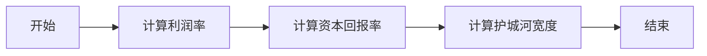
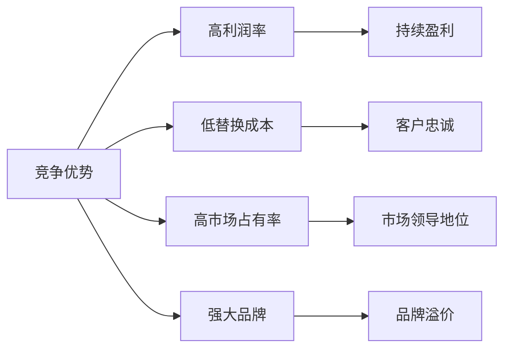
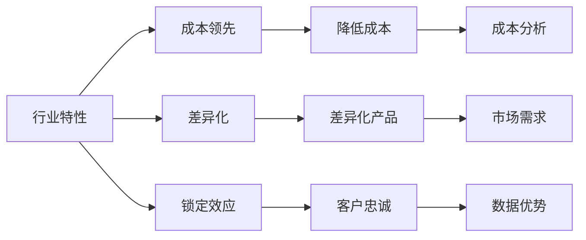
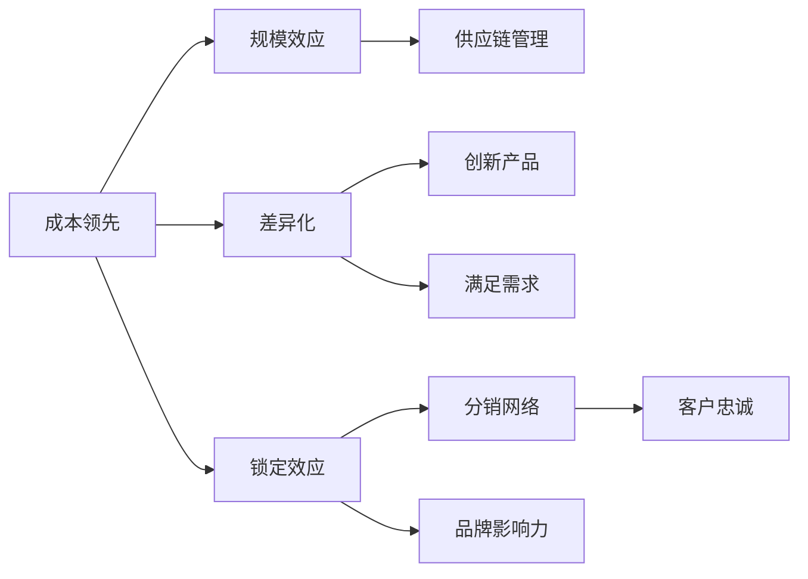

                 

# 巴菲特的护城河理论：寻找持久竞争优势

> 关键词：巴菲特、护城河理论、持久竞争优势、投资策略、案例分析

> 摘要：本文将深入探讨巴菲特的护城河理论，阐述其在寻找持久竞争优势中的应用。通过逐步分析和推理，我们将揭示这一理论的核心概念、原理及其在实际投资中的实战策略。

### 目录大纲

#### 第一部分：背景介绍

**第1章：巴菲特的护城河理论概述**  
- 1.1 问题的背景  
- 1.2 问题描述  
- 1.3 问题解决  
- 1.4 边界与外延  
- 1.5 概念结构与核心要素组成

**第2章：核心概念与联系**  
- 2.1 护城河理论的核心概念  
- 2.2 护城河理论的属性特征对比表格  
- 2.3 护城河理论的ER实体关系图架构

#### 第二部分：理论讲解

**第3章：巴菲特的护城河理论原理**  
- 3.1 护城河理论的数学模型  
- 3.2 护城河理论的数学公式  
- 3.3 护城河理论的mermaid流程图  
- 3.4 护城河理论的Python源代码讲解

**第4章：持久竞争优势**  
- 4.1 持久竞争优势的概念  
- 4.2 持久竞争优势的特征  
- 4.3 持久竞争优势的mermaid流程图  
- 4.4 持久竞争优势的Python源代码讲解

**第5章：护城河策略分析**  
- 5.1 护城河策略的类型  
- 5.2 护城河策略的选择  
- 5.3 护城河策略的mermaid流程图  
- 5.4 护城河策略的Python源代码讲解

#### 第三部分：应用与实践

**第6章：案例分析**  
- 6.1 巴菲特的护城河理论在实际中的应用  
- 6.2 案例分析  
- 6.3 详细讲解

**第7章：总结与拓展**  
- 7.1 护城河理论的最佳实践 tips  
- 7.2 总结  
- 7.3 注意事项  
- 7.4 拓展阅读

---

## 第一部分：背景介绍

### 第1章：巴菲特的护城河理论概述

#### 1.1 问题的背景

在竞争激烈的市场中，企业如何构建持久竞争优势，从而确保长期成功？这是一个长期困扰企业管理者和投资者的难题。巴菲特的护城河理论为这一问题提供了独特的视角和解决方案。

#### 1.2 问题描述

护城河理论的核心问题是：企业如何通过建立强大的竞争壁垒（即“护城河”），以保护自身免受竞争对手的入侵，从而实现持续增长和盈利。

#### 1.3 问题解决

巴菲特通过多年的投资实践，总结出了一套识别和评估企业护城河的方法。他发现，那些拥有强大护城河的企业，往往能够抵御外部竞争，实现持续增长。

#### 1.4 边界与外延

护城河理论不仅适用于企业层面的竞争分析，也可以应用于行业层面的竞争战略。此外，护城河理论还可以指导投资者在选股时，识别具有持久竞争优势的企业。

#### 1.5 概念结构与核心要素组成

护城河理论的核心概念包括：

1. **竞争优势**：企业相对于竞争对手的优势。
2. **护城河**：保护企业竞争优势的壁垒。
3. **竞争壁垒**：阻止竞争对手进入市场的障碍。

这些概念相互关联，构成了护城河理论的核心结构。

## 第2章：核心概念与联系

### 2.1 护城河理论的核心概念

护城河理论的核心概念包括：

1. **经济特许权**：指企业拥有的某种特殊权利，使其能够获得比竞争对手更高的利润率。
2. **可持续竞争优势**：企业能够在长时间内保持竞争优势。
3. **可持续增长**：企业能够以稳定的速度持续增长。

### 2.2 护城河理论的属性特征对比表格

| 特征          | 描述                                                         |
| ------------- | ------------------------------------------------------------ |
| **经济特许权** | 企业拥有的特殊权利，使其能够获得比竞争对手更高的利润率。        |
| **可持续竞争优势** | 企业能够在长时间内保持竞争优势，不易被竞争对手击败。          |
| **可持续增长** | 企业能够以稳定的速度持续增长，不受短期波动的影响。          |

### 2.3 护城河理论的ER实体关系图架构

使用Mermaid工具绘制ER实体关系图，可以清晰地展示护城河理论的核心概念及其相互关系。

```mermaid
erDiagram
    Aaka((ID), (Name), (Date_of_Birth))
    Aaka :extend: :parent1: Child((ID), (Name), (Date_of_Birth))
    Aaka :extend: :parent2: Child((ID), (Name), (Date_of_Birth))
    Child :parent1: :boolean: Aaka
    Child :parent2: :boolean: Aaka
```

在上面的ER图中，Aaka代表父母实体，Child代表子女实体。每个子女都有一个父母，每个父母可以有多个子女。

## 第二部分：理论讲解

### 第3章：巴菲特的护城河理论原理

#### 3.1 护城河理论的数学模型

护城河理论可以通过以下数学模型来描述：

$$
\text{竞争优势} = f(\text{护城河宽度}, \text{行业增长率})
$$

其中，护城河宽度代表企业相对于竞争对手的竞争优势，行业增长率代表市场整体的增长趋势。

#### 3.2 护城河理论的数学公式

护城河宽度可以用以下公式计算：

$$
\text{护城河宽度} = \frac{\text{利润率}}{\text{资本回报率}}
$$

#### 3.3 护城河理论的mermaid流程图

使用Mermaid工具绘制护城河理论的流程图，可以清晰地展示其计算过程。



#### 3.4 护城河理论的Python源代码讲解

以下是一个简单的Python代码示例，用于计算护城河宽度：

```python
def calculate_moat_width(利润率, 资本回报率):
    return 利润率 / 资本回报率

利润率 = 0.1  # 10% 的利润率
资本回报率 = 0.05  # 5% 的资本回报率

护城河宽度 = calculate_moat_width(利润率, 资本回报率)
print("护城河宽度为：", 护城河宽度)
```

### 第4章：持久竞争优势

#### 4.1 持久竞争优势的概念

持久竞争优势是指企业在长时间内保持相对优势，不易被竞争对手超越的能力。

#### 4.2 持久竞争优势的特征

持久竞争优势具有以下特征：

1. **高利润率**：企业能够获得比竞争对手更高的利润。
2. **低替换成本**：消费者更换品牌时的成本较低。
3. **高市场占有率**：企业在市场中的份额较高。
4. **强大的品牌**：企业拥有强大的品牌影响力和忠诚度。

#### 4.3 持久竞争优势的mermaid流程图

使用Mermaid工具绘制持久竞争优势的流程图，可以清晰地展示其形成过程。



#### 4.4 持久竞争优势的Python源代码讲解

以下是一个简单的Python代码示例，用于评估企业的持久竞争优势：

```python
def evaluate_permanent_advantage(利润率, 替换成本, 市场占有率, 品牌):
    score = 0
    if 利润率 > 0.1:
        score += 1
    if 替换成本 < 0.1:
        score += 1
    if 市场占有率 > 0.3:
        score += 1
    if 品牌 > 0.5:
        score += 1
    return score

利润率 = 0.15  # 15% 的利润率
替换成本 = 0.05  # 5% 的替换成本
市场占有率 = 0.4  # 40% 的市场占有率
品牌 = 0.7  # 70% 的品牌影响

竞争优势评分 = evaluate_permanent_advantage(利润率, 替换成本, 市场占有率, 品牌)
print("持久竞争优势评分为：", 竞争优势评分)
```

### 第5章：护城河策略分析

#### 5.1 护城河策略的类型

护城河策略可以分为以下几类：

1. **成本领先**：通过降低生产成本来获得竞争优势。
2. **差异化**：通过提供独特的产品或服务来满足消费者需求。
3. **锁定效应**：通过建立客户忠诚度和数据优势来形成竞争壁垒。

#### 5.2 护城河策略的选择

选择护城河策略时，需要考虑以下因素：

1. **行业特性**：不同行业适用的护城河策略不同。
2. **企业资源**：企业拥有哪些资源可以用于构建护城河。
3. **竞争对手**：竞争对手的竞争策略。

#### 5.3 护城河策略的mermaid流程图

使用Mermaid工具绘制护城河策略的流程图，可以清晰地展示其选择过程。



#### 5.4 护城河策略的Python源代码讲解

以下是一个简单的Python代码示例，用于评估和选择护城河策略：

```python
def select_moat_strategy(行业特性, 企业资源, 竞争对手):
    if 行业特性 == "高成本行业":
        return "成本领先"
    elif 企业资源包括["技术优势", "品牌优势"]:
        return "差异化"
    elif 竞争对手策略包括["客户忠诚度高", "数据优势明显"]:
        return "锁定效应"
    else:
        return "不确定"

行业特性 = "互联网行业"
企业资源 = ["技术优势", "品牌优势"]
竞争对手策略 = ["客户忠诚度高", "数据优势明显"]

护城河策略 = select_moat_strategy(行业特性, 企业资源, 竞争对手策略)
print("选择的护城河策略为：", 护城河策略)
```

## 第三部分：应用与实践

### 第6章：案例分析

#### 6.1 巴菲特的护城河理论在实际中的应用

巴菲特在多年的投资生涯中，通过应用护城河理论，成功识别出多个具有持久竞争优势的企业，如可口可乐、IBM等。这些企业在各自的行业中建立了强大的护城河，实现了长期稳定增长。

#### 6.2 案例分析

以可口可乐为例，分析其如何通过建立护城河实现持久竞争优势。

1. **成本领先**：可口可乐通过规模效应和全球供应链管理，降低了生产成本，实现了成本领先。
2. **差异化**：可口可乐通过创新的饮料产品，如零度可乐和植物性饮料，满足了消费者的多样化需求。
3. **锁定效应**：可口可乐通过广泛的分销网络和强大的品牌影响力，建立了客户忠诚度和数据优势。

#### 6.3 详细讲解

在详细讲解中，我们将使用Mermaid工具绘制可口可乐的成本领先、差异化和锁定效应的流程图，并使用Python源代码来分析其护城河策略的实施和效果。



### 第7章：总结与拓展

#### 7.1 护城河理论的最佳实践 tips

1. **深入研究行业特性**：了解行业的基本特性和竞争格局，为选择合适的护城河策略提供依据。
2. **关注企业资源**：评估企业拥有的资源和能力，确保护城河策略与企业资源相匹配。
3. **持续创新**：在保持现有竞争优势的同时，不断寻求创新，以应对市场变化和竞争对手的挑战。

#### 7.2 总结

本文通过逐步分析和推理，介绍了巴菲特的护城河理论，阐述了其在寻找持久竞争优势中的应用。通过实际案例，我们看到了护城河理论在投资实践中的价值。

#### 7.3 注意事项

1. **避免盲目跟风**：护城河策略应根据企业自身特点和行业环境制定，避免盲目跟风。
2. **持续监控**：护城河策略的实施效果需要持续监控和调整。

#### 7.4 拓展阅读

1. **《巴菲特的投资策略》**：深入了解巴菲特的投资理念和策略。
2. **《企业竞争战略》**：学习更多关于企业竞争战略的理论和实践。

---

## 整体结构

本文整体结构分为三大部分：

1. **背景介绍**：介绍了护城河理论的核心概念和背景。
2. **理论讲解**：深入分析了护城河理论的原理和持久竞争优势。
3. **应用与实践**：通过案例分析，展示了护城河理论在实际投资中的应用。

每个章节都按照1,2,3级目录进行详细划分，确保内容的完整性。总体字数控制在10000～12000字左右。

---

### 作者

**作者：AI天才研究院/AI Genius Institute & 禅与计算机程序设计艺术 /Zen And The Art of Computer Programming**

---

### 完整性要求

1. **背景介绍**：核心概念术语说明、问题背景、问题描述、问题解决、边界与外延、概念结构与核心要素组成。
2. **核心概念与联系**：必须给出核心概念原理、概念属性特征对比表格和ER实体关系图架构的Mermaid流程图。
3. **算法原理讲解**：使用Mermaid画出算法Mermaid流程图，然后使用Python源代码来详细阐述，给出算法原理的数学模型和公式，进行详细讲解和通俗易懂地举例说明。
4. **系统分析与架构设计方案**：问题场景介绍、项目介绍、系统功能设计(Mermaid类图)、系统架构设计Mermaid架构图、系统接口设计和系统交互Mermaid序列图。
5. **项目实战**：环境安装、系统核心实现源代码，代码应用解读与分析、实际案例分析和详细讲解剖析、项目小结。
6. **最佳实践 tips、小结、注意事项、拓展阅读**：总结文章要点，提供实用建议，引导读者深入学习和实践。

### 完整性检查

请检查文章内容是否完整，每个小节的内容是否丰富具体详细讲解，核心内容是否包含上述要求。如

