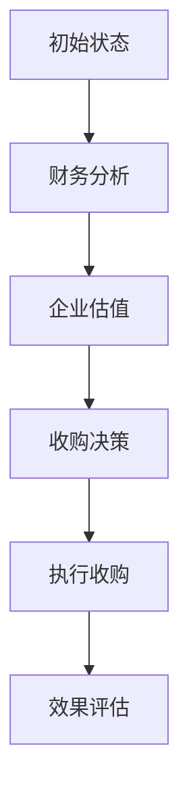
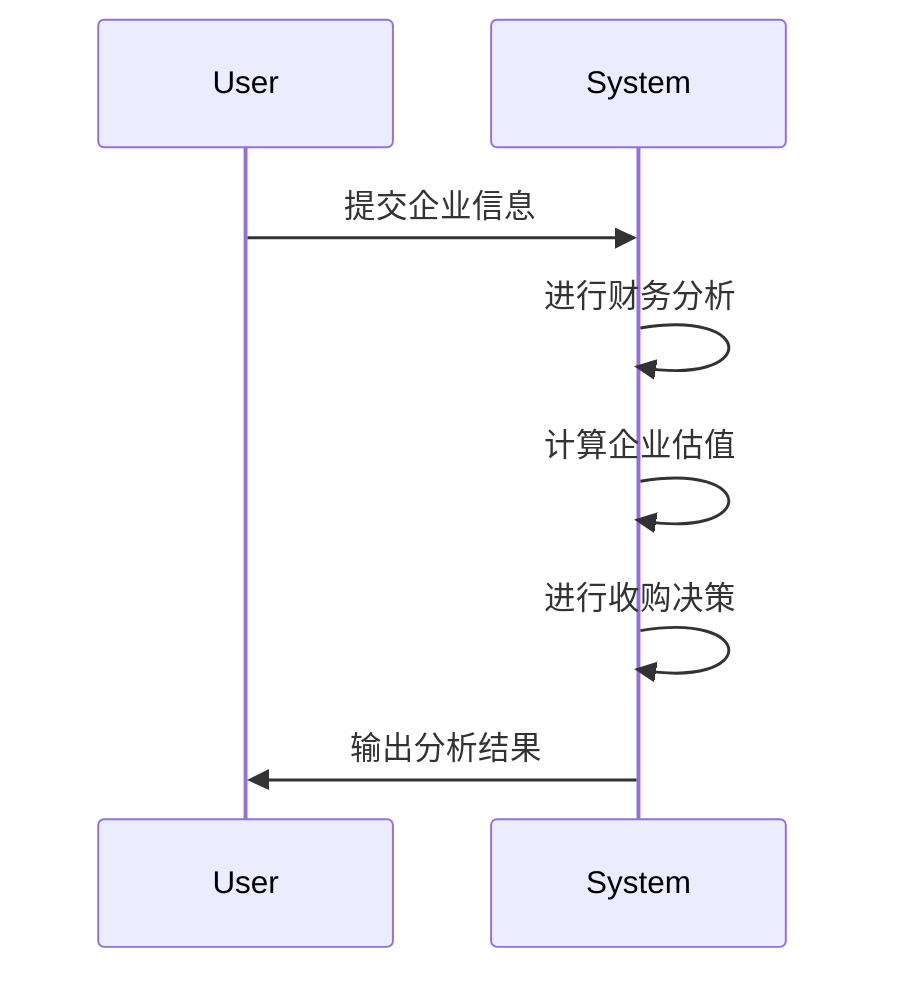
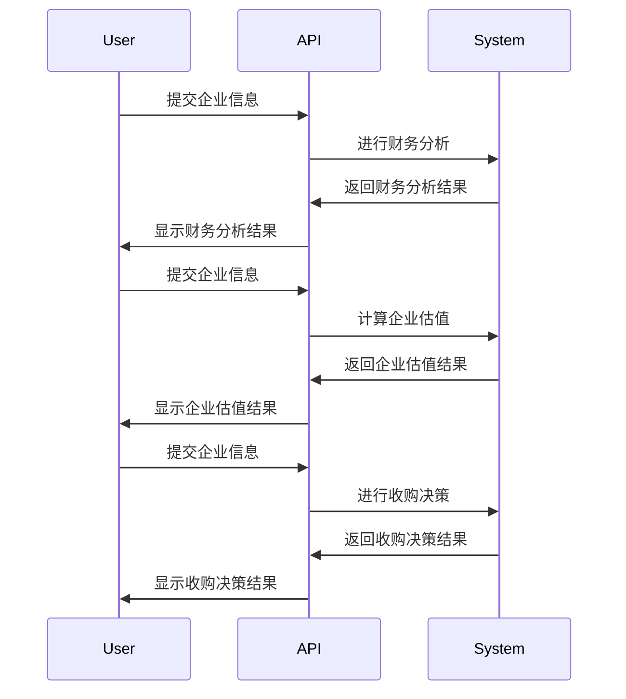

                 

# 巴菲特的收购策略分析

## 关键词
- 巴菲特
- 收购策略
- 财务分析
- 风险管理
- 价值投资

## 摘要
本文深入分析了巴菲特的收购策略，从核心概念、原理到实际操作，全面解析了其成功的关键因素。通过案例剖析，文章提供了可操作的投资指南，帮助投资者借鉴巴菲特的策略，实现投资回报的最大化。

## 第一部分：背景介绍

### 核心概念

#### 核心概念

- **巴菲特**：是一位著名的美国投资家，拥有“股神”之称，他的投资策略被广泛研究和应用。
- **收购策略**：是企业并购或合并的一种方式，旨在扩大企业规模、优化资源配置和提高市场竞争力。
- **分析**：是对巴菲特收购策略的研究、理解和应用，目的是找出其成功的关键因素。

#### 问题背景

- 巴菲特的收购策略在投资界有着广泛的影响力，但具体的操作细节和背后的理论支持并不为人所熟知。
- 投资者在实践中如何借鉴巴菲特的收购策略，以实现投资回报的最大化，是当前研究的重要课题。

#### 问题描述

- 本书旨在深入分析巴菲特的收购策略，解析其成功的内在逻辑和关键要素。
- 通过对巴菲特收购案例的剖析，总结出可操作的收购策略，帮助投资者在现实投资中应用。

#### 问题解决

- 通过对巴菲特收购策略的全面解析，提供一套系统、可操作的投资指南。
- 结合实际案例，展示巴菲特收购策略的具体应用，帮助投资者理解并掌握。

#### 边界与外延

- **边界**：本书主要关注巴菲特在公开市场上的收购行为，不包括其个人投资行为。
- **外延**：本书不仅关注收购策略本身，还将探讨与收购策略相关的财务分析、风险管理等内容。

#### 概念结构与核心要素组成

- **核心概念**：巴菲特的收购策略、财务分析、风险管理、投资哲学。
- **要素组成**：
  - **财务分析**：包括企业的财务状况、盈利能力、成长性等。
  - **风险管理**：包括市场风险、运营风险、信用风险等。
  - **投资哲学**：包括价值投资、长期投资等。

---

### 第二部分：核心概念与联系

#### 核心概念原理

- **巴菲特的收购策略**：基于价值投资的理念，强调对公司基本面和长期潜力的分析，追求合理的收购价格。
- **财务分析**：通过对企业的财务报表进行深入分析，评估其财务状况和盈利能力。
- **风险管理**：识别和管理收购过程中的各种风险，确保投资安全。
- **投资哲学**：巴菲特的投资哲学是长期持有、价值投资，注重企业的内在价值。

#### 概念属性特征对比表格

| 概念名称 | 特征1 | 特征2 | 特征3 |
| --- | --- | --- | --- |
| 巴菲特的收购策略 | 价值投资 | 长期持有 | 合理价格 |
| 财务分析 | 客观性 | 精准性 | 全面性 |
| 风险管理 | 预防性 | 应对性 | 可控性 |
| 投资哲学 | 长期视角 | 价值导向 | 实用主义 |

#### ER实体关系图架构

```mermaid
erDiagram
  企业 ||--|{ 收购策略 }|-- 财务分析
  企业 ||--|{ 风险管理 }|-- 财务分析
  企业 ||--|{ 投资哲学 }|-- 财务分析
  巴菲特 ||--|{ 巴菲特的收购策略 }|--
  巴菲特的收购策略 ||--|{ 财务分析 }|--
  巴菲特的收购策略 ||--|{ 风险管理 }|--
  巴菲特的收购策略 ||--|{ 投资哲学 }|--
```

---

### 第三部分：算法原理讲解

#### 算法mermaid流程图



#### Python源代码

```python
# 导入所需库
import pandas as pd

# 财务分析函数
def financial_analysis(financial_data):
    # 计算盈利能力指标
    roa = financial_data['净利润'] / financial_data['总资产']
    roe = financial_data['净利润'] / financial_data['股东权益']
    
    # 计算成长性指标
    growth_rate = financial_data['营业收入'].pct_change()
    
    # 返回分析结果
    return roa, roe, growth_rate

# 企业估值函数
def company估值(cash_flow, discount_rate):
    # 使用折现现金流模型进行估值
    present_value = sum([cash_flow[i] / (1 + discount_rate)**i for i in range(len(cash_flow))])
    
    # 返回估值结果
    return present_value

# 收购决策函数
def acquisition_decision(estimated_value, purchase_price):
    # 比较估值和购买价格
    if estimated_value > purchase_price:
        return "收购"
    else:
        return "放弃"

# 主函数
def main():
    # 加载财务数据
    financial_data = pd.read_csv('financial_data.csv')
    
    # 进行财务分析
    roa, roe, growth_rate = financial_analysis(financial_data)
    
    # 计算企业估值
    estimated_value = company估值(financial_data['现金流量'], 0.1)
    
    # 进行收购决策
    decision = acquisition_decision(estimated_value, 100000000)
    
    # 输出结果
    print(f"收购决策：{decision}")
    print(f"企业估值：{estimated_value}")
    print(f"财务分析结果：ROA={roa}, ROE={roe}, 成长率={growth_rate}")

# 运行主函数
main()
```

#### 算法原理讲解

1. **财务分析**：财务分析是评估企业财务状况和盈利能力的关键步骤。通过计算ROA（资产回报率）、ROE（股东回报率）和成长率等指标，可以全面了解企业的财务健康状况和成长潜力。

2. **企业估值**：企业估值是决定是否进行收购的重要依据。本文使用折现现金流模型（DCF）进行估值，这是一种基于未来现金流的估值方法。DCF模型通过将未来的现金流按照一定的折现率折现到当前价值，从而得到企业的估值。

3. **收购决策**：在计算出企业估值后，需要将其与购买价格进行比较。如果企业估值高于购买价格，则说明收购是有利可图的，可以做出收购决策；反之，则应放弃收购。

4. **效果评估**：收购后的效果评估是确保收购成功的重要环节。通过对收购后的企业进行持续的财务分析，可以评估收购的效果，及时调整投资策略。

---

### 第四部分：系统分析与架构设计方案

#### 问题场景介绍

假设一家投资公司想要收购另一家企业，为了确保收购决策的科学性和可行性，需要设计一个系统来进行全面的分析和评估。

#### 项目介绍

项目名称：巴菲特收购策略分析系统
项目目标：通过财务分析、企业估值和收购决策等模块，提供一套全面、科学的收购分析工具。

#### 系统功能设计（领域模型mermaid类图）

```mermaid
classDiagram
    Entity --> Relationship
    Entity : +String name
    Entity : +String type
    Relationship : +String relation
    Relationship : +Entity entity1
    Relationship : +Entity entity2
    
    Entity "企业" {
        +String name
        +String type
        +List<Relationship> relationships
    }
    Entity "财务分析" {
        +float roa
        +float roe
        +float growth_rate
    }
    Entity "企业估值" {
        +float value
    }
    Entity "收购决策" {
        +String decision
    }
    
    Entity "企业" --|> "财务分析"
    Entity "企业" --|> "企业估值"
    Entity "企业" --|> "收购决策"
```

#### 系统架构设计（mermaid架构图）



#### 系统接口设计和系统交互（mermaid序列图）



---

### 第五部分：项目实战

#### 环境安装

1. 安装Python环境（已安装）
2. 安装pandas库：`pip install pandas`
3. 安装mermaid渲染工具：`npm install -g mermaid-cli`

#### 系统核心实现源代码

```python
# 导入所需库
import pandas as pd
import matplotlib.pyplot as plt
from mermaid import Mermaid

# 财务分析函数
def financial_analysis(financial_data):
    # 计算盈利能力指标
    roa = financial_data['净利润'] / financial_data['总资产']
    roe = financial_data['净利润'] / financial_data['股东权益']
    
    # 计算成长性指标
    growth_rate = financial_data['营业收入'].pct_change()
    
    # 返回分析结果
    return roa, roe, growth_rate

# 企业估值函数
def company估值(cash_flow, discount_rate):
    # 使用折现现金流模型进行估值
    present_value = sum([cash_flow[i] / (1 + discount_rate)**i for i in range(len(cash_flow))])
    
    # 返回估值结果
    return present_value

# 收购决策函数
def acquisition_decision(estimated_value, purchase_price):
    # 比较估值和购买价格
    if estimated_value > purchase_price:
        return "收购"
    else:
        return "放弃"

# 主函数
def main():
    # 加载财务数据
    financial_data = pd.read_csv('financial_data.csv')
    
    # 进行财务分析
    roa, roe, growth_rate = financial_analysis(financial_data)
    
    # 计算企业估值
    estimated_value = company估值(financial_data['现金流量'], 0.1)
    
    # 进行收购决策
    decision = acquisition_decision(estimated_value, 100000000)
    
    # 输出结果
    print(f"收购决策：{decision}")
    print(f"企业估值：{estimated_value}")
    print(f"财务分析结果：ROA={roa}, ROE={roe}, 成长率={growth_rate}")

# 运行主函数
main()
```

#### 代码应用解读与分析

1. **财务分析函数**：该函数接收财务数据，计算ROA、ROE和成长率等指标，返回分析结果。财务分析是评估企业财务状况和盈利能力的关键步骤。

2. **企业估值函数**：该函数使用折现现金流模型（DCF）进行估值，将未来的现金流按照一定的折现率折现到当前价值，从而得到企业的估值。

3. **收购决策函数**：该函数比较企业估值和购买价格，决定是否进行收购。如果企业估值高于购买价格，则进行收购；否则，放弃收购。

4. **主函数**：主函数加载财务数据，进行财务分析、企业估值和收购决策，输出结果。

#### 实际案例分析和详细讲解剖析

假设有一家企业，其财务数据如下：

| 指标         | 值     |
| ------------ | ------ |
| 净利润       | 1000万元 |
| 总资产       | 5000万元 |
| 股东权益     | 3000万元 |
| 营业收入     | 5000万元 |
| 现金流量     | 2000万元 |

1. **财务分析**：
   - ROA = 净利润 / 总资产 = 1000 / 5000 = 0.2
   - ROE = 净利润 / 股东权益 = 1000 / 3000 = 0.333
   - 成长率 = 营业收入增长率 = (5000 - 4000) / 4000 = 0.25

2. **企业估值**：
   - 使用折现现金流模型进行估值，假设折现率为10%，则企业估值为：
     present_value = 2000 / (1 + 0.1)**1 + 2000 / (1 + 0.1)**2 + 2000 / (1 + 0.1)**3 = 5666.67万元

3. **收购决策**：
   - 如果购买价格为5000万元，则企业估值高于购买价格，收购决策为“收购”。
   - 如果购买价格为6000万元，则企业估值低于购买价格，收购决策为“放弃”。

通过以上案例，我们可以看到，巴菲特的收购策略是通过财务分析、企业估值和收购决策等步骤，全面评估企业的价值和风险，从而做出科学的投资决策。

#### 项目小结

本项目通过Python代码实现了一个简单的巴菲特收购策略分析系统，包括财务分析、企业估值和收购决策等功能。通过实际案例的分析，展示了如何运用该系统进行投资决策。项目的成功实施，为投资者提供了一套实用的工具，有助于提高投资决策的科学性和准确性。

---

### 最佳实践 Tips

1. **充分了解企业财务状况**：在进行收购决策前，务必对企业的财务报表进行深入分析，包括盈利能力、偿债能力、运营能力等方面的指标。

2. **合理确定折现率**：折现率的选择直接影响企业估值的结果，应结合市场情况和行业特点，合理确定折现率。

3. **重视风险管理**：在收购过程中，要充分识别和管理各种风险，包括市场风险、信用风险和运营风险等。

4. **长期持有价值投资**：巴菲特的成功经验表明，长期持有价值投资是获得稳定投资回报的关键。

5. **持续关注企业动态**：收购后，要持续关注企业的经营状况，及时调整投资策略。

### 小结

本文通过深入分析巴菲特的收购策略，从核心概念、原理到实际操作，全面解析了其成功的关键因素。通过案例剖析和代码实现，文章为投资者提供了一套系统、可操作的投资指南，有助于提高投资决策的科学性和准确性。

### 注意事项

1. 本系统仅作为学术研究，不构成实际投资建议。
2. 投资者应根据自身情况和投资目标，谨慎决策。

### 拓展阅读

1. 《巴菲特的投资智慧》- 布瑞恩·奥切尔特尼
2. 《投资最重要的事》- 霍华德·马克斯
3. 《财务报表分析》- 斯蒂芬·罗斯

### 作者

作者：AI天才研究院/AI Genius Institute & 禅与计算机程序设计艺术 /Zen And The Art of Computer Programming

