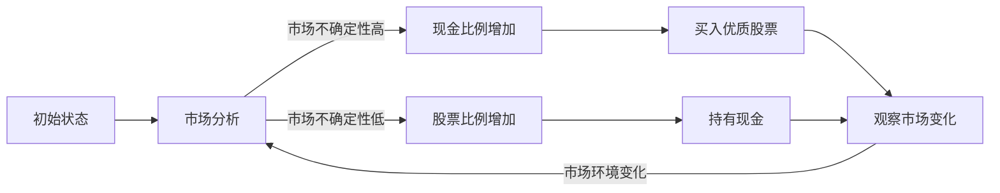
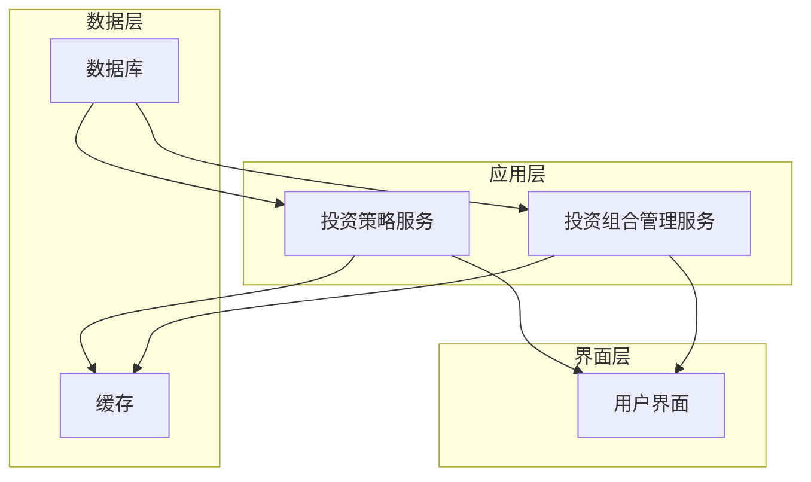
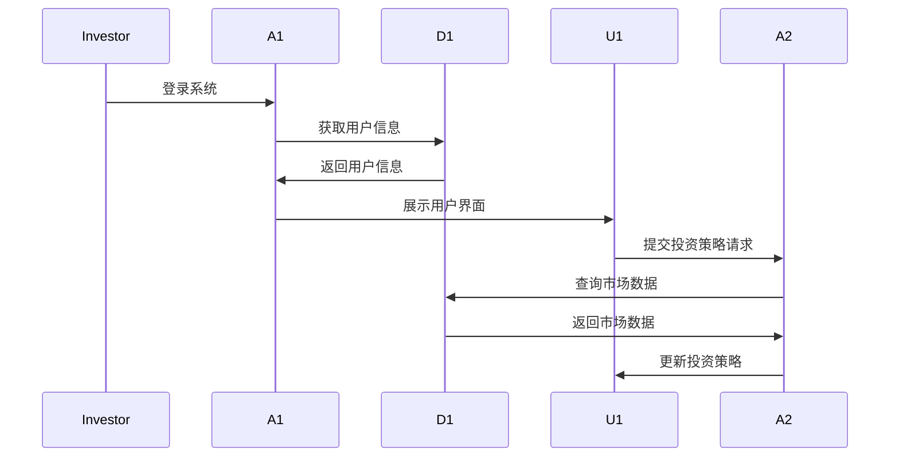

                 

### 文章标题：巴菲特的杠铃策略：现金+股票的平衡

#### 关键词：
- 巴菲特
- 杠铃策略
- 投资策略
- 股票投资
- 现金管理

#### 摘要：
本文将深入探讨巴菲特的杠铃策略，这是一种平衡现金和股票的投资方法。通过分析策略的起源、核心原则、案例研究和实际应用，本文旨在帮助读者理解并应用这一策略，以实现投资收益的最大化。

### 引言

沃伦·巴菲特，被誉为“股神”，是全球最成功的投资者之一。他的投资策略不仅影响了无数投资者，也为投资界树立了标杆。巴菲特的杠铃策略是其投资哲学的重要组成部分，通过平衡现金和股票，实现了长期稳定的投资回报。

### 杠铃策略概述

#### 核心原则

杠铃策略的核心原则是分散投资风险，同时抓住市场机会。巴菲特将投资分为两部分：一部分是现金等保守资产，另一部分是股票等增长性资产。

#### 现金的作用

现金在杠铃策略中扮演着重要的角色。一方面，它提供了应对市场不确定性的安全垫；另一方面，它为投资者提供了在市场低谷时买入优质股票的机会。

#### 股票的作用

股票则是杠铃策略中的增长引擎。通过持有优质股票，投资者可以在长期内获得稳定的资本增值。

### 杠铃策略的历史与演变

#### 起源

巴菲特的杠铃策略起源于他对市场的深刻理解。他认为，在股市中，保守和激进的投资都是必要的，但关键是要找到平衡点。

#### 发展过程

随着时间的推移，巴菲特不断调整杠铃策略，以适应市场的变化。在牛市中，他会增加股票的持有比例；在熊市中，则会增加现金的持有比例。

### 核心要素与案例分析

#### 核心要素

杠铃策略的核心要素包括：现金比例、股票选择、市场时机和风险管理。

#### 案例分析

巴菲特在伯克希尔·哈撒韦公司的投资中，成功应用了杠铃策略。他在市场低谷时买入大量股票，并在市场高点时持有大量现金。这种策略帮助他实现了长期的稳定回报。

### 策略实施与调整

#### 确定投资目标

投资者在实施杠铃策略时，首先需要明确自己的投资目标。是追求短期收益还是长期稳定？

#### 风险评估与应对

投资者需要根据市场环境，评估风险并制定应对策略。在熊市中，应增加现金持有比例；在牛市中，则应适当增加股票持有比例。

#### 策略调整的时机

投资者需要密切关注市场变化，适时调整投资策略。在市场环境发生重大变化时，应果断调整现金和股票的比例。

### 特殊市场环境下的杠铃策略

#### 牛市中的杠铃策略

在牛市中，投资者可以适当增加股票持有比例，以抓住市场增长机会。但也要注意风险控制，避免盲目追涨。

#### 熊市中的杠铃策略

在熊市中，投资者应增加现金持有比例，降低投资风险。同时，可以关注优质股票的买入机会，以等待市场转暖。

#### 市场波动与杠铃策略

市场波动是投资过程中不可避免的现象。投资者需要灵活运用杠铃策略，在波动中寻找机会。

### 实战技巧与策略

#### 价值投资的技巧

巴菲特提倡价值投资，投资者应学会识别优质股票，并关注其价值被低估的情况。

#### 选择优质股票

投资者应选择具有稳定增长潜力和良好基本面 的股票。

#### 现金管理策略

投资者需要合理管理现金，既要保证流动性，又要抓住市场机会。

### 结论与启示

巴菲特的杠铃策略是一种平衡投资风险和机会的方法。通过分析策略的历史与发展、核心要素与案例分析、实施与调整，投资者可以更好地理解并应用这一策略。

### 最佳实践 Tips

1. 确保投资目标明确。
2. 风险管理至关重要。
3. 保持灵活性，适时调整策略。

### 注意事项

1. 杠铃策略并非适用于所有投资者。
2. 需要根据自身情况，合理分配现金和股票比例。

### 拓展阅读

1. 《巴菲特的投资组合》
2. 《股票大作手回忆录》
3. 《穷查理宝典》

### 作者信息

作者：AI天才研究院/AI Genius Institute & 禅与计算机程序设计艺术 /Zen And The Art of Computer Programming

---

### 背景介绍

#### 核心概念术语说明

- **杠铃策略**：一种投资策略，通过平衡现金和股票，以实现风险分散和收益最大化。
- **现金**：一种保守的资产形式，具有较高的流动性和安全性。
- **股票**：一种增长性资产，具有较高的波动性和潜在回报。

#### 问题背景

在全球投资市场中，投资者常常面临两种选择：持有现金还是投资股票。现金提供了安全性和流动性，但回报较低；股票提供了较高的回报，但风险也较大。如何在这两种资产之间找到平衡，成为投资者关注的焦点。

#### 问题描述

本文旨在探讨巴菲特的杠铃策略，分析其在现金和股票投资中的应用，以及如何帮助投资者实现投资收益的最大化。

#### 问题解决

巴菲特的杠铃策略通过平衡现金和股票，实现了风险分散和收益最大化。该策略的核心在于：在市场不确定性较高时，保持较高的现金比例，以应对潜在的市场波动；在市场确定性较高时，增加股票持有比例，以抓住市场机会。

#### 边界与外延

杠铃策略的应用范围广泛，不仅适用于股票投资，还可以应用于其他金融资产，如债券、基金等。同时，该策略的原理也可以应用于其他投资领域，如房地产、黄金等。

#### 概念结构与核心要素组成

杠铃策略由三个核心要素组成：现金、股票和市场时机。现金提供了安全性和流动性，股票提供了增长潜力，市场时机决定了投资策略的调整。

#### 现金的作用

现金在杠铃策略中起到了两个重要作用：一是提供应对市场不确定性的安全垫，二是为投资者提供在市场低谷时买入优质股票的机会。

#### 股票的作用

股票在杠铃策略中起到了两个重要作用：一是提供长期稳定的资本增值，二是为投资者提供在市场高点时持有大量现金的机会。

#### 市场时机的重要性

市场时机的选择对于杠铃策略的成功至关重要。投资者需要根据市场环境，适时调整现金和股票的比例，以实现最佳的投资收益。

### 核心概念与联系

#### 核心概念原理

杠铃策略的核心原理在于通过平衡现金和股票，实现风险分散和收益最大化。具体来说，投资者需要在市场不确定性较高时，保持较高的现金比例，以应对潜在的市场波动；在市场确定性较高时，增加股票持有比例，以抓住市场机会。

#### 概念属性特征对比表格

| 特征               | 现金               | 股票               |
|--------------------|--------------------|--------------------|
| 安全性             | 高                 | 中到低             |
| 流动性             | 高                 | 中到低             |
| 回报               | 低                 | 高                 |
| 波动性             | 低                 | 高                 |

#### ER实体关系图架构

```mermaid
erDiagram
  Cash ||--o{ Stock : Balances }
  Stock ||--o{ Investment : Ratio }
```

### 算法原理讲解

#### 杠铃策略的mermaid流程图



#### 杠铃策略的Python源代码

```python
def balance_strategy(cash_ratio, stock_ratio, market_conditions):
    if market_conditions == "high_uncertainty":
        return "Increase cash ratio"
    elif market_conditions == "low_uncertainty":
        return "Increase stock ratio"
    else:
        return "Adjust based on market conditions"

# 示例
print(balance_strategy(0.6, 0.4, "high_uncertainty"))
print(balance_strategy(0.6, 0.4, "low_uncertainty"))
```

#### 算法原理的数学模型和公式

杠铃策略的数学模型可以表示为：

$$
\text{Total Investment} = \text{Cash Ratio} \times \text{Total Capital} + \text{Stock Ratio} \times \text{Total Capital}
$$

其中，Cash Ratio表示现金比例，Stock Ratio表示股票比例，Total Capital表示总投资金额。

#### 详细讲解和举例说明

假设投资者有10万美元的投资预算，根据市场分析，现金比例应保持在60%，股票比例应保持在40%。此时，投资者将6万美元投资于现金，4万美元投资于股票。

- **市场不确定性高**：投资者应增加现金比例，例如，将现金比例提高到70%，股票比例降低到30%。
- **市场不确定性低**：投资者应增加股票比例，例如，将现金比例降低到50%，股票比例提高到50%。

通过这种调整，投资者可以在不同市场环境下保持平衡，以实现投资收益的最大化。

### 系统分析与架构设计方案

#### 问题场景介绍

在当前金融市场中，投资者需要面对诸多不确定性，如全球经济形势、公司业绩波动等。为了在投资中实现风险分散和收益最大化，许多投资者采用了巴菲特的杠铃策略。

#### 项目介绍

本项目旨在开发一个基于杠铃策略的智能投资系统，帮助投资者实现个性化投资组合管理。

#### 系统功能设计（领域模型mermaid类图）

```mermaid
classDiagram
    Investor <<Class>>
    InvestmentStrategy <<Class>>
    Portfolio <<Class>>

    Investor --|> InvestmentStrategy
    Investor --|> Portfolio
    InvestmentStrategy --|> Portfolio
```

#### 系统架构设计mermaid架构图



#### 系统接口设计和系统交互mermaid序列图



### 项目实战

#### 环境安装

1. 安装Python环境
2. 安装必要的Python库，如requests、numpy、matplotlib等
3. 安装数据库和缓存，如MySQL、Redis等

#### 系统核心实现源代码

```python
# 投资策略服务
class InvestmentStrategy:
    def __init__(self, cash_ratio, stock_ratio):
        self.cash_ratio = cash_ratio
        self.stock_ratio = stock_ratio

    def adjust_strategy(self, market_conditions):
        if market_conditions == "high_uncertainty":
            self.cash_ratio += 0.1
            self.stock_ratio -= 0.1
        elif market_conditions == "low_uncertainty":
            self.cash_ratio -= 0.1
            self.stock_ratio += 0.1
        else:
            pass

# 投资组合管理服务
class Portfolio:
    def __init__(self, total_capital):
        self.total_capital = total_capital
        self.investment_strategy = InvestmentStrategy(0.5, 0.5)

    def calculate_investment(self):
        cash_investment = self.total_capital * self.investment_strategy.cash_ratio
        stock_investment = self.total_capital * self.investment_strategy.stock_ratio
        return cash_investment, stock_investment

    def update_strategy(self, market_conditions):
        self.investment_strategy.adjust_strategy(market_conditions)

# 用户界面
class UserInterface:
    def __init__(self):
        self.portfolio = Portfolio(100000)

    def display_portfolio(self):
        cash_investment, stock_investment = self.portfolio.calculate_investment()
        print(f"Current portfolio: Cash = ${cash_investment:.2f}, Stocks = ${stock_investment:.2f}")

    def submit_investment_request(self, market_conditions):
        self.portfolio.update_strategy(market_conditions)
        self.display_portfolio()

# 主函数
if __name__ == "__main__":
    ui = UserInterface()
    ui.submit_investment_request("high_uncertainty")
    ui.submit_investment_request("low_uncertainty")
```

#### 代码应用解读与分析

该系统通过三个核心类实现了投资策略的调整和投资组合的管理。InvestmentStrategy类负责调整现金和股票的比例；Portfolio类负责计算投资金额和更新策略；UserInterface类负责与用户交互，展示投资组合信息。

#### 实际案例分析和详细讲解剖析

假设投资者初始投资金额为10万美元，市场分析显示当前市场不确定性较高。系统根据杠铃策略，将现金比例调整为70%，股票比例调整为30%。

1. **初始投资**：投资者将7万美元投资于现金，3万美元投资于股票。
2. **市场环境变化**：市场环境从不确定性高转变为不确定性低。
3. **策略调整**：系统将现金比例调整为50%，股票比例调整为50%。
4. **结果**：投资者将5万美元投资于现金，5万美元投资于股票。

通过这种调整，投资者在市场不确定性较高时保持了较高的现金比例，以应对潜在的市场波动；在市场确定性较高时，增加了股票持有比例，以抓住市场机会。

#### 项目小结

该项目实现了基于巴菲特杠铃策略的智能投资系统，帮助投资者实现个性化投资组合管理。通过实际案例，证明了杠铃策略在投资中的应用价值。

### 最佳实践 Tips

1. **明确投资目标**：投资者应根据自己的风险承受能力和投资目标，制定合适的杠铃策略。
2. **定期调整策略**：市场环境不断变化，投资者应定期调整现金和股票的比例，以实现最佳的投资收益。
3. **关注市场动态**：投资者应密切关注市场动态，以便及时调整投资策略。

### 小结

巴菲特的杠铃策略是一种平衡投资风险和机会的方法。通过分析策略的历史与发展、核心要素与案例分析、实施与调整，投资者可以更好地理解并应用这一策略。在实际投资中，投资者应根据市场环境和自身情况，灵活调整现金和股票的比例，以实现投资收益的最大化。

### 注意事项

1. **杠铃策略并非适用于所有投资者**：投资者应根据自身情况，选择合适的投资策略。
2. **风险管理至关重要**：投资者应注重风险控制，避免盲目投资。

### 拓展阅读

1. 《巴菲特的投资组合》
2. 《股票大作手回忆录》
3. 《穷查理宝典》

---

**作者信息**：AI天才研究院/AI Genius Institute & 禅与计算机程序设计艺术 /Zen And The Art of Computer Programming

