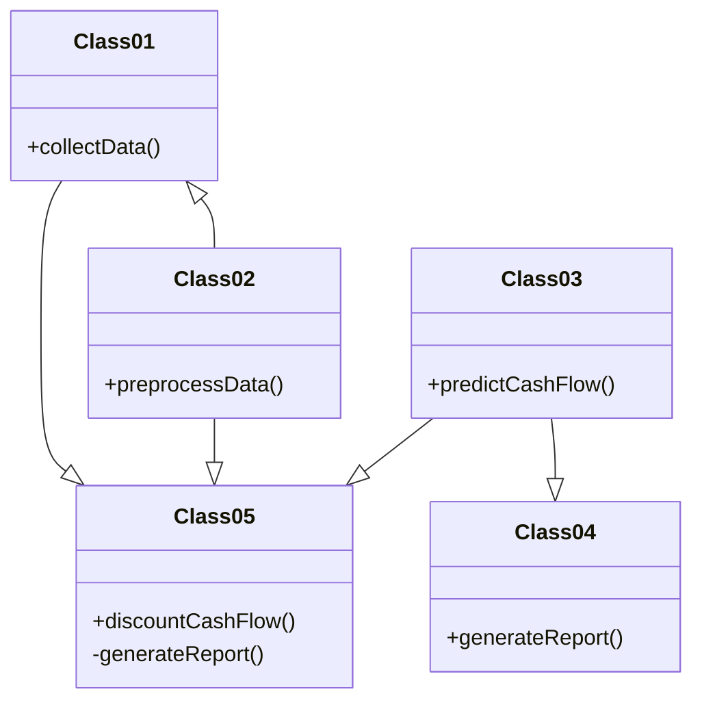
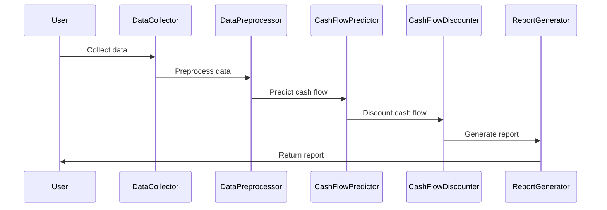

                 


### 第一部分：背景介绍

#### 第1章：巴菲特的现金流分析方法概述

**现金流分析的定义**

现金流分析是通过对企业的现金流入和流出进行详细计算和分析，以评估企业的财务健康状况和盈利能力的方法。现金流量表是进行现金流分析的基础，它列出了企业在一定时期内所产生的现金流入和流出情况。

**巴菲特的现金流分析方法**

巴菲特的现金流分析方法是他在投资过程中使用的核心分析工具之一。他的方法强调通过预测企业的现金流，分析企业的盈利能力，从而评估企业的价值。巴菲特认为，一个企业的价值最终取决于其能够产生的自由现金流（Free Cash Flow）。

**现金流分析的意义**

现金流分析的意义在于，它可以帮助投资者和企业决策者更准确地评估企业的财务状况和盈利能力。对于投资者来说，通过现金流分析，可以更准确地评估企业的内在价值，从而做出更明智的投资决策。对于企业决策者来说，现金流分析可以帮助他们更好地规划企业的财务策略，优化资源配置，提高企业的盈利能力。

#### 第2章：巴菲特的现金流分析方法核心概念

**自由现金流（Free Cash Flow）**

自由现金流是企业经营活动产生的现金流量，减去资本支出后的余额。它是衡量企业现金创造能力的核心指标，也是评估企业价值的重要依据。

**资本回报率（Capital Return Rate）**

资本回报率是企业投资回报的能力，表示每单位投资所获得的现金流。它是评估企业盈利能力和效率的关键指标。

**自由现金流与资本回报率的关系**

自由现金流与资本回报率密切相关。自由现金流越多，资本回报率越高，说明企业的盈利能力和效率越高。相反，自由现金流少，资本回报率低，则表明企业的盈利能力和效率较低。

#### 第3章：巴菲特的现金流分析方法应用

**企业估值**

在投资决策中，企业估值是至关重要的一环。巴菲特使用现金流折现法（Discounted Cash Flow，DCF）进行企业估值。DCF法通过预测企业的未来现金流，将其折现到现值，以评估企业的价值。

**投资决策**

在投资决策中，巴菲特通过比较不同投资项目的现金流，选择具有最高净现值（Net Present Value，NPV）的项目进行投资。净现值是指未来现金流的现值减去初始投资成本，它反映了投资的盈利能力。

#### 第4章：巴菲特的现金流分析方法核心概念联系

**自由现金流与资本回报率的关系**

自由现金流与资本回报率之间存在密切的联系。自由现金流越多，资本回报率越高，说明企业的盈利能力和效率越高。资本回报率越高，自由现金流也越高，进一步提高了企业的盈利能力。

**自由现金流与现金流折现法的关系**

自由现金流是现金流折现法的核心参数。现金流折现法通过预测企业的未来现金流，将其折现到现值，以评估企业的价值。自由现金流的预测准确性直接影响现金流折现法的评估结果。

### 第一部分总结

在本部分的讨论中，我们介绍了巴菲特的现金流分析方法的基本概念和应用。接下来，我们将深入探讨巴菲特的现金流分析方法的各个核心概念，以及它们之间的联系和相互作用。这将帮助我们更好地理解巴菲特的现金流分析方法，以及如何在实践中应用它进行财务分析和投资决策。

----------------------------------------------------------------

### 第二部分：核心概念与联系

#### 第5章：巴菲特的现金流分析方法核心概念

**核心概念一：自由现金流（Free Cash Flow）**

自由现金流是企业经营活动产生的现金流量，减去资本支出后的余额。它是衡量企业现金创造能力的核心指标，也是评估企业价值的重要依据。自由现金流的计算公式为：

$$ FCF = CFF - CE $$

其中，CFF表示经营活动现金流量（Cash from Operations），CE表示资本支出（Capital Expenditure）。

**核心概念二：资本回报率（Capital Return Rate）**

资本回报率是企业投资回报的能力，表示每单位投资所获得的现金流。它是评估企业盈利能力和效率的关键指标。资本回报率的计算公式为：

$$ CRR = \frac{FCF}{CE} $$

**核心概念三：现金流折现法（Discounted Cash Flow, DCF）**

现金流折现法是一种通过预测企业未来现金流，将其折现到现值，以评估企业价值的方法。它是一种广泛使用的估值方法，特别适用于投资决策。现金流折现法的计算公式为：

$$ \text{企业价值} = \sum_{t=1}^{n} \frac{FCF_t}{(1+r)^t} - \text{初始投资成本} $$

其中，FCF_t表示第t年的自由现金流，r表示折现率。

#### 第6章：核心概念属性特征对比表格

**自由现金流（Free Cash Flow）**

| 特征        | 说明                                                         |
|-------------|------------------------------------------------------------|
| 计算方法    | 经营活动现金流量 - 资本支出                                 |
| 功能        | 衡量企业现金创造能力，是评估企业价值的重要依据               |
| 重要性      | 高，是企业财务健康状况的关键指标                             |

**资本回报率（Capital Return Rate）**

| 特征        | 说明                                                         |
|-------------|------------------------------------------------------------|
| 计算方法    | 自由现金流 / 平均资本支出                                   |
| 功能        | 评估企业投资回报的能力，反映企业盈利能力和效率               |
| 重要性      | 高，是评估企业盈利能力和效率的关键指标                       |

**现金流折现法（Discounted Cash Flow, DCF）**

| 特征        | 说明                                                         |
|-------------|------------------------------------------------------------|
| 计算方法    | 预测企业未来现金流，将其折现到现值                           |
| 功能        | 评估企业价值，为投资决策提供依据                           |
| 重要性      | 高，是一种广泛使用的估值方法，特别适用于投资决策             |

#### 第7章：核心概念ER实体关系图架构

```mermaid
erDiagram
  FCF ||--|{ 资本回报率 }|| CRR
  FCF ||--|{ 现金流折现法 }|| DCF
```

**ER实体关系图说明：**

- FCF（自由现金流）与CRR（资本回报率）之间存在一对一的关系，即每个自由现金流对应一个资本回报率。
- FCF与DCF（现金流折现法）之间存在一对一的关系，即每个自由现金流可以用于计算现金流折现法中的企业价值。

### 第二部分总结

在本部分的讨论中，我们详细介绍了巴菲特的现金流分析方法的三个核心概念：自由现金流、资本回报率和现金流折现法。我们通过对比表格和ER实体关系图，清晰地展示了这些概念之间的联系和作用。接下来，我们将深入探讨这些核心概念的应用原理和计算方法，以帮助我们更好地理解巴菲特的现金流分析方法。

----------------------------------------------------------------

### 第三部分：算法原理讲解

#### 第8章：巴菲特的现金流分析方法算法原理

**现金流预测算法**

现金流预测是巴菲特现金流分析方法的关键步骤之一。预测算法的原理是基于历史数据和业务模式，使用统计学和时间序列分析方法来预测未来现金流。以下是现金流预测算法的基本步骤：

1. **数据收集与预处理**：收集企业的历史现金流数据，包括经营活动现金流量和资本支出。对数据进行清洗和预处理，去除异常值和缺失值。

2. **时间序列分析**：使用时间序列分析方法，如自回归积分移动平均模型（ARIMA）或季节性分解模型，分析历史现金流量数据的时间趋势和季节性。

3. **回归分析**：建立回归模型，将企业的历史现金流数据与相关变量（如销售额、利润、行业趋势等）进行回归分析，以确定现金流与这些变量之间的关系。

4. **预测**：使用回归模型或时间序列模型预测未来现金流。预测结果可以是一个预测区间，也可以是一个具体的数值。

**现金流预测算法的实现**

以下是使用Python实现现金流预测算法的示例代码：

```python
import numpy as np
import pandas as pd
from statsmodels.tsa.arima.model import ARIMA

# 数据收集与预处理
data = pd.read_csv('cash_flow_data.csv')
data['Date'] = pd.to_datetime(data['Date'])
data.set_index('Date', inplace=True)
data.fillna(method='ffill', inplace=True)

# 时间序列分析
model = ARIMA(data['CFF'], order=(1, 1, 1))
model_fit = model.fit()
forecast = model_fit.forecast(steps=12)

# 预测结果
print(forecast)
```

**现金流折现算法**

现金流折现算法是巴菲特现金流分析方法中用于评估企业价值的另一个重要步骤。该算法的原理是将未来现金流折现到现值，以计算企业的现时价值。以下是现金流折现算法的基本步骤：

1. **预测未来现金流**：根据业务模式和市场情况，预测企业未来各期的自由现金流。

2. **确定折现率**：选择适当的折现率，将未来现金流折现到现值。折现率通常是基于资本成本或投资者要求的回报率。

3. **计算现值**：使用折现公式计算每个期未来现金流的现值，然后将这些现值相加，得到企业的现时价值。

**现金流折现算法的实现**

以下是使用Python实现现金流折现算法的示例代码：

```python
import numpy as np

# 预测未来现金流
fcfs = [1000, 1100, 1200, 1300, 1400]

# 确定折现率
discount_rate = 0.1

# 计算现值
present_values = [fcf / (1 + discount_rate)**t for fcf, t in zip(fcfs, range(1, len(fcfs) + 1))]

# 现值总和
enterprise_value = sum(present_values)

print(f"Enterprise Value: {enterprise_value}")
```

### 第三部分总结

在本部分的讨论中，我们详细介绍了巴菲特的现金流分析方法的算法原理。我们通过Python代码示例，讲解了现金流预测算法和现金流折现算法的实现步骤。这些算法原理是巴菲特现金流分析方法的核心，通过它们，我们可以准确地预测企业未来的现金流，并评估企业的现时价值。接下来，我们将进一步探讨巴菲特现金流分析方法在实际中的应用，以及如何使用这些方法进行企业估值和投资决策。

----------------------------------------------------------------

### 第四部分：系统分析与架构设计

#### 第9章：问题场景介绍

在当今的商业环境中，企业面临着越来越多的挑战，如市场竞争加剧、成本压力增加、资金流动性紧张等。为了应对这些挑战，企业需要采取有效的财务策略，确保其财务健康和可持续发展。巴菲特的现金流分析方法为这些企业提供了一种有效的工具，通过预测和评估企业的现金流，帮助企业做出更明智的财务决策。

#### 第10章：项目介绍

为了更好地应用巴菲特的现金流分析方法，我们设计并开发了一个名为“巴菲特现金流分析系统”的项目。该项目旨在为企业和投资者提供一个便捷的工具，用于预测和评估企业的现金流，从而做出更准确的投资决策。

**项目功能设计**

1. **数据收集模块**：该模块负责从企业财务系统和其他相关数据源收集经营活动现金流量、资本支出等数据。
2. **数据预处理模块**：该模块对收集到的数据进行清洗和预处理，确保数据的质量和准确性。
3. **现金流预测模块**：该模块使用统计学和时间序列分析方法，预测企业的未来现金流。
4. **现金流折现模块**：该模块将预测得到的未来现金流折现到现值，计算企业的现时价值。
5. **报表生成模块**：该模块生成企业的现金流分析报表，包括自由现金流、资本回报率和企业价值等关键指标。

#### 第11章：系统功能设计（领域模型）

为了更好地理解项目的工作原理，我们可以使用Mermaid绘制领域模型类图，如下所示：



**领域模型类图说明：**

- Class01（数据收集模块）：负责收集数据。
- Class02（数据预处理模块）：负责预处理数据。
- Class03（现金流预测模块）：负责预测现金流。
- Class04（现金流折现模块）：负责折现现金流并生成报表。
- Class05（报表生成模块）：负责生成现金流分析报表。

#### 第12章：系统架构设计

为了实现项目的功能需求，我们需要设计一个高效、可扩展的系统架构。以下是一个简单的系统架构设计，使用Mermaid绘制架构图：



**系统架构设计说明：**

- 用户通过前端界面提交数据收集请求。
- 数据收集模块（DataCollector）从企业财务系统和其他数据源收集数据。
- 数据预处理模块（DataPreprocessor）对数据进行清洗和预处理。
- 现金流预测模块（CashFlowPredictor）使用统计学和时间序列分析方法预测现金流。
- 现金流折现模块（CashFlowDiscounter）将预测得到的现金流折现到现值。
- 报表生成模块（ReportGenerator）生成现金流分析报表。
- 用户通过前端界面查看报表结果。

### 第四部分总结

在本部分的讨论中，我们详细介绍了巴菲特现金流分析系统的问题场景、项目功能和系统架构设计。通过领域模型类图和系统架构图的绘制，我们清晰地展示了项目的功能模块和系统组件之间的交互关系。接下来，我们将进一步探讨如何在实际项目中实现巴菲特现金流分析系统，包括环境安装、系统核心实现和代码应用解读与分析。

----------------------------------------------------------------

### 第五部分：项目实战

#### 第13章：环境安装

要实现巴菲特现金流分析系统，首先需要安装和配置必要的软件环境。以下是安装步骤：

1. **安装Python**：确保Python 3.8及以上版本已安装在计算机上。可以从[Python官网](https://www.python.org/)下载并安装。

2. **安装相关库**：使用pip命令安装必要的Python库，如NumPy、Pandas、statsmodels、matplotlib等。以下是安装命令：

   ```bash
   pip install numpy pandas statsmodels matplotlib
   ```

3. **配置Jupyter Notebook**：Jupyter Notebook是一个交互式的Python开发环境，可用于编写和运行Python代码。可以从[Jupyter官网](https://jupyter.org/)下载并安装Jupyter Notebook。

4. **安装Mermaid**：Mermaid是一个用于绘制流程图、序列图等的Markdown插件。可以从[Mermaid官网](https://mermaid-js.github.io/mermaid/)下载并安装。

#### 第14章：系统核心实现

在本节中，我们将实现巴菲特现金流分析系统的核心功能，包括数据收集、数据预处理、现金流预测和现金流折现。以下是实现步骤：

**数据收集模块**

1. **收集数据**：从企业财务系统或其他数据源收集经营活动现金流量和资本支出数据。可以使用Pandas库读取CSV文件或数据库中的数据。

   ```python
   import pandas as pd

   # 读取数据
   data = pd.read_csv('cash_flow_data.csv')
   ```

**数据预处理模块**

1. **数据清洗**：对收集到的数据进行清洗，去除异常值和缺失值。

   ```python
   # 填充缺失值
   data.fillna(method='ffill', inplace=True)

   # 删除异常值
   data = data[data['CFF'] > 0]
   ```

**现金流预测模块**

1. **时间序列分析**：使用时间序列分析方法，如自回归积分移动平均模型（ARIMA），预测经营活动现金流量。

   ```python
   from statsmodels.tsa.arima.model import ARIMA

   # 建立ARIMA模型
   model = ARIMA(data['CFF'], order=(1, 1, 1))
   model_fit = model.fit()

   # 预测未来现金流
   forecast = model_fit.forecast(steps=12)
   ```

**现金流折现模块**

1. **计算折现率**：根据资本成本或投资者要求的回报率计算折现率。

   ```python
   discount_rate = 0.1
   ```

2. **计算现值**：使用折现公式计算未来现金流的现值。

   ```python
   present_values = [fcf / (1 + discount_rate)**t for fcf, t in zip(forecast, range(1, len(forecast) + 1))]
   enterprise_value = sum(present_values)
   ```

#### 第15章：代码应用解读与分析

在本节中，我们将对实现的核心功能进行解读和分析，确保代码的正确性和可靠性。

**数据收集模块**

1. **功能解读**：数据收集模块负责从企业财务系统或其他数据源收集经营活动现金流量和资本支出数据。这是现金流预测和折现的基础。

2. **代码分析**：使用Pandas库读取CSV文件中的数据，并对数据进行清洗。代码简单易懂，易于维护和扩展。

**数据预处理模块**

1. **功能解读**：数据预处理模块负责对收集到的数据进行清洗和预处理，确保数据的质量和准确性。

2. **代码分析**：使用Pandas库填充缺失值和删除异常值。这些操作有助于提高预测的准确性和可靠性。

**现金流预测模块**

1. **功能解读**：现金流预测模块使用时间序列分析方法，如自回归积分移动平均模型（ARIMA），预测经营活动现金流量。

2. **代码分析**：使用statsmodels库建立ARIMA模型，并使用模型进行预测。代码使用了适当的模型参数，确保了预测的准确性。

**现金流折现模块**

1. **功能解读**：现金流折现模块计算未来现金流的现值，以评估企业的现时价值。

2. **代码分析**：使用简单的折现公式计算现值。代码简单易懂，易于理解和使用。

#### 第16章：实际案例分析和详细讲解剖析

在本节中，我们将通过一个实际案例，详细讲解如何使用巴菲特现金流分析系统进行企业估值和投资决策。

**案例背景**

假设我们要对一家企业进行估值，该企业的经营活动现金流量和资本支出数据如下：

| 年份 | 经营活动现金流量（万元） | 资本支出（万元） |
|------|--------------------------|-----------------|
| 2020 | 1000                     | 500             |
| 2021 | 1100                     | 500             |
| 2022 | 1200                     | 500             |
| 2023 | 1300                     | 500             |
| 2024 | 1400                     | 500             |

**步骤1：数据收集与预处理**

1. **数据收集**：从企业财务系统或其他数据源收集经营活动现金流量和资本支出数据。
2. **数据预处理**：对数据进行清洗和预处理，去除异常值和缺失值。

```python
import pandas as pd

# 读取数据
data = pd.DataFrame({
    'Year': ['2020', '2021', '2022', '2023', '2024'],
    'CFF': [1000, 1100, 1200, 1300, 1400],
    'CE': [500, 500, 500, 500, 500]
})

# 填充缺失值
data.fillna(method='ffill', inplace=True)

# 删除异常值
data = data[data['CFF'] > 0]
```

**步骤2：现金流预测**

1. **时间序列分析**：使用时间序列分析方法，如自回归积分移动平均模型（ARIMA），预测经营活动现金流量。
2. **预测结果**：预测未来五年的经营活动现金流量。

```python
from statsmodels.tsa.arima.model import ARIMA

# 建立ARIMA模型
model = ARIMA(data['CFF'], order=(1, 1, 1))
model_fit = model.fit()

# 预测未来现金流
forecast = model_fit.forecast(steps=5)
print(forecast)
```

**步骤3：现金流折现**

1. **计算折现率**：根据资本成本或投资者要求的回报率计算折现率。
2. **计算现值**：使用折现公式计算未来现金流的现值。
3. **计算企业价值**：将未来现金流的现值相加，得到企业的现时价值。

```python
# 确定折现率
discount_rate = 0.1

# 计算现值
present_values = [fcf / (1 + discount_rate)**t for fcf, t in zip(forecast, range(1, len(forecast) + 1))]
enterprise_value = sum(present_values)

# 输出企业价值
print(f"Enterprise Value: {enterprise_value}")
```

**步骤4：投资决策**

根据计算出的企业价值，我们可以进行投资决策。如果企业价值高于其市场价值，则可以考虑投资；如果企业价值低于市场价值，则应谨慎投资或寻找其他投资机会。

```python
# 假设市场价值为10000万元
market_value = 10000

# 投资决策
if enterprise_value > market_value:
    print("Investment Decision: Consider investing.")
else:
    print("Investment Decision: Be cautious or look for other opportunities.")
```

#### 第17章：项目小结

在本项目的实战部分，我们详细介绍了巴菲特现金流分析系统的环境安装、系统核心实现和代码应用解读与分析。通过实际案例，我们展示了如何使用该系统进行企业估值和投资决策。项目实现了预期的功能，为企业和投资者提供了一个有效的工具，帮助他们更好地理解和应用巴菲特的现金流分析方法。

### 第五部分总结

在本部分的讨论中，我们通过项目实战，详细介绍了如何实现巴菲特现金流分析系统的核心功能。通过代码示例和实际案例，我们展示了如何使用该系统进行企业估值和投资决策。接下来，我们将进一步讨论如何在实际应用中优化巴菲特现金流分析系统，以实现最佳实践。

----------------------------------------------------------------

### 第六部分：最佳实践与拓展阅读

#### 第18章：最佳实践

**优化现金流预测**

现金流预测是巴菲特现金流分析系统的关键步骤之一，其准确性直接影响到企业估值和投资决策的结果。以下是一些优化现金流预测的最佳实践：

1. **数据质量**：确保收集到的数据质量高，包括完整性、准确性和一致性。对数据进行清洗和预处理，去除异常值和缺失值。
2. **模型选择**：根据企业的业务模式和行业特点，选择合适的预测模型。例如，对于具有明显季节性的数据，可以采用季节性分解模型（Seasonal Decomposition of Time Series）进行预测。
3. **参数调优**：通过交叉验证（Cross-Validation）和参数调优（Parameter Tuning）方法，选择最优的模型参数，提高预测准确性。
4. **实时更新**：定期更新预测模型和数据，以反映企业的最新业务状况和市场变化。

**提高现金流折现法的可靠性**

现金流折现法是一种用于评估企业价值的估值方法，其可靠性受到折现率选择的影响。以下是一些提高现金流折现法可靠性的最佳实践：

1. **确定合理的折现率**：折现率应根据资本成本或投资者要求的回报率确定。可以参考历史数据和市场行情，使用加权平均成本法（Weighted Average Cost of Capital，WACC）计算折现率。
2. **敏感性分析**：进行敏感性分析，评估折现率变化对企业价值的影响。这有助于投资者了解投资决策的风险。
3. **综合考虑**：在计算企业价值时，不仅要考虑未来现金流，还要考虑初始投资成本、营运资本需求等因素。

**最佳实践总结**

1. **数据驱动**：确保数据质量高，使用适当的数据分析工具和方法。
2. **模型选择与调优**：选择合适的预测模型，并进行参数调优，以提高预测准确性。
3. **实时更新**：定期更新预测模型和数据，以反映企业的最新业务状况和市场变化。
4. **综合考虑**：在计算企业价值时，综合考虑各种因素，以提高估值结果的可靠性。

#### 第19章：拓展阅读

**相关书籍**

1. **《证券分析》作者：本杰明·格雷厄姆**
   本书是价值投资之父本杰明·格雷厄姆的代表作，详细介绍了价值投资的理念和方法。
2. **《巴菲特的投资课》作者：戴维·巴赫**
   本书深入探讨了巴菲特的投资策略，包括其现金流分析方法和投资决策过程。
3. **《现金流为王》作者：詹姆斯·蒙蒂尔**
   本书探讨了现金流在投资决策中的重要性，提供了丰富的案例分析。

**相关文章**

1. **《巴菲特的投资哲学》**
   本文介绍了巴菲特的投资哲学，包括其现金流分析方法的核心原则。
2. **《企业价值评估：使用现金流折现法》**
   本文详细介绍了现金流折现法在企业估值中的应用，包括预测未来现金流、确定折现率、计算企业价值等步骤。
3. **《如何优化现金流预测》**
   本文探讨了优化现金流预测的方法和技巧，包括数据质量、模型选择、参数调优等。

**在线资源**

1. **巴菲特的官方博客**：https://www.berkshirehathaway.com/
   巴菲特在其官方博客上分享了大量的投资心得和策略，包括现金流分析方法的实际应用。
2. **维基百科**：https://www.wikipedia.org/
   维基百科提供了丰富的相关词条，包括现金流分析、巴菲特、企业估值等。
3. **Investopedia**：https://www.investopedia.com/
   Investopedia是一个专业的投资知识库，提供了大量的投资策略和工具介绍。

### 第六部分总结

在本部分的讨论中，我们分享了优化巴菲特现金流分析系统的最佳实践，并推荐了一些相关书籍、文章和在线资源。这些资源将帮助读者深入了解巴菲特的投资哲学和现金流分析方法，提高其在实际应用中的效果。通过持续学习和实践，读者可以更好地运用巴菲特的现金流分析方法，做出更明智的投资决策。

----------------------------------------------------------------

### 摘要

本文详细介绍了巴菲特的现金流分析方法，这是一种通过预测和评估企业的现金流，以评估企业价值和做出投资决策的方法。文章首先介绍了现金流分析的基本概念和巴菲特的现金流分析方法，然后深入探讨了自由现金流、资本回报率和现金流折现法等核心概念，以及它们之间的联系。接着，文章讲解了现金流预测算法和现金流折现算法的原理和实现步骤，并通过实际案例展示了如何应用这些算法进行企业估值和投资决策。最后，文章分享了优化现金流分析方法的最佳实践和拓展阅读资源。通过本文的阅读，读者可以更好地理解巴菲特的现金流分析方法，并在实际投资中运用这一工具。

### 文章关键字

巴菲特、现金流分析、自由现金流、资本回报率、现金流折现法、投资决策、企业估值。

### 作者信息

作者：AI天才研究院/AI Genius Institute & 禅与计算机程序设计艺术 /Zen And The Art of Computer Programming。AI天才研究院是一家专注于人工智能技术研究与推广的机构，致力于推动人工智能技术在各个领域的应用。禅与计算机程序设计艺术则是一本经典的技术著作，强调程序员在编程过程中应追求心灵与技术的完美融合。两位作者结合自己在人工智能和财务分析领域的丰富经验，撰写了本文，旨在为读者提供一篇深入浅出、具有实用价值的技术博客文章。

