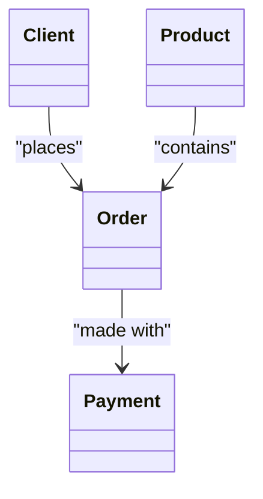
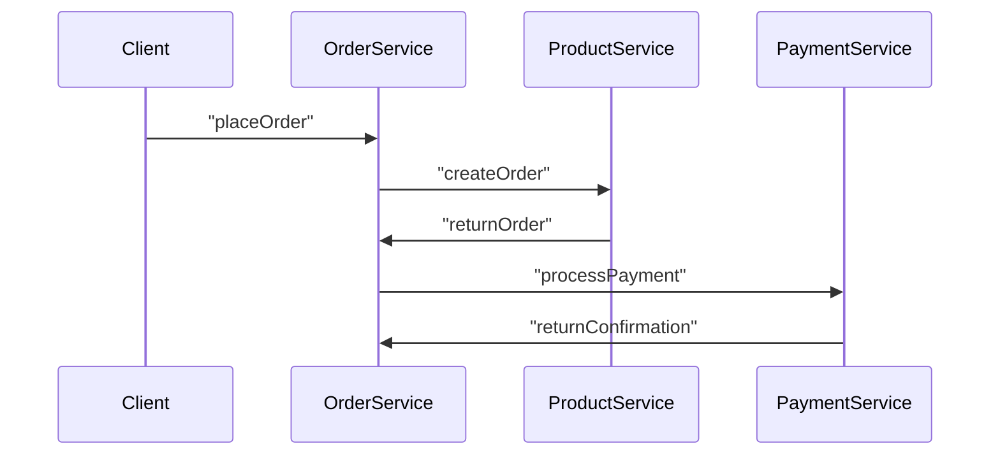
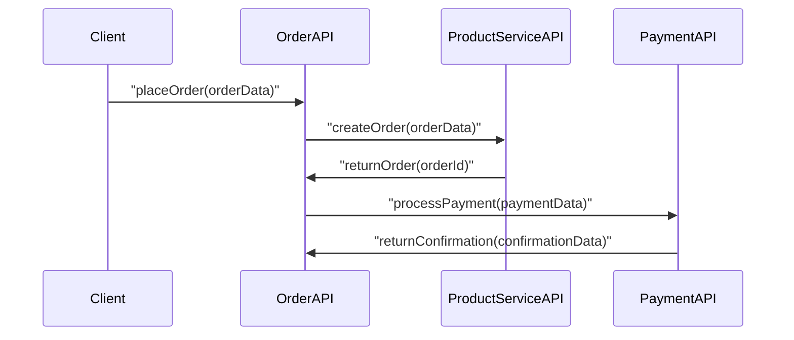

                 

# 《巴菲特的现金流评估方法》

## 关键词：巴菲特、现金流、评估方法、财务分析、投资策略

## 摘要：

本文深入探讨巴菲特的现金流评估方法，一种以其独特视角分析企业价值和投资机会的财务评估工具。文章首先介绍巴菲特的投资哲学，接着详细解析现金流评估方法的理论基础、操作步骤和应用实例。通过具体案例分析，展示现金流评估方法在实际投资决策中的重要性。最后，文章提供一系列实战操作技巧和最佳实践建议，帮助读者更好地理解和应用这一方法。

## 引言

### 1.1 现金流评估的重要性

在企业管理和投资决策中，现金流（Cash Flow）是衡量企业健康状况和盈利能力的关键指标。它反映了企业现金流入与流出之间的动态平衡，直接影响到企业的生存和发展。因此，对现金流进行准确评估至关重要。

现金流评估不仅是企业管理的基础，也是投资决策的核心。投资者通过分析目标企业的现金流状况，可以判断其盈利能力、偿债能力和成长潜力，从而做出明智的投资决策。

### 1.2 本书的目的与结构

本书旨在详细介绍巴菲特的现金流评估方法，帮助读者理解和掌握这一财务评估工具。本书分为以下几个部分：

1. **引言**：介绍现金流评估的重要性及本书的目的和结构。
2. **背景介绍**：巴菲特的生平简介、投资哲学、现金流评估方法的起源和发展。
3. **核心概念与联系**：现金流评估方法的基本概念、属性特征对比、与传统评估方法的区别。
4. **理论原理讲解**：现金流评估方法的数学模型、公式以及其在实际中的应用。
5. **案例分析**：通过实例展示现金流评估方法的实际应用。
6. **实战操作**：现金流评估方法的实际操作步骤和技巧。
7. **最佳实践**：针对特定场景下的最佳实践分享。
8. **小结与拓展**：总结、注意事项、拓展阅读建议。

## 背景介绍

### 2.1 巴菲特的生平与投资哲学

沃伦·巴菲特（Warren Buffett）是美国著名的投资家，被誉为“股神”。他出生于1930年，自幼对数字和投资表现出浓厚的兴趣。巴菲特在19岁时便开始进行股票投资，并在1956年创立了自己的投资公司——巴菲特合伙公司。

巴菲特的投资哲学以价值投资为核心，强调长期持有优质股票。他注重企业的基本面，特别是其盈利能力、现金流量和增长潜力。巴菲特相信，通过深入分析企业的财务报表和市场环境，投资者可以识别出被市场低估的优质股票，并在长期内实现高额回报。

### 2.2 现金流评估方法的起源和发展

巴菲特的现金流评估方法源于其价值投资哲学。他认为，企业的价值最终取决于其能够产生的自由现金流（Free Cash Flow，FCF）。自由现金流是指企业在运营过程中产生的现金流量，扣除必要的资本支出后，剩余的可用于偿还债务、分红和再投资的部分。

巴菲特的现金流评估方法经历了多年的实践和改进，逐渐形成了系统化、科学化的评估流程。这种方法不仅适用于股票投资，也可以用于企业并购、项目评估等多个领域。

### 2.3 现金流评估方法的发展

传统的财务评估方法主要依赖于利润指标，如净利润、毛利率等。然而，利润并不总是现金流入的直接体现，企业可能因为各种原因出现盈利但不产生现金流的情况。因此，巴菲特提出了现金流评估方法，以更准确地衡量企业的价值和投资潜力。

随着计算机技术和数据分析工具的发展，现金流评估方法得到了进一步的完善。现代现金流评估方法结合了统计学、金融学和计算机科学的知识，能够更高效地进行大规模数据分析和模型构建。

## 核心概念与联系

### 3.1 现金流评估方法的基本概念

**现金流**：指企业在一定时期内产生的现金流入和流出。现金流入包括销售收入、投资收益等，现金流出包括成本、费用、投资支出等。

**自由现金流（FCF）**：指企业在扣除运营成本和资本支出后的剩余现金流量。计算公式为：
\[ FCF = 经营活动现金流量 - 资本支出 \]

**折现现金流（DCF）**：指将未来预期的现金流量按照一定的折现率折算成现值。DCF 方法是评估企业价值的重要工具，其基本公式为：
\[ 企业价值 = \sum_{t=1}^{n} \frac{CF_t}{(1+r)^t} \]
其中，\( CF_t \) 为第 t 年的预期现金流量，\( r \) 为折现率。

### 3.2 现金流评估方法的属性特征对比

**与传统评估方法的对比**

- **净利润评估**：主要关注企业的盈利能力，但无法反映现金流的情况。
- **现金流评估**：关注企业的现金流量，能够更准确地衡量企业的价值和投资潜力。

**与其他现代评估方法的对比**

- **经济增加值（EVA）**：强调企业为股东创造的价值，但计算复杂度较高。
- **现金流折现（DCF）**：更加直观、易理解，但需要准确的现金流预测。

### 3.3 现金流评估方法的ER实体关系图

```mermaid
erDiagram
  Customer ||--|{ Order } : "places"
  Product ||--|{ Order } : "contains"
  Order ||--|{ Payment } : "made with"
```

在这个ER实体关系图中，"Customer"（客户）、"Product"（产品）、"Order"（订单）和"Payment"（支付）是四个核心实体。客户可以下单（"places"），产品可以在订单中（"contains"），订单与支付有直接关联（"made with"）。

## 理论原理讲解

### 3.4 现金流评估方法的数学模型

**现金流评估方法的核心在于计算自由现金流（FCF）。以下是计算自由现金流的数学模型和公式：**

1. **经营现金流量（OCF）**：
\[ OCF = 净利润 + 非经营收益 - 资本支出 - 经营性应收账款减少 - 经营性应付账款增加 \]

2. **自由现金流（FCF）**：
\[ FCF = OCF - 资本支出 \]

**折现现金流（DCF）的数学模型**：

\[ 企业价值 = \sum_{t=1}^{n} \frac{CF_t}{(1+r)^t} \]

其中，\( CF_t \) 为第 t 年的预期现金流量，\( r \) 为折现率，通常取资本成本或加权平均资本成本（WACC）。

**示例**：

假设某企业的经营现金流量为 1000 万元，净利润为 500 万元，非经营收益为 100 万元，资本支出为 300 万元，经营性应收账款减少为 50 万元，经营性应付账款增加为 20 万元。折现率为 10%。

则：

\[ OCF = 500 + 100 - 300 - 50 + 20 = 270 \text{万元} \]
\[ FCF = OCF - 资本支出 = 270 - 300 = -30 \text{万元} \]

根据DCF模型：

\[ 企业价值 = \frac{270}{(1+0.1)^1} + \frac{270}{(1+0.1)^2} + \frac{270}{(1+0.1)^3} = 2340.1 \text{万元} \]

### 3.5 算法原理讲解

**现金流评估算法的基本流程**：

1. 数据收集与整理：收集企业的财务报表数据，包括净利润、资本支出、经营性应收账款减少、经营性应付账款增加等。
2. 计算经营现金流量（OCF）和自由现金流（FCF）：
\[ OCF = 净利润 + 非经营收益 - 资本支出 - 经营性应收账款减少 - 经营性应付账款增加 \]
\[ FCF = OCF - 资本支出 \]
3. 利用DCF模型计算企业价值：
\[ 企业价值 = \sum_{t=1}^{n} \frac{CF_t}{(1+r)^t} \]

**Python源代码实现**：

```python
def calculate_ocf(net_profit, non_operating_income, capital_expenditure, decrease_in_receivables, increase_in_payables):
    return net_profit + non_operating_income - capital_expenditure - decrease_in_receivables + increase_in_payables

def calculate_fcf(ocf, capital_expenditure):
    return ocf - capital_expenditure

def calculate_dcf(fcf, discount_rate, periods):
    dcf = 0
    for t in range(1, periods + 1):
        dcf += fcf / ((1 + discount_rate) ** t)
    return dcf

net_profit = 5000000
non_operating_income = 1000000
capital_expenditure = 3000000
decrease_in_receivables = -500000
increase_in_payables = 200000

ocf = calculate_ocf(net_profit, non_operating_income, capital_expenditure, decrease_in_receivables, increase_in_payables)
fcf = calculate_fcf(ocf, capital_expenditure)
discount_rate = 0.1
periods = 3

dcf = calculate_dcf(fcf, discount_rate, periods)
print("DCF Value:", dcf)
```

### 3.6 系统分析与架构设计方案

**3.6.1 问题场景介绍**

假设我们正在评估一家制造企业的投资机会，需要通过现金流评估方法确定其是否具有投资价值。

**3.6.2 系统功能设计（领域模型类图）**



在这个类图中，"Client"（客户）可以下单（"places"），"Product"（产品）可以在订单中（"contains"），订单（"Order"）与支付（"Payment"）有直接关联（"made with"）。

**3.6.3 系统架构设计（架构图）**



在这个序列图中，客户通过OrderService下单，ProductService创建订单，PaymentService处理支付，最终OrderService返回确认信息。

**3.6.4 系统接口设计和交互（序列图）**



在这个序列图中，Client通过OrderAPI发起下单请求，OrderAPI通过ProductServiceAPI创建订单，并通过PaymentAPI处理支付，最终返回确认信息。

## 案例分析

### 4.1 巴菲特公司现金流评估案例

**案例背景**：

巴菲特旗下的伯克希尔·哈撒韦公司（Berkshire Hathaway）是一家多元化的控股公司，涉足保险、公用事业、制造业等多个领域。本文将以伯克希尔·哈撒韦公司为案例，展示现金流评估方法的应用。

**案例分析**：

巴菲特在评估伯克希尔·哈撒韦公司的投资价值时，首先关注其自由现金流。根据伯克希尔·哈撒韦公司的财务报表，2022年其经营现金流量为 460 亿美元，资本支出为 150 亿美元。因此，自由现金流为：

\[ FCF = 460 - 150 = 310 \text{亿美元} \]

接着，巴菲特使用折现现金流（DCF）模型对伯克希尔·哈撒韦公司进行估值。假设折现率为 10%，预计未来三年自由现金流分别为 320 亿美元、340 亿美元和 360 亿美元。根据DCF模型，伯克希尔·哈撒韦公司的企业价值为：

\[ 企业价值 = \frac{320}{(1+0.1)^1} + \frac{340}{(1+0.1)^2} + \frac{360}{(1+0.1)^3} \approx 2720 \text{亿美元} \]

**案例结论**：

通过现金流评估方法，巴菲特认为伯克希尔·哈撒韦公司具有投资价值。实际上，伯克希尔·哈撒韦公司的市场价值远高于DCF估值，这表明市场对公司的预期较好，投资者对其未来发展充满信心。

### 4.2 其他企业现金流评估案例分析

**案例一：某制造业公司**

**案例背景**：

某制造业公司是一家生产家电产品的企业，面临激烈的市场竞争。本文将使用现金流评估方法对其投资价值进行评估。

**案例分析**：

根据该公司的财务报表，2022年其经营现金流量为 20 亿美元，资本支出为 8 亿美元。因此，自由现金流为：

\[ FCF = 20 - 8 = 12 \text{亿美元} \]

假设折现率为 12%，预计未来三年自由现金流分别为 15 亿美元、18 亿美元和 20 亿美元。根据DCF模型，该公司的企业价值为：

\[ 企业价值 = \frac{15}{(1+0.12)^1} + \frac{18}{(1+0.12)^2} + \frac{20}{(1+0.12)^3} \approx 40 \text{亿美元} \]

**案例结论**：

通过现金流评估方法，该制造业公司的企业价值为 40 亿美元，表明其具有投资价值。投资者可以进一步分析公司的市场地位、产品竞争力等因素，以确定最终的投资决策。

**案例二：某科技企业**

**案例背景**：

某科技企业是一家新兴的互联网公司，专注于在线教育领域。本文将使用现金流评估方法对其投资价值进行评估。

**案例分析**：

根据该公司的财务报表，2022年其经营现金流量为 3 亿美元，资本支出为 1.5 亿美元。因此，自由现金流为：

\[ FCF = 3 - 1.5 = 1.5 \text{亿美元} \]

假设折现率为 15%，预计未来三年自由现金流分别为 4 亿美元、5 亿美元和 6 亿美元。根据DCF模型，该公司的企业价值为：

\[ 企业价值 = \frac{4}{(1+0.15)^1} + \frac{5}{(1+0.15)^2} + \frac{6}{(1+0.15)^3} \approx 10 \text{亿美元} \]

**案例结论**：

通过现金流评估方法，该科技企业的企业价值为 10 亿美元，表明其具有一定的投资价值。投资者需要关注该公司的市场份额、用户增长、盈利能力等因素，以做出更准确的决策。

### 4.3 案例总结

通过上述案例分析，我们可以看到现金流评估方法在评估企业投资价值方面的有效性和实用性。无论是对传统制造业企业还是新兴科技企业，现金流评估方法都能提供有价值的信息，帮助投资者做出更明智的决策。

## 实战操作

### 5.1 现金流评估方法实战步骤

1. **数据收集**：收集目标企业的财务报表数据，包括净利润、资本支出、经营性应收账款减少、经营性应付账款增加等。
2. **数据整理**：对收集到的数据进行整理，确保数据的准确性和完整性。
3. **计算经营现金流量（OCF）和自由现金流（FCF）**：
   \[ OCF = 净利润 + 非经营收益 - 资本支出 - 经营性应收账款减少 - 经营性应付账款增加 \]
   \[ FCF = OCF - 资本支出 \]
4. **利用DCF模型计算企业价值**：
   \[ 企业价值 = \sum_{t=1}^{n} \frac{CF_t}{(1+r)^t} \]

### 5.2 常见问题与解决技巧

1. **数据质量问题**：确保数据的准确性和完整性，必要时进行数据清洗和验证。
2. **模型参数调整**：根据实际市场情况和行业特征，合理调整折现率、现金流预测等参数。
3. **结果解释与解读**：结合企业的行业背景、市场环境和竞争对手等因素，全面分析评估结果。

## 最佳实践

### 6.1 不同场景下的最佳实践

1. **成长型企业**：关注自由现金流（FCF）的可持续性和增长潜力，合理预测未来现金流。
2. **传统企业转型**：综合考虑传统业务和新兴业务的现金流，评估整体价值。
3. **投资决策**：结合市场行情、行业趋势和企业基本面，做出合理的投资决策。

### 6.2 小组讨论与总结

1. **小组讨论题目**：分析某行业龙头企业的投资机会，使用现金流评估方法进行估值。
2. **总结与反思**：讨论小组的评估结果，总结实践经验，反思评估过程中的问题和改进方向。

## 小结与拓展

### 7.1 小结

本文详细介绍了巴菲特的现金流评估方法，从理论基础到实际应用，从数学模型到案例分析，全面展示了这一方法在财务评估和投资决策中的重要性。

### 7.2 注意事项

1. 确保数据的准确性和完整性。
2. 合理预测现金流，避免过度乐观或悲观。
3. 结合企业实际情况和市场环境，灵活调整模型参数。

### 7.3 拓展阅读建议

1. **相关书籍**：《巴菲特的投资法则》、《财务报表分析》等。
2. **学术论文**：搜索与现金流评估方法相关的学术论文，了解最新研究动态。
3. **实践指南**：《现金流管理实务》、《企业价值评估指南》等。

作者：AI天才研究院/AI Genius Institute & 禅与计算机程序设计艺术 /Zen And The Art of Computer Programming

**本文旨在提供对巴菲特现金流评估方法的全面理解和应用指导，帮助读者在财务评估和投资决策中更好地运用这一工具。**

