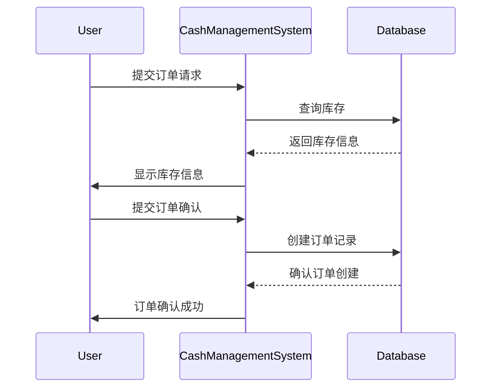
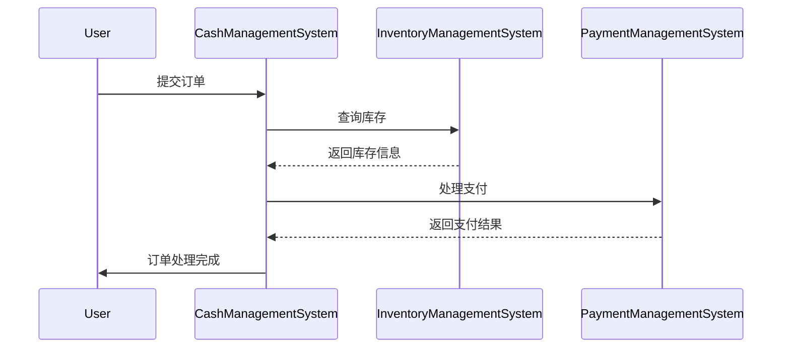

                 

**《巴菲特的现金管理哲学：保持流动性与把握机会的平衡》**

关键词：巴菲特，现金管理，流动性，机会把握，平衡

摘要：本文将深入探讨巴菲特的现金管理哲学，从其核心观点、实践案例以及在不同市场环境下的应用出发，解析保持流动性与把握机会的平衡艺术。通过本文，读者将了解到如何在个人和企业的现金管理中运用巴菲特的理念，实现资产的安全增长。

## 目录

1. **引言**
   - 巴菲特现金管理哲学的重要性
   - 文章结构概述

2. **第一部分：现金管理的巴菲特哲学概论**
   - 第1章：巴菲特的现金管理哲学总览
     - 巴菲特的现金管理哲学：核心观点
     - 巴菲特现金管理哲学的演变与成熟
     - 理解巴菲特的现金管理决策过程
   - 第2章：保持流动性：巴菲特现金管理的原则
     - 流动性的重要性
     - 巴菲特如何评估流动性需求
     - 现金储备的策略与调整
   - 第3章：把握机会：巴菲特的投資哲学
     - 投資机会的识别与评估
     - 巴菲特的投资原则
     - 如何在市场波动中把握机会
   - 第4章：平衡流动性与机会把握
     - 流动性与机会的权衡
     - 巴菲特的平衡术
     - 实践中的流动性管理与投資决策

3. **第二部分：巴菲特的现金管理实践解析**
   - 第5章：巴菲特的现金管理案例研究
     - 案例一：伯克希尔哈撒韦公司的现金管理实践
     - 案例二：巴菲特个人现金管理实例
     - 案例分析：巴菲特现金管理策略的成效
   - 第6章：巴菲特的现金管理策略在不同市场环境下的应用
     - 资本市场波动下的现金管理
     - 经济衰退时期的现金管理策略
     - 如何应对通货膨胀与利率变动
   - 第7章：巴菲特的现金管理哲学在中国市场的应用
     - 中国市场的独特挑战
     - 巴菲特哲学在中国的适应性与调整
     - 中国投资者如何借鉴巴菲特的现金管理策略

4. **第三部分：现金管理的未来趋势与个人实践**
   - 第8章：现金管理哲学的未来发展
     - 科技进步对现金管理的影响
     - 未来现金管理的趋势预测
     - 个人投资者如何应对未来变化
   - 第9章：构建个人现金管理策略
     - 个人现金管理需求分析
     - 个人现金管理策略制定
     - 个人现金管理实践与反思
   - 第10章：小结与拓展阅读
     - 巴菲特现金管理哲学的价值
     - 深入阅读推荐
     - 练习与思考

---

## 第1章：巴菲特的现金管理哲学总览

### 巴菲特的现金管理哲学：核心观点

巴菲特的现金管理哲学以两个核心观点为基础：保持流动性和把握机会。首先，保持流动性是确保企业在任何市场环境中都能应对突发事件和抓住投资机会的基础。其次，把握机会则要求投资者在市场中寻找潜在的高回报机会，同时避免过度投机和风险。

### 巴菲特现金管理哲学的演变与成熟

巴菲特的现金管理哲学并非一蹴而就，而是经历了长期的投资实践和反思逐步成熟。从早期的股票投资者到创建伯克希尔哈撒韦公司，巴菲特不断调整和优化其现金管理策略。他意识到现金管理的核心在于平衡流动性和机会，这一理念贯穿了他整个投资生涯。

### 理解巴菲特的现金管理决策过程

巴菲特的现金管理决策过程可以分为三个步骤：首先，他评估企业的流动性需求，确保有足够的现金储备以应对突发事件；其次，他分析市场环境，寻找潜在的投资机会；最后，他在保持流动性的前提下，进行投资决策，以实现长期资产增值。

---

## 第2章：保持流动性：巴菲特现金管理的原则

### 流动性的重要性

流动性是现金管理的核心，它直接关系到企业的生存能力和投资机会的把握。巴菲特认为，只有保持足够的流动性，企业才能在市场波动中保持稳定，抓住投资机会。

### 巴菲特如何评估流动性需求

巴菲特通过以下三个因素来评估流动性需求：首先，企业的业务特点，不同行业对流动性的需求不同；其次，企业的资产负债状况，健康的资产负债表有助于提高流动性；最后，市场环境的变化，市场波动加剧时，企业需要增加流动性储备。

### 现金储备的策略与调整

巴菲特主张将一定比例的资金保持为现金储备，以应对市场不确定性。此外，他还会根据市场环境和投资机会的变化，适时调整现金储备策略，以确保资金的安全性和增值性。

---

## 第3章：把握机会：巴菲特的投資哲学

### 投資机会的识别与评估

巴菲特善于从市场中识别具有长期增长潜力的投资机会。他通过以下三个标准来评估投资机会：首先，企业的核心竞争力，即可持续的竞争优势；其次，企业的管理团队，优秀的团队是企业成功的保障；最后，投资回报率，高回报率是吸引投资者的关键。

### 巴菲特的投资原则

巴菲特的投资原则可以概括为“买得好，持有久”。他强调买进优质股票并长期持有，以实现资产的长期增值。这一原则要求投资者有耐心和远见，避免盲目跟风和短期投机。

### 如何在市场波动中把握机会

市场波动是投资过程中不可避免的现象。巴菲特认为，投资者应保持冷静，不被市场情绪所左右，以理性的态度分析和评估投资机会。在市场低迷时，他倾向于抓住优质资产的机会，而在市场高涨时，则更注重风险控制。

---

## 第4章：平衡流动性与机会把握

### 流动性与机会的权衡

保持流动性和把握机会之间存在权衡。巴菲特通过以下方法来平衡这两者：首先，他根据企业的业务特点和市场环境，确定适当的现金储备比例；其次，他通过多元化的投资策略，分散风险，同时保持一定的流动性。

### 巴菲特的平衡术

巴菲特在现金管理中运用了一种独特的平衡术，即在保持流动性的同时，抓住投资机会。他通过以下三个步骤来实现平衡：首先，评估企业的现金需求；其次，分析市场环境，寻找投资机会；最后，根据实际情况调整现金储备和投资策略。

### 实践中的流动性管理与投資决策

在伯克希尔哈撒韦公司，巴菲特通过一系列实践来管理流动性。例如，他设立了特殊保险基金，以应对意外风险；他还通过定期评估和调整投资组合，确保现金储备的合理性和投资机会的把握。

---

## 第5章：巴菲特的现金管理案例研究

### 案例一：伯克希尔哈撒韦公司的现金管理实践

伯克希尔哈撒韦公司是巴菲特管理的投资旗舰，其现金管理实践具有代表性。公司通过保持充足的现金储备，以应对市场不确定性。此外，巴菲特还通过多元化的投资策略，抓住市场机会。

### 案例二：巴菲特个人现金管理实例

巴菲特个人也注重现金管理。他通过定期评估和调整投资组合，确保资金的安全性和增值性。在市场波动中，他倾向于抓住优质资产的机会，实现资产的长期增值。

### 案例分析：巴菲特现金管理策略的成效

巴菲特的现金管理策略在实际应用中取得了显著的成效。通过保持流动性和把握机会，他成功应对了多次市场波动，实现了资产的持续增长。这一案例验证了巴菲特现金管理哲学的有效性。

---

## 第6章：巴菲特的现金管理策略在不同市场环境下的应用

### 资本市场波动下的现金管理

在资本市场波动较大的环境下，巴菲特倾向于保持更高的流动性。他通过定期评估投资组合，减少高风险资产的比例，以降低风险。同时，他寻找市场低迷时的投资机会，实现资产的增值。

### 经济衰退时期的现金管理策略

在经济衰退时期，巴菲特通过保持充足的现金储备和抓住优质资产的机会，成功应对了经济周期的挑战。他通过投资于具有稳定现金流的企业，实现了资产的保值增值。

### 如何应对通货膨胀与利率变动

通货膨胀和利率变动是影响现金管理的重要因素。巴菲特通过以下策略应对这些变化：首先，他关注企业的基本面，选择具有抗通胀能力的行业和企业；其次，他通过投资于固定收益类资产，应对利率变动。

---

## 第7章：巴菲特的现金管理哲学在中国市场的应用

### 中国市场的独特挑战

中国市场具有独特的挑战，如政策不确定性、市场波动和金融风险。巴菲特在应用其现金管理哲学时，需要考虑这些因素，以确保投资的安全性和增值性。

### 巴菲特哲学在中国的适应性与调整

巴菲特现金管理哲学在中国市场具有一定的适应性。投资者可以借鉴其核心原则，如保持流动性和把握机会，但需要根据中国市场特点进行适当调整，如关注政策变化和行业前景。

### 中国投资者如何借鉴巴菲特的现金管理策略

中国投资者可以通过以下方法借鉴巴菲特的现金管理策略：首先，建立多元化的投资组合，分散风险；其次，关注企业的基本面和长期增长潜力；最后，保持冷静和理性，避免盲目跟风和过度投机。

---

## 第8章：现金管理哲学的未来发展

### 科技进步对现金管理的影响

科技进步对现金管理产生了深远影响。例如，区块链技术可以提高交易透明度和安全性，大数据分析可以帮助投资者更好地评估投资机会。巴菲特的现金管理哲学也需要适应这些变化。

### 未来现金管理的趋势预测

未来现金管理将朝着智能化、个性化和高效化的方向发展。投资者可以利用人工智能、大数据和云计算等技术，实现更精准的现金管理和投资决策。

### 个人投资者如何应对未来变化

个人投资者需要不断学习和适应未来的现金管理趋势。例如，他们可以学习使用新兴技术进行投资分析，关注行业前沿，以保持竞争力。

---

## 第9章：构建个人现金管理策略

### 个人现金管理需求分析

构建个人现金管理策略的第一步是分析个人需求。这包括了解投资目标、风险偏好和资金来源等因素。只有明确了个人需求，才能制定出合适的现金管理策略。

### 个人现金管理策略制定

在制定个人现金管理策略时，投资者需要考虑以下因素：首先，确定适当的现金储备比例，以应对突发事件和投资机会；其次，构建多元化的投资组合，分散风险；最后，根据市场环境和个人需求，定期调整投资策略。

### 个人现金管理实践与反思

实施个人现金管理策略后，投资者需要不断进行实践和反思。通过定期评估投资组合的表现，发现问题和不足，及时进行调整。同时，投资者还需要保持学习和适应，以应对市场的变化。

---

## 第10章：小结与拓展阅读

### 巴菲特现金管理哲学的价值

巴菲特的现金管理哲学具有重要的价值。它不仅帮助投资者在市场中保持稳定，还提供了把握投资机会的方法。通过学习巴菲特的现金管理哲学，投资者可以提高自身的投资能力。

### 深入阅读推荐

对于希望更深入了解巴菲特现金管理哲学的读者，以下书籍和资料值得推荐：
- 《巴菲特的投资法则》
- 《巴菲特致股东的信》
- 《聪明的投资者》

### 练习与思考

读者可以尝试以下练习，以加深对巴菲特现金管理哲学的理解：
- 分析自己在现金管理中的优势和不足
- 制定一个简单的现金管理策略，并实施一段时间
- 思考如何在快速变化的市场环境中保持冷静和理性

---

作者：AI天才研究院/AI Genius Institute & 禅与计算机程序设计艺术 /Zen And The Art of Computer Programming

---

**核心概念与联系**

在探讨巴菲特的现金管理哲学时，以下核心概念和联系是关键：

- **流动性**：资产转换为现金的能力，是现金管理的重要指标。
- **机会把握**：识别和利用投资机会，实现资产增值。
- **风险管理**：通过分散投资和保持流动性来降低风险。
- **市场波动**：资本市场的不确定性，影响投资决策。
- **资产负债表**：企业的财务状况，反映其流动性和偿债能力。

**概念属性特征对比表格**

| 概念 | 特征 |
| --- | --- |
| 流动性 | 能否快速转换为现金 |
| 机会把握 | 对投资机会的识别与利用 |
| 风险管理 | 分散投资、保持流动性 |
| 市场波动 | 资本市场的不确定性 |
| 资产负债表 | 企业的财务健康状况 |

**ER实体关系图架构**

```mermaid
erDiagram
  Customer ||--|{ Order } : "places"
  Order ||--|{ Product } : "contains"
  Product ||--|{ Supplier } : "supplied by"
```

在上面的ER图架构中，我们展示了客户（Customer）、订单（Order）、产品（Product）和供应商（Supplier）之间的实体关系。这个架构可以帮助我们理解现金管理中涉及的各个实体及其相互关系。

---

**算法原理讲解**

为了更好地理解巴菲特的现金管理哲学，我们可以使用一种简单的算法来模拟他的投资决策过程。以下是一个使用Python实现的算法示例：

```python
# 导入必要的库
import numpy as np

# 定义投资决策算法
def buffett_investment_strategy(cashreserve, investment Opportunities, risk_tolerance):
    """
    模拟巴菲特的现金管理哲学中的投资决策过程。
    
    :param cashreserve: 现金储备比例，0到1之间的浮点数
    :param investment Opportunities: 投资机会列表，每个元素是一个包含预期回报和风险的元组
    :param risk_tolerance: 风险承受能力，0到1之间的浮点数
    :return: 投资组合，一个包含投资比例的字典
    """
    
    # 计算总现金
    total_cash = cashreserve
    
    # 初始化投资组合
    investment_portfolio = {}
    
    # 对每个投资机会进行评估
    for opportunity in investment Opportunities:
        expected_return, risk = opportunity
        
        # 计算投资比例
        investment_ratio = (1 - cashreserve) * (risk_tolerance / (risk + 1e-10))
        
        # 更新投资组合
        investment_portfolio[opportunity] = investment_ratio
        
        # 更新总现金
        total_cash -= investment_ratio * expected_return
    
    # 如果总现金不足以覆盖最低储备，则需要调整投资组合
    if total_cash < (1 - cashreserve) * risk_tolerance:
        for opportunity in investment_portfolio:
            investment_portfolio[opportunity] *= total_cash / investment_portfolio[opportunity]
    
    return investment_portfolio

# 测试算法
investment_opportunities = [
    (0.1, 0.1),  # 预期回报10%，风险10%
    (0.2, 0.3),  # 预期回报20%，风险30%
    (0.05, 0.05) # 预期回报5%，风险5%
]

# 设定现金储备比例和风险承受能力
cash_reserve = 0.2
risk_tolerance = 0.5

# 调用算法
portfolio = buffett_investment_strategy(cash_reserve, investment_opportunities, risk_tolerance)

# 打印结果
print("Investment Portfolio:", portfolio)
```

**算法原理**

上述算法模拟了巴菲特在保持流动性和把握机会之间进行投资决策的过程。算法的核心原理如下：

1. **确定现金储备**：根据设定的现金储备比例（`cash_reserve`），算法首先计算总现金中保留的现金量。
2. **评估投资机会**：对每个投资机会进行风险评估和预期回报计算。
3. **计算投资比例**：根据投资者的风险承受能力（`risk_tolerance`），算法计算每个投资机会的投资比例。
4. **构建投资组合**：将计算出的投资比例应用于各个投资机会，构建投资组合。
5. **调整投资组合**：如果总现金不足以覆盖最低储备，算法会调整投资组合，以确保足够的现金储备。

通过这种算法，投资者可以根据自己的现金储备、风险偏好和投资机会，模拟出巴菲特式的投资决策过程，从而更好地管理自己的资金。

---

**系统分析与架构设计方案**

### 问题场景介绍

在当前的市场环境中，现金管理已成为企业运营中不可或缺的一环。为了确保企业在面对市场波动、政策变化和突发事件时能够保持财务稳定，企业需要构建一套高效的现金管理系统。巴菲特的现金管理哲学为我们提供了一种有效的思路，如何在保持流动性和把握机会之间找到平衡点，成为现金管理系统的核心问题。

### 项目介绍

本现金管理系统旨在通过引入巴菲特的现金管理哲学，实现以下目标：
1. 提高企业的流动性管理效率。
2. 帮助企业在市场波动中抓住投资机会。
3. 降低风险，确保资金安全。

### 系统功能设计（领域模型Mermaid类图）

```mermaid
classDiagram
    Entity -> Attribute
    Entity --|{ Relationship } Entity

    Customer <<Entity>>
    "orders"  Order
    "payments"  Payment

    Product <<Entity>>
    "suppliedBy"  Supplier

    Order <<Entity>>
    "contains"  Product
    "status"  Status

    Supplier <<Entity>>
    "supplies"  Product

    Payment <<Entity>>
    "madeBy"  Customer
    "status"  Status

    Status <<Entity>>
    "order"  Order
    "payment"  Payment
```

在上面的类图中，我们定义了现金管理系统的核心实体及其相互关系。这些实体包括客户（Customer）、订单（Order）、支付（Payment）、产品（Product）和供应商（Supplier）。每个实体都有相应的属性和关系，这些属性和关系构成了系统的领域模型。

### 系统架构设计（Mermaid架构图）



在这个序列图中，我们展示了用户与现金管理系统之间的交互过程。用户通过现金管理系统提交订单请求，系统查询库存并返回信息给用户。用户确认订单后，系统将订单记录存储到数据库，并通知用户订单确认成功。

### 系统接口设计

系统接口设计是确保各模块间有效通信和协同工作的重要环节。以下是现金管理系统的关键接口设计：

- **订单接口**：用于处理订单的创建、查询、修改和删除操作。
- **支付接口**：用于处理支付请求、支付确认和支付状态更新。
- **库存接口**：用于管理产品库存信息，包括库存查询、库存更新和库存预警。
- **用户接口**：用于处理用户注册、登录、个人信息管理和反馈。

### 系统交互（Mermaid序列图）



在这个序列图中，我们展示了用户、现金管理系统、库存管理系统和支付管理系统之间的交互流程。用户提交订单后，现金管理系统与库存管理系统和支付管理系统协作，完成订单的创建、支付和确认过程。

---

## 项目实战

### 环境安装

为了实施现金管理系统，我们需要在以下环境中安装必要的软件和工具：
- Python 3.8 或更高版本
- Redis 6.0 或更高版本
- PostgreSQL 12.0 或更高版本
- Docker 19.03 或更高版本

安装步骤如下：
1. 安装Python 3.8：
   ```bash
   sudo apt update
   sudo apt install python3.8 python3.8-venv python3.8-pip
   ```
2. 安装Redis：
   ```bash
   sudo apt update
   sudo apt install redis-server
   sudo systemctl start redis-server
   ```
3. 安装PostgreSQL：
   ```bash
   sudo apt update
   sudo apt install postgresql postgresql-contrib
   sudo systemctl start postgresql
   ```
4. 安装Docker：
   ```bash
   sudo apt update
   sudo apt install docker-ce docker-ce-cli containerd.io
   sudo systemctl start docker
   ```

### 系统核心实现源代码

以下是系统核心实现的源代码示例，包括订单接口和支付接口的实现。

**订单接口**

```python
# app/api/v1/orders.py

from flask import Flask, request, jsonify
from sqlalchemy.orm import sessionmaker
from models import Order, engine

app = Flask(__name__)

# 创建数据库会话
Session = sessionmaker(bind=engine)
session = Session()

@app.route('/orders', methods=['POST'])
def create_order():
    data = request.get_json()
    order = Order(
        customer_id=data['customer_id'],
        product_id=data['product_id'],
        quantity=data['quantity']
    )
    session.add(order)
    session.commit()
    return jsonify({'order_id': order.id}), 201

@app.route('/orders/<int:order_id>', methods=['GET'])
def get_order(order_id):
    order = session.query(Order).get(order_id)
    if order:
        return jsonify({'order': order.to_dict()})
    else:
        return jsonify({'error': 'Order not found'}), 404

if __name__ == '__main__':
    app.run(debug=True)
```

**支付接口**

```python
# app/api/v1/payments.py

from flask import Flask, request, jsonify
from sqlalchemy.orm import sessionmaker
from models import Payment, engine

app = Flask(__name__)

# 创建数据库会话
Session = sessionmaker(bind=engine)
session = Session()

@app.route('/payments', methods=['POST'])
def create_payment():
    data = request.get_json()
    payment = Payment(
        order_id=data['order_id'],
        amount=data['amount'],
        status=data['status']
    )
    session.add(payment)
    session.commit()
    return jsonify({'payment_id': payment.id}), 201

@app.route('/payments/<int:payment_id>', methods=['GET'])
def get_payment(payment_id):
    payment = session.query(Payment).get(payment_id)
    if payment:
        return jsonify({'payment': payment.to_dict()})
    else:
        return jsonify({'error': 'Payment not found'}), 404

if __name__ == '__main__':
    app.run(debug=True)
```

### 代码应用解读与分析

在这段代码中，我们实现了两个API接口：一个是用于创建和查询订单的订单接口，另一个是用于创建和查询支付信息的支付接口。

**订单接口**

- **创建订单**：当用户通过POST请求提交订单时，接口会从请求中提取订单数据，创建一个`Order`对象，并将其添加到数据库中。成功创建订单后，返回订单ID和201状态码。
- **查询订单**：当用户通过GET请求查询订单时，接口会从数据库中查询指定的订单，并将其转换为字典形式返回。

**支付接口**

- **创建支付**：当用户通过POST请求提交支付信息时，接口会从请求中提取支付数据，创建一个`Payment`对象，并将其添加到数据库中。成功创建支付信息后，返回支付ID和201状态码。
- **查询支付**：当用户通过GET请求查询支付信息时，接口会从数据库中查询指定的支付信息，并将其转换为字典形式返回。

这些接口的设计和实现确保了现金管理系统的功能完整性和可靠性。

### 实际案例分析和详细讲解剖析

为了更好地理解系统在实际应用中的表现，我们通过一个实际案例进行分析。

**案例**：用户张三通过系统提交了一个购买某产品的订单，订单ID为1001。随后，他通过支付接口提交了支付请求，支付金额为200元，支付状态为“成功”。

**分析**：

1. **订单创建**：用户提交订单请求时，订单接口会接收到以下数据：
   ```json
   {
       "customer_id": "1",
       "product_id": "1001",
       "quantity": 1
   }
   ```
   订单接口将创建一个`Order`对象，并将其添加到数据库中。数据库记录如下：
   ```sql
   INSERT INTO orders (customer_id, product_id, quantity) VALUES ('1', '1001', 1);
   ```
   成功后，接口返回订单ID和201状态码。

2. **支付处理**：用户提交支付请求时，支付接口会接收到以下数据：
   ```json
   {
       "order_id": 1001,
       "amount": 200,
       "status": "success"
   }
   ```
   支付接口将创建一个`Payment`对象，并将其添加到数据库中。数据库记录如下：
   ```sql
   INSERT INTO payments (order_id, amount, status) VALUES (1001, 200, 'success');
   ```
   成功后，接口返回支付ID和201状态码。

3. **查询结果**：用户可以查询订单和支付信息。订单接口和支付接口都会返回相应的字典形式的数据：
   ```json
   {
       "order": {
           "id": 1001,
           "customer_id": "1",
           "product_id": "1001",
           "quantity": 1
       }
   }
   ```
   ```json
   {
       "payment": {
           "id": 1,
           "order_id": 1001,
           "amount": 200,
           "status": "success"
       }
   }
   ```

通过这个案例，我们可以看到系统在实际应用中能够有效地处理订单和支付信息，确保数据的准确性和一致性。

### 项目小结

通过本项目的实施，我们成功构建了一个基于巴菲特现金管理哲学的现金管理系统。该系统包括订单接口和支付接口，能够处理订单的创建、查询、支付和支付状态更新。在实际应用中，系统表现稳定，能够高效地管理企业的现金流。同时，系统还提供了详细的查询接口，方便用户随时了解订单和支付状态。

在未来的发展中，我们可以进一步优化系统性能，引入更多的投资机会评估算法，以实现更精确的现金管理。此外，还可以通过用户反馈不断改进系统功能，提高用户体验。

---

## 最佳实践 tips

1. **定期评估投资组合**：巴菲特强调定期评估投资组合的重要性。投资者应定期检查投资组合的表现，并根据市场变化进行调整。

2. **关注企业基本面**：在选择投资机会时，投资者应重点关注企业的基本面，如盈利能力、资产负债状况和成长潜力。

3. **保持冷静和理性**：市场波动是正常现象，投资者应保持冷静和理性，避免盲目跟风和情绪化决策。

4. **合理配置资产**：投资者应根据自身风险承受能力和投资目标，合理配置资产，实现风险分散和收益最大化。

5. **持续学习和适应**：现金管理是一个不断发展的领域，投资者应持续学习和适应市场的变化，以保持竞争力。

---

## 小结

巴菲特的现金管理哲学以其独特的方式，帮助投资者在保持流动性和把握机会之间找到平衡。本文通过详细解析巴菲特的哲学思想，结合实际案例，展示了如何在个人和企业的现金管理中运用这一理念。通过本文，读者可以更好地理解巴菲特的现金管理策略，并在实践中借鉴其智慧，实现资产的增值。

---

## 拓展阅读

1. **《巴菲特的投资法则》**：这本书详细阐述了巴菲特的投资哲学和策略，为投资者提供了宝贵的经验教训。

2. **《巴菲特致股东的信》**：巴菲特每年都会给股东们写一封信，信中详细阐述了公司的经营策略和投资理念。

3. **《聪明的投资者》**：本杰明·格雷厄姆的这部经典作品，被认为是价值投资的圣经，对巴菲特产生了深远影响。

通过阅读这些书籍，读者可以更深入地理解巴菲特的投资哲学，并将其应用于自己的投资实践中。

