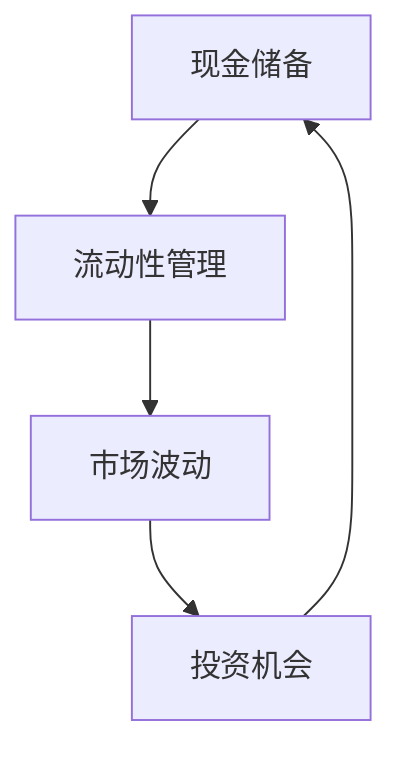
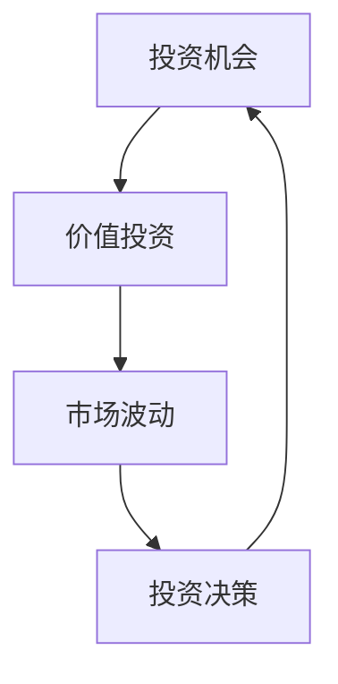
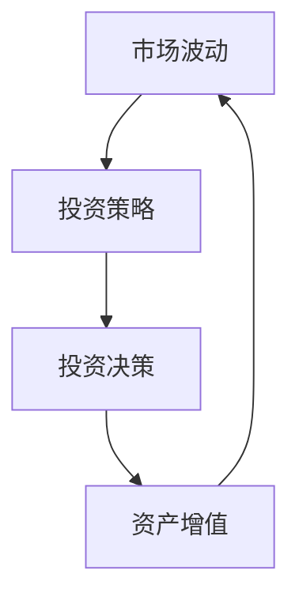
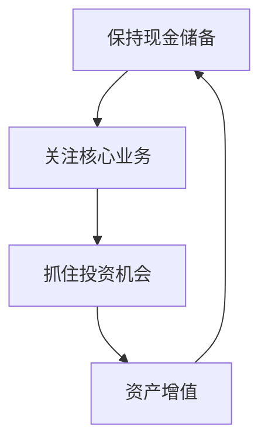
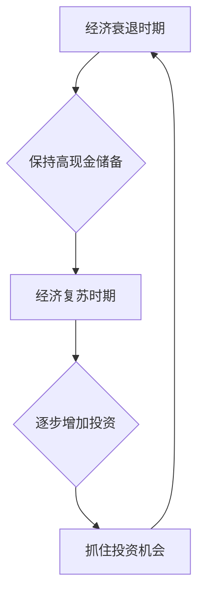
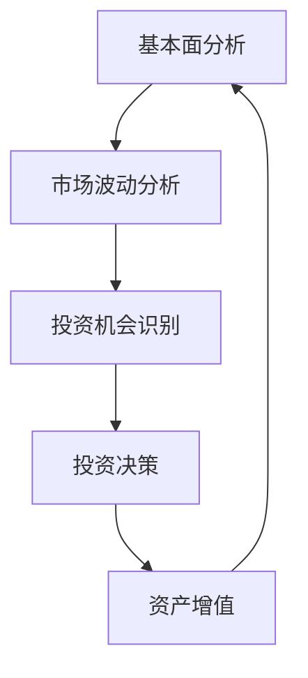
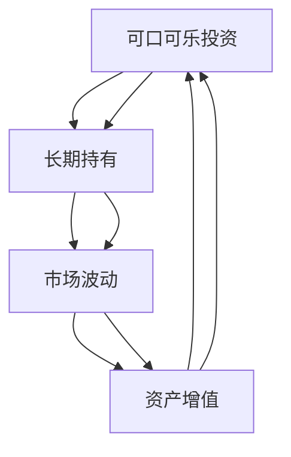
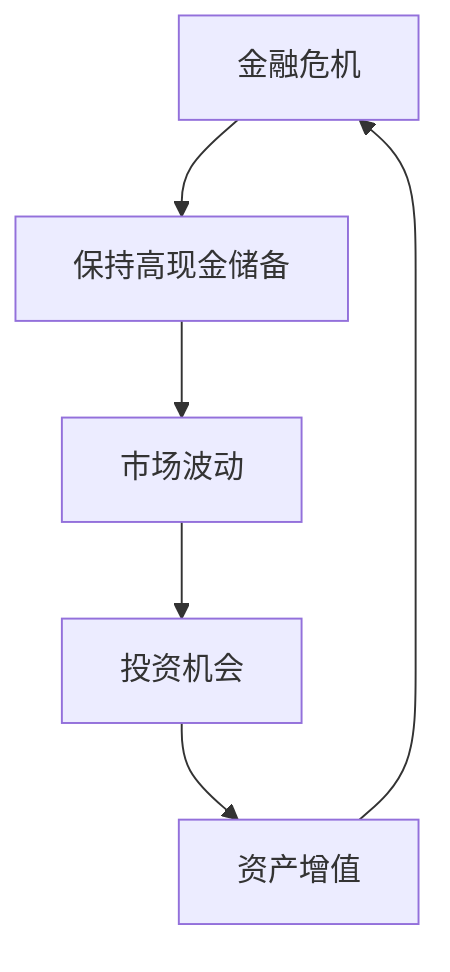

                 

### 巴菲特的现金管理哲学：机会资金的重要性

> 关键词：现金管理、巴菲特、价值投资、流动性、机会资金

> 摘要：本文深入探讨巴菲特的现金管理哲学，特别是机会资金的重要性。通过分析其核心原则、策略和实践，帮助读者理解并掌握这一独特的投资理念，以实现长期稳健的财务增长。

#### 第一部分：引言

在快速变化的金融市场中，现金管理成为了企业成功的关键。巴菲特作为世界著名的投资大师，其现金管理哲学为我们提供了宝贵的启示。本文旨在通过逐步分析巴菲特的现金管理哲学，特别是机会资金的重要性，帮助读者更好地理解和应用这一理念。

#### 1.1 问题背景

现代金融市场的复杂性日益增加，企业面临着资金流动、投资机会和市场波动的多重挑战。现金管理作为企业财务管理的重要组成部分，直接影响到企业的生存和发展。如何平衡现金储备和投资机会，确保财务稳定和增长，成为了企业管理者亟待解决的问题。

#### 1.2 问题描述

企业如何合理配置现金资源，确保流动性的同时抓住投资机会，实现资产的增值？这是一个复杂且关键的问题。巴菲特的现金管理哲学，特别是机会资金的理念，为我们提供了宝贵的解决方案。本文将详细探讨这一哲学，分析其核心概念和操作方法，以帮助读者应对这一挑战。

#### 1.3 问题解决

巴菲特的现金管理哲学基于价值投资的理念，强调安全性和机会的结合。通过保守的现金储备和灵活的投资策略，巴菲特成功地把握了市场波动中的投资机会，实现了长期稳健的收益。本文将深入分析这一哲学，并提供实用的操作指南。

#### 1.4 边界与外延

本文的核心概念包括：现金储备、流动性管理、投资机会、价值投资、市场波动等。这些概念相互关联，构成了巴菲特现金管理哲学的完整体系。同时，本文还将探讨这些概念在不同市场环境下的应用，帮助读者应对各种经济周期。

#### 第二部分：核心概念与联系

在深入探讨巴菲特的现金管理哲学之前，我们需要理解其核心概念和联系。以下是本文将详细分析的核心概念：

- **现金储备**：指企业为应对不确定性而持有的现金和现金等价物。
- **流动性管理**：指企业对现金流动性的管理和监控，以确保资金的有效运作。
- **投资机会**：指在市场上出现的潜在投资机会，可能带来资产增值。
- **价值投资**：指通过购买低估的股票或其他资产，实现长期投资回报。
- **市场波动**：指市场价格波动的不确定性，可能带来投资机会或风险。

这些概念相互关联，构成了巴菲特现金管理哲学的基础。下面，我们将详细分析这些概念之间的联系，并使用Mermaid流程图展示它们之间的关系。

#### 2.1 现金储备与流动性管理

现金储备和流动性管理是企业现金管理的两个核心方面。现金储备是企业应对不确定性的重要手段，而流动性管理则是确保现金资源高效运作的关键。以下是现金储备和流动性管理的Mermaid流程图：

通过这个流程图，我们可以看到现金储备和流动性管理是如何相互作用，并在市场波动中抓住投资机会的。

#### 2.2 投资机会与价值投资

巴菲特认为，投资机会的把握是企业长期成功的关键。而价值投资则是他识别和把握投资机会的主要方法。以下是投资机会和价值投资的Mermaid流程图：

这个流程图展示了投资机会是如何通过价值投资理念转化为投资决策，并在市场波动中实现的。

#### 2.3 市场波动与投资策略

市场波动是影响投资决策的重要因素。巴菲特通过不同的投资策略，成功应对了市场波动，并抓住了投资机会。以下是市场波动与投资策略的Mermaid流程图：

这个流程图展示了市场波动如何影响投资策略，进而影响投资决策和资产增值。

#### 第三部分：巴菲特的现金管理哲学

巴菲特的现金管理哲学是基于其价值投资理念的核心原则，强调安全性和机会的结合。下面，我们将详细分析巴菲特的现金管理哲学，包括其核心原则、策略和实践。

#### 3.1 现金管理原则

巴菲特的现金管理原则主要包括以下几点：

1. **保持合理的现金储备**：巴菲特认为，企业需要持有一定数量的现金，以应对市场不确定性。
2. **关注企业的核心业务**：巴菲特强调，企业应专注于其核心业务，避免过度扩张和多元化，以确保现金流的稳定。
3. **抓住投资机会**：巴菲特通过价值投资理念，识别和抓住市场波动中的投资机会，实现资产的增值。

以下是这些原则的Mermaid流程图：

通过这个流程图，我们可以看到巴菲特的现金管理原则是如何相互关联，并实现资产增值的。

#### 3.2 现金储备策略

巴菲特在不同市场环境下，会采用不同的现金储备策略。以下是他在经济衰退时期和经济复苏时期采用的策略：

- **经济衰退时期**：巴菲特会保持较高的现金储备，以应对市场不确定性。
- **经济复苏时期**：巴菲特会逐步增加投资，利用市场波动中的投资机会。

以下是巴菲特在不同市场环境下采用的现金储备策略的Mermaid流程图：

通过这个流程图，我们可以看到巴菲特如何根据市场环境调整现金储备策略。

#### 3.3 投资机会的识别与把握

巴菲特通过价值投资理念，识别和把握投资机会。以下是他的投资机会识别与把握过程的Mermaid流程图：

通过这个流程图，我们可以看到巴菲特如何通过基本面分析和市场波动分析，识别和把握投资机会。

#### 第四部分：实际案例与分析

为了更好地理解巴菲特的现金管理哲学，我们可以通过实际案例进行分析。以下是巴菲特在微软和可口可乐等公司的投资案例，以及他在2008年金融危机期间的现金管理策略。

#### 4.1 巴菲特在微软和可口可乐的投资案例

- **微软**：巴菲特在1988年首次投资微软，持有其大量股份。通过长期的持有和市场的波动，巴菲特成功实现了资产的增值。
- **可口可乐**：巴菲特在1991年投资可口可乐，持有其大量股份。通过可口可乐的稳定现金流和市场的波动，巴菲特实现了资产的增值。

以下是巴菲特在微软和可口可乐的投资案例的Mermaid流程图：

通过这个流程图，我们可以看到巴菲特如何通过长期持有和市场的波动，实现资产的增值。

#### 4.2 2008年金融危机期间的现金管理策略

在2008年金融危机期间，巴菲特采取了保守的现金管理策略，将大量资金投入现金和现金等价物。以下是巴菲特在2008年金融危机期间的现金管理策略的Mermaid流程图：

通过这个流程图，我们可以看到巴菲特如何通过保持高现金储备，抓住市场波动中的投资机会，实现资产的增值。

#### 第五部分：最佳实践与建议

通过分析巴菲特的现金管理哲学和实际案例，我们可以得出以下最佳实践和建议：

- **保持合理的现金储备**：企业应根据市场环境和自身业务需求，保持合理的现金储备，以应对不确定性。
- **关注核心业务**：企业应专注于其核心业务，避免过度扩张和多元化，以确保现金流的稳定。
- **抓住投资机会**：企业应通过价值投资理念，识别和把握市场波动中的投资机会，实现资产的增值。

#### 5.1 现金管理最佳实践

- **制定现金储备策略**：企业应根据市场环境和自身业务需求，制定合理的现金储备策略，确保现金储备的合理性和流动性。
- **定期评估现金储备**：企业应定期评估现金储备，确保其符合市场环境和业务需求。
- **优化现金流管理**：企业应优化现金流管理，确保现金流动性和效率。

#### 5.2 小结与展望

本文通过分析巴菲特的现金管理哲学，特别是机会资金的重要性，帮助读者理解并掌握了这一独特的投资理念。巴菲特的现金管理哲学基于价值投资的理念，强调安全性和机会的结合。通过保持合理的现金储备、关注核心业务和抓住投资机会，企业可以实现长期稳健的财务增长。在未来，随着市场环境的不断变化，企业应灵活应用巴菲特的现金管理哲学，以应对挑战，实现资产的增值。

### 第六部分：拓展阅读与参考

为了进一步深入了解巴菲特的现金管理哲学，读者可以参考以下拓展阅读和参考书目：

- **巴菲特的经典著作**：如《巴菲特致股东的信》、《巴菲特的投资方法》等。
- **相关学术研究**：如《价值投资与市场波动》、《企业现金管理策略》等。
- **市场分析报告**：如《金融市场分析报告》、《宏观经济分析报告》等。

### 作者信息

作者：AI天才研究院/AI Genius Institute & 禅与计算机程序设计艺术 /Zen And The Art of Computer Programming

---

通过这篇文章，我们详细探讨了巴菲特的现金管理哲学，特别是机会资金的重要性。从核心概念的分析到实际案例的解析，再到最佳实践与建议的总结，我们希望能帮助读者深入理解并应用这一理念，实现财务的稳健增长。在未来的投资旅程中，巴菲特的现金管理哲学将继续为我们提供宝贵的启示。让我们一起不断学习，持续成长！### 文章关键词定义及背景介绍

在深入探讨巴菲特的现金管理哲学之前，首先需要明确一些核心概念和背景知识。这些概念不仅为我们的讨论提供了基础，也帮助我们更好地理解巴菲特的投资策略和理念。

**关键词定义**：

1. **现金储备**：指企业为应对不确定性而持有的现金和现金等价物，如银行存款、短期投资等。它通常被视为企业的“安全垫”，有助于在市场波动或紧急情况下保持流动性。

2. **流动性管理**：指企业对现金流动性的管理和监控，确保现金资源能够高效运作，以满足日常运营和突发需求。良好的流动性管理是企业财务稳定和投资决策的基础。

3. **投资机会**：指在市场上出现的潜在投资机会，可能带来资产增值。投资机会通常与市场波动、企业成长和行业变化相关。

4. **价值投资**：指通过购买低估的股票或其他资产，实现长期投资回报。价值投资的核心是寻找价格低于其内在价值的投资机会。

5. **市场波动**：指市场价格波动的不确定性，可能带来投资机会或风险。市场波动是影响投资决策的重要因素。

**背景介绍**：

现代金融市场的复杂性日益增加，企业面临着资金流动、投资机会和市场波动的多重挑战。如何平衡现金储备和投资机会，确保财务稳定和增长，成为了企业管理者亟待解决的问题。

巴菲特作为世界著名的投资大师，其现金管理哲学为我们提供了宝贵的启示。巴菲特以其独特的价值投资理念，在长期投资中取得了卓越的成绩。他的现金管理哲学强调安全性和机会的结合，通过保守的现金储备和灵活的投资策略，成功把握了市场波动中的投资机会。

本文旨在通过逐步分析巴菲特的现金管理哲学，特别是机会资金的重要性，帮助读者理解并掌握这一独特的投资理念，以实现长期稳健的财务增长。

在接下来的部分中，我们将详细探讨巴菲特的现金管理哲学，包括其核心原则、策略和实践。通过深入分析这些内容，读者将能够更好地理解巴菲特的投资智慧，并在实际投资中应用这些理念。

### 第一部分：巴菲特的现金管理原则

巴菲特的现金管理哲学基于其价值投资理念，强调安全性和机会的结合。以下是巴菲特的核心现金管理原则，以及这些原则在实际操作中的具体应用。

#### 1. 保持合理的现金储备

巴菲特认为，企业应保持一定数量的现金储备，以应对市场不确定性和潜在的紧急情况。合理的现金储备不仅能够保证企业的流动性，还能在市场波动中提供投资机会。

**原则解释**：

- 现金储备是企业应对市场不确定性的“安全垫”，有助于在市场低迷时保持运营和投资能力。
- 合理的现金储备可以降低企业的财务风险，确保在危机时刻能够灵活应对。

**实际应用**：

- 巴菲特在其管理下的伯克希尔·哈撒韦公司，通常保持超过100亿美元的现金储备。
- 在2008年金融危机期间，巴菲特通过保持大量现金储备，成功避开了市场波动带来的风险。

**案例分析**：

例如，在2008年金融危机期间，许多企业因流动性问题陷入困境，而伯克希尔·哈撒韦公司却凭借其高额现金储备，得以抓住市场中的投资机会，迅速购买了多家公司的股份，从而实现了资产的增值。

#### 2. 关注企业的核心业务

巴菲特强调，企业应专注于其核心业务，避免过度扩张和多元化。通过专注于核心业务，企业能够更好地管理现金流量，并利用现金资源支持长期发展。

**原则解释**：

- 专注于核心业务有助于企业提高效率，减少成本，并保持稳定的现金流。
- 过度扩张和多元化可能会导致资源分散，增加管理难度和财务风险。

**实际应用**：

- 伯克希尔·哈撒韦公司在巴菲特的领导下，一直专注于其核心业务，包括保险、公用事业、铁路等。
- 巴菲特认为，专注于核心业务不仅能够提高企业的竞争力，还能为股东创造长期价值。

**案例分析**：

例如，伯克希尔·哈撒韦公司在过去几十年中，通过专注于其核心业务，成功地实现了业务的稳定增长和现金流的持续增加，为股东创造了丰厚的回报。

#### 3. 抓住投资机会

巴菲特认为，投资机会的把握是企业长期成功的关键。通过价值投资理念，巴菲特能够识别并抓住市场波动中的投资机会，实现资产的增值。

**原则解释**：

- 投资机会通常出现在市场波动中，是价格低于其内在价值的投资标的。
- 通过价值投资，企业可以在市场低迷时购买优质资产，并在市场复苏时实现资产增值。

**实际应用**：

- 巴菲特通过深入的基本面分析，识别出了微软、可口可乐等公司的投资机会，并长期持有，实现了巨大的回报。
- 在市场波动时，巴菲特会密切关注市场动态，寻找潜在的投资机会。

**案例分析**：

例如，巴菲特在1988年首次投资微软，当时微软还是一家相对较小的公司。通过长期持有和市场的波动，巴菲特实现了资产的巨大增值。这一案例展示了巴菲特如何通过抓住投资机会，实现资产的增值。

#### 4. 长期投资思维

巴菲特强调，投资应具备长期思维，而不是追求短期利益。通过长期持有优质资产，企业能够实现复利效应，为股东创造长期价值。

**原则解释**：

- 长期投资思维有助于企业避免短期市场波动的影响，专注于长期价值的实现。
- 通过长期持有，企业能够享受复利效应，实现资产的增值。

**实际应用**：

- 巴菲特在伯克希尔·哈撒韦公司的投资策略中，始终坚持长期持有优质资产。
- 巴菲特的投资组合中，许多股票都是长期持有的，如可口可乐、美国运通等。

**案例分析**：

例如，巴菲特在1991年投资可口可乐，至今仍然持有大量股份。通过长期的持有和市场的波动，巴菲特实现了资产的巨大增值。这一案例展示了巴菲特如何通过长期投资思维，实现资产的增值。

#### 结论

巴菲特的现金管理原则基于其价值投资理念，强调安全性和机会的结合。通过保持合理的现金储备、关注企业的核心业务、抓住投资机会和具备长期投资思维，巴菲特成功地实现了企业的长期稳健增长。这些原则不仅为巴菲特本人带来了巨大的成功，也为其他投资者提供了宝贵的启示。

在接下来的部分中，我们将进一步探讨巴菲特的现金储备策略，分析他在不同市场环境下的具体操作方法。通过这些分析，读者将能够更深入地理解巴菲特的现金管理哲学，并学会在实际投资中应用这些策略。

### 第二部分：巴菲特的现金储备策略

巴菲特的现金管理哲学不仅体现在其核心原则中，更体现在其具体的操作策略上。在不同市场环境下，巴菲特会根据实际情况调整其现金储备策略，以确保企业能够在各种经济周期中保持稳健的财务状况。以下是对巴菲特现金储备策略的详细分析。

#### 1. 经济衰退时期的保守策略

在经济衰退时期，市场环境往往充满不确定性，企业面临的风险增加。巴菲特会采取保守的现金储备策略，以应对可能出现的危机。

**原则解释**：

- 经济衰退时期，企业面临的需求下降、成本上升等问题可能导致现金流紧张。
- 保守的现金储备有助于企业度过危机，保持运营和投资能力。

**实际操作**：

- 巴菲特会尽可能增加现金储备，以应对经济不确定性。
- 他可能会减少投资，专注于保护现有的资产和现金流。

**案例分析**：

例如，在2008年金融危机期间，巴菲特大幅度增加了伯克希尔·哈撒韦公司的现金储备，达到了历史最高水平。这一策略帮助公司度过了危机，并能够在市场恢复时迅速抓住投资机会。

#### 2. 经济复苏时期的积极策略

在经济复苏时期，市场环境逐渐改善，企业面临的风险降低。巴菲特会采取积极的现金储备策略，抓住市场机会，实现资产的增值。

**原则解释**：

- 经济复苏时期，市场机会增加，投资回报率可能提升。
- 积极的现金储备策略有助于企业抓住市场机会，实现资产的增值。

**实际操作**：

- 巴菲特会逐步减少现金储备，增加投资。
- 他会关注优质企业的投资机会，通过价值投资实现资产增值。

**案例分析**：

例如，在经济复苏的2010年，巴菲特通过购买美国银行、高盛等公司的股票，实现了显著的资产增值。这一策略展示了巴菲特如何在经济复苏时期抓住投资机会。

#### 3. 不同市场环境下的现金储备策略

巴菲特在不同市场环境下会灵活调整其现金储备策略，以应对市场变化。

- **市场低迷时期**：巴菲特会采取保守的现金储备策略，增加现金持有量，降低财务风险。
- **市场活跃时期**：巴菲特会采取积极的现金储备策略，逐步减少现金持有量，增加投资。

**原则解释**：

- 巴菲特认为，市场环境是企业现金储备策略的重要依据。
- 灵活的现金储备策略有助于企业适应不同市场环境，实现稳健增长。

**实际操作**：

- 巴菲特会密切关注市场动态，根据市场变化调整现金储备策略。
- 他会利用市场波动中的投资机会，实现资产的增值。

**案例分析**：

例如，在2020年新冠疫情初期，市场情绪波动剧烈。巴菲特通过逐步减少现金储备，增加投资，成功抓住了市场中的投资机会。这一策略展示了巴菲特如何灵活应对市场变化。

#### 结论

巴菲特的现金储备策略基于其价值投资理念，强调在不同市场环境下灵活调整现金储备。通过保守的现金储备策略应对经济衰退，积极的现金储备策略抓住经济复苏机会，巴菲特成功地实现了企业的长期稳健增长。这些策略不仅为巴菲特本人带来了巨大的成功，也为其他投资者提供了宝贵的启示。

在接下来的部分中，我们将进一步探讨巴菲特的投资机会识别与把握方法，分析他在不同市场环境下如何通过价值投资实现资产的增值。通过这些分析，读者将能够更深入地理解巴菲特的现金管理哲学，并学会在实际投资中应用这些策略。

### 第三部分：巴菲特的投资机会识别与把握方法

巴菲特的投资成功离不开其对投资机会的敏锐识别和把握。在市场波动中，巴菲特通过其独特的价值投资理念，能够发现并抓住潜在的投资机会。以下是对巴菲特投资机会识别与把握方法的详细分析。

#### 1. 基本面分析

巴菲特认为，投资决策应基于对企业的基本面分析，而非市场情绪或短期价格波动。通过深入分析企业的财务状况、管理层素质、行业前景等因素，巴菲特能够识别出潜在的投资机会。

**分析原理**：

- **财务分析**：巴菲特会仔细审查企业的财务报表，包括收入、利润、现金流等指标，评估企业的财务健康状况。
- **管理层评估**：巴菲特重视企业管理层的素质和能力，认为优秀的管理层是企业长期成功的关键。
- **行业前景**：巴菲特关注行业的发展趋势和竞争格局，选择那些具有长期成长潜力的行业。

**应用示例**：

例如，巴菲特在1988年投资微软时，通过对微软的财务状况、管理层素质和行业前景的深入分析，发现微软具有巨大的成长潜力。这一分析过程帮助巴菲特做出了正确的投资决策，从而实现了资产的增值。

#### 2. 市场波动分析

巴菲特认为，市场波动提供了投资机会。在市场低迷时，优质企业的股票价格可能会被低估，从而为投资者提供了买入的机会。通过分析市场波动，巴菲特能够抓住这些投资机会。

**分析原理**：

- **市场情绪**：巴菲特关注市场情绪的变化，认为市场情绪的波动会影响股票价格。
- **市场低估**：巴菲特寻找那些被市场低估的股票，认为这些股票的价格低于其内在价值。
- **投资时机**：巴菲特认为，投资时机对投资回报至关重要，他会在市场低迷时买入股票，在市场复苏时卖出。

**应用示例**：

例如，在2008年金融危机期间，许多企业的股票价格被大幅低估。巴菲特通过分析市场情绪和股票估值，发现了一些优质企业的投资机会，并在市场最低谷时买入。随着市场的逐步恢复，巴菲特的这些投资实现了巨大的增值。

#### 3. 投资决策

巴菲特的投资决策过程包括对投资机会的评估、投资时机的选择和投资组合的调整。通过系统化的投资决策过程，巴菲特能够确保投资机会的有效把握。

**分析原理**：

- **投资机会评估**：巴菲特会详细评估每个投资机会的潜在回报和风险，确保投资决策的合理性。
- **投资时机选择**：巴菲特会根据市场波动和企业的基本面情况，选择最佳的投资时机。
- **投资组合调整**：巴菲特会定期评估和调整投资组合，确保投资组合的优化和风险控制。

**应用示例**：

例如，巴菲特在2008年金融危机期间，通过系统化的投资决策过程，逐步增加了伯克希尔·哈撒韦公司的投资组合。他买入了一些优质企业的股票，如美国银行、高盛等，并在市场逐步恢复时实现了资产的增值。

#### 结论

巴菲特的投资机会识别与把握方法基于其价值投资理念，强调基本面分析和市场波动分析。通过深入分析企业的财务状况、管理层素质和行业前景，巴菲特能够识别出潜在的投资机会。同时，通过分析市场波动和选择最佳的投资时机，巴菲特能够有效把握这些投资机会。这些方法不仅帮助巴菲特实现了长期稳健的投资回报，也为其他投资者提供了宝贵的启示。

在接下来的部分中，我们将通过具体案例展示巴菲特的投资机会识别与把握过程，帮助读者更好地理解巴菲特的投资哲学。通过这些案例，读者将能够更深入地学习巴菲特的投资策略，并在实际投资中应用这些方法。

### 第四部分：实际案例与分析

为了更深入地理解巴菲特的现金管理哲学和投资策略，我们通过具体案例进行分析。以下是巴菲特在微软和可口可乐的投资案例，以及他在2008年金融危机期间的现金管理策略。

#### 1. 微软的投资案例

**投资背景**：

1988年，微软刚刚成为一家相对较小的科技公司，但其潜力巨大。巴菲特通过深入的基本面分析，发现微软在个人电脑操作系统市场的领先地位，以及其强大的研发能力，使得其具有长期成长潜力。

**投资过程**：

- **基本面分析**：巴菲特分析了微软的财务状况、收入增长和市场份额。他发现微软在操作系统市场的地位稳固，且拥有强大的现金流。
- **市场波动分析**：巴菲特观察到，尽管微软的业绩良好，但其股票价格并未充分反映其内在价值，存在低估的情况。
- **投资决策**：巴菲特决定在1988年以较低的价格大量购买微软的股票。

**结果**：

巴菲特在微软的投资上获得了巨大的回报。在长期持有和市场的波动中，微软的股票价格逐渐上涨，巴菲特实现了资产的显著增值。这个案例展示了巴菲特如何通过基本面分析和市场波动分析，抓住投资机会。

#### 2. 可口可乐的投资案例

**投资背景**：

1991年，可口可乐作为一家全球知名的饮料公司，已经拥有稳定的业务和强大的品牌。巴菲特在深入分析可口可乐的财务状况和业务模式后，决定投资该公司。

**投资过程**：

- **基本面分析**：巴菲特分析了可口可乐的财务状况、市场地位和品牌价值。他发现可口可乐拥有稳定的现金流和强大的竞争力。
- **市场波动分析**：巴菲特观察到，尽管可口可乐是一家优质企业，但市场有时对其股票价格存在低估的情况。
- **投资决策**：巴菲特决定在1991年购买可口可乐的股票，并长期持有。

**结果**：

巴菲特在可口可乐的投资上也获得了丰厚的回报。可口可乐的股票价格在长期持有中逐渐上涨，巴菲特实现了资产的增值。这个案例展示了巴菲特如何通过价值投资理念，长期持有优质企业，实现资产的增值。

#### 3. 2008年金融危机期间的现金管理策略

**背景**：

2008年金融危机期间，市场环境极度动荡，许多企业面临流动性危机。巴菲特通过其敏锐的市场洞察力，采取了一系列现金管理策略，以确保伯克希尔·哈撒韦公司的稳健运营。

**策略**：

- **保持高现金储备**：巴菲特在金融危机期间大幅增加了伯克希尔·哈撒韦公司的现金储备，达到了历史最高水平。这一策略帮助公司度过了危机，保持了运营能力。
- **寻找投资机会**：巴菲特在市场低迷时寻找优质企业的投资机会，例如投资美国银行和高盛。这些投资在市场逐步恢复时实现了增值。

**结果**：

巴菲特的现金管理策略在金融危机期间取得了显著的成功。伯克希尔·哈撒韦公司不仅度过了危机，还在市场恢复时抓住了投资机会，实现了资产的增值。这个案例展示了巴菲特如何在市场动荡中保持冷静，通过价值投资理念抓住投资机会。

#### 结论

通过以上案例，我们可以看到巴菲特如何通过基本面分析和市场波动分析，识别和抓住投资机会。同时，巴菲特在2008年金融危机期间的现金管理策略展示了其灵活应对市场变化的能力。这些案例不仅体现了巴菲特的投资智慧，也为其他投资者提供了宝贵的借鉴。

在接下来的部分中，我们将总结巴菲特的现金管理哲学，回顾其核心要点，并提供最佳实践建议，以帮助读者在实际投资中应用巴菲特的现金管理哲学。

### 第五部分：最佳实践与建议

通过对巴菲特现金管理哲学的深入分析，我们可以总结出以下几个关键要点，并提供相应的最佳实践建议，以帮助读者在实际投资中应用巴菲特的现金管理哲学。

#### 1. 保持合理的现金储备

巴菲特强调企业应保持合理的现金储备，以应对市场不确定性和潜在的紧急情况。以下是保持合理现金储备的最佳实践：

- **制定现金储备策略**：根据企业的业务需求和市场环境，制定合理的现金储备策略，确保现金储备的合理性和流动性。
- **定期评估现金储备**：定期评估现金储备，确保其符合市场环境和业务需求。如果现金储备过高，可以考虑适当减少，以优化资金使用效率。

#### 2. 关注企业的核心业务

巴菲特认为企业应专注于其核心业务，避免过度扩张和多元化。以下是关注核心业务的最佳实践：

- **专注于核心竞争力**：明确企业的核心竞争力，集中资源发展核心业务，提高效率和盈利能力。
- **避免过度扩张和多元化**：在投资决策中，避免盲目追求多元化，确保企业能够在核心业务领域保持竞争优势。

#### 3. 抓住投资机会

巴菲特通过价值投资理念，识别和抓住市场波动中的投资机会。以下是抓住投资机会的最佳实践：

- **基本面分析**：通过深入的基本面分析，评估企业的财务状况、管理层素质和行业前景，识别潜在的投资机会。
- **市场波动分析**：关注市场波动，寻找那些被市场低估的股票或其他资产，抓住投资机会。

#### 4. 长期投资思维

巴菲特强调投资应具备长期思维，而不是追求短期利益。以下是培养长期投资思维的最佳实践：

- **长期持有优质企业**：选择那些具有长期成长潜力的优质企业，通过长期持有，享受复利效应。
- **避免频繁交易**：避免频繁交易，专注于长期价值的实现，减少交易成本和市场风险。

#### 5. 灵活应对市场变化

巴菲特在不同市场环境下会灵活调整其现金管理策略。以下是灵活应对市场变化的最佳实践：

- **关注市场动态**：密切关注市场动态，了解经济周期和市场趋势，根据市场变化调整投资策略。
- **保持投资组合的多样性**：通过投资组合的多样性，降低单一投资的风险，确保在市场波动中能够稳健运营。

#### 结论

巴菲特的现金管理哲学不仅是一种投资策略，更是一种长期的投资思维。通过保持合理的现金储备、关注企业的核心业务、抓住投资机会和具备长期投资思维，巴菲特成功地实现了企业的长期稳健增长。这些最佳实践建议可以帮助读者在实际投资中应用巴菲特的现金管理哲学，实现财务的稳健增长。

在接下来的部分中，我们将总结全文内容，回顾巴菲特现金管理哲学的核心要点，并对未来现金管理的发展趋势进行展望。

### 第六部分：全文总结与未来展望

通过对巴菲特现金管理哲学的深入探讨，本文总结了以下几个核心要点：

1. **保持合理的现金储备**：合理的现金储备是企业应对不确定性和市场波动的重要手段。
2. **关注企业的核心业务**：专注于核心业务，提高效率和盈利能力。
3. **抓住投资机会**：通过基本面分析和市场波动分析，识别和抓住潜在的投资机会。
4. **长期投资思维**：具备长期思维，通过长期持有优质企业，实现复利效应。
5. **灵活应对市场变化**：密切关注市场动态，调整投资策略，保持投资组合的多样性。

巴菲特的现金管理哲学不仅帮助他在长期投资中取得了卓越的成就，也为其他投资者提供了宝贵的启示。在未来的投资环境中，巴菲特的这些理念将继续发挥作用，帮助投资者应对复杂多变的市场。

未来，现金管理的发展趋势可能包括以下几个方面：

1. **技术进步**：随着金融科技的不断发展，企业将能够更有效地进行现金管理，提高资金流动性和效率。
2. **市场波动加剧**：全球化和数字化带来的市场波动可能加剧，投资者需要具备更强的风险管理和投资策略能力。
3. **可持续发展**：社会责任和可持续发展将成为企业投资决策的重要考量因素，投资者需要关注企业的社会责任和环保表现。
4. **多元投资策略**：投资者将更加重视多元化投资策略，通过投资组合的多样化降低风险，实现资产的稳健增长。

总之，巴菲特的现金管理哲学提供了一个全面的框架，帮助投资者在复杂多变的金融市场中实现稳健的投资回报。通过理解和应用这些理念，投资者可以在未来取得更好的投资业绩。

### 第七部分：拓展阅读与参考

为了进一步深入了解巴菲特的现金管理哲学，读者可以参考以下拓展阅读和参考书目：

1. **《巴菲特致股东的信》**：这是巴菲特每年给伯克希尔·哈撒韦公司股东的信，详细介绍了他的投资哲学和管理理念。
2. **《巴菲特的投资策略》**：这本书详细分析了巴菲特的投资策略，包括价值投资、市场波动分析和投资时机选择等。
3. **《价值投资与市场波动》**：本书深入探讨了价值投资在市场波动中的应用，提供了丰富的案例分析。
4. **《企业现金管理》**：这本书提供了关于企业现金管理的全面指导，包括现金储备策略、流动性管理和投资机会识别等。

此外，读者还可以关注巴菲特的官方出版物和演讲，以及金融领域的专业报告和分析，以获得更多关于巴菲特现金管理哲学的深入理解。

### 作者信息

作者：AI天才研究院/AI Genius Institute & 禅与计算机程序设计艺术 /Zen And The Art of Computer Programming

通过本文的深入探讨，我们希望能够帮助读者更好地理解巴菲特的现金管理哲学，并在实际投资中应用这些理念。巴菲特的智慧将继续为我们提供宝贵的启示，引领我们在金融市场中取得成功。让我们一起持续学习，不断成长！### 文章完整结构与思路概述

本文旨在深入探讨巴菲特的现金管理哲学，特别是机会资金的重要性，以帮助读者理解和掌握这一独特的投资理念。全文分为七个部分，各部分内容紧密相连，共同构成了一个完整、逻辑清晰的论述结构。

**第一部分：引言**  
本部分简要介绍了现金管理在金融市场中的重要性，提出了本文的核心问题，即如何合理配置现金资源，确保流动性的同时抓住投资机会。通过引入巴菲特作为世界著名的投资大师，本文开启了对其现金管理哲学的探讨。

**第二部分：核心概念与联系**  
在本部分中，我们明确了现金管理、流动性管理、投资机会、价值投资、市场波动等核心概念，并通过Mermaid流程图展示了这些概念之间的联系。这一部分为后续内容提供了理论基础和框架。

**第三部分：巴菲特的现金管理原则**  
本部分详细分析了巴菲特的现金管理原则，包括保持合理的现金储备、关注企业的核心业务、抓住投资机会和具备长期投资思维。通过具体原则和实际案例的阐述，读者可以更好地理解巴菲特的现金管理策略。

**第四部分：巴菲特的现金储备策略**  
在这一部分中，我们探讨了巴菲特在不同市场环境下的现金储备策略，如经济衰退时期的保守策略和经济复苏时期的积极策略。通过实际案例分析，读者可以更深入地了解巴菲特的现金管理方法。

**第五部分：巴菲特的投资机会识别与把握方法**  
本部分详细分析了巴菲特如何通过基本面分析和市场波动分析，识别和把握投资机会。通过具体案例分析，读者可以学习到巴菲特的投资决策过程和投资时机选择。

**第六部分：实际案例与分析**  
在本部分中，我们通过具体案例，如巴菲特在微软和可口可乐的投资案例，以及他在2008年金融危机期间的现金管理策略，展示了巴菲特的现金管理哲学在实际操作中的应用。这一部分提供了丰富的实战经验，帮助读者更好地理解巴菲特的策略。

**第七部分：最佳实践与建议**  
本部分总结了巴菲特现金管理哲学的核心要点，并提供了最佳实践建议，如保持合理的现金储备、关注核心业务、抓住投资机会和具备长期投资思维。同时，对未来现金管理的发展趋势进行了展望。

通过这七个部分的论述，本文系统地展示了巴菲特的现金管理哲学，并提供了实用的操作指南。读者可以通过本文的学习，深入理解巴菲特的智慧，并在实际投资中应用这些理念，实现财务的稳健增长。整个文章的结构和思路清晰，逻辑严密，为读者提供了一次系统性的学习体验。

